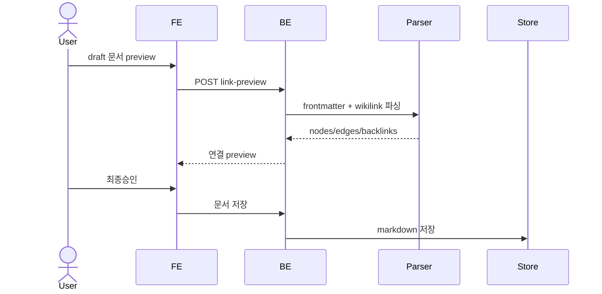

# 문서 링크와 그래프 연결 계약

AX 제품이 생성하는 모든 확정 문서는 Obsidian에서도 연결되어 보여야 하고, 제품 페이지도 같은 링크를 파싱해 문서 그래프를 구성해야 한다.

> 링크 데이터는 별도 중앙 DB 문서가 아니라 각 markdown 문서의 frontmatter와 본문 wikilink에 분산 저장한다. 본문 `[[ ]]`가 엣지의 단일 소스이고, frontmatter `up`은 lineage 오버레이다.

> 연결(connection)은 별도의 "연결 게이트"가 아니라 문서화 승인 게이트(③, AXKG-SPEC-004)의 AI 초안 안 `up:`/`[[ ]]`에서 발현된다. 초안 승인 시 이 링크가 그래프 엣지로 반영된다. 본문 링크/그래프 계약 자체는 이 spec이 SSOT다.

## 1. Context

### Meta

- Decision reference: AXKG-DEC-001, AXKG-DEC-002, AXKG-DEC-005(연결 후보 컨텍스트)
- Baseline reference: AXKG-BL-001
- Domain note: `Document Node`, `Wikilink Edge`, `Lineage Edge`, `Backlink`
- Graph output: 제품 그래프는 API 응답과 PostgreSQL `document_edges` cache로 제공한다.

### Business Requirement

reference, area/concept, baseline 문서가 생성될 때 연결 정보가 함께 남아야 한다. 작성자는 Obsidian에서 연결을 보고, 제품 페이지는 같은 markdown을 읽어 문서 카드, 사이드바, 그래프 뷰를 연결해야 한다.

### Scope

In scope:

- frontmatter 링크 필드 규약
- 본문 wikilink 규약
- Obsidian 호환 링크
- 제품 페이지의 링크 파싱 기준
- reference -> area/concept/project 연결 규칙

Out of scope:

- 그래프 시각화 UI 세부
- 실제 parser 구현
- 저장소/DB 선택

## 2. UX Contract

### Placement

문서 링크는 문서화 승인 게이트(③, AXKG-SPEC-004)의 초안 인라인 렌더와 확정 문서 상세에서 보여준다.

```text
+--------------------------------------------------+
| Document Detail                                  |
+--------------------------+-----------------------+
| Markdown body            | Linked Documents      |
| [[related-note]]         | Backlinks             |
|                          | Upstream / Downstream |
+--------------------------+-----------------------+
```

### U-1. Document Link Preview

- **상태**: 링크 없음, 링크 있음, 깨진 링크, lineage 링크 있음
- **문구**: 연결 문서 제목, 링크 타입, 연결 이유, 원본 wikilink
- **CTA**: `문서 열기`. 연결에 대한 개별 `승인`/`보류` 버튼은 없다 — 연결은 초안과 한 덩어리로 게이트 레벨 `피드백`/`승인`에만 딸린다(AXKG-SPEC-004).
- **기대 결과**: 사용자는 AI가 넣을 링크를 확정 문서 생성 전에 확인하고, 연결이 부적절하면 게이트 `피드백`으로 지적해 초안째 재생성받는다.

### U-2. Graph-based Navigation

- **상태**: 문서 선택됨, 백링크 있음, 상류/하류 있음
- **문구**: 이 문서가 참조한 문서, 이 문서를 참조한 문서, lineage upstream/downstream
- **CTA**: 링크 클릭
- **기대 결과**: 제품 페이지는 markdown의 wikilink와 frontmatter `up`을 읽어 문서 간 이동을 제공한다.

## 3. User Scenario

### S-1. AI — reference note에 링크를 포함해 생성

1. Reference draft 생성 시 AI는 연결 후보 컨텍스트(AXKG-SPEC-011: Graph RAG retriever top-N 관련 문서 + documents index 스냅샷)에서 관련 기존 문서를 찾는다. AI가 스스로 그래프를 탐색하지 않고, 주입된 컨텍스트 안에서만 연결을 만든다.
2. AI는 본문에 `[[target-stem]]` 또는 `[[target-stem|표시명]]` 형태의 Obsidian wikilink를 넣는다.
3. 특정 문서가 이 reference의 기반이거나 계보상 상류이면 frontmatter `up`에 target stem을 추가한다.
4. 제품은 문서화 게이트 인라인에서 초안과 함께 연결 목록을 보여준다.
5. 사용자가 게이트를 `승인`하면 wikilink와 `up`이 포함된 markdown이 확정된다(AXKG-SPEC-004).

### S-2. User — reference에서 기존 개념을 보충

1. 사용자가 기존 개념 보충 파생지식이 포함된 문서화 게이트를 `승인`한다(파생지식 개별 승인 없음, AXKG-SPEC-004).
2. 시스템은 기존 개념 note draft에 reference note wikilink를 본문에 추가한다.
3. reference가 해당 개념 보충의 근거이면 기존 개념 note frontmatter `up`에 reference stem을 추가한다.
4. 제품 페이지는 이 링크를 읽어 reference -> concept lineage를 표시한다.

### S-3. User — project baseline을 생성

1. 사용자가 project baseline 파생지식이 포함된 문서화 게이트를 `승인`한다(개별 승인 없음, AXKG-SPEC-004).
2. 시스템은 baseline 문서 본문에 근거 reference/source wikilink를 포함한다.
3. baseline frontmatter `links.related`에는 관련 reference/concept 링크를 사람이 읽는 추적용으로 남긴다.
4. 그래프 엣지는 본문 wikilink와 `up`에서 생성된다.

## 4. Interface Contract

### Link Syntax Contract

| Link | 용도 | Obsidian | 제품 페이지 |
|---|---|---|---|
| `[[stem]]` | 기본 연결 | 지원 | edge type `assoc` |
| `[[stem|label]]` | 표시명 있는 연결 | 지원 | edge type `assoc`, label ignored for target |
| `[[folder/stem]]` | 경로형 연결 | 지원 | target stem으로 정규화 |
| frontmatter `up: [stem]` | 계보/근거 연결 | 무시 또는 property로 표시 | edge type `lineage`, direction upstream -> current |

**코드 영역 안의 `[[ ]]`는 링크가 아니다**(2026-07-10 PLAN-009-T-038): 코드펜스(` ``` `/`~~~` 3개 이상, 미닫힘이면 문서 끝까지)와 인라인 코드스팬(같은 길이 backtick run 쌍, CommonMark 최소 규칙) **내부**의 `[[ ]]`는 링크 문법 예시일 뿐 실제 연결이 아니므로 파싱에서 제외한다. 원문에 링크 문법 예시(`` `[[ID]]` `` 등)가 있으면 AI 초안이 이를 본문에 복사하는데, 파서가 이를 링크로 인식하면 `BROKEN_WIKILINK`를 오탐한다(라이브 실측 2026-07-10, 2회). 링크 정규화 규칙(위 표) 자체는 불변이며, 코드 영역 제외만 파싱 앞단에 적용한다.

### Required Frontmatter

확정 문서는 최소 아래 필드를 가져야 한다.

| Field | Required | 설명 |
|---|---|---|
| `type` | yes | `reference`, `permanent`, `concept`, `baseline`, `decision`, `spec`, `work`, `source` — 이 8종이 제품 document_type 어휘의 SSOT다(DB enum 동일). `product`는 타입이 아니라 project destination 산출물의 묶음 명칭이며 실제 type은 `baseline`/`decision`/`spec`이다(AXKG-DEC-005) |
| `id` | optional | 제품 안에서 유일한 id. Obsidian 호환 resolve 보조용(resolve 우선순위 `stem→alias→id`에서 최후 순위). 없어도 stem/alias로 resolve되면 유효(2026-07-09 PLAN-009-T-018 필수→선택 강등, AXKG-DEC-005). 문서 템플릿에는 넣지 않는다 |
| `title` | yes | 문서 제목 |
| `aliases` | recommended | id와 사람이 찾을 별칭. `[[id]]` resolve용 |
| `up` | optional | lineage upstream stem 목록 |
| `source` | optional | 외부 URL. URL은 그래프 노드가 아니라 속성 |
| `links` | optional | 제품 문서 추적용 사람이 읽는 링크 묶음. 그래프 엣지 SoT가 아님 |

### Path Convention

확정 문서와 파생 문서는 아래 디렉토리 컨벤션을 따른다. 이 표가 경로 컨벤션의 **SSOT**이며, AXKG-SPEC-004의 문서화 게이트·Apply Executor는 이 표를 참조한다. executor는 이 컨벤션을 벗어난 경로를 `PATH_NOT_ALLOWED`로 거부한다(2026-07-09 PLAN-009-T-018, AXKG-DEC-005).

| 문서 | destination / suggestion_type | 디렉토리 |
|---|---|---|
| main reference | resource | `resources/` |
| main permanent note | area | `permanent/` |
| main baseline | project | `projects/` |
| 파생 신규 개념 | `create_new_concept` | `permanent/concepts/` |
| 파생 project baseline | `create_project_baseline` | `projects/` |
| 파생 기존 개념 보충 | `supplement_existing_concept`(modify) | 기존 문서 경로 그대로 |

- `concept`은 독립 document_type이며 경로 관례는 `permanent/concepts/*.md`다(파생지식 `create_new_concept`의 생성 위치).
- project destination의 baseline(및 파생 `create_project_baseline`)은 지식 볼트의 `projects/`에 생성한다. 코드레포 `products/**`(product-doc-pipeline 메타문서, @product-curator 소유)와 무관하며 섞지 않는다.
- **경로(디렉토리)는 시스템이 조립하며 AI가 결정하지 않는다**(2026-07-10 PLAN-009-T-040): 이 표는 경로 컨벤션의 SSOT이나, AI는 파일명/stem(`filename_candidate`/`target_stem`)만 산출하고 디렉토리 조립은 문서화 게이트 빌더가 이 표를 참조해 수행한다(AXKG-SPEC-004 §4 경로 결정 주체·공용 모듈 `services/document_paths.py`). executor의 `PATH_NOT_ALLOWED`는 안전망이다.

### Graph Edge Contract

| Edge Source | Edge Type | Direction | Notes |
|---|---|---|---|
| 본문 `[[ ]]` | `assoc` | none | Obsidian과 제품 페이지가 모두 읽는 기본 연결 |
| 본문 `[[ ]]` + frontmatter `up` | `lineage` | upstream -> current | `up`은 본문 링크의 타입/방향 오버레이 |
| frontmatter `links` only | none | none | 추적용 metadata. 그래프 엣지로 쓰지 않음 |
| `source: https://...` | none | none | 외부 URL 속성 |

### API Contract

| Method | Path | 요약 | 권한 |
|---|---|---|---|
| GET | `/documents/{document_id}/links` | 문서의 wikilink/up/backlink 조회 | owner |
| POST | `/documents/{document_id}/link-preview` | draft markdown에서 연결 preview 생성 | owner |
| GET | `/graph/documents` | 문서 그래프 노드/엣지 조회 | owner |

### Validation

| 필드/문법 | 규칙 |
|---|---|
| `up` | target stem이 본문 `[[ ]]`에도 있어야 함 |
| wikilink target | 파일명 stem 또는 alias로 resolve 가능해야 함 |
| duplicate stem | 제품 그래프 안에서 허용하지 않음 |
| frontmatter `links` | 그래프 엣지의 SoT로 사용하지 않음 |

### Case Matrix

| 에러 코드 | 백엔드 출력 | 프론트 출력 | 표시 위치 |
|---|---|---|---|
| `BROKEN_WIKILINK` | target resolve 실패 | 연결할 문서를 찾지 못했습니다. | Document Link Preview |
| `UP_WITHOUT_BODY_LINK` | `up`이 본문 링크에 없음 | 계보 링크는 본문 링크도 필요합니다. | Document Link Preview |
| `DUPLICATE_STEM` | stem 충돌 | 같은 파일 식별자가 이미 있습니다. | Document save |
| `PATH_NOT_ALLOWED` | Path Convention 위반 경로 | 허용되지 않은 문서 경로입니다. | Document save |

### Flow



## 5. Implementation Rules

- 본문 wikilink가 그래프 엣지의 단일 소스다.
- **코드펜스(` ``` `/`~~~`)·인라인 코드스팬 내부의 `[[ ]]`는 링크로 파싱하지 않는다**(2026-07-10 PLAN-009-T-038, 위 Link Syntax Contract): `extract_wikilinks`가 코드 영역을 먼저 제외하고, 이 제외는 `BROKEN_WIKILINK`를 판정하는 3곳(엣지 빌드·링크 preview·executor 본문 검사)에 자동 반영된다. 링크 정규화 규칙은 불변이다.
- lineage가 필요한 연결은 반드시 본문 wikilink와 frontmatter `up`을 함께 둔다.
- `up`에만 있고 본문에 없는 target은 invalid다.
- frontmatter `links`는 제품 문서 추적용 metadata이며, 제품 그래프 엣지로 사용하지 않는다.
- source URL은 `source` 속성으로 보존하고 그래프 노드로 만들지 않는다.
- 확정 문서의 본문 SoT는 Markdown 파일이며, PostgreSQL의 `documents.path`는 해당 파일의 위치를 가리킨다.
- PostgreSQL의 graph edge 저장은 조회 최적화용 cache이며, 언제든 Markdown에서 재빌드 가능해야 한다.
- 제품 페이지는 Obsidian과 같은 target 규칙을 따른다: resolve 우선순위는 `stem→alias→id`다. `id`는 선택 필드(최후 순위)이며, `id`가 없어도 stem/alias로 resolve되면 유효하다(2026-07-09 PLAN-009-T-018).
- 확정 문서·파생 문서의 경로는 Path Convention(위 §4) 컨벤션을 따르며, executor는 벗어난 경로를 `PATH_NOT_ALLOWED`로 거부한다.
- 깨진 링크 정책: **생성 경로에서는 거부, 사후 발견은 표시.** 초안 preview와 승인 executor는 resolve 불가 링크를 `BROKEN_WIKILINK`로 거부한다(제품이 깨진 링크를 새로 만들지 않음). `document_edges.is_broken`은 외부(Obsidian/git) 직접 편집으로 사후에 깨진 엣지를 재인덱스 시 cache에 표시하는 용도다.
- `concept`은 독립 document_type이며 경로 관례는 `permanent/concepts/*.md`다(파생지식 create_new_concept의 생성 위치).
- 그래프 노드는 문서(document_type 8종)뿐이다. `type=source` 문서(raw source record)는 `/graph/documents` 기본 노출에서 제외한다. AXKG-BL-001이 제안했던 `case`/`tool`/`person`/`organization` 별도 노드타입은 채택하지 않았다 — 문서=노드, 타입=document_type.
- 그래프 노드는 문서화 게이트가 산출하는 **PARA 지식 문서**(reference/permanent/baseline)뿐이다. 요약 확정([분류], AXKG-SPEC-003) 시 산출되는 **요약 문서(md)는 그래프 노드가 아니다**(2026-07-09 PLAN-009-T-015 확정) — `data/documents/summaries/{stem}.md`에 저장되는 보관용 side-output으로 인덱스/retriever/`/graph/documents`에 편입되지 않고, 요약 문서 → PARA 지식 문서 lineage도 없다.
- 확정 문서는 lifecycle status(`current`/`superseded`, AXKG-SPEC-004 Document Lifecycle·AXKG-DEC-005 D)를 갖는다. **`superseded` 문서는 `/graph/documents` 기본 노출에서 제외한다**(`source`·`deleted`와 같은 기준) — 박제 보존은 하되 최신 그래프는 `current` 문서만 구성한다. superseded 문서와 그것을 대체한 `current` 문서, 그리고 문서를 만든 게이트 revision/source(producing 링크)의 추적은 `documents`(DB)가 보유한다(AXKG-SPEC-004). lifecycle은 **`documents`(DB)에만** 두고 문서 frontmatter에는 스탬프하지 않는다(2026-07-09 PLAN-009-T-015 확정 — `.md`는 순수 본문, `status`/`version` 필드를 frontmatter에 넣지 않는다). 그래프 엣지 SoT(본문 `[[ ]]`)는 lifecycle과 무관하다.
- AI가 생성하는 reference, area/concept, baseline draft는 연결 후보와 연결 이유를 같이 보고해야 한다.
- 초안 AI에게는 유효한 stem/alias 목록(documents index 스냅샷)이 항상 제공되어야 하며(AXKG-SPEC-011), AI는 스냅샷 밖 target을 wikilink로 생성하지 않는다. 스냅샷 밖 링크는 link-preview/executor의 `BROKEN_WIKILINK` 검증에서 거부된다.
- 링크 검증은 초안 본문뿐 아니라 **파생지식 `draft_markdown`의 wikilink·`up`에도 동일하게** 적용된다: `BROKEN_WIKILINK`(resolve 실패)·`UP_WITHOUT_BODY_LINK`(본문 링크 없는 `up`)를 생성 경로에서 거부한다(2026-07-09 PLAN-009-T-018, executor 규칙은 AXKG-SPEC-004).

## 6. Verification

### Acceptance Criteria

- [ ] 생성된 reference draft 본문에 관련 문서 wikilink가 포함될 수 있다.
- [ ] lineage 연결은 본문 wikilink와 `up`에 모두 존재한다.
- [ ] 제품 페이지는 draft 저장 전 연결 preview를 보여준다.
- [ ] Obsidian에서 `[[stem]]` 링크가 깨지지 않아야 한다.
- [ ] 제품 페이지는 같은 markdown으로 문서 링크와 백링크를 구성한다.
- [ ] frontmatter `links`만 있는 관계는 그래프 엣지로 처리하지 않는다.

## 7. Open Questions

- `_graph.json` 파일 산출물은 MVP 범위에서 제외한다. 제품 그래프는 API 응답과 PostgreSQL `document_edges` cache로 제공한다.
- ~~요약 문서의 그래프 편입(PLAN-009-T-013)~~ → **확정: 그래프 노드 아님**(2026-07-09 PLAN-009-T-015): 요약 확정([분류], AXKG-SPEC-003) 시 산출되는 요약 문서(md)는 그래프 노드가 아니다 — document_type 어휘/인덱스/retriever/`/graph/documents`에 편입되지 않는 보관용 side-output(`data/documents/summaries/{stem}.md`)이며, 요약 문서 → PARA 지식 문서 lineage(`up:`)도 없다. 그래프 노드는 PARA 지식 문서(reference/permanent/baseline)뿐이다(위 Implementation Rules, SSOT AXKG-SPEC-003 §7).
- ~~**(개선 OQ, 관찰 실측 — 해소 아님) 코드스팬/펜스 내 wikilink 파싱 제외**: 원문에 링크 문법 예시(`[[ID]]` 등)가 있으면 AI 초안이 이를 본문에 복사하고, 파서가 코드스팬(`` `[[..]]` ``)·코드펜스 안의 `[[ ]]`까지 링크로 인식해 `BROKEN_WIKILINK`를 오탐한다(라이브 실측 2026-07-10, 2회).~~ → **해소**(2026-07-10 PLAN-009-T-038 코드 + 라이브 검증): `extract_wikilinks`가 코드펜스(` ``` `/`~~~` 3개 이상, 미닫힘=문서 끝까지)·인라인 코드스팬(같은 길이 backtick run 쌍, CommonMark 최소) 내부 `[[ ]]`를 파싱에서 제외한다. `BROKEN_WIKILINK` 판정 3곳(엣지 빌드·링크 preview·executor 본문 검사)에 자동 반영, 링크 정규화 규칙 불변. 계약은 위 Link Syntax Contract·Implementation Rules가 규정한다.
