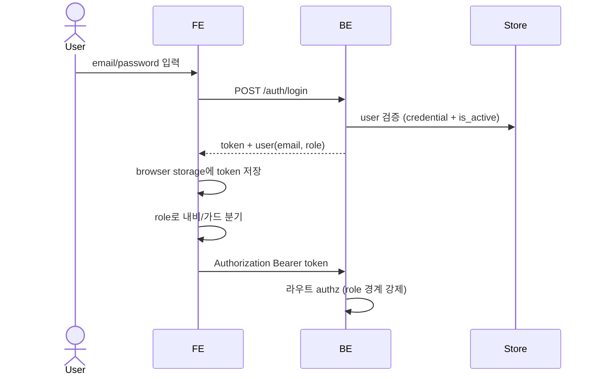

# 토큰 로그인 · 유저 · 역할 권한 경계

서버가 발급한 auth token으로 로그인하고, 사용자는 `admin` 또는 `staff` role을 가진다. role에 따라 접근할 수 있는 화면·API가 갈린다. **이 스펙은 제품 전체의 접근 경계 매트릭스 SSOT다** — 게이트/설정/소스 스펙은 이 경계를 참조만 한다.

> 초기 다중 사용자 운영 기준이다. refresh token, MFA, 외부 OAuth, 이메일 인증, 비밀번호 복잡도 규칙은 범위 밖이다. role은 `admin`/`staff` 2값으로 고정한다(AXKG-DEC-006).

## 1. Context

### Meta

- Decision reference: AXKG-DEC-001, AXKG-DEC-004, AXKG-DEC-006
- Baseline reference: AXKG-BL-001
- Domain note: `User`(email, password_hash, display_name, role, is_active), `AuthToken`, `ProtectedRoute`, `RoleGuard`
- Token storage: MVP는 `localStorage`

### Business Requirement

Source Inbox, 승인 게이트, 그래프 채팅, 설정은 개인/팀 지식 베이스를 다루므로 로그인 없이 접근하면 안 된다. 나아가 수집·분류·문서화 승인·설정·유저 관리 같은 **운영 권한**은 소수 운영자(admin)의 일이고, 완성된 그래프의 **열람·질의**는 다수 사용자(staff)의 일이다. 로그인 여부만으로는 이 둘을 나눌 수 없으므로 role 기반 접근 경계를 둔다.

### Scope

In scope:

- 로그인 페이지 / 로그아웃
- auth token 발급 + 브라우저 `localStorage` 저장
- role(`admin`/`staff`) 모델과 `is_active`
- 접근 경계 매트릭스(이 스펙이 SSOT)
- FE 가드 + BE 라우트 authz 이중 강제
- 유저 관리(생성 / 역할 변경 / 비활성화) = admin 전용
- 비밀번호 변경 = 본인 자율
- 활성 로스터 시드(email 멱등)

Out of scope:

- 공개 회원가입 (유저 생성은 admin 전용)
- 최초 로그인 강제 비밀번호 변경 (미채택 — AXKG-DEC-006)
- refresh token
- 3값 이상 role 세분화
- MFA / 외부 OAuth / 이메일 인증 / 비밀번호 복잡도 규칙

## 2. UX Contract

### Placement

로그인하지 않은 사용자는 모든 앱 페이지 접근 시 로그인 화면으로 이동한다. 로그인 후에는 role에 따라 내비게이션과 화면이 갈린다.

```text
+----------------------------------+
| AX Knowledge Graph               |
| Email                            |
| Password                         |
| [Login]                          |
+----------------------------------+
```

### U-1. Login Page

- **상태**: 기본, 입력 중, 제출 중, 실패, 비활성 계정
- **문구**: Email, Password, Login, 로그인 실패 메시지, 비활성 계정 안내
- **CTA**: `Login`
- **기대 결과**: 인증 성공 시 auth token을 브라우저에 저장하고 role의 기본 진입 화면으로 이동한다. `is_active=false` 계정은 로그인할 수 없다.

### U-2. Protected App Shell

- **상태**: 인증됨(admin), 인증됨(staff), token 없음, token 만료/무효
- **문구**: 사용자 email, role, 로그아웃
- **CTA**: `Logout`, 비밀번호 변경
- **기대 결과**: token이 없거나 무효하면 로그인 페이지로 이동한다. 내비게이션은 role이 접근 가능한 화면만 노출한다(staff에게 소스 inbox/게이트/설정/유저 관리 항목을 렌더하지 않는다). 로그아웃하면 브라우저 token을 삭제한다.

### U-3. User Management (admin 전용)

- **상태**: 유저 목록, 유저 생성, 역할 변경, 활성/비활성 토글
- **문구**: email, 이름, role, 활성 여부, 기본 비밀번호 `1234` 안내
- **CTA**: 유저 생성, 역할 변경, 비활성화/활성화
- **기대 결과**: admin만 이 화면에 접근한다. 유저를 생성하면 기본 비밀번호 `1234`로 로그인 가능한 계정이 만들어진다. 비활성화한 계정은 로그인할 수 없다.

## 3. User Scenario

### S-1. Staff — 그래프 열람·질의

1. staff 사용자가 로그인 페이지에서 email/password를 입력한다.
2. 시스템이 credential과 `is_active`를 검증하고 token을 발급한다.
3. 브라우저가 token을 저장하고 사용자를 `/graph`로 이동시킨다.
4. staff는 그래프 시각화와 채팅④을 사용한다. 소스 inbox·게이트·설정·유저 관리 항목은 내비에 없고, 해당 API를 직접 호출해도 BE가 거부한다.

### S-2. Admin — 유저 생성

1. admin이 유저 관리 화면에서 새 유저의 email과 이름, role을 입력한다.
2. 시스템이 기본 비밀번호 `1234`로 계정을 생성한다.
3. 새 유저는 `1234`로 로그인한 뒤 본인 비밀번호를 자율적으로 변경한다(강제 아님).

### S-3. User — 로그아웃

1. 사용자가 앱 상단 또는 설정에서 `Logout`을 누른다.
2. 브라우저가 저장된 auth token을 삭제한다.
3. 시스템이 사용자를 로그인 페이지로 이동시킨다.

## 4. Interface Contract

### Role Model

| Field | 설명 |
|---|---|
| `role` | `admin` 또는 `staff`. 2값 고정 |
| `is_active` | `false`면 로그인 차단. admin이 토글 |

### Access Boundary Matrix (SSOT)

**이 매트릭스가 제품 전체 접근 경계의 단일 원천이다.** 다른 스펙(게이트·설정·소스)은 이 경계를 참조만 하고 재서술하지 않는다.

| 영역 | 관련 스펙 | staff | admin |
|---|---|---|---|
| 그래프 시각화 + 채팅④ (`/graph`) | AXKG-SPEC-006 | ✅ | ✅ |
| 본인 계정 (me / 비밀번호 변경) | AXKG-SPEC-008 | ✅ | ✅ |
| 문서 라이브러리 (`/documents`, 읽기 전용 열람) | AXKG-SPEC-013 | ✅ | ✅ |
| 채팅→Inbox push (단일 쓰기 액션) | AXKG-SPEC-006/003 | ✅ | ✅ |
| 소스 Inbox 표면 (목록·조회·관리·수집·삭제/무시) | AXKG-SPEC-003 | ❌ | ✅ |
| 분류② 승인 게이트 | AXKG-SPEC-001/002 | ❌ | ✅ |
| 문서화③ 승인 게이트 | AXKG-SPEC-004 | ❌ | ✅ |
| 설정 (AI provider·프롬프트·템플릿) | AXKG-SPEC-007/009/010 | ❌ | ✅ |
| 유저 관리 (생성·역할 변경·비활성화) | AXKG-SPEC-008 | ❌ | ✅ |

- 승인 게이트의 승인 권한은 admin만 가진다. staff는 게이트 API·화면 표면 자체에 접근할 수 없다(내비 미노출 + 라우트 거부).
- 문서 라이브러리(`/documents`)는 읽기 전용 열람 표면으로 staff·admin 모두 허용한다(2026-07-11 확정). staff의 `/graph` 문서 열람과 동급이며 쓰기 조작(폴더 생성·이동·이름변경·삭제)은 없다. 페이지 계약은 AXKG-SPEC-013이 소유한다.
- **채팅→Inbox push는 staff·admin 모두 허용하는 단일 쓰기 액션이다**(2026-07-14 확정, AXKG-DEC-006 개정). 채팅④에서 AI가 제시한 방안을 Source Inbox로 push하는 동작으로, `source_channel=chat` source 1건을 `received`로 생성한다(flow·API 계약은 AXKG-SPEC-006, source 데이터 계약은 AXKG-SPEC-003). **이 액션은 인박스 쓰기 권한만 부여하며 인박스 표면(목록·조회·관리·삭제/무시)은 admin 전용 그대로다** — staff는 자신이 push한 것을 포함해 인박스 표면에 접근할 수 없다(비대칭: 쓰기 O, 읽기·관리 X). push는 사용자 명시 CTA로만 일어나고 자동 push는 없다. push된 chat source의 분류 승인도 admin만 가진다(게이트 무변경).
- 경계는 FE 내비/가드와 BE 라우트 authz 양쪽에서 이중으로 강제한다. FE 가드는 UX이고, BE authz가 실제 방어선이다.

### Seed Data

시드는 활성 22명 로스터(admin 3 + staff 19)를 email 기준 멱등으로 생성한다. 생성 기본 비밀번호는 `1234`다. 비활성 4명(박신아·최원·김사라·원영진)은 시드에서 제외한다. 레퍼런스의 `department`/`position`/`source_user_id`는 저장하지 않는다(role 매핑 소스일 뿐). 기존 seed 계정 `kknaks@medisolveai.com`은 admin으로 이 로스터에 흡수된다(원출처: PLAN-010).

| email | 이름 | role |
|---|---|---|
| `kknaks@medisolveai.com` | 이건학 | admin |
| `dante@medisolveai.com` | 전창원 | admin |
| `sykim@medisolveai.com` | 김수연 | admin |
| `dr.jinlee@kakao.com` | 이종진 | staff |
| `imkrmin@medisolveai.com` | 임주민 | staff |
| `srpark@medisolveai.com` | 박세림 | staff |
| `wychoi@medisolveai.com` | 최우영 | staff |
| `dreseul@medisolveai.com` | 한예슬 | staff |
| `ivorycho@medisolveai.com` | 조상아 | staff |
| `narsein@medisolveai.com` | 안덕환 | staff |
| `a1878h@medisolveai.com` | 윤아영 | staff |
| `cjs777@medisolveai.com` | 천수정 | staff |
| `oasis@medisolveai.com` | 한승진 | staff |
| `mint5948@medisolveai.com` | 박소은 | staff |
| `jso4093@medisolveai.com` | 전소은 | staff |
| `yg10004@medisolveai.com` | 신용진 | staff |
| `icran@medisolveai.com` | 서형석 | staff |
| `twin9774@medisolveai.com` | 김태우 | staff |
| `kalmia@medisolveai.com` | 변가영 | staff |
| `marin@medisolveai.com` | 김대정 | staff |
| `seyunjeong@medisolveai.com` | 정세윤 | staff |
| `jekwon@medisolveai.com` | 권정의 | staff |

`1234`는 개발/초기 운영 seed 비밀번호이며 운영 보안 기준으로 간주하지 않는다.

### API Contract

| Method | Path | 요약 | 권한 |
|---|---|---|---|
| POST | `/auth/login` | email/password로 auth token 발급 | public |
| GET | `/auth/me` | 현재 token의 사용자(email·role) 조회 | authenticated |
| POST | `/auth/logout` | 클라이언트 로그아웃 처리 | authenticated |

유저 관리(생성·역할 변경·비활성화)와 본인 비밀번호 변경의 구체 엔드포인트 shape·경로는 후속 BE work가 정의한다(이 스펙은 정책·권한 경계만 고정한다). 권한 규칙: 유저 생성·역할 변경·비활성화는 **admin 전용**, 비밀번호 변경은 **본인 자율**이다.

### Request / Response

`POST /auth/login` request:

| Field | Required | 설명 |
|---|---|---|
| `email` | yes | 사용자 email |
| `password` | yes | 사용자 password |

`POST /auth/login` response:

| Field | 설명 |
|---|---|
| `token` | API 요청에 사용할 auth token |
| `user.email` | 로그인 사용자 email |
| `user.role` | `admin` 또는 `staff` — FE 내비/가드가 사용 |

### Token Storage

| Item | Contract |
|---|---|
| browser storage | MVP는 브라우저 저장소에 token 저장 |
| request header | `Authorization: Bearer <token>` |
| logout | 브라우저 저장 token 삭제 |

### Protected Routes

다음 화면/API는 token이 필요하다. role 경계는 위 Access Boundary Matrix가 규정한다.

| Area | 최소 권한 | Examples |
|---|---|---|
| Source Inbox | admin | `/sources`, `/sources/manual` |
| Approval Gates | admin | `/gates/{gate_id}/feedback·retry·approve`, `/sources/{id}/classification-gates`, `/documentation-gates` 조회 (AXKG-SPEC-002/004) |
| Documents/Graph | staff | document link preview, graph documents |
| Graph Chat | staff | `/graph/chats`, `/graph/chats/{chat_id}/*` (AXKG-SPEC-006 run polling) |
| Chat→Inbox Push | staff | `POST /graph/chats/{chat_id}/push-to-inbox` (AXKG-SPEC-006) — 단일 쓰기 액션, 인박스 표면 접근 아님 |
| Settings | admin | `/settings/ai-provider`, `/prompts/*`, `/templates/*` |
| User Management | admin | 유저 목록/생성/역할 변경/비활성화 |
| 본인 계정 | staff | `/auth/me`, 비밀번호 변경 |

예외: `POST /api/v1/slack/commands`(Slack 슬래시 커맨드 intake)는 token이 아니라 Slack signing secret 검증으로 보호한다(AXKG-SPEC-003).

### Validation

| 필드 | 규칙 |
|---|---|
| `email` | 비어 있으면 안 됨 |
| `password` | 비어 있으면 안 됨 |
| `token` | 서버가 발급한 유효 token |
| `role` | `admin` 또는 `staff`만 허용 |
| `is_active` | 로그인 시 `true`여야 함 |

### Case Matrix

| 에러 코드 | 백엔드 출력 | 프론트 출력 | 표시 위치 |
|---|---|---|---|
| `INVALID_CREDENTIALS` | email/password 불일치 | 이메일 또는 비밀번호가 올바르지 않습니다. | Login Page |
| `INACTIVE_ACCOUNT` | `is_active=false` 계정 로그인 시도 | 비활성화된 계정입니다. 관리자에게 문의하세요. | Login Page |
| `MISSING_TOKEN` | Authorization header 없음 | 로그인이 필요합니다. | App Shell |
| `INVALID_TOKEN` | token 검증 실패 | 세션이 유효하지 않습니다. 다시 로그인해 주세요. | App Shell |
| `FORBIDDEN` | role이 접근 경계 밖 리소스 요청 | 접근 권한이 없습니다. | App Shell |

### Flow



## 5. Implementation Rules

- role은 `admin`/`staff` 2값이다. 그 이상으로 세분화하지 않는다.
- `is_active=false`는 로그인을 차단한다. admin이 토글한다.
- 접근 경계는 FE 가드(UX)와 BE 라우트 authz(방어선) 양쪽에서 강제한다 — FE 가드만으로 신뢰하지 않는다.
- 승인 게이트/설정/소스 inbox/유저 관리는 admin 전용이다. staff는 표면 자체에 접근할 수 없다.
- 유저 생성·역할 변경·비활성화는 admin 전용이다. 공개 가입은 없다.
- 유저 생성 시 기본 비밀번호는 `1234`다. 최초 로그인 강제 변경은 하지 않는다 — 비밀번호 변경은 본인 자율이다.
- 시드는 활성 로스터를 email 기준 멱등으로 생성한다. 재실행해도 중복 계정을 만들지 않는다. `department`/`position` 등 매핑 소스 필드는 저장하지 않는다.
- `1234`는 개발/초기 운영 seed 비밀번호이며 운영 보안 기준이 아니다.
- token은 브라우저에 저장하고 API 요청에 `Authorization: Bearer`로 전달한다. 로그아웃은 브라우저 token 삭제를 기준으로 한다.

## 6. Verification

### Acceptance Criteria

- [ ] 로스터 계정으로 로그인할 수 있고, 로그인 성공 시 브라우저에 token이 저장된다.
- [ ] `/auth/me`가 사용자 email과 role을 반환한다.
- [ ] staff는 `/graph`(그래프 + 채팅④)와 본인 계정만 접근할 수 있고, 소스 inbox/게이트/설정/유저 관리 항목이 내비에 없다.
- [ ] staff가 게이트/설정/소스/유저 관리 API를 직접 호출하면 BE가 `FORBIDDEN`으로 거부한다.
- [ ] admin은 모든 영역에 접근할 수 있다.
- [ ] admin이 유저를 생성하면 기본 비밀번호 `1234`로 로그인 가능한 계정이 만들어진다.
- [ ] 유저 생성·역할 변경·비활성화는 admin만 수행할 수 있다.
- [ ] 비밀번호 변경은 본인이 수행할 수 있고, 최초 로그인 시 강제되지 않는다.
- [ ] `is_active=false` 계정은 로그인할 수 없다(`INACTIVE_ACCOUNT`).
- [ ] 시드를 두 번 실행해도 email 기준으로 중복 계정이 생기지 않는다.
- [ ] token이 없거나 invalid면 로그인 페이지로 이동하고, 로그아웃하면 token이 삭제된다.

## 7. Open Questions

- admin의 타 유저 비밀번호 리셋(`1234` 재초기화) 제공 여부 — 미논의(AXKG-DEC-006 Open Question). 채택 시 admin 전용 액션으로 유저 관리 화면에 붙는다.
