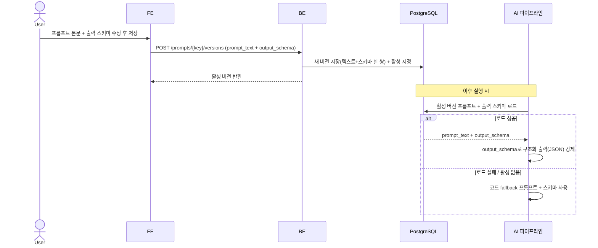
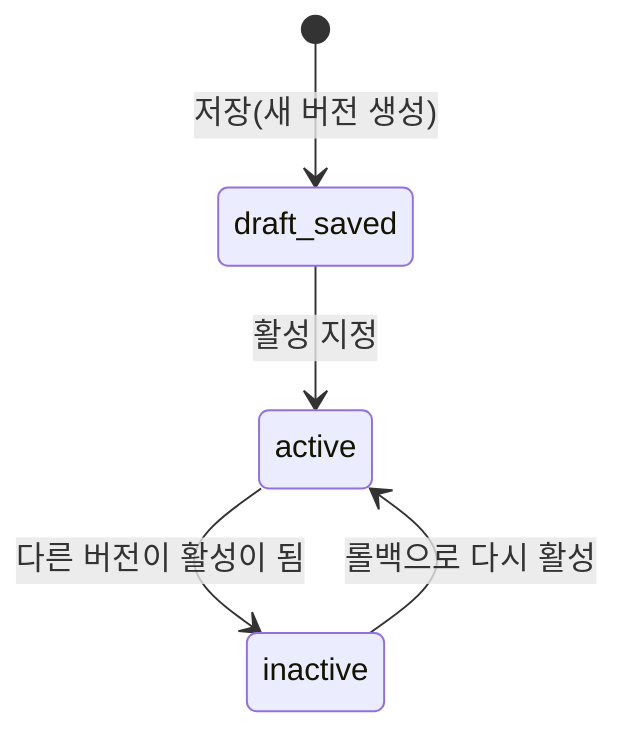

# AI 프롬프트·출력 스키마 동적 관리와 버전 롤백

AI 파이프라인이 사용하는 시스템 프롬프트와 그 **출력 형식(output JSON schema)** 을 코드 재배포 없이 설정에서 함께 편집·버저닝하고, 잘못된 버전은 이전 버전으로 롤백할 수 있게 보장한다.

> 기능/정책 묶음 단위의 **외부 계약** 문서다. client / QA / 외부 통합이 이 문서만 읽고 따를 수 있어야 한다.
> 프롬프트 저장 스키마·컬럼·repository/service 구조는 이 문서에 두지 않는다. 하나의 프롬프트 정의 = **프롬프트 텍스트 + 출력 JSON schema 한 쌍**이며, 이 둘은 한 버전으로 함께 저장·롤백된다.

## 1. Context

### Meta

- Decision reference: AXKG-DEC-002(운영 저장소 PostgreSQL), AXKG-DEC-004(MVP 기본값), AXKG-DEC-005(채택 근거·JSON Schema·조립 주체)
- Baseline reference: AXKG-BL-001
- Domain note: `Prompt`, `Prompt Version`, `output_schema`, `active version`, `prompt key`
- Storage: 프롬프트 정의(텍스트 + 출력 스키마)와 버전은 PostgreSQL(DEC-002 운영 저장소)에 둔다. 문서 SoT(Markdown)와 별개이며, 운영 설정 데이터다.
- 프롬프트 정의 = 텍스트 + 출력 JSON schema 한 쌍. 하나의 프롬프트는 하나의 구조화된 결과(JSON)를 낸다.
- 경계: provider·model 바인딩은 AXKG-SPEC-007 소관. 문서 뼈대(템플릿)는 AXKG-SPEC-010 소관. 이 spec은 프롬프트 텍스트 + 출력 스키마 + 버전만 다룬다. tool/workflow 정의는 범위 밖(Open Questions 참조).
- **프롬프트 층의 정의**: 프롬프트 텍스트는 이 실행을 *어떻게 작성할지*(본문 선별·톤·밀도·출력 작성 규율)를 담는 층이다 — 성격상 자주(동적으로) 다듬는다. 자료·대상의 **정의/정책/판단 규칙**(PARA 경계 등, what the material IS)은 프롬프트가 아니라 **가이드**(worker 프로젝트 컨텍스트) 소관이며, 출력 양식은 `output_schema`(JSON stage)/템플릿(문서화③)이다. 3층 taxonomy(가이드/프롬프트/템플릿·스키마)와 경계 테스트의 SSOT는 AXKG-SPEC-011 §4 Layer Taxonomy다. 프롬프트를 "무엇을 할지(what)만" 담는 것으로 보던 종전 뉘앙스는 taxonomy에 맞춰 작성 방법(how)으로 교정한다(AXKG-DEC-005 경계 재정렬).

### Business Requirement

AI 파이프라인의 시스템 프롬프트와 그 출력 형식을 코드에 하드코딩해 두면, 한 줄을 고치려 해도 재배포가 필요하다. 사용자는 설정에서 프롬프트 텍스트와 출력 JSON schema를 함께 편집·저장해 즉시 반영하고, 새 버전이 나쁘면 텍스트·스키마를 한 쌍으로 이전 버전으로 롤백할 수 있어야 한다. 활성 프롬프트 로드가 실패해도 AI 파이프라인은 코드 fallback으로 계속 동작해야 한다.

### Scope

In scope:

- 프롬프트 정의(텍스트 + 출력 JSON schema) 조회/편집
- 편집 시 텍스트·스키마를 한 버전으로 저장(기존 버전 보존)
- 활성 버전 지정
- 이전 버전으로 롤백(텍스트·스키마 한 쌍, 활성 버전 전환)
- AI 실행 시 활성 버전의 프롬프트 텍스트 + 출력 스키마 로드 → 구조화 출력(JSON) 강제, 실패 시 코드 fallback

Out of scope:

- tool 정의/설정, workflow 정의/렌더 (코드레포 `.agent.md`/`decision-pipe.md` 등에서 정의 → AI가 읽어 실행. 설정 UI 대상 아님)
- provider·model 선택 (AXKG-SPEC-007)
- 프롬프트 A/B 테스트, 자동 최적화, 평가 점수
- 프롬프트 다국어/변수 템플릿 엔진

## 2. UX Contract

### Placement

설정 페이지 안에 `Prompts` 섹션을 둔다. 설정 페이지는 `AI Provider`(AXKG-SPEC-007) + `Prompts`(이 spec) 2개 섹션으로 구성된다. 좌측 프롬프트 목록, 우측 편집기·버전 히스토리다.

```text
+----------------------------------------------------------+
| Settings                                                 |
+----------------+-----------------------------------------+
| Navigation     | Prompts                                 |
| - General      | +---------------+---------------------+ |
| - AI Provider  | | Prompt List   | Editor              | |
| - Prompts      | | - 요약 AI     | [프롬프트 본문]     | |
|                | | - 분류기 AI   | [출력 JSON schema]  | |
|                | |               | [저장 = 텍스트+스키마 한 버전] |
|                | |               +---------------------+ |
|                | |               | Version History     | |
|                | |               | v3 (활성) v2 v1     | |
|                | +---------------+---------------------+ |
+----------------+-----------------------------------------+
```

프롬프트 편집기는 **프롬프트 본문**과 **출력 형식(JSON schema)** 편집 영역을 나란히 둔다. `저장`은 이 둘을 한 버전으로 묶는다.

### U-1. Prompt List

- **상태**: 로딩, 목록 있음, 빈 목록, 에러
- **문구**: 프롬프트 이름/용도, 활성 버전 번호, 마지막 수정 시각
- **CTA**: `프롬프트 선택`(목록 항목 클릭)
- **기대 결과**: 항목을 선택하면 우측 편집기와 버전 히스토리가 해당 프롬프트로 채워진다. 프롬프트 키는 등록된 AI task definition(AXKG-SPEC-011의 4스테이지: 요약/분류/문서초안/graph chat)에서 파생한다. 이 spec은 키를 새로 발명하지 않는다.

### U-2. Prompt Editor (본문 + 출력 스키마)

- **상태**: 비어 있음(미선택), 편집 중, 저장 중, 저장 실패, 스키마 형식 오류
- **문구**: 프롬프트 본문(`prompt_text`), 출력 형식(`output_schema`, JSON schema) 편집 영역, 현재 활성 버전 표시, `저장하면 텍스트와 스키마가 한 버전으로 생성됩니다` 안내
- **CTA**: `저장`(본문이 비어 있지 않고 스키마가 유효한 JSON일 때 활성)
- **기대 결과**: `저장`하면 기존 버전을 덮어쓰지 않고 프롬프트 텍스트와 출력 스키마를 묶은 새 버전이 생성되며, 그 새 버전이 활성 버전이 된다. 저장 후 버전 히스토리에 새 버전이 활성으로 표시된다.

### U-3. Version History

- **상태**: 버전 1개, 여러 버전, 활성 버전 표시
- **문구**: 버전 번호, 생성 시각, 활성 여부, 버전 본문·스키마 미리보기
- **CTA**: `이 버전으로 롤백`, `버전 비교`
- **기대 결과**: `이 버전으로 롤백`을 누르면 선택한 과거 버전(텍스트 + 스키마 한 쌍)이 활성 버전이 된다(복사한 새 버전을 만들지 않고 활성 포인터를 이동). `버전 비교`는 두 버전의 텍스트·스키마 차이를 함께 보여준다.

### U-4. Save / Rollback Confirm

- **상태**: 닫힘, 열림
- **문구**: 저장/롤백 대상 프롬프트와 버전, 변경 후 활성 버전 안내
- **CTA**: `확인`, `취소`
- **기대 결과**: 활성 버전 전환(저장·롤백)은 확인 후 반영된다.

## 3. User Scenario

### S-1. User — 프롬프트와 출력 스키마를 함께 수정하고 새 버전으로 활성화

1. 사용자는 설정 `Prompts` 섹션에서 `분류기 AI 프롬프트`를 선택한다.
2. 편집기에 현재 활성 버전의 프롬프트 본문과 출력 스키마가 함께 채워진다.
3. 사용자는 본문과 출력 스키마(예: `destination_type`·`destination_reason`·`suggested_title`·`suggested_tags`·`confidence`)를 수정하고 `저장`을 누른다.
4. 시스템은 기존 버전을 보존한 채 텍스트와 스키마를 묶은 새 버전을 만들고, 새 버전을 활성 버전으로 지정한다.
5. 이후 AXKG-SPEC-001의 분류기 AI(②) 실행은 활성 버전의 프롬프트 + 출력 스키마를 로드해 그 스키마로 JSON 출력을 강제하고, 결과를 분류 게이트가 소비한다.

### S-2. User — 새 버전이 나빠서 이전 버전으로 롤백

1. 사용자는 새 버전 적용 후 결과 품질이 나빠졌다고 판단한다.
2. 사용자는 Version History에서 직전 버전을 선택하고 `이 버전으로 롤백`을 누른다.
3. 시스템은 활성 버전을 이전 버전으로 전환한다(텍스트와 스키마를 한 쌍으로, 과거 버전은 그대로 보존).
4. 이후 AI 실행은 롤백된 활성 버전의 프롬프트 + 스키마를 사용한다.

### S-3. System — 활성 프롬프트 로드 실패

1. AI 파이프라인(AXKG-SPEC-011의 4스테이지 중 하나)이 실행 시 활성 버전 프롬프트를 로드하려 한다.
2. 저장소 조회가 실패하거나 활성 버전이 없다.
3. 시스템은 코드에 내장된 fallback 프롬프트로 실행을 계속한다(파이프라인을 중단하지 않는다).
4. 로드 실패는 관찰 가능한 방식으로 기록되며, 이후 재시도 시 정상 로드되면 활성 버전을 다시 사용한다.

## 4. Interface Contract

### API Contract

| Method | Path | 요약 | 권한 |
|---|---|---|---|
| GET | `/prompts` | 프롬프트 목록(각 항목의 활성 버전 포함) 조회 | owner |
| GET | `/prompts/{key}` | 단일 프롬프트의 활성 버전 조회 | owner |
| GET | `/prompts/{key}/versions` | 프롬프트 버전 목록 조회 | owner |
| POST | `/prompts/{key}/versions` | 본문 저장(새 버전 생성 + 활성화) | owner |
| POST | `/prompts/{key}/rollback` | 지정 버전으로 활성 버전 전환 | owner |

> 프롬프트 관리 화면과 변경 API는 설정 소관으로 **admin 전용**이다 — staff는 접근할 수 없다. 접근 경계 매트릭스 SSOT는 AXKG-SPEC-008이며 여기서는 재서술하지 않는다.

### Request / Response

저장 요청은 프롬프트 `key`, 새 본문(`prompt_text`), 출력 스키마(`output_schema`)를 포함한다. 롤백 요청은 활성으로 만들 대상 `version`을 포함한다. 조회 응답은 활성 버전의 텍스트 + 스키마를 함께 반환한다. 필드는 계약 수준(`key`, `prompt_text`, `output_schema`, `version`, `is_active`, `updated_at`)으로만 정의하고, 저장 스키마 상세는 코드/migration이 SoT다.

### Validation

| 필드 | 규칙 |
|---|---|
| `key` | 존재하는 프롬프트 key여야 함 |
| `prompt_text` | 비어 있으면 안 됨 |
| `output_schema` | 유효한 JSON schema여야 함(파싱 가능) |
| `version` | 롤백 시 해당 프롬프트에 존재하는 버전이어야 함 |

### Case Matrix

| 에러 코드 | 백엔드 출력 | 프론트 출력 | 표시 위치 |
|---|---|---|---|
| `PROMPT_NOT_FOUND` | 존재하지 않는 프롬프트 key | 프롬프트를 찾을 수 없습니다. | Prompt List |
| `EMPTY_PROMPT_BODY` | 본문 없음 | 프롬프트 본문을 입력해 주세요. | Prompt Editor |
| `INVALID_OUTPUT_SCHEMA` | 출력 스키마 파싱 실패 | 출력 형식(JSON schema)이 올바르지 않습니다. | Prompt Editor |
| `PROMPT_VERSION_NOT_FOUND` | 롤백 대상 버전 없음 | 롤백할 버전을 찾을 수 없습니다. | Version History |
| `PROMPT_SAVE_FAILED` | 버전 저장 실패 | 프롬프트를 저장하지 못했습니다. 다시 시도해 주세요. | Prompt Editor |

### Flow



### State / Lifecycle

프롬프트 버전의 활성 여부 전이는 아래와 같다. 저장은 새 버전을 활성으로, 롤백은 기존 버전을 활성으로 만든다.



### Data Contract

| Resource | Field | 설명 |
|---|---|---|
| Prompt | `key` | 프롬프트 식별 키(등록된 AI task definition에서 파생, AXKG-SPEC-011 4스테이지) |
| Prompt | `active_version` | 현재 활성 버전 번호 |
| PromptVersion | `version` | 같은 key 안에서 증가하는 버전 번호 |
| PromptVersion | `prompt_text` | 프롬프트 본문 텍스트 |
| PromptVersion | `output_schema` | 이 버전의 출력 JSON schema. 텍스트와 한 쌍으로 저장/롤백 |
| PromptVersion | `is_active` | 활성 버전 여부 |
| PromptVersion | `updated_at` | 저장/변경 시각 |

출력 스키마는 다운스트림 소비의 계약이다. 예: 분류기 AI(②) `output_schema`의 `destination_type`·`destination_reason`·`suggested_title`·`suggested_tags`·`confidence`는 AXKG-SPEC-001 분류 게이트가 렌더하는 필드와 일치하고, 요약 AI(①) `output_schema`의 `title`·`summary`·`keywords`·`source_type`·`body_markdown`(요약 md 본문)은 요약 카드/frontmatter 시드와 일치한다. 요약은 md 본문(`body_markdown`)을 출력하되 원문 구조를 따르는 **적응형 출력**이라 고정 템플릿이 없고, 형식 규약은 프롬프트(작성 방법)가 담는다(템플릿은 문서화③ 전용, AXKG-SPEC-011 §4 Layer Taxonomy).

## 5. Implementation Rules

- 프롬프트 저장은 기존 버전을 수정하지 않고 프롬프트 텍스트와 출력 스키마를 묶은 새 버전을 만든다.
- 저장하면 새 버전이 활성 버전이 되고, 롤백하면 지정한 기존 버전(텍스트 + 스키마 한 쌍)이 활성 버전이 된다.
- 프롬프트 관리는 AXKG-SPEC-007의 provider·model 설정과 독립이다. 이 spec은 프롬프트 텍스트 + 출력 스키마 + 버전만 다룬다.
- AI 실행 시 활성 버전의 프롬프트 텍스트와 출력 스키마를 로드해 구조화 출력(JSON)을 강제하고, 로드 실패나 활성 버전 부재 시 코드 fallback 프롬프트·스키마로 실행을 계속한다. 로드·조립·소비 주체는 AXKG-SPEC-011의 AI 실행 파이프라인(백엔드 context builder)이며, 4개 스테이지(①요약 ②분류 ③문서초안 ④graph chat) 전부에 적용된다.
- `output_schema`는 다운스트림 소비 코드의 계약이다. 활성 스키마와 그 결과를 소비하는 코드(승인 게이트 렌더 등)는 서로 일치해야 한다.
- 프롬프트 키는 등록된 AI task definition(AXKG-SPEC-011의 4스테이지)에서 파생하며, 이 spec에서 새 키를 발명하지 않는다.

## 6. Verification

### Acceptance Criteria

- [ ] 설정 `Prompts` 섹션에서 프롬프트 목록과 각 활성 버전을 볼 수 있다.
- [ ] 프롬프트 편집기에서 본문과 출력 형식(JSON schema)을 함께 편집할 수 있다.
- [ ] 저장하면 텍스트와 출력 스키마가 한 버전으로 생성되고 활성 버전이 된다.
- [ ] 빈 본문 또는 유효하지 않은 JSON schema는 저장되지 않는다.
- [ ] Version History에서 롤백하면 텍스트·스키마가 한 쌍으로 활성 전환된다.
- [ ] AI 실행은 활성 버전의 프롬프트 + 출력 스키마로 구조화 출력(JSON)을 강제한다.
- [ ] 활성 프롬프트 로드 실패 시 AI 파이프라인은 코드 fallback으로 계속 동작한다.
- [ ] 프롬프트 관리는 provider·model 설정(AXKG-SPEC-007)과 분리되어 있다.

## 7. Open Questions

- `output_schema` 변경 시 다운스트림 소비 코드와의 호환을 어떻게 보장할지(런타임 검증 / 마이그레이션 / admin 책임). MVP는 단일 admin 전제로 편집을 허용하되, 스키마와 소비 코드 불일치 리스크를 admin이 책임진다. 단, `output_schema`가 관장하는 범위는 게이트 payload envelope(`classification.v1`/`documentation.v1`, AXKG-SPEC-002) 내부의 form/구조 필드까지다 — envelope 자체는 코드 고정이다(AXKG-DEC-005).
- ~~`output_schema` 표현 형식(JSON Schema vs zod-json 등)~~ → **JSON Schema로 확정**(AXKG-DEC-005). 편집기 검증(`INVALID_OUTPUT_SCHEMA`)과 구조화 출력 강제는 JSON Schema 기준이다.
- tool/workflow를 설정에서 조회/렌더/편집할지(후속 별도 스펙 여지). MVP는 프롬프트만.
- ~~프롬프트를 코드레포 `.agent.md`/`decision-pipe.md` 등 파일과 어떻게 동기화·우선순위 둘지(DB 우선 vs 파일 seed)~~ → **DB 우선으로 확정**. 초기 seed와 코드 fallback은 코드(마이그레이션/상수)가 소유하며, 별도 프롬프트/템플릿 파일 디렉토리는 두지 않는다.
- ~~tool/workflow introspection을 VoltAgent 바인딩으로 할지 자체 구현할지~~ → **자체 구현으로 확정**. VoltAgent(레거시 my-agent-app)는 참고용 레거시일 뿐 바인딩·의존 대상이 아니다.
