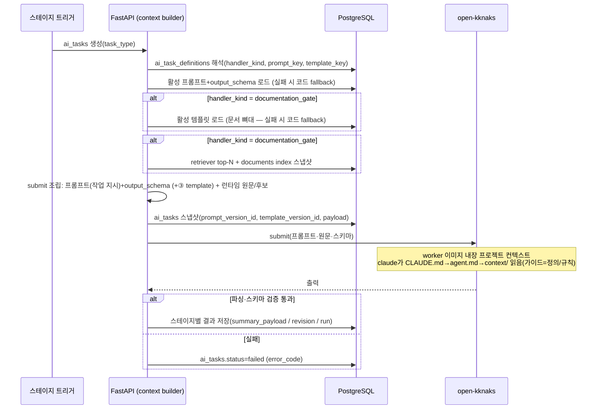

# AI 실행 파이프라인: 컨텍스트 조립·구조화 출력·실패 계약

제품의 4개 AI 스테이지(①요약 ②분류 ③문서초안 ④Graph RAG chat)가 **무엇을 입력받아, 어떻게 조립되고, 어떤 구조로 출력하며, 실패하면 어디에 어떻게 남는지**의 공통 실행 계약을 보장한다. 프롬프트/템플릿의 **관리**(AXKG-SPEC-009/010)와 분리된, **실행**의 SSOT다.

> 근거: AXKG-DEC-005. 각 스테이지의 UX·게이트 동작은 각 소관 spec(AXKG-SPEC-001/003/004/006)이, provider 바인딩은 AXKG-SPEC-007이, 프롬프트·템플릿 버전 관리는 AXKG-SPEC-009/010이 정의한다. 이 spec은 그 사이의 실행 경로만 다룬다.

## 1. Context

### Meta

- Decision reference: AXKG-DEC-005(실행 계약·3자 조립·연결 컨텍스트), AXKG-DEC-001(파이프라인), AXKG-DEC-003(retriever — 2026-07-14 개정: qmd 사이드카 2단 구조·리랭크 토글·graceful fallback)
- Baseline reference: AXKG-BL-001
- Domain note: `AI Stage`, `Context Builder`, `Assembly`, `Connection Candidate Context`, `Structured Output`, `Code Fallback`
- 실행 주체: 모든 AI 실행은 FastAPI가 `ai_tasks` row를 만들고 open-kknaks task로 위임한다. AI는 DB/Markdown을 직접 변경하지 않는다(AXKG-SPEC-004 executor 규칙).

### Business Requirement

요약 AI의 실행 계약이 AXKG-SPEC-003("SPEC-001 소관")과 AXKG-SPEC-001("summarized 이후만 다룸") 사이에서 비어 있었고, 문서초안 AI가 기존 그래프의 무엇을 보고 연결을 만드는지가 미정의였다. 실행 계약이 없으면 각 스테이지 구현이 서로 다른 방식으로 컨텍스트를 조립하고, 깨진 wikilink·파싱 실패가 사용자에게 일관되지 않게 표면화된다. 4스테이지가 같은 실행 규칙을 따라야 한다.

### Scope

In scope:

- 스테이지별 입력 컨텍스트 구성(context builder) 계약
- 문서초안 AI의 **연결 후보 검색 컨텍스트**(2단 하이브리드, AXKG-DEC-005)
- 실행 입력 3원천(프로젝트 컨텍스트·DB 아티팩트·런타임 데이터) 계약(소유 주체·전달 표면·버전 스냅샷)
- 구조화 출력(JSON Schema) 강제와 파싱·검증 실패 처리
- 실패의 `ai_tasks` 상태 매핑과 스테이지별 표면화
- 요약 스테이지의 `SourceMaterial` 입력 조립 계약(수집 adapter 자체는 AXKG-SPEC-012)
- 프롬프트/템플릿 로드 실패 시 코드 fallback 실행(AXKG-SPEC-009/010 S-3의 실행측 계약)

Out of scope:

- 프롬프트·템플릿 편집/버전 UI (AXKG-SPEC-009/010)
- provider·model·options 선택과 해석 (AXKG-SPEC-007)
- 게이트 승인/피드백 UX와 버전 규칙 (AXKG-SPEC-001/002/004)
- chat 세션/run polling UX (AXKG-SPEC-006)
- source type별 원문 수집 adapter 세부 (AXKG-SPEC-012)
- retriever 랭킹 알고리즘 세부·qmd 통합 형태·튜닝 숫자 (AXKG-DEC-003, 구현 소관 — 이 spec은 2단 실행·폴백 계약 표면만 규정)
- Apply Executor의 검증·적용 규칙 (AXKG-SPEC-004)

## 2. UX Contract

이 spec은 새 화면을 추가하지 않는다. 실행 상태는 기존 소관 spec의 화면으로 표면화된다.

| 스테이지 | 표면 위치 | 소관 spec |
|---|---|---|
| ① 요약 | Source Inbox 요약 초안 카드, `피드백`(세션 resume 재요약)·`분류`(분류 게이트 트리거)·`요약 재시도` CTA | AXKG-SPEC-003 |
| ② 분류 | 분류 게이트 카드, `재시도` CTA | AXKG-SPEC-001/002 |
| ③ 문서초안 | 문서화 게이트, `초안 생성 재시도` CTA | AXKG-SPEC-004 |
| ④ chat | run polling 상태, 실패 메시지 | AXKG-SPEC-006 |

## 3. User Scenario

### S-1. System — 요약 스테이지 실행

1. source가 등록되면(`received`) 시스템은 `ai_tasks(task_type=collect_source_summary)`를 만든다.
2. context builder가 AXKG-SPEC-012 Source Collection Adapter를 호출해 `SourceMaterial`(런타임 원문)을 얻는다. URL 원문 수집이 모두 실패하고 사용자 메모가 있으면 adapter는 `user_note` `SourceMaterial`(메모가 곧 원문)을 돌려준다(AXKG-SPEC-012 User Note Fallback). 요약 스테이지는 `SourceMaterial`의 형태를 구분하지 않고 동일하게 처리한다.
3. api는 활성 요약 프롬프트(**작성 방법** — 본문 선별·톤·밀도·출력 작성 규율)+output_schema(AXKG-SPEC-009)를 DB에서 로드해 원문과 함께 open-kknaks worker로 submit한다. **자료·대상의 정의·판단 규칙(가이드, 예: adapter별 원문 성격 정의)은 worker 이미지 내장 프로젝트 컨텍스트(진입 `CLAUDE.md → agent.md → context/`)가 담당하며 api는 그 파일을 로드하지 않는다**(§4 Layer Taxonomy). worker의 claude가 실행 디렉토리에서 가이드를 읽고, DB 프롬프트의 작성 방법대로 원문을 요약한다. `SourceMaterial`이 `content_format=user_note`인 경우(원문 미수집, 사용자 메모 기반), 요약은 **메모에 담긴 내용만으로 수행하고 메모에 없는 사실을 추측·창작하지 않는다** — 이는 출력 작성 규율(프롬프트 층 소관, §4 Layer Taxonomy)이며, 이 spec은 계약(입력 유형·금지 규칙)만 규정한다.
4. 출력(`title`·`summary`·`keywords`·`source_type`)이 스키마 검증을 통과하면 `sources.summary_payload`에 저장되고 `summarized`가 된다. 메모 기반 요약도 원문 기반 요약과 동일하게 `summarized`이며 payload에 구분 플래그를 두지 않는다.
5. 수집(URL 원문 실패 **AND** 메모 없음) 또는 실행이 실패하면 `ai_tasks.status=failed`가 보존되고 source는 `collection_failed`로 표면화된다(AXKG-SPEC-003). URL 수집이 실패해도 메모가 있으면 User Note로 성립하므로 `collection_failed`가 아니다.
6. 요약 초안은 이 시점에 `summary_payload` draft(DB 박제)로만 존재한다. 사용자가 요약을 확정([분류], AXKG-SPEC-003)하면 그 시점의 active 요약 버전이 **요약 문서(md)로 확정**된다 — draft(DB) → 확정(md)은 요약·문서화 공통 저장 패턴이다(§4 B). 이 md 생성은 요약 확정 지점이며, 뒤의 분류 게이트(②)는 destination metadata만 결정하고 md를 만들지 않는다.

### S-2. System — 문서초안 스테이지의 연결 후보 컨텍스트 조립

1. 분류 게이트가 `project`/`area`/`resource`로 승인되면 문서화 게이트와 `ai_tasks(generate_documentation_gate)`가 생성된다.
2. context builder는 source 요약·분류 결과를 질의로 Graph RAG retriever(AXKG-DEC-003)를 호출해 관련 기존 문서 top-N 후보(발췌 포함)를 얻는다. 이 중 보충(modify) 대상이 될 상위 후보는 발췌 대신 **전문(per-doc cap)**을 주입해 AI가 수정 전문을 낼 수 있게 한다(AXKG-SPEC-004 A1 modify).
3. context builder는 documents index 경량 스냅샷(`stem`·`aliases`·`title`·`document_type`)을 함께 주입한다.
4. 활성 destination 템플릿(AXKG-SPEC-010) → 활성 프롬프트(AXKG-SPEC-009) → output_schema 순으로 조립해 실행한다.
5. AI는 후보와 스냅샷 안에서만 `up:`/`[[ ]]` 연결과 `derived_suggestions`를 만들고, 각 연결에 `link_reason`을 남긴다(AXKG-SPEC-005).

### S-3. System — 구조화 출력 파싱 실패

1. AI 출력이 JSON 파싱에 실패하거나 output_schema 검증에 실패한다.
2. 시스템은 부분 결과를 소비하지 않고 해당 실행을 실패로 처리한다: `ai_tasks.status=failed`, `error_code=OUTPUT_SCHEMA_MISMATCH`(파싱 실패는 `OUTPUT_PARSE_FAILED`).
3. 실패한 task row는 불변으로 보존되고, 재시도는 `retry_of_task_id`로 새 row를 만든다(AXKG-SPEC-002/003 공통 규칙).
4. 스테이지 소관 spec의 실패 UI(재시도 CTA)가 표면화한다.

### S-4. System — 활성 프롬프트/템플릿 로드 실패 fallback

1. 실행 시 활성 프롬프트 버전 또는 활성 템플릿 버전 로드가 실패한다.
2. context builder는 코드 내장 fallback 프롬프트/스키마/템플릿으로 조립을 계속한다(파이프라인을 중단하지 않는다).
3. fallback 사용 사실은 `ai_tasks.payload`에 기록되고 관찰 가능해야 한다. 이때 `prompt_version_id`/`template_version_id`는 null이다.

## 4. Interface Contract

### Stage Execution Contract

| 스테이지 | task_type | handler_kind | 입력 컨텍스트 | 출력 | 소비처 |
|---|---|---|---|---|---|
| ① 요약 | `collect_source_summary` | `source_summary` | source URL + `SourceMaterial`(런타임 원문, AXKG-SPEC-012 — URL 수집 실패 시 메모 기반 `user_note` 포함) + DB 프롬프트(작성 방법)/output_schema. **요약 md는 템플릿 없음** — 원문 구조를 따르는 적응형 출력이라 형식 규약을 프롬프트가 담는다(§4 Layer Taxonomy). 자료 정의·규칙(가이드)은 worker 프로젝트 컨텍스트(§4 Layer Taxonomy). **(피드백 재생성 시) 사용자 피드백 + resume session**(아래 Feedback Regeneration Resume Wiring — 원문·지침 재전송 없이 세션 이어서) | `title`, `summary`, `keywords`, `source_type`, `body_markdown`(요약 md) | `sources.summary_payload`(draft DB 박제, 재생성 시 v1 보존 + v2 새 버전 — 덮어쓰기 아님, AXKG-SPEC-003/002) → **[분류] 확정 시 active 버전이 요약 문서(md)로 확정**(draft→확정 공통 패턴, §4 B), 요약 초안 카드(AXKG-SPEC-003 U-2) |
| ② 분류 | `generate_classification_gate`, `regenerate_classification_gate` | `classification_gate` | 요약 payload + PARA 분류 기준. **그래프 컨텍스트 없음**(연결은 ③ 소관, AXKG-SPEC-001 §5) | `classification.v1` form 필드(AXKG-SPEC-002) | 분류 게이트 revision |
| ③ 문서초안 | `generate_documentation_gate`, `regenerate_documentation_gate` | `documentation_gate` | 요약+확정 destination + **활성 템플릿** + **연결 후보 컨텍스트**(아래) + (재생성 시) 피드백·이전 세션 | `documentation.v1` payload: draft(markdown_full) + derived_suggestions + apply_plan 제안 | 문서화 게이트 revision |
| ④ chat | `graph_rag_chat` | `graph_rag_chat` | 질문 + retriever 결과(evidence 문서) + 세션 이력 | 답변 + evidence | `graph_chat_runs`/messages |

이 표의 `task_type` 목록이 제품 전체 `ai_tasks.task_type` enum의 SSOT다. AXKG-SPEC-002는 게이트 4종만 참조하고, 새 task_type은 이 표에 먼저 등재한다.

### Connection Candidate Context (③ 전용, AXKG-DEC-005)

문서초안 AI의 입력 컨텍스트에는 아래 두 단이 **항상** 포함된다.

| 단 | 내용 | 목적 |
|---|---|---|
| 1. retriever 후보 | Graph RAG 2단 retriever(1단 qmd 하이브리드 후보 발굴 + 2단 wikilink 그래프 확장, AXKG-DEC-003 2026-07-14 개정) top-N 관련 문서 — 각 후보는 `stem`, `title`, `document_type`, 본문 발췌. qmd 사이드카 장애 시 `keyword score + edge distance`로 graceful fallback | 연결 **관련성**: `up:`/`[[ ]]`·derived_suggestions의 실질 후보 |
| 2. index 스냅샷 | 전체 documents index의 경량 목록 — `stem`, `aliases`, `title`, `document_type` | 연결 **유효성**: 생성되는 wikilink target이 resolve 가능함을 보장 |

규칙:

- AI는 index 스냅샷에 없는 stem/alias를 wikilink target으로 생성하지 않는다. 스냅샷 밖 링크는 link-preview/executor의 `BROKEN_WIKILINK` 검증(AXKG-SPEC-005)에서 거부된다.
- 모든 연결 후보 채택에는 `link_reason`을 남긴다(AXKG-SPEC-004 DerivedSuggestion / AXKG-SPEC-005 Implementation Rules).
- **보충(modify, `supplement_existing_concept`) 대상이 되는 상위 후보 문서는 발췌가 아니라 전문(per-doc 길이 cap 적용)**으로 주입한다(2026-07-09 PLAN-009-T-018, AXKG-DEC-005). AI가 그 전문에 보충을 반영한 **수정 전문(`draft_markdown`)**을 출력하고 executor가 overwrite하기 때문이다(diff/patch 엔진 없음, AXKG-SPEC-004 A1 modify). 주입한 전문도 `ai_tasks.payload`에 스냅샷한다.
- top-N 기본값과 발췌 길이·전문 per-doc cap은 구현 기본값으로 두되, `ai_tasks.payload`에 실제 주입된 컨텍스트를 스냅샷한다.
- retriever는 chat(④)과 문서초안(③)이 **공유**하는 컴포넌트다(`domain.graph`). AXKG-DEC-003(2026-07-14 개정)의 **2단 retriever 전환은 이 공유 컴포넌트에 적용되므로 문서초안③의 후보 발굴에도 동일하다** — 1단 qmd 하이브리드 검색(리랭크 설정 토글·기본 off — 2026-07-14 T-006 CPU 실측 수용, GPU 배포 시 on 권장, 설정 표면 소유는 AXKG-SPEC-007), 2단 wikilink 그래프 확장. qmd 사이드카 장애 시 1단을 `keyword score + edge distance`로 자동 폴백하고(품질 강등, 사용자 실패 아님) 그 사실을 `ai_tasks.payload`에 관찰 가능하게 기록한다. 인덱싱은 사이드카가 소유한 주기적 증분 재인덱싱이라 실행 경로에 인덱싱 비용이 없다(확정 직후 반영까지 수분 staleness 허용).
- **용어 주의**: 위 표의 "연결 후보 컨텍스트 2단"(retriever 후보 + index 스냅샷)과 retriever 내부의 "2단 구조"(qmd 후보 발굴 + 그래프 확장)는 **다른 축**이다 — 후자는 전자의 1단(retriever 후보)을 만드는 방식이다.

### Layer Taxonomy (가이드/프롬프트/템플릿) — 제품 전체 cross-cutting SSOT

AI 스테이지의 실행 자산은 **역할이 다른 3층**으로 나뉜다. 이 3층(역할 축)이 1차 멘탈모델이고, 아래 Assembly Contract의 3원천(소유·전달 축)은 그 **전달 메커니즘**이다. 이 표와 경계 테스트가 제품 전체의 SSOT이며, AXKG-SPEC-009/010/001/003/004/006이 이 섹션을 참조한다.

| 층 (역할) | 담는 것 | 저장/배포 | 동적성 | ≡ 3원천(전달) |
|---|---|---|---|---|
| **가이드** | 자료·대상의 **정의 + 정책 + 판단 규칙**(PARA 경계 등). "이 대상이 본질적으로 무엇인가 / 어떻게 판정하는가" | worker 이미지 내장 프로젝트 컨텍스트(진입 `CLAUDE.md → agent.md → context/*.md`) | static(재빌드) | 원천 1 |
| **프롬프트** | 이 실행에서 **어떻게 작성할지** — 본문 선별·톤·밀도·출력 작성 규율을 담는 층. "이번 출력을 어떻게 만드는가"(성격상 스킬처럼 자주 다듬음) | DB `prompt_text`(AXKG-SPEC-009) | dynamic(즉시) | 원천 2(일부) |
| **출력 양식 ⑴ `output_schema`** | 출력 JSON의 **필드 구조(shape)만** — `title`/`summary`/`keywords`/`body_markdown:string` 등. 작다. md 뼈대를 여기 넣지 않는다. **JSON을 뱉는 모든 스테이지(①②③④)**가 가짐 | DB(AXKG-SPEC-009) | dynamic | 원천 2(일부) |
| **출력 양식 ⑵ 템플릿(md 뼈대)** | 고정 산출 타입의 **양식(뼈대)** — **별도 아티팩트**로, 조립 시 프롬프트에 주입한다(output_schema에 넣으면 응답 스키마가 비대해짐). **고정 산출 타입 스테이지(문서화③)에만 적용**: reference/permanent/project_baseline 문서 뼈대(AXKG-SPEC-010). 요약①은 원문 구조를 따르는 **적응형 출력**이라 고정 뼈대가 맞지 않아 템플릿이 없다(형식 규약은 프롬프트 소관). 분류②·채팅④는 md 산출이 없어 템플릿 없음 | DB(AXKG-SPEC-010) | dynamic | 원천 2(일부) |

"출력 양식"은 하나의 역할 층이지만 **서로 다른 두 아티팩트**(`output_schema`=shape, 템플릿=md 뼈대)로 구현된다 — 이 둘은 다른 것이다. `output_schema`와 템플릿을 한 층 셀에 합쳐 "JSON 단계는 output_schema가 곧 출력 양식/템플릿"으로 보던 종전 서술은 **폐기·정정**한다(A, 2026-07-09 PLAN-009-T-009): `output_schema`(shape)와 템플릿(md 뼈대)은 서로 다른 아티팩트다. 단 **템플릿은 문서화③ 전용**이고, **요약①은 원문 구조를 따르는 적응형 출력이라 고정 뼈대(템플릿)를 씌우지 않는다** — 요약 md의 형식 규약(원문 구조 추종·인용 `>`·엔티티 **볼드**·불확실은 "출처 미상" 정직 표기)은 **프롬프트(작성 방법)**가 담는다(2026-07-09 PLAN-009-T-011 정정 — T-009의 "요약도 템플릿" 부분 폐기). 요약①의 `body_markdown`은 여전히 output_schema의 필드로 출력된다(템플릿이 없을 뿐 md 본문은 출력함).

런타임 데이터(원천 3: ① `SourceMaterial` 원문, ③ 연결 후보 컨텍스트)는 매 실행의 입력 데이터이지 실행 자산 층이 아니다.

**저장 축은 직교(B)**: 위 3층(역할 축)·3원천(전달 축)은 **저장 방식**과 무관하다. **저장 모델은 각 단계 공통으로 `draft(DB 박제) → 확정(md)`이다**: 피드백 draft(요약 `summary_payload`·게이트 revision)는 DB(JSONB)에 v1/v2로 박제(피드백 히스토리)되고, 그 단계를 **다음으로 넘기는 순간 그 시점의 active 버전이 .md 파일(markdown_root)로 확정**된다(AXKG-DEC-002). **md 산출은 요약·문서화 두 단계 모두에서 일어난다** — 요약①은 [분류] 확정 시 **요약 문서(md)**, 문서화③은 게이트 승인 시 **PARA 지식 문서(md)**. 종전의 "md는 문서화(apply)에서만"·"요약=DB only" 서술은 전면 폐기한다(md 생성 지점은 두 곳). `.md`는 각 문서의 현재 최종본 하나이고 버전 히스토리는 DB draft 박제가 보유한다. 이 저장 축은 템플릿 유무·문서 lifecycle과 **직교**한다 — "템플릿이 없어서 DB에 둔다"·"템플릿이 없으니 md를 안 만든다" 같은 결합은 성립하지 않는다(요약①은 템플릿이 없지만 확정 시 md를 산출한다). 요약 문서 md는 `data/documents/summaries/{stem}.md`에 저장되는 **보관용(archival) side-output**이며 그래프 노드가 아니다 — 인덱스/retriever/`/graph/documents`·downstream 파이프라인 입력이 아니다(2026-07-09 PLAN-009-T-015 확정, SSOT AXKG-SPEC-003 §7 / AXKG-SPEC-005).

**경계 테스트 (규칙 vs 작성 방법 vs 양식):**

> "이 자료/대상의 본질에 대한 정의·판정 기준"이면 **가이드**, "이번 출력을 어떻게 만들지"면 **프롬프트**, "출력이 어떤 필드·뼈대여야 하는지"면 **템플릿/스키마**.

| 예 | 층 |
|---|---|
| PARA 경계 판단("마감 있으면 project") | 가이드(규칙) |
| adapter별 원문 성격 정의 | 가이드(정의) |
| "confidence 애매하면 낮춰라 / reason에 왜 애매한지 써라" | 프롬프트(출력 작성 규율) |
| "본문 선별하라 / body_markdown 상세히 옮겨라" | 프롬프트(작성 방법) |
| 출력 JSON 필드 계약(title/summary/keywords/body_markdown …) | output_schema(shape) |
| 문서 .md의 뼈대(어떤 섹션·frontmatter 골격) | 템플릿(md 뼈대) — 문서화③ 전용 |
| 요약 md의 형식 규약(원문 구조를 `##`로 추종·인용 `>`·엔티티 볼드·불확실은 "출처 미상" 표기) | 프롬프트(작성 방법) — 요약①은 적응형이라 템플릿 없음 |

**배포 특성 근거**: 작성 방법(how)은 스킬처럼 자주 튜닝해야 하는 자산인데 worker 이미지(가이드)에 두면 변경마다 재빌드가 필요하다. 그래서 작성 방법은 DB 프롬프트(즉시 반영)에 두고, 가이드에는 자주 바뀌지 않는 정의·규칙만 남긴다.

**이전 모델과의 관계(개정, 2026-07-09 PLAN-009-T-007)**: 종전 문구("프롬프트=무엇을 할지(what)만, 어떻게 하는지(how)는 프로젝트 컨텍스트가 담당")를 **뒤집는다**. 개정 후: **가이드=정의/정책/규칙(what the material IS), 프롬프트=작성 방법(how to write)**. 결정 정합은 AXKG-DEC-005(가이드/프롬프트 경계 재정렬)를 따른다. 실제 worker `context/*.md` ↔ DB 프롬프트 코드 재분할은 후속 단계다(§7 OQ).

**출력 양식 층 정정(개정, 2026-07-09 PLAN-009-T-009 → PLAN-009-T-011 재정정)**: `output_schema`(JSON shape)와 **템플릿(md 뼈대)**은 서로 다른 아티팩트다(이 구분은 유지). 템플릿은 output_schema에 넣지 않고 조립 시 프롬프트에 주입한다. 단 **템플릿은 문서화③ 전용**이다 — 요약①은 원문(출처)의 자체 구조를 따라가는 **적응형 출력**이라 고정 뼈대가 맞지 않고, 씌우면 현재의 좋은 품질을 오히려 해치므로 템플릿을 두지 않는다. 요약 md의 형식 규약은 프롬프트(작성 방법)가 담고, `body_markdown`은 output_schema 필드로 출력된다. T-009가 "요약도 템플릿"으로 본 부분은 **폐기**한다(PLAN-009-T-011). 결정 정합은 AXKG-DEC-005를 따른다.

**스테이지별 가이드 자산 현황(as-is)**: 요약①=`source-summary-guide.md`, 분류②=`para-classification.md`, 문서화③=`documentation-guide.md`, 채팅④=`graph-chat-rules.md`가 가이드(정의/규칙) 자산으로 **4스테이지 모두 전용 가이드 파일이 존재**한다(2026-07-09 PLAN-009-T-010에서 ③ `documentation-guide.md` 신설, 이후 T-016/T-020 갱신). ③ 가이드는 정의/규칙을 담되 링크 문법(wikilink/`up:`/필수 frontmatter/스냅샷 밖 링크 금지)의 상세는 중복하지 않고 `document-link-rules.md`를 SSOT로 참조하며, 원천은 AXKG-SPEC-004/005다. 위 가이드 파일들은 현재 정의/규칙과 작성 방법을 함께 담고 있으며, 작성 방법 부분을 DB 프롬프트로 분리하는 것은 후속 단계다(§7).

### Assembly Contract (실행 입력 3원천 = Layer Taxonomy의 전달 축, AXKG-DEC-005)

AI 실행 입력은 **소유 주체가 다른 3원천**으로 나뉜다. 이 3원천은 위 Layer Taxonomy(역할 축)의 **전달 축**이다 — 원천 1 ≡ 가이드, 원천 2 = 프롬프트(작성 방법) + 템플릿/스키마(출력 양식), 원천 3 = 런타임 데이터(층 아님). worker가 claude를 프로젝트 컨텍스트 안에서 실행하고(진입 `CLAUDE.md → agent.md → context/`), api는 작성 방법(프롬프트)·출력 양식·원문만 공급한다.

| 원천 | 내용 | 소유·전달 |
|---|---|---|
| 1. 가이드(정의·정책·판단 규칙) ≡ 층: 가이드 | 스테이지별 자료·대상의 정의/정책/판단 규칙(PARA 경계 등) — 진입 `CLAUDE.md → agent.md → context/*.md`. 작성 방법(how)은 원천 2로 이동(§Layer Taxonomy) | **worker 이미지에 내장**(빌드 시점 고정). claude가 실행 작업 디렉토리에서 스스로 읽는다. **api는 로드·주입하지 않는다** |
| 2. DB 아티팩트(작성 방법·출력 양식) ≡ 층: 프롬프트 + output_schema + 템플릿 | 활성 프롬프트 본문(**작성 방법** — 본문 선별·톤·밀도·출력 규율) + `output_schema`(출력 JSON shape), **(③) 활성 템플릿 뼈대**(출력 양식 md — 문서화③ 문서 뼈대) | api가 DB에서 활성 버전 로드 → submit으로 전달. 실행마다 `prompt_version_id`(+③ `template_version_id`) 스냅샷 |
| 3. 런타임 데이터(실행 입력, 층 아님) | (①) `SourceMaterial` 원문, (③) 연결 후보 컨텍스트 2단 | api가 런타임 상태에서 구성 → submit으로 전달. `ai_tasks.payload`에 스냅샷 |

- 조립·전달 주체는 **백엔드 context builder(원천 2·3)**이고, **가이드(자료·대상의 정의/정책/판단 규칙, 원천 1)는 api가 조립하지 않는다** — worker 프로젝트 컨텍스트가 담당한다. 이전의 "api가 지침까지 프롬프트 한 방에 인라인 3자 조립(template→prompt→output_schema)하고 claude엔 프로젝트를 주지 않는" 모델을 대체한다(2026-07-08, AXKG-WORK-002 Phase 3 라이브 e2e).
- **문서초안③만 원천 2에 활성 템플릿이 더해진다**(문서 뼈대). 템플릿은 문서화 handler(`documentation_gate`)에서만 조립되고, 조립 시 프롬프트에 주입하며 `output_schema`에 넣지 않는다. 사용 버전은 `ai_tasks.template_version_id`로 스냅샷한다. ③의 템플릿 바인딩은 `ai_task_definitions.template_key`다. 요약①·분류②·채팅④는 템플릿 없이 `output_schema`만 조립한다 — 요약①은 md(`body_markdown`)를 출력하지만 원문 구조를 따르는 적응형이라 고정 뼈대(템플릿)를 두지 않고, 형식 규약은 프롬프트(작성 방법)가 담는다(§4 Layer Taxonomy).
- **DB 프롬프트 본문에 `{{template}}` 같은 변수를 두지 않는다**(변수 엔진은 AXKG-SPEC-009 out of scope). 프롬프트는 **작성 방법**(이 실행을 어떻게 작성할지 — 본문 선별·톤·밀도·출력 작성 규율)을 담고, 자료·대상의 **정의/정책/판단 규칙**(what the material IS, PARA 경계 등)은 가이드(프로젝트 컨텍스트)가 담당한다(§4 Layer Taxonomy).
- `output_schema`는 **JSON Schema**다. 게이트 payload envelope(`classification.v1`/`documentation.v1`)은 코드 고정이며, output_schema는 envelope 내부의 form/구조 필드만 관장한다.
- 런타임 원문(`SourceMaterial`)이 claude에 닿는 방식은 **submit 프롬프트 인라인으로 확정**(2026-07-08, AXKG-WORK-002 Phase 3 라이브 e2e) — builder가 원문을 데이터 블록(`source`+`content`/`content_chunk_*`)으로 인라인 조립해 submit한다. workspace 파일로 넘기는 것은 가이드(정의/규칙, 원천 1)뿐. §7 OQ 해소.

### Feedback Regeneration Resume Wiring (①②③ 공통)

피드백 기반 재생성 실행은 **원 실행의 open-kknaks 세션을 이어서(resume)** 수행한다. 요약(①)·분류 게이트(②)·문서초안 게이트(③) 모두 같은 배선을 쓴다. 목적: 원문·방법 지침·이전 출력을 재전송하지 않고 세션 컨텍스트를 재사용해, 컨텍스트 소모 없이 피드백만 반영한 새 버전(v2)을 빠르게 생성한다.

| 단계 | 규칙 |
|---|---|
| 1. resume 대상 계산 | context builder가 `resolve_resume_session`으로 대상 세션 id를 계산한다. 계산 규칙(대상 revision → ai_task fallback → 없으면 stateless)의 SSOT는 AXKG-SPEC-002 open-kknaks Session Rule이다 |
| 2. submit 배선 | 얻은 session id를 open-kknaks submit에 **`options.resume=true` + session 전달**로 배선한다. 재생성 submit 본문에는 사용자 피드백만 싣고, **원문(`SourceMaterial`)·방법 지침·이전 payload는 재인라인하지 않는다**(세션이 보유) |
| 3. stateless fallback | resume 세션 id가 없으면(둘 다 null) stateless로 실행하되, 이때만 source/이전 payload/feedback을 컨텍스트에 모두 인라인한다(AXKG-SPEC-002) |
| 4. session id 저장 | 재생성 응답의 새 session id는 기존과 동일하게 새 `ai_tasks.open_kknaks_session_id`(+②③ revision)에 저장한다. 저장 계약은 변경 없음 |

- 요약(①)의 재생성 대상은 `sources.summary_payload`(draft, DB 박제; [분류] 확정 시 active 버전이 요약 문서 md로 확정)이며, resume 세션 원천은 직전 요약 실행 `ai_tasks.open_kknaks_session_id`다. 요약 초안은 게이트 revision(`approval_gate_revisions`)이 아니라 `summary_payload`에 저장되되, 재생성은 **v1을 덮어쓰지 않고 새 버전(v2)을 박제(immutable)로 남긴다**(v1 read-only 보존, AXKG-SPEC-003/002 · AXKG-DEC-005 C). 요약 재생성의 `task_type` 바인딩(`collect_source_summary` 재사용 여부)은 BE 구현(AXKG-WORK-002 Phase 6)에서 확정한다.
- 인프라 현황(2026-07-08): `ai_tasks.open_kknaks_session_id` 저장·`resolve_resume_session` 계산은 구현됨. **`options.resume` 실제 전달 배선만 미완**(AXKG-WORK-002 Phase 6 / 코드 T-016 소관) — 이 spec은 그 배선 계약을 규정한다.

### Validation

| 항목 | 규칙 |
|---|---|
| AI 출력 | JSON 파싱 가능해야 하고 활성(또는 fallback) output_schema 검증을 통과해야 함 |
| wikilink target | index 스냅샷의 stem/alias로 resolve 가능해야 함(AXKG-SPEC-005) |
| 조립 스냅샷 | 성공 실행의 `ai_tasks`는 사용한 `prompt_version_id`(+ 문서화③은 `template_version_id`)를 가져야 함. fallback 실행은 null + payload 기록 |
| 부분 소비 금지 | 스키마 검증 실패 출력은 어떤 필드도 소비하지 않음 |

### Case Matrix

| 에러 코드 | 백엔드 출력 | 표면화 | 표시 위치 |
|---|---|---|---|
| `CONTENT_FETCH_FAILED` | Source Collection Adapter 수집 실패 | source `collection_failed` + `요약 재시도` | Source Inbox (AXKG-SPEC-003) |
| `OUTPUT_PARSE_FAILED` | AI 출력 JSON 파싱 실패 | task failed + 스테이지별 재시도 CTA | 각 스테이지 화면 |
| `OUTPUT_SCHEMA_MISMATCH` | output_schema 검증 실패 | task failed + 스테이지별 재시도 CTA | 각 스테이지 화면 |
| `PROMPT_FALLBACK_USED` | 활성 프롬프트 로드 실패(실행은 계속) | 관찰 로그/payload 기록 | 실패 아님 |
| `TEMPLATE_FALLBACK_USED` | 활성 템플릿 로드 실패(실행은 계속) | 관찰 로그/payload 기록 | 실패 아님 |
| `RETRIEVER_FALLBACK_USED` | qmd 사이드카 장애로 1단 후보 발굴을 `keyword score + edge distance`로 폴백(실행은 계속) | 관찰 로그/payload 기록 | 실패 아님 (품질 강등, ③④ 공통) |

### Flow

### State / Lifecycle

이 spec은 새 상태를 만들지 않는다. 실행 결과는 기존 상태 모델로 매핑된다.

| 실행 결과 | 매핑 |
|---|---|
| ① 성공 / 실패 | `sources.summarized` / `sources.collection_failed` (AXKG-SPEC-003 SSOT) |
| ②③ 성공 / 실패 | 게이트 revision 생성 / 게이트 `failed` + 재시도 (AXKG-SPEC-002) |
| ④ 성공 / 실패 | `graph_chat_runs.succeeded` / `failed` (AXKG-SPEC-006) |
| 공통 | `ai_tasks.status` = `queued→running→succeeded|failed|cancelled`, 재시도는 `retry_of_task_id` 새 row |

## 5. Implementation Rules

- 모든 AI 실행은 등록된 `ai_task_definitions`를 거친다. handler 코드는 동적이지 않다(설정에서 임의 코드 실행 불가).
- 요약 스테이지는 AXKG-SPEC-012 Source Collection Adapter가 반환한 `SourceMaterial`을 입력 컨텍스트로 사용한다. 수집 실패는 `collection_failed`로 표면화한다.
- `SourceMaterial.content_text`가 최대 입력 길이를 초과하면 요약 스테이지가 chunk로 나눠 각각 요약한 뒤 하나의 summary로 병합한다(AXKG-SPEC-012 후처리 계약 연동). chunk 요약도 같은 output_schema를 따르고, 병합 결과만 `sources.summary_payload`에 저장한다.
- 저장 모델은 각 단계 공통이다(§4 B): 피드백 draft(요약 `summary_payload`·게이트 revision)는 DB에 v1/v2로 박제(피드백 히스토리)하고, 그 단계를 다음으로 넘기는 순간 그 시점의 active 버전을 `.md`로 확정한다. **md 산출 지점은 두 곳** — 요약 확정([분류], AXKG-SPEC-003)과 문서화 게이트 승인(AXKG-SPEC-004)이다. 분류 게이트(②)는 destination metadata만 결정하고 md를 만들지 않는다. 문서(md 산출물)와 문서화 게이트(승인 단계)는 별개 개념이며, "md는 문서화 게이트에서만 생긴다"는 서술은 틀리다 — 요약 확정도 md를 만든다. 요약 문서 md는 `data/documents/summaries/`에 저장되는 보관용 side-output(그래프 노드 아님)이며, 재확정 시 현재 active 버전으로 overwrite한다(§7 결정).
- 분류 스테이지(②)에는 그래프 컨텍스트를 주입하지 않는다. 연결 생성은 문서초안 스테이지(③)의 전속 책임이다.
- 문서초안 스테이지(③)의 입력에는 연결 후보 컨텍스트 2단(retriever top-N + index 스냅샷)이 항상 포함된다. 보충(modify) 대상 상위 후보는 발췌가 아니라 전문(per-doc cap)으로 주입한다(A1 modify overwrite 모델, 2026-07-09 PLAN-009-T-018 · AXKG-SPEC-004).
- api context builder는 DB 아티팩트(활성 프롬프트=**작성 방법**·`output_schema`=출력 JSON shape·**③ 활성 템플릿**=문서 md 뼈대)와 런타임 데이터(① 원문·③ 연결 후보)만 submit으로 조립·전달하고, 실행마다 사용 버전을 `ai_tasks`에 스냅샷한다. 템플릿은 문서화③에만 조립되며 output_schema와 별개 아티팩트로 프롬프트에 주입한다(§4 Layer Taxonomy A). 요약①은 md(`body_markdown`)를 출력하지만 원문 구조를 따르는 적응형이라 템플릿이 없고 형식 규약은 프롬프트가 담는다. 자료·대상의 정의/정책/판단 규칙(가이드)은 조립하지 않는다 — worker 이미지 내장 프로젝트 컨텍스트(진입 `CLAUDE.md → agent.md → context/`)를 claude가 실행 디렉토리에서 읽는다(§4 Layer Taxonomy). api는 가이드 파일(`source-summary-guide.md` 등)을 로드하지 않는다. 현재 가이드 파일에 함께 있는 작성 방법을 DB 프롬프트로 옮기는 코드 재분할은 후속 단계다(§7 OQ).
- output_schema는 JSON Schema이며, 구조화 출력을 강제한다. 검증 실패 출력은 소비하지 않고 task를 실패 처리한다.
- 활성 프롬프트/템플릿 로드 실패는 실행을 중단시키지 않는다. 코드 fallback으로 계속하되 관찰 가능하게 기록한다.
- 실패한 `ai_tasks`는 불변 보존하고, 재시도는 `retry_of_task_id`로 연결된 새 row다.
- 재생성(피드백) 실행은 요약(①)·분류 게이트(②)·문서초안 게이트(③) 모두 원 실행의 `open_kknaks_session_id`를 resume로 이어서 사용한다. `resolve_resume_session` → `options.resume=true` + session 전달 배선이며, 재생성 submit에는 피드백만 싣고 원문·방법 지침·이전 payload는 재전송하지 않는다(§4 Feedback Regeneration Resume Wiring, 계산 규칙 SSOT는 AXKG-SPEC-002).

## 6. Verification

### Acceptance Criteria

- [ ] 4개 task_type 전부가 `ai_task_definitions` 해석 → 조립 → 실행 → 스냅샷의 같은 경로를 탄다.
- [ ] 문서초안 실행의 `ai_tasks.payload`에 retriever 후보와 index 스냅샷이 기록된다.
- [ ] 문서초안 출력의 모든 wikilink target이 index 스냅샷의 stem/alias로 resolve된다(스냅샷 밖 링크는 `BROKEN_WIKILINK`로 거부).
- [ ] 성공한 문서화③ 실행의 `ai_tasks`에 `prompt_version_id`와 `template_version_id`가 스냅샷된다(①②④는 `prompt_version_id`만).
- [ ] output_schema(JSON Schema) 검증 실패 시 어떤 필드도 소비되지 않고 task가 실패 처리된다.
- [ ] 요약 수집 실패가 `collection_failed` + `요약 재시도`로 표면화된다.
- [ ] 활성 프롬프트/템플릿 로드 실패 시 코드 fallback으로 실행이 계속되고 그 사실이 기록된다.
- [ ] 분류 스테이지 입력에 그래프 컨텍스트가 없다.
- [ ] 피드백 재생성(①②③) submit에 `options.resume=true` + resume session이 배선되고, 원문·방법 지침·이전 payload가 재전송되지 않는다(resume 세션 없을 때만 stateless 인라인).

## 7. Open Questions

- Source Collection Adapter의 실행 위치(FastAPI 내 fetcher vs worker 위임)는 구현 시 결정한다. 어느 쪽이든 AXKG-SPEC-012의 adapter 계약과 이 spec의 실패 매핑을 따른다.
- retriever top-N 기본값과 후보 발췌 길이는 구현 기본값으로 시작하고, 초안 품질 관찰 후 조정한다. (2026-07-14 PLAN-013-T-001 확장) qmd 2단 retriever의 나머지 튜닝 숫자(edge 타입 가중치·hop 감쇠 함수·top-K)와 qmd 사이드카 통합 형태(subprocess CLI vs MCP)·인덱싱 증분 배선도 같은 "구현 기본값으로 시작, 관찰 후 조정" 패턴으로 둔다. 이 항이 retriever 튜닝·통합 OQ의 SSOT이며 AXKG-DEC-003·AXKG-SPEC-006이 참조한다. (2026-07-14 PLAN-013-T-007 실측 수용) 두 항목이 이 OQ에서 확정으로 빠졌다: **리랭크 기본값 = off**(CPU 실측·설정으로 on·GPU 권장), **인덱싱 = 사이드카 소유 주기적 증분 재인덱싱**(qmd MCP가 index/update 툴 미노출이라 api 이벤트 구동 불가·수분 staleness 허용, "실행 경로 인덱싱 비용 0" 계약 불변).
- ~~요약 방법 지침 프로젝트 컨텍스트 위치와 런타임 원문 전달 방식~~ → **확정**(2026-07-08, AXKG-WORK-002 Phase 3 라이브 e2e): 가이드(정의/규칙)는 `apps/worker/workspace/`(worker 이미지 내장, claude가 실행 디렉토리에서 Read), 런타임 원문(`SourceMaterial`)은 **submit 프롬프트 인라인 데이터 블록**으로 전달. api는 가이드 파일을 로드하지 않고 원문은 런타임 데이터로만 넘긴다.
- **가이드/프롬프트 코드 재분할**(§4 Layer Taxonomy 후속): 현재 worker 가이드 파일(`source-summary-guide.md`·`para-classification.md`·`graph-chat-rules.md`)에 정의/규칙과 작성 방법이 함께 섞여 있다. taxonomy에 맞춰 **작성 방법은 DB 프롬프트로, 정의/규칙은 worker 가이드로** 물리 재분할하는 코드 작업(어느 문장이 어디로 가는지 포함)은 후속 단계다(profile-be 발주 예정). 이 spec은 목표 taxonomy·경계까지만 규정하고 파일 재구성 세부는 발명하지 않는다.
- ~~**문서화③ 전용 가이드 파일 신설 여부**~~ → **해소**(2026-07-09 PLAN-009-T-010): ③ 전용 가이드 `documentation-guide.md`를 신설했다(정의/규칙 소유, 링크 문법 상세는 `document-link-rules.md` SSOT 참조). 4스테이지 모두 전용 가이드 파일이 존재한다(§4 Layer Taxonomy 현황). 가이드에 섞인 작성 방법을 DB 프롬프트로 분리하는 코드 재분할은 위 OQ로 잔존.
- ~~요약 문서 md 산출 세부(PLAN-009-T-013)~~ → **확정**(2026-07-09 PLAN-009-T-015): 요약 확정([분류]) 시 active 요약 버전을 요약 문서(md)로 확정한다(§4 B). 저장 위치는 `data/documents/summaries/{stem}.md`, 성격은 **보관용 side-output**(그래프 노드 아님·인덱스/retriever/downstream 미편입), 재확정 시 현재 active 버전으로 **overwrite**(히스토리는 DB `source_summary_revisions` 박제)다. SSOT는 AXKG-SPEC-003 §7 / AXKG-SPEC-005 / AXKG-SPEC-004 Document Lifecycle. 이 spec은 draft→확정md 공통 저장 패턴을 규정한다.
