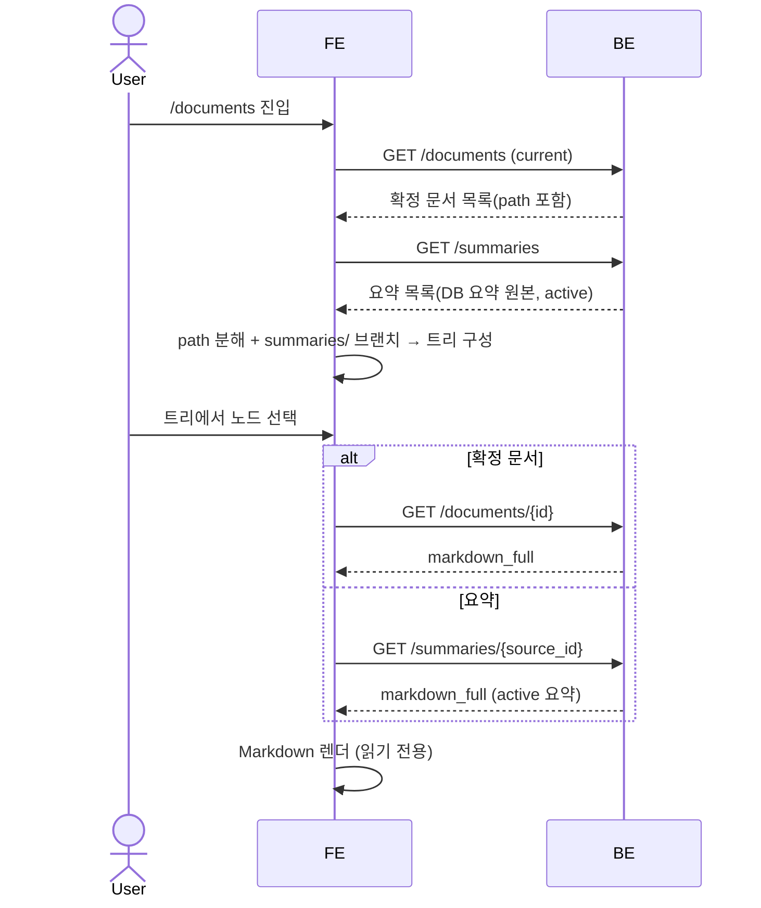

# 문서 라이브러리: 저장 문서 트리 열람 (읽기 전용)

저장된 확정 문서 전체를 디렉토리 트리로 조망하고, 선택한 문서의 Markdown 본문을 렌더링해 읽는 **읽기 전용** 페이지를 보장한다. 확정 문서 트리는 DB `documents`의 경로에서 구성하고 본문은 기존 read-through 계약을 재사용한다. 여기에 요약(`summaries/`)을 트리에 합류시키며, 요약은 `documents` row가 없으므로 **읽기 전용 BE API를 신설**해 목록·본문을 노출한다. 서빙 소스는 **DB 요약 원본**(`sources.summary_payload` active 버전)이며, `summaries/` 아래 백업 md 파일은 이 표면이 읽지 않는다 — 확정 문서·요약 모두 DB에서 서빙되어 트리 구성에 파일시스템 스캔이 없다(아래 §4).

> 이 spec은 열람 표면의 owning spec이다. 문서 resource(`path`·`current`/`superseded` lifecycle)·경로 컨벤션·본문 read-through, 그리고 요약의 DB 저장 모델(`summary_payload`·`source_summary_revisions`)과 보관용 side-output md 성격은 재정의하지 않고 AXKG-SPEC-003/004/005를 참조만 한다.

## 1. Context

### Meta

- Decision reference: AXKG-DEC-005(문서 lifecycle·경로 모델), AXKG-DEC-006(접근 경계)
- Baseline reference: 없음
- Domain note: `documents`(외부에 드러나는 `path`, lifecycle status `current`/`superseded`)는 AXKG-SPEC-004·AXKG-SPEC-005가 소유한다. 요약 원본(`sources.summary_payload` active 버전 + 버전 히스토리 `source_summary_revisions`)과 보관용 side-output md는 AXKG-SPEC-003 §7이 소유하며 그래프 노드가 아니다. 이 spec은 두 resource를 DB에서 읽기만 한다.
- Open questions: 쓰기 조작(폴더 생성·이동·이름변경·삭제) 후속 라운드 위임(§7), superseded 열람 후속(§7). 접근 경계(staff 허용)는 2026-07-11 확정(§7).

### Business Requirement

현재 저장된 문서는 `/graph` 그래프 노드로만 노출되고, 열람은 노드 클릭 → 문서 보기 모달이 유일하다. 저장된 문서 전체를 **도서관처럼 트리로 조망**하고 본문을 바로 읽을 수 있는 표면이 없다. 이 spec은 저장 문서를 한 화면에서 훑고 읽는 읽기 전용 페이지를 제공한다.

### Scope

In scope:

- 저장된 확정 문서(current)를 디렉토리 트리로 표시하는 읽기 전용 페이지
- 트리 노드(문서) 선택 시 해당 문서의 Markdown 본문 렌더
- 확정 문서 트리 데이터 = DB `documents`의 `path`에서 구성(파일시스템 스캔 아님)
- 확정 문서 본문 = 기존 문서 read-through 계약 재사용
- 요약(`summaries/`)을 트리에 합류 — 읽기 전용 목록/본문 신규 BE API. 서빙 소스는 DB 요약 원본(`sources.summary_payload` active), 백업 md 파일은 읽지 않음. 열람 경계는 라이브러리 경계 그대로(staff·admin)

Out of scope:

- 새 폴더 생성·문서 이동/이름변경/삭제 등 쓰기 조작 일체 → 후속 라운드(경로 컨벤션 SSOT·apply_executor allowlist 공존 설계 선행). §7 OQ
- `superseded` 문서 열람(기본 목록에서 제외) → 후속
- 검색·정렬·필터, stale 배지의 트리 노출, 요약→소스 역링크·요약 삭제/정리 → 이번 라운드 미도입
- 확정 문서용 BE 신규 API — 기존 목록/본문 API 재사용만(신규 API는 summaries/ 읽기 전용 2종에 한한다)

## 2. UX Contract

### Placement

신규 라우트 `/documents`. 데스크탑은 좌측 문서 트리 + 우측 본문 렌더의 2단 구성, 모바일(좁은 폭)은 트리↔본문 전환형(master-detail, AXKG 문서 라운드 직전 FE 패턴 준용).

```text
+──────────────────────────────────────────────────+
│ App Shell 헤더 / 내비                             │
+──────────────┬───────────────────────────────────+
│ 문서 트리    │ 문서 본문                          │
│ (current만)  │ (선택 문서/요약 Markdown 렌더)     │
│  resources/  │                                    │
│  permanent/  │  # 제목 …                          │
│  projects/   │  본문 …                            │
│  summaries/  │                                    │
+──────────────┴───────────────────────────────────+
```

### U-1. 문서 트리 영역 (좌)

- **상태**: 정상(확정 문서 경로에서 조립한 디렉토리 트리 + `summaries/` 브랜치) / 로딩(목록 조회 중) / 빈(문서·요약 모두 없음) / 에러(목록 조회 실패)
- **문구**: 확정 문서 디렉토리·문서명은 `documents`의 `path`에서 파생하고, `summaries/` 브랜치는 요약 목록 API가 반환하는 표시명(source 기준)으로 구성한다(표시용 경로 파생 — 실파일 조회 아님). 빈 상태 안내, 에러 안내.
- **CTA**: 트리에서 문서/요약 노드 선택. 디렉토리 노드는 펼치기/접기.
- **기대 결과**: 노드를 선택하면 우측 본문 영역이 해당 문서(확정 문서 read-through) 또는 요약(요약 본문 API)의 본문으로 갱신된다.

### U-2. 문서 본문 영역 (우)

- **상태**: 미선택(안내) / 로딩(본문 조회 중) / 정상(Markdown 렌더) / 에러(본문 조회 실패·대상 없음)
- **문구**: 선택 전 안내 문구, 에러 안내.
- **CTA**: 없음(읽기 전용 — 편집·삭제·이동 액션 없음).
- **기대 결과**: 선택한 문서의 `markdown_full` 본문이 렌더된다. 어떤 쓰기 요청도 발생하지 않는다.

### U-3. 모바일 전환 (좁은 폭)

- **상태**: 트리 뷰 / 본문 뷰
- **문구**: 본문 뷰 상단에 트리로 돌아가는 경로/뒤로 안내.
- **CTA**: 문서 선택 시 본문 뷰로 전환, 뒤로 시 트리 뷰로 복귀.
- **기대 결과**: 좁은 폭에서는 트리와 본문을 동시에 띄우지 않고 전환형으로 오간다.

## 3. User Scenario

접근 주체는 로그인 사용자다. 이 페이지는 **staff·admin 모두 열람 가능**하다(2026-07-11 확정, 읽기 전용) — 경계 SSOT는 AXKG-SPEC-008 §4다.

### S-1. 사용자 — 라이브러리에서 문서를 열람

1. 사용자가 `/documents`에 진입한다.
2. 시스템이 저장된 확정 문서 목록(current)을 조회하고, 각 문서의 `path`를 디렉토리 성분으로 분해해 트리를 구성한다(파일시스템 스캔 아님). `superseded`는 목록 기본 동작으로 제외된다. 요약은 `documents` row가 없어 이 목록에는 없고, 별도 요약 목록 API(DB 요약 원본)로 `summaries/` 브랜치가 합류된다(S-4).
3. 사용자가 트리에서 확정 문서 노드를 선택한다.
4. 시스템이 해당 문서의 본문을 read-through(`markdown_full`)로 조회해 우측에 Markdown으로 렌더한다.
5. 사용자는 본문을 읽는다. 편집/이동/삭제 액션은 없다(읽기 전용).

### S-2. 사용자 — 빈 라이브러리

1. 저장된 문서가 없다.
2. 트리 영역은 빈 상태 안내를 표시하고, 본문 영역은 선택 전 안내를 유지한다.

### S-3. 사용자 — 본문 열람 실패

1. 사용자가 문서를 선택했으나 대상 문서를 찾을 수 없거나 조회에 실패한다.
2. 본문 영역이 에러 안내를 표시한다(에러 계약은 §4 Case Matrix). 트리 상태는 유지된다.

### S-4. 사용자 — 요약 열람

1. 시스템이 요약 목록 API로 active 요약을 가진 source 목록(DB 요약 원본)을 조회해 트리에 `summaries/` 브랜치로 합류시킨다.
2. 사용자가 `summaries/` 아래 요약 노드를 선택한다.
3. 시스템이 요약 본문 API로 해당 source의 active 요약 본문을 조회해 우측에 Markdown으로 렌더한다(확정 문서와 동일한 읽기 전용 렌더).
4. 대상 요약이 없으면 §4 Case Matrix의 에러를 본문 영역에 표시한다.

## 4. Interface Contract

### API Contract

확정 문서용 엔드포인트는 **기존 API를 재사용**(계약 본문은 소유 spec/코드가 SoT, 재서술 금지)하고, 요약(`summaries/`)용으로 **읽기 전용 API 2종을 신설**한다.

| Method | Path | 요약 | 권한 |
|---|---|---|---|
| GET | `/documents` | 저장 확정 문서 목록(`path` 포함, `superseded` 기본 제외) — 확정 문서 트리 소스 · **기존** | staff·admin |
| GET | `/documents/{id}` | 확정 문서 본문 read-through(`markdown_full`) — 본문 렌더 소스 · **기존** | staff·admin |
| GET | `/summaries` | active 요약을 가진 source 목록 — 요약 브랜치 소스 · **신규** | staff·admin |
| GET | `/summaries/{source_id}` | 해당 source의 active 요약 본문(`markdown_full`) — 요약 본문 소스 · **신규** | staff·admin |

- 권한: 문서 라이브러리(확정 문서 + 요약)는 staff·admin 모두 열람 가능하다(2026-07-11 확정, 경계 SSOT=AXKG-SPEC-008 §4 매트릭스 문서 라이브러리 행). 신규 요약 API 2종도 같은 경계를 상속한다.
- 신규 API 성격: 요약은 `documents` row가 없어 문서 목록으로 열거되지 않으므로 별도 API로 노출한다. **서빙 소스는 DB 요약 원본**(`sources.summary_payload` active 버전 — SoT는 AXKG-SPEC-003 §7)이며 source 단위로 식별한다. `summaries/` 아래 백업 md 파일은 이 표면이 읽지 않는다(아무도 안 읽는 side-output 그대로). 확정 문서(DB `documents`)와 요약(DB 요약 원본) **모두 DB에서 서빙되어 파일시스템 스캔 예외가 없다**. 그래프/인덱스/`documents` lifecycle·`source_summary_revisions` 히스토리에는 무영향(active 버전만 읽음)이다.

### Request / Response

- 확정 문서 트리: `GET /documents` 응답의 `path`(workspace 상대경로)를 클라이언트에서 `/`로 분해해 디렉토리 트리를 구성한다. 응답 schema는 기존 목록 API가 SoT.
- 확정 문서 본문: `GET /documents/{id}`의 `markdown_full` read-through(md 파일이 SoT, AXKG-SPEC-004 Data Contract). 응답 schema는 기존 계약이 SoT.
- 요약 목록: `GET /summaries` → `{ "items": [ { "source_id": "<source id>", "name": "<표시명>", "path": "summaries/<표시명>" } ] }`. `source_id`는 본문 조회 키, `name`은 트리 표시명, `path`는 트리 합류용 표시 경로(파생 — 실파일 아님). active 요약을 가진 source만 포함. 정렬·필터·페이지네이션 없음(전체 반환).
- 요약 본문: `GET /summaries/{source_id}` → `{ "source_id": "<source id>", "name": "<표시명>", "path": "summaries/<표시명>", "markdown_full": "<md 전문>" }`. `markdown_full`은 해당 source의 active 요약 원본을 md로 렌더한 전문이며, 필드명을 확정 문서 본문과 맞춰 FE 렌더 자산을 재사용한다.

### Validation

쓰기 입력 계약이 없다(읽기 전용). 트리 구성 규칙만 명시한다.

| 항목 | 규칙 |
|---|---|
| 확정 문서 트리 소스 | `documents`의 `path`만 사용. 파일시스템 스캔 아님 |
| 확정 문서 노출 대상 | `current`만(목록 API 기본 동작). `superseded` 제외 |
| 요약 브랜치 소스 | `documents` 트리에선 제외(row 없음). `GET /summaries`(DB 요약 원본, active 버전)로 별도 합류. 파일시스템 스캔 아님 |
| 요약 조회 키 | `GET /summaries/{source_id}`는 source 단위 식별. 백업 md 파일 경로를 입력으로 받지 않음(경로 탈출 케이스 자체가 없음) |

### Case Matrix

| 에러 코드 | 백엔드 출력 | 프론트 출력 | 표시 위치 |
|---|---|---|---|
| (목록 조회 실패) | 기존 목록 API 에러 | 문서 목록을 불러오지 못했습니다. | 트리 영역 |
| `DOCUMENT_NOT_FOUND` (404) | 대상 문서 없음(기존 코드 재사용) | 문서를 찾을 수 없습니다. | 본문 영역 |
| (본문 조회 실패) | 기존 read-through 에러 | 문서 본문을 불러오지 못했습니다. | 본문 영역 |
| (요약 목록 조회 실패) | `GET /summaries` 에러 | 요약 목록을 불러오지 못했습니다. | 트리 영역(summaries 브랜치) |
| `SUMMARY_NOT_FOUND` (404) | 대상 source 없음 또는 active 요약 없음(신규) | 요약을 찾을 수 없습니다. | 본문 영역 |
| (빈 상태) | — | 저장된 문서가 없습니다. | 트리 영역 |

확정 문서 관련 에러 코드는 기존 문서 API 계약을 재사용한다. 요약 API는 신규 `SUMMARY_NOT_FOUND`(대상 source/active 요약 없음)만 도입한다. 서빙 소스가 DB이고 파일 경로를 입력으로 받지 않으므로 경로 탈출(`PATH_NOT_ALLOWED`) 케이스는 없다.

### Flow



### State / Lifecycle

해당 없음. 이 페이지는 새 상태 전이를 도입하지 않는다. 문서의 `current`/`superseded` lifecycle은 AXKG-SPEC-004(Document Lifecycle)·AXKG-SPEC-005가 소유하며, 트리는 `current`만 노출한다.

### Data Contract

확정 문서 트리·본문은 기존 `documents` resource(`path`, `id`, `markdown_full`, lifecycle status)를 읽는다. 경로 컨벤션(`resources/`·`permanent/`·`permanent/concepts/`·`projects/`)의 SSOT는 AXKG-SPEC-005 §4 Path Convention이다. 요약 브랜치는 DB 요약 원본(`sources.summary_payload` active 버전)을 `{ source_id, name, path, markdown_full }`로 노출하는 얇은 읽기 전용 view이며(신규 DB 테이블·인덱스·그래프 노드 없음, active 버전만 읽어 히스토리 `source_summary_revisions` 무영향), 요약의 저장 모델·보관용 side-output md(`data/documents/summaries/{stem}.md`)의 SoT는 AXKG-SPEC-003 §7이다. 이 표면은 백업 md 파일을 읽지 않는다.

## 5. Implementation Rules

- **읽기 전용**: 이 페이지와 신규 요약 API는 어떤 쓰기도 하지 않는다(생성·이동·이름변경·삭제 없음).
- 확정 문서 트리는 DB `documents`의 `path`에서 구성한다(파일시스템 스캔 금지). `current`만 노출하며 `superseded`는 목록 API 기본 동작으로 제외된다. 확정 문서 본문은 기존 read-through(`GET /documents/{id}` `markdown_full`)를 재사용하며 확정 문서용 BE 신규 엔드포인트를 만들지 않는다.
- 요약 브랜치는 신규 읽기 전용 API 2종(`GET /summaries`·`GET /summaries/{source_id}`)으로만 노출한다. **서빙 소스는 DB 요약 원본**(`sources.summary_payload` active 버전)이며 source 단위로 식별한다 — 확정 문서 트리와 마찬가지로 DB에서 서빙하므로 파일시스템 스캔 예외가 없다. `summaries/` 백업 md 파일은 읽지 않는다. active 버전만 읽어 요약 버전 히스토리(`source_summary_revisions`)·그래프/인덱스/`documents` lifecycle에 어떤 영향도 주지 않는다.
- 접근 경계는 AXKG-SPEC-008 §4 매트릭스(SSOT)를 따른다 — 문서 라이브러리 행 = staff·admin 모두 허용(읽기 전용, 2026-07-11 확정). 신규 요약 API 2종도 같은 경계를 상속한다. 경계는 여기서 재서술하지 않고 SPEC-008을 참조만 한다.
- 라우트·컴포넌트·Markdown 렌더 라이브러리 등 구현 세부는 work 소관이며 이 spec에 박지 않는다.

## 6. Verification

### Acceptance Criteria

- [ ] `/documents` 진입 시 저장된 `current` 확정 문서가 `path` 기반 디렉토리 트리로 표시된다.
- [ ] 트리에서 확정 문서를 선택하면 해당 문서의 Markdown 본문(`markdown_full`)이 렌더된다.
- [ ] `summaries/` 브랜치가 `GET /summaries`(DB 요약 원본, active) 목록으로 트리에 합류하고, 요약 노드 선택 시 `GET /summaries/{source_id}` 본문(active 요약)이 렌더된다.
- [ ] `superseded` 문서는 트리에 나타나지 않는다(요약은 `summaries/` 브랜치로만 노출).
- [ ] 대상 source 없음/active 요약 없음은 `SUMMARY_NOT_FOUND`로 처리된다(파일 경로 입력이 없어 경로 탈출 케이스는 없다).
- [ ] 페이지·요약 API에 편집·이동·이름변경·삭제·폴더 생성 등 쓰기 조작 표면이 없다.
- [ ] 데스크탑은 좌 트리 + 우 본문, 모바일(좁은 폭)은 트리↔본문 전환형으로 동작한다.
- [ ] 목록/본문 조회 실패·빈 상태에서 §4 Case Matrix의 안내가 표시된다.

## 7. Open Questions

- ~~**staff의 문서 라이브러리 접근 허용 여부**~~ → **해소**(2026-07-11 사용자 확정): 문서 라이브러리(`/documents`)는 **staff·admin 모두 열람 가능**(읽기 전용, staff의 `/graph` 문서 열람과 동급). 경계 매트릭스에 반영(SSOT=AXKG-SPEC-008 §4 문서 라이브러리 행, DEC-006 §2 dated 확장).
- **새 폴더 생성(원 요구 ②)은 이번 라운드 제외** — 경로 컨벤션 SSOT(AXKG-SPEC-005 §4)·apply_executor allowlist와의 공존 설계 라운드가 별도로 선행돼야 한다. 문서 이동/이름변경/삭제 등 쓰기 조작 일체 동일.
- (선택) `superseded` 문서 열람 — 이번 라운드 제외, 후속 검토.
