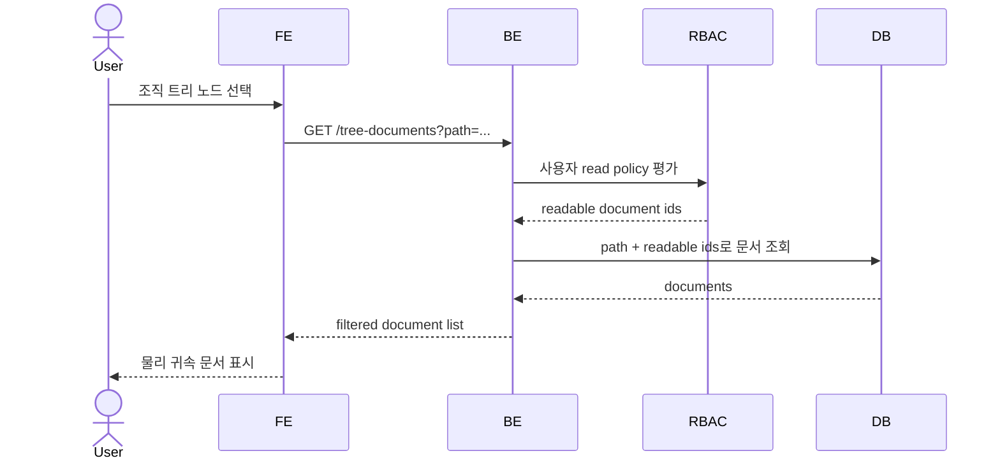
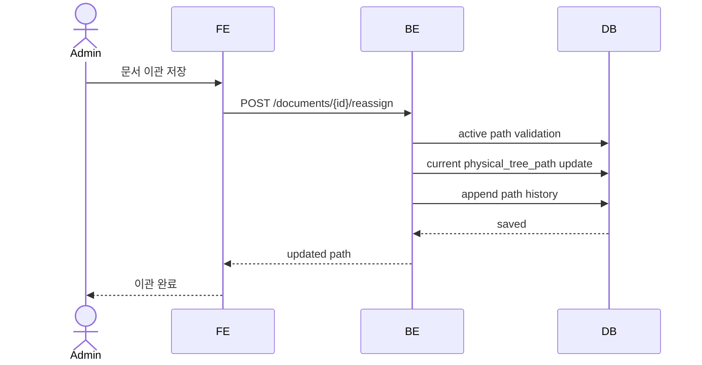
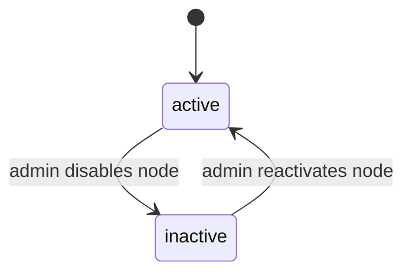

# Organization & Tree

이 spec은 부서별 문서 탐색을 위한 조직도와 문서 트리의 외부 계약을 정의한다. 조직도는 사람/권한/관리 주체의 기준이고, 문서 트리는 업무/문서종류 기반 탐색 구조다.

> Drive folder 구조는 제품 트리의 SoT가 아니다. 제품 트리와 문서 귀속은 DB 승인 metadata를 기준으로 한다.

## 1. Context

### Meta

- Decision reference: DEC-004, DEC-005, DEC-007, DEC-012, DEC-013, DEC-014, DEC-015
- Baseline reference: BASE-002
- Related spec: SPEC-001 User & RBAC
- Domain note: 조직도 노드는 회사/부서/팀까지만, 문서 트리 노드는 업무/문서종류를 담당한다.
- Open questions: 없음

### Business Requirement

부서별로 흩어진 문서를 한 화면에서 탐색하려면, 회사가 이해하는 조직 구조와 문서 탐색 구조가 분리되어야 한다. 조직도는 사용자 소속과 관리 책임을 안정적으로 표현하고, 문서 트리는 업무와 문서종류처럼 자주 바뀌는 탐색 분류를 표현한다.

### Scope

In scope:

- 회사/부서/팀 조직도 노출과 관리 계약
- 업무/문서종류 문서 트리 설정 계약
- `physical_tree_path` 구성 규칙
- 비활성 조직의 기존 문서 노출 규칙
- 문서 이관과 `physical_tree_path` 변경 이력 계약
- 부서 기본 목록과 관련 문서 영역의 노출 경계

Out of scope:

- 사용자 seed/RBAC 상세: SPEC-001
- 문서 metadata record 상세: SPEC-003
- Google Drive connector/sync 상세: SPEC-004
- 승인 게이트 상세: SPEC-005
- 문서 relation/graph 탐색 상세: SPEC-006

## 2. UX Contract

### Placement

Organization & Tree는 문서 탐색 화면과 관리자 설정 화면에 걸쳐 노출된다.

```text
+--------------------------------------------------+
| App Header                                       |
+------------------+-------------------------------+
| Organization     | Breadcrumb                    |
| Tree Sidebar     | Document List / Related Area   |
|                  |                               |
+------------------+-------------------------------+
```

관리자 설정:

```text
+--------------------------------------------------+
| Admin Header                                     |
+------------------+-------------------------------+
| Settings Nav     | Organization / Tree Config     |
|                  | Document Type Catalog          |
+------------------+-------------------------------+
```

### U-1. Organization Tree Sidebar

- **상태**:
  - 정상: 회사 root 아래 active/inactive 부서와 팀을 계층으로 표시한다.
  - 로딩: tree skeleton 또는 loading indicator를 표시한다.
  - 빈 상태: 조직도 seed가 없으면 관리자 설정 진입 CTA를 표시한다.
  - 권한없음: 로그인 사용자가 문서 탐색 불가 상태면 tree를 표시하지 않는다.
- **문구**:
  - root label: `메디솔브`
  - inactive 조직 suffix: `비활성`
  - 빈 상태: `조직도가 아직 설정되지 않았습니다.`
- **CTA**:
  - `조직 설정`: admin에게만 노출한다.
  - 조직 노드 클릭: 해당 조직의 기본 문서 목록으로 이동한다.
- **기대 결과**:
  - active 조직 클릭 시 해당 조직에 물리 귀속된 문서 목록이 열린다.
  - inactive 조직 클릭 시 기존 문서는 표시하되 inactive 표시가 유지된다.

### U-2. Department Document List

- **상태**:
  - 정상: 선택 조직에 물리 귀속된 문서만 표시한다.
  - 빈 상태: `이 위치에 귀속된 문서가 없습니다.`
  - 권한없음: 권한 없는 문서는 목록에서 제거된다.
- **문구**:
  - list heading: 선택한 `회사/부서/팀/업무/문서종류` path
  - inactive badge: `비활성 조직`
- **CTA**:
  - `관련 문서`: related area로 전환하거나 영역을 펼친다.
  - `문서 이관`: admin에게만 노출한다.
- **기대 결과**:
  - 기본 목록에는 물리 귀속 문서만 표시된다.
  - 논리 연결 문서는 기본 목록에 섞이지 않는다.

### U-3. Related Documents Area

- **상태**:
  - 정상: 선택 조직과 논리적으로 연결된 문서를 표시한다.
  - 빈 상태: `관련 문서가 없습니다.`
  - 권한없음: 권한 없는 관련 문서는 숨긴다.
- **문구**:
  - area label: `관련 문서`
  - source label: `관련 부서`, `관련 제품`, `문서 관계`
- **CTA**:
  - 문서 열기: 권한이 있는 문서만 가능하다.
- **기대 결과**:
  - 관련 문서 클릭 시 문서 상세로 이동한다.
  - 문서의 실제 관리 주체는 기본 목록/path에서 확인한다.

### U-4. Organization / Tree Admin

- **상태**:
  - 정상: 조직도와 문서 트리 설정을 별도 영역으로 표시한다.
  - 권한없음: admin이 아니면 접근할 수 없다.
  - inactive: 비활성 조직은 새 귀속 대상으로 선택 불가 상태로 표시한다.
- **문구**:
  - section label: `조직도`, `문서 트리 설정`, `문서종류`
  - action label: `비활성화`, `이름 변경`, `업무 추가`, `문서종류 추가`
- **CTA**:
  - 조직 이름 변경
  - 조직 비활성화
  - 업무 노드 추가/수정
  - 문서종류 추가
- **기대 결과**:
  - 조직도 변경은 사용자 소속/관리 주체 기준을 바꾼다.
  - 업무/문서종류 변경은 문서 탐색 분류만 바꾼다.

### U-5. Document Reassignment

- **상태**:
  - 정상: 현재 path와 이동할 새 path를 표시한다.
  - validation error: inactive 조직이나 없는 문서종류를 선택하면 저장할 수 없다.
  - 권한없음: admin이 아니면 이관 action을 볼 수 없다.
- **문구**:
  - modal title: `문서 이관`
  - reason label: `변경 사유`
  - confirm CTA: `이관 저장`
- **CTA**:
  - `이관 저장`: 유효한 active path와 변경 사유가 있을 때 활성화한다.
- **기대 결과**:
  - document의 현재 `physical_tree_path`가 갱신된다.
  - 이전 path와 새 path가 append-only history로 남는다.

## 3. User Scenario

### S-1. Member — 부서 문서 탐색

1. 사용자는 로그인 후 문서 탐색 화면에 진입한다.
2. 시스템은 SPEC-001의 user/RBAC 상태를 확인한다.
3. 사용자는 조직 트리에서 부서 또는 팀을 선택한다.
4. 시스템은 선택 path에 물리 귀속된 문서 중 사용자가 읽을 수 있는 문서만 표시한다.
5. 사용자는 `관련 문서` 영역을 열어 논리 연결 문서를 확인한다.
6. 권한 없는 문서는 기본 목록과 관련 문서 영역 모두에서 보이지 않는다.

### S-2. Admin — 조직/문서 트리 설정

1. admin은 설정 화면에 진입한다.
2. admin은 조직도 영역에서 회사/부서/팀을 확인한다.
3. admin은 문서 트리 설정 영역에서 특정 팀 아래 업무 노드를 추가한다.
4. admin은 업무 노드 아래 전사 공통 문서종류를 연결한다.
5. 시스템은 조직도 변경과 문서 트리 설정 변경을 별도 변경으로 기록한다.

### S-3. Admin — 비활성 조직 처리

1. admin은 더 이상 새 문서를 받을 수 없는 부서 또는 팀을 비활성화한다.
2. 시스템은 해당 조직 노드를 hard delete하지 않고 inactive 상태로 둔다.
3. 기존 문서의 `physical_tree_path`는 유지된다.
4. 일반 탐색에서 inactive 조직과 기존 문서는 계속 표시된다.
5. 새 문서 승인/이관에서는 inactive 조직을 선택할 수 없다.

### S-4. Admin — 문서 이관

1. admin은 문서 상세 또는 목록에서 `문서 이관`을 선택한다.
2. 시스템은 현재 `physical_tree_path`를 표시한다.
3. admin은 active 조직과 문서 트리 노드로 구성된 새 path를 선택한다.
4. admin은 변경 사유를 입력하고 저장한다.
5. 시스템은 현재 path를 변경하고, 이전 path/새 path/변경자/사유/시각을 history에 append한다.
6. Drive folder 이동은 이관 action으로 처리되지 않는다.

## 4. Interface Contract

### API Contract

| Method | Path | 요약 | 권한 |
|---|---|---|---|
| GET | `/organization-tree` | 조직도 tree 조회 | authenticated |
| GET | `/document-tree-config` | 업무/문서종류 tree 설정 조회 | authenticated |
| GET | `/document-types` | 전사 공통 문서종류 조회 | authenticated |
| GET | `/tree-documents` | path 기준 물리 귀속 문서 목록 조회 | authenticated |
| GET | `/related-documents` | 조직/문서 기준 관련 문서 조회 | authenticated |
| POST | `/organization-nodes` | 조직 노드 생성 | admin |
| PATCH | `/organization-nodes/{id}` | 조직 노드 이름/상태 변경 | admin |
| POST | `/document-tree-nodes` | 업무/문서종류 tree 노드 생성 | admin |
| PATCH | `/document-tree-nodes/{id}` | 업무/문서종류 tree 노드 수정 | admin |
| POST | `/documents/{id}/reassign` | 문서 physical path 이관 | admin |
| GET | `/documents/{id}/path-history` | 문서 path 변경 이력 조회 | admin |

경로 prefix와 인증 방식은 구현 spec에서 확정한다. 이 spec은 resource와 권한 계약만 정의한다.

### Request / Response

#### Organization node

| Field | Type | 설명 |
|---|---|---|
| `id` | int | 조직 노드 id |
| `parent_id` | int or null | 상위 조직 노드 |
| `type` | enum | `company`, `department`, `team` |
| `name` | text | 표시명 |
| `status` | enum | `active`, `inactive` |

#### Document tree node

| Field | Type | 설명 |
|---|---|---|
| `id` | int | 문서 트리 노드 id |
| `organization_node_id` | int | 붙어 있는 조직 노드 |
| `parent_id` | int or null | 상위 문서 트리 노드 |
| `type` | enum | `work`, `document_type` |
| `name` | text | 표시명 |
| `status` | enum | `active`, `inactive` |

#### Physical tree path

| Field | Type | 설명 |
|---|---|---|
| `organization_path` | array | 회사/부서/팀 노드 id path. 표시명은 노드 join으로 계산 |
| `tree_path` | array | 업무/문서종류 노드 id path. 표시명은 노드 join으로 계산 |
| `display_path` | text | UI 표시 path |
| `owning_department` | text | 관리 주체 부서 |

### Validation

| 필드 | 규칙 |
|---|---|
| organization node type | `company`, `department`, `team`만 허용 |
| document tree node type | `work`, `document_type`만 허용 |
| company node | root로 1개만 사용 |
| department node | company 하위에만 생성 가능 |
| team node | department 하위에만 생성 가능 |
| work node | active organization node 아래에만 생성 가능 |
| document_type node | work node 또는 active organization node 하위에 연결 가능 |
| inactive organization | 새 문서 귀속/이관 대상으로 선택 불가 |
| reassign reason | 문서 이관 시 필수 |
| physical_tree_path | 조직도 노드와 문서 트리 노드 조합으로만 생성 가능 |
| path 참조 | path array는 노드 name이 아니라 노드 id를 저장한다 |

### Case Matrix

| 에러 코드 | 백엔드 출력 | 프론트 출력 | 표시 위치 |
|---|---|---|---|
| `ORG_NODE_NOT_FOUND` | organization node not found | 조직을 찾을 수 없습니다. | tree/admin form |
| `ORG_NODE_INACTIVE` | inactive organization cannot be selected | 비활성 조직은 새 귀속 대상으로 선택할 수 없습니다. | reassignment modal |
| `TREE_NODE_NOT_FOUND` | document tree node not found | 문서 트리 항목을 찾을 수 없습니다. | tree/admin form |
| `DOCUMENT_TYPE_NOT_FOUND` | document type not found | 문서종류를 확인하세요. | admin form |
| `INVALID_TREE_DEPTH` | invalid organization/tree hierarchy | 허용되지 않는 계층입니다. | admin form |
| `REASSIGN_REASON_REQUIRED` | changed_reason is required | 변경 사유를 입력하세요. | reassignment modal |
| `FORBIDDEN_ADMIN_ONLY` | admin permission required | 관리자만 사용할 수 있습니다. | page/modal |
| `DOCUMENT_NOT_READABLE` | document hidden by read policy | 문서를 찾을 수 없습니다. | list/detail |

> 구현 확정(WORK-002): inactive **문서 트리 노드** 선택도 `ORG_NODE_INACTIVE`로 응답한다(규칙 단일화). `document_type` 노드 생성 시 존재하지 않는 카탈로그 id는 `DOCUMENT_TYPE_NOT_FOUND`.

### Flow





### State / Lifecycle



`inactive` 조직은 기존 문서 조회에는 남지만, 새 문서 귀속과 문서 이관 대상에서는 제외된다.

### Data Contract

| Resource | 외부 계약 |
|---|---|
| Organization tree | 회사/부서/팀만 포함한다. 사람 소속과 관리 주체의 기준이다. |
| Document tree config | 업무/문서종류를 포함한다. 문서 탐색 분류의 기준이다. |
| Document type catalog | 전사 공통 카탈로그다. 승인 게이트에서 admin만 추가 가능하다. |
| Physical tree path | organization path + document tree path의 조합이다. 문서 관리 주체를 나타낸다. |
| Path history | path 이관 이력을 append-only로 제공한다. |

## 5. Implementation Rules

- Drive folder 이동은 제품 `physical_tree_path`를 자동 변경하지 않는다.
- 같은 문서는 같은 물리 path에 한 번만 표시된다.
- 조직도 이름 변경은 조직 id를 유지한 채 표시명만 바꾼다.
- path는 노드 id로 저장하므로 조직/트리 노드 rename 시 별도 path 갱신 없이 최신 표시명이 반영된다.
- 비활성 조직은 hard delete하지 않는다.
- 비활성 조직의 기존 문서는 권한이 있으면 일반 탐색에서 표시한다.
- 새 문서 귀속과 문서 이관은 active 조직/트리 노드만 허용한다.
- `physical_tree_path` 변경은 명시적 이관 action으로만 발생한다.
- path 변경 이력은 append-only이며 수정/삭제하지 않는다.
- 권한 없는 문서는 목록/트리/검색/관련 문서에서 숨긴다.

## 6. Verification

### Acceptance Criteria

- [ ] 조직도는 `회사 > 부서 > 팀`까지만 표현한다.
- [ ] 문서 트리 설정은 조직 노드 아래 `업무 > 문서종류`를 표현한다.
- [ ] 부서 기본 목록에는 물리 귀속 문서만 표시된다.
- [ ] 관련 문서는 기본 목록에 섞이지 않고 관련 문서 영역에 표시된다.
- [ ] 권한 없는 문서는 기본 목록과 관련 문서 영역에서 모두 숨겨진다.
- [ ] inactive 조직은 기존 문서 조회에는 남고 새 귀속 대상으로는 선택되지 않는다.
- [ ] admin만 조직/문서 트리 설정과 문서 이관을 수행할 수 있다.
- [ ] 문서 이관 시 변경 사유가 필수다.
- [ ] 문서 이관은 현재 `physical_tree_path`를 갱신하고 append-only history를 남긴다.
- [ ] Drive folder 이동만으로 제품 path가 바뀌지 않는다.

## 7. Open Questions

없음.
