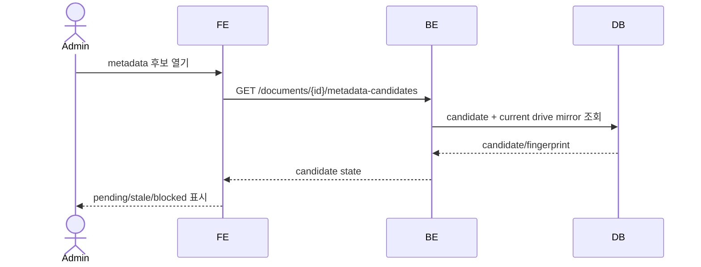
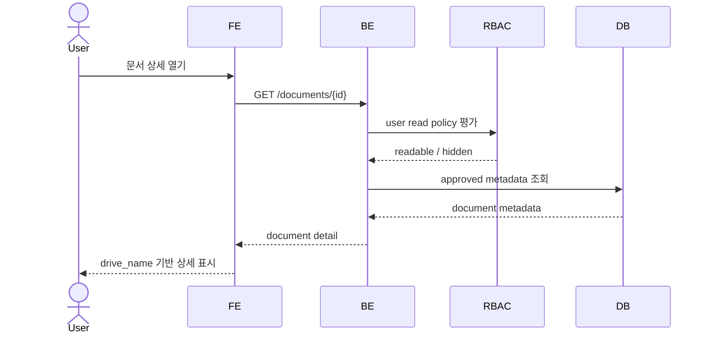
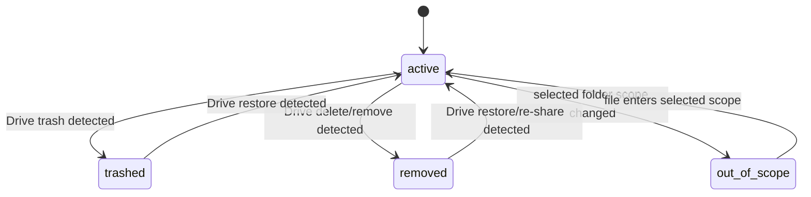
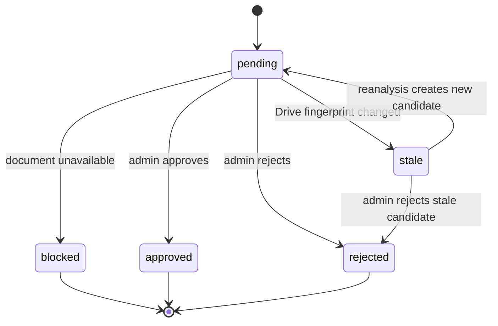

# Document Metadata Record

이 spec은 Google Drive 파일을 제품 DB에서 표현하는 문서 record와 metadata 후보/승인 상태의 외부 계약을 정의한다. 파일 원본은 항상 Google Drive가 SoT이고, 제품 DB는 Drive mirror, 승인 metadata, 권한 policy, 탐색 index를 가진다.

## 1. Context

### Meta

- Decision reference: DEC-002, DEC-003, DEC-011, DEC-016, DEC-018, DEC-023
- Baseline reference: BASE-001, BASE-002
- Related spec: SPEC-001 User & RBAC, SPEC-002 Organization & Tree
- Domain note: 문서 record는 Drive 원본을 대체하지 않는다.
- Open questions: 없음

### Business Requirement

사용자는 Drive 파일을 직접 열 수 있어야 하고, 제품에서는 같은 파일을 부서 트리/관련 문서/권한/승인 상태로 탐색할 수 있어야 한다. 이를 위해 Drive에서 온 값과 사람이 승인한 제품 metadata를 분리해 저장하고, 승인 후보가 최신 Drive 상태와 일치하는지 검증해야 한다.

### Scope

In scope:

- 문서 record의 외부 field 계약
- Drive mirror field와 product-owned metadata 분리
- 기본 제목 `drive_name`
- 문서 상태 `active`, `trashed`, `removed`, `out_of_scope`
- metadata candidate 상태 `pending`, `stale`, `approved`, `rejected`, `blocked`
- composite fingerprint와 stale 판정 계약
- 권한 policy field와 민감 preset field

Out of scope:

- Google Drive API 호출/동기화 상세: SPEC-004
- 승인 게이트 UI 상세: SPEC-005
- 문서 relation graph 상세: SPEC-006
- 실제 DB migration, index, FK 전문

## 2. UX Contract

### Placement

문서 metadata는 문서 상세, 승인 게이트, 관리자 감사 화면에서 노출된다.

```text
+--------------------------------------------------+
| Document Header: drive_name / state / actions     |
+------------------+-------------------------------+
| Metadata          | Summary / Access / Tree        |
| Sections          | Relations / Drive mirror        |
+------------------+-------------------------------+
```

### U-1. Document Header

- **상태**:
  - active: `drive_name`을 기본 제목으로 표시한다.
  - trashed/removed/out_of_scope: 일반 사용자 UI에서는 노출하지 않는다.
  - admin audit: soft deleted 상태와 마지막 Drive mirror 정보를 표시한다.
- **문구**:
  - title: `drive_name`
  - state badge: `활성`, `휴지통`, `삭제됨`, `범위 밖`
  - link label: `Drive에서 열기`
- **CTA**:
  - `Drive에서 열기`: `drive_web_url`이 있을 때 활성화한다.
  - `문서 이관`: admin만, SPEC-002 이관 계약을 따른다.
- **기대 결과**:
  - 사용자는 제품 metadata와 Drive 원본 링크를 같은 상세 화면에서 확인한다.

### U-2. Metadata Sections

- **상태**:
  - approved: 승인 metadata를 표시한다.
  - pending candidate: 승인 전 후보는 일반 사용자에게 확정 metadata처럼 보이지 않는다.
  - missing approved metadata: 관리자에게 승인 필요 상태를 표시한다.
- **문구**:
  - section label: `문서 정보`, `귀속`, `권한`, `요약`, `Drive 정보`
  - candidate badge: `승인 대기`
- **CTA**:
  - `승인 게이트로 이동`: admin에게만 노출한다.
- **기대 결과**:
  - 일반 사용자는 승인된 metadata만 본다.
  - admin은 후보 상태와 Drive mirror를 함께 확인할 수 있다.

### U-3. Candidate State

- **상태**:
  - pending: 승인 가능.
  - stale: 승인 불가, 재분석 상태 확인 필요.
  - approved: 확정 완료.
  - rejected: 반려 완료.
  - blocked: 삭제/권한/읽기 실패 등으로 승인 진행 불가.
- **문구**:
  - stale message: `Drive 파일이 변경되어 이 후보는 더 이상 승인할 수 없습니다.`
  - blocked message: `현재 문서 상태에서는 승인할 수 없습니다.`
- **CTA**:
  - `재분석`: 자동 재분석 실패 시 admin에게 노출한다.
- **기대 결과**:
  - stale 후보는 승인 저장을 막는다.

## 3. User Scenario

### S-1. Member — 승인된 문서 metadata 조회

1. 사용자는 문서 목록 또는 관련 문서에서 문서를 선택한다.
2. 시스템은 SPEC-001 read policy를 평가한다.
3. 읽기 권한이 있으면 문서 상세를 표시한다.
4. 상세 제목은 `drive_name`으로 표시된다.
5. 사용자는 승인된 문서종류, 요약, 귀속, 관련 metadata를 확인한다.
6. 권한이 없거나 Drive state가 일반 사용자 숨김 상태면 문서는 보이지 않는다.

### S-2. Admin — metadata 후보 검토

1. admin은 승인 게이트에서 문서 후보를 연다.
2. 시스템은 후보가 참조한 Drive fingerprint와 현재 Drive mirror fingerprint를 비교한다.
3. fingerprint가 같으면 후보는 `pending`으로 승인 가능하다.
4. admin은 문서종류, 귀속, 권한 policy, 민감 preset, 요약을 승인하거나 수정한다.
5. 승인 후 후보 metadata는 approved metadata로 반영된다.

### S-3. System — Drive 삭제/범위 제외 반영

1. Drive sync가 파일 삭제, 휴지통 이동, 선택 폴더 범위 제외를 감지한다.
2. 시스템은 문서 record를 hard delete하지 않는다.
3. 문서 상태를 `trashed`, `removed`, `out_of_scope` 중 하나로 반영한다.
4. 일반 사용자 목록/트리/검색/관련 문서에서는 숨긴다.
5. admin audit에서는 상태와 Drive mirror를 조회할 수 있다.

### S-4. System — 승인 대기 중 Drive 변경

1. AI 후보가 `pending` 상태로 생성된다.
2. Drive sync가 같은 `drive_file_id`의 Drive mirror 변경을 반영한다.
3. 시스템은 후보 fingerprint와 현재 fingerprint 불일치를 감지한다.
4. 기존 후보는 `stale` 상태가 된다.
5. stale 후보는 승인 불가 상태가 되고 자동 재분석 대상이 된다.

## 4. Interface Contract

### API Contract

| Method | Path | 요약 | 권한 |
|---|---|---|---|
| GET | `/documents/{id}` | 문서 상세 metadata 조회 | readable user |
| GET | `/documents/{id}/drive-mirror` | Drive mirror 조회 | admin |
| GET | `/documents/{id}/metadata-candidates` | metadata 후보 목록 조회 | admin |
| GET | `/documents/{id}/visibility` | 현재 사용자 기준 문서 노출 가능 여부 조회 | authenticated |
| GET | `/admin/documents` | 상태별 문서 감사 목록 조회 | admin |

경로 prefix와 인증 구현은 후속 work에서 결정한다. 이 spec은 resource와 권한 계약만 정의한다.

### Request / Response

#### Document metadata resource

| Field | Type | Required | 성격 | 설명 |
|---|---|---|---|---|
| `id` | int | yes | product | 제품 내부 문서 id |
| `source_provider` | enum | yes | system | `google_drive` |
| `drive_file_id` | text | yes | mirror | Drive file id |
| `drive_name` | text | yes | mirror | 기본 표시 제목 |
| `drive_web_url` | text | no | mirror | Drive 열기 링크 |
| `drive_mime_type` | text | yes | mirror | Drive MIME type |
| `drive_state` | enum | yes | mirror | `active`, `trashed`, `removed`, `out_of_scope` |
| `drive_modified_time` | datetime | no | mirror | Drive 수정 시각 |
| `drive_fingerprint` | object | yes | mirror | stale 판정 기준 |
| `document_type` | text | no | approved | 승인 문서종류 |
| `created_department` | text | no | approved | 생성부서 |
| `owning_department` | text | no | approved | 관리/귀속 부서 |
| `physical_tree_path` | object | no | approved | SPEC-002 path |
| `related_departments` | array | no | approved | 관련 부서 |
| `related_products` | array | no | approved | 관련 제품/팀 |
| `read_roles` | array | no | approved/auth | 읽기 role |
| `read_departments` | array | no | approved/auth | 읽기 부서 |
| `read_positions` | array | no | approved/auth | 읽기 직급 |
| `access_logic` | enum | yes | approved/auth | `ANY`, `ALL`, `PRESET` |
| `sensitivity` | enum | yes | approved/auth | `normal`, `sensitive` |
| `policy_preset` | text | no | approved/auth | 민감 preset |
| `summary` | text | no | approved | 승인 요약 |

#### Metadata candidate resource

| Field | Type | Required | 설명 |
|---|---|---|---|
| `id` | int | yes | 후보 id |
| `document_id` | int | yes | 대상 문서 |
| `state` | enum | yes | `pending`, `stale`, `approved`, `rejected`, `blocked` |
| `read_capability` | enum | yes | `content_read`, `metadata_only`. 본문 분석 없이 생성된 후보 표시 (DEC-009) |
| `candidate_metadata` | object | yes | AI 제안 metadata |
| `candidate_fingerprint` | object | yes | 후보 생성 시 Drive fingerprint |
| `reason` | text | no | AI 제안/blocked/stale 사유 |
| `created_at` | datetime | yes | 후보 생성 시각 |
| `approved_by` | int | no | 승인 admin user id |
| `approved_at` | datetime | no | 승인 시각 |

### Validation

| 필드 | 규칙 |
|---|---|
| `drive_file_id` | 같은 provider 안에서 unique해야 한다. |
| `drive_name` | 빈 값이면 안 된다. |
| `drive_state` | `active`, `trashed`, `removed`, `out_of_scope`만 허용한다. |
| `document_type` | 전사 공통 document type catalog 값이어야 하며, 저장은 카탈로그의 stable type id를 참조한다. rename되어도 참조가 유지된다 (DEC-007). |
| `owning_department` | 단일값이며 active/inactive 조직 이력과 연결 가능해야 한다. |
| `physical_tree_path` | SPEC-002의 유효한 path 계약을 따라야 한다. |
| `access_logic` | `ANY`, `ALL`, `PRESET`만 허용한다. |
| `policy_preset` | 민감 문서 preset catalog 값이거나 null이어야 한다. |
| `candidate_fingerprint` | 후보 승인 전 현재 `drive_fingerprint`와 비교 가능해야 한다. |

### Case Matrix

| 에러 코드 | 백엔드 출력 | 프론트 출력 | 표시 위치 |
|---|---|---|---|
| `DOCUMENT_NOT_FOUND` | document not found | 문서를 찾을 수 없습니다. | detail/list |
| `DOCUMENT_NOT_READABLE` | hidden by read policy | 문서를 찾을 수 없습니다. | detail/list |
| `DOCUMENT_UNAVAILABLE` | document is trashed/removed/out_of_scope | 현재 볼 수 없는 문서입니다. | admin/detail |
| `CANDIDATE_STALE` | candidate fingerprint mismatch | Drive 파일이 변경되어 다시 분석해야 합니다. | approval gate |
| `CANDIDATE_BLOCKED` | candidate blocked | 현재 문서 상태에서는 승인할 수 없습니다. | approval gate |
| `INVALID_DOCUMENT_TYPE` | invalid document_type | 문서종류를 확인하세요. | approval gate |
| `INVALID_ACCESS_POLICY` | invalid access policy | 접근 권한 설정을 확인하세요. | approval gate |
| `INVALID_TREE_PATH` | invalid physical_tree_path | 문서 귀속 위치를 확인하세요. | approval gate/reassign |

### Flow





### State / Lifecycle

#### Document state



#### Candidate state



### Data Contract

| Resource | 외부 계약 |
|---|---|
| Document record | Drive 파일 1개를 대표하는 제품 record. Drive 원본을 대체하지 않는다. |
| Drive mirror | Drive-derived field 묶음. Drive sync가 우선권을 가진다. |
| Approved metadata | 사람이 승인한 제품 metadata. 일반 사용자에게 표시되는 기준이다. |
| Metadata candidate | AI가 생성한 승인 전 후보. 승인 전에는 일반 사용자에게 확정값처럼 표시하지 않는다. |
| Drive fingerprint | stale 판정 기준이 되는 composite 값이다. |

## 5. Implementation Rules

- Google Drive가 파일 SoT다.
- DB document row는 `drive_file_id` 기준으로 멱등 upsert되어야 한다.
- Drive-derived field와 approved metadata field는 분리한다.
- 기본 표시 제목은 항상 `drive_name`이다.
- v1은 별도 `approved_title`을 기본 metadata field로 두지 않는다.
- Drive 삭제/휴지통/범위 제외는 hard delete가 아니라 state 변경이다.
- 일반 사용자 UI는 `trashed`, `removed`, `out_of_scope` 문서를 숨긴다.
- admin audit은 soft deleted 문서를 상태와 함께 조회할 수 있다.
- 후보 승인 전에는 current fingerprint와 candidate fingerprint를 비교한다.
- fingerprint가 다르면 후보를 `stale` 처리하고 승인 저장을 막는다.
- boolean vector는 metadata 원장이 아니며 권한 판정 결과/log로만 사용한다.
- `document_type`과 `physical_tree_path`의 조직/트리 노드는 name이 아니라 stable id로 참조 저장하고, 응답에는 최신 표시명을 담는다 (DEC-004/DEC-007).

## 6. Verification

### Acceptance Criteria

- [ ] 문서 상세 기본 제목은 `drive_name`으로 표시된다.
- [ ] Drive mirror field와 approved metadata field가 응답에서 구분된다.
- [ ] `drive_state`가 `trashed`, `removed`, `out_of_scope`인 문서는 일반 사용자 목록/검색/관련 문서에서 숨겨진다.
- [ ] admin은 soft deleted 문서를 감사 목록에서 볼 수 있다.
- [ ] AI candidate는 `pending`, `stale`, `approved`, `rejected`, `blocked` 중 하나의 상태를 가진다.
- [ ] stale candidate는 승인할 수 없다.
- [ ] candidate fingerprint와 current fingerprint가 다르면 `CANDIDATE_STALE`이 반환된다.
- [ ] `drive_file_id`, `drive_modified_time`, `drive_name`, `mime_type`은 fingerprint 필수값이다. fingerprint 구성요소 `mime_type`은 mirror 필드 `drive_mime_type`과 같은 값이다.
- [ ] `version`은 fingerprint에 보관하되 **stale 비교에서는 제외**한다 — Drive가 내용 변경 없이 자체 인덱싱으로 version을 올리는 churn이 있어 불필요한 재분석을 유발한다 (2026-07-09 실검증 확정, DEC-023의 "가능할 때 포함" 재량 범위).
- [ ] stale candidate는 승인은 불가하지만 admin 거절은 가능하다.
- [ ] 본문을 읽은 경우 `content_fingerprint`가 stale 판정에 포함된다.
- [ ] 권한 policy는 named field로 저장되고 `1/0/1` 같은 이진수 문자열은 metadata 원장에 저장되지 않는다.

## 7. Open Questions

없음.
