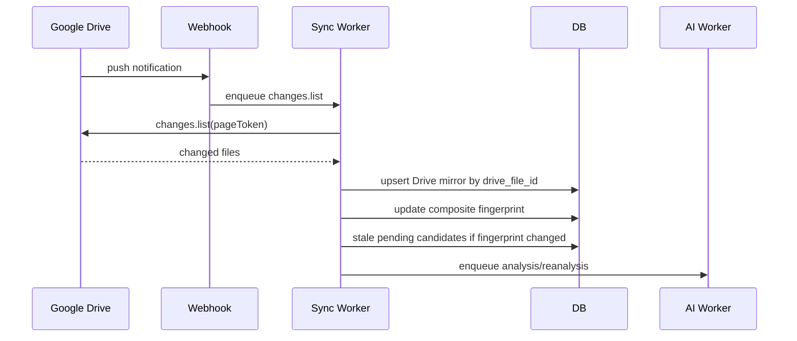
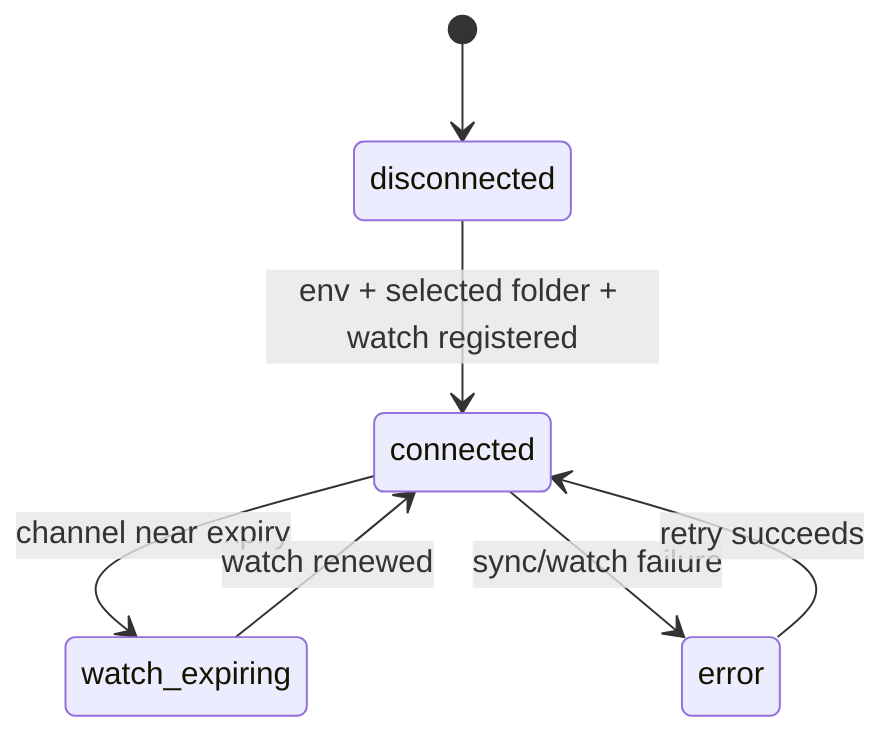
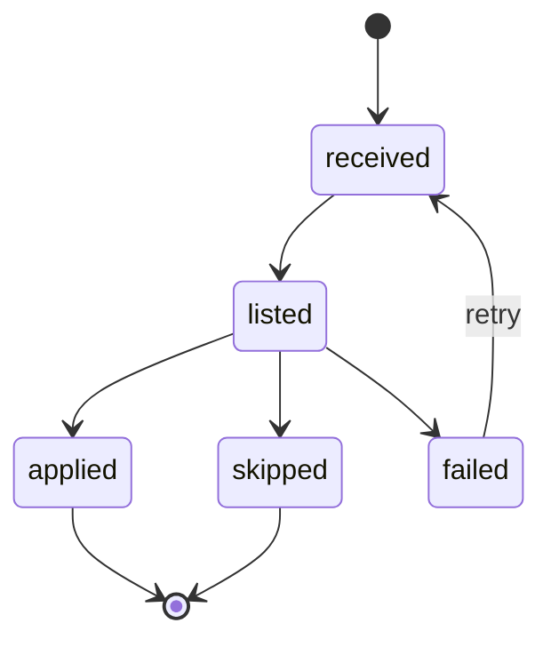

# Google Drive Connector & Sync

이 spec은 Google Drive 선택 폴더를 제품으로 연결하고, Drive 변경을 DB document record와 metadata candidate lifecycle에 반영하는 외부 계약을 정의한다. v1 데모는 `drive.readonly` scope와 선택 폴더 1개를 사용하며, 기존 파일 소급 처리는 하지 않는다.

## 1. Context

### Meta

- Decision reference: DEC-001, DEC-003, DEC-009, DEC-011, DEC-019, DEC-022, DEC-023
- Baseline reference: BASE-001
- Related spec: SPEC-001 User & RBAC, SPEC-003 Document Metadata Record
- Domain note: Drive connector OAuth는 사용자 로그인과 분리된 환경 설정이다.
- Open questions: 없음

### Business Requirement

사용자는 Drive 폴더에 파일을 넣기만 해도 제품이 새 변경을 감지하고 metadata 후보를 준비해야 한다. 운영자는 감시 폴더, webhook 상태, 마지막 sync 상태를 확인할 수 있어야 한다. 제품은 Drive를 파일 SoT로 두고, DB에는 최신 mirror와 승인 후보/상태만 저장해야 한다.

### Scope

In scope:

- Drive connector env 설정 계약
- `drive.readonly` OAuth scope 사용
- 선택 폴더 1개와 하위 항목 감시
- `changes.watch` webhook channel 생성/갱신
- `changes.list` 기반 변경 조회
- `startPageToken`/page token 저장과 재시작 후 이어받기
- Drive mirror upsert와 soft delete 상태 반영
- composite fingerprint 갱신
- pending candidate stale 처리와 자동 재분석 enqueue
- 원문 미저장 안전 경계

Out of scope:

- Google social login
- Google Cloud Storage
- Workspace Events API + Pub/Sub 운영 파이프라인
- 전체 My Drive 또는 Shared Drive 전체 감시
- 기존 Drive 파일 backfill/import
- AI 분석 prompt/reader 상세
- 승인 게이트 UI 상세: SPEC-005

## 2. UX Contract

### Placement

Google Drive Connector는 관리자 설정 화면의 외부 연동 섹션에서 상태 중심으로 노출된다.

```text
+--------------------------------------------------+
| Admin Header                                     |
+------------------+-------------------------------+
| Settings Nav     | Google Drive Connector         |
|                  | Folder / Watch / Sync Status   |
+------------------+-------------------------------+
```

### U-1. Connector Status

- **상태**:
  - connected: Drive connector env가 있고 선택 폴더가 설정됨.
  - disconnected: env 또는 선택 폴더가 없음.
  - watch_expiring: watch channel 만료가 가까움.
  - error: 마지막 sync/webhook 처리 실패.
- **문구**:
  - section label: `Google Drive 연동`
  - scope label: `drive.readonly`
  - folder label: `감시 폴더`
  - status label: `연결됨`, `설정 필요`, `갱신 필요`, `오류`
- **CTA**:
  - `상태 새로고침`: admin에게 노출.
  - `watch 갱신`: watch channel 재등록이 필요할 때 admin에게 노출.
- **기대 결과**:
  - admin은 Drive connector가 현재 변경을 받을 수 있는지 확인한다.

### U-2. Sync Activity

- **상태**:
  - idle: 처리할 변경 없음.
  - syncing: changes list 처리 중.
  - delayed: webhook은 받았지만 처리 대기 중.
  - failed: 마지막 처리 실패.
- **문구**:
  - label: `마지막 동기화`, `마지막 변경 토큰`, `처리된 변경 수`
  - error message: `Drive 변경 처리에 실패했습니다.`
- **CTA**:
  - `다시 처리`: 실패 상태에서 admin에게 노출.
- **기대 결과**:
  - sync 재시도는 같은 change를 중복 처리해도 최종 상태가 같아야 한다.

### U-3. Document Intake Result

- **상태**:
  - new document: 새 Drive file이 document record로 등록됨.
  - updated document: 기존 document mirror가 갱신됨.
  - unavailable document: `trashed`, `removed`, `out_of_scope`.
  - metadata_only: 본문 분석 없이 metadata 후보만 생성됨.
- **문구**:
  - label: `새 문서`, `갱신된 문서`, `숨김 처리`, `본문 분석 없음`
- **CTA**:
  - `승인 게이트로 이동`: 후보가 있을 때 admin에게 노출.
- **기대 결과**:
  - admin은 Drive 변경이 어떤 문서 상태 변화로 반영됐는지 확인할 수 있다.

## 3. User Scenario

### S-1. Admin — Drive connector 상태 확인

1. admin은 설정 화면에서 Google Drive 연동 상태를 연다.
2. 시스템은 env 기반 connector 설정, 선택 폴더, watch channel 상태를 조회한다.
3. 설정이 유효하면 connected 상태를 표시한다.
4. watch channel 만료가 가까우면 갱신 필요 상태를 표시한다.
5. 오류가 있으면 마지막 실패 사유와 재시도 CTA를 표시한다.

### S-2. System — 새 Drive 파일 수집

1. Drive가 webhook으로 변경 알림을 보낸다.
2. 시스템은 알림을 트리거로만 사용하고 `changes.list`로 실제 변경 목록을 조회한다.
3. 변경 파일이 선택 폴더 하위에 있으면 수집 대상으로 판단한다.
4. 시스템은 `drive_file_id` 기준으로 document record를 upsert한다.
5. Drive mirror와 composite fingerprint를 저장한다.
6. 가능한 경우 본문을 읽어 AI metadata candidate 생성을 요청한다.
7. 본문을 읽을 수 없으면 `metadata_only` 후보를 만든다.

### S-3. System — Drive 파일 변경 반영

1. Drive 변경이 기존 `drive_file_id`에 대해 감지된다.
2. 시스템은 기존 document record를 새로 만들지 않고 Drive mirror만 갱신한다.
3. composite fingerprint가 바뀌면 pending candidate를 stale 처리한다.
4. stale 처리 후 최신 mirror 기준 AI 재분석 job을 enqueue한다.
5. 승인된 metadata는 Drive mirror 변경만으로 자동 삭제하지 않는다.

### S-4. System — Drive 삭제/휴지통/범위 제외 반영

1. Drive changes에서 삭제, 휴지통 이동, 선택 폴더 범위 제외가 감지된다.
2. 시스템은 document record를 hard delete하지 않는다.
3. `drive_state`를 `trashed`, `removed`, `out_of_scope` 중 하나로 변경한다.
4. 일반 사용자 UI에서는 해당 문서를 숨긴다.
5. pending candidate가 있으면 blocked 또는 stale 처리하고 승인 저장을 막는다.

### S-5. System — 재시작 후 sync 이어받기

1. 시스템이 재시작된다.
2. 저장된 page token 또는 start token을 읽는다.
3. 마지막 처리 지점 이후 변경을 `changes.list`로 조회한다.
4. 이미 처리한 변경은 idempotent하게 무시하거나 같은 최종 상태로 반영한다.
5. 처리가 끝나면 다음 page token을 저장한다.

## 4. Interface Contract

### API Contract

| Method | Path | 요약 | 권한 |
|---|---|---|---|
| GET | `/admin/drive-connector` | Drive connector 상태 조회 | admin |
| POST | `/admin/drive-connector/watch` | watch channel 생성/갱신 | admin |
| POST | `/admin/drive-connector/sync/retry` | 실패한 sync 재시도 | admin |
| POST | `/webhooks/google-drive` | Drive push notification 수신 | Google Drive/system |
| GET | `/admin/drive-sync-events` | sync event/audit 조회 | admin |

Webhook endpoint는 공개 HTTPS로 접근 가능해야 한다. Drive notification이 아닌 요청은 처리하지 않는다.

> 구현 확정(WORK-003): 검증은 `X-Goog-Channel-ID`가 저장된 channel id와 일치하고 `X-Goog-Channel-Token`이 HMAC-SHA256(`JWT_SECRET`, channel_id)과 일치해야 한다(resource id 일치 포함). 불일치 시 `DRIVE_WEBHOOK_INVALID` event 기록 후 무시하고 항상 204를 반환한다(정보 비누설).

### Request / Response

#### Connector status

| Field | Type | 설명 |
|---|---|---|
| `status` | enum | `connected`, `disconnected`, `watch_expiring`, `error` |
| `scope` | text | `drive.readonly` |
| `selected_folder_id` | text | 감시 대상 Drive folder id |
| `selected_folder_name` | text | 감시 대상 표시명 |
| `watch_channel_id` | text | 현재 watch channel id |
| `watch_expires_at` | datetime | channel 만료 시각 |
| `last_sync_at` | datetime | 마지막 sync 완료 시각 |
| `last_error` | text | 마지막 오류 메시지 |

#### Sync event

| Field | Type | 설명 |
|---|---|---|
| `id` | int | sync event id |
| `event_type` | enum | `webhook_received`, `changes_listed`, `document_upserted`, `document_unavailable`, `candidate_staled`, `reanalysis_enqueued`, `sync_failed` |
| `drive_file_id` | text | 관련 Drive file id |
| `document_id` | int | 관련 document id |
| `occurred_at` | datetime | 발생 시각 |
| `result` | enum | `success`, `skipped`, `failed` |
| `message` | text | 사람이 읽는 요약 |

#### Environment contract

| Env | Required | 설명 |
|---|---|---|
| `GOOGLE_DRIVE_CLIENT_ID` | yes | Drive OAuth client id |
| `GOOGLE_DRIVE_CLIENT_SECRET` | yes | Drive OAuth client secret |
| `GOOGLE_DRIVE_REFRESH_TOKEN` | yes | connector refresh token |
| `GOOGLE_DRIVE_SELECTED_FOLDER_ID` | yes | 감시 대상 folder id |
| `GOOGLE_DRIVE_WEBHOOK_URL` | yes | Drive watch callback URL |

env 값 자체는 제품 문서나 log에 남기지 않는다.

v1의 감시 폴더 선택/변경은 관리자 화면이 아니라 `GOOGLE_DRIVE_SELECTED_FOLDER_ID` env 변경으로 수행한다(DEC-009의 폴더 선택/변경 UX는 v1에서 env 설정으로 대체). 폴더가 변경되면 이전 폴더에만 속한 기존 문서는 DEC-011에 따라 `out_of_scope`로 전환하고 일반 UI에서 숨긴다.

### Validation

| 필드 | 규칙 |
|---|---|
| OAuth scope | v1은 `drive.readonly`만 허용한다. |
| selected folder | 1개만 설정 가능하다. 변경은 env 변경으로만 수행하며, 변경 시 이전 범위 문서는 `out_of_scope` 처리한다. |
| webhook URL | HTTPS URL이어야 한다. |
| Drive file | 선택 폴더 하위 항목만 수집 대상으로 처리한다. |
| backfill | 구독 시작 전 기존 파일 전체 import는 수행하지 않는다. |
| original content | Drive 원문/본문은 DB에 저장하지 않는다. |
| change token | 처리 성공 후 다음 token을 저장해야 한다. |
| watch channel | 만료 전 갱신 가능해야 한다. |

### Case Matrix

| 에러 코드 | 백엔드 출력 | 프론트 출력 | 표시 위치 |
|---|---|---|---|
| `DRIVE_CONNECTOR_NOT_CONFIGURED` | missing drive connector env | Drive 연동 설정이 필요합니다. | admin connector |
| `DRIVE_FOLDER_NOT_CONFIGURED` | missing selected folder id | 감시 폴더를 설정하세요. | admin connector |
| `DRIVE_WATCH_EXPIRED` | watch channel expired | Drive watch 갱신이 필요합니다. | admin connector |
| `DRIVE_WEBHOOK_INVALID` | invalid drive notification | 유효하지 않은 Drive 알림입니다. | sync audit |
| `DRIVE_CHANGES_FAILED` | changes.list failed | Drive 변경 조회에 실패했습니다. | sync activity |
| `DRIVE_FILE_OUT_OF_SCOPE` | file outside selected folder | 감시 범위 밖 문서입니다. | sync audit |
| `DRIVE_CONTENT_UNREADABLE` | content read failed | 본문 분석 없이 후보를 생성합니다. | approval gate |
| `DRIVE_SYNC_CONFLICT` | document changed during approval | Drive 파일이 변경되어 다시 분석합니다. | approval gate |

### Flow



### State / Lifecycle

#### Connector state



#### Sync event result



### Data Contract

| Resource | 외부 계약 |
|---|---|
| Drive connector | env 기반 Drive OAuth와 선택 폴더 설정을 대표한다. |
| Watch channel | Drive push notification channel이다. 만료와 갱신 상태를 가진다. |
| Change token | `changes.list` 이어받기 기준이다. |
| Drive mirror update | SPEC-003 document record의 Drive-derived field 갱신이다. |
| Sync event | 관리자 감사용 처리 결과다. |

## 5. Implementation Rules

- Drive push notification은 변경 payload SoT가 아니라 trigger다.
- 실제 변경 조회는 `changes.list`로 수행한다.
- `drive_file_id` 기준 upsert는 idempotent해야 한다.
- 같은 Drive change가 여러 번 처리되어도 최종 document state는 같아야 한다.
- Drive sync는 Drive mirror field만 갱신한다.
- 승인 metadata는 Drive sync가 자동 덮어쓰지 않는다.
- Drive 원문/본문은 DB에 저장하지 않는다.
- DB에는 mirror, summary, 후보 metadata, 승인 metadata만 저장한다.
- 선택 폴더 밖 파일은 `out_of_scope`로 처리하거나 수집에서 제외한다.
- pending candidate와 current fingerprint가 달라지면 candidate를 stale 처리한다.
- stale 처리 후 자동 재분석 job을 enqueue한다.
- `trashed`, `removed`, `out_of_scope` 문서는 자동 재분석하지 않는다.
- watch channel 만료 전에 갱신 job이 실행되어야 한다.
- Workspace Events API + Pub/Sub는 v1 범위가 아니다.

## 6. Verification

### Acceptance Criteria

- [ ] Drive connector는 env 기반으로 설정되고 user login/RBAC와 분리된다.
- [ ] v1 OAuth scope는 `drive.readonly`로 표시된다.
- [ ] 감시 대상은 선택 폴더 1개와 하위 항목으로 제한된다.
- [ ] 기존 파일 backfill/import는 수행되지 않는다.
- [ ] Drive webhook 수신 후 `changes.list` 기반으로 변경을 조회한다.
- [ ] `drive_file_id` 기준으로 document record가 멱등 upsert된다.
- [ ] Drive 원문/본문은 DB에 저장되지 않는다.
- [ ] Drive 삭제/휴지통/범위 제외는 hard delete가 아니라 `drive_state` 변경으로 반영된다.
- [ ] Drive mirror fingerprint 변경 시 pending candidate가 stale 처리된다.
- [ ] stale 후보 발생 후 자동 재분석 job이 enqueue된다.
- [ ] 본문을 읽을 수 없는 파일은 `metadata_only` 후보로 승인 게이트에 전달된다.
- [ ] watch channel 만료/오류 상태는 admin connector 화면에서 확인 가능하다.
- [ ] 감시 폴더(env) 변경 시 이전 폴더에만 속한 문서가 `out_of_scope`로 전환된다.

## 7. Open Questions

없음.
