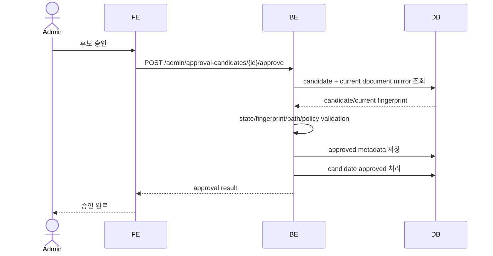
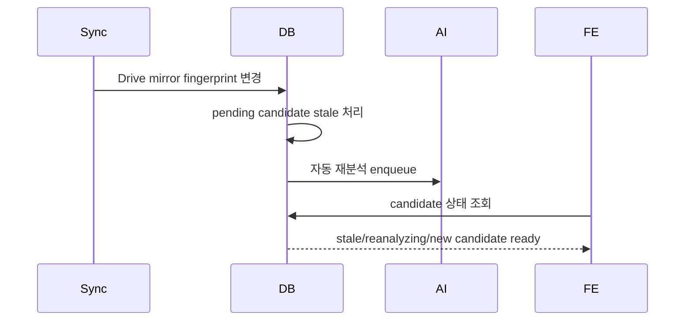
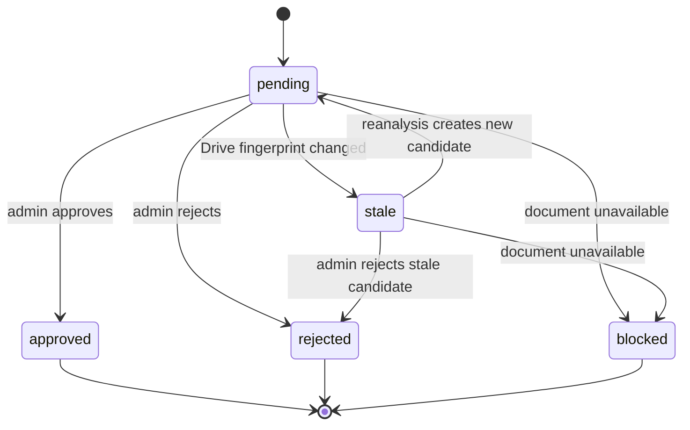

# Approval Gate

이 spec은 AI가 생성한 metadata 후보를 관리자가 검토, 수정, 승인, 거절하는 승인 게이트의 외부 계약을 정의한다. 승인 전 후보는 제품의 확정 metadata가 아니며, 일반 사용자에게 확정값처럼 노출되지 않는다.

## 1. Context

### Meta

- Decision reference: DEC-001, DEC-007, DEC-011, DEC-018, DEC-021, DEC-022
- Baseline reference: BASE-001, BASE-002
- Related spec: SPEC-001 User & RBAC, SPEC-002 Organization & Tree, SPEC-003 Document Metadata Record, SPEC-004 Google Drive Connector & Sync
- Domain note: 승인 게이트는 admin 전용이다.
- Open questions: 없음

### Business Requirement

AI가 추천한 문서 분류, 귀속, 권한, 민감 preset, 요약, relation 후보는 사람이 승인해야 제품 데이터가 된다. 관리자는 최신 Drive 상태와 후보 상태를 확인하고, 잘못된 추천을 수정하거나 거절할 수 있어야 한다. stale 후보나 삭제된 문서 후보는 승인할 수 없어야 한다.

### Scope

In scope:

- admin 전용 승인 게이트 접근
- AI metadata 후보 목록/상세 검토
- 후보 승인/수정/거절
- 문서종류 드롭다운과 관리자 전용 새 문서종류 추가
- 민감 문서 preset 추천/수정/승인
- 후보 원장 상태 `pending`, `stale`, `approved`, `rejected`, `blocked` 표시
- stale 후보의 표시용 재분석 상태 `reanalyzing`, `new_candidate_ready`, `reanalysis_failed` 표시
- stale 후보 승인 차단과 자동 재분석 상태 표시
- unresolved relation candidate 처리
- metadata-only 후보 표시

Out of scope:

- AI 분석 prompt/reader 구현 상세
- Google Drive sync 구현 상세: SPEC-004
- 문서 relation graph 탐색 상세: SPEC-006
- 유사 문서종류 merge
- 부서별 문서종류 shortcut
- Drive 원문 저장

## 2. UX Contract

### Placement

Approval Gate는 admin 전용 작업 화면이다.

```text
+--------------------------------------------------+
| Admin Header                                     |
+------------------+-------------------------------+
| Candidate Queue  | Candidate Detail               |
| Filters          | Metadata / Access / Relations  |
|                  | Actions                        |
+------------------+-------------------------------+
```

### U-1. Candidate Queue

- **상태**:
  - 정상: 승인 대기 후보 목록을 표시한다.
  - 빈 상태: `승인할 후보가 없습니다.`
  - 로딩: queue skeleton을 표시한다.
  - 권한없음: admin이 아니면 접근을 차단한다.
- **문구**:
  - queue label: `승인 대기`
  - filters: `전체`, `승인 대기`, `stale`, `재분석 중`, `차단됨`, `본문 분석 없음`
- **CTA**:
  - 후보 선택: 상세 패널을 연다.
  - 상태 필터: 후보 목록을 상태별로 필터링한다.
- **기대 결과**:
  - admin은 처리해야 할 후보와 막힌 후보를 구분해서 볼 수 있다.

### U-2. Candidate Detail

- **상태**:
  - pending: 승인/수정/거절 가능.
  - stale: 승인 불가, 재분석 상태 표시.
  - reanalyzing: 최신 Drive mirror 기준 재분석 중. 표시용 파생 상태.
  - new_candidate_ready: 새 후보 검토 가능. 표시용 파생 상태.
  - blocked: 삭제/휴지통/범위 제외/읽기 실패 등으로 승인 불가.
  - metadata_only: 본문 분석 없이 Drive metadata 기반 후보임을 표시.
- **문구**:
  - title: `drive_name`
  - stale message: `Drive 파일이 변경되어 이 후보는 승인할 수 없습니다.`
  - 표시용 상태 라벨: `재분석 중`(reanalyzing), `새 후보 준비됨`(new_candidate_ready), `재분석 실패`(reanalysis_failed)
  - metadata-only message: `본문 분석 없이 Drive 정보만으로 생성된 후보입니다.`
  - blocked message: `현재 문서 상태에서는 승인할 수 없습니다.`
- **CTA**:
  - `승인`: pending 상태에서만 활성화.
  - `수정 후 승인`: pending 상태에서만 활성화.
  - `거절`: pending 또는 stale 상태에서 가능.
  - `재분석`: 자동 재분석 실패 상태에서만 활성화.
  - `Drive에서 열기`: Drive 링크가 있을 때 활성화.
- **기대 결과**:
  - 승인 시 후보 metadata가 approved metadata로 반영된다.
  - stale/blocked 후보는 승인 저장이 막힌다.

### U-3. Metadata Form

- **상태**:
  - 정상: AI 후보값이 form 초기값으로 표시된다.
  - validation error: 필수 metadata가 없거나 유효하지 않으면 저장 불가.
- **문구**:
  - section label: `문서 정보`, `귀속`, `권한`, `요약`
  - fields: `문서종류`, `생성부서`, `귀속부서`, `문서 위치`, `읽기 권한`, `민감도`, `요약`
- **CTA**:
  - `문서종류 추가`: admin만 가능.
  - `위치 선택`: SPEC-002의 active path만 선택 가능.
- **기대 결과**:
  - 승인 metadata는 SPEC-003 document record에 반영된다.

### U-4. Document Type Add

- **상태**:
  - 정상: 드롭다운에 없는 문서종류를 추가할 수 있다.
  - duplicate: 정규화된 이름이 이미 있으면 저장 불가.
- **문구**:
  - modal title: `문서종류 추가`
  - duplicate message: `이미 존재하는 문서종류입니다.`
- **CTA**:
  - `추가`: unique한 이름일 때 활성화.
- **기대 결과**:
  - 새 문서종류는 전사 공통 카탈로그에 추가된다.
  - 기존 문서의 문서종류는 자동 변경되지 않는다.

### U-5. Sensitive Preset Review

- **상태**:
  - suggested: AI가 민감 문서와 preset을 추천.
  - accepted: admin이 preset을 승인.
  - modified: admin이 preset/read policy를 수정.
  - removed: admin이 민감 아님으로 판단.
- **문구**:
  - section label: `민감 문서 권한`
  - candidate label: `제한 필요`
  - preset examples: `HR_RESTRICTED`, `CONTRACT_RESTRICTED`, `FINANCE_RESTRICTED`, `SECURITY_RESTRICTED`, `LEGAL_RESTRICTED`
- **CTA**:
  - `preset 승인`
  - `권한 수정`
  - `민감 아님`
- **기대 결과**:
  - 승인된 preset은 named access policy/read policy로 저장된다.

### U-6. Relation Candidate Review

- **상태**:
  - resolved: target document가 있는 relation 후보.
  - unresolved: target document가 없는 wikilink/relation 후보.
  - ambiguous: 같은 이름의 target 후보가 여러 개.
- **문구**:
  - section label: `문서 연결`
  - unresolved message: `대상 문서를 찾을 수 없습니다.`
- **CTA**:
  - `대상 선택`: 기존 문서 검색 후 target 지정.
  - `보류`: unresolved 후보 유지.
  - `제거`: 후보 제거.
  - `재매칭`: 신규 수집 문서 기준으로 title/drive_name target 재검색 (DEC-021).
- **기대 결과**:
  - unresolved 후보는 확정 graph에 반영되지 않는다.
  - 새 document row는 자동 생성하지 않는다.

## 3. User Scenario

### S-1. Admin — 후보 승인

1. admin은 승인 게이트에 진입한다.
2. 시스템은 admin role을 확인한다.
3. admin은 pending 후보를 선택한다.
4. 시스템은 현재 Drive fingerprint와 candidate fingerprint를 비교한다.
5. fingerprint가 같으면 승인 CTA를 활성화한다.
6. admin은 metadata form을 확인하고 필요한 값을 수정한다.
7. admin은 승인한다.
8. 시스템은 승인 metadata를 document record에 반영하고 후보를 `approved`로 닫는다.

### S-2. Admin — stale 후보 처리

1. admin은 stale 후보를 선택한다.
2. 시스템은 `Drive 파일이 변경되어 이 후보는 승인할 수 없습니다.` 메시지를 표시한다.
3. 승인 CTA는 비활성화된다.
4. 자동 재분석 중이면 `reanalyzing` 상태를 표시한다.
5. 재분석이 성공하면 새 pending 후보를 표시한다.
6. 재분석 실패 시 admin은 수동 재분석을 실행할 수 있다.

### S-3. Admin — 문서종류 추가

1. admin은 문서종류 드롭다운에서 적절한 값을 찾지 못한다.
2. admin은 `문서종류 추가`를 선택한다.
3. 시스템은 이름 정규화 후 중복 여부를 확인한다.
4. 중복이 없으면 새 문서종류를 전사 공통 카탈로그에 추가한다.
5. 추가된 문서종류가 현재 후보 form에 선택된다.

### S-4. Admin — 민감 preset 승인

1. AI가 문서를 HR/계약/재무/보안/법무 유형 중 하나로 판단한다.
2. 승인 게이트는 `제한 필요` 후보와 preset/reason을 표시한다.
3. admin은 preset을 그대로 승인하거나 read policy를 수정한다.
4. admin이 민감 아님으로 판단하면 preset 후보를 제거한다.
5. 승인 시 최종 read policy가 document metadata에 저장된다.

### S-5. Admin — unresolved relation 처리

1. AI가 `[[문서명]]` 링크를 relation 후보로 제안한다.
2. 시스템이 target document를 찾지 못하면 unresolved 후보로 표시한다.
3. admin은 기존 문서를 검색해 target을 지정하거나, 보류하거나, 제거한다.
4. target을 지정한 후보만 승인 graph에 반영 가능한 상태가 된다.
5. Drive 원본 없는 placeholder document는 생성하지 않는다.

## 4. Interface Contract

### API Contract

| Method | Path | 요약 | 권한 |
|---|---|---|---|
| GET | `/admin/approval-candidates` | 승인 후보 목록 조회 | admin |
| GET | `/admin/approval-candidates/{id}` | 후보 상세 조회 | admin |
| POST | `/admin/approval-candidates/{id}/approve` | 후보 승인 | admin |
| POST | `/admin/approval-candidates/{id}/reject` | 후보 거절 | admin |
| POST | `/admin/approval-candidates/{id}/reanalyze` | 수동 재분석 요청 | admin |
| GET | `/admin/document-types` | 문서종류 카탈로그 조회 | admin |
| POST | `/admin/document-types` | 문서종류 추가 | admin |
| POST | `/admin/relation-candidates/{id}/resolve` | relation target 지정 | admin |
| POST | `/admin/relation-candidates/{id}/hold` | unresolved relation 보류 | admin |
| POST | `/admin/relation-candidates/{id}/remove` | relation 후보 제거 | admin |
| POST | `/admin/relation-candidates/{id}/rematch` | unresolved 후보 target 재검색 | admin |

### Request / Response

#### Approval candidate

| Field | Type | 설명 |
|---|---|---|
| `id` | int | 후보 id |
| `document_id` | int | 대상 문서 |
| `drive_name` | text | Drive 기본 제목 |
| `state` | enum | `pending`, `stale`, `approved`, `rejected`, `blocked`. SPEC-003 후보 원장 enum과 동일 |
| `reanalysis_status` | enum or null | 표시용 파생 상태. `reanalyzing`, `new_candidate_ready`, `reanalysis_failed`. 원장에 저장하지 않고 stale 후보 + 재분석 job 상태에서 계산한다 (DEC-022 Admin UI States) |
| `read_capability` | enum | `content_read`, `metadata_only` |
| `candidate_metadata` | object | AI 추천 metadata |
| `candidate_fingerprint` | object | 후보 생성 시 Drive fingerprint |
| `current_fingerprint` | object | 현재 Drive mirror fingerprint |
| `stale_reason` | text | stale 사유 |
| `blocked_reason` | text | blocked 사유 |

#### Approval payload

| Field | Type | Required | 설명 |
|---|---|---|---|
| `document_type_id` | int | yes | 전사 공통 문서종류 stable id |
| `created_department_node_id` | int | no | 생성부서 조직 노드 id |
| `owning_department_node_id` | int | yes | 귀속부서 노드 id. `physical_tree_path`의 부서 축에서 파생되며 일치해야 한다 |
| `physical_tree_path` | object | yes | SPEC-002 active path (`organization_path`/`tree_path` 노드 id 배열) |
| `related_departments` | array | no | 관련 부서 |
| `related_products` | array | no | 관련 제품/팀 |
| `summary` | text | no | 승인 요약 |
| `read_roles` | array | no | 읽기 role |
| `read_departments` | array | no | 읽기 부서 |
| `read_positions` | array | no | 읽기 직급 |
| `access_logic` | enum | yes | `ANY`, `ALL`, `PRESET` |
| `sensitivity` | enum | yes | `normal`, `sensitive` |
| `policy_preset` | text | no | 민감 preset |

> 구현 확정(WORK-005): payload의 부서/트리/문서종류 참조는 name이 아니라 stable id다. `read_departments`는 조직 노드 id 목록(SPEC-001). `access_logic=PRESET` 승인 시 read policy 필드는 preset 정의로만 풀어 저장하며(payload의 read_* 무시), 개별 조정은 `권한 수정`(ANY/ALL 직접 설정) 경로를 쓴다. 같은 payload 재시도는 멱등 성공이다.

### Validation

| 필드 | 규칙 |
|---|---|
| candidate state | 승인은 `pending`만 가능. 거절은 `pending` 또는 `stale`에서 가능 |
| fingerprint | 승인 시 current와 candidate fingerprint가 같아야 한다 |
| document state | `active` 문서만 승인 가능 |
| document_type | 전사 공통 카탈로그에 존재해야 한다 |
| new document_type | 정규화된 이름 기준 unique해야 한다 |
| physical_tree_path | SPEC-002의 active path여야 한다 |
| owning_department | 단일값이어야 한다 |
| access_logic | `ANY`, `ALL`, `PRESET`만 허용 |
| policy_preset | 민감 preset catalog 값 또는 null |
| unresolved relation | target 없는 상태로 확정 graph 승인 불가 |

### Case Matrix

| 에러 코드 | 백엔드 출력 | 프론트 출력 | 표시 위치 |
|---|---|---|---|
| `FORBIDDEN_ADMIN_ONLY` | admin permission required | 관리자만 사용할 수 있습니다. | page |
| `CANDIDATE_NOT_FOUND` | candidate not found | 후보를 찾을 수 없습니다. | queue/detail |
| `CANDIDATE_NOT_PENDING` | candidate is not pending | 승인할 수 없는 후보 상태입니다. | detail actions |
| `CANDIDATE_STALE` | candidate fingerprint mismatch | Drive 파일이 변경되어 다시 분석해야 합니다. | detail banner |
| `DOCUMENT_UNAVAILABLE` | document is unavailable | 현재 문서 상태에서는 승인할 수 없습니다. | detail banner |
| `DOCUMENT_TYPE_DUPLICATE` | duplicate document type | 이미 존재하는 문서종류입니다. | document type modal |
| `INVALID_TREE_PATH` | invalid physical_tree_path | 문서 위치를 확인하세요. | metadata form |
| `INVALID_ACCESS_POLICY` | invalid access policy | 접근 권한 설정을 확인하세요. | access form |
| `RELATION_TARGET_REQUIRED` | unresolved relation target required | 대상 문서를 선택하거나 보류하세요. | relation section |
| `REANALYSIS_FAILED` | reanalysis enqueue failed | 재분석 요청에 실패했습니다. | detail actions |
| `DOCUMENT_TYPE_NOT_FOUND` | document type not found | 문서종류를 확인하세요. | metadata form |

> 구현 확정(WORK-005): 귀속/관련 부서 노드 검증 실패는 SPEC-002의 `ORG_NODE_NOT_FOUND`/`ORG_NODE_INACTIVE`를 재사용한다. stale 표기는 역할을 나눈다 — 상세 배너는 U-2 문구(`Drive 파일이 변경되어 이 후보는 승인할 수 없습니다.`), `CANDIDATE_STALE` 프론트 출력은 승인 action 실패 응답에 쓴다. BE 에러 detail은 `{error_code, message(영문)}`이고 한국어 카피는 FE가 error_code로 매핑한다.

### Flow





### State / Lifecycle



후보 원장 상태 기계는 SPEC-003 candidate state와 동일하다. `reanalyzing`/`new_candidate_ready`/`reanalysis_failed`는 원장 상태가 아니라 stale 후보와 재분석 job 상태에서 파생하는 표시용 상태다(DEC-022). 재분석이 성공하면 기존 stale 후보는 종결되고 새 `pending` 후보가 생성된다.

### Data Contract

| Resource | 외부 계약 |
|---|---|
| Approval candidate | AI가 만든 승인 전 metadata 후보다. |
| Approved metadata | admin 승인 후 document record에 반영되는 제품 metadata다. |
| Document type catalog | 전사 공통 문서종류 목록이다. |
| Sensitive preset | 민감 문서 권한 후보다. admin 승인 후 read policy로 저장된다. |
| Relation candidate | 문서 relation 후보다. unresolved 상태는 확정 graph가 아니다. |

## 5. Implementation Rules

- 승인 게이트는 admin 전용이다.
- 일반 사용자는 승인 전 후보를 확정 metadata처럼 볼 수 없다.
- 승인 action은 candidate state와 fingerprint를 다시 검사해야 한다.
- stale 후보는 승인할 수 없다.
- Drive 삭제/휴지통/범위 제외 문서는 승인할 수 없다.
- 새 문서종류 추가는 admin만 가능하다.
- v1에서는 유사 문서종류 merge를 제공하지 않는다.
- v1에서는 부서별 문서종류 shortcut을 제공하지 않는다.
- 민감 preset은 AI 추천 후보이며 admin 승인 전 확정 policy가 아니다.
- unresolved relation은 보류/제거/target 지정/재매칭 중 하나로 처리한다.
- 새 Drive 문서가 수집되면 unresolved relation 후보를 title/drive_name 기반으로 재검색해 재매칭 후보를 제안할 수 있다. 재매칭 확정은 admin의 target 지정으로만 발생한다.
- target 없는 relation 때문에 새 document row를 자동 생성하지 않는다.
- 같은 승인 요청이 재시도되어도 이미 같은 결과로 승인됐다면 멱등 성공으로 처리할 수 있다.

## 6. Verification

### Acceptance Criteria

- [ ] admin이 아닌 사용자는 승인 게이트에 접근할 수 없다.
- [ ] pending 후보만 승인 가능하다.
- [ ] stale 후보는 승인 CTA가 비활성화되고 stale 메시지가 표시된다.
- [ ] stale 후보는 승인은 불가하지만 거절은 가능하다.
- [ ] 후보 원장 `state`는 SPEC-003과 동일한 5개 enum이고, `reanalyzing`/`new_candidate_ready`는 원장에 저장되지 않는다.
- [ ] reanalyzing 상태에서는 최신 후보 준비 중 상태가 표시된다.
- [ ] metadata-only 후보는 본문 분석 없음 메시지를 표시한다.
- [ ] 승인 시 문서종류, 물리 위치, 권한 policy validation이 수행된다.
- [ ] 새 문서종류는 admin만 추가할 수 있고 중복 이름은 거절된다.
- [ ] 민감 preset 후보는 admin이 승인/수정/제거할 수 있다.
- [ ] unresolved relation 후보는 target 지정/보류/제거만 가능하고 자동 문서 생성은 하지 않는다.
- [ ] 승인 완료 후 approved metadata가 SPEC-003 document record에 반영된다.

## 7. Open Questions

없음.
