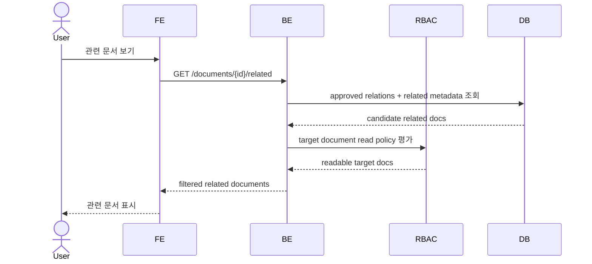
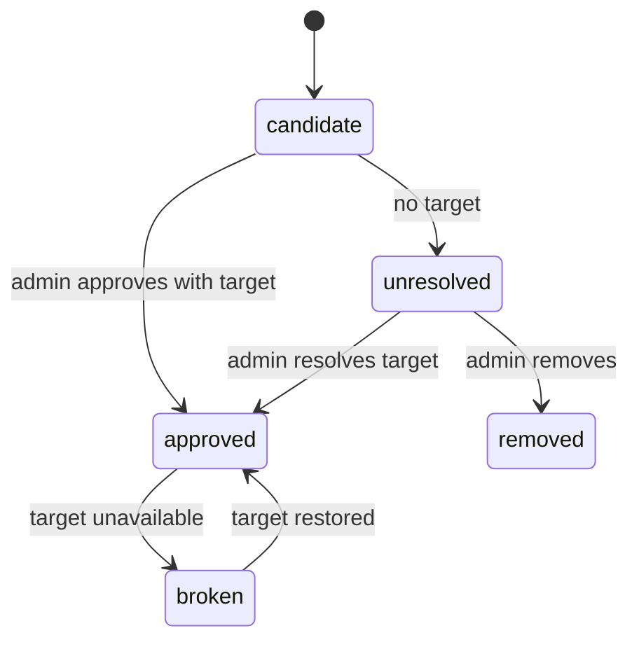

# Document Relations & Explorer

이 spec은 승인된 문서 relation과 관련 metadata를 사용해 문서를 탐색하는 외부 계약을 정의한다. 문서 연결의 SoT는 DB relation이며, `[[문서명]]` 같은 wikilink 표현은 AI/UI 입력 후보일 뿐 최종 원장이 아니다.

## 1. Context

### Meta

- Decision reference: DEC-010, DEC-014, DEC-020, DEC-021
- Baseline reference: BASE-002
- Related spec: SPEC-001 User & RBAC, SPEC-002 Organization & Tree, SPEC-003 Document Metadata Record, SPEC-005 Approval Gate
- Domain note: 기본 목록은 물리 귀속, 관련 문서 영역은 논리 연결 기준이다.
- Open questions: 없음

### Business Requirement

사용자는 부서 트리에서 관리 주체별 문서를 탐색하면서도, 관련 부서/제품/문서 관계를 통해 연결된 문서를 함께 발견할 수 있어야 한다. 동시에 물리 귀속 문서와 논리 연결 문서가 섞여 관리 책임이 흐려지면 안 된다.

### Scope

In scope:

- 승인된 DB document relation 조회
- v1 relation type: `related`, `references`, `supersedes`, `duplicate_candidate`
- 부서 기본 목록과 관련 문서 영역의 노출 분리
- 검색 결과에서 물리 귀속/관련 문서 출처 표시
- 문서 상세의 relation 섹션
- unresolved relation candidate의 탐색 제외
- 권한 없는 문서 숨김

Out of scope:

- relation 후보 승인 UI: SPEC-005
- 문서 metadata field 상세: SPEC-003
- 조직/트리 설정 상세: SPEC-002
- relation type 자유 입력
- duplicate candidate merge
- Drive 원본 없는 placeholder document 생성

## 2. UX Contract

### Placement

문서 relation은 문서 탐색 화면과 문서 상세 화면에 노출된다.

```text
+--------------------------------------------------+
| App Header                                       |
+------------------+-------------------------------+
| Organization     | Department Document List       |
| Tree Sidebar     | Related Documents              |
+------------------+-------------------------------+
```

문서 상세:

```text
+--------------------------------------------------+
| Document Header                                  |
+------------------+-------------------------------+
| Metadata         | Relations / Related Context     |
+------------------+-------------------------------+
```

### U-1. Department Document List

- **상태**:
  - 정상: 선택 path에 물리 귀속된 문서만 표시한다.
  - 빈 상태: `이 위치에 귀속된 문서가 없습니다.`
  - 권한없음: 권한 없는 문서는 목록에서 제거된다.
- **문구**:
  - source label: `물리 귀속`
  - heading: 선택한 부서/팀/업무/문서종류 path
- **CTA**:
  - 문서 열기
  - `관련 문서 보기`
- **기대 결과**:
  - 기본 목록은 관리 주체 기준을 유지한다.
  - 논리 연결 문서는 기본 목록에 섞이지 않는다.

### U-2. Related Documents Area

- **상태**:
  - 정상: 선택 조직/문서와 관련된 문서를 표시한다.
  - 빈 상태: `관련 문서가 없습니다.`
  - 권한없음: 권한 없는 관련 문서는 숨긴다.
  - broken target: target 문서가 삭제/removed 상태면 일반 사용자에게 숨긴다.
- **문구**:
  - heading: `관련 문서`
  - source labels: `관련 부서`, `관련 제품`, `문서 관계`
  - relation labels: `관련`, `참조`, `대체`, `중복 후보`
- **CTA**:
  - 문서 열기
  - relation type filter
- **기대 결과**:
  - 사용자는 관리 주체를 혼동하지 않고 관련 문서를 탐색한다.

### U-3. Search Results

- **상태**:
  - 정상: 물리 귀속 문서와 논리 연결 문서를 모두 검색 결과에 포함할 수 있다.
  - 빈 상태: `검색 결과가 없습니다.`
  - 권한없음: 권한 없는 문서는 결과에서 제거된다.
- **문구**:
  - source badge: `물리 귀속`, `관련 문서`
  - path label: 문서의 실제 `physical_tree_path`
- **CTA**:
  - 문서 열기
  - source filter: `전체`, `물리 귀속`, `관련 문서`
- **기대 결과**:
  - 검색 결과는 문서가 왜 결과에 포함됐는지 출처를 표시한다.

### U-4. Document Detail Relations

- **상태**:
  - 정상: 승인된 relation만 표시한다.
  - 빈 상태: `연결된 문서가 없습니다.`
  - 권한없음: target 문서 권한이 없으면 숨긴다.
- **문구**:
  - section label: `문서 연결`
  - relation type label: `관련`, `참조`, `대체`, `중복 후보`
- **CTA**:
  - target 문서 열기
- **기대 결과**:
  - 문서 상세에서 승인된 연결 문서를 탐색할 수 있다.

## 3. User Scenario

### S-1. Member — 부서 기본 목록 탐색

1. 사용자는 조직 트리에서 부서/팀/path를 선택한다.
2. 시스템은 해당 path에 물리 귀속된 문서만 조회한다.
3. 시스템은 SPEC-001 read policy를 적용해 권한 없는 문서를 제거한다.
4. 사용자는 물리 귀속 문서 목록을 확인한다.
5. 논리 연결 문서는 이 목록에 섞이지 않는다.

### S-2. Member — 관련 문서 탐색

1. 사용자는 특정 부서 또는 문서에서 `관련 문서` 영역을 연다.
2. 시스템은 `related_departments`, `related_products`, 승인된 `document_relations`를 기준으로 관련 문서를 조회한다.
3. 시스템은 권한 없는 문서와 unavailable 문서를 제거한다.
4. 사용자는 relation type과 출처를 확인하고 문서를 연다.

### S-3. Member — 검색

1. 사용자는 검색어를 입력한다.
2. 시스템은 물리 귀속 문서와 관련 문서 후보를 검색한다.
3. 시스템은 권한 필터를 적용한다.
4. 검색 결과에는 `물리 귀속` 또는 `관련 문서` badge가 표시된다.
5. 사용자는 결과의 실제 path를 확인하고 문서를 연다.

### S-4. Admin — unresolved relation은 탐색에서 제외

1. AI가 target 없는 wikilink 후보를 만든다.
2. SPEC-005 승인 게이트는 이를 unresolved relation candidate로 표시한다.
3. target이 지정되거나 승인되기 전에는 explorer graph에 표시하지 않는다.
4. 관리자가 target을 지정하고 승인하면 relation이 탐색에 반영된다.

## 4. Interface Contract

### API Contract

| Method | Path | 요약 | 권한 |
|---|---|---|---|
| GET | `/documents/{id}/relations` | 문서 상세 relation 조회 | readable user |
| GET | `/documents/{id}/related` | 문서 기준 관련 문서 조회 | readable user |
| GET | `/departments/{id}/related-documents` | 부서 기준 관련 문서 조회 | authenticated |
| GET | `/search/documents` | 물리/관련 문서 통합 검색 | authenticated |
| GET | `/relation-types` | v1 relation type 목록 조회 | authenticated |

### Request / Response

#### Document relation

| Field | Type | 설명 |
|---|---|---|
| `id` | int | relation id |
| `source_document_id` | int | source 문서 id |
| `target_document_id` | int | target 문서 id |
| `relation_type` | enum | `related`, `references`, `supersedes`, `duplicate_candidate` |
| `source_label` | text | AI/UI에서 사용된 원문 label |
| `approved_by` | int | 승인 admin user id |
| `approved_at` | datetime | 승인 시각 |
| `target_state` | enum | `active`, `trashed`, `removed`, `out_of_scope` |

#### Related document item

| Field | Type | 설명 |
|---|---|---|
| `document_id` | int | 문서 id |
| `drive_name` | text | 기본 제목 |
| `physical_tree_path` | object | 실제 물리 귀속 path |
| `source` | enum | `physical`, `related_department`, `related_product`, `document_relation` |
| `relation_type` | enum or null | relation 기반일 때 type |
| `match_reason` | text | 왜 관련 문서인지 표시할 설명 |

#### Search result item

| Field | Type | 설명 |
|---|---|---|
| `document_id` | int | 문서 id |
| `drive_name` | text | 기본 제목 |
| `physical_tree_path` | object | 실제 물리 귀속 path |
| `source_badge` | enum | `physical`, `related` |
| `relation_type` | enum or null | 관련 문서인 경우 relation type. v1 구현은 항상 null(출처 relation 역추적은 후속) |

### Validation

| 필드 | 규칙 |
|---|---|
| `relation_type` | v1 enum 4개만 허용 |
| relation target | 승인된 document id여야 한다 |
| unresolved relation | explorer API에 노출하지 않는다 |
| duplicate relation | `(source_document_id, target_document_id, relation_type)` 중복 불가 |
| readable document | user read policy를 만족해야 한다 |
| unavailable target | 일반 사용자 explorer에서 숨긴다 |

### Case Matrix

| 에러 코드 | 백엔드 출력 | 프론트 출력 | 표시 위치 |
|---|---|---|---|
| `DOCUMENT_NOT_FOUND` | document not found | 문서를 찾을 수 없습니다. | detail/search |
| `DOCUMENT_NOT_READABLE` | hidden by read policy | 문서를 찾을 수 없습니다. | detail/search |
| `RELATION_NOT_FOUND` | relation not found | 연결 정보를 찾을 수 없습니다. | relation section |
| `INVALID_RELATION_TYPE` | invalid relation type | 지원하지 않는 연결 타입입니다. | filter/admin |
| `RELATED_EMPTY` | no related documents | 관련 문서가 없습니다. | related area |
| `SEARCH_EMPTY` | no search result | 검색 결과가 없습니다. | search page |
| `RELATED_CONTEXT_REQUIRED` | related context required | 관련 문서 조회 기준을 지정하세요. | related area |

> 구현 확정(WORK-006): `RELATED_EMPTY`/`SEARCH_EMPTY`는 HTTP 에러가 아니라 200 + 빈 배열이며 카피는 FE가 표시한다.

### Flow



### State / Lifecycle



후보와 unresolved 처리는 SPEC-005 승인 게이트에서 다룬다. explorer는 `approved` relation만 일반 사용자에게 노출한다.

### Data Contract

| Resource | 외부 계약 |
|---|---|
| DB relation | 문서 연결의 SoT다. document id 기준으로 유지된다. |
| Wikilink label | AI/UI 후보 표현이다. 최종 graph 원장이 아니다. |
| Related department/product | 승인 metadata이며 관련 문서 탐색의 입력이다. |
| Related document area | 논리 연결 문서만 표시한다. |
| Search result | 물리 귀속과 관련 문서를 함께 찾되 출처 badge를 표시한다. |

## 5. Implementation Rules

- 승인된 relation만 explorer에 노출한다.
- wikilink 문자열은 target 검색 label로만 사용한다.
- 문서명이 바뀌어도 승인된 relation은 document id 기준으로 유지한다.
- `duplicate_candidate`는 merge action을 수행하지 않는다.
- unresolved relation은 확정 graph에 반영하지 않는다.
- target 없는 relation 때문에 새 document row를 자동 생성하지 않는다.
- 권한 없는 문서는 related area, search, detail relation 어디에서도 숨긴다.
- target 문서가 `trashed`, `removed`, `out_of_scope`면 일반 사용자에게 숨긴다.
- 관련 문서는 부서 기본 목록에 섞지 않는다.
- 검색 결과에는 source badge를 표시한다.

## 6. Verification

### Acceptance Criteria

- [ ] 부서 기본 목록에는 물리 귀속 문서만 표시된다.
- [ ] 관련 문서 영역에는 논리 연결 문서가 표시된다.
- [ ] 검색 결과에는 물리 귀속 문서와 관련 문서가 모두 포함될 수 있다.
- [ ] 검색 결과는 `물리 귀속` 또는 `관련 문서` 출처를 표시한다.
- [ ] 권한 없는 문서는 기본 목록, 관련 문서, 검색, 상세 relation에서 모두 숨겨진다.
- [ ] explorer에는 approved relation만 노출된다.
- [ ] unresolved relation candidate는 explorer에 노출되지 않는다.
- [ ] v1 relation type은 `related`, `references`, `supersedes`, `duplicate_candidate`만 허용한다.
- [ ] duplicate candidate는 merge를 수행하지 않는다.
- [ ] 문서명이 바뀌어도 승인된 relation은 document id 기준으로 유지된다.

## 7. Open Questions

없음.
