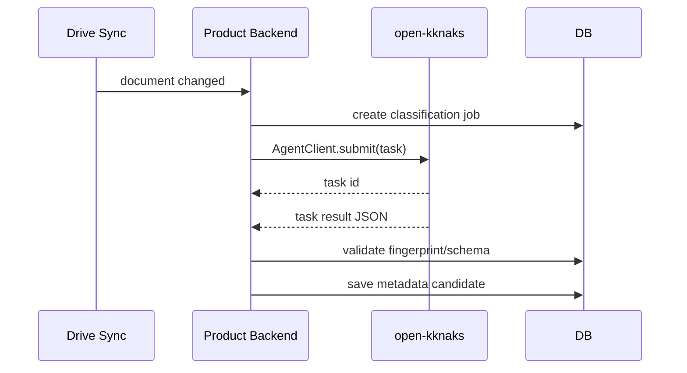
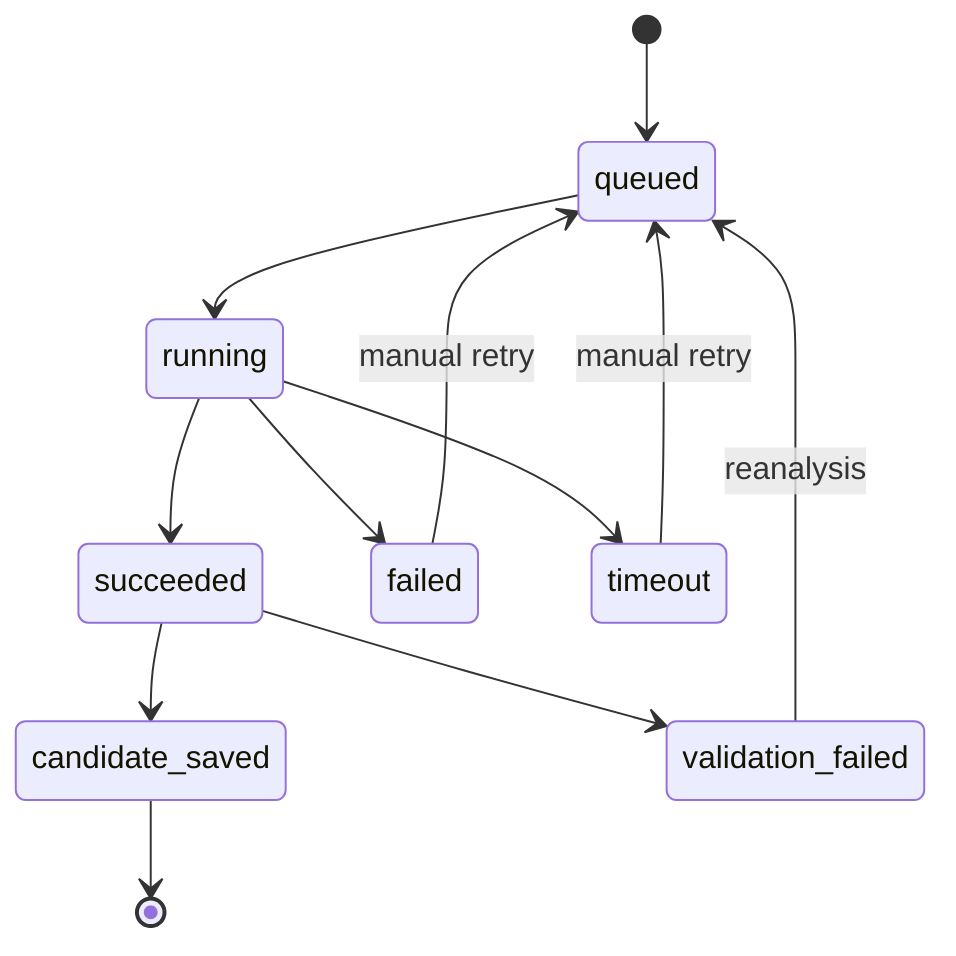

# AI Classification Pipeline

이 spec은 Drive 변경 후 AI가 문서 metadata 후보를 생성하는 파이프라인 계약을 정의한다. 실행 엔진은 `open-kknaks`이며, 제품은 task를 제출하고 결과를 검증해 approval candidate로 저장한다.

## 1. Context

### Meta

- Decision reference: DEC-024, DEC-002, DEC-008, DEC-017, DEC-018, DEC-022
- Baseline reference: BASE-001, BASE-002
- Related product spec: SPEC-003, SPEC-004, SPEC-005, SPEC-006
- Related open-kknaks spec: OKK-SPEC-001, OKK-SPEC-002, OKK-SPEC-003, OKK-SPEC-009
- Domain note: AI output은 후보이며 승인값이 아니다.
- Open questions: 없음

### Business Requirement

Drive에 문서가 들어오면 제품은 자동으로 문서종류, 귀속, 권한, 민감도, 요약, relation 후보를 생성해야 한다. 이 실행은 제품 내부 임시 호출이 아니라 `open-kknaks` task queue/runner를 통해 관찰 가능하고 재시도 가능한 job으로 처리한다.

### Scope

In scope:

- Drive sync 후 classification job 생성
- open-kknaks task submit 계약
- task input/output schema
- 결과 validation과 metadata candidate 저장
- stale 발생 시 재분석
- metadata-only 후보 처리
- 실패/재시도/중복 처리

Out of scope:

- open-kknaks 자체 구현
- provider runner 내부 구현
- approval gate UI 상세: SPEC-005
- Google Drive connector 상세: SPEC-004
- 원문 장기 저장소 구축

## 2. UX Contract

### Placement

AI classification pipeline 자체는 백그라운드 처리다. 상태는 승인 게이트와 admin sync/activity 화면에 노출된다.

```text
+--------------------------------------------------+
| Admin Header                                     |
+------------------+-------------------------------+
| Candidate Queue  | AI Analysis Status             |
| Sync Activity    | Candidate Result               |
+------------------+-------------------------------+
```

### U-1. Analysis Status

- **상태**:
  - queued: open-kknaks task 제출 대기/완료.
  - running: open-kknaks worker 실행 중.
  - succeeded: 후보 생성 완료.
  - failed: 후보 생성 실패.
  - stale_requeued: Drive 변경으로 재분석 enqueue.
- **문구**:
  - `AI 분석 대기 중`
  - `AI 분석 중`
  - `새 후보 준비됨`
  - `AI 분석 실패`
  - `Drive 변경으로 다시 분석 중`
- **CTA**:
  - `재분석`: admin, 실패 또는 stale 상태에서 가능.
- **기대 결과**:
  - admin은 후보가 없는 이유가 분석 대기/실패/재분석 중인지 구분한다.

### U-2. Candidate Result Preview

- **상태**:
  - succeeded: 구조화된 후보 metadata를 표시한다.
  - metadata_only: 본문 없이 제한된 후보임을 표시한다.
  - validation_failed: AI 결과 schema가 잘못되어 후보 저장 실패.
- **문구**:
  - `본문 분석 없음`
  - `결과 형식 오류`
  - `승인 대기 후보`
- **CTA**:
  - `승인 게이트로 이동`
  - `재분석`
- **기대 결과**:
  - 유효한 결과만 approval candidate로 저장된다.

## 3. User Scenario

### S-1. System — 새 문서 자동 분류

1. SPEC-004 Drive sync가 새 document record를 upsert한다.
2. 시스템은 document id와 current fingerprint로 classification job을 만든다.
3. 시스템은 open-kknaks task를 제출한다.
4. open-kknaks worker가 provider runner를 실행한다.
5. runner가 구조화된 candidate JSON을 반환한다.
6. 시스템은 JSON schema와 fingerprint를 검증한다.
7. 검증이 통과하면 SPEC-003 metadata candidate를 `pending`으로 저장한다.

### S-2. System — metadata-only 후보

1. 파일 본문을 읽을 수 없거나 reader가 없으면 `read_capability=metadata_only`로 job을 만든다.
2. task 입력에는 Drive mirror와 파일명/MIME/수정시각만 포함한다.
3. AI는 제한된 후보를 반환한다.
4. 승인 게이트는 `본문 분석 없음` 상태를 표시한다.

### S-3. System — stale 재분석

1. Drive mirror fingerprint가 바뀐다.
2. 기존 pending candidate는 stale 처리된다.
3. 시스템은 최신 fingerprint로 classification job을 다시 만든다.
4. open-kknaks task 성공 후 새 pending candidate를 저장한다.

### S-4. System — AI task 실패

1. open-kknaks task가 failed/timeout/cancelled 상태가 된다.
2. 시스템은 classification job을 failed 또는 timeout으로 기록한다.
3. 기존 승인 metadata는 변경하지 않는다.
4. admin은 승인 게이트에서 수동 재분석을 요청할 수 있다.

## 4. Interface Contract

### API Contract

| Method | Path | 요약 | 권한 |
|---|---|---|---|
| POST | `/admin/documents/{id}/classify` | 수동 AI 분류 요청 | admin |
| GET | `/admin/classification-jobs/{id}` | classification job 상태 조회 | admin |
| GET | `/admin/documents/{id}/classification-jobs` | 문서별 분석 이력 조회 | admin |

백그라운드 submit은 Drive sync worker가 내부 호출한다. 외부 API는 admin 재분석/상태 조회만 제공한다. SPEC-005의 `POST /admin/approval-candidates/{id}/reanalyze`는 대상 문서의 classification job 생성으로 위임된다.

### Task Submit Contract

제품 backend는 open-kknaks task를 다음 의미로 제출한다.

| Field | 값 |
|---|---|
| `provider` | env `OPEN_KKNAKS_PROVIDER`, 예: `claude` 또는 `codex` |
| `model` | env `OPEN_KKNAKS_MODEL` |
| `queue` | env `OPEN_KKNAKS_QUEUE`, 기본 `document-classification` |
| `timeout` | env `OPEN_KKNAKS_TIMEOUT_SEC` |
| `prompt` | classification prompt + JSON output instruction |
| `options.stream` | false 또는 운영 설정값 |
| `provider_options` | provider별 runner option |

필수 env:

| Env | Required | 설명 |
|---|---|---|
| `OPEN_KKNAKS_BROKER_URL` | yes | open-kknaks Redis broker |
| `OPEN_KKNAKS_PROVIDER` | yes | `claude` 또는 `codex` |
| `OPEN_KKNAKS_MODEL` | yes | classification model |
| `OPEN_KKNAKS_QUEUE` | no | queue name |
| `OPEN_KKNAKS_TIMEOUT_SEC` | no | task timeout |

### Classification Input

| Field | Type | 설명 |
|---|---|---|
| `document_id` | int | 제품 document id |
| `drive_file_id` | text | Drive file id |
| `drive_fingerprint` | object | 현재 Drive fingerprint |
| `drive_mirror` | object | drive_name, mime_type, web url 제외 가능 |
| `read_capability` | enum | `content_read`, `metadata_only` |
| `analysis_text` | text or null | 분석용 추출 텍스트. 원문 장기 저장 금지 |
| `organization_context` | object | 회사/부서/팀 후보 |
| `document_tree_context` | object | 업무/문서종류 후보 |
| `document_type_catalog` | array | 전사 공통 문서종류 |
| `policy_context` | object | 민감 문서 policy/preset |
| `relation_type_catalog` | array | v1 relation type |

### Classification Output

AI task result는 JSON object여야 한다.

| Field | Type | Required | 설명 |
|---|---|---|---|
| `document_type` | text | yes | 추천 문서종류 |
| `created_department` | text | no | 생성부서 후보 |
| `owning_department` | text | yes | 귀속/관리 부서 후보 |
| `physical_tree_path` | object | yes | 물리 귀속 path 후보 |
| `related_departments` | array | no | 관련 부서 후보 |
| `related_products` | array | no | 관련 제품 후보 |
| `summary` | text | no | 요약 후보 |
| `sensitivity` | enum | yes | `normal`, `sensitive` |
| `policy_preset` | text | no | 민감 preset 후보 |
| `read_policy` | object | yes | role/department/position/access_logic 후보 |
| `relation_candidates` | array | no | wikilink/target/relation_type 후보 |
| `confidence` | number | no | 0~1 신뢰도 |
| `reasons` | array | no | 추천 이유 |

### Validation

| 항목 | 규칙 |
|---|---|
| task result | valid JSON object여야 한다 |
| fingerprint | result 저장 시 current fingerprint와 job fingerprint가 같아야 한다 |
| document_type | catalog 값이거나 approval gate에서 추가 필요한 후보로 표시한다 |
| owning_department | 조직 context에 있어야 한다 |
| physical_tree_path | SPEC-002 active path 후보여야 한다 |
| policy_preset | known preset 또는 null |
| relation_type | SPEC-006 v1 enum만 허용 |
| target 없는 relation | unresolved relation candidate로 저장한다 |
| 부서/트리 값 resolve | output의 `owning_department`, `read_policy.department`, `physical_tree_path` 값은 candidate 저장 전 조직도/문서 트리 노드 id로 resolve해 저장한다 (SPEC-001/SPEC-002 id 기반 계약) |

### Case Matrix

| 에러 코드 | 백엔드 출력 | 프론트 출력 | 표시 위치 |
|---|---|---|---|
| `CLASSIFICATION_TASK_FAILED` | open-kknaks task failed | AI 분석에 실패했습니다. | approval gate |
| `CLASSIFICATION_TIMEOUT` | open-kknaks task timeout | AI 분석 시간이 초과되었습니다. | approval gate |
| `CLASSIFICATION_RESULT_INVALID` | invalid result schema | AI 결과 형식이 올바르지 않습니다. | approval gate |
| `CLASSIFICATION_FINGERPRINT_STALE` | fingerprint mismatch | Drive 파일이 변경되어 다시 분석합니다. | approval gate |
| `OPEN_KKNAKS_NOT_CONFIGURED` | missing open-kknaks env | AI 실행 설정이 필요합니다. | admin |
| `OPEN_KKNAKS_PROVIDER_INVALID` | unsupported provider | 지원하지 않는 AI provider입니다. | admin |
| `CLASSIFICATION_JOB_NOT_FOUND` | classification job not found | 분석 작업을 찾을 수 없습니다. | admin |
| `DOCUMENT_UNAVAILABLE` | document is unavailable | 현재 문서 상태에서는 분석을 요청할 수 없습니다. | admin |
| `CLASSIFICATION_RETRY_EXHAUSTED` | retry attempts exhausted | 재시도 한도를 초과했습니다. | approval gate |

> 구현 확정(2026-07-09 실검증): `CLASSIFICATION_RETRY_EXHAUSTED`는 **자동 재큐 한도에만** 적용된다. 재시도 소진된 job은 terminal로 취급되어 **수동 재분석은 항상 새 manual job으로 진행 가능**하다 (소진 상태에서 수동 재분석이 409로 막히던 버그 수정).

### Flow



### State / Lifecycle



### Data Contract

| Resource | 외부 계약 |
|---|---|
| Classification job | 제품의 AI 분석 작업 상태 |
| open-kknaks task | provider runner 실행 단위 |
| Classification input | AI가 후보를 만들기 위한 제한된 context |
| Classification output | approval candidate로 저장 가능한 JSON |
| Metadata candidate | SPEC-003 후보 record |

## 5. Implementation Rules

- open-kknaks task는 후보 JSON만 반환한다.
- open-kknaks task는 제품 DB에 직접 쓰지 않는다.
- open-kknaks task는 Drive API를 직접 호출하지 않는다.
- Drive secret, DB secret, OAuth token은 task payload에 포함하지 않는다.
- task 결과 저장 전 schema validation을 수행한다.
- output의 부서/트리 명칭 후보는 저장 전 조직도/문서 트리 노드 id로 resolve하고, resolve 실패 값은 승인 게이트에서 admin 보정 대상으로 표시한다.
- task 결과 저장 전 fingerprint freshness를 확인한다.
- 같은 document/fingerprint에 대한 중복 결과는 candidate fingerprint 기준으로 멱등 처리한다.
- 기존 pending 후보가 있을 때: 새 결과의 fingerprint가 같으면 row를 유지하고 payload만 갱신, 다르면 기존 pending을 stale(superseded) 처리 후 신규 pending을 생성한다 (WORK-004 확정).
- 재시도 한도는 `max_attempts`(기본 3). `validation_failed`는 한도 내 자동 재큐(backoff 30s×attempt), `failed`/`timeout`은 수동 재시도.
- v1 본문 추출 범위: Google Docs export + `text/plain`·markdown·csv 다운로드, 20,000자 상한. PDF/OCR은 보류 — `metadata_only`로 처리한다.
- 원문 분석 텍스트는 task 실행에 필요한 최소 범위만 전달한다.
- 원문/본문을 제품 DB의 장기 field로 저장하지 않는다.
- open-kknaks broker/task payload retention은 운영 설정에서 제한해야 한다.

## 6. Verification

### Acceptance Criteria

- [ ] Drive sync 후 classification job이 생성된다.
- [ ] classification job은 open-kknaks task로 제출된다.
- [ ] provider/model/queue/timeout은 env 설정을 따른다.
- [ ] open-kknaks task result가 valid JSON이 아니면 candidate를 저장하지 않는다.
- [ ] result 저장 시 fingerprint가 바뀌었으면 stale로 처리하고 새 분석을 요청한다.
- [ ] metadata-only 문서는 본문 없이 제한된 후보를 생성한다.
- [ ] AI output은 승인값이 아니라 approval candidate로 저장된다.
- [ ] open-kknaks task payload에 Drive/DB secret이 포함되지 않는다.
- [ ] AI task 실패 시 기존 approved metadata는 변경되지 않는다.

## 7. Open Questions

없음.
