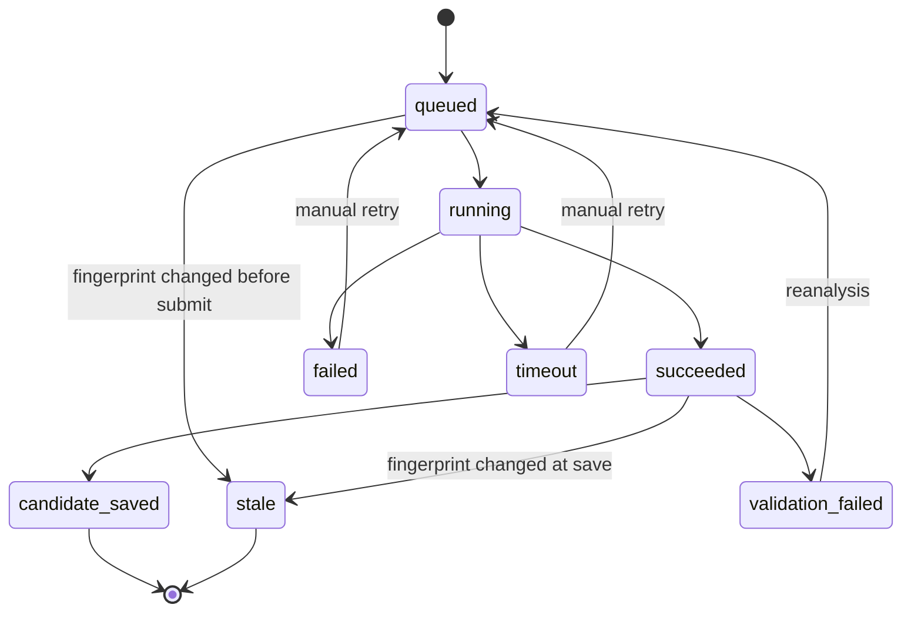

# ARCH-002 AI Queue State Tables

상태: draft  
작성일: 2026-07-08  
연결 spec: SPEC-007, SPEC-004, SPEC-005

## 1. Purpose

AI classification, stale reanalysis, open-kknaks task 상태를 추적하기 위한 PostgreSQL 테이블 구조를 정의한다.

Redis는 실행 큐로만 사용하고, 제품에서 조회/폴링/재시도/audit에 쓰는 상태 원장은 DB가 맡는다.

## 2. Ownership

| 항목 | SoT |
|---|---|
| AI job 상태 | PostgreSQL `ai_queue_jobs` |
| worker dispatch | Redis |
| open-kknaks 실행 결과 | open-kknaks result + backend 검증 후 DB 반영 |
| 승인 후보 | PostgreSQL metadata candidate table |

## 3. Core Table

### `ai_queue_jobs`

| Column | Type | Required | 설명 |
|---|---|---|---|
| `id` | bigint / int identity | yes | product 내부 job id |
| `job_type` | text enum | yes | `classification`, `stale_reanalysis` |
| `status` | text enum | yes | `queued`, `running`, `succeeded`, `candidate_saved`, `validation_failed`, `failed`, `timeout`, `stale`. SPEC-007 job lifecycle을 그대로 저장한다. dispatch/retry 진행은 status가 아니라 `attempt_count`/`next_run_at`로 추적한다 |
| `document_id` | int FK | yes | 대상 document |
| `candidate_id` | int FK nullable | no | 결과로 생성/갱신된 candidate |
| `drive_file_id` | text | yes | Drive SoT file id |
| `fingerprint` | text | yes | job이 기준으로 삼은 Drive composite fingerprint |
| `idempotency_key` | text | yes | 중복 enqueue 방지 키 |
| `external_task_id` | text nullable | no | open-kknaks task id |
| `provider` | text nullable | no | open-kknaks provider |
| `model` | text nullable | no | open-kknaks model |
| `payload_ref` | text nullable | no | 원문 payload 저장 금지. 필요 시 안전한 내부 참조만 저장 |
| `result_ref` | text nullable | no | 결과 raw 저장이 필요한 경우 제한된 참조만 저장 |
| `attempt_count` | int | yes | 실행 횟수 |
| `max_attempts` | int | yes | 최대 재시도 횟수 |
| `next_run_at` | timestamptz nullable | no | retry 예약 시각 |
| `started_at` | timestamptz nullable | no | running 시작 |
| `finished_at` | timestamptz nullable | no | 최종 종료 |
| `last_error_code` | text nullable | no | 마지막 실패 code |
| `last_error_message` | text nullable | no | 짧은 에러 메시지. 민감 원문 금지 |
| `created_by` | int nullable | no | 수동 재분석 요청자 |
| `created_at` | timestamptz | yes | 생성 시각 |
| `updated_at` | timestamptz | yes | 갱신 시각 |

## 4. Constraints

| Constraint | Columns | 목적 |
|---|---|---|
| unique idempotency | `job_type`, `document_id`, `fingerprint`, `idempotency_key` | 같은 기준의 중복 enqueue 방지 |
| status check | `status` | 정의된 상태만 허용 |
| job type check | `job_type` | 정의된 작업만 허용 |
| document FK | `document_id` | 문서 없는 job 방지 |
| candidate FK | `candidate_id` | 결과 후보 연결 |

권장 index:

| Index | Columns | 목적 |
|---|---|---|
| `idx_ai_queue_jobs_status_next_run` | `status`, `next_run_at` | worker polling |
| `idx_ai_queue_jobs_document_created` | `document_id`, `created_at desc` | 문서별 상태 조회 |
| `idx_ai_queue_jobs_external_task` | `external_task_id` | open-kknaks 결과 매칭 |
| `idx_ai_queue_jobs_fingerprint` | `document_id`, `fingerprint` | stale 판정 |

## 5. State Transition

전이 규칙 (SPEC-007 State / Lifecycle 기준):

- `candidate_saved`, `stale`은 terminal 상태다. `failed`/`timeout`은 수동 재시도로, `validation_failed`는 자동 재분석으로 `queued`에 복귀할 수 있다.
- worker는 job 시작 전 최신 document fingerprint와 job fingerprint를 비교한다.
- fingerprint가 다르면 open-kknaks에 제출하지 않고 `stale`로 종료한다.
- open-kknaks 결과가 돌아와도 fingerprint가 달라졌으면 candidate를 저장하지 않고 `stale` 처리한다. stale 종료 시 최신 fingerprint 기준 새 job을 자동 enqueue한다(DEC-022).
- retry는 `attempt_count < max_attempts`일 때만 가능하다.
- timeout 사유는 `last_error_code=CLASSIFICATION_TIMEOUT`, schema 오류는 `CLASSIFICATION_RESULT_INVALID`로 남긴다(SPEC-007 Case Matrix).

## 6. API Polling Contract

FE는 Redis를 직접 보지 않고 backend API를 호출한다.

경로는 SPEC-007 API Contract를 따른다.

| Endpoint | 목적 |
|---|---|
| `GET /admin/documents/{id}/classification-jobs` | 문서별 AI job 상태 목록 |
| `GET /admin/classification-jobs/{id}` | 단일 job 상태 |
| `POST /admin/documents/{id}/classify` | 수동 AI 분류/재분석 enqueue |

응답은 최소 아래 필드를 포함한다.

| Field | 설명 |
|---|---|
| `id` | job id |
| `job_type` | 작업 유형 |
| `status` | 현재 상태 |
| `document_id` | 대상 문서 |
| `candidate_id` | 연결된 candidate |
| `fingerprint` | job 기준 fingerprint |
| `attempt_count` | 시도 횟수 |
| `last_error_code` | 실패 code |
| `created_at` | 생성 시각 |
| `updated_at` | 갱신 시각 |

## 7. Retention / Privacy

- Drive 원문, export body, 민감 문서 전문은 `ai_queue_jobs`에 저장하지 않는다.
- `payload_ref`, `result_ref`는 원문이 아니라 내부 참조 또는 제한된 요약 참조만 허용한다.
- `last_error_message`에는 파일 본문, access token, Google credential, open-kknaks secret을 남기지 않는다.
- terminal job은 운영 정책에 따라 일정 기간 후 archive 또는 compact 가능하다.

## 8. Acceptance Criteria

- AI classification enqueue 시 `ai_queue_jobs` row가 먼저 생성된다.
- Redis dispatch 실패 시에도 DB row로 실패/재시도 상태를 추적할 수 있다.
- FE approval gate는 job 상태를 API polling으로 표시할 수 있다.
- 같은 `document_id + fingerprint` 기준 중복 classification job이 생성되지 않는다.
- stale fingerprint job은 candidate를 저장하지 않는다.
