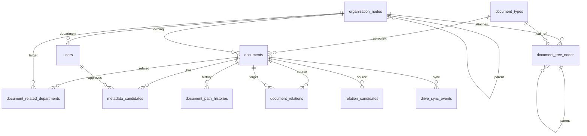

# ARCH-003 Core Domain Tables

상태: draft  
작성일: 2026-07-08  
연결 spec: SPEC-001, SPEC-002, SPEC-003, SPEC-004, SPEC-005, SPEC-006, SPEC-007

## 1. Purpose

SPEC-001~007의 외부 계약을 저장하는 PostgreSQL 도메인 테이블 구조를 정의한다.

spec이 계약의 기준이고, 이 문서는 spec 계약을 테이블로 내리는 구조만 정한다. migration 전문과 컬럼 세부 튜닝은 work에서 다룬다.

설계 원칙:

- 조직/트리/문서종류 참조는 name이 아니라 **stable id**로 저장한다 (SPEC-001/002/003, DEC-004/007/012).
- Drive mirror 필드와 approved metadata 필드는 같은 row 안에서도 성격을 분리한다 (SPEC-003).
- boolean vector는 저장하지 않는다. 판정 결과/log 전용이다 (DEC-016).
- 민감 preset 정의는 v1에서 DB 테이블이 아니라 전역 `context/policy.md`가 SoT다 (DEC-017). 문서에는 preset 이름과 풀어 저장된 read policy 필드만 남긴다 (DEC-018).
- AI job 상태 원장은 ARCH-002 `ai_queue_jobs`를 그대로 사용한다. 이 문서에서 중복 정의하지 않는다.

## 2. ERD

`ai_queue_jobs`(ARCH-002)는 `documents`/`metadata_candidates`를 FK로 참조한다.

## 3. User / Organization

### `users` — SPEC-001

| Column | Type | Required | 설명 |
|---|---|---|---|
| `id` | int identity PK | yes | 제품 내부 user id |
| `source_user_id` | uuid unique | yes | Mediness `users.id` |
| `email` | text | yes | 계정 식별자 |
| `name` | text | yes | 표시명 |
| `role` | text | yes | RBAC role |
| `position` | text | yes | 직급 |
| `password_hash` | text nullable | no | bcrypt hash. 데모 credential은 seed 시 공통 부여(`SEED_DEFAULT_PASSWORD`) — WORK-001 확정 |
| `department` | text nullable | no | seed 원문 값 (`be`, `hr` 등). 참고용 |
| `department_node_id` | int FK nullable | no | 조직도 department 노드. 권한 판정 기준 |
| `team_node_id` | int FK nullable | no | 조직도 team 노드 |
| `active` | boolean | yes | 활성 여부 |
| `employment_type` | text nullable | no | 고용 형태 |
| `resigned_at` | timestamptz nullable | no | 퇴사 시각. Visibility 판정 입력 |
| `seeded_at` | timestamptz | yes | seed 반영 시각 |
| `updated_at` | timestamptz | yes | 갱신 시각 |

- seed 재실행은 `source_user_id` 기준 멱등 upsert.
- boolean vector(`role_match` 등) 컬럼은 두지 않는다 (DEC-016).

### `organization_nodes` — SPEC-002

| Column | Type | Required | 설명 |
|---|---|---|---|
| `id` | int identity PK | yes | 조직 노드 id |
| `parent_id` | int FK nullable | no | 상위 노드 |
| `type` | text enum | yes | `company`, `department`, `team` |
| `name` | text | yes | 표시명. rename해도 id 유지 |
| `status` | text enum | yes | `active`, `inactive` |
| `created_at` / `updated_at` | timestamptz | yes | |

- 계층 check: company는 root 1개, department는 company 하위, team은 department 하위 (SPEC-002 Validation).
- hard delete 금지, inactive 전환만 (DEC-013).

### `document_tree_nodes` — SPEC-002

| Column | Type | Required | 설명 |
|---|---|---|---|
| `id` | int identity PK | yes | 문서 트리 노드 id |
| `organization_node_id` | int FK | yes | 붙어 있는 조직 노드 |
| `parent_id` | int FK nullable | no | 상위 문서 트리 노드 |
| `type` | text enum | yes | `work`, `document_type` |
| `document_type_id` | int FK nullable | no | `type=document_type`일 때 카탈로그 참조 |
| `name` | text | yes | 표시명 |
| `status` | text enum | yes | `active`, `inactive` |
| `created_at` / `updated_at` | timestamptz | yes | |

- `type=document_type` 노드는 카탈로그 stable id를 참조한다 (DEC-007 rename 안전).

### `document_types` — SPEC-002/005, DEC-007

| Column | Type | Required | 설명 |
|---|---|---|---|
| `id` | int identity PK | yes | stable type id |
| `name` | text | yes | 표시명 |
| `normalized_name` | text unique | yes | 정규화 이름. 중복 검사 기준 |
| `created_by` | int FK nullable | no | 추가한 admin |
| `created_at` / `updated_at` | timestamptz | yes | |

- 추가는 admin 전용, 정규화 후 unique (SPEC-005 U-4). rename해도 id 유지.

## 4. Document

### `documents` — SPEC-003

| Column | Type | Required | 성격 | 설명 |
|---|---|---|---|---|
| `id` | int identity PK | yes | product | 문서 id |
| `source_provider` | text enum | yes | system | `google_drive` |
| `drive_file_id` | text | yes | mirror | provider 내 unique |
| `drive_name` | text | yes | mirror | 기본 표시 제목 |
| `drive_web_url` | text nullable | no | mirror | Drive 열기 링크 |
| `drive_mime_type` | text | yes | mirror | MIME type |
| `drive_state` | text enum | yes | mirror | `active`, `trashed`, `removed`, `out_of_scope` |
| `drive_modified_time` | timestamptz nullable | no | mirror | Drive 수정 시각 |
| `drive_fingerprint` | jsonb | yes | mirror | composite fingerprint (DEC-023). 구성요소 `mime_type`=`drive_mime_type` |
| `document_type_id` | int FK nullable | no | approved | 문서종류 stable id |
| `created_department_node_id` | int FK nullable | no | approved | 생성부서 노드 |
| `owning_department_node_id` | int FK nullable | no | approved | 귀속부서 노드. 단일값 (DEC-005) |
| `organization_path` | int[] | no | approved | 회사/부서/팀 노드 id path |
| `tree_path` | int[] | no | approved | 업무/문서종류 노드 id path |
| `related_products` | text[] | no | approved | 관련 제품/팀. v1 카탈로그 없음 |
| `read_roles` | text[] | no | approved/auth | 읽기 role 목록 |
| `read_departments` | int[] | no | approved/auth | 읽기 조직 노드 id 목록 |
| `read_positions` | text[] | no | approved/auth | 읽기 직급 목록 |
| `access_logic` | text enum | yes | approved/auth | `ANY`, `ALL`, `PRESET` |
| `sensitivity` | text enum | yes | approved/auth | `normal`, `sensitive` |
| `policy_preset` | text nullable | no | approved/auth | preset 이름. 정의 SoT는 `context/policy.md` (DEC-017) |
| `summary` | text nullable | no | approved | 승인 요약 |
| `created_at` / `updated_at` | timestamptz | yes | product | |

제약/index:

| 항목 | 내용 |
|---|---|
| unique | `(source_provider, drive_file_id)` — 멱등 upsert 기준 (DEC-003) |
| check | `owning_department_node_id`는 `organization_path`의 부서 축과 정합 (DEC-005) |
| index | `(drive_state)`, `(owning_department_node_id)`, `organization_path`/`tree_path` GIN, `read_departments` GIN |

검색은 v1에서 `drive_name`/`summary` ILIKE로 구현한다(WORK-006 확정). tsvector/전문 검색은 문서량 증가 시 후속.

- Drive 원문/본문 컬럼은 두지 않는다 (DEC-019).
- 삭제는 `drive_state` 변경(soft delete)뿐이다 (DEC-011).

### `document_related_departments` — SPEC-003/006, DEC-005

| Column | Type | Required | 설명 |
|---|---|---|---|
| `document_id` | int FK | yes | 문서 |
| `organization_node_id` | int FK | yes | 관련 부서 노드 |
| `created_at` | timestamptz | yes | |

- PK `(document_id, organization_node_id)` — 중복 연결 방지 (DEC-005 Idempotency).
- 부서 화면 "관련 문서" 조회의 역방향 index 담당 (DEC-014). 읽기 권한은 부여하지 않는다 (DEC-006).

### `document_path_histories` — SPEC-002, DEC-015

| Column | Type | Required | 설명 |
|---|---|---|---|
| `id` | bigint identity PK | yes | history id |
| `document_id` | int FK | yes | 대상 문서 |
| `previous_path` | jsonb | yes | 이전 organization_path/tree_path |
| `new_path` | jsonb | yes | 새 path |
| `changed_by` | int FK | yes | 이관 admin |
| `reason` | text | yes | 변경 사유. 필수 (SPEC-002) |
| `changed_at` | timestamptz | yes | |

- append-only. UPDATE/DELETE 금지.

## 5. Candidate / Approval

### `metadata_candidates` — SPEC-003/005/007

| Column | Type | Required | 설명 |
|---|---|---|---|
| `id` | int identity PK | yes | 후보 id |
| `document_id` | int FK | yes | 대상 문서 |
| `state` | text enum | yes | `pending`, `stale`, `approved`, `rejected`, `blocked` — 원장 5개만 저장. `reanalyzing`/`new_candidate_ready`는 job 상태에서 파생 (DEC-022) |
| `read_capability` | text enum | yes | `content_read`, `metadata_only` (DEC-009) |
| `candidate_metadata` | jsonb | yes | AI 제안 metadata. 부서/트리 값은 노드 id로 resolve된 값 (SPEC-007) |
| `candidate_fingerprint` | jsonb | yes | 후보 생성 시 fingerprint |
| `reason` | text nullable | no | 제안/stale/blocked 사유 |
| `approved_by` | int FK nullable | no | 승인 admin |
| `approved_at` | timestamptz nullable | no | 승인 시각 |
| `created_at` / `updated_at` | timestamptz | yes | |

제약/index:

| 항목 | 내용 |
|---|---|
| 부분 unique | `(document_id)` where `state='pending'` — 문서당 pending 후보 1개 |
| 멱등 | `(document_id, candidate_fingerprint)` 기준 중복 결과 무시 (SPEC-007) |
| index | `(state)`, `(document_id, created_at desc)` |

- 승인 시 `candidate_metadata`가 `documents`의 approved 필드로 반영되고 후보는 `approved`로 닫힌다 (SPEC-005).

### `document_relations` — SPEC-006

| Column | Type | Required | 설명 |
|---|---|---|---|
| `id` | int identity PK | yes | relation id |
| `source_document_id` | int FK | yes | source 문서 |
| `target_document_id` | int FK | yes | target 문서 |
| `relation_type` | text enum | yes | `related`, `references`, `supersedes`, `duplicate_candidate` (DEC-020) |
| `source_label` | text nullable | no | AI/UI 원문 label (wikilink 표기) |
| `approved_by` | int FK | yes | 승인 admin |
| `approved_at` | timestamptz | yes | |

- unique `(source_document_id, target_document_id, relation_type)` (SPEC-006 Validation).
- `broken` 상태는 저장하지 않고 target `drive_state`에서 파생한다 (SPEC-006 lifecycle).

### `relation_candidates` — SPEC-005/006, DEC-021

| Column | Type | Required | 설명 |
|---|---|---|---|
| `id` | int identity PK | yes | 후보 id |
| `source_document_id` | int FK | yes | source 문서 |
| `raw_label` | text | yes | AI가 만든 `[[문서명]]` 원문 |
| `suggested_relation_type` | text enum | yes | v1 relation type 4개 |
| `target_document_id` | int FK nullable | no | resolve된 target. 없으면 unresolved |
| `state` | text enum | yes | `pending`(target 있음, 승인 대기), `unresolved`, `approved`, `removed` |
| `resolved_by` | int FK nullable | no | target 지정/재매칭 admin |
| `created_at` / `updated_at` | timestamptz | yes | |

- 보류(hold)는 별도 상태가 아니라 `unresolved` 유지다 (SPEC-005 U-6).
- unresolved 후보로 새 document row를 만들지 않는다 (DEC-021).
- 재매칭은 title/drive_name 검색으로 `target_document_id`를 채우는 action이다.

## 6. Drive Sync

### `drive_sync_state` — SPEC-004

connector 이어받기 상태. 단일 row(connector 1개, 선택 폴더는 env).

| Column | Type | Required | 설명 |
|---|---|---|---|
| `id` | int PK | yes | 고정 1 |
| `page_token` | text nullable | no | changes.list 이어받기 token |
| `watch_channel_id` | text nullable | no | watch channel |
| `watch_resource_id` | text nullable | no | channel stop용 resource id |
| `watch_expires_at` | timestamptz nullable | no | 만료 시각 |
| `last_sync_at` | timestamptz nullable | no | 마지막 sync 완료 |
| `last_error` | text nullable | no | 마지막 오류 |
| `updated_at` | timestamptz | yes | |

- `GOOGLE_DRIVE_SELECTED_FOLDER_ID` 등 env 값은 저장하지 않는다 (SPEC-004 Environment contract).

### `drive_sync_events` — SPEC-004

| Column | Type | Required | 설명 |
|---|---|---|---|
| `id` | bigint identity PK | yes | event id |
| `event_type` | text enum | yes | `webhook_received`, `changes_listed`, `document_upserted`, `document_unavailable`, `candidate_staled`, `reanalysis_enqueued`, `sync_failed` |
| `drive_file_id` | text nullable | no | 관련 Drive file |
| `document_id` | int FK nullable | no | 관련 문서 |
| `result` | text enum | yes | `success`, `skipped`, `failed` |
| `message` | text nullable | no | 사람이 읽는 요약. 원문/secret 금지 |
| `occurred_at` | timestamptz | yes | |

- index `(occurred_at desc)`, `(document_id)`.

## 7. 두지 않는 테이블 (근거)

| 후보 | 두지 않는 이유 |
|---|---|
| policy preset 테이블 | v1 preset 정의 SoT는 전역 `context/policy.md` (DEC-017). 향후 DB 승격 시 추가 |
| boolean vector 저장 | 판정 결과/log 전용. 원장 저장 금지 (DEC-016) |
| approved_title | v1 기본 제목은 `drive_name` (DEC-011) |
| placeholder document | Drive 원본 없는 문서 자동 생성 금지 (DEC-021) |
| Drive 원문/본문 저장 | DB 저장 금지 (DEC-019). `ai_queue_jobs.payload_ref`도 참조만 (ARCH-002) |

## 8. Acceptance Criteria

- 모든 조직/트리/문서종류 참조 컬럼은 노드/카탈로그 stable id를 FK로 가진다.
- `documents`는 `(source_provider, drive_file_id)` 기준으로 멱등 upsert된다.
- `metadata_candidates.state`는 5개 원장 enum만 허용한다.
- `document_path_histories`는 append-only로 동작한다.
- `document_relations`는 `(source, target, type)` 중복을 거부한다.
- unresolved `relation_candidates`는 `document_relations`에 반영되지 않는다.
- 어떤 테이블에도 Drive 원문/본문/secret이 저장되지 않는다.
