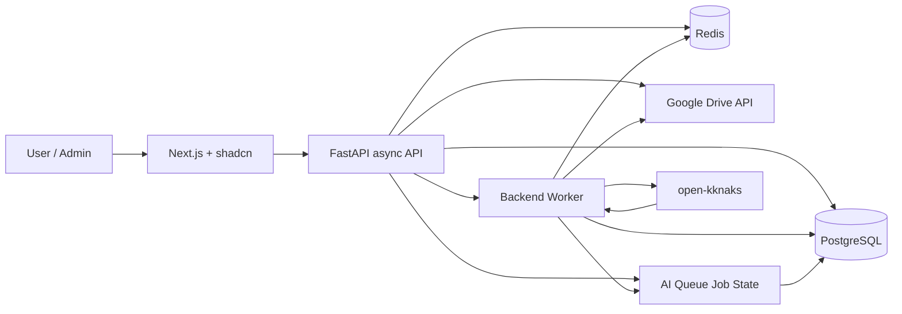

# ARCH-001 System Architecture

상태: draft  
작성일: 2026-07-08  
연결 spec: SPEC-001, SPEC-003, SPEC-004, SPEC-005, SPEC-006, SPEC-007

## 1. Purpose

Google Drive 문서 수집, AI 메타데이터 후보 생성, 관리자 승인, 문서 탐색을 구현하기 위한 시스템 기본 구조를 정의한다.

이 문서는 코드 스캐폴딩과 work 분해의 기준이다.

## 2. Runtime Components



| Component | 역할 |
|---|---|
| Next.js frontend | 로그인, 문서 탐색, 승인 게이트, 관계 탐색 UI |
| FastAPI API | 인증, 권한 판정, request validation, domain service orchestration |
| PostgreSQL | Drive mirror, 승인 metadata, org/tree, relation, user/RBAC, AI job state SoT |
| Redis | async execution queue, idempotency lock, short-lived cache |
| Backend worker | Drive sync, stale reanalysis, open-kknaks task 처리 |
| Google Drive API | 파일 SoT. 파일명/변경시각/본문 export/read source |
| open-kknaks | AI classification task execution |

## 3. Backend Stack

| 항목 | 선택 |
|---|---|
| Framework | FastAPI async |
| Python API style | async endpoint/service/repo |
| ORM | SQLAlchemy async |
| Migration | Alembic |
| Database | PostgreSQL |
| Queue/cache | Redis |
| Job state | PostgreSQL `ai_queue_jobs` 계열 테이블 |
| Validation | Pydantic v2 |
| Config | typed settings from env |

## 4. Backend Layer Rule

기본 흐름은 아래로 고정한다.

```text
frontend
-> schema
-> router
-> dto
-> service
-> dto
-> repo
-> database
```

| Layer | 허용 | 금지 |
|---|---|---|
| schema | request/response validation, OpenAPI contract | DB model import, business logic |
| router | auth dependency, schema parsing, service 호출 | SQLAlchemy query, Drive/open-kknaks 직접 호출 |
| dto | 내부 service/repo 전달 객체 | HTTP/FastAPI dependency |
| service | transaction boundary, domain rule, idempotency, permission check | SQLAlchemy `select/insert/update` stmt 직접 작성 |
| repo | SQLAlchemy async query construction, persistence mapping | HTTP schema 반환, 외부 API 호출 |
| worker task | job orchestration, retry, stale check | API router dependency 사용 |

### `stmt` Rule

- SQLAlchemy `stmt`, raw SQL, query construction은 repo 내부에서만 허용한다.
- router/service/worker orchestration 레이어에서는 repo method만 호출한다.
- 복잡한 조회가 필요하면 service에 SQL을 올리지 않고 repo method를 추가한다.
- 예외적으로 migration/Alembic script는 이 규칙의 대상이 아니다.

## 5. Suggested Backend Layout

```text
backend/
  app/
    main.py
    api/
      deps.py
      routers/
    core/
      config.py
      security.py
      logging.py
    schemas/
    dtos/
    services/
    repos/
    models/
    workers/
    integrations/
      google_drive/
      open_kknaks/
    db/
      session.py
      migrations/
    seeds/
    tests/
```

| Directory | 책임 |
|---|---|
| `api/routers` | HTTP endpoint |
| `schemas` | FE와 맞닿는 request/response schema |
| `dtos` | service/repo 내부 계약 |
| `services` | 권한, 승인, sync, relation domain rule |
| `repos` | DB access 전용 |
| `models` | SQLAlchemy model |
| `workers` | Redis job producer/consumer, retry |
| `integrations` | Google Drive/open-kknaks client |
| `seeds` | user/org/catalog demo seed command |

## 6. Frontend Stack

| 항목 | 선택 |
|---|---|
| Framework | Next.js |
| UI | shadcn/ui |
| API client | generated or typed fetch wrapper |
| Styling | Tailwind + shadcn conventions |
| State | server state 중심, 필요 시 client state 최소화 |

## 7. Suggested Frontend Layout

```text
frontend/
  app/
    login/
    documents/
    admin/
      approvals/
      catalog/
  components/
    ui/
    document/
    approval/
    relation/
  lib/
    api/
    auth/
    schemas/
  tests/
```

| Area | 역할 |
|---|---|
| `documents` | 권한 적용된 문서 트리/목록/상세 탐색 |
| `admin/approvals` | AI 후보 승인 게이트 |
| `admin/catalog` | 문서종류 추가/조회 |
| `lib/api` | backend schema 기준 typed API client |
| `components/ui` | shadcn component |

## 8. Data Ownership

| Data | SoT | 비고 |
|---|---|---|
| 파일 원본 | Google Drive | 제품 DB에 원문 저장하지 않음 |
| Drive mirror | PostgreSQL | Drive 변경 내역을 반영하는 최신 mirror |
| 승인 metadata | PostgreSQL | 사람이 승인한 제품 데이터 |
| AI candidate | PostgreSQL | fingerprint 기준 stale 가능 |
| 사용자/RBAC | PostgreSQL | 기존 Mediness user seed 기반 |
| 조직도/문서 트리 | PostgreSQL | UI 구조와 권한 판정에 사용 |
| relation | PostgreSQL | wikilink는 표현, DB relation이 SoT |
| job state | PostgreSQL | API 폴링, 상태 추적, retry/audit의 SoT |
| execution queue | Redis | worker wake-up과 short-lived dispatch |

## 9. Async Job Boundary

| Job | Producer | Consumer | Idempotency Key |
|---|---|---|---|
| Drive sync | webhook/list scheduler/API admin trigger | worker | `drive_file_id + drive_modified_time` |
| AI classification | Drive sync service | worker/open-kknaks | `document_id + fingerprint` |
| Stale reanalysis | stale detection service | worker/open-kknaks | `document_id + latest_fingerprint` |
| Seed import | CLI/admin command | backend process | `source_system + source_user_id` |

### AI Queue State Contract

AI classification과 stale reanalysis는 Redis queue만으로 추적하지 않는다. PostgreSQL job state table을 영속 원장으로 두고, Redis는 worker 실행을 깨우는 dispatch layer로만 사용한다.

| 항목 | 결정 |
|---|---|
| 상태 원장 | PostgreSQL `ai_queue_jobs` |
| 실행 큐 | Redis |
| FE/API 폴링 기준 | `ai_queue_jobs.status`, `document_id`, `candidate_id`, `fingerprint` |
| open-kknaks task id | `ai_queue_jobs.external_task_id`에 저장 |
| retry 기준 | DB row의 `attempt_count`, `next_run_at`, `last_error` |
| 중복 방지 | `job_type + document_id + fingerprint + idempotency_key` unique |

상태 값 (SPEC-007 lifecycle 기준, 상세는 ARCH-002):

| Status | 의미 |
|---|---|
| `queued` | DB에 job 생성, 실행 대기. Redis dispatch/재시도 진행은 `attempt_count`/`next_run_at`로 추적 |
| `running` | worker가 open-kknaks task 제출 또는 결과 polling 중 |
| `succeeded` | open-kknaks 결과 수신, 검증 진행 |
| `candidate_saved` | 결과 검증 후 candidate 저장 완료 (terminal) |
| `validation_failed` | 결과 schema 오류. 자동 재분석으로 `queued` 복귀 |
| `failed` | task 실패. 수동 재시도로 `queued` 복귀 가능 |
| `timeout` | task timeout. 수동 재시도로 `queued` 복귀 가능 |
| `stale` | fingerprint가 최신 Drive mirror와 달라져 폐기 (terminal, 새 job 자동 enqueue) |

비동기 작업 원칙:

- API request는 긴 Drive read/export나 AI task 완료를 기다리지 않는다.
- AI job 소비는 **의도적으로 순차 1건 처리**다 — 로컬 LLM(claude) 과부하 방지 (2026-07-09 사용자 확정). 병렬화는 별도 decision 없이 하지 않는다.
- worker는 job id, document id, fingerprint를 log에 남긴다.
- worker가 실패해도 승인 metadata는 rollback하지 않는다.
- open-kknaks는 제품 DB에 직접 쓰지 않는다.
- FE는 AI 작업 상태를 Redis가 아니라 API를 통해 PostgreSQL job state 기준으로 폴링한다.

## 10. Docker / Env

### Docker Files

| File | 역할 |
|---|---|
| `Dockerfile` | FastAPI API image |
| `Dockerfile.worker` | backend worker image (Drive sync, job orchestration) |
| `ai_worker/Dockerfile` | open-kknaks ClaudeWorker image — claude CLI로 분류 task 실행 |
| `docker-compose.local.yml` | local API/worker/ai-worker/PG/Redis/frontend |
| `docker-compose.prod.yml` | prod API/worker/ai-worker/frontend 연결 구조 |

### AI Worker 실행 구조 (claude 로컬 실행)

- `ai_worker/workspace/`(진입 문서 CLAUDE.md/agent.md)와 레포 루트 `context/`(분류 가이드 등 AI 실행 context)는 **빌드 시점에 `/app/workspace`로 합쳐 이미지에 COPY**해 고정한다(빌드 context는 레포 루트). claude는 이 workspace 안에서 실행되어 진입 문서를 스스로 읽는다. 루트 `context/` 변경은 이미지 re-build로 반영한다.
- mac 로컬: darwin claude는 linux 컨테이너에서 실행 불가 → linux/arm64 네이티브 claude 도구 세트(`.claude-tools`)를 컨테이너에 마운트하고 PATH로 물린다.
- 서버 배포: 호스트 네이티브 claude 마운트 방식.
- broker namespace/queue는 backend submit 측(SPEC-007 env)과 ai_worker가 같은 값을 공유한다.

### Env Files

| File | 역할 |
|---|---|
| `.env.local` | 로컬 개발용. git commit 금지 |
| `.env.prod` | git secret/SOPS 같은 secret flow 대상. 평문 commit 금지 |

필수 env 범주:

| Category | Examples |
|---|---|
| DB | `DATABASE_URL` |
| Redis | `REDIS_URL` |
| Auth | `JWT_SECRET`, `ACCESS_TOKEN_TTL`, `REFRESH_TOKEN_TTL` |
| Google Drive | `GOOGLE_DRIVE_CLIENT_ID`, `GOOGLE_DRIVE_CLIENT_SECRET`, `GOOGLE_DRIVE_REFRESH_TOKEN`, `GOOGLE_DRIVE_SELECTED_FOLDER_ID`, `GOOGLE_DRIVE_WEBHOOK_URL` (SPEC-004 Environment contract) |
| open-kknaks | `OPEN_KKNAKS_BROKER_URL`, `OPEN_KKNAKS_PROVIDER`, `OPEN_KKNAKS_MODEL`, `OPEN_KKNAKS_QUEUE`, `OPEN_KKNAKS_TIMEOUT_SEC` (SPEC-007) |
| App | `APP_ENV`, `CORS_ORIGINS`, `PUBLIC_API_BASE_URL` |

## 11. Accepted System Defaults

아래 항목은 권장값을 기본 아키텍처로 채택한다. 구현 중 변경 필요성이 생기면 별도 decision 또는 architecture change로 올린다.

| 항목 | 기본값 | 나중에 바뀔 수 있는 지점 |
|---|---|---|
| 제품 로그인 방식 | email/password or existing auth token bridge + JWT | Google social login 도입 시 |
| refresh token 저장 | httpOnly secure cookie | mobile/client 확장 시 |
| queue library | Redis 기반 단순 queue + PostgreSQL job state | Celery/RQ/Arq 중 구현 선택 시 |
| API contract 관리 | Pydantic schema + OpenAPI export | FE codegen 도입 시 |
| API 에러 응답 | detail은 `{error_code, message}` — message는 영문, 한국어 카피는 FE가 error_code로 매핑 | i18n 도입 시 |
| seed 실행 방식 | CLI command | admin UI seed/import 도입 시 |
| logging | JSON structured log + request id + job id | 중앙 로그 수집 도입 시 |
| metrics | `/health`, `/ready`, basic job counters | Prometheus/Grafana 도입 시 |
| test baseline | backend unit/service/repo + API contract + frontend smoke | E2E 확대 시 |
| secret handling | `.env.local` local only, `.env.prod` git secret target | Secret manager 도입 시 |

## 12. Acceptance Criteria

- backend 스캐폴딩에서 router/service/repo 레이어가 분리되어 있다.
- router/service/worker orchestration 레이어에 SQLAlchemy `stmt`가 없다.
- Google Drive/open-kknaks client는 `integrations/` 아래에 격리되어 있다.
- API와 worker가 같은 DB model/repo를 공유하되 runtime process는 분리된다.
- AI queue 상태는 PostgreSQL row로 추적되고 FE/API는 이 상태를 기준으로 폴링한다.
- local compose에서 API, worker, PostgreSQL, Redis, frontend가 함께 뜰 수 있다.
- prod compose는 secret을 env 파일 주입으로 받으며 평문 secret을 repo에 남기지 않는다.
