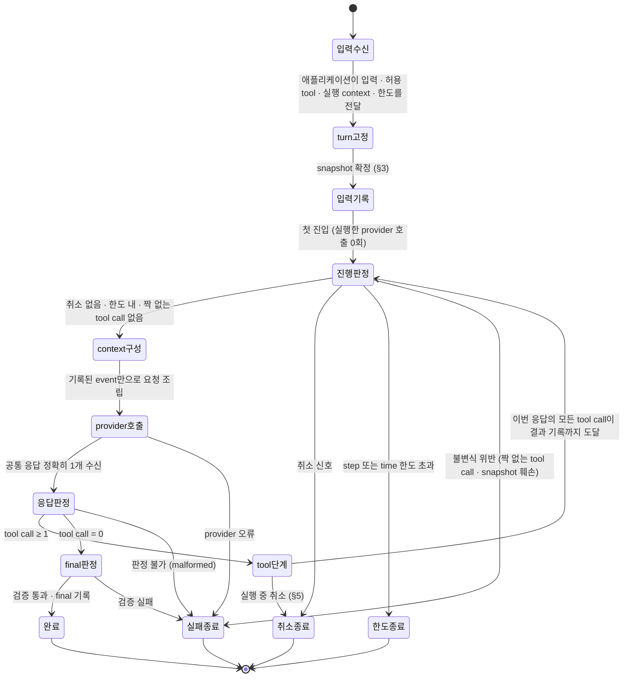
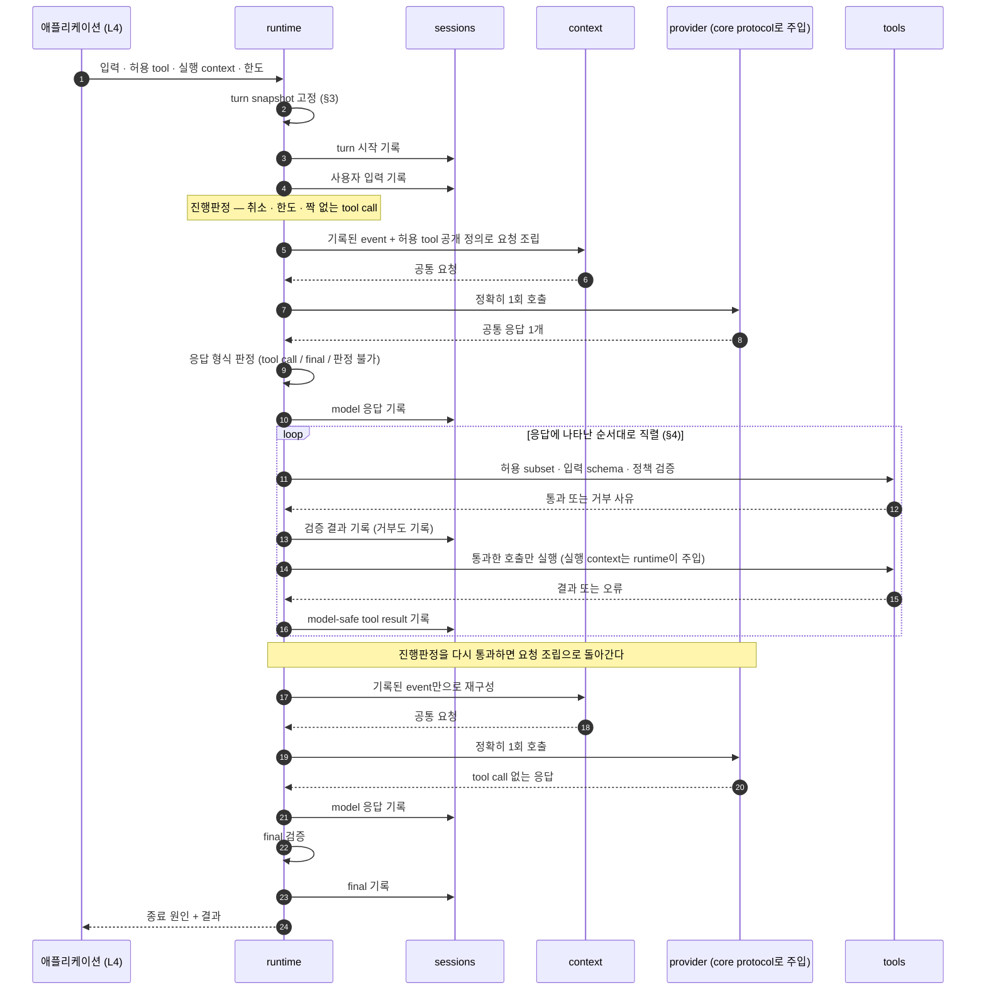

# 최소 headless turn runtime 동작 구조

KAG-DEC-001이 확정한 `runtime` package 안에서, **사용자 입력 하나가 어떤 상태 전이를 거쳐 끝나는지**를 결정한다. 진행 phase와 종료 state, side effect 순서, 반복 진입 조건, 종료 원인만 정하고 파일·클래스·signature·schema는 정하지 않는다.

> baseline의 날것 입력을 spec으로 내리기 전에 적용 방향을 정하는 문서.
> 기능 계약 상세는 `20-spec/`, 실제 작업 순서는 `30-work/`에 둔다.

> **상태 `accepted` (2026-08-08 사용자 확정).** planner가 `proposed`로 올린 권고안을 사용자가 확정했다. 아래 §Decision 이하는 이제 이 제품의 결정이며, 바꾸려면 새 decision으로 supersede한다. 다만 §Open Questions에 남은 9건은 여전히 미결이고, 이 결정이 명시적으로 Out으로 둔 범위(식별자·schema·공개 계약 표면 등)는 확정되지 않았다. KAG-DEC-001과 KAG-BL-001의 `accepted`는 이 문서가 바꾸지 않는다 — 이 결정은 그 위에 쌓일 뿐 되돌리지 않는다.

## Context

- 관련 baseline: [[baseline-001-provider-neutral-llm-runtime|KAG-BL-001]]
- 선행 결정: [[decision-001-runtime-directory-boundaries|KAG-DEC-001]] (accepted)
- 문제/기회
  - KAG-DEC-001은 “`runtime`이 한 turn의 model↔tool 반복, 종료 조건, 최종 응답 검증, 조립된 부품의 호출 순서를 소유한다”까지 확정했고, **동작 state machine과 종료 조건은 명시적으로 Out**으로 남겼다.
  - 그래서 지금 상태로는 같은 구조 위에 서로 다른 loop를 짤 수 있다. 응답을 언제 기록하는지, tool 실행 전에 무엇이 끝나 있어야 하는지, 한도 초과와 tool 실패를 같은 실패로 볼지가 사람마다 다르게 구현된다.
  - 순서가 정해지지 않으면 KAG-BL-001이 관찰한 실패가 그대로 재현된다: 기록되지 않은 결과가 다음 요청에 섞이고, 검증 전에 실행되고, 실패 하나가 turn 전체를 죽이거나 반대로 무한 loop를 만든다.
  - 완성형 agent CLI에서 관찰되는 `query` 실행 엔진은 검색 기능이 아니라 **사용자 입력 하나를 처리하는 turn 실행 단위**다. 이 개념 중 최소 headless loop에 필요한 부분만 흡수해야 하는데, 어디까지가 “필요한 부분”인지 결정된 적이 없다.
- 결정이 필요한 이유
  - 첫 spec(공개 계약 표면)을 열려면 “그 계약이 어떤 순서로 호출되는가”가 먼저 있어야 한다. 계약을 먼저 쓰면 순서를 계약이 암묵적으로 정해버린다.
  - 이 결정은 **phase 전이와 순서**만 다룬다. 그 순서를 실현할 타입·API·event schema는 다음 단계다(§Scope Out).

## 근거 개념

이 결정이 기대는 개념. 상세는 concept 노트가 갖는다.

- [[command-loop]] — 입력 하나가 **phase 를 거쳐 종료 state 로 끝나는** 반복 구조. 언제 다시 돌고 언제 멈추는지를 정하는 것이 이 결정이다

## Options

재현성, 보안(검증 우회 가능성), 테스트 가능성, 초기 복잡도 네 축으로 비교했다.

| Option | Description | Pros | Cons | Notes |
|---|---|---|---|---|
| A. 불투명한 단일 `run()` 절차 | turn 전체를 하나의 절차로 구현한다. 내부 단계는 코드 흐름으로만 존재하고 이름도 관찰 지점도 없다 | 초기 복잡도 최저. 첫 vertical slice까지 가장 빠름. 읽을 것이 한 곳뿐 | 어디까지 진행했는지 바깥에서 알 수 없어 실패 원인을 “실패”로만 구분한다. 순서를 어긴 구현(검증 전 실행, 기록 전 재요청)을 지적할 근거가 문서에도 코드에도 없다. 테스트가 “입력 → 최종 결과”만 검증하게 되어 중간 순서 회귀를 잡지 못한다 | 기각 |
| B. 명시적 phase/state transition을 가진 deterministic turn loop | turn을 이름 붙은 **진행 phase**와 **종료 state**의 유한 전이로 정의하고, 각 전이가 만드는 side effect와 그 순서를 규칙으로 고정한다 | phase 이름이 곧 관찰 지점이자 테스트 단위다. “검증 먼저·기록 먼저”를 전이 조건으로 표현할 수 있어 보안 규칙이 구조에 박힌다. 같은 입력·같은 snapshot이면 같은 전이 열이 나와 재현 가능하다. 종료 원인을 종료 state로 구분해 fail-closed를 증명할 수 있다 | phase·종료 state와 전이를 문서와 코드 두 곳에서 맞춰야 한다. 단순한 turn에도 전이 판정 비용이 든다. phase를 잘못 나누면 나중에 쪼개거나 합치는 비용이 A보다 크다 | **채택** |
| C. middleware/hook pipeline | turn을 교체 가능한 단계의 체인으로 두고, 각 단계를 hook으로 등록·삽입·치환한다 | 확장 지점이 구조적으로 열려 있다. 로깅·정책·관측을 본체 수정 없이 붙인다. 호스트가 loop를 부분적으로 바꿀 수 있다 | 실행 순서가 등록 순서에 의존해 **재현성이 조립에 종속**된다. hook이 검증 단계를 앞지르거나 건너뛸 수 있어 “model 출력은 실행 요청일 뿐”이라는 보안 경계가 조립 실수 하나로 무너진다. 실제 순서를 알려면 체인을 조립해봐야 해서 테스트가 전부 통합 테스트가 된다. 확장 지점이 실제 요구보다 먼저 생기는 과설계 | 기각 (후속 확장 후보로 보존) |

핵심 trade-off를 숨기지 않는다: **B는 A보다 확실히 무겁다.** 진행 phase 9개 + 종료 state 4개짜리 loop(§1)를 위해 이름·전이 조건·불변식을 따로 관리해야 하고, 첫 slice에서는 A로도 같은 결과가 나온다. B를 채택한 이유는 결과가 아니라 **결과를 어떻게 신뢰하는가**에 있다. KAG-BL-001이 이 라이브러리를 만드는 이유로 든 세 가지(재현성, 권한을 내가 집행함, loop를 소유해야 학습이 됨)는 전부 “중간 상태를 볼 수 있는가”에 걸려 있고, A는 그것을 구조적으로 제공하지 않는다.

C도 B를 부정하지 않는다. C는 B 위에 나중에 얹을 수 있는 확장 방식이고, 반대로 B 없이 C부터 가면 고정해야 할 순서 자체가 없는 상태에서 확장 지점부터 만드는 셈이 된다. 그래서 C는 이번 state machine의 구조로는 기각하되 **후속 확장 후보**로 §Scope에 남긴다.

## Decision

사용자가 2026-08-08에 Option B로 확정했다.

- 채택: **Option B — 명시적 phase/state transition을 가진 deterministic turn loop.**
- 기각: Option A(불투명 단일 절차), Option C(middleware/hook pipeline 중심 구조). C는 §6의 추후 확장 후보로만 남는다.
- 보류: phase·종료 state·event의 식별자와 schema, provider 오류 재시도 정책, malformed 응답 복구 step (→ §Open Questions).

이하 §0~§6이 Option B의 확정 구조다.

### 0. 이 결정의 표기 규칙

**용어 두 개를 구분해서 쓴다.**

| 용어 | 뜻 | 개수 |
|---|---|---|
| **진행 phase** | turn이 지나가는 비종료 단계. 여기 머무는 동안 turn은 아직 살아 있다 | **9개** — 입력수신 · turn고정 · 입력기록 · 진행판정 · context구성 · provider호출 · 응답판정 · tool단계 · final판정 |
| **종료 state** | turn이 멈추는 흡수 상태. 들어가면 나오지 않는다 | **4개** — 완료 · 취소종료 · 한도종료 · 실패종료 |

“state machine”은 이 둘을 합친 전체(9 + 4 = 13개 노드)를 가리키는 이름으로만 쓴다. 요약에서 개수를 말할 때는 항상 **진행 phase 9 + 종료 state 4**로 적고, 뭉뚱그린 “상태 N개”라고 쓰지 않는다.

이 문서의 phase·종료 state 이름은 **개념 라벨**이다. enum 값, 클래스명, event 이름, 필드명으로 승격하지 않는다. 다음 단계(공개 계약 spec)에서 별도로 명명한다.

`query`라는 이름의 디렉터리나 계층은 **만들지 않는다.** 관찰된 query 실행 엔진의 책임(입력 고정, provider 1회 호출, tool 결과 되먹임, 반복과 종료)은 KAG-DEC-001이 이미 `runtime`에 배정한 책임과 같은 것이므로, 새 자리를 만들지 않고 `runtime`의 turn loop로 흡수한다.

KAG-DEC-001의 경계는 그대로 유지한다. **`runtime`은 `providers`를 import하지 않는다.** 아래 모든 그림에서 provider는 `core`의 protocol로 주입된 대상이며, runtime은 그 구현이 무엇인지 모른다. 마찬가지로 runtime은 `process`를 직접 부르지 않는다.

### 1. Turn phase 전이와 종료 state

turn은 **진행 phase 9개**와 **종료 state 4개**의 유한 전이다(§0). 둘 다 한 turn 안에서만 존재하고, turn이 끝나면 남는 것은 종료 원인과 기록된 event뿐이다.

읽는 법 다섯 줄:

1. **진행 phase는 9개다.** 입력수신 · turn고정 · 입력기록 · 진행판정 · context구성 · provider호출 · 응답판정 · tool단계 · final판정. 다이어그램의 비종료 노드와 1:1로 같다.
2. **반복은 `진행판정`을 반드시 통과한다.** 첫 provider 호출도 예외가 아니다. 게이트가 하나뿐이라 “어디선가 한 번 더 돌았다”가 생기지 않는다.
3. **`provider호출`은 한 번 지날 때 정확히 1회다.** 재시도, 이어받기, 병렬 호출을 이 phase 안에 숨기지 않는다.
4. **final은 tool call이 0개인 응답에서만 나온다.** §4의 판정 규칙 하나로 표현된다.
5. **종료 state는 4개뿐이고 서로 겹치지 않는다.** 완료 / 취소종료 / 한도종료 / 실패종료. 애플리케이션은 이 넷을 구분해서 받는다.

### 2. 정상 tool loop sequence

tool을 한 번 쓰고 답하는, 가장 흔한 경로다. participant는 KAG-DEC-001의 package 경계와 같다.

여기서 눈여겨볼 것은 **`SS`(기록)가 매번 `TL`(실행)과 `PV`(호출) 사이에 끼어 있다는 점**이다. 그것이 §4의 불변식이다.

### 3. Turn 시작 시 고정하는 것 (snapshot)

turn이 시작되는 순간 아래를 고정한다. 고정한 값은 turn이 끝날 때까지 바뀌지 않으며, 도중에 바깥에서 바뀌어도 이번 turn은 고정값을 쓴다.

| 고정 대상 | 무엇을 고정하나 (책임 수준) | 고정하지 않으면 |
|---|---|---|
| provider binding | 이번 turn의 model 호출을 받을 주입된 대상 하나와 그 capability 선언 | step마다 다른 provider·다른 capability로 호출되어 같은 turn을 재현할 수 없다 |
| tool registry revision | 등록 원본이 어느 시점의 것인지 | 도중에 tool이 추가·제거되어 “무엇이 model에 공개됐는지”를 사후에 복원할 수 없다 |
| 허용 tool subset | 이번 turn에 공개·실행할 tool의 이름과 버전 | 노출 목록과 실행 목록이 갈라져 “보이는데 못 쓰는 tool”이 생긴다. KAG-BL-001이 관찰한 실패다 |
| 사용자 실행 context | 누구의 권한으로 실행하는지 — runtime이 주입하고 model이 만들지 않는 값 | model이 만든 인자가 자기 권한을 주장할 수 있게 된다 |
| 실행 한도 | 최대 step 수, turn 전체 시간 상한, 취소 신호를 받을 자리 | 종료 조건이 turn마다 달라져 무한 loop와 fail-open이 생긴다 |

세 가지를 못박는다.

- **정확한 field 이름·타입·직렬화 형태는 이 결정의 범위가 아니다.** 무엇을 고정하는가만 정한다.
- **snapshot은 turn의 것이지 대화의 것이 아니다.** 대화에 걸쳐 남는 상태(누적 이력)와 turn마다 새로 잡는 상태를 섞지 않는다.
- **취소는 바깥에서 주입되는 이벤트가 아니라 snapshot이 들고 있는 상태다.** turn을 소유한 쪽이 취소 여부를 판정한다.

### 4. Side effect 순서와 불변식

한 step 안에서 부작용은 아래 순서로만 일어난다. 순서를 바꾸는 구현은 이 결정 위반이다.

| # | 단계 | 이 단계가 만드는 side effect | 이 단계 전에 반드시 끝나 있어야 하는 것 | 어기면 생기는 일 |
|---|---|---|---|---|
| 1 | turn 고정 | 없음 (이후 모든 판정의 기준값 확정) | 애플리케이션 입력 수신 | 실행 도중 허용 tool·한도가 바뀌어 재현 불가 |
| 2 | 사용자 입력 기록 | 사용자 입력 event append | 1 | 어떤 허용 표면에서 만들어진 입력인지 복원 불가 |
| 3 | 요청 조립 | 없음 (기록된 event의 읽기 전용 투영) | 직전까지의 **모든** event 기록 완료 | 기록되지 않은 재료가 요청에 섞여 재현이 깨진다 |
| 4 | provider 호출 | 외부 호출 1회 | 3 | 한 step에 두 번 호출되면 step 회계와 재현성이 동시에 깨진다 |
| 5 | 응답 기록 | model 응답 event append | 응답 형식 판정 (§4.1) | 기록 없이 tool을 실행하면 “왜 실행했는지”를 복원할 수 없다 |
| 6 | tool call 검증 | 검증 결과 event append (**거부도 기록**) | 5 | 어느 축에서 막혔는지 남지 않아 감사 기록이 무의미해진다 |
| 7 | tool 실행 | 외부 부작용 발생 | 6 통과 | 검증 전에 실행되면 정책·권한이 무력화된다 |
| 8 | tool result 기록 | model-safe tool result event append (**실패도 기록**) | 7 종료 (성공·실패 무관) | 기록 안 된 결과가 다음 context에 들어간다 |
| 9 | 진행 판정 | 없음 | 이번 응답의 **모든** tool call이 8까지 도달 | 짝 없는 tool call을 남긴 채 다음 호출로 넘어간다 |
| 10 | 반복 진입 | 없음 (3으로 복귀) | 9 통과 (§4.3) | 한도·취소를 건너뛴 loop가 생긴다 |
| 11 | final 기록 | final event append | final 검증 통과 | 검증되지 않은 답변이 기록에 남는다 |
| 12 | 반환 | 없음 | 11 | 애플리케이션이 본 답변이 기록에 없다 |

불변식 세 개로 요약한다.

- **I1 — 기록 먼저, 사용 나중.** event로 기록되지 않은 어떤 재료도 다음 provider 요청에 들어가지 않는다. model 응답을 기록한 뒤 tool을 실행하고, tool result를 기록한 뒤 다음 provider 호출을 허용한다.
- **I2 — 검증 먼저, 실행 나중.** model 출력은 실행 명령이 아니라 검증 대상 요청이다. 허용 subset·입력 schema·정책 확인이 끝나기 전에 handler는 호출되지 않는다.
- **I3 — 한 step에 provider 호출은 정확히 1회.** 재시도·분할·병렬을 step 안에 숨기지 않는다. 숨기는 순간 step 한도가 실제 호출 수를 세지 못한다.

#### 4.1 응답 형식 판정 — final과 tool call이 함께 온 경우

응답 하나를 **정확히 한 종류로** 판정한다. 판정 규칙은 하나다.

| 응답 구성 | 판정 | 근거 |
|---|---|---|
| tool call 0개 | **final 후보** — §5의 final 검증으로 넘긴다 | 더 물어볼 것이 없다는 신호는 “tool을 부르지 않았다”뿐이다 |
| tool call 1개 이상 (텍스트 동반 여부 무관) | **tool 단계** — 동반 텍스트는 최종 답변이 아니라 진행 서술로 **기록만** 하고 애플리케이션에 반환하지 않는다 | tool call이 남아 있다는 것은 model이 아직 결론을 못 냈다는 뜻이다. 텍스트를 final로 채택하면 실행되지 않은 tool의 결과를 전제한 답변을 반환하게 된다 |
| 공통 응답 형식으로 판정 불가 | **malformed** — turn terminal (§5) | 무엇을 요청했는지 알 수 없는 응답은 안전하게 실행할 수 없다 |
| 같은 tool call 식별자가 한 응답에 두 번 이상 | **malformed** | 결과와 호출의 1:1 짝이 성립하지 않으면 I1을 만족시킬 수 없다 |

“혼합 응답을 통째로 실패 처리한다”는 더 엄격한 대안도 있었다. 채택하지 않은 이유는 native tool call을 지원하는 provider가 텍스트와 tool call을 함께 내는 것이 정상 동작이기 때문이고, 그 경우 실패 처리는 provider마다 성공률이 달라지는 fail-open 아닌 fail-broken이 된다. 대신 **텍스트를 final로 승격하지 않는다**는 규칙으로 위험만 제거한다. KAG-BL-001이 기록한 “tool을 부르지도 않고 기다리는 중이라는 산문만 낸” 실패는 이 표에서 tool call 0개 → final 검증 실패로 잡힌다.

#### 4.2 tool call이 여러 개인 경우 — 직렬 실행

- **응답에 나타난 순서대로 하나씩 실행한다.** 앞 호출의 검증·실행·기록(§4의 6→7→8)이 전부 끝난 뒤에 다음 호출로 간다.
- **거부와 실패는 다음 호출을 막지 않는다.** 각 tool call은 독립적으로 판정하고, 거부·실패도 그 호출의 결과로 기록한 뒤 남은 호출을 계속 처리한다. 이렇게 해야 한 응답의 모든 tool call이 결과와 1:1로 짝지어져 다음 context가 완결된다.
- **turn terminal 사유(취소·한도·불변식 위반)만 남은 호출을 중단시킨다.** 중단할 때도 이미 실행된 것의 결과는 기록하고, 실행하지 않은 호출은 “미실행” 사유로 기록해 짝을 맞춘다.
- **read-only tool의 병렬 실행은 이번 범위가 아니다.** 직렬이 느린 것은 사실이지만, 병렬은 실행 순서·부분 실패·취소 시점이라는 새 판정 축을 셋 한꺼번에 들여온다. 직렬 순서가 고정된 뒤 후속 최적화로 다룬다(§Scope 추후).

#### 4.3 반복 진입 조건

`진행판정`에서 아래를 **전부** 만족해야 다음 step으로 간다. 하나라도 어긋나면 해당 종료로 빠진다.

| 조건 | 판정 대상 | 불통과 시 종료 |
|---|---|---|
| 취소 신호가 없다 | snapshot이 들고 있는 취소 상태 | 취소 종료 |
| 실행한 provider 호출 수 < 최대 step | 이번 turn에서 §4의 4단계를 지난 횟수 | 한도 종료 |
| turn 경과 시간 < 시간 상한 | turn 시작 시각 기준 실제 경과 시간 | 한도 종료 |
| 짝 없는 tool call이 없다 | 직전 응답의 모든 tool call에 결과 event가 있다 | 실패 종료 (runtime 내부 오류) |
| snapshot이 훼손되지 않았다 | 허용 subset·registry revision이 turn 시작 값과 동일 | 실패 종료 (runtime 내부 오류) |

step 회계 단위는 **provider 호출 1회 = 1 step**이다. tool 실행 횟수는 step으로 세지 않는다. tool 실행 시간은 turn 시간 상한에 포함된다 — 즉 시간 상한은 provider 대기 시간만이 아니라 turn 전체의 벽시계 시간이다. tool별 개별 timeout을 따로 둘지는 미결이다(→ OQ-4).

### 5. 종료 원인과 recoverable/terminal 판정

되먹임 가능성의 판정 원칙은 하나다.

> **model에 되먹일 수 있는 오류는 “model이 만든 요청”에 대한 응답으로 표현할 수 있는 것뿐이다.** 그것은 tool call 단위 오류다. 그 밖(입력 이전, provider 호출 자체의 실패, 응답 판정 불가, 한도·취소)은 되먹일 자리가 없으므로 turn terminal이다.

| 종료 원인 | 분류 | turn 결과 | model 되먹임 | 이유와 처리 |
|---|---|---|---|---|
| 정상 완료 | terminal | 완료 | - | tool call 0개 응답이 final 검증을 통과했다. final을 기록하고 반환한다 |
| 취소 | terminal | 취소 | 없음 | 이번 turn을 계속할 이유가 사라졌다. 이미 발생한 부작용과 결과는 기록하고, 미실행 tool call은 미실행으로 기록해 짝을 맞춘 뒤 종료한다 |
| step 한도 초과 | terminal | 한도 | 없음 | 무한 tool loop 방어. 한도를 알린 뒤 한 번 더 기회를 주는 방식(경고 step)은 이번 범위가 아니다 |
| 시간 한도 초과 | terminal | 한도 | 없음 | 외부 stream이 아무 신호도 내지 않는 경우까지 덮으려면 상한은 turn 바깥에서 벽시계로 걸어야 한다 |
| provider 오류 | terminal | 실패 | 불가 | 호출 자체가 실패해 되먹일 대상 자리가 없다. 재시도를 할지, 한다면 step으로 셀지는 미결(→ OQ-2). 미결인 동안은 fail-closed로 즉시 종료한다 |
| malformed response | terminal | 실패 | 불가 | 무엇을 요청했는지 판정할 수 없는 응답은 안전하게 실행할 수 없다. 재요청(repair step)은 미결(→ OQ-1) |
| final 검증 실패 | terminal | 실패 | 불가 (이번 범위) | 검증되지 않은 답변을 반환하지 않는다. 근거 없는 답변을 되돌려 다시 쓰게 하는 경로는 step 회계와 무한 loop 위험을 함께 들여오므로 이번 범위 밖(→ OQ-5) |
| tool validation/policy 오류 | **recoverable** | (계속) | **가능** | 미등록·허용 subset 밖·입력 schema 위반·권한 거부·승인 미획득. 거부 사유를 model-safe 결과로 되먹이고 loop를 계속한다. **거부도 반드시 기록**하며, 어느 축에서 막혔는지 구분해 남긴다. 반복 거부는 step 한도가 끊는다 |
| tool handler 오류 | **recoverable** | (계속) | **가능** | handler 예외·tool 실행 실패. 실패했다고 turn을 죽이지 않고 model이 대안을 찾게 한다. 단 stack trace·secret·내부 식별자는 되먹이지 않고 진단 기록에만 남긴다 |
| runtime 내부 오류 | terminal | 실패 | 불가 | 기록 실패, snapshot 훼손, 짝 없는 tool call 등 불변식(§4) 위반. 이 상태에서 계속 돌면 기록과 실제가 갈라지므로 즉시 종료한다 |

공통 규칙 다섯 가지.

- **되먹임은 실행 표면을 넓히지 않는다.** §3의 snapshot이 turn 내내 불변이므로, tool validation/policy 거부 사유를 model에 되먹여도 허용 tool subset과 사용자 권한은 그대로다. 되먹임이 바꾸는 것은 model이 다음에 무엇을 시도하는가뿐이고, 무엇이 실제로 실행 가능한가는 turn 시작 시 고정된 값이 매번 다시 판정한다. 따라서 model이 거부를 근거로 더 넓은 권한이나 미등록 tool을 요구해도 §4의 I2 검증을 다시 통과하지 못한다.
- **모든 종료는 원인이 구분된 결과로 애플리케이션에 반환된다.** “실패했다”만 알려주는 종료는 없다.
- **부분 진행은 사라지지 않는다.** 어떤 원인으로 끝나든 그때까지 기록된 event는 session에 남는다.
- **동기화·조회 실패를 “없음”으로 해석하지 않는다.** 예를 들어 registry 조회가 실패했을 때 “허용 tool 0개”로 접지 않고 실패로 종료한다. 일시 장애가 조용한 기능 정지로 번지는 것을 막는다.
- **recoverable 오류도 무한하지 않다.** 되먹임은 step 한도 안에서만 반복된다.

### 6. 초기 state machine에 넣지 않는 것

§1~§5의 phase 전이 밖이라는 뜻이며, 필요 여부와는 별개다.

**추후 확장 후보** — 순서가 고정된 뒤 별도 decision으로 다룬다.

| 항목 | 지금 넣지 않는 이유 | 추가한다면 지킬 경계 |
|---|---|---|
| skills 등록·선택·prompt 투영 | 최소 tool loop에 필요하지 않고, instruction 선택 정책이 먼저다 | 요청 조립 단계의 입력으로만 들어온다. 새 phase를 만들지 않는다 |
| slash commands | runtime 계약이 아니라 CLI UX다 | L4 adapter가 공개 runtime을 호출한다 |
| 고급 compaction | 짧은 history로 loop를 먼저 검증할 수 있다 | 원본 event는 보존하고 요청 조립 단계의 투영만 줄인다 |
| token budget 기반 auto continuation | provider별 계측 차이를 먼저 관찰해야 한다 | 진행 판정의 추가 입력으로만 들어온다. 새 종료 state를 만들지 않는다 |
| lifecycle hooks / middleware (Option C) | 실행 순서가 조립에 종속되면 §4의 불변식을 보장할 수 없다 | typed 관측 구독 또는 명시적 정책 지점으로 제한하고, 검증 단계를 우회할 수 없게 한다 |
| durable session store · replay | memory store로 event 계약을 먼저 고정하는 편이 단순하다 | 저장소를 바꿔도 §4의 순서와 §5의 판정은 그대로다 |
| queue / worker 실행 | 단일 사용자 학습 단계에는 운영 복잡도가 더 크다 | runtime 바깥 L4에서 같은 turn 진입점을 호출한다 (KAG-BL-001 OQ-11 유지) |
| HTTP·subprocess·MCP tool transport | in-process handler가 가장 작은 검증 단위다 | handler 구현으로만 추가하고 §4의 6→7→8 순서를 바꾸지 않는다 |
| read-only tool 병렬 실행 | 직렬 순서가 먼저 고정돼야 한다 (§4.2) | 순서·부분 실패·취소 판정을 함께 정의한 뒤에만 |
| provider 오류 재시도, malformed 복구 step | step 회계와 무한 loop 위험을 함께 들여온다 | OQ-1·OQ-2에서 결정 |
| CLI/TUI 진행 표시 | headless 계약이 안정되기 전에 만들면 runtime 상태와 화면 상태가 결합된다 | 별도 애플리케이션이 event를 구독해 표현한다 |

**완전 제외** — 이 제품의 목표와 반대이므로 확장 후보도 아니다.

| 제외 대상 | 이유 |
|---|---|
| components/screens 기반 내장 UI | 이 라이브러리는 headless다. 화면 상태는 소비 애플리케이션의 책임이다 |
| coordinator · multi-agent · worker delegation | model을 agent/orchestrator로 쓰지 않는 것이 목표다. model은 tool call 제안과 최종 답변 생성만 한다 |
| plan/task 자동 분해와 sub-agent lifecycle | 추론 범위와 실행 권한을 다시 provider harness에 넘겨 보안·재현성·비용 경계를 흐린다 |
| provider 내장 tool · MCP · skill · compaction · session/resume | runtime이 소유해야 할 상태와 정책이 provider별 비공개 동작에 종속된다. turn phase 전이의 단계로 만들지 않는다 |
| dynamic tool/skill discovery | 실행 표면이 turn 도중 바뀌어 §3의 snapshot이 무의미해진다. tool의 출처는 언제나 호스트의 명시적 등록이다 |
| plugin marketplace · 자동 설치/업데이트 | 공급망과 실행 코드 변경 문제를 core runtime이 떠안는다 |
| 계정 · 온보딩 · 결제 · 제품 telemetry | 완성형 CLI 제품의 운영 기능이며 turn loop 계약과 무관하다 |

## Rationale

- 판단 기준
  1. **재현성.** 같은 입력과 같은 snapshot에서 같은 전이 열이 나오는가.
  2. **보안.** “검증 전에 실행되지 않는다”와 “권한은 runtime이 주입한다”가 구조로 강제되는가, 규율에 맡겨지는가.
  3. **테스트 가능성.** 중간 순서 회귀를 최종 결과 없이 잡을 수 있는가. 외부 프로세스 없이 같은 loop를 돌릴 수 있는가.
  4. **초기 복잡도.** 첫 vertical slice까지 얼마나 무거운가.
- 대안 대비 이유
  - A는 기준 4에서만 이긴다. 1·2·3은 전부 “코드를 읽어야 안다”로 수렴하고, 그 순간 KAG-BL-001이 이 라이브러리를 만드는 이유(“loop를 소유해야 학습이 된다”)가 사라진다. 남의 블랙박스를 내 블랙박스로 바꾸는 것뿐이다.
  - C는 기준 2에서 가장 나쁘다. hook이 단계를 앞지르거나 치환할 수 있으면 §4의 I2가 조립 실수 하나로 무너지고, 그 위반을 정적으로 지적할 자리도 없다. 기준 1도 “등록 순서에 의존”이라 조립마다 달라진다. 확장성은 실제 확장 요구가 생긴 뒤 B 위에 얹는 편이 싸다.
  - B는 1·2·3을 만족하면서 4를 감당 가능한 수준으로 유지한다. 진행 phase 9개와 종료 state 4개뿐이라 다이어그램 하나와 표 몇 장으로 전부 표현된다.
- 리스크
  - **문서와 코드의 이중 관리.** phase·순서가 두 곳에 존재하고 어긋날 수 있다. 실제로 이 문서의 첫 판이 다이어그램은 9개 phase를 그려놓고 요약에서는 “상태 6개”라고 적는 불일치를 냈다. 완화: §0에 phase/종료 state 용어와 개수를 한 곳에 못박고 요약이 그것을 인용하게 하며, 이름을 코드 식별자로 승격하지 않고 순서 자체를 테스트로 고정한다. 다만 후자는 spec 단계에서 검증 방법이 정해져야 실효가 있다.
  - **phase 분할이 틀릴 수 있다.** 특히 `tool단계`를 하나로 묶은 것은 §4.2의 직렬 규칙에 기대고 있어서, 병렬을 도입하면 이 phase를 쪼개야 한다. 감수하되, 병렬화를 이번 범위 밖에 두어 시점을 늦춘다.
  - **되먹임 원칙이 tool 축으로 치우쳐 있다.** provider 오류와 malformed를 전부 terminal로 두면 실제 사용에서 turn 실패율이 높게 나올 수 있다. 완화: OQ-1·OQ-2를 실제 실행 데이터가 생긴 뒤 다시 판단한다. 지금 fail-closed를 고르는 이유는 회복 경로를 근거 없이 먼저 만드는 것보다 실패를 보는 편이 싸기 때문이다.
  - **step 한도가 유일한 loop 방어다.** 같은 tool을 같은 인자로 반복 호출하는 패턴을 따로 막지 않는다(→ OQ-6).

## Scope

- In
  - phase / 종료 state 용어 구분과 개수 (§0)
  - 한 turn의 진행 phase 9종, 종료 state 4종, 그 전이 (§1)
  - 정상 tool loop의 호출 순서와 참여 package (§2)
  - turn 시작 시 고정하는 항목의 **책임 목록** (§3)
  - side effect 순서와 불변식 I1·I2·I3 (§4)
  - final/tool call 혼재와 다중 tool call의 deterministic 판정 규칙 (§4.1, §4.2)
  - 반복 진입 조건과 step 회계 단위 (§4.3)
  - 종료 원인별 terminal/recoverable 판정 원칙 (§5)
  - 초기 state machine 밖의 추후 확장과 완전 제외 구분 (§6)
  - `query` 실행 엔진 개념을 `runtime` 책임으로 흡수하고 별도 디렉터리를 만들지 않는다는 결정 (§0)
- Out
  - 각 package 내부의 **파일 목록, 클래스명, method signature, dataclass/enum 이름**
  - phase·종료 state·event·오류의 **식별자와 JSON schema**, 그리고 event 종류 목록의 확정
  - `tools`·`providers`의 **public contract 상세** — tool 정의/handler의 계약 표면
  - 공개 turn 진입점의 인자 형태, sync/async, 반환 타입
  - Codex CLI 옵션·prompt·stdout JSON protocol
  - skills 선택/loader, slash commands, UI, coordinator·multi-agent (§6)
  - 고급 compaction, token budget, lifecycle hooks, durable store, queue/worker, tool transport 확장 (§6)
  - KAG-DEC-001이 확정한 디렉터리·의존 방향의 변경 — 이 결정은 그것을 소비할 뿐 바꾸지 않는다
- 영향을 받는 spec 후보: 없음. 이 decision은 spec을 직접 만들지 않는다. 확정된 이 순서 위에 공개 계약(요청·응답·tool·event) decision을 먼저 열고, 첫 spec은 그 뒤에 연다. 미래 decision/spec ID를 미리 선점하지 않는다.

## Open Questions

| ID | Question | Owner | Next |
|---|---|---|---|
| OQ-1 | malformed 응답에 재요청(repair step) 1회를 허용할지, 즉시 terminal로 둘지 | planner | 실제 provider 응답 실패율을 관찰한 뒤. 허용한다면 step 회계에 어떻게 셀지 함께 결정 |
| OQ-2 | provider 오류 재시도를 두는가. 둔다면 `runtime`의 step으로 세는가, 주입된 provider 구현 내부 관심사로 두는가 | planner | provider capability 결정과 함께. 후자면 runtime의 step 한도가 실제 외부 호출 수를 세지 못한다는 점을 명시해야 한다 |
| OQ-3 | 취소를 tool handler에 어떻게 전파하는가 — 협조적 취소 신호인가, 실행 중단인가, 아니면 진행 중 handler는 끝까지 두고 다음 호출부터 막는가 | planner | tool handler 공개 계약 decision |
| OQ-4 | tool별 개별 timeout을 둘지, turn 전체 시간 상한만 둘지 | planner | 첫 tool 두 개(read-only)의 실제 응답 시간을 본 뒤 |
| OQ-5 | final 검증의 최소 판정 기준은 무엇인가 (근거 ID 연결 여부, 빈 응답, 허용 밖 출처) | planner | 첫 사례 spec. §5는 “검증 실패는 terminal”만 정하고 검증 내용은 정하지 않았다 |
| OQ-6 | 같은 tool을 같은 인자로 반복 호출할 때 step 한도 외의 loop 방어를 둘지 | planner | 실제 반복 패턴 관찰 후 |
| OQ-7 | §3의 snapshot을 event로 기록할지, runtime 메모리에만 둘지 | planner | session event 계약 spec. 기록한다면 재현 가능성이 올라가고 저장 정책 판단이 따라온다 |
| OQ-8 | 한 응답의 tool call 일부가 거부됐을 때 남은 호출을 계속 실행하는 §4.2 규칙이 실제로 유용한가, 아니면 첫 거부에서 그 응답을 접는 편이 나은가 | 사용자 | 첫 vertical slice 실행 결과를 보고 재평가 |
| OQ-9 | KAG-DEC-001 OQ-2(공개 import 표면)와 이 문서의 turn 진입점을 어느 decision에서 함께 다룰지 | planner | 공개 계약 decision 착수 시 |

## Resulting Spec

| Spec | Action | Notes |
|---|---|---|
| (없음) | - | 이 decision은 spec을 만들지 않는다. 동작 순서만 확정하고, 그 순서를 실현할 공개 계약(요청·응답·tool·event)이 결정된 뒤 첫 spec을 연다. 미래 decision/spec ID를 미리 선점하지 않는다 |
