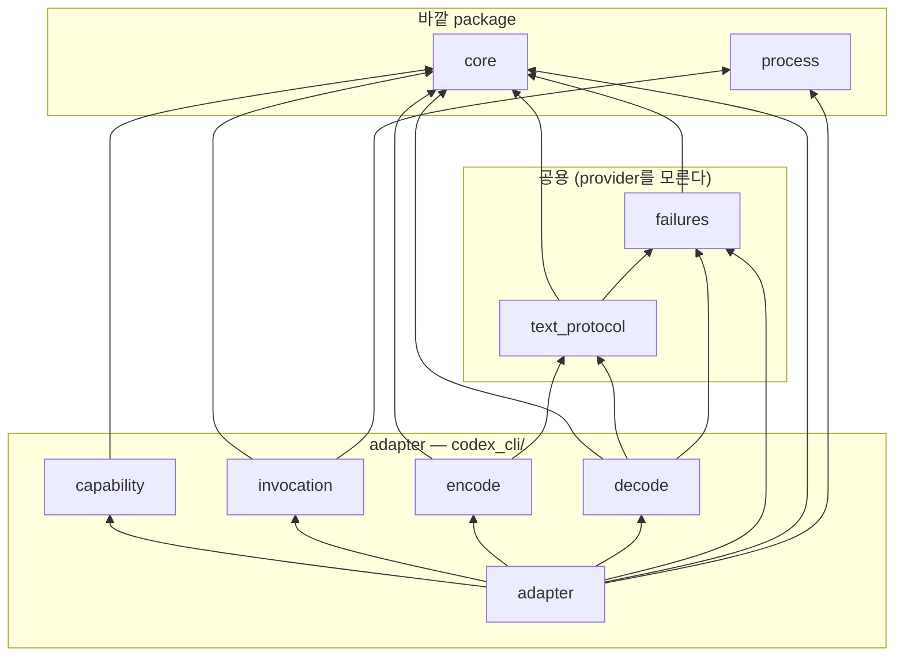
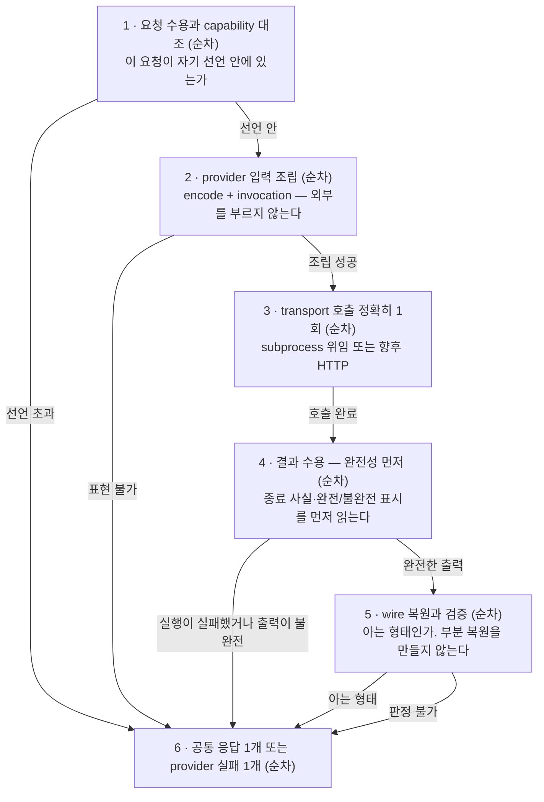
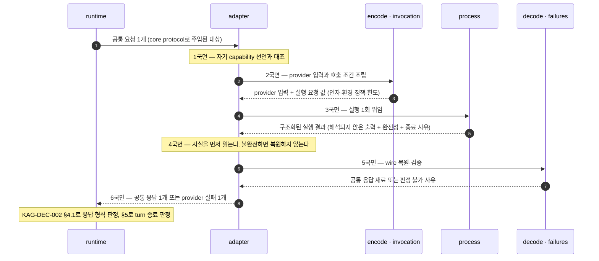

# providers package 변환 경계 — adapter 파일 배치·호출 lifecycle·capability 계약

KAG-DEC-001이 `providers`에 배정한 “공통 요청 ↔ provider별 입출력 사이의 **변환만**”이라는 단일 책임을 **어떤 파일에 어떤 종류의 것으로 나눠 담을지**, **한 번의 provider 호출이 어떤 순서로 진행되고 각 지점의 실패를 누가 소유하는지**, 그리고 **capability가 무엇을 선언하고 무엇을 선언하지 않는지** 제안한다. 구조 옵션 비교와 파일 후보 트리, 파일별 역할과 타입 범주, 공용 표면과 adapter 전용 표면의 판정, 내부 의존 방향, 호출 lifecycle과 불변식, 실패 소유권, 새 provider 구현자의 확장 표면과 contract test seam까지가 대상이고 **exact signature·필드·wire schema·특정 provider의 정확한 실행 옵션·HTTP client 선택·재시도 수치·sync/async 형태는 대상이 아니다.**

> baseline의 날것 입력을 spec으로 내리기 전에 적용 방향을 정하는 문서.
> 기능 계약 상세는 `20-spec/`, 실제 작업 순서는 `30-work/`에 둔다.

> **상태 `proposed` — 사용자 리뷰 대기.** 이 문서의 §Decision 이하는 전부 **권고안**이며 아직 이 제품의 결정이 아니다. 사용자가 확정하기 전에는 어떤 파일도 만들지 않는다. KAG-BL-001·KAG-DEC-001·KAG-DEC-002의 `accepted`는 이 문서가 바꾸지 않는다 — 이 문서는 그 위에 쌓일 뿐 되돌리지 않는다. KAG-DEC-003·KAG-DEC-004는 여전히 `proposed`이며, 이 문서는 그 둘을 **확정 사실이 아니라 제안된 입력**으로만 참조한다(§0.2).

## Context

- 관련 baseline: [[baseline-001-provider-neutral-llm-runtime|KAG-BL-001]]
- 선행 결정: [[decision-001-runtime-directory-boundaries|KAG-DEC-001]] (accepted), [[decision-002-turn-runtime-flow|KAG-DEC-002]] (accepted), [[decision-003-core-contract-boundaries|KAG-DEC-003]] (proposed, 리뷰 대기), [[decision-004-process-boundaries|KAG-DEC-004]] (proposed, 리뷰 대기)
- 문제/기회
  - KAG-DEC-001은 `providers`를 L2 capability package로 두고 **`core`와 `process`만 참조**하게 했다. 책임은 “공통 요청 ↔ provider별 입출력 변환”과 “capability 선언”이고, loop·tool 실행·session 쓰기·context 구성은 **두지 않는 것**으로 못박혔다. 동시에 §5는 provider 제품명·모델명·실행 파일 이름·CLI 옵션 문자열·provider별 wire 필드가 **`providers/` 아래에만** 존재해야 한다고 정했다.
  - KAG-DEC-002는 그 위에 호출 규율을 얹었다. 한 step에 provider 호출은 **정확히 1회**(I3)이고, 응답은 공통 응답 **정확히 1개**이거나 provider 오류이며, provider 오류와 malformed는 둘 다 turn terminal이다.
  - 그런데 그 사이가 비어 있다. **공통 요청 하나가 실제 provider에 닿았다가 공통 응답 하나로 돌아오는 구간의 내부**가 아무 데도 정의돼 있지 않다. 지금 상태로 첫 adapter를 만들면 네 가지가 즉시 문제가 된다.
    1. **구조가 정해져 있지 않다.** 첫 backend는 subprocess인데(KAG-BL-001 §첫 실험) 목표는 raw API·local model backend를 붙여 교체 가능성을 실제로 관찰하는 것이다(KAG-BL-001 §Why It Matters). 두 transport가 한 package 안에서 공존할 배치를 정하지 않으면, 첫 adapter의 모양이 그대로 암묵 표준이 되고 두 번째 adapter가 그 모양에 끼워 맞춰진다.
    2. **공용과 전용의 경계가 없다.** 무엇을 두 adapter가 공유하고 무엇을 각자 갖는지 규칙이 없으면, 공유는 항상 공용 base class로 굴러간다. 그러면 provider 종속 정보가 공용 파일로 새어 KAG-DEC-001 §5의 격리가 `providers/` **안에서** 무너진다 — 밖에서 grep으로 잡히지 않는 위반이다.
    3. **실패의 소유권이 세 층에 걸쳐 있다.** KAG-DEC-004는 `process`가 “turn 종료 state도 provider 오류도 만들지 않는다”고 명시하고 그 변환을 `providers`에 넘겼다(§5.1). 즉 **실행 사실을 provider 의미로 옮기는 자리가 여기인데**, 그 규칙이 아직 없다. 규칙이 없으면 adapter마다 다르게 옮기고, 같은 상황이 provider를 바꿨다는 이유만으로 다른 turn 종료를 낳는다.
    4. **capability가 이름 축으로 미끄러지기 쉽다.** KAG-DEC-003은 capability를 “provider 이름이 들어가지 않는 능력 축의 값”으로 제안했지만(K9), 실제 adapter가 두 개가 되는 순간 “이 provider면 이렇게”라는 분기가 가장 싼 해법으로 보인다. 그 분기가 한 줄이라도 생기면 KAG-BL-001의 목적(“provider를 바꿔도 사용자 코드가 그대로”)은 관찰할 수 없게 된다.
  - 공개 계약을 package 하나씩 의존 그래프의 **아래에서 위로** 내려가기로 했고, `core`(L0, KAG-DEC-003)와 `process`(L1, KAG-DEC-004) 다음이 `providers`다. `providers`는 **`core`와 `process` 둘 다 참조하는 유일한 package**라 아래 둘이 정리된 직후가 가장 싸다.
- 결정이 필요한 이유
  - `providers`는 이 라이브러리의 **존재 이유가 검증되는 자리**다. KAG-BL-001은 “교체 가능성이 목적이고, 그것이 성립하는지는 provider adapter를 두 개 이상 붙여봐야 안다”고 적었다. 두 번째 adapter를 붙일 때 열리는 파일이 자기 폴더 하나로 끝나는가는 지금 정하는 배치가 결정한다.
  - 동시에 **과설계 위험이 가장 큰 자리**이기도 하다. 지금 adapter는 0개이고 곧 1개가 된다. 두 번째가 어떻게 생겼는지 모르는 상태에서 공용 추상을 세우면, 그 추상은 첫 adapter의 모양을 일반화한 것일 뿐이다. 그래서 이 문서는 **공용으로 올릴 것의 기준**을 먼저 정하고 그 기준을 통과한 것만 공용에 둔다(§2).

### 0.1 이 문서의 표기 규칙

- **“호출”은 provider 호출 1회를 뜻한다.** KAG-DEC-002의 step과 1:1이다(I3). KAG-DEC-004의 “실행”(subprocess 1회 실행)과는 다른 단위이며, **한 호출이 실행 몇 번에 대응하는지는 이 문서가 1회로 고정한다**(§4 PI4).
- **“adapter”는 provider 하나에 대응하는 변환 구현 전체**를 뜻하고, **“공용”은 adapter 여럿이 공유하는 provider-neutral 규칙**을 뜻한다.
- **파일명·타입 범주·경계 이름은 개념 라벨이다.** 클래스명·함수명·enum 값으로 승격하지 않는다. §Scope Out.
- **provider 제품명은 이 문서에서 예시로도 최소한만 쓴다.** 첫 adapter의 폴더 이름 후보를 적을 때만 등장하며, 그 이름 자체도 미결이다(→ OQ-10).
- **“권고”와 “확정”을 구분한다.** 이 문서 전체가 `proposed`이므로 모든 §Decision 항목은 권고이고, 근거가 약해 뒤집힐 수 있는 것은 그렇게 표시하거나 Open Questions로 뺀다.

### 0.2 선행 문서를 어떻게 참조하는가

| 문서 | 상태 | 이 문서에서의 취급 |
|---|---|---|
| KAG-BL-001 | accepted | 목표·보안 모델·reference 취급 규칙의 근거. 특히 “provider는 한 번의 공통 요청을 한 번의 공통 응답으로 바꾸는 adapter다”라는 경계 한 줄이 이 문서의 출발점이다 |
| KAG-DEC-001 | accepted | **변경하지 않는다.** `providers`의 책임, `providers → core · process`만 허용하는 의존 방향, provider 종속 코드의 격리 기준(§5)을 그대로 소비한다 |
| KAG-DEC-002 | accepted | **변경하지 않는다.** step당 provider 호출 1회(I3), 공통 응답 1개 수신, 응답 형식 판정(§4.1)과 종료 판정(§5)의 소유자는 `runtime`이고, 이 문서는 그 아래 하위 책임만 정의한다 (§5.1) |
| KAG-DEC-003 | **proposed** | 확정 사실로 쓰지 않는다. 공통 요청/응답·capability 값·오류 표현·model 호출 Protocol을 “제안된 배치”로만 인용하고, **파일 이름이 아니라 범주 수준으로만** 연결한다. KAG-DEC-003이 뒤집혀도 이 문서의 §3 배치와 §4 lifecycle은 그대로 성립해야 한다 |
| KAG-DEC-004 | **proposed** | 확정 사실로 쓰지 않는다. subprocess 실행 요청·구조화된 실행 결과·13개 보안 경계를 “제안된 입력”으로 참조한다. 이 문서가 소비하는 것은 **경계의 성질**(격리 조건을 호출자가 채운다 / 결과는 사실이고 해석은 우리 몫이다)이지 그 문서의 파일명이 아니다 |
| REF-0007 설계 노트 | read-only | 초기 범위의 근거. 노트의 파일 가안(`providers/base.py` · `providers/codex_cli.py`)과 코드 예시는 **확정 API가 아니다**. 이 문서는 그 가안을 Option A·D로 명시 비교한다 (§Options) |

## 근거 개념

이 결정이 기대는 개념. 상세는 concept 노트가 갖는다.

- [[polymorphism]] — provider 마다 다른 입출력을 **같은 요청 타입**으로 다루기 위한 변환 층이다 — 부르는 쪽은 무엇이 붙었는지 모른다
- [[open-closed-principle]] — 새 provider 는 adapter 를 **더해서** 붙인다. 공용 표면과 adapter 전용 표면을 가른 것이 그 확장 지점이다
- [[interface]] — capability 선언이 곧 **무엇을 약속하고 무엇을 약속하지 않는지**의 계약이다

## Options

**초기 복잡도, provider 종속 정보의 국소성(한 provider를 고칠 때 열리는 파일이 자기 것으로 한정되는가), transport 이질성 수용(subprocess와 HTTP가 한 package에서 공존하는가), 공용화의 안전성(공유가 provider 종속 정보를 끌어올리지 않는가), 두 번째 adapter의 추가 비용** 다섯 축으로 비교했다.

축 하나를 미리 정확히 해 둔다. 여기서 비교하는 것은 **코드를 공유할 수 있는가**가 아니다 — 아래 어느 안을 골라도 함수를 꺼내 쓰면 공유는 된다. 비교 대상은 **공유가 어느 방향으로 자라는가**다. 상속으로 공유하면 공통이 위에서 아래를 규정하고, module로 공유하면 아래가 공통을 골라 쓴다. 이 차이가 두 번째 adapter가 첫 adapter의 모양에 끌려가는지를 가른다.

| Option | Description | Pros | Cons | Notes |
|---|---|---|---|---|
| A. provider별 단일 module 평면 배치 | `providers/`에 `__init__.py`와 provider마다 module 하나씩 둔다. 공용 파일은 두지 않고, 공유가 필요해지면 그때 꺼낸다. REF-0007 설계 노트의 `codex_cli.py` 가안과 같은 모양 | 초기 복잡도 최저. 한 provider가 파일 하나라 “이 provider를 고치려면 이 파일”이 자명하다. 공용이 없으니 공용으로 새어 나갈 것도 없다 — **국소성 축에서 가장 강하다.** 새 adapter 추가가 파일 하나 추가다 | 한 파일 안에 요청 조립·실행 인자·transport 호출·wire 복원·실패 분류·capability 선언이 전부 섞인다. 그중 **실패 분류만큼은 adapter마다 달라지면 안 되는 것**인데(§2.10) 파일이 하나면 그 사실이 구조에 남지 않고 두 번째 adapter가 자기 방식으로 다시 쓴다. transport 대체 지점도 module 내부 이름이라 contract test가 내부 리팩터링에 흔들린다(KAG-DEC-004 §Options A와 같은 성질의 문제) | 비권고 |
| B. 공용 평면 module + provider별 하위 package | `providers/` 바로 아래에 **공용으로 판정된 관심사만** 평면 module로 두고(§2), provider마다 하위 package를 하나씩 둔다. adapter 내부도 관심사별 module로 나누고 방향을 총순서로 고정한다 | provider 종속 정보가 **하위 package 하나로 봉인**된다 — 폴더 이름이 곧 격리 단위라 KAG-DEC-001 §5의 검증이 `providers/` 안에서도 성립한다. 공용에 올릴 것의 기준을 §2가 문서로 갖고 있어 “공유하고 싶다”가 곧 “공용에 올린다”가 되지 않는다. transport 호출이 adapter 안의 한 파일에 격리되어 **대체 지점이 안정된 import 경계**가 된다(§8.2). 두 번째 adapter 추가가 **새 폴더 하나**이고 공용 파일은 새 실패 계열이 생길 때만 열린다 | adapter 하나에 module 5개 + 공용 2개라 A보다 확실히 무겁고, 첫 adapter 하나뿐인 지금은 폴더 깊이가 한 겹 늘어난 만큼만 이득이 보인다. 공용/전용 판정을 사람이 매번 해야 한다(§2가 그 판단을 돕지만 자동은 아니다). 총순서를 언어가 강제하지 않는다 | **권고** |
| C. transport별 중첩 구조 | `providers/subprocess/` · `providers/http/`처럼 transport로 먼저 나누고 그 아래에 provider를 둔다 | transport 이질성이 폴더로 드러난다. 같은 transport를 쓰는 adapter끼리 공유가 자연스럽다 | **분류 축이 하나 틀렸다.** 사람이 이 package를 열 때 찾는 것은 “subprocess로 부르는 것들”이 아니라 “이 provider”다. 한 provider가 두 transport를 갖게 되면(같은 모델을 CLI로도 API로도 부르는 경우) **한 provider가 두 폴더로 쪼개져 국소성이 깨진다.** 그리고 transport는 adapter 내부 파일 하나의 관심사이지(§3.2 `invocation`·`adapter`) 폴더가 필요한 크기가 아니다 — 지금 근거로는 폴더가 구현보다 먼저 생긴다 | 기각 |
| D. 공용 base class 상속 계층 | `providers/base.py`에 공통 adapter 기반 클래스를 두고 각 provider가 그것을 상속해 훅을 채운다. REF-0007 설계 노트의 `base.py` 가안과 같은 모양 | 호출 lifecycle(§4)의 순서가 base 한 곳에 있어 모든 adapter가 같은 순서를 따른다. 공통 처리를 한 번만 쓴다. 새 adapter가 채울 자리가 명시적이다 | **순서가 상속에 종속된다.** base가 정한 훅 지점 밖의 요구(HTTP의 streaming 수신, subprocess의 동시 감독 구간 — KAG-DEC-004 §4)가 나오면 base를 고치게 되고, 그 순간 **한 adapter의 사정이 다른 adapter의 코드에 반영된다.** 이것은 KAG-DEC-002가 middleware/hook pipeline을 기각한 이유(실행 순서가 조립에 종속되면 불변식을 보장할 수 없다)와 같은 구조의 문제다. 게다가 base가 공통 요청·응답을 다루면 그 파일은 provider를 모르는 채로 provider 흐름을 규정하는 자리가 되어, 나중에 provider 종속 분기가 가장 먼저 새어 들어오는 곳이 된다. 구현이 1개인 지금 상속 계층은 추상화가 구현보다 많아지는 전형이다 | 기각. 다만 §4의 lifecycle은 **base class가 아니라 이 문서와 contract test로** 강제한다 (§8.3) |

핵심 trade-off를 숨기지 않는다: **A가 초기 복잡도와 국소성 양쪽에서 이긴다.** 공용 파일이 없으면 공용으로 새어 나갈 것도 없고, adapter 하나가 파일 하나면 “어디를 고치나”에 답이 필요 없다. 지금 adapter가 0개이고 곧 1개인 상태에서 이것은 가벼운 이점이 아니다.

B를 권고하는 이유는 파일 수가 아니라 **이 package의 목적 자체가 “두 번째가 생겼을 때”에 걸려 있기 때문**이다. `core`나 `process`는 구현이 하나여도 제 역할을 한다. 그러나 `providers`는 KAG-BL-001이 적은 대로 **adapter가 둘 이상 붙어야 목적이 검증되는 자리**다. A는 그 두 번째가 붙는 순간 두 가지를 동시에 요구한다 — 첫 adapter 파일을 쪼개는 일과, 실패 분류가 이미 두 벌로 갈라진 것을 되돌리는 일. 그리고 되돌리는 쪽은 눈에 띄지 않아 대개 그냥 남는다. B는 그 시점의 작업을 “폴더 하나 추가”로 줄인다.

과설계 경계도 명시한다. B가 권고하는 **공용 module은 §2에서 ‘공용’으로 판정된 항목을 명시적으로 소유하는 것만**이다. 판정 기준은 하나다 — **두 번째 adapter가 생겨도 같은 규칙이어야 하는 것만 공용이고, provider마다 달라도 되는 것은 전부 adapter 안이다.** 이 기준을 통과하지 못하면 “공유하면 편할 것 같다”는 이유로 올리지 않는다. 그리고 §2의 공용 항목 중 하나(공통 protocol 투영, §2.11)는 아직 사용처가 하나뿐이므로 **첫 adapter 안에 두었다가 두 번째에서 올리는 경로도 열어 둔다**(→ OQ-4).

## Decision

> 아래는 전부 **권고안**이다. 사용자 확정 전에는 결정이 아니다.

- 권고: **Option B — 공용 평면 module + provider별 하위 package, adapter 내부도 관심사별 module + 총순서 고정.**
- 비권고: Option A(provider별 단일 module 평면 배치).
- 기각: Option C(transport별 중첩 구조), Option D(공용 base class 상속 계층). D가 노리던 “모든 adapter가 같은 순서를 따른다”는 §8.3의 contract test로 얻는다.
- 미결로 남김: 재시도·backoff의 거처, 취소 관찰 지점의 전달 형태, transport 호출을 직접 import할지 주입받을지, 공통 protocol 투영의 거처, `providers/__init__.py` 재수출, fake provider의 거처, capability 축의 최소 목록 (→ §Open Questions).

이하 §1~§9가 Option B의 권고 내용이다.

### 1. providers가 소유하는 것과 소유하지 않는 것

먼저 책임 범주를 못박는다. 파일 배치는 그 다음이다(§3).

| # | 책임 범주 | providers가 소유하는 이유 |
|---|---|---|
| A1 | **공통 요청의 provider 입력으로의 변환** — message·content block·공개 tool 정의·생성 옵션을 이 provider가 받는 형태로 옮긴다 | 이 변환은 provider마다 다르고, 다르다는 사실이 위 계층에 보이면 안 된다. `context`는 공통 요청까지만 만든다 (KAG-DEC-002 §4 3단계) |
| A2 | **호출 조건의 결정** — 실행 인자, 환경 정책 값, 호출 단위 한도(시간 상한·출력 상한·종료 유예), transport 선택 | 무엇을 어떻게 부를지는 provider 지식이다. **집행**은 `process`이고 **값의 결정**은 여기다 (KAG-DEC-004 §2) |
| A3 | **transport 호출 1회의 수행** — subprocess 실행 위임, 향후 HTTP 요청 | 외부와 닿는 경로가 provider마다 다르다. `runtime`은 이 경로를 모른다 (`runtime ↛ providers`) |
| A4 | **provider 출력의 복원과 검증** — 원시 출력에서 이 provider의 wire 구조를 복원하고 그것이 우리가 아는 형태인지 판정한다 | stdout byte·HTTP body를 해석하는 유일한 자리다. `process`는 해석하지 않는다 (KAG-DEC-004 §2.13) |
| A5 | **공통 응답으로의 변환** — 복원된 출력을 content block·tool call·usage·원문 불투명 값이 실린 공통 응답 1개로 만든다 | `runtime`이 판정할 수 있는 것은 공통 응답뿐이다 (KAG-DEC-002 §4.1) |
| A6 | **provider capability의 선언** — 이 provider가 무엇을 받고 무엇을 낼 수 있는지의 provider-neutral 선언 값 | 능력을 아는 것은 adapter뿐이고, 그것을 값으로 내놓아야 `runtime`이 이름을 모른 채 판정한다 (KAG-DEC-003 K9, §6) |
| A7 | **transport·wire 실패의 provider 의미로의 변환** — 실행 사실과 복원 실패를 “이 호출이 실패했다”는 구분 가능한 값으로 옮긴다 | KAG-DEC-004 §5.1이 이 변환을 명시적으로 여기에 넘겼다. `process`는 사실만, `runtime`은 turn 종료만 다룬다 |
| A8 | **provider 종속 식별자의 격리 보관** — 제품명·모델명·실행 파일 이름·flag·옵션 문자열·wire 필드 이름 | KAG-DEC-001 §5. 이 package 밖에서 등장하면 그 자체가 위반이고, **이 package 안에서도 adapter 폴더 밖에 있으면 위반이다** (§2) |
| A9 | **원문·계측의 경계 있는 반출** — usage 계측의 정규화와 provider 원문의 불투명 보관 | 원문은 진단·관측 전용이며 구조를 위 계층이 읽지 않는다 (KAG-DEC-001 §5, KAG-DEC-003 §3.1) |

**providers가 소유하지 않는 것.** 아래가 `providers/` 아래에 나타나면 그 자체가 위반이다.

| 두지 않는 것 | 사는 곳 | 근거 |
|---|---|---|
| turn loop, 반복 진입 판정, step 회계 | `runtime` | KAG-DEC-002 §1·§4.3. adapter는 한 번 불리고 한 번 답한다 |
| tool 실행, 입력 schema 검증, 정책·권한 판정 | `tools` | KAG-DEC-002 §4 I2. adapter가 복원한 tool call은 **실행 요청**이지 실행이 아니다 (§4 PI7) |
| session event 기록·조회 | `sessions` | KAG-DEC-001 §4. adapter는 아무것도 기록하지 않는다 |
| context 조립, history 선택, compaction, token 계산 | `context` | KAG-DEC-001 §2. adapter는 이미 조립된 요청을 받는다 |
| skill 선택·prompt 투영 | `skills` | KAG-DEC-002 §6. 요청 조립 단계의 입력으로만 들어온다 |
| 응답 형식 판정(final / tool 단계 / malformed)과 turn 종료 state | `runtime` | KAG-DEC-002 §4.1·§5. adapter는 **복원**하고 `runtime`이 **판정**한다 (§5.1) |
| 취소 여부의 판정, turn 시간 상한·step 한도의 소유 | `runtime` | KAG-DEC-002 §3. adapter는 주입된 관찰 지점을 아래로 넘길 뿐이다 (→ OQ-2) |
| subprocess 격리의 **집행** — 환경 allowlist 계산, 출력 상한 집행, 종료 escalation, 자식 회수 | `process` | KAG-DEC-004 §1. adapter는 격리 조건을 **채워 넘기고** 집행하지 않는다 |
| 재시도, backoff, 여러 번 호출을 하나로 합치는 정책 | (지금 두지 않음) | KAG-DEC-002 I3·OQ-2에 걸려 있다. 미결인 동안 adapter는 **한 호출에 transport를 정확히 1회** 부른다 (§4 PI4, → OQ-1) |
| provider의 thread·session·resume·내장 tool·MCP·내장 skill·내장 compaction | (어디에도 두지 않음) | KAG-BL-001 경계 한 줄, KAG-DEC-002 §6 완전 제외. **adapter가 provider의 agent loop를 켜는 것은 이 라이브러리의 목적과 정반대다** |
| 로깅 destination 선택, 파일 기록, telemetry 전송 | 호스트 애플리케이션 | 라이브러리는 진단을 값으로 돌려주고 어디에 쓸지 고르지 않는다 (§9) |
| provider 선택·조립·기본 구현 결정 | L4 애플리케이션 | KAG-DEC-001 §4 “조립은 여기서만” |

한 줄 덧붙인다. **provider가 내부적으로 agent harness를 갖고 있다는 사실은 없어지지 않는다**(KAG-BL-001 §Codex CLI subprocess를 첫 provider로). adapter가 할 수 있는 것은 그 harness를 **쓰지 않도록 호출 조건을 정하는 것**(A2)까지이고, 그 결과가 실제로 같은지는 다른 backend와의 contract test로만 주장한다(§8.3).

### 2. 공용 표면과 adapter 전용 표면의 판정

§Options의 과설계 경계를 항목으로 내린다. 판정 기준은 하나다.

> **두 번째 adapter가 생겨도 같은 규칙이어야 하는 것만 공용이고, provider마다 달라도 되는 것은 전부 adapter 안이다.**

| # | 관심사 | 거처 | 근거 | 잘못 두면 생기는 일 |
|---|---|---|---|---|
| 2.1 | 공통 요청을 읽어 이 provider가 이해할 재료로 고르는 일 | **adapter** | 무엇을 어떻게 고르는지가 provider별로 다르다 | 공용에 두면 공용이 “모든 provider가 이렇게 받는다”를 가정하게 된다 |
| 2.2 | provider 입력의 형태 — prompt 문자열, 요청 envelope, 필드 배치 | **adapter** | KAG-DEC-001 §5의 wire 형식 그 자체 | 공용에 두면 provider wire가 공용 파일에 박힌다 |
| 2.3 | 실행 파일 이름·CLI flag·옵션 문자열 | **adapter** (전용 파일 하나) | KAG-DEC-001 §5. `process`에도 두지 않는다 (KAG-DEC-004 §1) | 두 곳에 흩어지면 “이 provider를 어떻게 부르나”를 복원할 수 없다 |
| 2.4 | provider 제품명·모델명·버전 표기 | **adapter** | 같음 | 공용/`core`/`runtime` 어디든 나타나면 격리 위반 |
| 2.5 | 환경 allowlist에 실을 **이름 목록의 값** | **adapter** | 어떤 환경변수가 필요한지는 그 provider의 지식이다. 계산과 집행은 `process` (KAG-DEC-004 §2.5) | 공용에 두면 한 provider가 필요로 한 이름이 다른 provider에게도 열린다 |
| 2.6 | 호출 단위 한도 값(시간 상한·스트림별 출력 상한·종료 유예)의 결정 | **adapter** (기본 수치는 미결) | KAG-DEC-004 §2가 “값을 정하는 쪽은 호출자”로 배정했다. 수치 자체는 KAG-DEC-004 OQ-10 | 공용 기본값을 두면 느린 provider와 빠른 provider가 같은 상한을 쓰게 된다 |
| 2.7 | transport 호출 방식 — subprocess 위임인가 HTTP 요청인가 | **adapter** | transport는 provider 선택에 딸린 것이지 별도 분류 축이 아니다 (§Options C) | 공용에 두면 HTTP adapter가 subprocess 격리를, subprocess adapter가 HTTP client를 끌고 온다 |
| 2.8 | 원시 출력에서 이 provider의 wire 구조를 복원하는 규칙 | **adapter** | 형식이 provider별이다 | 공용에 두면 2.2와 같은 위반 |
| 2.9 | **복원 실패의 표현과 분류** — 무엇을 “판정 불가”로 볼지, unknown 판별값을 어떻게 다룰지 | **공용** | 같은 성질의 실패가 provider마다 다른 결과를 내면 `runtime`의 판정이 provider에 종속된다. KAG-DEC-003 V3·V3′의 fail-closed를 두 adapter가 같은 방식으로 지켜야 한다 | adapter마다 다르게 접으면 “provider를 바꿨더니 조용히 넘어간다”가 생긴다 |
| 2.10 | **transport 실패를 provider 실패 사유로 옮기는 매핑 규칙** | **공용** | KAG-DEC-004 §5.1이 이 변환을 `providers`에 넘겼다. 매핑이 갈라지면 같은 상황이 provider만 바뀌어 다른 turn 종료를 낳는다 | 첫 adapter의 매핑이 암묵 표준이 되고 두 번째가 자기 방식으로 다시 쓴다 |
| 2.11 | **native tool call이 없는 provider를 위한 공통 protocol 투영·복원** | **공용** (사용처가 둘이 될 때까지는 adapter 안도 허용 → OQ-4) | 이 protocol은 provider의 것이 아니라 **우리 것**이다. 그래서 정의상 provider-neutral이고, 같은 처지의 provider가 같은 것을 쓰지 않으면 품질 비교 자체가 성립하지 않는다 | adapter마다 다른 protocol을 쓰면 §8.3의 동등성 검증이 무의미해진다 |
| 2.12 | capability **선언 값** | **adapter** (축의 정의는 `core`) | 능력은 provider의 사실이고, 축은 공통 계약이다 (KAG-DEC-003 K9) | 축을 adapter가 만들면 provider마다 다른 축이 생겨 `runtime`이 이름으로 분기하게 된다 (§6) |
| 2.13 | usage 계측의 정규화 | **adapter** (공통 응답의 값 자리는 `core`) | 계측 필드가 provider별이다 (KAG-BL-001 OQ-6) | 공용에 두면 provider 전용 계측 필드에 공용이 의존한다 |
| 2.14 | 진단 문자열의 구성과 민감정보 축약 규칙 | **공용** (재료는 adapter가 준다) | 축약을 adapter마다 하면 한 곳은 반드시 잊는다. KAG-DEC-004 R4와 같은 이유 | 한 adapter의 진단에만 인자 원문이 남는다 |
| 2.15 | 재시도·backoff·회로 차단 | **두지 않는다** | KAG-DEC-002 I3와 OQ-2에 걸려 있다 | 지금 만들면 step 회계가 실제 외부 호출 수를 세지 못한다 (→ OQ-1) |
| 2.16 | provider 원문의 불투명 보관 | **adapter가 재료를, `core`가 값 자리를** | KAG-DEC-003 §3.1 | 공용이 원문 구조를 알면 “구조를 읽지 않는 값”이라는 성격이 깨진다 |

이 표가 §3의 파일 배치를 결정한다. **공용으로 판정된 항목은 2.9·2.10·2.11·2.14 넷뿐이고, 공용 module은 그 넷을 소유하는 것만 만든다.** 항목을 더하려면 어느 파일이 소유하는지 답해야 하고, 답이 없으면 그 파일은 만들지 않는다.

### 3. 파일 후보 트리와 내부 방향

#### 3.1 파일 후보 트리

```text
src/kknaks_agents/providers/
├── __init__.py           # 공개 표면 (§8.1) — 정의도 재수출도 두지 않는다
├── failures.py           # transport·wire 실패의 분류 규칙과 진단 구성   ← §2.9 · 2.10 · 2.14
├── text_protocol.py      # native tool call이 없는 provider를 위한
│                         #   공통 protocol 투영·복원                     ← §2.11 (거처는 OQ-4)
└── codex_cli/            # 첫 adapter — provider 종속 정보의 유일한 거처 (이름은 OQ-10)
    ├── __init__.py       # 이 adapter의 진입 타입 하나만 노출 (§8.1)
    ├── capability.py     # 이 provider의 capability 선언 값              ← §2.12
    ├── invocation.py     # 실행 인자·환경 정책 값·호출 단위 한도 조립     ← §2.3 · 2.5 · 2.6 · 2.7
    ├── encode.py         # 공통 요청 → provider 입력                     ← §2.1 · 2.2
    ├── decode.py         # provider 출력 → 공통 응답                     ← §2.8 · 2.13 · 2.16
    └── adapter.py        # core의 model 호출 Protocol 구현 — §4 집행
```

공용 module 2개 + adapter module 5개 + `__init__.py` 2개다. 화살표는 **그 파일이 §2의 어느 항목을 명시적으로 소유하는가**를 가리키며, 항목과 파일이 개수로 1:1인 것은 아니다 — `failures`는 셋을 소유하고, §2.6의 한도는 `invocation`이 값으로 정하되 집행은 `process`가 한다.

이름에 대한 판단 셋.

- **`base.py`를 두지 않는다.** 공용 파일은 있지만 그것은 **규칙 module**이지 adapter가 상속하는 기반이 아니다(§Options D). 이름에 `base`를 쓰면 다음 사람이 상속 지점으로 읽고, 그 순간 D의 문제가 되돌아온다.
- **adapter 폴더 이름은 provider 제품 이름을 쓴다.** 이 package 안에서는 그것이 허용될 뿐 아니라 **바람직하다** — KAG-DEC-001 §5의 검증(“`providers/` 밖에서 제품명이 잡히면 위반”)이 성립하려면 안에서는 이름이 드러나야 한다. 정확한 표기 규칙은 미결이다(→ OQ-10).
- **`transport.py`를 따로 두지 않는다.** transport 호출은 `invocation`이 값을 만들고 `adapter`가 부르는 두 지점으로 충분하다. 파일을 하나 더 만들면 §2에서 그 파일이 단독으로 소유할 항목이 없다.

#### 3.2 파일별 역할 · 타입 범주 · producer/consumer

“대표 타입/행동 범주”는 **어떤 종류의 것이 사는가**이지 확정 클래스명·함수명이 아니다.

| 파일 | 단일 역할 | 대표 타입/행동 범주 | 주로 만드는 쪽 (producer) | 주로 쓰는 쪽 (consumer) |
|---|---|---|---|---|
| `failures.py` | transport·wire 실패를 provider 실패 사유로 옮기는 **분류 규칙**과 진단 문자열 구성 (§2.9·2.10·2.14) | 실패 계열의 구분(호출 이전 / transport / 복원 / 계약), 실행 결과의 사실을 사유로 옮기는 **순수 매핑**, 민감 값이 제거된 진단 문자열을 만드는 **순수 변환**. 무엇이 민감한지는 주입받고 이 파일이 목록을 소유하지 않는다 | 이 파일 (규칙), adapter (재료) | 모든 adapter의 `adapter`·`decode` |
| `text_protocol.py` | native tool call이 없는 provider를 위한 공통 protocol의 **투영과 복원** (§2.11) | 공개 tool 정의를 지시 문면으로 투영하는 규칙, 응답 텍스트에서 tool call 후보를 복원하는 규칙, 복원 실패의 표현. **provider 이름·모델명이 들어가지 않는다** | 이 파일 | 해당 capability를 가진 adapter의 `encode`·`decode` |
| `codex_cli/capability.py` | 이 provider의 능력을 provider-neutral 값으로 선언 (§2.12·§6) | 능력 축의 값 — native tool call 지원 여부와 그 표현 방식, 지원하는 content block 종류, 구조화 출력 지원 여부. **정책도 분기도 담지 않는다** | 이 파일 | `runtime` (snapshot 고정·fail-closed 판정), `adapter` (자기 선언과의 대조) |
| `codex_cli/invocation.py` | **이 provider를 어떻게 부를지의 모든 조건**을 값으로 만든다 (§2.3·2.5·2.6·2.7) | 실행 인자 목록(실행 파일 이름과 flag가 사는 유일한 자리), 환경 allowlist 이름 목록과 명시 값, 호출 단위 한도(시간 상한·스트림별 출력 상한·종료 유예), 취소 관찰 지점을 실어 보낼 자리. `process`의 실행 요청 값을 만드는 곳이지 실행하는 곳이 아니다 | 이 파일 | `adapter` |
| `codex_cli/encode.py` | 공통 요청 → provider 입력 (§2.1·2.2) | message·content block의 provider 형태로의 변환, 공개 tool 정의의 투영(native면 provider 형식, 아니면 `text_protocol`), 생성 옵션의 대응. **외부를 부르지 않는 순수 변환** | 이 파일 | `adapter` |
| `codex_cli/decode.py` | provider 출력 → 공통 응답 (§2.8·2.13·2.16) | 원시 출력에서 wire 구조 복원, 구조가 아는 형태인지의 판정, content block·tool call 복원, usage 정규화, 원문의 불투명 보관. **판정 불가는 `failures`의 사유로 표현하고 부분 복원을 만들지 않는다** | 이 파일 | `adapter` |
| `codex_cli/adapter.py` | `core`의 model 호출 Protocol 구현. §4의 국면 순서를 집행하고 결과를 하나로 확정 | 호출 진입 행동, capability 대조, transport 호출 1회, 결과 수용, 공통 응답 또는 provider 실패의 확정. **이 adapter에서 국면 순서를 아는 유일한 파일** | — | L4 애플리케이션 (조립·주입), `runtime` (Protocol 너머로만) |
| `codex_cli/__init__.py` | 이 adapter의 진입 타입 하나만 노출 (§8.1) | — (정의를 두지 않는다) | — | L4 애플리케이션 |
| `providers/__init__.py` | 공개 표면 (§8.1) | — (정의도 재수출도 두지 않는다) | — | — |

네 줄 덧붙인다.

- **`encode.py`와 `decode.py`는 외부를 부르지 않는다.** 둘 다 입력을 받아 답이 하나로 정해지는 변환이어야 고정 입력으로 검증된다(§8.2). 여기에 transport 호출이 섞이면 변환 검증이 곧 통합 테스트가 된다.
- **`invocation.py`는 실행하지 않는다.** “어떻게 부를지”의 값만 만들고 “부르는” 것은 `adapter.py`다. 이 분리가 없으면 실행 인자·환경 정책이 맞는지 확인하려고 매번 진짜 프로세스를 띄워야 한다.
- **`decode.py`는 응답 형식을 판정하지 않는다.** tool call이 있는지 없는지, 그것이 final인지 tool 단계인지는 `runtime`의 판정이다(KAG-DEC-002 §4.1). `decode`는 **있는 것을 있는 대로 복원**할 뿐이다 (§5.1).
- **`capability.py`는 다른 파일을 참조하지 않는다.** 선언은 사실이지 계산이 아니다. 다른 파일을 읽기 시작하면 그것은 이미 정책이다(§6).

#### 3.3 module 간 방향

KAG-DEC-001이 package 사이 방향을 정했듯 `providers/` 안에서도 방향을 정한다. **화살표는 항상 아래에서 위로만 간다. 같은 tier끼리는 서로 import하지 않는다.**



**공용 tier 2단.**

| Tier | module | 이 tier에 있는 이유 |
|---|---|---|
| S0 | `failures` | `core`만 참조하는 순수 분류·변환 규칙 |
| S1 | `text_protocol` | 복원 실패를 사유로 표현해야 하므로 `failures`를 참조한다. 그 반대는 없다 |

**adapter 내부 tier 5단.**

| Tier | module | 이 tier에 있는 이유 |
|---|---|---|
| a0 | `capability` | 아무것도 참조하지 않는 선언 값(`core`의 축 제외) |
| a1 | `invocation` | 호출 조건 값. `process`의 실행 요청 값을 만들므로 `process`를 안다 |
| a2 | `encode` | 순수 변환. 공용 protocol 투영을 쓸 수 있다 |
| a3 | `decode` | 순수 변환 + 실패 표현. 공용 둘을 모두 쓴다 |
| a4 | `adapter` | 전부를 참조한다. 이 adapter에서 아무도 참조하지 않는 꼭대기 |

**방향 규칙 셋을 추가로 못박는다.** 이 셋이 이 package를 다른 package와 다르게 만드는 부분이다.

1. **adapter → 공용은 되고, 공용 → adapter는 안 된다.** 공용 module이 특정 adapter를 알면 그 순간 provider 종속 정보가 공용 파일로 새고, KAG-DEC-001 §5의 격리가 `providers/` 안에서 무너진다. 이 위반은 package 밖 grep으로는 잡히지 않으므로 방향 규칙이 유일한 방어다.
2. **adapter끼리 서로 참조하지 않는다.** 두 adapter가 서로를 알면 하나를 지우거나 고칠 때 다른 하나가 열린다 — 그것이 바로 “교체 가능성”이 깨지는 모습이다. 공유가 필요하면 공용으로 올리되 §2의 기준을 통과해야 한다.
3. **`process`는 adapter 안에서만 참조한다.** 공용 module은 `process`를 모른다. 그래야 HTTP adapter가 subprocess 격리를 끌고 오지 않는다 — KAG-DEC-001 §4가 `providers → process`를 **예외로** 열어둔 것이지 기본 경로로 둔 것이 아니라는 점을 구조로 유지한다.

이 배치의 효용 셋.

1. **provider 종속 정보의 봉인이 폴더 경계와 일치한다.** “이 provider를 지우면 무엇이 사라지는가”가 폴더 하나로 답해진다. A에서는 파일 하나로 답해지지만, 그 파일이 공용 규칙까지 품고 있어 지우면 다른 adapter가 다시 써야 한다.
2. **transport 대체 지점이 안정된다.** `adapter`가 `process`를 부르는 지점 하나만 대체하면 §4의 국면 순서와 `encode`·`decode`를 실제 프로세스 없이 돌릴 수 있다(§8.2). 대체 지점이 module 내부 이름이 아니라 import 경계라 내부 정리에 흔들리지 않는다.
3. **순환이 tier 번호 비교로 환원된다.** `decode`가 `adapter`를 참조하고 싶어지는 순간(예: 복원 중에 한 번 더 부르고 싶은 설계) tier가 그것을 금지하고, 그 금지가 §4 PI4의 “한 호출에 transport 1회”와 같은 규칙이 된다.

한계도 적는다: 이 방향들 역시 **사람이 지키는 규약**이다. KAG-DEC-001 OQ-5(import 경계 정적 검사)를 도입한다면 package 경계·`core` tier(KAG-DEC-003 §3.2)·`process` tier(KAG-DEC-004 §3.3)와 함께 이 세 규칙도 같은 검사에 넣는 것이 자연스럽다(→ OQ-9). 특히 규칙 1과 2는 **정적 검사가 가장 쉬운 형태**다 — 공용 module의 import 목록에 adapter 경로가 없는지, adapter의 import 목록에 형제 adapter 경로가 없는지만 보면 된다.

**`core`와의 연결은 범주 수준으로만 둔다.** KAG-DEC-003이 아직 `proposed`이므로 이 문서는 adapter가 `core`의 어느 **파일**을 참조하는지 확정하지 않는다. 확정하는 것은 “공통 요청을 읽고 공통 응답과 capability 선언과 오류 표현을 만든다”는 범주뿐이다. `process`와의 연결도 같다 — KAG-DEC-004가 `proposed`이므로 실행 요청·실행 결과의 **성질**만 소비하고 파일명을 인용하지 않는다.

### 4. 한 번의 provider 호출 lifecycle

한 번의 호출은 **국면 6개**를 지난다. 순서를 바꾸거나 국면을 건너뛰는 구현은 이 권고 위반이다. KAG-DEC-004의 실행 lifecycle과 달리 여기에는 **동시 감독 구간이 없다** — 동시성이 필요한 곳은 transport 안(3국면)이고, 그 안쪽은 `process`가 소유한다.



읽는 법 여섯 줄.

1. **1국면에서 걸리면 부르지 않는다.** 요청이 이 adapter의 선언을 넘으면(예: native tool call을 지원하지 않는다고 선언했는데 tool 정의가 실려 왔다) **조용히 낮춰 보내지 않고** 호출 전에 실패로 끝낸다. 이것은 `runtime`의 판정을 대신하는 것이 아니라 **자기 선언과의 불일치만 거부하는 것**이다(§6).
2. **2국면은 외부를 부르지 않는다.** 조립이 끝나야 호출이 시작된다. 조립 중에 부르면 “실패한 호출이 몇 번인가”가 흐려지고 KAG-DEC-002의 step 회계와 어긋난다.
3. **3국면은 정확히 1회다.** 재시도·분할·병렬을 이 국면 안에 숨기지 않는다(PI4). 숨기는 순간 `runtime`의 step 한도가 실제 외부 호출 수를 세지 못한다 — KAG-DEC-002 I3가 막으려던 바로 그것이다.
4. **4국면이 5국면보다 먼저인 것이 핵심이다.** 실행 결과의 **사실**(종료 사실·완전/불완전 표시·종료 사유)을 먼저 읽고, 완전할 때만 복원으로 넘어간다. 순서를 뒤집어 “일단 파싱해 보고 되면 성공”으로 만들면 KAG-DEC-004 F2가 막으려던 **판정을 통과하는 거짓 응답**이 여기서 만들어진다. 잘린 출력이 우연히 유효한 구조로 끝나는 경우가 드물지 않다.
5. **5국면은 전부 아니면 전무다.** wire가 아는 형태가 아니면 판정 불가로 끝내고, 읽을 수 있는 앞부분만으로 응답을 만들지 않는다(PI3).
6. **어느 경로로 끝나든 6국면은 하나만 낸다.** 공통 응답 1개이거나 구분된 provider 실패 1개다. 둘 다이거나 둘 다 아닌 결과는 없다(PI1).

불변식 여덟 개로 요약한다.

| # | 불변식 | 어기면 생기는 일 |
|---|---|---|
| PI1 | **한 호출은 공통 응답 정확히 1개 또는 구분 가능한 provider 실패 1개로 끝난다** | `runtime`이 KAG-DEC-002 §4.1의 판정을 시작할 대상 자체를 못 정한다 |
| PI2 | **transport 결과가 불완전하다고 표시되면 복원을 시도하지 않는다** | 잘린 데이터에서 그럴듯한 부분 응답이 만들어지고, 그것이 판정을 통과한다 (KAG-DEC-004 F2와 짝) |
| PI3 | **부분 복원을 만들지 않는다.** 아는 형태가 아니면 판정 불가다 | 읽힌 조각만으로 만든 응답이 “model이 이렇게 말했다”로 기록된다 |
| PI4 | **한 호출에 transport 호출은 정확히 1회.** 재시도·분할·병렬을 adapter 안에 숨기지 않는다 | KAG-DEC-002 I3가 깨져 step 한도가 실제 외부 호출 수를 세지 못한다 (→ OQ-1) |
| PI5 | **선언한 capability를 넘는 요청을 조용히 낮춰 실행하지 않는다** | tool을 쓸 수 있다고 믿은 turn이 tool 없이 진행되고, 그 사실이 아무 데도 남지 않는다 (KAG-DEC-003 V6) |
| PI6 | **provider 원문은 불투명 값으로만 싣는다.** 위 계층이 그 구조를 읽게 만들지 않는다 | 상태 전이가 provider wire에 의존해 KAG-DEC-001 §5가 무너진다 |
| PI7 | **복원한 tool call은 실행 요청이지 실행이 아니다.** adapter는 tool을 부르지 않는다 | KAG-DEC-002 I2(검증 먼저, 실행 나중)가 provider 안쪽에서 우회된다. **이 라이브러리의 보안 경계 전체가 이 한 줄에 걸려 있다** |
| PI8 | **adapter는 아무것도 기록하지 않는다** | 기록 순서(KAG-DEC-002 I1)를 `runtime`이 소유하지 못하고 두 곳에서 기록이 생긴다 |

계층 구분을 그림 하나로 붙인다. **participant는 §3의 파일 경계와 같고, `runtime`은 `providers`를 모른 채 `core`의 Protocol 너머에서만 등장한다.**



눈여겨볼 것은 **`process`가 돌려준 것이 `runtime`에 그대로 도달하지 않는다**는 점이다(KAG-DEC-004 §4의 같은 관찰). 그리고 **adapter가 돌려준 것도 turn 결과가 아니다** — 그 사이에 `runtime`의 판정이 한 번 더 있다. 세 층이 각각 한 번씩 의미를 바꾼다.

### 5. 실패의 소유권과 fail-closed 원칙

#### 5.1 세 층의 책임 분리와 실패 4계열

KAG-DEC-004 §5.1이 세운 세 층 분리를 `providers` 쪽에서 다시 본다.

| 층 | 소유자 | 이 층이 정하는 것 | 이 층이 만들지 않는 것 |
|---|---|---|---|
| turn | `runtime` | 응답 형식 판정(final / tool 단계 / malformed), 종료 state 4종, 취소·한도의 판정 | 프로세스도 provider 입력도 만들지 않는다 (`runtime ↛ providers · process`) |
| provider 호출 | `providers` | 이 호출이 성공인지, 실패라면 **어떤 계열의 실패인지**. 호출 조건 값의 결정 | **turn 종료 state를 만들지 않는다.** 응답이 final인지 tool 단계인지 판정하지 않는다 |
| subprocess 실행 | `process` | 격리 조건의 집행, 구조화된 실행 결과 | turn 종료 state도 provider 오류도 만들지 않는다 (KAG-DEC-004 §5.1) |

**핵심 한 줄: adapter는 “이 호출이 실패했다”까지만 말하고 “이 turn이 실패했다”는 말하지 않는다.** KAG-DEC-002 §5는 provider 오류를 실패종료로, 취소를 취소종료로 판정하는데 그 판정 주체는 `runtime`이다. adapter가 할 일은 `runtime`이 그 판정을 할 수 있을 만큼 **사유를 구분해서** 넘기는 것뿐이다.

실패를 네 계열로 나눈다. 계열이 필요한 이유는 각 계열의 **책임 소재가 다르기 때문**이다 — 어느 계열이 잦은지가 곧 어디를 고쳐야 하는지다.

| 계열 | 무엇 | 책임 소재 | 소유 파일 |
|---|---|---|---|
| **호출 이전** | 요청이 이 adapter의 선언을 넘거나, 이 provider가 표현할 수 없는 재료가 실려 있다 | 조립하는 쪽(`context`·호스트) 또는 잘못된 provider 선택 | `adapter`(대조) · `failures`(표현) |
| **transport** | 실행이 시작되지 못했거나, 끝나지 못했거나, 출력이 잘렸다 | 환경·자원·설정 | `failures`(매핑) |
| **복원** | 출력이 왔지만 아는 형태가 아니다 | provider 출력 또는 우리 protocol 투영 | `decode`(판정) · `failures`(표현) |
| **계약** | 복원은 됐지만 우리 공통 계약으로 옮길 수 없다(모르는 판별값, 표현 불가 content) | 계약 버전 불일치 | `failures`(표현) |

#### 5.2 상황별 소유권

`process`가 KAG-DEC-004 §5.2에서 “providers가 해석한다”고 넘긴 것들을 여기서 받는다.

| 상황 | adapter가 하는 일 | adapter가 하지 않는 일 | 이후 해석 |
|---|---|---|---|
| 요청이 capability 선언 초과 | 호출하지 않고 **호출 이전** 계열 실패 | 낮춰서 실행, capability 자체를 바꾸기 | `runtime`이 KAG-DEC-002 §5로 판정. 실패 전에 걸리는 것이 정상이다 (§6) |
| 요청에 이 provider가 표현할 수 없는 content block | **호출 이전** 계열 실패 | 그 block을 조용히 빼고 보내기 | 같음. 뺐다면 model이 못 본 것을 봤다고 가정하게 된다 |
| `process` 준비 실패 (인자·cwd·한도 누락) | **transport** 계열 실패. 자기 조립 오류로 다룬다 | 기본값으로 메꿔 재시도 | `runtime` — 실패종료. 이 계열이 잦으면 `invocation`이 틀렸다는 뜻이다 |
| `process` 시작 실패 (대상 없음·권한 없음) | **transport** 계열 실패. “설정 문제”로 구분해 남긴다 | 실행 파일을 다른 곳에서 찾아보기 | 같음 |
| 정상 종료 + 완전한 출력 | 5국면으로 넘어간다 | — | — |
| 비0 종료 값 | 이 provider의 관례에 따라 해석한다. 관례를 모르면 **transport** 계열 실패 | “0이 아니면 무조건 실패”라는 공용 규칙 만들기 | 해석 자체가 provider 지식이다 (KAG-DEC-004 §1) |
| 신호에 의한 종료 | 우리가 죽인 것인지 아닌지를 구분해 실패 사유에 반영 | 외부에서 죽은 것을 시간 초과로 뭉뚱그리기 | `runtime` |
| 호출 단위 시간 초과 | **transport** 계열 실패. 부분 출력이 있어도 복원하지 않는다(PI2) | turn 한도종료로 판정 | `runtime` — provider 오류 → 실패종료. **turn의 한도종료가 아니다** (KAG-DEC-004 §5.1) |
| 외부 취소 관찰로 종료 | 취소로 끝났음을 **구분 가능하게** 표시한다 | 취소를 provider 오류로 뭉개기, turn 취소종료 판정 | `runtime`이 자기 snapshot의 취소 상태로 취소종료를 판정한다 (KAG-DEC-002 §3) |
| stdout 상한 초과 (불완전) | **transport** 계열 실패. 복원하지 않는다 | 잘린 출력 파싱 | `runtime` |
| stderr 상한 초과 | 진단으로만 소비하고 실패로 승격하지 않는다 | 진단 손실을 호출 실패로 만들기 | — |
| 정리 실패 (자식 회수 불가) | 결과가 성공이어도 그 사실을 진단에 싣는다 | 조용히 성공 처리 | 호스트가 관측 (§9) |
| 빈 출력 | **복원** 계열 실패 | “빈 응답”을 유효한 공통 응답으로 만들기 | `runtime` — KAG-DEC-002 §5의 malformed와 같은 자리 |
| 구조는 맞지만 모르는 판별값 | **계약** 계열 실패 | 모르는 값을 “없음”으로 접기 | KAG-DEC-003 V3·V3′의 fail-closed. 이것이 조용히 접히면 계약 버전 불일치가 영원히 발견되지 않는다 |
| 응답에 tool call과 텍스트가 함께 | **둘 다 그대로 복원**한다 | 어느 쪽이 final인지 판정 | `runtime`이 KAG-DEC-002 §4.1로 판정한다 (텍스트는 final로 승격되지 않는다) |
| 같은 tool call 식별자가 두 번 | 있는 대로 복원한다 | 중복을 조용히 합치거나 하나를 버리기, 스스로 식별자를 새로 만들어 중복을 감추기 | `runtime`이 malformed로 판정한다 (KAG-DEC-002 §4.1). **adapter가 감추면 그 판정이 영원히 도달하지 않는다** |
| provider가 tool 없이 “호출했다”는 산문만 냄 | 텍스트 그대로 복원 (tool call 0개) | 산문에서 tool call을 추측해 만들기 | `runtime`의 final 검증이 잡는다 (KAG-BL-001이 관찰한 실패) |

#### 5.3 fail-closed 원칙 6개

| # | 원칙 | 어기면 생기는 일 |
|---|---|---|
| PF1 | **모든 호출은 계열이 구분된 결과로 끝난다.** “실패했다”만 돌려주지 않는다 | 어디를 고쳐야 하는지 알 수 없고, provider 교체가 개선인지 악화인지도 판정 못 한다 |
| PF2 | **불완전한 출력을 복원하지 않는다** | 판정을 통과하는 거짓 응답이 만들어진다 (PI2·PI3) |
| PF3 | **모르는 것을 “없음”으로 접지 않는다** | 계약 버전 불일치와 신규 판별값이 조용한 기능 정지로 나타난다 (KAG-DEC-003 V3, KAG-BL-001의 “동기화 실패를 없음으로 해석하지 않는다”) |
| PF4 | **선언을 넘는 요청을 낮춰 실행하지 않는다** | tool이 실린 줄 알았던 turn이 tool 없이 돌고, 그 사실이 남지 않는다 (PI5) |
| PF5 | **provider의 실패를 turn의 결과로 승격하지 않는다** | 격리 계층이 turn 의미를 알기 시작하면 `runtime`의 종료 판정이 두 곳에 생긴다 |
| PF6 | **adapter는 model 출력을 신뢰하지 않는다.** 복원은 검증을 겸하지 않으며, 복원된 tool call은 요청일 뿐이다 | KAG-BL-001의 “model 출력은 명령이 아니라 실행 요청”이 provider 안쪽에서 무너진다 (PI7) |

실패를 **값으로 표현할지 예외로 표현할지는 확정하지 않는다** — KAG-DEC-004 OQ-6과 같은 질문이고 같은 시점에 답한다. 다만 어느 쪽이든 PF1·PF2를 만족해야 한다.

### 6. capability 계약

#### 6.1 capability가 무엇이고 무엇이 아닌가

KAG-DEC-003 K9는 capability를 **protocol이 아니라 값**으로 두었다 — “능력은 질의하는 행동이 아니라 선언된 사실”이다. 이 문서는 그 위에 세 가지를 더한다.

| # | 규칙 | 근거 |
|---|---|---|
| CP1 | **capability는 provider를 식별하지 않는다.** 제품명·모델명·버전이 들어가지 않고, 두 provider가 같은 능력을 가지면 같은 선언이 나온다 | 이름이 들어가는 순간 소비자가 이름으로 분기할 수 있게 된다 (KAG-DEC-001 §5) |
| CP2 | **capability는 정책을 담지 않는다.** “tool call은 최대 몇 개” 같은 한도, “이 상황에서는 이렇게” 같은 판단은 여기에 없다 | 정책은 `runtime`과 호스트의 것이다. 선언에 정책이 섞이면 provider가 turn 규칙을 정하게 된다 |
| CP3 | **capability는 turn 시작 시 고정되고 호출마다 바뀌지 않는다** | KAG-DEC-002 §3이 “주입된 대상 하나와 그 capability 선언”을 snapshot에 고정했다. 호출마다 바뀌면 같은 turn을 재현할 수 없다 |

**축의 후보**(확정 목록이 아니다 — KAG-BL-001 OQ-5는 여전히 열려 있다): native tool call을 받을 수 있는가, tool call을 어떤 방식으로 표현하는가(native인가 공통 protocol 투영인가), 한 응답에 tool call이 여럿 올 수 있는가, 지원하는 content block 종류, 구조화 출력을 지원하는가, 시스템 지시를 별도 채널로 받는가.

**축이 아닌 것**: provider 이름, 모델 이름, 가격·속도, 최대 context 길이 같은 수치(계측이지 능력이 아니다 — 필요해지면 별도 값으로 다룬다), “권장 설정” 같은 조언.

#### 6.2 이름 기반 분기를 막는 법

capability를 값으로 두어도, 소비자가 “이 선언 조합이면 저 provider겠지”로 분기하면 결과는 같다. 그래서 규칙을 하나 더 둔다.

> **capability의 소비자는 `runtime`뿐이고, `runtime`은 축 하나하나에만 반응한다. 축의 조합으로 provider를 추정하는 분기를 만들지 않는다.**

이것은 코드로 강제되지 않는 규약이지만 검증 방법은 있다 — §8.3의 contract test에서 **같은 축 값을 선언한 가짜 provider와 실제 adapter가 같은 turn 결과를 내는지** 확인하면, 조합 추정 분기가 있을 때 그 테스트가 깨진다.

#### 6.3 native tool call을 지원하지 않는 provider

첫 backend가 여기 해당한다(CLI 하나를 subprocess로 부르면 native tool call 경로가 없다). 두 길이 있다.

| 길 | 내용 | 판정 |
|---|---|---|
| (a) fail-closed | tool 정의가 실린 요청을 받으면 호출하지 않고 실패 | **기본값.** capability 선언과 요청이 어긋나면 언제나 이쪽이다 (PI5) |
| (b) 공통 protocol 투영 | tool 정의를 **우리 protocol**로 지시 문면에 싣고, 응답 텍스트에서 tool call을 복원한다 (§2.11) | **허용하되 조건부.** 아래 세 조건을 모두 만족할 때만 |

(b)의 세 조건.

1. **capability에 드러나야 한다.** “tool call을 받을 수 있다”와 “그 표현이 native가 아니다”를 **둘 다** 선언한다. 앞의 축만 보고 `runtime`이 fail-closed를 판정하고, 뒤의 축은 진단·품질 기록·contract test용이다. 이 분리가 있어야 CP1을 지키면서도 차이가 관측된다.
2. **투영 실패는 조용한 성공이 아니다.** 응답 텍스트에서 tool call을 복원하지 못하면 그것은 **복원 계열 실패**이지 “tool call 0개인 final 후보”가 아니다. 이 구분이 없으면 protocol을 못 지킨 응답이 전부 final로 흘러가 `runtime`의 final 검증에 떠넘겨진다.
3. **동등성을 주장하지 않는다.** 같은 축을 선언해도 native 경로와 투영 경로의 성공률은 다르다(KAG-BL-001 §Codex CLI subprocess를 첫 provider로). 차이는 §8.3의 contract test 결과로만 말하고, 문서나 코드가 “동등하다”고 적지 않는다.

투영 규칙 자체를 공용에 두는 이유는 §2.11에 적었다 — 그 protocol은 provider의 것이 아니라 우리 것이다. 다만 **사용처가 하나뿐인 동안은 첫 adapter 안에 두었다가 두 번째에서 올리는 경로도 열어 둔다**(→ OQ-4). 이 문서가 공용 자리를 먼저 잡아둔 것은 “그때 옮길 곳이 어디인가”를 미리 정해두기 위해서이지, 지금 반드시 거기 있어야 한다는 뜻이 아니다.

### 7. subprocess adapter와 향후 HTTP/raw API adapter

두 번째 adapter가 붙는 시점을 미리 본다. 목적은 **지금 무엇을 만들지 정하는 것이 아니라, 그때 무엇이 열리는지 확인하는 것**이다.

| 관심사 | subprocess adapter | HTTP/raw API adapter | 공용으로 올리는가 |
|---|---|---|---|
| 요청 조립 (`encode`) | prompt/지시 문면 + 입력 payload | 요청 body 구조 | **아니오** — §2.1·2.2 |
| 호출 조건 (`invocation`) | 실행 인자·환경 정책·호출 단위 한도 | 엔드포인트·헤더·타임아웃·인증 | **아니오** — §2.3·2.5·2.6·2.7 |
| transport 호출 | `process`에 위임 | HTTP client 호출 | **아니오.** 이 자리가 두 adapter의 유일한 근본 차이다 |
| 결과의 사실 확인 | 종료 사실·완전성 표시 (KAG-DEC-004 §4 5국면) | 상태 코드·본문 완전성 | **아니오** (형태가 다르다) — 다만 **§4의 국면 순서는 같다** |
| wire 복원 (`decode`) | 출력에서 구조 복원 | 응답 body 복원 | **아니오** — §2.8 |
| 실패 분류 매핑 | transport 실패 → 계열 | 같음 | **예** — §2.10. 계열 이름과 판정이 같아야 한다 |
| 복원 실패·unknown 판별값 표현 | — | — | **예** — §2.9 |
| 공통 protocol 투영 | native tool call이 없으면 사용 | 모델이 native tool call을 지원하면 미사용 | **예** — §2.11. 재사용 여부는 capability가 정한다 |
| 진단 축약 | 인자·환경 값이 위험 재료 | 헤더·인증 값이 위험 재료 | **예(규칙)** — §2.14. 무엇이 민감한지는 각자 주입 |
| capability 선언 | 자기 값 | 자기 값 | **아니오**(값) / **예**(축은 `core`) — §2.12 |
| 연결 재사용·재시도·회로 차단 | 해당 없음 | 요구가 생길 수 있다 | **지금 만들지 않는다** — KAG-DEC-004 OQ-2, 이 문서 OQ-1 |

정리하면 **두 번째 adapter가 붙을 때 열리는 것은 새 폴더 하나이고, 공용 파일은 “실패 계열이 하나 늘어날 때”만 열린다.** 그것이 §Options에서 B를 권고한 실질적 이유다.

**공용 base class를 만들지 않는다는 판단을 여기서 한 번 더 확인한다.** 위 표에서 두 adapter가 공유하는 것은 전부 **규칙**(분류·표현·투영·축약)이고, 공유하지 않는 것은 전부 **흐름의 재료**다. 규칙은 module로 공유하면 되고, 흐름은 §4의 국면 순서로 이미 같다. 상속으로 묶을 이유가 남지 않는다 — 상속이 주는 것은 “순서를 한 곳에 둔다”인데, 그 순서는 §4와 §8.3의 contract test가 이미 갖고 있다.

한 가지는 열어 둔다. KAG-DEC-004 OQ-2는 “HTTP provider가 생기면 공용 격리 관심사(연결 한도·재시도)를 어디에 둘지”를 물었다. 이 문서의 답은 **지금 답하지 않는다**이다. `process`를 넓히는 안, 형제 package를 만드는 안, `providers` 공용에 두는 안 셋 다 살아 있고, 세 안의 우열은 **HTTP adapter의 실제 요구를 본 뒤에야** 갈린다(→ OQ-1과 함께 재평가).

### 8. 공개 표면 · 확장 표면 · contract test seam

#### 8.1 `providers/__init__.py`와 adapter 진입점

이 package의 소비자는 **L4 애플리케이션(조립)과 테스트**다. `runtime`은 소비자가 아니다 — `core`의 Protocol 너머에서만 만난다(KAG-DEC-001 §4).

- **권고: `providers/__init__.py`에는 정의도 재수출도 두지 않는다.** 대신 adapter 하위 package의 `__init__.py`가 **그 adapter의 진입 타입 하나만** 노출한다. 호스트는 `from kknaks_agents.providers.<adapter> import ...` 형태로 쓴다.
- 근거 셋.
  1. **adapter마다 선택적 외부 의존이 생길 수 있다.** root가 전부 재수출하면 하나만 쓰는 호스트가 전부를 설치해야 한다. 지금은 의존이 없지만 HTTP adapter가 생기면 즉시 문제가 된다.
  2. **어느 provider를 쓰는지가 조립 코드의 import 줄에 남는다.** KAG-DEC-001 §5의 검증(“provider 이름이 어디서 잡히는가”)이 호스트 쪽에서도 성립한다. root 재수출은 그 이름을 지운다.
  3. **새 adapter 추가가 공용 파일을 열지 않는다.** root에 목록이 있으면 adapter를 더할 때마다 공용 파일이 열리고, 그것이 §3.3 규칙 1(공용 → adapter 금지)의 첫 균열이 된다.
- **package-root(`kknaks_agents/__init__.py`)에는 adapter를 올리지 않는다(권고).** 근거는 위 3과 같다. root 표면 자체는 KAG-DEC-003 OQ-4로 계속 미결이므로 여기서는 “올릴 근거가 없다”까지만 적는다.
- 반론도 적는다: 호스트 입장에서 import 경로가 길어지고, “무엇이 공개 표면인가”에 답하는 목록이 없어진다(KAG-DEC-003 §5.1의 S2가 가진 단점 그대로). 그래서 이것은 미결로도 남긴다(→ OQ-5).

#### 8.2 새 provider 구현자의 확장 표면

새 adapter를 만드는 사람이 만족해야 하는 것은 **둘뿐**이다.

| # | 만족해야 하는 것 | 어디서 오는가 |
|---|---|---|
| 1 | `core`의 model 호출 Protocol — 공통 요청 1개 → 공통 응답 1개 또는 provider 실패 | KAG-DEC-003 §4.1의 유일한 필수 protocol |
| 2 | provider capability 선언 값 | KAG-DEC-003 K9, 이 문서 §6 |

그 밖에 **상속해야 할 기반 클래스, 등록해야 할 registry, 구현해야 할 plugin 진입점은 없다.** 조립은 L4가 하고(KAG-DEC-001 §4), 자동 발견은 이 제품이 명시적으로 제외한 것이다(KAG-DEC-002 §6 dynamic discovery).

권고하는 것은 하나 더 있다: **§3.1의 내부 배치를 따르는 것**. 이것은 강제가 아니라 권고다 — Protocol만 만족하면 내부가 어떻든 동작하지만, 배치를 따르지 않으면 §8.3의 seam 중 둘(고정 입력 변환 검증, transport 대체)이 성립하지 않아 contract test의 절반이 통합 테스트가 된다.

#### 8.3 contract test seam

| seam | 무엇을 대체·고정하는가 | 이 seam으로 검증되는 것 |
|---|---|---|
| **transport 대체** (§3.1 `adapter` → `process` 호출 지점) | 실제 실행 | §4의 국면 순서, PI2·PI4, §5.2의 상황별 사유 분류. 고정된 실행 결과(불완전·시간 초과·비0 종료)를 넣어 실제 프로세스 없이 전 경로를 돈다. **대체 형태는 미결** (→ OQ-3) |
| **변환 고정 입력** (`encode` · `decode`) | 없음 (입력을 직접 넣는다) | 공통 요청 → provider 입력이 고정 비교로 검증되고, 고정 wire → 공통 응답이 표 형태로 검증된다. 외부 상태 없이 돈다 |
| **공용 규칙 직접 호출** (`failures` · `text_protocol`) | 없음 | §2.9·2.10의 분류가 adapter와 무관하게 같은지, §2.14의 축약이 민감 값을 남기지 않는지 |
| **provider-agnostic 계약 suite** | adapter를 갈아 끼운다 | **이 라이브러리의 목적이 검증되는 유일한 자리.** 모든 adapter가 같은 시나리오 목록(정상 tool call · final · 빈 응답 · 모르는 판별값 · capability 초과 · transport 실패 · 취소)에 대해 같은 계열의 결과를 내는가. 여기가 깨지면 “provider를 바꿔도 그대로”가 사실이 아니다 |
| **소수의 실제 provider 검증** | 대체 없음 | 실제 실행 옵션이 유효한지, 출력 형식이 우리가 아는 형태인지. **위 넷으로 대체할 수 없는 것만** 여기 둔다 |

마지막 두 줄이 중요하다. **네 번째 seam이 §Options에서 D(공용 base class)를 기각하고도 “모든 adapter가 같은 순서를 따른다”를 얻는 방법이다.** 상속은 순서를 코드로 강제하지만 새 요구가 base를 흔든다. contract suite는 순서를 **관찰 가능한 결과로** 강제하므로 각 adapter가 자기 방식으로 그 결과를 내면 된다.

그리고 다섯 번째는 느리고 외부에 의존하므로 항목 수를 최소로 유지한다. 구체적인 검증 목록과 실행 방식은 spec/work 단계의 몫이다.

**fake provider의 거처는 정하지 않는다.** 계약 suite를 돌리려면 축을 선언한 가짜 adapter가 필요한데, 그것이 라이브러리 표면인지 테스트 자산인지는 판단이 갈린다(호스트도 자기 테스트에 쓰고 싶어 할 수 있다). REF-0007의 가안은 테스트 자산 쪽이었다(→ OQ-6).

### 9. 관측과 민감정보 경계

| # | 원칙 | 근거 |
|---|---|---|
| PR1 | **`providers`는 로깅 destination을 고르지 않는다.** 진단은 결과 값에 담아 넘기고 어디에 기록할지는 호스트가 정한다 | 라이브러리이지 애플리케이션이 아니다. KAG-DEC-004 R1과 같은 규칙 |
| PR2 | **요청 원문을 진단에 그대로 담지 않는다.** 공통 요청에는 사용자 데이터와 문서 발췌가 실려 있다 | KAG-BL-001 §Reference 경계·OQ-9. 진단은 결국 기록으로 흘러간다 |
| PR3 | **응답 wire 원문을 진단에 통째로 담지 않는다.** 담더라도 축약하고, 축약은 결과를 만들기 직전 한 번만 한다 | KAG-DEC-004 R4와 같은 이유 — 경로가 둘이면 하나는 잊힌다 |
| PR4 | **secret은 실행 인자로 넘기지 않는다.** 환경 명시 값이나 입력 payload로 넘긴다 | KAG-DEC-004 R3이 `providers`에게 준 권고의 수신자가 여기다. 인자는 같은 기계의 다른 프로세스에서 관찰될 수 있다 |
| PR5 | **provider 원문의 불투명 보관은 진단·관측 전용이다.** 상태 전이와 정책 판단이 그 구조를 읽지 않는다 | KAG-DEC-001 §5, PI6. 보관 여부·크기 상한은 미결 (KAG-BL-001 OQ-8 → OQ-8) |
| PR6 | **usage 계측은 공통 값으로만 노출한다.** provider 전용 계측 필드에 위 계층이 의존하게 만들지 않는다 | KAG-BL-001 OQ-6, KAG-DEC-003 §7 누락 점검 |
| PR7 | **무엇이 민감한지는 주입받는다.** adapter가 민감 값 목록을 소유하지 않는다 | KAG-DEC-004 R6과 같은 규칙. 민감 판정은 호스트의 도메인 지식이다 |
| PR8 | **session event에 무엇을 남길지는 `providers`가 정하지 않는다** | 기록은 `runtime`·`sessions`의 책임 (KAG-DEC-002 §4). adapter는 아무것도 기록하지 않는다 (PI8) |

## Rationale

- 판단 기준
  1. **두 번째 adapter가 붙을 때 무엇이 열리는가.** 이 package의 존재 이유가 교체 가능성이므로, 확장 비용이 다른 축을 앞선다.
  2. **provider 종속 정보가 봉인되는가.** KAG-DEC-001 §5의 격리가 `providers/` **안에서도** 성립하는가 — 밖에서 grep으로 잡히지 않는 위반을 구조가 막는가.
  3. **공유가 어느 방향으로 자라는가.** 공통이 위에서 아래를 규정하는가(상속), 아래가 공통을 골라 쓰는가(module).
  4. **실패 의미의 소유권이 한 층에 모이는가.** 실행 사실 → provider 실패 → turn 종료의 세 번 변환이 각각 한 곳에서만 일어나는가.
  5. **초기 복잡도와 과설계.** adapter가 0~1개인 지금 파일 수가 정당화되는가.
- 대안 대비 이유
  - A는 기준 5에서 명확히 이기고 2에서도 나쁘지 않다(파일 하나가 곧 봉인 단위다). 지는 것은 1과 4다. 두 번째 adapter가 붙는 순간 첫 파일을 쪼개는 일과 이미 갈라진 실패 분류를 되돌리는 일이 함께 오고, 뒤쪽은 눈에 띄지 않아 대개 남는다. **A를 고르는 것이 합리적인 시나리오도 있다** — 두 번째 adapter를 실제로 붙일 계획이 없다면 B의 이점 대부분이 사라진다. 이 문서가 B를 고르는 것은 KAG-BL-001이 두 번째 adapter를 목표로 명시했기 때문이다.
  - C는 기준 2에서 위험하다. 한 provider가 두 transport를 갖게 되면 봉인 단위가 쪼개진다. 기준 5에서도 지금 근거로는 폴더가 구현보다 먼저 생긴다.
  - D는 기준 3에서 가장 나쁘다. 상속은 한 adapter의 사정을 다른 adapter의 코드에 반영시키고, 그 경로가 KAG-DEC-002가 middleware를 기각한 이유와 같다. D가 노리던 이점은 §8.3의 contract suite로 더 싸게 얻는다.
  - B는 1·2·3·4를 만족하면서 5를 §2의 판정 기준으로 억제한다. 공용 module이 둘뿐인 이유가 미학이 아니라 **§2를 통과한 항목이 넷뿐이기 때문**이라는 점이 이 권고의 핵심이다.
- 리스크
  - **공용 파일 둘 중 하나는 사용처가 하나뿐이다.** `text_protocol`은 첫 adapter만 쓴다. 지금 공용에 두는 것은 “두 번째 non-native provider가 반드시 온다”는 가정에 기대고 있고, 그 가정이 틀리면 이 파일은 불필요한 왕복을 만든다. 완화: OQ-4로 첫 adapter 안에 두는 선택지를 열어 둔다. **이것이 이 문서에서 과설계 위험이 가장 큰 단일 항목이다.**
  - **adapter 하나에 module 5개는 첫 slice에서 과하다.** `capability`는 처음에 몇 줄이고 `invocation`도 짧다. KAG-DEC-003(module 10)·KAG-DEC-004(module 7)이 감수한 것과 같은 성격의 비용이며 같은 이유로 감수한다. 다만 첫 vertical slice 뒤에도 비어 있으면 합치는 것을 재검토한다 — `capability`를 `adapter`로 합치는 것이 가장 먼저 볼 후보다.
  - **§3.3의 세 방향 규칙이 코드로 강제되지 않는다.** 특히 규칙 1(공용 → adapter 금지)의 위반은 package 밖 grep으로 잡히지 않아 발견이 가장 늦다. 완화: 이 두 규칙은 import 목록 비교만으로 검사되므로 KAG-DEC-001 OQ-5의 정적 검사에 **가장 먼저** 넣을 후보다(→ OQ-9).
  - **capability 축이 근거 없이 정해질 위험.** adapter가 하나뿐이라 비교 대상이 없고(KAG-BL-001 OQ-5), 첫 adapter가 필요로 한 것이 그대로 축이 될 수 있다. 완화: §6.1은 축의 **후보**만 적고 확정 목록을 만들지 않았다. 두 번째 adapter가 붙을 때 축을 다시 연다(→ OQ-7).
  - **재시도가 비어 있어 첫 실행에서 실패율이 높게 보일 수 있다.** KAG-DEC-002 §5는 provider 오류를 즉시 terminal로 두었고 이 문서는 PI4로 adapter 내부 재시도도 막았다. 그래서 일시적 transport 실패가 곧바로 turn 실패로 보인다. 이것은 의도된 선택이다 — 회복 경로를 근거 없이 먼저 만드는 것보다 실패를 보는 편이 싸다(KAG-DEC-002 Rationale과 같은 판단). 실제 실패율을 본 뒤 OQ-1에서 다시 판단한다.
  - **`process` 대체 형태가 비어 있어 seam 하나가 아직 가정이다.** §8.3의 첫 seam은 adapter가 `process`를 어떻게 부르는지에 달려 있는데(직접 import인가 주입인가) 그것이 미결이다. 직접 import면 대체가 module 치환이 되어 KAG-DEC-004 §Options가 지적한 “대체 지점이 내부 이름”이라는 문제가 여기서 재발한다(→ OQ-3).
  - **이 문서가 `proposed` 두 건 위에 서 있다.** KAG-DEC-003·KAG-DEC-004가 뒤집히면 §4·§5의 재료가 흔들린다. 완화: 연결을 파일명이 아니라 범주 수준으로만 두었다(§0.2·§3.3 마지막 문단). 그래도 “세 문서가 함께 리뷰되어야 한다”는 사실은 남는다.

## Scope

- In
  - `providers`가 소유하는 책임 범주 9종(A1~A9)과 소유하지 않는 것 12종 (§1)
  - 공용 표면과 adapter 전용 표면의 판정 16항목과 판정 기준(“두 번째 adapter가 생겨도 같은 규칙이어야 하는 것만 공용”) (§2)
  - 구조 옵션 4안 비교 — provider별 단일 module / 공용 module + provider별 하위 package / transport별 중첩 / 공용 base class 상속 (§Options)
  - `providers/` 파일 후보 트리 — 공용 module 2개 + adapter module 5개 + `__init__.py` 2개, 각 파일이 §2의 어느 항목을 소유하는지의 대응 (§3.1)
  - 파일별 단일 역할, 대표 타입/행동 범주, producer/consumer (§3.2)
  - 공용 2단·adapter 5단 총순서와 방향 규칙 3개(공용 → adapter 금지, adapter 상호 참조 금지, `process`는 adapter 안에서만) (§3.3)
  - 한 번의 provider 호출 lifecycle 6국면과 불변식 8개(PI1~PI8) — 완전성 확인이 복원보다 먼저, 부분 복원 금지, 호출당 transport 1회, 복원한 tool call은 실행 요청 (§4)
  - turn / provider 호출 / subprocess 실행 세 층의 책임 분리, 실패 4계열, 상황별 소유권 17건, fail-closed 원칙 6개(PF1~PF6) (§5)
  - capability 계약 — 값이지 protocol이 아님, provider를 식별하지 않음, 정책을 담지 않음, turn 고정, 축의 후보와 축이 아닌 것, 이름 기반 분기 방지, native tool call 미지원 시 fail-closed 기본값과 공통 protocol 투영의 세 조건 (§6)
  - subprocess adapter와 향후 HTTP/raw API adapter의 공통·전용 관심사 대조, 공용 base class를 두지 않는 판단의 재확인 (§7)
  - `providers/__init__.py` 무-재수출 권고와 adapter 진입점, 새 provider 구현자의 확장 표면(필수 2개), contract test seam 5종 (§8)
  - 관측·민감정보 경계 원칙 8개(PR1~PR8) (§9)
- Out
  - **exact method signature, dataclass 필드, enum 값, 예외 이름, sync/async 형태** — 이 문서는 “어떤 종류의 것이 어느 파일에 사는가”와 “어떤 순서로 무엇을 보장하는가”까지만 정한다
  - **특정 provider의 정확한 실행 옵션·flag·prompt·출력 protocol** — KAG-BL-001 OQ-4는 이 문서가 풀지 않는다. 실제 실행 실험 전에 확정하지 않는다
  - **provider별 wire schema와 필드 이름**, 공통 protocol 투영의 정확한 문면과 형식
  - HTTP client 라이브러리 선택, 연결 재사용·풀 정책
  - 재시도 횟수·backoff 수치·회로 차단 기준 (→ OQ-1)
  - 호출 단위 한도의 **구체 수치와 기본값** — KAG-DEC-004 OQ-10
  - capability 축의 **확정 목록** — KAG-BL-001 OQ-5 유지 (→ OQ-7)
  - `core`·`process`의 어느 파일을 참조할지 — KAG-DEC-003·KAG-DEC-004가 `proposed`인 동안 확정하지 않는다
  - package-root `kknaks_agents/__init__.py`의 공개 표면 — KAG-DEC-003 OQ-4
  - `tools`·`sessions`·`skills`·`context`·`runtime`의 내부 파일 구조 — 각각 별도 decision
  - KAG-DEC-001의 디렉터리·의존 방향, KAG-DEC-002의 phase 전이·불변식 변경 — 이 문서는 소비할 뿐 바꾸지 않는다
  - KAG-DEC-003·KAG-DEC-004의 상태 변경이나 내용 수정 — 이 문서는 그것들을 `proposed` 입력으로만 참조한다
  - 실제 코드 저장소·파일 생성 (이 decision은 문서만 남긴다)
- 영향을 받는 spec 후보: 없음. 이 decision은 spec을 직접 만들지 않는다. `providers` 상세가 확정된 뒤에도 `tools`·`sessions`·`skills`·`context`·`runtime` 상세 decision이 남아 있고, 첫 spec은 그것들이 정리된 뒤에 연다. 미래 decision/spec ID를 미리 선점하지 않는다.

## Open Questions

| ID | Question | Owner | Next |
|---|---|---|---|
| OQ-1 | 재시도·backoff를 두는가. 둔다면 adapter 안인가 `runtime`의 step인가 | planner | **KAG-DEC-002 OQ-2를 그대로 유지한다.** 이 문서는 닫지 않고, 미결인 동안 §4 PI4(호출당 transport 1회)로 fail-closed. 실제 실패율을 본 뒤 KAG-DEC-004 OQ-2(HTTP 공용 격리)와 함께 판단 |
| OQ-2 | 취소 관찰 지점이 `runtime` → adapter → `process`로 어떻게 전달되는가. 공통 요청에 실리는가, 호출 경계의 별도 인자인가 | planner | KAG-DEC-002 OQ-3·KAG-DEC-004 OQ-3과 같은 질문이다. model 호출 Protocol의 형태를 정하는 시점에 셋을 함께 답한다 |
| OQ-3 | adapter가 `process`의 실행 진입을 직접 import할지, 주입받을지 | planner | 첫 파일 생성 직전. §8.3의 첫 seam이 여기 달려 있다. 직접 import면 대체 지점이 module 내부로 내려간다 |
| OQ-4 | 공통 protocol 투영(§2.11)을 지금부터 공용 module에 둘지, 첫 adapter 안에 두었다가 두 번째 non-native provider에서 올릴지 | planner | 첫 vertical slice 직후. **이 문서에서 과설계 위험이 가장 큰 항목이다** |
| OQ-5 | `providers/__init__.py`에 재수출을 두지 않는 것이 맞는지 — 호스트 편의와 “공개 표면 목록”의 부재를 어떻게 볼지 | 사용자 | 첫 호스트 예제를 실제로 써 본 뒤. KAG-DEC-003 §5.1의 S2/S3 판단과 같은 계열 |
| OQ-6 | 계약 suite용 fake provider가 라이브러리 표면인지 테스트 자산인지 | planner | contract suite 설계 시점. 라이브러리에 두면 호스트도 쓸 수 있지만 공개 표면이 넓어진다 |
| OQ-7 | capability 축의 최소 목록 | planner | **KAG-BL-001 OQ-5를 그대로 유지한다.** 두 번째 adapter가 붙어 비교 대상이 생긴 뒤. §6.1은 후보만 적었다 |
| OQ-8 | provider 원문을 어디까지 보관할지 — 크기 상한, session event 기록 여부 | planner | **KAG-BL-001 OQ-8을 그대로 유지한다.** session event 계약 decision과 함께 |
| OQ-9 | §3.3의 세 방향 규칙을 KAG-DEC-001 OQ-5의 import 경계 정적 검사에 포함할지 | planner | 의존성 정책 decision. KAG-DEC-003 OQ-8·KAG-DEC-004 OQ-8과 함께. **규칙 1·2는 가장 검사하기 쉬운 형태다** |
| OQ-10 | adapter 하위 package 이름 규칙 — provider 제품명을 어떤 표기로 쓸지, 모델 계열이 여럿이면 어떻게 나눌지 | 사용자 | 첫 파일 생성 직전. 취향과 가독성 판단이라 planner가 단독으로 정하지 않는다 |
| OQ-11 | 첫 backend의 정확한 실행 옵션과 출력 protocol | 사용자 | **KAG-BL-001 OQ-4를 그대로 유지한다.** 실제 실행 실험 후. 이 문서는 “그것이 `invocation`·`encode`·`decode` 안에 산다”까지만 정했다 |

## Resulting Spec

| Spec | Action | Notes |
|---|---|---|
| (없음) | - | 이 decision은 spec을 만들지 않는다. `providers` 상세만 제안하며, 형제 package 상세가 정리된 뒤에 첫 spec을 연다. 미래 decision/spec ID를 미리 선점하지 않는다 |
