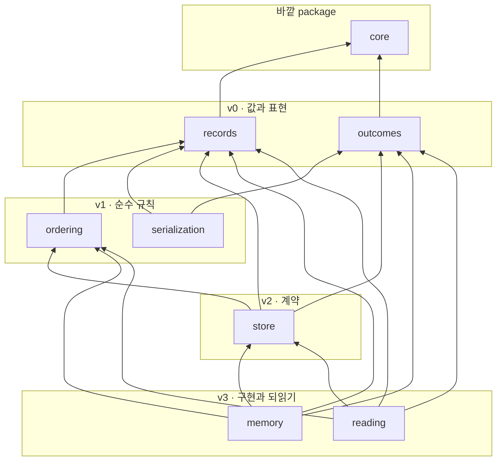
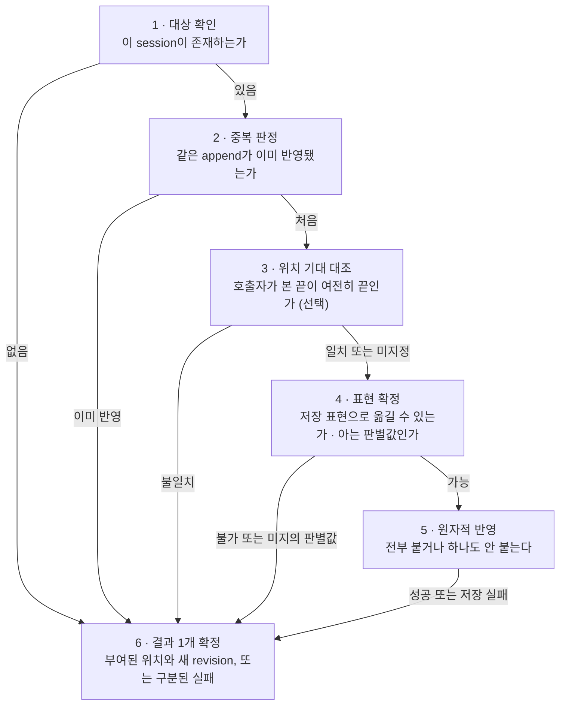
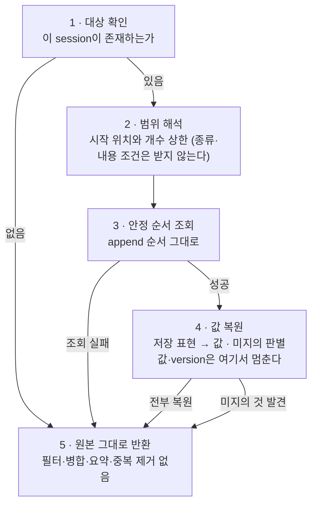

# sessions package 경계 — event 저장·조회 계약, 순서·원자성 불변식, memory/durable 확장 seam

KAG-DEC-001이 `sessions`에 배정한 “session event의 손실 없는 저장과 조회”라는 책임을 **어떤 파일에 어떤 종류의 것으로 나눠 담을지**, **한 번의 append와 한 번의 조회가 무엇을 보장하는지**, 그리고 **memory store와 향후 durable store가 어떤 계약을 함께 구현하는지** 제안한다. 구조 옵션 비교와 파일 후보 트리, 파일별 역할과 타입/Protocol 범주, 내부 의존 방향, session/turn/event 식별과 session 내 ordering, append 원자성·중복·동시 writer·부분 실패의 판정, 조회의 안정성과 되읽기 경계, 직렬화 format/version과 unknown fail-closed, 보안·관측·contract test seam까지가 대상이고 **exact signature·저장 schema·DB 제품·sync/async 형태·retention·암호화·migration 도구는 대상이 아니다.**

> baseline의 날것 입력을 spec으로 내리기 전에 적용 방향을 정하는 문서.
> 기능 계약 상세는 `20-spec/`, 실제 작업 순서는 `30-work/`에 둔다.

> **상태 `proposed` — 사용자 리뷰 대기.** 이 문서의 §Decision 이하는 전부 **권고안**이며 아직 이 제품의 결정이 아니다. 사용자가 확정하기 전에는 어떤 파일도 만들지 않는다. KAG-BL-001·KAG-DEC-001·KAG-DEC-002의 `accepted`는 이 문서가 바꾸지 않는다 — 이 문서는 그 위에 쌓일 뿐 되돌리지 않는다. KAG-DEC-003·KAG-DEC-004·KAG-DEC-005·KAG-DEC-006은 여전히 `proposed`이며, 이 문서는 그 넷을 **확정 사실이 아니라 제안된 입력**으로만 참조한다(§0.2).

## Context

- 관련 baseline: [[baseline-001-provider-neutral-llm-runtime|KAG-BL-001]]
- 선행 결정: [[decision-001-runtime-directory-boundaries|KAG-DEC-001]] (accepted), [[decision-002-turn-runtime-flow|KAG-DEC-002]] (accepted), [[decision-003-core-contract-boundaries|KAG-DEC-003]] (proposed, 리뷰 대기), [[decision-004-process-boundaries|KAG-DEC-004]] (proposed, 리뷰 대기), [[decision-005-provider-boundaries|KAG-DEC-005]] (proposed, 리뷰 대기), [[decision-006-tools-boundaries|KAG-DEC-006]] (proposed, 리뷰 대기)
- 문제/기회
  - KAG-DEC-001은 `sessions`를 L2 capability package로 두고 **`core`만 참조**하게 했다. 책임은 “session event의 손실 없는 저장과 조회” 하나이고, **어떤 event를 model에 보낼지에 대한 판단은 명시적으로 제외**했다.
  - KAG-DEC-002는 그 위에 규율을 얹었다. 한 turn의 side effect 12단계 중 **다섯 단계가 event append**이고(사용자 입력·model 응답·tool 검증·tool 결과·final), I1은 “**기록 먼저, 사용 나중** — event로 기록되지 않은 어떤 재료도 다음 provider 요청에 들어가지 않는다”를 요구한다. §5는 여기에 “**부분 진행은 사라지지 않는다** — 어떤 원인으로 끝나든 그때까지 기록된 event는 session에 남는다”를 더했다.
  - KAG-DEC-003은 event **payload**를 `core`가 소유하되(K6), **store 경계는 core에 두지 않는다**고 판정했다 — `runtime → sessions`가 허용되므로 의존 역전이 필요 없고, 그래서 “store 경계를 `sessions` 안에서 어떤 형태로 둘지”를 OQ-2로 이 문서에 넘겼다.
  - KAG-DEC-006은 반대편에서 같은 자리를 가리켰다. `tools`는 거부도 실패도 **값으로 반환할 뿐 아무것도 기록하지 않고**(TI6·TR7), “거부도 기록된다”가 성립하려면 그 값을 받아 붙이는 쪽이 있어야 한다.
  - 그런데 그 받는 쪽이 비어 있다. **event 하나가 어떤 순서로 붙고, 그 순서가 무엇으로 보장되며, 두 번 붙으면 어떻게 되고, 붙이다 실패하면 무엇이 남는지**가 아무 데도 정의돼 있지 않다. 지금 상태로 memory store 하나를 짜면 네 가지가 즉시 문제가 된다.
    1. **memory에서 공짜로 얻는 것이 계약에 적히지 않는다.** 리스트에 붙이면 순서와 원자성이 저절로 따라오므로 그것을 요구사항으로 쓸 이유가 없어 보인다. 그러다 durable store를 붙이는 순간 **무엇이 계약이고 무엇이 구현의 우연인지 구분할 근거가 사라진다** — 그때는 이미 `runtime`이 그 우연에 기대고 있다.
    2. **“손실 없음”이 무엇을 뜻하는지 갈린다.** 모르는 event 종류를 건너뛰고 읽으면 호출자에게는 “원래 없었던 것”과 구분되지 않는다. compaction이 원본을 줄여도 “줄인 것도 원본”이라고 부를 수 있다. 두 경우 다 lossless라는 단어는 그대로 남는데 실제로 남은 것은 다르다.
    3. **조회 표면이 넓어진다.** event를 순서대로 돌려주는 자리가 생기면 곧 “이 turn 것만”, “tool 결과만”, “최근 N개만”, “접어서 지금 상태만”이 따라 붙는다. 그 넷 중 앞의 둘은 event 종류를 아는 코드이고 뒤의 둘은 투영이다 — 전부 KAG-DEC-001이 `sessions` 밖에 둔 것이다.
    4. **동시 writer가 없다는 사실이 계약에 안 적힌다.** 지금은 turn 하나를 소유한 `runtime` 하나만 쓴다(KAG-DEC-002 §3). 그 전제를 적지 않으면 나중에 두 번째 writer가 생겼을 때 **무엇이 깨지는지 판정할 자리가 없다.**
  - 공개 계약을 package 하나씩 의존 그래프의 **아래에서 위로** 내려가기로 했고, `core`(L0, KAG-DEC-003) · `process`(L1, KAG-DEC-004) · `providers`(L2, KAG-DEC-005) · `tools`(L2, KAG-DEC-006) 다음이 같은 L2의 `sessions`다. `tools` 다음에 두는 이유는 KAG-DEC-006 TR7이 “거부가 값으로 반환되는 것까지는 보장했고 그것이 기록으로 남는 것은 다른 문서의 몫”이라며 수신자를 넘겼기 때문이다.
- 결정이 필요한 이유
  - `sessions`는 이 라이브러리에서 **재현성이 실제로 성립하는 자리**다. KAG-BL-001은 “loop를 소유해야 학습이 된다”와 “같은 입력·같은 snapshot이면 같은 전이 열이 나온다”를 존재 이유로 적었는데, 그 둘을 사후에 확인할 수 있는 유일한 근거가 남은 event다. `runtime`은 순서를 만들 뿐 보관하지 않고, `context`는 읽되 원본을 책임지지 않는다.
  - 동시에 **범위를 넘기 가장 쉬운 자리**이기도 하다. event를 순서대로 들고 있으면 그것으로 무엇이든 만들 수 있어 보인다 — 화면용 상태, 검색 색인, 사용량 집계, model context. 그 넷은 전부 다른 소유자가 있고(§1), 하나라도 여기로 들어오면 **“손실 없는 저장과 조회”라는 단일 책임이 그 순간 사라진다.**
  - 그래서 이 문서는 **저장과 되읽기의 계약을 좁게 못박는 데까지만** 가고, 그 위에 무엇을 세울지는 소비자에게 남긴다(§6.4).

### 0.1 이 문서의 표기 규칙

- **“event”는 KAG-DEC-003 K6이 `core`에 배정한 payload 한 건**을 뜻한다. `sessions`는 그것을 **순서가 붙은 불투명한 값**으로 다루며 종류를 해석하지 않는다(§1).
- **“canonical event”는 `runtime`이 구성해 `sessions`에 넘긴 그 값**을 뜻한다. 이 문서가 “손실 없음”이라고 말할 때 그것은 **canonical event에 대해서**이고, event를 구성하기 전에 무엇을 담지 않기로 했는지는 `sessions`가 잃은 것이 아니다(§8 SR3″).
- **“append”는 event 한 단위를 session 끝에 붙이는 행위**를 뜻한다. “기록”이라는 말은 *무엇을 언제 남길지 정하는 것*까지 포함해서 읽히므로 이 문서는 append를 쓴다 — 그 결정은 `runtime`의 것이다(KAG-DEC-002 §4).
- **“되읽기”와 “재생”을 구분한다.** 되읽기는 저장된 원본을 같은 순서로 다시 내주는 것이고, 재생은 그것을 접어 상태를 만들거나 다시 실행하는 것이다. **이 package가 제공하는 것은 되읽기뿐이다**(§6.4).
- **“store”는 append와 조회를 제공하는 구현**을, **“store 계약”은 모든 store 구현이 공통으로 만족해야 하는 것**을 뜻한다. 둘을 한 단어로 부르지 않는다.
- **“위치”는 session 안에서 event가 놓인 순서 좌표**를 뜻한다. 벽시계 시각과 다른 것이고(§2.2), 저장소의 물리적 주소와도 다르다.
- **파일명·타입 범주·계열 이름은 개념 라벨이다.** 클래스명·함수명·enum 값으로 승격하지 않는다. §Scope Out.
- **“권고”와 “확정”을 구분한다.** 이 문서 전체가 `proposed`이므로 모든 §Decision 항목은 권고이고, 근거가 약해 뒤집힐 수 있는 것은 그렇게 표시하거나 Open Questions로 뺀다.

### 0.2 선행 문서를 어떻게 참조하는가

| 문서 | 상태 | 이 문서에서의 취급 |
|---|---|---|
| KAG-BL-001 | accepted | 목표·보안 모델·reference 취급 규칙의 근거. 특히 “session event log는 손실 없는 원본이고 compaction이 원본을 지우지 않는다”, “요약문을 새로운 사실 원본으로 취급하지 않는다”, “순서는 항상 기록 먼저 알림 나중”, “동기화·조회 실패를 없음으로 해석하지 않는다”가 이 문서의 출발점이다 |
| KAG-DEC-001 | accepted | **변경하지 않는다.** `sessions`의 책임(“손실 없는 저장과 조회”), `sessions → core`만 허용하는 의존 방향, “어떤 event를 model에 보낼지는 두지 않는다”는 경계를 그대로 소비한다 |
| KAG-DEC-002 | accepted | **변경하지 않는다.** side effect 12단계 중 다섯 개의 append 지점, I1(기록 먼저 사용 나중), “거부도 기록·실패도 기록”, “부분 진행은 사라지지 않는다”, snapshot이 turn 내내 불변이라는 전제를 소비한다. **무엇을 언제 append할지의 결정은 전부 `runtime`의 것이고 이 문서는 그 아래 하위 책임만 정의한다** |
| KAG-DEC-003 | **proposed** | 확정 사실로 쓰지 않는다. event payload(K6)·식별자 원시 타입·오류 표현(K7)·공통 응답 참조를 “제안된 배치”로만 인용하고 **파일 이름이 아니라 범주 수준으로만** 연결한다. 다만 §4.1의 판정 하나(“session event 저장 경계는 core가 아니라 `sessions` 안”)와 그것이 넘긴 OQ-2는 **이 문서가 답하는 질문 자체**이므로 §3에서 정면으로 다룬다. KAG-DEC-003이 뒤집혀도 §3 배치와 §4 lifecycle은 그대로 성립해야 한다 |
| KAG-DEC-004 | **proposed** | 직접 참조하지 않는다. `sessions`는 `process`를 import하지 않는다(KAG-DEC-001 §4). durable store가 외부 프로세스를 쓸 일은 없고, 파일 기반 store가 생기더라도 그것은 subprocess 격리가 아니다 |
| KAG-DEC-005 | **proposed** | 직접 참조하지 않는다. 소비하는 것은 성질 하나 — provider 원문은 **구조를 읽지 않는 불투명 값**이라는 것(PI6). 그 값이 event에 실려 오면 `sessions`도 구조를 읽지 않는다(§8 SR5) |
| KAG-DEC-006 | **proposed** | 확정 사실로 쓰지 않는다. 소비하는 것은 경계의 성질 둘 — `tools`는 아무것도 기록하지 않고 값만 반환하며(TI6), 거부도 실패도 **결과로 반환되어** 기록 재료가 된다(TI1·TR7). 그 값이 `runtime`을 거쳐 이 package에 도달한다 |
| REF-0007 설계 노트 | read-only | 초기 범위의 근거. “memory store와 append-only turn event”, “영속 store를 추가해도 계약과 turn 실행은 유지”, “session 원본과 model context 분리”가 이 문서의 입력이다. 노트의 코드 예시·이름 가안·event 종류 목록은 **확정 계약이 아니다** |
| 사내 운영 서비스의 durable turn 구현 | read-only | **구조 패턴만** 일반화했다. 원장이 진실이고 알림은 재조회 힌트라는 것, 외부 효과 이전에 체크포인트를 남겨 재개 시 두 번 내지 않는 것, 실패 표면화가 실패해도 원장은 닫는 것, 저장 어휘와 문서 어휘가 갈라지면 조회 술어가 갈라진다는 것이 그것이다. 조직·업무·데이터와 코드·식별자는 옮기지 않았고, **그쪽의 큐·리스·워커 운영은 이 라이브러리가 흡수하지 않는다**(§1) |

## 근거 개념

이 결정이 기대는 개념. 상세는 concept 노트가 갖는다.

- [[application-event]] — session 을 상태가 아니라 **event 의 나열**로 저장한다 — 순서와 손실 없음이 이 층의 계약이 되는 이유다
- [[transaction]] — append 의 **원자성**과 부분 실패 판정. 반쯤 쓰인 event 가 남으면 되읽기가 무의미해진다
- [[idempotency]] — append 의 **중복 판정**이 이 성질이다. 재시도된 append 가 event 를 둘로 늘리면 순서도 되읽기도 무의미해지므로, 같은 event 는 몇 번 들어와도 하나여야 한다
- [[serialization]] — 저장 format 과 version 을 정하고 **모르는 필드는 fail-closed** 로 막는다 — 나중 버전이 지금 코드를 조용히 통과하지 못하게 한다

## Options

**초기 복잡도, 계약과 구현의 분리(무엇이 요구사항이고 무엇이 구현의 우연인지 구분되는가), 책임 누수 저항(투영·folding·검색이 들어올 자리가 있는가), durable 확장 비용(두 번째 store가 붙을 때 무엇이 열리는가), event 종류 무지의 유지(새 event 종류가 이 package를 열게 하는가)** 다섯 축으로 비교했다.

축 하나를 미리 정확히 해 둔다. 여기서 비교하는 것은 **memory store를 짤 수 있는가**가 아니다 — 아래 어느 안을 골라도 첫 store는 짧다. 비교 대상은 **두 번째 store가 붙을 때 계약이 어디까지 흔들리는가**다. 이 package는 “첫 구현이 너무 쉬워서 계약을 안 쓰게 되는” 성질을 갖고 있어서, 첫 구현의 편의보다 두 번째 구현 시점의 비용이 구조를 결정한다.

| Option | Description | Pros | Cons | Notes |
|---|---|---|---|---|
| A. 단일 `store.py` | 계약·memory 구현·순서 규칙·조회·직렬화를 한 module에 둔다. REF-0007 설계 노트의 `store.py` + `memory_store.py` 2파일 가안을 하나로 더 접은 모양 | 초기 복잡도 최저. 첫 store가 리스트 하나라 파일을 나눌 것이 실제로 없다. 계약과 구현이 나란히 있어 “계약이 뭘 요구하는지”를 구현을 보며 읽는다 | **계약과 구현이 구분되지 않는다.** 나란히 있으면 memory가 공짜로 주는 성질(전순서·원자성·read-your-write)이 계약에 적히지 않고, 그것이 문제로 드러나는 시점은 durable을 붙일 때다. 그때는 이미 `runtime`이 그 성질에 기대고 있고, 무엇이 계약 위반인지 판정할 문서가 없다. 순서 규칙·직렬화 규칙을 store 없이 단독으로 검증할 자리도 없다 | 비권고 |
| B. 관심사별 평면 module + 계약/구현 분리 | 저장 단위 값 · 결과와 실패 표현 · 순서 규칙 · store 계약 · 직렬화 경계 · memory 구현 · 되읽기를 각각 module로 두고, module 간 방향을 총순서로 고정한다 | **계약이 구현과 다른 파일에 있어 “계약이 요구하는 것”이 목록으로 존재한다.** durable을 붙일 때 여는 것은 새 파일 하나이고 계약 파일은 안 열린다(§6.2). 순수 규칙(순서·직렬화)이 store 없이 단독 검증된다. **되읽기가 store 계약 위 한 자리에 있어 memory와 durable이 같은 순서 보장을 얻는다** — 구현마다 되읽기를 쓰면 두 store의 순서 보장이 갈라진다. 조회 표면이 한 파일이라 투영·검색이 들어오려 할 때 그 자리가 눈에 보인다 | module 7개는 store가 하나뿐인 첫 slice에 확실히 많고, `serialization`은 memory 경로에서 아예 안 쓰인다(§6.3의 대가). 총순서를 언어가 강제하지 않는다. `reading`과 `store`의 경계가 얇아 합쳐질 여지가 있다(→ OQ-7) | **권고** |
| C. store 백엔드별 하위 package | `sessions/memory/` · `sessions/sqlite/`처럼 백엔드별로 폴더를 두고 공용 계약만 위에 남긴다. KAG-DEC-005가 `providers`에 권고한 모양과 같다 | 백엔드 종속 코드가 폴더로 봉인된다. 두 번째 백엔드가 첫 번째 코드를 열지 않는다. 선택적 의존(DB 드라이버)이 폴더 단위로 갈린다 | **`providers`와 성질이 다르다.** provider adapter는 wire 형식·실행 파일·capability가 전부 달라서 봉인 단위가 필요했지만, **store 백엔드가 서로 다른 것은 저장 매체 접근 하나뿐이고 다루는 값과 순서 규칙은 같다.** 지금 백엔드가 하나인데 폴더를 만들면 파일 1개짜리 package가 생기고, 새 파일마다 “공용인가 전용인가”를 판정해야 한다 — 그 판정 비용이 얻는 것보다 크다. 게다가 폴더가 생기면 순서 규칙이 백엔드 안으로 흘러들어가기 쉬워지고, 그것이 바로 B가 막으려는 것이다 | 비권고. **durable이 실제로 migration·연결 관리·스키마를 들고 오면 그때 그 백엔드 하나만 폴더로 승격한다**(§6.2) — 승격 경로는 열려 있다 |
| D. event 종류별 module 분리 | `turn_events.py` · `tool_events.py`처럼 event 종류별로 저장·조회를 나누거나, 종류별 handler를 등록하는 구조를 둔다 | 종류마다 다른 저장 전략(큰 tool 결과는 따로, 응답은 압축)을 쓸 수 있다. “이 event는 어디 저장되나”가 폴더로 보인다 | **`sessions`가 event 종류를 알게 된다.** 그 순간 KAG-DEC-001이 이 package에서 제외한 “어떤 event를 어떻게 다룰지에 대한 판단”이 들어오고, **새 event 종류가 늘 때마다 이 package가 열린다.** KAG-DEC-003 V3′는 새 판별값 추가를 파괴적 변경으로 취급하는데, 여기에 종류별 분기가 있으면 그 파괴가 store 구현까지 번진다. 종류별 저장 전략은 실제 필요가 관찰된 적이 없고, 필요해지면 그것은 **저장소 내부의 최적화**이지 package 배치 축이 아니다 | 기각 |

핵심 trade-off를 숨기지 않는다: **A가 초기 복잡도에서 크게 이기고, 지금 이 package의 실제 코드 양을 생각하면 그 이점이 작지 않다.** 첫 store는 “리스트에 붙이고 슬라이스해서 돌려준다”가 거의 전부이고, 그것을 7개 파일에 나누면 파일당 몇 줄이 된다.

B를 권고하는 이유는 파일 수가 아니라 **이 package에서 계약을 늦게 쓰는 대가가 다르기 때문**이다. `tools`가 잘못 나뉘면 판정을 건너뛴 실행이 생기고(KAG-DEC-006 §Options), `core`가 잘못 나뉘면 리팩터링 비용이 생긴다. `sessions`가 잘못 나뉘면 **durable로 옮기는 시점에 무엇이 계약 위반인지 판정할 근거가 없어진다** — 그리고 그때 이미 `runtime`과 그 테스트가 memory의 우연한 성질 위에 서 있다. A에서 계약을 확인하는 방법은 memory 구현을 읽는 것뿐이고, 그것은 정의상 “구현이 계약”이 된다는 뜻이다.

과설계 경계도 명시한다. B가 module을 7개로 나누는 것은 **§1에서 `sessions`가 소유한다고 판정한 책임이 그만큼이기 때문**이지 대칭을 위해서가 아니다. 소유할 책임이 없는 파일은 만들지 않는다 — 예컨대 “event를 접어 현재 상태를 만드는” 파일도, “session 목록을 검색하는” 파일도 두지 않는다. 전자는 소비자의 일이고 후자는 호스트의 일이다(§1).

## Decision

> 아래는 전부 **권고안**이다. 사용자 확정 전에는 결정이 아니다.

- 권고: **Option B — 관심사별 평면 module 분리 + 계약과 구현의 파일 분리 + module 간 총순서 고정.**
- 비권고: Option A(단일 `store.py`), Option C(백엔드별 하위 package). C는 §6.2의 승격 경로로 남긴다.
- 기각: Option D(event 종류별 module 분리).
- **KAG-DEC-003 OQ-2에 대한 답을 함께 제안한다**: store 경계는 `sessions` 안 **`store.py` 하나에 계약 하나**로 둔다(§3.1·§7.2). append와 조회를 두 계약으로 쪼개지 않는 이유는 §7.2에 적는다.
- 미결로 남김: sync/async 형태, append 단위에 event를 여럿 받을지, expected revision을 필수로 할지, 멱등 키의 발급 주체, memory에도 직렬화 왕복을 강제할지, `reading`을 `store`에 접을지, 저장 format과 version 표기, provider 원문 보관, retention·삭제 요구의 거처, 실패의 값/예외 표현, **`serialization`이 “아는 판별값”을 어떻게 아는가**(`core` codec이 아직 없으므로 새 `core` API를 발명하지 않는다) (→ §Open Questions).

이하 §1~§8이 Option B의 권고 내용이다.

### 1. sessions가 소유하는 것과 소유하지 않는 것

먼저 책임 범주를 못박는다. 파일 배치는 그 다음이다(§3).

| # | 책임 범주 | sessions가 소유하는 이유 |
|---|---|---|
| S1 | **append의 수용** — 호출자가 넘긴 event 한 단위를 지정된 session에 붙인다 | KAG-DEC-001 §2. “저장”의 본체이고, KAG-DEC-002 §4의 다섯 append 지점이 전부 여기로 온다 |
| S2 | **session 내 순서의 부여와 보존** — 위치를 붙이고 그것이 바뀌지 않게 한다 | KAG-DEC-002 §4.2가 tool call과 결과의 1:1 짝을 “응답에 나타난 순서대로”로 정의했다. 그 순서를 사후에 복원할 수 있는 것은 저장된 순서뿐이다 |
| S3 | **append의 원자성** — 한 단위는 전부 붙거나 하나도 안 붙는다 | KAG-DEC-002 §5 “부분 진행은 사라지지 않는다”의 반대편. 절반만 붙은 기록은 남은 것보다 나쁘다 — 사후 복원이 조용히 틀린다 |
| S4 | **중복 append의 판정** — 같은 append가 이미 반영됐는지 구분한다 | 재시도·재개가 있는 어떤 경로에서도 같은 event가 두 번 붙으면 순서와 짝이 동시에 깨진다 |
| S5 | **동시 writer의 충돌 감지** — 기대한 위치와 실제가 다르면 실패로 알린다 | 지금은 writer가 하나지만(§2.4), 감지할 값이 없으면 두 번째 writer가 생겼을 때 **덮어썼다는 사실 자체가 남지 않는다** |
| S6 | **순서 있는 조회** — 저장된 원본을 append 순서 그대로 돌려준다 | KAG-DEC-001 §2. KAG-DEC-002 §4 3단계가 “기록된 event의 읽기 전용 투영”을 요구하는데, 투영의 재료를 내주는 것이 여기다 |
| S7 | **store 계약의 소유** — memory와 향후 durable이 함께 구현할 경계 | KAG-DEC-003 §4.1이 이 경계를 core에서 제외하고 이 package로 넘겼다 |
| S8 | **memory store 구현** — 첫 store이자 계약의 첫 준수 사례 | KAG-BL-001 “memory store로 event 계약을 먼저 고정한다” |
| S9 | **저장 표현의 경계** — 저장 format과 version, 모르는 판별값의 fail-closed 판정 | KAG-DEC-003 §4.2가 “저장 포맷은 `sessions`”라고 배정했다. 형식이 계약이 되는 것은 저장된 것을 나중 버전이 읽어야 하기 때문이다 |

**sessions가 소유하지 않는 것.** 아래가 `sessions/` 아래에 나타나면 그 자체가 위반이다.

| 두지 않는 것 | 사는 곳 | 근거 |
|---|---|---|
| 무엇을 언제 append할지의 결정, event 내용의 구성 | `runtime` | KAG-DEC-002 §4. `sessions`는 **받은 것을 붙일 뿐 무엇을 붙일지 고르지 않는다** |
| model에 무엇을 보낼지의 선택, 축약, compaction | `context` | KAG-DEC-001 §2. 원본과 투영은 같은 결정이 아니다 (KAG-BL-001) |
| event를 접어 만든 상태 — 화면용 view, 진행 상황, 누적 집계 | 소비 애플리케이션 | KAG-DEC-001 §2. folding 규칙은 소비자의 것이고 `sessions`는 그 재료만 낸다 (§6.4) |
| 검색·색인·analytics·사용량 리포트 | 호스트 또는 외부 시스템 | 같음. 조회 표면에 필터가 하나 생기면 그 다음은 전부 따라온다 (§Options 문제 3) |
| tool call과 결과의 짝 판정, turn 종료 판정, 불변식 위반 판정 | `runtime` | KAG-DEC-002 §4.3. 판정하려면 event 종류를 알아야 하고, 그 순간 §1의 “종류를 해석하지 않는다”가 무너진다 |
| event 종류 목록의 확정, payload 형태 | `core` | KAG-DEC-003 K6. `sessions`는 payload를 참조만 하고 다시 그리지 않는다 |
| 알림·구독·push·webhook | 호스트 애플리케이션 | KAG-BL-001 “기록 먼저, 알림 나중”. 알림이 이 package 안에 있으면 두 순서가 한 트랜잭션에 얽힌다 (§4 SI8) |
| 접근 제어 — 누가 어느 session을 읽을 수 있는가 | 호스트 애플리케이션 | 제품 결정이다. `sessions`는 식별자를 받으면 돌려준다 (§8 SR7) |
| 무엇이 민감한지의 판정과 마스킹 | `runtime` · 호스트 | 마스킹이 여기 있으면 “손실 없는 원본”과 “마스킹된 것”이 같은 자리에서 싸운다. **판정은 event를 구성하기 전에 끝나고, 구성된 event를 저장용으로 줄이는 경로는 만들지 않는다** (§8 SR3·SR3′) |
| queue·lease·claim·worker 배분, 사용자별 직렬화 | (이번 범위에 두지 않음) | KAG-BL-001 OQ-11 유지. `sessions`는 **충돌을 감지할 값**까지만 제공하고 조정하지 않는다 (§2.4) |
| DB 제품 선택, 연결 관리, 스키마 migration | 미확정 | §6.2. durable store가 실제로 필요해질 때의 결정이다 |
| 암호화, retention, 법적 삭제 절차 | 미확정 · 호스트 | §8 SR6. 계약에 삭제 경로를 뚫지 않는다 (→ OQ-10) |
| 조립 — 어떤 store를 쓸지 정하고 넘기는 일 | L4 애플리케이션 | KAG-DEC-001 §4 “조립은 여기서만” |

한 줄 덧붙인다. **이 package는 event의 의미를 읽지 않는다.** 여기 있는 것은 전부 “남이 만든 값에 순서를 붙여 보관하고 같은 순서로 되돌려주는” 코드다.

다만 “읽지 않는다”를 “판별값을 볼 수 없다”로 읽으면 안 된다. 저장 표현을 다시 typed core event로 되돌리려면 **어떤 형태를 만들어야 하는지**를 구분해야 하고, 그것은 의미 해석이 아니라 표현 복원이다. **의미·정책에 따른 분기는 금지되고 표현 복원을 위한 구조적 판별은 허용되며, 후자는 `serialization` 안에서만 일어난다** — 이 구분을 §6.3에서 허용/금지 표로 못박고, 그것을 확인하는 검증 기준도 그 경계에 맞춰 §7.3에 적는다.

### 2. 식별 · 순서 · append 계약

#### 2.1 식별의 세 층

| 층 | 무엇 | 값을 만드는 쪽 | `sessions`가 하는 일 |
|---|---|---|---|
| **session** | 여러 turn에 걸친 event를 담는 단위 | L4 애플리케이션 또는 `runtime` | 받아서 담는다. **식별자를 발급하지 않는다** |
| **turn** | 한 사용자 입력의 처리 단위 | `runtime` (KAG-DEC-002 §1) | event에 실려 온다. **turn 경계를 판정하지 않는다** |
| **event** | append 한 건 | payload와 식별자는 `runtime` (KAG-DEC-003 §3.1) · **session 내 위치는 `sessions`** | 위치를 부여하고 보존한다 |

**식별자를 `sessions`가 발급하지 않는 것이 이 표의 핵심 판정이다.** 근거 둘.

1. **발급을 store가 하면 store마다 발급 방식이 달라진다.** 저장소가 자동 증가 정수를 주는 것과 라이브러리가 무작위 값을 만드는 것은 다른 값이고, 계약이 그 차이를 흡수하려면 “식별자는 store가 정한 무언가”라는 약한 계약밖에 못 쓴다. 그러면 `runtime`이 append **전에** 식별자를 참조할 수 없고, KAG-DEC-002 §4.2의 짝 판정이 append 이후로 밀린다.
2. **호출자가 주면 store는 “이 식별자로 담는다”만 하면 된다.** 대신 `sessions`는 **같은 session 식별자로 두 번 만들려는 시도를 거부**해야 한다(§5.1 대상 계열) — KAG-DEC-006 T2의 등록 시점 가드와 같은 성격이다.

**위치는 다르다. 위치는 `sessions`만 만들 수 있다** — 그것은 “이 store 안에서 몇 번째로 도착했는가”이고, 도착 순서를 아는 것은 store뿐이다.

#### 2.2 순서 규칙

| # | 규칙 | 근거와 대가 |
|---|---|---|
| O1 | **순서는 session 내 전순서(total order)다.** 두 session 사이에는 순서가 없고, 전역 순서를 보장하지 않는다 | 전역 순서를 보장하려면 모든 append가 한 지점을 지나야 한다. 그것은 durable store에 큰 제약이고, **필요한 근거가 없다** — KAG-DEC-002의 어떤 판정도 session 간 순서를 쓰지 않는다 |
| O2 | **순서의 기준은 append 도착 순서이지 벽시계 시각이 아니다.** 시각은 event 안에 값으로 남을 수 있지만 정렬 기준이 아니다 | 시계는 뒤로 갈 수 있고, durable store가 여러 노드에 걸리면 더 그렇다. 순서가 시각에 걸리면 **같은 session을 두 번 읽을 때 순서가 달라질 수 있다** — 그 순간 재현성이 사라진다 |
| O3 | **위치는 단조 증가하지만 조밀할 필요는 없다.** 번호가 건너뛰어도 되고, 순서가 뒤집히면 안 된다 | 조밀함을 요구하면 실패한 append가 번호를 소모하는 store가 계약을 만족하지 못한다. **대가를 적는다** — 조밀하지 않으면 “빠진 것이 있는가”를 번호만으로 판정할 수 없다. 그 판정이 필요해지면 별도 값이 필요하고, 지금은 필요 근거가 없다(→ OQ-4와 함께 본다) |
| O4 | **한 번 부여된 위치는 바뀌지 않는다.** 재정렬·번호 재부여 경로를 두지 않는다 | 위치가 바뀌면 이미 그 위치를 들고 있는 소비자(이어읽기 중인 되읽기)가 조용히 틀린 구간을 읽는다 |
| O5 | **session의 현재 끝을 가리키는 값 하나를 함께 관리한다.** append는 그 값을 앞으로 밀고, 조회는 그 값까지를 본다 | 충돌 감지(S5)와 이어읽기(§4.2)가 둘 다 이 값 하나에 기댄다. 이 문서는 이것을 **session revision**이라고 부르되 그것이 위치와 같은 값인지 별개 값인지는 정하지 않는다(→ OQ-4) |

#### 2.3 append 계약 규칙 8개

| # | 규칙 | 어기면 생기는 일 |
|---|---|---|
| SG1 | **원본은 append-only다.** 수정·삭제·재배치 경로를 계약에 두지 않는다 | “손실 없는 원본”이 이름만 남는다. 경로가 존재하면 언젠가 누군가 쓴다 |
| SG2 | **compaction·요약은 원본을 대체하지 않는다.** 요약을 남기고 싶으면 그것도 **새 event**이고 앞의 것을 지우지 않는다 | KAG-BL-001 “요약문을 새로운 사실 원본으로 취급하지 않는다”가 무너진다. 요약이 원본 자리에 앉으면 사후 검증의 기준점이 사라진다 |
| SG3 | **식별자는 호출자가 주고 `sessions`는 위치만 부여한다** | §2.1. store마다 식별자 발급이 달라져 계약이 약해진다 |
| SG4 | **순서의 기준은 도착 순서다** (O2) | 같은 session을 두 번 읽을 때 순서가 달라질 수 있다 |
| SG5 | **한 번의 append는 원자적이다** — 전부이거나 없음 | 절반만 남은 기록은 사후 복원을 **조용히** 틀리게 만든다 |
| SG6 | **`sessions`는 event 종류에 따라 의미·정책 분기를 하지 않는다.** 종류마다 다른 저장 경로·다른 조회 결과·다른 필터·다른 상태 판정을 만들지 않는다. **저장 표현을 typed 값으로 되돌리기 위한 구조적 판별은 예외이고 `serialization` 안에서만 일어난다**(§6.3) | 새 event 종류마다 이 package가 열리고, KAG-DEC-001이 제외한 판단이 여기로 들어온다 (§Options D). 반대로 구조적 판별까지 금지하면 저장 표현을 typed core event로 되돌릴 방법이 없어 Z5(왕복 무손실)가 성립하지 않는다 |
| SG7 | **`sessions`는 알리지 않는다.** 구독·push·webhook·콜백 표면을 만들지 않는다 | KAG-BL-001 “기록 먼저, 알림 나중”이 성립하려면 알림이 append 바깥에 있어야 한다. 안에 있으면 알림 실패가 기록 실패로 번지거나, 반대로 기록 실패를 알림 성공이 가린다 |
| SG8 | **append 실패를 성공으로 접지 않는다.** 실패는 구분된 결과로 알리고, terminal 판정은 `runtime`이 한다 | KAG-DEC-002 §5는 기록 실패를 “runtime 내부 오류 → 실패종료”로 두었다. `sessions`가 실패를 삼키면 기록과 실제가 갈라진 채 loop가 계속 돈다 |

#### 2.4 동시 writer를 어디까지 다루는가

**지금 writer는 하나다.** KAG-DEC-002 §3이 turn을 소유한 `runtime` 하나에 snapshot을 고정하고, §4가 side effect 순서를 직렬로 못박았다. 그래서 이 문서는 조정(lock·lease·큐·사용자별 직렬화)을 **만들지 않는다** — KAG-BL-001 OQ-11이 queue·multi-worker를 범위 밖에 둔 것을 그대로 유지한다.

그런데 **감지할 값 하나는 지금 만든다.** append가 “내가 본 끝이 여전히 끝인가”를 함께 넘길 수 있게 하고, 다르면 실패로 돌려준다(§5.1 위치 계열).

- **지금 만드는 이유**: 나중에 만들면 store 계약이 열리고, 그 시점에 memory와 durable이 이미 다른 계약을 갖고 있게 된다. 값 하나를 계약에 넣는 비용은 지금이 가장 싸다.
- **지금 강제하지 않는 이유**: writer가 하나인데 매 append에 기대값을 요구하면 호출부가 그것을 관리해야 하고, 관리할 이유가 없는 값은 곧 형식적으로 채워진다. 그래서 **선택적 입력**을 권고한다 — 생략하면 무조건 끝에 붙인다. 다만 이 판단은 갈릴 수 있어 미결로도 남긴다(→ OQ-4).
- **만들지 않는 것**: 두 writer 중 누가 이겨야 하는지의 정책, 재시도, 대기, 순서 조정. **`sessions`가 하는 말은 “당신이 본 끝이 더 이상 끝이 아니다” 하나뿐이고**, 그 다음은 호출자가 정한다.

### 3. 파일 후보 트리와 내부 방향

#### 3.1 파일 후보 트리

```text
src/kknaks_agents/sessions/
├── __init__.py        # 공개 표면 (§7.1) — 호스트가 store를 만들 때 통과하는 자리
├── records.py         # 저장 단위 — core event payload 참조 + 배치 좌표(session·위치)   ← §1 S1
├── outcomes.py        # append 결과와 거부·조회 실패의 표현                             ← §1 S3·S4·S5의 표현
├── ordering.py        # session 내 순서 규칙 — 위치 부여·전순서·범위 해석 (순수)         ← §1 S2
├── serialization.py   # 저장 표현 ↔ 값의 경계 · format version · unknown fail-closed     ← §1 S9
├── store.py           # store 계약 하나 — append와 조회의 경계, 계약 불변식              ← §1 S7
├── memory.py          # in-process memory store 구현 (첫 store)                        ← §1 S8
└── reading.py         # 저장된 원본을 안정된 순서로 되읽는 진입 (투영이 아니다)           ← §1 S6
```

module 7개 + `__init__.py`다. 화살표는 **그 파일이 §1의 어느 책임을 명시적으로 소유하는가**를 가리키며, 책임과 파일이 개수로 1:1인 것은 아니다 — `store`는 계약으로서 S3·S4·S5를 **요구**하고 `memory`가 그것을 **만족**한다.

이름에 대한 판단 넷.

- **`reading.py`이지 `replay.py`가 아니다.** “재생”이라는 말은 event sourcing 문맥에서 *접어서 상태를 만든다*로 읽히는데, 그 folding은 이 package가 소유하지 않는다(§1·§6.4). 이름이 책임을 넘겨받는 일이 실제로 생기므로 여기서 막는다.
- **`store.py`는 계약이지 구현이 아니다.** KAG-DEC-003 §4.2는 “`store` 같은 역할 이름을 가진 서비스 클래스는 core가 아닐 가능성이 높다”고 적었는데, 여기는 core가 아니므로 그 기준이 걸리지 않는다. 다만 **이 파일에 기본 구현이나 공통 로직을 두지 않는다** — 그 순간 `memory`와 durable이 상속으로 얽히고, KAG-DEC-005가 base class 상속을 기각한 이유가 여기서 재발한다.
- **`records.py`이지 `events.py`가 아니다.** event payload는 `core`의 것이고(KAG-DEC-003 K6), 여기 사는 것은 **그 payload에 배치 좌표가 붙은 저장 단위**다. `events.py`로 부르면 payload가 두 곳에 정의된 것처럼 읽히고, 그것이 실제로 두 벌이 되는 첫걸음이다.
- **`memory.py`이지 `memory_store.py`가 아니다.** package 이름이 이미 `sessions`이고 파일이 `store` 옆에 있으므로 접미사가 정보를 더하지 않는다. REF-0007 노트의 `memory_store.py` 가안과 다른 선택이며, 취향 차이라 강하게 주장하지 않는다.

#### 3.2 파일별 역할 · 타입/Protocol 범주 · producer/consumer

“대표 타입/Protocol 범주”는 **어떤 종류의 것이 사는가**이지 확정 클래스명·함수명이 아니다.

| 파일 | 단일 역할 | 대표 타입/Protocol 범주 | 주로 만드는 쪽 (producer) | 주로 쓰는 쪽 (consumer) |
|---|---|---|---|---|
| `records.py` | 저장되는 한 단위의 **형태** (§1 S1) | 저장 단위 값(event payload 참조 + session 식별 + 위치 + 도착 순서 표시), 아직 위치가 없는 “붙일 것”과 위치가 붙은 “붙은 것”의 구분. **payload를 다시 정의하지 않고 참조한다** | `runtime` (붙일 것), `sessions` (붙은 것) | `store`, `memory`, `reading`, `context`, L4 (관측) |
| `outcomes.py` | append 결과와 실패를 **값으로** 표현 (§1 S3·S4·S5) | append 성공 결과(부여된 위치 + 새 revision), 거부 계열의 구분(대상·위치·중복·표현·저장), 조회 실패의 표현. **“실패했다”만 남는 표현을 만들지 않는다** | 이 파일 (규칙), `memory`·`serialization` (재료) | `runtime` (terminal 판정), L4 (관측) |
| `ordering.py` | session 내 순서의 규칙 (§1 S2) | 다음 위치 부여, 두 위치의 전순서 비교, 조회 범위(시작 위치·개수 상한)의 해석, 단조성 검사. **저장하지 않고 event를 보지 않는다** | 이 파일 | `store` (계약 서술), `memory`, `reading` |
| `serialization.py` | 저장 표현과 값 사이의 경계 (§1 S9) | 값 ↔ 저장 표현의 왕복, format version 값의 부착과 판독, **모르는 판별값·모르는 version에 대한 fail-closed 판정**. 구체 format은 미결(→ OQ-8) | 이 파일 | durable store 구현 (**`memory`는 쓰지 않는다** — §6.3) |
| `store.py` | 모든 store가 만족해야 하는 **계약 하나** (§1 S7) | append 경계와 조회 경계를 담은 Protocol 하나, 그 계약이 요구하는 불변식의 서술(§4). **기본 구현·공통 로직·mixin을 두지 않는다** | 구현: `memory`, 향후 durable, L4가 붙이는 store | `reading`, `runtime`, L4 (조립) |
| `memory.py` | in-process store 구현 (§1 S8) | 프로세스 지역 보관, 계약이 요구하는 순서·원자성·중복 판정의 실제 만족. **“테스트용 약식”이 아니라 계약의 첫 준수 사례다** (§6.1) | 이 파일 | L4 (조립), 테스트 |
| `reading.py` | 저장된 원본을 안정된 순서로 되읽는 진입 (§1 S6) | 처음부터 읽기, 특정 위치 이후 이어읽기, 범위 상한 적용, 되읽기 안정성 보장. **특정 store 구현을 모르고 계약만 본다**. 필터·병합·요약·집계를 두지 않는다 | 이 파일 | `runtime`, `context` (읽기 전용 투영의 재료), L4 (관측) |
| `__init__.py` | 공개 표면 (§7.1) | — (정의를 두지 않는다) | — | L4 애플리케이션 |

네 줄 덧붙인다.

- **`ordering`과 `serialization`은 부작용이 없다.** 둘 다 입력을 받아 답이 하나로 정해지는 규칙이어야 store 없이 단독으로 검증된다(§7.3). 여기에 저장이 섞이면 “순서 규칙이 맞는가”를 store를 세우지 않고는 물을 수 없다.
- **`store`는 계약만 갖고 아무것도 하지 않는다.** 이 파일에 헬퍼가 하나 생기면 곧 “기본 동작”이 되고, durable store가 그것을 상속하는 순간 memory의 사정이 durable 코드에 반영된다.
- **`reading`이 `store`와 별개인 이유는 순서 보장의 단일화다.** 이어읽기·범위 해석·경계 처리를 store마다 쓰면 memory와 durable의 되읽기가 미묘하게 달라지고, 그 차이는 “가끔 event 하나가 빠진다”로 나타난다. 다만 이 분리는 얇고, 첫 slice 뒤에 합치는 것을 재검토한다(→ OQ-7).
- **`reading`은 조회 표면이 넓어지는 자리이기도 하다.** “이 turn 것만”, “tool 결과만”, “최근 N개만”이 들어오려 할 때 전부 이 파일 앞에 선다. **범위(위치·개수)는 받고 종류·내용 조건은 받지 않는다**가 이 파일의 한 줄 규칙이다.

#### 3.3 module 간 방향

KAG-DEC-001이 package 사이 방향을 정했듯 `sessions/` 안에서도 방향을 정한다. **화살표는 항상 아래에서 위로만 간다. 같은 tier끼리는 서로 import하지 않는다.**



| Tier | module | 이 tier에 있는 이유 |
|---|---|---|
| v0 | `records` · `outcomes` | `core`만 참조하는 값과 표현 규칙. 서로를 참조하지 않는다 |
| v1 | `ordering` · `serialization` | 값을 받아 답이 하나로 정해지는 순수 규칙. **둘은 서로를 모른다** — 순서와 표현은 독립한 축이다 |
| v2 | `store` | 계약. 순서 규칙과 값을 참조해 “무엇을 보장해야 하는가”를 서술한다 |
| v3 | `memory` · `reading` | 계약을 구현하거나(전자) 계약 위에서 되읽는다(후자). **둘은 서로를 모른다** |

**방향 규칙 넷을 추가로 못박는다.** 이 넷이 이 package를 다른 package와 다르게 만드는 부분이다.

1. **`store`는 어떤 구현도 참조하지 않는다.** 계약이 구현을 알면 durable을 붙일 때 계약 파일이 열리고, 그 순간 §6.2의 “열리지 않는 것” 목록이 무너진다. 이 규칙은 **import 목록 비교만으로 검사된다** — `memory`가 `store`의 import 목록에 없는지만 보면 된다.
2. **`reading`은 특정 store를 모른다.** `memory`를 참조하는 순간 되읽기가 memory 전용이 되고, durable에서 같은 순서 보장을 얻으려면 되읽기를 한 벌 더 써야 한다. 그 두 벌은 반드시 갈라진다.
3. **`memory`는 `serialization`을 참조하지 않는다.** memory는 값을 그대로 들고 있으므로 직렬화할 것이 없다. **이것은 의도이자 대가다** — 직렬화 규칙이 첫 store 경로에서 한 번도 실행되지 않는다는 뜻이고, 그래서 별도 seam으로 검증한다(§7.3). memory에도 왕복을 강제해 계약 위반을 일찍 잡을지는 미결이다(→ OQ-6).
4. **어떤 module도 `core` 밖의 형제 package를 참조하지 않는다.** `runtime`·`context`·`tools`·`providers`·`skills`·`process` 전부다(KAG-DEC-001 §4). 특히 **`context`를 참조하고 싶어지는 순간이 온다** — “읽으면서 축약해 주면 편하니까”. 그것이 이 package가 넘어가는 가장 흔한 경로다.

이 배치의 효용 셋.

1. **계약이 목록으로 존재한다.** “durable store가 만족해야 하는 것이 뭐냐”에 파일 하나로 답하고, 그 파일이 구현을 참조하지 않으므로 답이 memory의 사정에 오염되지 않는다.
2. **순수 규칙이 store 없이 검증된다.** 순서 전순서성과 unknown fail-closed를 확인하려고 저장소를 세우지 않아도 된다(§7.3).
3. **순환이 tier 번호 비교로 환원된다.** `ordering`이 `store`를 참조하고 싶어지는 순간(예: 다음 위치를 정하려고 현재 끝을 물어보는 설계) tier가 그것을 금지하고, 그 금지가 “위치 부여는 규칙이고 현재 끝은 store의 상태다”라는 구분을 유지한다.

한계도 적는다: 이 방향들 역시 **사람이 지키는 규약**이다. KAG-DEC-001 OQ-5(import 경계 정적 검사)를 도입한다면 package 경계·`core` tier(KAG-DEC-003 §3.2)·`process` tier(KAG-DEC-004 §3.3)·`providers` 방향 규칙(KAG-DEC-005 §3.3)·`tools` 방향 규칙(KAG-DEC-006 §3.3)과 함께 이 네 규칙도 같은 검사에 넣는 것이 자연스럽다(→ OQ-13).

**`core`와의 연결은 범주 수준으로만 둔다.** KAG-DEC-003이 아직 `proposed`이므로 이 문서는 `sessions`가 `core`의 어느 **파일**을 참조하는지 확정하지 않는다. 확정하는 것은 “event payload와 식별자 원시 타입과 오류 표현을 읽고 참조한다”는 범주뿐이다.

### 4. append와 조회의 lifecycle

#### 4.1 한 번의 append가 지나는 국면

한 append는 **국면 6개**를 지난다. 순서를 바꾸거나 국면을 건너뛰는 구현은 이 권고 위반이다. **1~4국면은 저장을 바꾸지 않고, 저장이 바뀌는 것은 5국면에서만이다.**



읽는 법 여섯 줄.

1. **2국면이 3국면보다 먼저다.** 재시도로 다시 온 append는 위치 기대가 이미 낡아 있다 — 앞선 시도가 성공했다면 끝이 이미 밀렸기 때문이다. 순서를 뒤집으면 **성공한 append의 재시도가 위치 불일치로 보고되고**, 호출자는 그것을 경합으로 오해한다.
2. **3국면은 선택이다.** 기대값을 주지 않으면 무조건 끝에 붙인다(§2.4). 선택인 것과 없는 것은 다르다 — 계약에는 있고 지금 호출부가 안 쓸 뿐이다.
3. **4국면이 5국면보다 먼저다.** 저장 표현으로 옮길 수 없는 값을 절반쯤 쓰고 실패하면 SG5가 깨진다. `memory`에서 이 국면은 사실상 통과지만 **계약에는 있다**(§6.3).
4. **5국면이 유일한 저장 변경 지점이다.** 1~4국면이 전부 통과해야 여기 닿는다. 거부는 어느 국면에서든 저장을 바꾸지 않고 6국면으로 간다.
5. **5국면 안에서 부분 반영이 없다.** 한 단위에 event가 여럿이면 전부이거나 없음이다(단위에 몇 개를 담을지는 → OQ-3).
6. **6국면은 하나만 낸다.** 성공이든 거부든 실패든 이 append에 대한 결과는 정확히 하나다(SI1).

#### 4.2 한 번의 조회가 지나는 국면



읽는 법 넷.

1. **2국면이 받는 것은 위치와 개수뿐이다.** “tool 결과만”, “이 turn만”은 종류·내용에 따라 결과를 달리 만드는 조건이라 SG6 위반이다 — 4국면의 구조적 복원과 달리 이것은 **의미에 따른 분기**다(§6.3). 그것이 필요한 소비자는 전부 받아서 자기가 고른다 — 그 비용은 실재하지만, 그 비용을 없애려고 여기에 조건을 하나 열면 나머지가 전부 따라 들어온다(§Options 문제 3).
2. **4국면이 “없는 것처럼 건너뛰기”를 하지 않는다.** 모르는 판별값을 건너뛰면 호출자에게는 “원래 없었던 것”과 구분되지 않고, 그 순간 lossless는 이름만 남는다(SI7·SF3).
3. **5국면은 중복 제거도 하지 않는다.** 같은 것이 두 번 있으면 그것이 사실이고, 그것을 감추면 append 쪽의 버그가 조회 쪽에서 지워진다.
4. **조회 실패는 빈 목록이 아니다.** KAG-BL-001과 KAG-DEC-002 §5가 같은 규칙을 세 번 적었다 — 조회 실패를 “없음”으로 접으면 일시 장애가 조용한 데이터 소실로 보인다(SF2).

#### 4.3 불변식 10개

| # | 불변식 | 어기면 생기는 일 |
|---|---|---|
| SI1 | **한 번의 append는 정확히 하나의 결과로 끝난다.** 거부도 결과다 | 호출자가 “붙었는지 아닌지”를 모르는 상태가 생기고, KAG-DEC-002 I1이 “기록 먼저”를 확인할 근거를 잃는다 |
| SI2 | **성공을 돌려준 append는 그 다음 조회에 반드시 보인다** (read-your-write) | KAG-DEC-002 I1이 무너진다. “기록 먼저, 사용 나중”은 기록이 **다음 읽기에 보일 때만** 의미가 있고, 보이지 않으면 기록되지 않은 재료로 요청이 조립된다 |
| SI3 | **부분 반영이 없다.** 한 단위는 전부이거나 없음이다 | 절반만 남은 기록이 사후 복원을 조용히 틀리게 만든다 (SG5) |
| SI4 | **중복은 두 번째 event를 만들지 않고, 조용히 성공으로도 접지 않는다.** “이미 반영됐다”를 구분해 알린다 | 두 번 붙으면 순서와 짝이 동시에 깨지고, 조용히 성공으로 접으면 호출자가 방금 붙였다고 믿는 위치가 실제와 다르다 |
| SI5 | **조회는 append 순서 그대로다.** 필터·병합·요약·중복 제거·정렬 변경을 하지 않는다 | KAG-DEC-001 §2의 단일 책임이 사라지고, `context`의 투영과 `sessions`의 조회가 두 곳에서 같은 판단을 하기 시작한다 |
| SI6 | **이미 읽은 구간은 나중 append로 바뀌지 않는다** | 이어읽기가 성립하지 않는다. 소비자가 위치를 들고 다시 물었을 때 앞 구간이 달라지면 그 위치는 좌표가 아니다 (O4) |
| SI7 | **typed 값으로 되돌릴 수 없는 것에서 멈춘다** — 모르는 event 판별값, 모르는 format version, 복원 불가한 구조. 건너뛰지 않는다 | KAG-DEC-003 V3·V3′와 반대로 가면 lossless가 이름만 남는다 (§4.2 읽는 법 2). **이것은 codec의 fail-closed이지 종류별 정책 판정이 아니다**(§6.3) |
| SI8 | **`sessions`는 event 종류에 따른 의미·정책 분기를 하지 않고, 짝·종료·상태를 판정하지 않으며, 알리지 않는다.** 표현 복원을 위한 구조적 판별은 이 금지에 걸리지 않는다(SG6·§6.3) | KAG-DEC-002 §4.3의 판정이 두 곳에 생기고, 알림이 append에 얽히면 기록 먼저 알림 나중이 깨진다 (SG6·SG7) |
| SI9 | **원본을 지우거나 덮는 경로가 계약에 없다** | 경로가 존재하면 언젠가 쓰이고, 그때 “손실 없는 원본”이라는 전제 위에 선 모든 판정이 함께 무너진다 (SG1) |
| SI10 | **`sessions`는 전달받은 canonical event를 바꾸지 않는다.** 마스킹·축약·잘라내기·필드 제거·정규화를 하지 않고 받은 값 그대로 저장하고 그대로 돌려준다 | 저장된 것과 `runtime`이 판정·되먹임에 쓰는 것이 갈라진다. **KAG-DEC-002 I1은 “기록된 것”과 “쓰는 것”이 같을 때만 성립하고**, 다르면 사후 복원이 실제와 다른 turn을 그린다 (§8 SR3) |

#### 4.4 KAG-DEC-002 side effect 순서와의 대조

KAG-DEC-002 §4의 12단계 중 이 package가 관여하는 것은 **append 다섯 지점과 읽기 한 지점**이고, 그중 **무엇을 남길지의 결정은 전부 `runtime`의 것**이다. 겹치지 않음을 확인한다.

| DEC-002 단계 | 소유자 | 이 문서와의 관계 |
|---|---|---|
| 1 turn 고정 | `runtime` | 무관. snapshot을 event로 남길지는 KAG-DEC-002 OQ-7 미결 — 남긴다면 `sessions`에는 append가 하나 늘 뿐 계약은 바뀌지 않는다 (→ OQ-14) |
| **2 사용자 입력 기록** | `runtime` 결정 · **`sessions` 저장** | §4.1의 append 한 번 |
| **3 요청 조립** | `context` | §4.2의 조회 한 번. **`sessions`는 재료를 순서대로 낼 뿐 무엇을 실을지 모른다** |
| 4 provider 호출 | `runtime`·`providers` | 무관 |
| **5 응답 기록** | `runtime` 결정 · **`sessions` 저장** | append. KAG-DEC-003 §3.1대로 event가 공통 응답을 **참조**하므로 `sessions`는 응답 형태를 다시 다루지 않는다 |
| **6 tool call 검증 기록 (거부 포함)** | `runtime` 결정 · **`sessions` 저장** | append. KAG-DEC-006 TI6이 “`tools`는 기록하지 않는다”라고 했고 그 값이 여기로 온다 |
| 7 tool 실행 | `tools` | 무관 |
| **8 tool result 기록 (실패 포함)** | `runtime` 결정 · **`sessions` 저장** | append |
| 9 진행 판정 | `runtime` | **무관.** 짝 판정은 `runtime`이 한다 — `sessions`는 종류를 모르므로 짝을 셀 수 없다 (SI8) |
| 10 반복 진입 | `runtime` | 무관 |
| **11 final 기록** | `runtime` 결정 · **`sessions` 저장** | append |
| 12 반환 | `runtime` | 무관 |

한 줄 덧붙인다. **KAG-DEC-002 §5의 “부분 진행은 사라지지 않는다”가 성립하는 것은 SI2와 SI3 때문이다.** 어떤 원인으로 turn이 끝나든 그때까지 성공을 돌려받은 append는 이미 조회에 보이고, 실패한 append는 절반도 남기지 않았다. 그 둘이 없으면 “그때까지 기록된 event”라는 말이 무엇을 가리키는지 정해지지 않는다.

### 5. 실패·거부의 계열과 fail-closed 원칙

#### 5.1 거부·실패 6계열

계열이 필요한 이유는 각 계열의 **책임 소재가 다르기 때문**이다 — 어느 계열이 잦은지가 곧 어디를 고쳐야 하는지다.

| 계열 | 무엇 | 책임 소재 | 소유 파일 | 호출자가 이 계열에서 알아야 하는 것 |
|---|---|---|---|---|
| **대상** | 그 session이 없다, 또는 이미 있는 식별자로 다시 만들려 한다 | 호출자(`runtime`·L4) | `memory`(판정) · `outcomes`(표현) | 붙일 자리가 없다. **자동으로 만들어 주지 않는다** — 만들면 오타 하나가 새 session이 된다 |
| **위치** | 호출자가 넘긴 기대 끝이 실제 끝과 다르다 | 다른 writer, 또는 호출자의 낡은 값 | `memory` · `ordering` · `outcomes` | 당신이 본 끝이 더 이상 끝이 아니다. **누가 이겨야 하는지는 `sessions`가 정하지 않는다** (§2.4) |
| **중복** | 같은 멱등 키의 append가 이미 반영됐다 | 재시도·재개 (정상 흐름일 수 있다) | `memory` · `outcomes` | 이미 붙어 있다는 사실과 **그때 부여된 위치**. 이 계열은 오류가 아닐 수 있고, 그 해석은 호출자 몫이다 |
| **표현** | 저장 표현으로 옮길 수 없다, 모르는 판별값·모르는 format version이다 | 계약 버전 불일치 | `serialization` · `outcomes` | 무엇이 미지인가. KAG-DEC-003 V3′가 말한 파괴적 변경이 실제로 도달한 지점이다 |
| **저장** | 저장 매체가 실패했다 | 저장소 | store 구현 · `outcomes` | 붙지 않았다. `memory`에서는 거의 없고 durable에서 실재한다 |
| **조회** | 조회 자체가 실패했다 | 저장소 | store 구현 · `reading` · `outcomes` | **빈 목록이 아니라 실패다** (SF2) |

**중복 계열을 거부로도 성공으로도 두지 않는 것이 이 표의 핵심이다.** 성공으로 접으면 호출자는 방금 자기가 붙였다고 믿고 새 위치를 기대하는데 실제 위치는 앞선 시도의 것이다. 거부로만 두면 재개 경로가 정상 흐름에서 실패를 받는다. **“이미 반영됐고 위치는 이것”이라는 구분된 결과**가 둘 다 피한다.

멱등 키가 없으면 이 판정 자체가 불가능하다는 사실도 적어 둔다 — **키 없는 append는 멱등이 아니고, 두 번 부르면 두 번 붙는다.** 그것을 계약에 적지 않으면 호출자가 멱등을 공짜로 기대한다. 키를 누가 만드는지는 미결이다(→ OQ-5).

#### 5.2 상황별 소유권

| 상황 | `sessions`가 하는 일 | `sessions`가 하지 않는 일 | 이후 해석 |
|---|---|---|---|
| 없는 session에 붙이려 한다 | **대상** 계열 거부 | 그 자리에서 session을 만들기 | 호출자가 만들고 다시 부른다 |
| 같은 식별자로 session을 두 번 만들려 한다 | **대상** 계열 거부 | 기존 것을 비우고 새로 만들기 | 덮어쓰기는 SG1 위반이다 |
| 위치 기대가 어긋난다 | **위치** 계열 거부 | 최신 끝으로 맞춰서 붙이기, 재시도하기 | 호출자가 다시 읽고 판단한다 (§2.4) |
| 같은 멱등 키로 다시 왔다 | **중복** 계열 — 이미 반영된 사실과 그때의 위치를 돌려준다 | 두 번째 event 만들기, 조용히 성공 처리하기 | 재개 경로의 정상 흐름 (§5.1) |
| 멱등 키 없이 같은 내용이 두 번 왔다 | **두 번 붙인다** | 내용을 비교해 중복이라고 추측하기 | 내용 비교로 중복을 판정하면 “정말 두 번 일어난 일”을 지운다 |
| 저장 표현으로 옮길 수 없는 값이 왔다 | **표현** 계열 거부. 저장을 바꾸지 않는다 | 옮길 수 있는 부분만 저장하기 | 부분 저장은 SG5·SI3 위반이고 lossless의 반대다 |
| 모르는 event 판별값을 읽었다 | **표현** 계열 실패로 멈춘다 | 건너뛰고 나머지를 돌려주기 | KAG-DEC-003 V3′. 건너뛴 조회는 “원래 없음”과 구분되지 않는다 |
| 저장 매체가 실패했다 | **저장** 계열 실패 | 재시도하기, 메모리에 담아 두고 나중에 붙이기 | 재시도는 호출자·운영의 판단이다. 버퍼링은 “붙었다”와 “붙을 예정이다”를 섞는다 |
| 조회가 실패했다 | **조회** 계열 실패 | 빈 목록 돌려주기, 읽힌 부분만 돌려주기 | SF2. 부분 결과를 완결된 것처럼 주면 소비자가 그 위에 답을 쌓는다 |
| 조회 중 새 append가 들어왔다 | 이미 읽은 구간을 바꾸지 않는다. 새것이 보일지는 구현의 시점 문제 | 읽는 도중 앞 구간을 재정렬하기 | SI6. 새것이 이번 조회에 포함되는지는 계약이 정하지 않는다 (→ OQ-4와 함께) |
| 같은 session을 두 곳에서 동시에 읽는다 | 둘 다 같은 순서를 본다 | 읽기 잠금 걸기 | 읽기는 원본을 바꾸지 않으므로 조정이 필요 없다 |
| 같은 session에 두 곳에서 동시에 붙인다 | 위치 기대가 있으면 한쪽을 **위치** 계열로 거부한다. 없으면 둘 다 붙는다 | 조정하기, 순서를 정해 주기, 사용자별 직렬화 | §2.4. queue·lease는 이 범위 밖이다 (KAG-BL-001 OQ-11) |
| session이 아주 길어졌다 | 아무것도 하지 않는다 | 오래된 것 지우기, 자동 축약하기 | SG1·SG2. 축약은 `context`의 투영이고 삭제는 계약 밖 운영 결정이다 (§8 SR6) |
| 큰 tool 결과가 event로 온다 | 그대로 저장한다 | 잘라 내기, 상한 걸기 | KAG-DEC-006 TR8이 상한 소유를 미결로 두었다. **자르는 쪽이 `sessions`가 되면 lossless가 깨진다** — 자를 것이면 **event를 구성하기 전에** 잘려 있어야 하고, 잘린 그 값이 곧 canonical이다. 잘린 것을 저장하고 안 잘린 것으로 판정하면 KAG-DEC-002 I1이 깨진다 (§8 SR3) |
| turn이 실패·취소로 끝났다 | 아무것도 하지 않는다. 이미 붙은 것은 그대로다 | 붙은 것을 되돌리기, 실패 표시를 앞선 event에 덧쓰기 | KAG-DEC-002 §5 “부분 진행은 사라지지 않는다”. 종료 사실은 새 event이지 앞 event의 수정이 아니다 |

#### 5.3 fail-closed 원칙 6개

| # | 원칙 | 어기면 생기는 일 |
|---|---|---|
| SF1 | **append 실패를 성공으로 접지 않는다** | 기록과 실제가 갈라진 채 loop가 계속 돈다. KAG-DEC-002 §5는 이것을 실패종료로 두었다 |
| SF2 | **조회 실패를 빈 목록으로 접지 않는다** | 일시 장애가 조용한 데이터 소실로 보이고, model은 “대화가 원래 없었다”고 판단한다 |
| SF3 | **모르는 판별값·모르는 version을 건너뛰지 않는다** | 읽어서 없는 것과 원래 없는 것이 구분되지 않는다 (KAG-DEC-003 V3) |
| SF4 | **부분 반영·부분 조회를 완결된 결과로 보고하지 않는다** | 소비자가 절반짜리 원본 위에 판정을 쌓는다 |
| SF5 | **중복을 조용히 무시하지 않는다** | 호출자가 기대하는 위치와 실제 위치가 갈라진다 (§5.1) |
| SF6 | **원본을 지우거나 덮는 경로를 만들지 않는다** | 경로가 있으면 쓰인다. retention이 필요해도 그것은 이 계약 밖이다 (§8 SR6, → OQ-10) |

실패를 **값으로 표현할지 예외로 표현할지는 확정하지 않는다** — KAG-DEC-004 OQ-6·KAG-DEC-005·KAG-DEC-006 OQ-9와 같은 질문이고 같은 시점에 답한다(→ OQ-11). 다만 어느 쪽이든 SI1(결과 정확히 하나)과 §5.1의 계열 구분을 만족해야 한다.

### 6. memory store · durable 확장 · 직렬화 · 되읽기

#### 6.1 memory store가 만족해야 하는 것

**memory store는 “테스트용 약식”이 아니라 계약의 첫 준수 사례다.** 계약의 일부만 만족하면 durable로 옮길 때 `runtime`이 함께 열린다.

| 항목 | memory에서 어떻게 만족하나 | 계약에 적어야 하는 이유 |
|---|---|---|
| 전순서와 위치 불변 (O1·O3·O4) | 순서 있는 자료구조에 붙이면 저절로 | **저절로 되는 것이 계약에 없으면 durable에서 요구사항인지 알 수 없다.** 인덱스 순서와 삽입 순서가 다른 저장소는 흔하다 |
| 원자성 (SG5·SI3) | 단일 스레드 append는 사실상 원자적 | durable에서는 트랜잭션 경계를 명시해야 얻어진다. 적지 않으면 “한 event씩 커밋”이 자연스러워 보인다 |
| read-your-write (SI2) | 같은 객체를 보므로 저절로 | 복제·캐시가 있는 저장소에서 가장 먼저 깨지는 것이 이 항목이다 |
| 중복 판정 (SI4) | **저절로 되지 않는다.** 멱등 키 보관을 명시적으로 구현해야 한다 | memory에서도 구현해야 하는 몇 안 되는 항목이라, 여기서 빠지면 계약이 처음부터 미준수다 |
| 조회 안정성 (SI6) | 읽는 동안 앞 구간을 바꾸지 않으면 됨 | 삭제·재정렬 경로가 없으므로(SG1) 저절로 따라온다 |
| unknown fail-closed (SI7) | **경로 자체가 없다** — 값을 그대로 들고 있어 판별값을 읽을 일이 없다 | §6.3의 대가. 이 항목은 memory 경로에서 검증되지 않는다 (→ OQ-6) |

**계약이 아닌 것도 적는다.** memory store가 프로세스와 함께 사라진다는 것은 **구현의 성질이지 계약의 성질이 아니다.** 계약은 “붙인 것은 조회에 보인다”까지만 말하고 “프로세스가 죽어도 남는다”는 말하지 않는다. 후자가 필요해지는 시점이 곧 durable이 필요해지는 시점이고, 그때 바뀌는 것은 구현이지 계약이 아니어야 한다.

#### 6.2 durable extension seam

| 새 store를 붙일 때 **열리는 것** | **열리지 않는 것** |
|---|---|
| `sessions/` 안의 새 module 하나 (또는 규모가 크면 하위 package 하나 — §Options C의 승격 경로) | `store.py` 계약 |
| 그 store가 쓰는 `serialization`의 실제 사용 | `ordering` · `reading` · `records` · `outcomes` |
| L4 조립 한 줄 (어떤 store를 쓸지) | `runtime` · `context` · `core` · 형제 package 전부 |
| 선택적 의존 하나 (드라이버) | 기존 store 구현 (`memory`) |

**확정하지 않는 것**: DB·파일·KV 중 무엇을 쓸지, 스키마 형태, 연결·풀 관리, migration 도구와 절차, sync/async, 트랜잭션 경계를 store가 소유할지 호출자가 넘길지. 전부 durable이 실제로 필요해질 때의 결정이다(KAG-DEC-002 §6 “추후 확장 후보”).

**새 store 구현자가 상속할 기반 클래스는 없다.** 계약 하나를 만족하면 되고, 그 만족 여부는 store-agnostic 계약 suite가 판정한다(§7.3). KAG-DEC-005가 provider adapter에 대해 내린 판단과 같은 이유다 — 상속을 두면 한 store의 사정이 다른 store 코드에 반영된다.

#### 6.3 직렬화와 버전

| # | 원칙 | 근거 |
|---|---|---|
| Z1 | **저장 표현은 계약이다.** 한 번 쓰인 것을 나중 버전이 읽을 수 있어야 한다 | 저장된 것은 코드보다 오래 산다. 이것이 wire 형식(`providers`)과 다른 점이다 — wire는 매번 새로 만들어지지만 저장은 남는다 |
| Z2 | **저장 단위에 format version 값을 남긴다** | version이 없으면 “못 읽는다”와 “버전이 다르다”를 구분할 수 없고, 구분하지 못하면 fail-closed가 그냥 고장으로 보인다 |
| Z3 | **모르는 format version에서 멈춘다.** 추측해서 읽지 않는다 | KAG-DEC-003 V3와 같은 방향. 추측해 읽은 값은 조용히 틀린다 |
| Z4 | **모르는 event 판별값에서 멈춘다.** 건너뛰거나 원시 값으로 흘려보내지 않는다. **무엇이 “아는 판별값”인지의 원천은 `core`의 event 계약이지 `sessions`가 들고 있는 정책 표가 아니다** | KAG-DEC-003 V3′. 새 event 종류 추가가 파괴적 변경인 이유가 바로 여기서 실현된다. 원천을 `sessions`에 두면 그 표가 곧 종류별 판단이 되고 SG6가 깨진다 (→ OQ-15) |
| Z5 | **왕복이 무손실이어야 한다.** 저장했다 읽은 값이 원래 값과 다르면 그것은 lossless가 아니다 | “손실 없는 원본”의 가장 직접적인 검증이고, 순수 규칙이라 store 없이 확인된다(§7.3) |
| Z6 | **provider 원문을 담을지는 이 문서가 정하지 않는다.** 담긴다면 구조를 읽지 않는 불투명 값 그대로다 | KAG-BL-001 OQ-8 유지, KAG-DEC-005 PI6과 같은 취급 (→ OQ-9) |

**판별값을 읽는 것과 종류로 분기하는 것을 여기서 갈라 놓는다.** Z4와 SG6·SI8이 그대로는 충돌해 보이기 때문이다 — 한쪽은 “모르는 판별값에서 멈춰라”라고 하고 다른 쪽은 “종류를 해석하지 말라”고 한다. 두 문장이 같은 것을 말하지 않는다는 점을 표로 못박는다.

| 허용 — 표현 복원(representational codec) | 금지 — 의미·정책 분기 |
|---|---|
| 저장 표현에서 판별값을 **읽어** 어떤 typed core event를 만들어야 하는지 정하기 | 종류에 따라 **다른 저장 경로**(다른 테이블·다른 파일·다른 압축)를 고르기 |
| 만들 수 없는 형태(모르는 판별값·모르는 version·복원 불가한 구조)에서 **멈추기**(Z3·Z4·SI7) | 종류에 따라 **조회 결과를 달리** 만들기 — 필터·제외·요약·우선순위 |
| 왕복이 무손실인지 **검증하기**(Z5) | 종류를 보고 짝·종료·상태·진행을 **판정하기**(SI8) |
| 복원 실패를 **표현 계열**로 분류해 돌려주기(§5.1) | 종류에 따라 **다른 실패 정책**(어떤 종류는 건너뛰고 어떤 종류는 멈춤)을 두기 |
| — | 종류별 **보존 기간·마스킹·상한**을 두기(§8 SR3·SR6) |

경계를 세 줄로 정리한다.

1. **판별은 “무엇을 만들어야 하는가”까지이고, 해석은 “그것이 무슨 뜻인가”부터다.** 앞은 codec의 일이고 뒤는 소비자의 일이다.
2. **판별이 일어나는 자리는 `serialization` 하나다.** `records`·`outcomes`·`ordering`·`store`·`memory`·`reading` 어디에도 종류를 보는 코드가 없다. 이 국소성이 §7.3의 구조 검사가 실제로 물을 수 있는 질문을 만든다.
3. **아는 판별값의 원천은 `core`의 event 계약이다.** `sessions`가 목록을 따로 들고 있으면 그 목록이 곧 종류별 판단이 되고, `core`가 새 종류를 더할 때 두 곳이 어긋난다.

**다만 그 원천을 `sessions`가 어떤 방법으로 얻는지는 이 문서가 정하지 않는다.** KAG-DEC-003은 event payload를 `core`에 배정했을 뿐 codec을 두지 않았고, 이 문서는 `proposed` 문서 위에서 **새 `core` API를 발명하지 않는다.** `core`가 codec을 제공하는 안과 `sessions`가 매핑을 갖되 `core` 계약과 동기화되도록 강제하는 안 중 어느 쪽인지는 미결이다(→ OQ-15). 어느 쪽이든 위 표의 금지 열은 그대로 성립해야 한다.

**확정하지 않는 것**: 구체 format(텍스트/바이너리), 압축, 체크섬, 스키마 진화 도구. 지금 store가 하나이고 그 하나는 직렬화를 쓰지 않으므로(§3.3 규칙 3) 근거 없이 고르지 않는다.

이 절의 대가를 다시 적는다. **`memory`가 `serialization`을 쓰지 않으므로 Z1~Z5가 첫 slice의 실제 실행 경로에서 한 번도 검증되지 않는다.** 이것은 §7.3의 seam 하나로 따로 막고, memory에도 왕복을 강제해 일찍 잡을지는 미결로 둔다(→ OQ-6).

#### 6.4 되읽기와 재생 — 무엇을 제공하고 무엇을 제공하지 않는가

| 제공한다 | 제공하지 않는다 |
|---|---|
| 같은 session을 같은 순서로 다시 내주기 | event를 접어 상태를 만드는 folding |
| 특정 위치 이후 이어읽기 | model context 재구성 (그것은 `context`) |
| 범위 상한을 둔 나눠 읽기 | turn 재실행, tool 재실행, 부작용 재현 |
| 그 과정에서 앞 구간이 바뀌지 않는다는 보장 (SI6) | 화면용 view, 진행 표시, 누적 집계 |

**되읽기는 재실행이 아니다.** 저장된 tool 결과 event를 되읽는다고 tool이 다시 도는 것이 아니고, model 응답 event를 되읽는다고 provider가 다시 불리는 것이 아니다. 이 구분을 문서에 적어 두지 않으면 “replay”라는 단어 하나가 부작용 재현으로 읽힌다 — §3.1이 파일 이름을 `reading`으로 고른 이유다.

**folding이 소비자 쪽에 있어도 `sessions`가 그것을 가능하게 해야 한다.** 관찰 사례에서 folding의 요구는 “같은 event를 두 번 접어도 같은 결과”였는데, 그것이 성립하려면 소비자가 두 가지를 받아야 한다.

1. **안정된 순서** — 같은 session을 두 번 읽으면 같은 순서다 (O2·SI6).
2. **중복 없는 원본** — 같은 event가 두 번 붙어 있지 않다 (SI4).

`sessions`가 제공하는 것은 이 둘이고, 그 위에서 멱등하게 접는 것은 소비자의 규칙이다. **`sessions`가 folding을 대신하면 소비자마다 다른 접기 규칙을 하나로 강요하게 되고**, 화면용 view와 model context와 감사 리포트가 같은 접기를 쓸 이유가 없다.

### 7. 공개 표면 · 확장 표면 · contract test seam

#### 7.1 `sessions/__init__.py`

이 package의 소비자는 **L4 애플리케이션(store를 만들어 주입)과 `runtime`(append·조회)과 `context`(읽기 전용 투영의 재료)와 테스트**다.

- **권고: 선별 재수출.** 호스트가 store를 만들고 넘기는 데 필요한 것만 `__init__.py`가 재수출하고, 라이브러리 내부는 항상 module 경로로 import한다(KAG-DEC-003 §5.1의 S3, KAG-DEC-006 §7.1과 같은 형태).
- 재수출 후보 범주(이름이 아니라 범주다): memory store를 만드는 경로 · store 계약(새 store를 구현하려는 사람에게 필요) · 되읽기 진입.
- 재수출하지 **않을** 후보: 순서 규칙(`ordering`) · 직렬화 경계(`serialization`) · 저장 단위 값의 내부(`records`). 앞의 둘은 store 구현자와 테스트가 module 경로로 쓴다.
- 근거 셋.
  1. **호스트가 반드시 직접 만지는 package다.** store를 고르고 만드는 것은 L4의 조립이므로(KAG-DEC-001 §4) 그 경로가 표면에 없으면 호스트가 내부 경로를 외운다. `providers`에 무-재수출을 권고한 것과 다른 이유가 여기 있다 — provider는 이름이 import 줄에 남는 것이 이점이었지만 store는 그렇지 않다.
  2. **순서 규칙을 재수출하지 않으면 호스트가 그것을 따로 부를 유인이 줄어든다.** 호스트가 자기 화면에서 순서를 다시 계산하기 시작하면 순서의 근거가 두 벌이 된다.
  3. **store 계약을 재수출할지가 KAG-DEC-003 OQ-1과 같은 질문이다** — “호스트용 표면”과 “확장 구현자용 표면”을 나눌지. 지금은 하나로 두되 미결로 남긴다(→ OQ-12).
- **package-root(`kknaks_agents/__init__.py`)에는 올리지 않는다(권고).** root 표면은 KAG-DEC-003 OQ-4로 계속 미결이다.

#### 7.2 확장 표면 — 새 store 하나를 만드는 비용

새 store를 만드는 사람이 만족해야 하는 것은 **계약 하나**다. 그 계약이 요구하는 것을 목록으로 적으면 다음 일곱이고, 그 이상은 없다.

| # | 요구 | 근거 |
|---|---|---|
| 1 | append를 받아 위치를 부여하고 결과 하나를 돌려준다 | SI1 |
| 2 | 성공한 append는 다음 조회에 보인다 | SI2 |
| 3 | 한 단위는 전부이거나 없음이다 | SI3 |
| 4 | 멱등 키가 있으면 중복을 구분해 알린다 | SI4 |
| 5 | 조회는 append 순서 그대로이고 이미 읽은 구간은 바뀌지 않는다 | SI5·SI6 |
| 6 | 실패를 성공이나 빈 결과로 접지 않는다 | SF1·SF2 |
| 7 | **받은 canonical event를 바꾸지 않고 그대로 돌려준다** — 마스킹·축약·정규화하지 않는다 | SI10·Z5 |

**append와 조회를 두 계약으로 쪼개지 않는다(권고).** 쪼개는 안도 검토했다 — 쓰기와 읽기를 나누면 읽기 전용 소비자에게 좁은 표면을 줄 수 있다. 채택하지 않은 이유는 **SI2(read-your-write)가 두 계약에 걸쳐 있기 때문**이다. 쓰기 계약과 읽기 계약이 따로 있으면 “붙인 것이 보인다”를 어느 쪽도 단독으로 보장하지 못하고, 그 보장은 결국 “같은 store 구현이면 그렇다”라는 규약으로 내려앉는다. 좁은 읽기 표면이 필요하면 그것은 계약 분할이 아니라 §7.1의 재수출로 다룬다.

**상속할 기반 클래스도 registry도 plugin 진입점도 없다.** L4가 store를 만들어 넘기고, 라이브러리는 그것이 계약을 만족한다고 가정한다 — 그 가정의 검증이 §7.3의 첫 seam이다.

#### 7.3 contract test seam

| seam | 무엇을 대체·고정하는가 | 이 seam으로 검증되는 것 |
|---|---|---|
| **store 계약 suite (store-agnostic)** | 없음 (store 구현을 갈아 끼우며 같은 suite를 돌린다) | §7.2의 일곱 요구와 SI1~SI7·SI10. **memory와 향후 durable이 같은 suite를 통과한다** — 상속 없이 “모든 store가 같은 계약”을 얻는 자리다 (KAG-DEC-005 §7.3의 provider-agnostic suite와 같은 성격) |
| **순수 규칙 직접 호출** (`ordering` · `serialization`) | 없음 | 전순서성과 단조성(O1·O3·O4), 왕복 무손실(Z5), unknown 판별값·unknown version의 fail-closed(Z3·Z4). **store를 세우지 않고 확인한다** |
| **실패 주입 store** | 저장·조회를 실패시키는 store 구현 | SF1·SF2 — 실패가 성공이나 빈 목록으로 접히지 않는지. `memory`만으로는 저장 실패 경로가 아예 안 생겨서 이 seam이 없으면 그 경로가 미검증으로 남는다 |
| **되읽기 안정성** | 없음 (읽는 도중 append를 섞는다) | SI6과 이어읽기 — 앞 구간이 바뀌지 않는지, 위치를 들고 다시 물었을 때 같은 자리에서 이어지는지 |
| **직렬화 왕복 강제 store** | 값을 저장할 때 왕복을 한 번 거치는 store | §6.3의 대가를 메운다. `memory`가 `serialization`을 쓰지 않으므로 Z1~Z5가 실행 경로에서 검증되지 않는데, 이 seam이 그것을 대신한다 (→ OQ-6이 “이걸 memory 자체에 넣을까”를 묻는다) |
| **삭제·수정·분기 경로 부재** (구조 검사) | 없음 | 셋을 본다. ① 원본을 지우거나 덮는 코드가 `sessions/` 어디에도 없는지(SG1·SI9). ② 받은 값을 마스킹·축약·정규화하는 코드가 없는지(SI10). ③ **종류를 보는 코드가 `serialization` 밖에 없는지**(SG6·SI8·§6.3) — “어디에도 없는지”가 아니다. 표현 복원은 판별을 요구하므로 금지 대상은 **위치**이지 존재가 아니다. **다른 다섯과 성격이 다르다 — 이것은 동작이 아니라 구조를 보는 검사다** |

마지막 줄이 중요하다. **앞의 다섯은 “올바르게 동작하는가”를 보고, 여섯 번째는 “책임이 새고 있는가”를 본다.** 이 package에서 후자가 더 늦게 발견되는 문제이고, §Options에서 B를 권고한 실질적 이유 하나가 그 검사가 파일 단위 질문으로 줄어든다는 데 있다 — “`store.py`가 `memory`를 import하는가”, “**종류를 보는 코드가 `serialization` 밖에 있는가**”.

**세 번째 항목의 기준을 이전 판에서 고쳤다는 사실을 적어 둔다.** 처음에는 “event 종류 이름이 package 어디에도 나타나지 않는지”로 적었는데, 그 기준이면 Z4의 unknown fail-closed와 Z5의 왕복 무손실을 구현할 방법이 없다 — 저장 표현을 typed core event로 되돌리려면 어딘가는 판별해야 한다. 검증 가능한 기준은 **존재 금지가 아니라 국소화**다(§6.3 경계 2). 판별이 `serialization` 하나에 갇혀 있으면 “종류가 늘 때 열리는 파일”이 하나로 유지되고, 그것이 §Options D를 기각한 이유가 실제로 지켜지는 형태다.

fake store와 실패 주입 store를 **라이브러리 표면에 둘지 테스트 자산으로 둘지는 정하지 않는다** — KAG-DEC-005 OQ-6·KAG-DEC-006 OQ-12와 같은 질문이고 같은 시점에 답한다(→ OQ-12).

### 8. 보안 · 관측 · 민감정보 경계

| # | 원칙 | 근거 |
|---|---|---|
| SR1 | **`sessions`는 로깅 destination을 고르지 않는다.** 결과와 실패를 값으로 돌려주고 어디에 쓸지는 호스트·`runtime`이 정한다 | 라이브러리이지 애플리케이션이 아니다. KAG-DEC-004 R1·KAG-DEC-005 PR1·KAG-DEC-006 TR1과 같은 규칙 |
| SR2 | **무엇이 민감한지는 주입받지도 소유하지도 않는다.** `sessions`는 민감 값 목록을 갖지 않는다 | 민감 판정은 호스트의 도메인 지식이다. KAG-DEC-004 R6·KAG-DEC-005 PR7·KAG-DEC-006 TR6과 같은 방향이되 **한 걸음 더 간다** — `sessions`는 주입도 받지 않는다(SR3) |
| SR3 | **`sessions`는 전달받은 canonical event를 무손실 저장한다.** 마스킹·축약을 하지 않으며, 저장 정책에 맞는 projection이 필요하면 **event를 구성하기 전에** 끝나 있어야 한다 — 구성된 event를 저장용으로 줄이는 것이 아니라 **애초에 그 값으로 event를 만든다** | KAG-BL-001은 “session event에 민감한 원문 대신 저장 정책에 맞는 projection을 쓸 수 있다”고 적었다. 그 projection을 여기서 만들면 **“손실 없는 원본”과 “마스킹된 것”이 같은 자리에서 싸운다** — 무엇이 원본인지 정해지지 않고, 마스킹 규칙이 바뀔 때 과거 기록의 의미가 흔들린다. 무엇을 event에 담을지는 `runtime`·호스트의 결정이다 (§1·SR3′) |
| SR3′ | **`runtime`은 기록한 canonical 값과 이후 판정·되먹임·요청 조립에 쓰는 값을 다르게 둘 수 없다.** 이미 구성된 model 응답·tool 결과를 **저장용으로 축약한 뒤 더 풍부한 원본으로 판정하는 경로를 만들지 않는다** | KAG-DEC-002 I1은 “기록 먼저, 사용 나중”이고, 그것은 **기록된 것이 곧 쓰이는 것일 때만** 의미가 있다. 두 값이 갈라지면 기록은 남았는데 그 기록으로는 그 turn을 다시 그릴 수 없고, KAG-DEC-002 §3의 재현성과 §5의 “부분 진행은 사라지지 않는다”가 동시에 이름만 남는다. **이 원칙의 주체는 `runtime`이지만 결과를 떠안는 것은 `sessions`이므로 여기 적는다** — `sessions`가 SI10을 지켜도 상류에서 두 값이 갈라지면 저장된 원본은 이미 원본이 아니다 |
| SR3″ | **민감 진단·provider 원문을 event에 넣을지 말지는 `runtime`·호스트의 정책이고, 넣지 않기로 한 것은 `sessions`가 잃은 것이 아니다** | “event에 담기지 않은 것”과 “event에 담겼다가 저장 시 잘린 것”은 다르다. 전자는 정책이고 후자는 SR3′ 위반이다. 이 구분이 없으면 lossless가 “무엇에 대해 lossless인가”를 답하지 못한다 — 답은 **전달받은 canonical event에 대해서**다 |
| SR4 | **진단 전용 정보를 model-safe 본문으로 승격하지 않는다.** 받은 구분을 그대로 유지한다 | KAG-DEC-003 K7이 두 표현을 나눴고 KAG-DEC-006 TR2가 그 구분을 지켰다. `sessions`가 둘을 합치면 되먹임 경로에서 진단이 새어 나간다 |
| SR5 | **provider 원문이 실려 오면 구조를 읽지 않는다.** 보관 여부 자체는 미결 | KAG-DEC-001 §5·KAG-DEC-005 PI6. 구조를 읽는 순간 provider 종속이 `sessions`로 새고 KAG-DEC-001 §5가 grep으로 잡는 위반이 된다 (→ OQ-9) |
| SR6 | **retention·암호화·법적 삭제 요구를 이 계약이 정하지 않는다.** 다만 **SF6(원본을 지우는 경로 없음)과 충돌할 수 있다는 사실을 지금 적어 둔다** | 삭제 요구가 실재하면 그것은 store 계약 밖의 운영 경로여야 하고, 그 경로를 라이브러리의 append·조회 표면에 뚫지 않는다. 뚫는 순간 SG1이 “대체로 append-only”가 된다 (→ OQ-10) |
| SR7 | **조회 표면이 접근 제어를 하지 않는다.** session 식별자를 받으면 돌려준다 | 누가 어느 session을 읽을 수 있는가는 호스트의 제품 결정이다(§1). **그래서 식별자를 추측 가능한 값으로 두지 않는 것이 호스트 몫이라는 사실을 여기 적어 둔다** — `sessions`가 식별자를 발급하지 않으므로(§2.1) 그 선택도 호스트에 있다 |
| SR8 | **관측 지표를 `sessions`가 전송하지 않는다.** append 건수·지연 같은 것은 값으로 돌아가고 어디에 쓸지는 호스트가 고른다 | SR1과 같은 이유. 지표 전송이 append 경로에 들어가면 SG7(알리지 않는다)이 다른 이름으로 깨진다 |

## Rationale

- 판단 기준
  1. **계약과 구현이 구분되는가.** memory가 공짜로 주는 성질이 요구사항으로 적히는가, 아니면 구현을 읽어야 알 수 있는가.
  2. **손실 없음이 검증 가능한가.** append-only·왕복 무손실·unknown fail-closed가 각각 확인할 자리를 갖는가.
  3. **책임이 새지 않는가.** 투영·folding·검색·알림이 들어오려 할 때 그 자리가 눈에 보이는가.
  4. **두 번째 store의 비용.** durable을 붙일 때 무엇이 열리고 무엇이 안 열리는가.
  5. **초기 복잡도와 과설계.** store가 하나뿐인 지금 파일 수가 정당화되는가.
- 대안 대비 이유
  - A는 기준 5에서 명확히 이긴다. 첫 store가 짧아서 파일을 나눌 실질이 거의 없고, 계약과 구현이 나란히 있으면 읽기도 쉽다. 지는 것은 1과 4다. 계약이 구현 옆에 있으면 **계약이 곧 구현이 되고**, 그 사실은 durable을 붙이는 순간에만 드러난다. **A를 고르는 것이 합리적인 시나리오도 있다** — store가 영원히 하나라면 B의 이점 대부분이 사라진다. 이 문서가 B를 고르는 것은 KAG-BL-001과 KAG-DEC-002 §6이 durable store를 이미 “추후 확장 후보”로 명시했기 때문이다.
  - C는 기준 4에서 좋아 보이지만 기준 5에서 지금 이르고, 기준 3에서 오히려 나쁘다. 백엔드 폴더가 생기면 순서 규칙이 폴더 안으로 흘러들어가기 쉽고, 그것이 바로 두 store의 순서 보장이 갈라지는 경로다. 승격 경로는 §6.2에 열어 두었다.
  - D는 기준 3에서 가장 나쁘다. event 종류를 아는 코드가 이 package에 들어오면 KAG-DEC-001이 제외한 판단이 함께 들어오고, KAG-DEC-003 V3′의 파괴적 변경이 store 구현까지 번진다.
  - B는 1·2·3·4를 만족하면서 5를 §1의 책임 목록으로 억제한다. module이 7개인 이유가 미학이 아니라 **§1을 통과한 책임이 그만큼이기 때문**이라는 점이 이 권고의 핵심이다.
- 리스크
  - **`reading`과 `store`의 경계가 얇다.** 조회를 계약에도 두고 그 위에 되읽기를 또 두는 것은 “순서 보장을 한 곳에서 유지한다”는 판단에 기댄다. 첫 slice 뒤에도 `reading`이 몇 줄이면 합치는 것을 재검토한다 — 이 문서에서 **합쳐질 가능성이 가장 큰 후보다**(→ OQ-7).
  - **`serialization`이 첫 slice에서 죽은 코드다.** `memory`가 그것을 쓰지 않으므로 실행 경로에서 한 번도 안 돈다. 완화: §7.3의 왕복 강제 seam으로 검증하고, memory 자체에 왕복을 넣을지는 OQ-6으로 연다. 그래도 “쓰이지 않는 파일이 계약을 갖고 있다”는 어색함은 남는다.
  - **동시성 값을 지금 만드는 것이 과할 수 있다.** writer가 하나인데 위치 기대값을 계약에 넣는 것은 쓰이지 않을 기능을 먼저 만드는 일이다. 완화: 선택적 입력으로 두어 호출부가 안 써도 되게 하고(§2.4), 필수화 여부는 OQ-4로 연다. 반대 리스크도 적는다 — 나중에 넣으면 store 계약이 열리고 그때는 구현이 둘이다.
  - **조회에 조건을 두지 않는 것이 소비자에게 비용을 넘긴다.** “이 turn 것만” 같은 흔한 요구를 전부 받아서 고르게 만든다. 긴 session에서 이것은 실제 비용이다. 완화 없이 감수한다 — 조건 하나를 열면 나머지가 따라 들어오고(§Options 문제 3), 그때 잃는 것이 단일 책임 전체다. 실제로 아파지면 그때 **`context` 쪽에 투영을 두는 것**이 먼저다.
  - **멱등 키가 없으면 중복 판정이 성립하지 않는다.** 계약에 “키 없는 append는 멱등이 아니다”라고 적어도 호출부가 키를 안 만들면 실질은 같다. 완화: 키의 발급 주체를 OQ-5로 열어 `runtime` 상세 decision과 함께 답한다.
  - **표현 복원과 의미 분기의 경계가 사람이 지키는 선이다.** §6.3의 허용/금지 표는 “판별값을 읽는 것까지”와 “그 뜻으로 무언가 정하는 것부터”를 가르는데, 그 선은 코드에서 한 줄 차이로 넘어간다 — 복원 중에 “이 종류는 크니까 따로 담자”가 붙는 순간 SG6가 깨진다. 완화: 판별을 `serialization` 하나에 가두고(§6.3 경계 2) 그 국소성을 §7.3의 구조 검사로 본다. 그래도 **`serialization` 안에서의 위반은 구조 검사로 잡히지 않는다**는 사실은 남는다.
  - **아는 판별값의 원천이 아직 없다.** §6.3은 원천이 `core`의 event 계약이라고만 정하고 얻는 방법을 OQ-15로 열었다. 그동안 구현이 필요하면 `sessions`가 임시 매핑을 갖게 되는데, 그 매핑이 오래 살면 그것이 곧 종류별 판단이 된다. 완화: 임시 매핑을 두더라도 §6.3의 금지 열을 넘지 않게 하고, KAG-DEC-003 확정 시 가장 먼저 되돌아볼 자리로 표시해 둔다.
  - **이 문서가 `proposed` 네 건 위에 서 있다.** KAG-DEC-003이 뒤집히면 §3.2의 값 참조와 §4.4의 event 대응이, KAG-DEC-006이 뒤집히면 §4.4의 6·8단계 재료가 흔들린다. 완화: 연결을 파일명이 아니라 범주 수준으로만 두었다(§0.2·§3.3 마지막 문단). 그래도 “다섯 문서가 함께 리뷰되어야 한다”는 사실은 남는다.

## Scope

- In
  - `sessions`가 소유하는 책임 범주 9종(S1~S9)과 소유하지 않는 것 13종 (§1)
  - session/turn/event 식별의 세 층과 “식별자는 호출자가 주고 위치는 `sessions`가 부여한다”는 판정 (§2.1)
  - session 내 순서 규칙 5개(O1~O5) — 전순서는 session 안에서만, 기준은 도착 순서이지 시각이 아님, 위치는 단조 증가하되 조밀할 필요 없음, 부여된 위치 불변, 현재 끝을 가리키는 값 하나 (§2.2)
  - append 계약 규칙 8개(SG1~SG8) (§2.3)
  - 동시 writer를 “감지 값 하나까지만” 다루고 조정은 만들지 않는다는 판정 (§2.4)
  - 구조 옵션 4안 비교 — 단일 `store.py` / 관심사별 평면 module / 백엔드별 하위 package / event 종류별 분리 (§Options)
  - `sessions/` 파일 후보 트리 — module 7개 + `__init__.py`, 각 파일이 §1의 어느 책임을 소유하는지의 대응 (§3.1)
  - 파일별 단일 역할, 대표 타입/Protocol 범주, producer/consumer (§3.2)
  - `sessions` 내부 4단 총순서와 방향 규칙 4개(`store`는 구현 무참조 · `reading`은 특정 store 무참조 · `memory`는 `serialization` 무참조 · 형제 package 무참조) (§3.3)
  - append 국면 6개와 조회 국면 5개, 불변식 10개(SI1~SI10) — SI10(전달받은 canonical event를 바꾸지 않는다) 포함 (§4.1~§4.3)
  - KAG-DEC-002 side effect 12단계와의 대조 — append 다섯 지점과 읽기 한 지점, “무엇을 남길지는 전부 `runtime`” (§4.4)
  - 거부·실패 6계열(대상·위치·중복·표현·저장·조회), 상황별 소유권 15건, fail-closed 원칙 6개(SF1~SF6) (§5)
  - memory store가 만족해야 하는 것과 “계약이 아닌 것”(프로세스와 함께 사라지는 성질), durable extension seam에서 열리는 것과 열리지 않는 것, 직렬화·버전 원칙 6개(Z1~Z6), **표현 복원(허용)과 의미·정책 분기(금지)를 가르는 경계 표와 그 국소화 규칙 3줄**, 되읽기와 재생의 구분 (§6)
  - `sessions/__init__.py` 선별 재수출 권고, 새 store 구현자의 요구 7개와 append/조회를 한 계약으로 두는 판단, contract test seam 6종(그중 하나는 동작이 아니라 구조를 보는 검사이고 그 기준은 “종류 이름의 부재”가 아니라 “종류를 보는 코드의 국소화”다) (§7)
  - 보안·관측·민감정보 경계 원칙 10개(SR1~SR8, 그중 SR3는 SR3′·SR3″로 갈라진다) — 특히 마스킹은 event를 구성하기 전에 끝나고, 구성된 event를 저장용으로 축약한 뒤 더 풍부한 원본으로 판정하는 경로를 금지한다는 판정 (§8)
  - **KAG-DEC-003 OQ-2에 대한 답의 제안** — store 경계는 `sessions` 안 `store.py`에 계약 하나
- Out
  - **exact method signature, dataclass 필드, enum 값, 예외 이름, sync/async 형태** — 이 문서는 “어떤 종류의 것이 어느 파일에 사는가”와 “무엇을 보장하는가”까지만 정한다
  - **저장 schema, 구체 직렬화 format, 압축·체크섬** (→ OQ-8)
  - **DB·파일·KV 제품 선택, 연결·풀 관리, 트랜잭션 경계의 소유, migration 도구와 절차** — durable이 실제로 필요해질 때
  - **retention 기간, 암호화 방식, 법적 삭제 절차** (→ OQ-10). 계약에 삭제 경로를 뚫지 않는다는 것까지만 정한다
  - **queue·lease·claim·worker 배분·사용자별 직렬화** — KAG-BL-001 OQ-11 유지. 감지 값 하나까지만 (§2.4)
  - **event 종류의 확정 목록** — `core`의 몫이고 KAG-DEC-003도 확정하지 않았다
  - **model context 투영·compaction 알고리즘·token 계산** — `context` 상세 decision
  - **event folding 규칙, 화면용 view, 검색·색인·analytics** — 소비 애플리케이션의 것 (§6.4)
  - **snapshot을 event로 남길지** — KAG-DEC-002 OQ-7 유지 (→ OQ-14)
  - **provider 원문 보관 범위** — KAG-BL-001 OQ-8 유지 (→ OQ-9)
  - **`core` event codec의 형태와 `sessions`가 “아는 판별값”을 얻는 방법** — KAG-DEC-003이 payload만 배정하고 codec을 두지 않았으므로 새 `core` API를 발명하지 않는다 (→ OQ-15)
  - `core`의 어느 파일을 참조할지 — KAG-DEC-003이 `proposed`인 동안 확정하지 않는다
  - package-root `kknaks_agents/__init__.py`의 공개 표면 — KAG-DEC-003 OQ-4
  - `skills`·`context`·`runtime`의 내부 파일 구조 — 각각 별도 decision
  - KAG-DEC-001의 디렉터리·의존 방향, KAG-DEC-002의 phase 전이·불변식 변경 — 이 문서는 소비할 뿐 바꾸지 않는다
  - KAG-DEC-003·KAG-DEC-004·KAG-DEC-005·KAG-DEC-006의 상태 변경이나 내용 수정 — 이 문서는 그것들을 `proposed` 입력으로만 참조한다
  - 실제 코드 저장소·파일 생성 (이 decision은 문서만 남긴다)
- 영향을 받는 spec 후보: 없음. 이 decision은 spec을 직접 만들지 않는다. `sessions` 상세가 확정된 뒤에도 `skills`·`context`·`runtime` 상세 decision이 남아 있고, 첫 spec은 그것들이 정리된 뒤에 연다. 미래 decision/spec ID를 미리 선점하지 않는다.

## Open Questions

| ID | Question | Owner | Next |
|---|---|---|---|
| OQ-1 | store 계약을 Protocol로 둘지 추상 기반 클래스로 둘지, 그리고 append와 조회를 한 계약으로 유지할지 | planner | **KAG-DEC-003 OQ-2의 잔여분이다.** “`sessions` 안 `store.py`에 계약 하나”까지는 §3.1·§7.2가 권고했고, 그 계약의 형태는 sync/async(OQ-2)와 묶여 있다 |
| OQ-2 | store 계약을 sync·async 중 어느 쪽으로 둘지, 둘 다 둘지 | planner | **KAG-BL-001 OQ-2를 그대로 유지한다.** memory는 sync가 자연스럽고 durable은 async가 자연스러워 이 package에서 특히 갈린다. `runtime` 상세 decision과 함께 |
| OQ-3 | 한 번의 append 단위에 event를 하나만 받을지 여럿 받을지 | planner | 첫 vertical slice. KAG-DEC-002 §4는 단계마다 하나씩 붙이지만, tool 검증과 결과처럼 짝으로 남겨야 하는 것이 생기면 한 단위가 필요해진다. **어느 쪽이든 원자성은 단위 전체에 걸린다**(SG5) |
| OQ-4 | 위치 기대(expected revision)를 선택으로 둘지 필수로 둘지. 그리고 session revision이 마지막 위치와 같은 값인지 별개 값인지 | 사용자 | 첫 호스트 예제 작성 시. 선택은 편하고 필수는 fail-closed와 일관된다 — 사용 감각 판단이라 planner가 단독으로 정하지 않는다. O3(조밀하지 않아도 됨)과 함께 본다 |
| OQ-5 | 멱등 키를 누가 만드는가 — `runtime`이 append마다 만드는가, 호출자가 재시도할 때만 붙이는가 | planner | `runtime` 상세 decision. **키가 없으면 §5.1의 중복 판정이 성립하지 않는다**는 사실이 §5.2에 적혀 있다 |
| OQ-6 | `memory`에도 직렬화 왕복을 강제해 계약 위반을 일찍 잡을지, 아니면 §7.3의 별도 seam으로만 검증할지 | planner | 첫 vertical slice 직후. 강제하면 memory가 느려지고 “값 그대로”라는 단순함이 사라진다. 강제하지 않으면 Z1~Z5가 실행 경로에서 미검증으로 남는다 |
| OQ-7 | `reading`을 별도 module로 둘지 `store` 계약에 접을지 | planner | 첫 vertical slice 직후. **이 문서에서 합쳐질 가능성이 가장 큰 후보다** (KAG-DEC-006 OQ-7과 같은 성격) |
| OQ-8 | 저장 format과 format version의 표기 방식 | planner | durable store를 실제로 붙이는 시점. `memory`는 이 질문에 답하지 않아도 된다는 사실이 결정을 미룰 수 있게 한다 |
| OQ-9 | provider 원문을 event에 보관할지, 보관한다면 어디까지 | 사용자 | **KAG-BL-001 OQ-8을 그대로 유지한다.** 저장 정책·민감도 판단이 섞여 planner가 단독으로 정하지 않는다. KAG-DEC-005 OQ-8과 같은 질문 |
| OQ-10 | retention·법적 삭제 요구를 어디에 둘지. SF6(원본을 지우는 경로 없음)과의 충돌을 어떻게 처리할지 | 사용자 | 실제 운영을 고려하는 시점. **라이브러리 append·조회 표면에는 뚫지 않는다**까지가 §8 SR6의 권고이고, 그 밖의 경로가 무엇인지는 정하지 않았다 |
| OQ-11 | append·조회 실패를 값으로 표현할지 예외로 표현할지 | planner | **KAG-DEC-004 OQ-6·KAG-DEC-006 OQ-9와 같은 시점에 답한다.** 어느 쪽이든 SI1과 §5.1의 계열 구분을 만족해야 한다 |
| OQ-12 | `sessions/__init__.py`가 store 계약을 재수출할지 — “호스트용 표면”과 “store 구현자용 표면”을 나눌지. fake·실패 주입 store가 라이브러리 표면인지 테스트 자산인지 | planner | **KAG-DEC-003 OQ-1·KAG-DEC-005 OQ-6·KAG-DEC-006 OQ-12와 같은 시점에 답한다** |
| OQ-13 | §3.3의 네 방향 규칙을 KAG-DEC-001 OQ-5의 import 경계 정적 검사에 포함할지 | planner | 의존성 정책 decision. KAG-DEC-003 OQ-8·KAG-DEC-004 OQ-8·KAG-DEC-005 OQ-9·KAG-DEC-006 OQ-10과 함께. **규칙 1(`store`가 구현을 참조하지 않는다)은 import 목록 비교만으로 검사된다** |
| OQ-14 | turn snapshot을 event로 남길지 | planner | **KAG-DEC-002 OQ-7을 그대로 유지한다.** 남긴다면 `sessions`에는 append가 하나 늘 뿐 계약은 바뀌지 않는다는 것이 §4.4의 확인이다 |
| OQ-15 | `serialization`이 “아는 판별값”을 어떻게 아는가 — `core`가 codec을 제공하는가, `sessions`가 매핑을 갖되 `core` 계약과의 동기화를 강제하는가 | planner | **`core` 상세 decision(KAG-DEC-003)이 확정된 뒤.** KAG-DEC-003은 event payload만 배정하고 codec을 두지 않았으므로 이 문서는 새 `core` API를 발명하지 않는다. 어느 쪽이든 §6.3의 금지 열(종류별 저장·조회·필터·상태 판정)은 그대로 성립해야 하고, 판별이 `serialization` 하나에 갇힌다는 국소성도 유지된다 |

## Resulting Spec

| Spec | Action | Notes |
|---|---|---|
| (없음) | - | 이 decision은 spec을 만들지 않는다. `sessions` 상세만 제안하며, 형제 package 상세가 정리된 뒤에 첫 spec을 연다. 미래 decision/spec ID를 미리 선점하지 않는다 |
