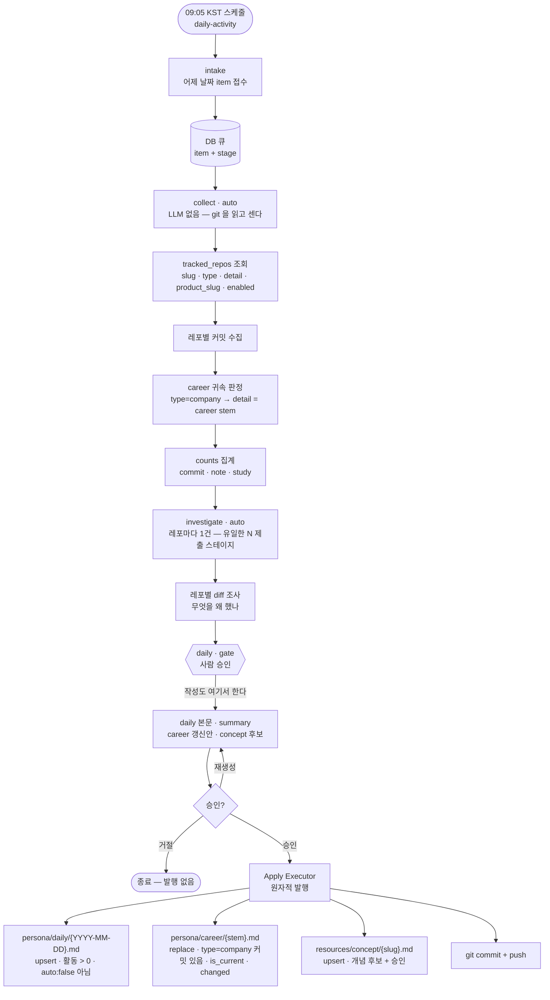
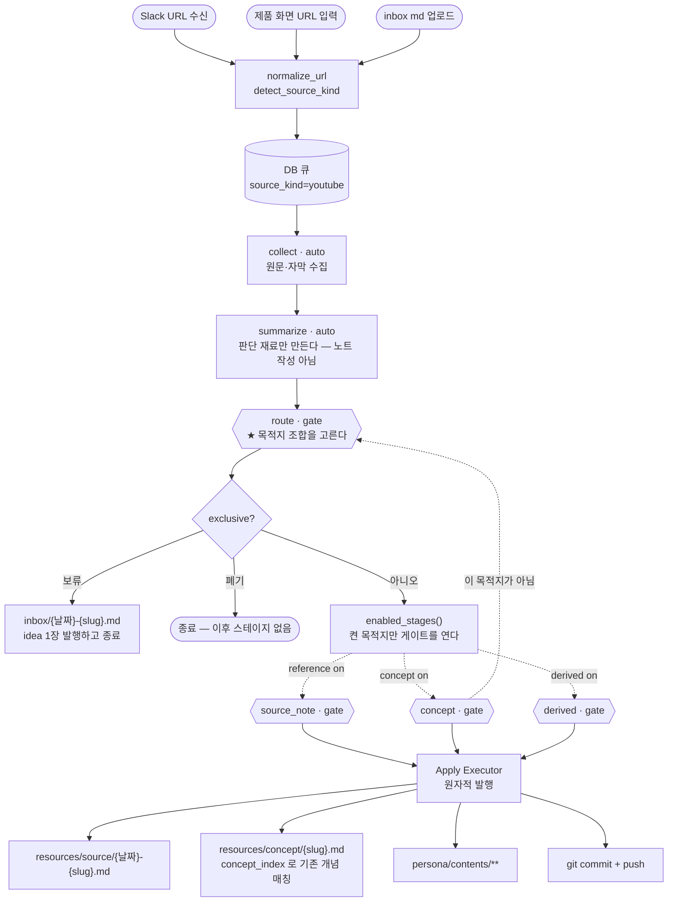
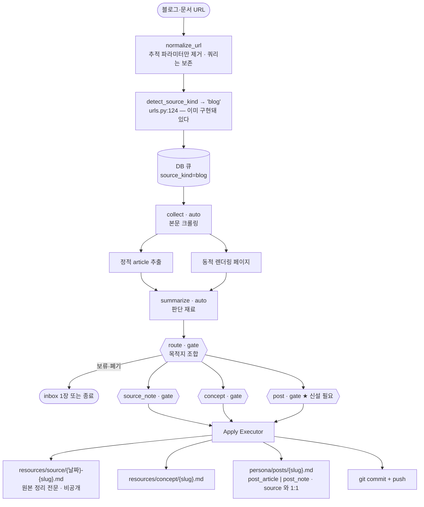
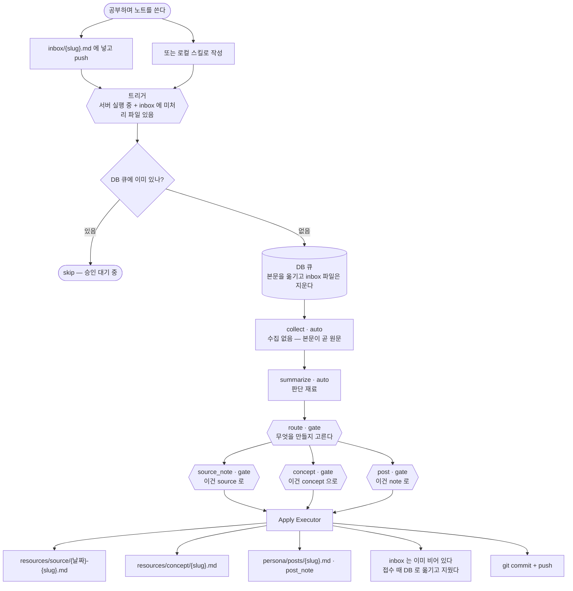

# 업데이트 라인 케이스 정리 — 서버 승인 게이트 · 로컬 작업

> 아직 결정하지 않은 날것의 입력이다. 정리보다 보존이 우선이다.

무엇이 어디로 들어와 어디에 앉는지를 **케이스별로** 늘어놓는다. [[decision-020-para-alignment-area-and-personal|KDEV-DEC-020]]이 자리(PARA)를 정했으니, 다음은 **그 자리로 가는 라인**이다.

## Raw

축이 둘이다.

```
서버(승인 게이트)   스케줄·외부 입력 → DB 큐 → 게이트 → 승인분만 발행
로컬(사람·에이전트) 직접 작성 → pre-commit 검사 → 커밋
```

### 확인된 사실

**입구는 `inbox/` 가 아니다.** [[decision-011-approval-gate-chain|KDEV-DEC-011]] D1 이 뒤집었다 —

> **승인 큐는 DB에 둔다.** 승인 전에는 레포에 파일이 생기지 않는다. …
> `**inbox/` 는 "보류함"으로 역할을 바꾼다** … 즉 `inbox/` 도 **하나의 목적지**이지 대기열이 아니다.

게이트 이전 구현(`render.py` 등)이 `inbox/` 로 직접 쓰고 있었으나 **지웠다** — 라이브 참조가 0이었고 KDEV-DEC-013 D2 가 이미 제거를 정해 둔 코드다.

## 케이스

### 서버 — 승인 게이트


| #   | 케이스     | 입구                            | 종착지                                                                                  | 상태      |
| --- | ------- | ----------------------------- | ------------------------------------------------------------------------------------ | ------- |
| 1   | 잔디잡     | **09:05 KST** 스케줄 → 접수 → DB 큐 | `persona/daily/` · `persona/career/{회사}` · `resources/concept/`                      | 돈다      |
| 2   | 유튜브 콘텐츠 | Slack URL·업로드 → DB 큐          | `resources/source/` · `resources/concept/` · `persona/contents/` · `inbox/`(보류) · 폐기 | 돈다      |
| 3 | 블로그 글 | URL → DB 큐 (`source_kind=blog`) | `resources/source/` · `resources/concept/` · `persona/posts/` | **판별만 됨** — 파이프라인 정의 없음 |


- 1은 **route 게이트가 없다** — 목적지가 고정이라 고를 것이 없다([[decision-015-grass-destinations-and-formats|KDEV-DEC-015]] D1).
- 2는 route 게이트가 **목적지 조합**을 고른다([[spec-008-gate-chain|KDEV-SPEC-008]]).

#### 1. 잔디잡 워크플로우




#### 2. 유튜브 콘텐츠 워크플로우



**잔디와 다른 점 넷.**

1. **입구가 사람이다.** Slack·화면 입력·업로드 셋 다 사람이 시작한다. 잔디만 스케줄이 시작한다.
2. **`route` 게이트가 체인 길이를 정한다.** `enabled_stages()` 가 켠 목적지만 뒤 게이트를 연다 — 아무것도 안 켜면 게이트가 없다.
3. **배타 옵션이 있다.** 보류(`inbox/` 1장 발행 후 종료)와 폐기(즉시 종료)는 뒤 게이트를 만들지 않는다.
4. **유일한 역방향 전이가 있다.** 뒤 게이트에서 「이 목적지가 아님」을 내면 `route` 가 재오픈된다. 자동 스테이지(수집·요약) 결과는 재사용한다 — 목적지 오판 때문에 자막을 다시 받지 않는다.

`summarize` 는 **판단 재료만** 만들고 **노트 작성은 게이트가 한다** — 잔디의 `daily` 게이트가 작성하는 것과 같은 대칭이다.

#### 3. 블로그 글 워크플로우

**유튜브와 파이프라인이 같다.** 다른 것은 `collect` 의 수집 방식과 종착지뿐이다.



**이미 있는 것.**

- `urls.py:124` 가 유튜브 아닌 http(s) URL 을 **`blog` 로 판별**한다. 정규화도 층을 나눠 뒀다 — 유튜브는 영상 ID 만 남기고, 블로그는 `?p=1`·`?p=2` 가 다른 글이라 쿼리를 보존한다.
- 수집 계약은 [[spec-012-source-collection-adapter|AXKG-SPEC-012]] 가 갖고 있다 — 정적 article·동적 렌더링·docx 텍스트 추출. **ax-knowledge-graph 에서 실제로 돌고 있는 구현**이다.
- 종착지 양식도 있다 — `templates/persona/post-article.md` · `post-note.md`.

**없는 것.**

- `PIPELINES` 에 `blog` 정의가 없다. `pipeline_for("blog")` → `None` — **판별은 되는데 태울 파이프라인이 없다.**
- `post` 목적지를 만드는 게이트 스테이지가 없다. `DESTINATION_STAGE` 는 `reference`·`concept`·`derived` 셋뿐이다.

**유튜브와 갈리는 지점 하나.**

유튜브는 `derived` 가 **교안**(`persona/contents/`)을 만들고, 블로그는 **공개 글**(`persona/posts/`)을 만든다. 둘 다 「자료를 사람이 읽을 것으로 바꾼 것」인데 산출이 다르다 — 교안은 학습용 장문이고 글은 핵심 압축이다.

### 로컬 — 사람·에이전트


| #   | 케이스        | 입구  | 종착지                                                                                | 상태      |
| --- | ---------- | --- | ---------------------------------------------------------------------------------- | ------- |
| 4   | product 작업 | 직접  | `products/{제품}/{00-baseline…70-runbook}` + 근거 개념이 없으면 `resources/{source,concept}` | 돈다      |
| 5 | 공부 노트 | `inbox/` 에 넣고 push (또는 로컬 스킬) → 감지 → DB 큐 | `resources/source/` · `resources/concept/` · `persona/posts/`(`post_note`) | **미구현** |


- 4는 pre-commit 이 강제한다 — decision 의 `up:`·「근거 개념」 절, 그래프 L1~L6.

#### 5. 공부 노트 워크플로우

**입구가 `inbox/` 인 유일한 케이스다.** 나머지는 URL·스케줄이 시작한다.



**유튜브·블로그와 다른 점.**

- **수집 단계가 없다.** URL 이 아니라 본문이 이미 있다 — `collect` 가 할 일이 없거나 아주 얇다. AXKG 가 업로드 md 를 두고 「`raw_text` 가 곧 원문이므로 adapter 를 거치지 않는다」고 정한 것과 같은 자리다([[spec-012-source-collection-adapter|AXKG-SPEC-012]] 경계).
- **`inbox/` 는 입구다 — 목적지가 아니다.** [[decision-011-approval-gate-chain|KDEV-DEC-011]] D1 이 「보류함(목적지)」으로 정한 것을 뒤집는다(아래 「DEC-011 D1 개정」).
- **트리거가 파일 존재다.** 스케줄(잔디)도 URL 수신(유튜브·블로그)도 아니다. **FastAPI 시작 프로세스(lifespan)** 에서 `inbox/` 를 스캔한다 — push 로 파일이 들어온 뒤 서버가 뜨면 집는다.
- **`inbox/` 는 서버에서 항상 비어 있다.** 접수할 때 본문을 DB 큐로 옮기고 파일을 지운다 — **파일이 있으면 곧 미처리**다. 승인 전 초안이 DB 에만 있는 것은 [[decision-012-draft-storage-and-publish-boundary|KDEV-DEC-012]] D1 그대로다.
- **비우기는 정상 경로이고, 방어선은 큐 조회다.** 접수 전에 DB 큐를 보고 **이미 있으면 skip** 한다 — 승인이 늦어 큐에 머무는 동안 같은 파일이 다시 push 돼도 두 번 접수되지 않는다. [[idempotency]] 그대로이고, 잔디의 「email 기준 멱등」·Drive 의 `drive_file_id` unique 와 같은 자리다. 자연키는 **파일명(slug)** 이다 — `inbox/` 가 접수 때 비워지므로 같은 경로의 재등장이 곧 같은 노트다.

## Context

[[decision-020-para-alignment-area-and-personal|KDEV-DEC-020]] 이 자리를 정했다.

```
정체성  context/kknaks.md      회사 · 여름별컴퍼니 · 개인
작업    P products/  ·  R resources/  ·  이력 persona/daily/
귀결    A persona/   career · posts · showcase · profile
```

각 케이스의 종착지가 이 배치의 어디에 앉는지가 정리의 기준이다.

## Why It Matters

**같은 자리에 두 축이 쓴다.** `resources/concept/` 는 케이스 1·2·4·5 넷이 모두 쓰고, `persona/` 는 1·3이 쓴다. 축마다 다른 규칙으로 쓰면 같은 디렉토리가 두 모양이 된다.

그리고 **비어 있는 칸이 드러난다** — 3·5가 미구현이고, 그 둘이 각각 「R → 글」과 「배움 → 개념」이라 **개인 영역의 산출 경로 둘이 다 비어 있다.**

## Possible Direction

아직 결정은 아니지만 가능한 방향.

- (비워 둠 — 케이스별로 채운다)

## 미결

**닫힌 것** (2026-08-11 사용자 확정)

| ID | 질문 | 결론 |
|---|---|---|
| ~~OQ-3~~ | `persona/posts/` 를 누가 만드나 | **게이트**. 블로그(3)와 공부 노트(5)가 만든다 |
| ~~OQ-4~~ | 공부 노트가 게이트를 타나 | **탄다.** `inbox/` 에 넣고 push 하면 감지 → 큐 |
| ~~OQ-5~~ | 유튜브도 posts 를 만드나 | **아니다.** 유튜브는 **콘텐츠**(교안)다 |
| ~~OQ-6~~ | 수집 어댑터 경계 | **정적 → 동적 → 안 되면 최종 실패** |
| ~~OQ-7~~ | `inbox/` 의 두 역할 | **입구 하나다.** 목적지가 아니다 — 아래 「DEC-011 D1 개정」 참조 |
| ~~OQ-8~~ | 트리거 감지 | **FastAPI 시작 프로세스**(lifespan)에서 스캔한다. push 로 파일이 들어온 뒤 서버가 뜨면 집는다 |
| ~~OQ-9~~ | `source_kind` 이름 | URL 이 없으면 **실패**다. 공부 노트는 URL 축이 아니므로 `detect_source_kind` 를 거치지 않고 별도 kind 를 쓴다 |
| ~~OQ-1~~ | `render.py` 의 `inbox/` 직접 쓰기 | **잔재였다. 지웠다.** KDEV-DEC-013 D2 가 없애기로 한 3단(`atomic_write`+`publish`+`reload_data`)이 코드에 남아 있었다 — `bootstrap` 은 이미 `QueueIntakeRunner` 를 조립하고 있어 라이브 참조가 0이었다 |
| ~~OQ-2~~ | 게이트가 `products/` 를 만드나 | **만들 수 없다.** `ALLOWED_PREFIXES` 에 `products/` 가 없어 발행이 거부되고, `DESTINATION_STAGE` 에도 항목이 없다. 자료(유튜브·블로그)에서 제품 문서가 나올 일도 없다 — **P 는 로컬만 만든다** |
| ~~OQ-11~~ | 접수 멱등의 자연키 | **파일명(slug)**. `inbox/` 는 접수 때 비워지므로 **같은 경로가 다시 나타나면 같은 노트를 다시 넣은 것**이다 |
| ~~OQ-10~~ | 「미처리」를 무엇으로 판정하나 | `inbox/` 는 서버에서 **항상 비어 있는 상태**를 유지한다(접수 때 DB 로 옮기고 지운다). 그리고 접수 전에 **DB 큐를 조회해 이미 있으면 skip** 한다 — 승인이 늦어 큐에 머무는 동안 같은 파일이 다시 push 돼도 겹치지 않는다 |

### DEC-011 D1 개정이 필요하다

[[decision-011-approval-gate-chain|KDEV-DEC-011]] D1 이 이렇게 정했다 —

> **`inbox/` 디렉토리는 "보류함"으로 역할을 바꾼다.** 경로 게이트에서 *"지금은 정제 못 하겠지만 버리긴 아깝다"* 로 승인된 idea 만 들어간다. 즉 **`inbox/` 도 하나의 목적지**이지 대기열이 아니다.

**입구 하나로 가면 그 반대가 된다.** 따라오는 변경 셋:

1. route 게이트의 목적지 목록에서 **「inbox 보류」를 뺀다** — 배타 옵션이 「폐기」 하나만 남는다.
2. `inbox/README.md` 의 「보류함」 규정을 **「입구」로** 고친다.
3. 지금 있는 4건(`type: idea` 3건 + frontmatter 없는 1건)의 처리를 정한다 — `inbox/` 가 **항상 비어 있어야** 하므로 그대로 둘 수 없다. 입구로 다시 태우거나 목적지로 내보내야 한다.
4. **접수가 파일을 지우므로 커밋이 하나 더 생긴다.** 서버가 `inbox/` 를 비우고 그것을 push 해야 로컬 작업트리도 비워진다 — 발행 커밋과 별개의 쓰기가 하나 더 생긴다.

**열린 것**

| ID | 질문 |
|---|---|

