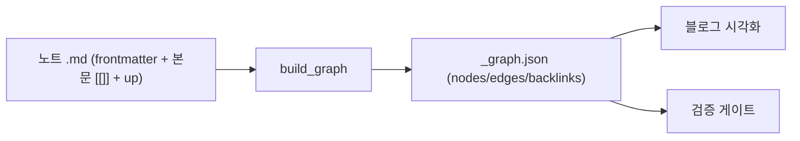

# 그래프 스키마 — 노드·식별자·엣지·빌더 산출물

지식그래프의 노드/엣지/식별자 규약과 빌더 산출물(`_graph.json`)의 외부 계약. 작성자·빌더·시각화가 이 문서를 단일 기준으로 따른다. medi_docs 구 spec-02(wikilinks)/spec-04(persona-map)를 계승한다.

> v0.0.4 — [[decision-019-drop-synthesis-layer|KDEV-DEC-019]] 반영. **판단층(`synthesis`/`permanent`)을 폐기**하고 지식층을 `source → concept → execution` 3층으로 줄인다.
>
> v0.0.3 — [[decision-010-knowledge-graph-four-layers|KDEV-DEC-010]] 반영. `layer` 축 도입, `concept` 타입 추가, **rank 비교 방향 반전**, `note` 제거, `up:` 생성 의무. §7의 미해소 OPEN 2건(products 문서 포함 여부 · lineage 0건) 해소.

## 1. Context

### Meta

- Decision reference: [[decision-003-node-type-and-identifier|KDEV-DEC-003]], [[decision-004-edge-model-and-schema|KDEV-DEC-004]], [[decision-010-knowledge-graph-four-layers|KDEV-DEC-010]]
- Baseline reference: [[baseline-001-repo-knowledge-graph|KDEV-BL-001]], [[baseline-003-inbox-approval-pipeline|KDEV-BL-003]]
- Domain note: node `type` enum, 파생 축 `layer`, edge `type` = `assoc`|`lineage`, `dir`. DB 없음 — 파일 frontmatter가 SoT.
- Open questions: §7

### Business Requirement

노트 간 관계를 기계가 파싱해 그래프로 조립하려면, 식별자·링크 문법·관계 종류가 단일 규약이어야 한다. 옵시디언(순정)과 블로그 빌더가 같은 데이터를 읽는다.

여기에 더해 **관계의 방향이 지식의 성장 방향과 일치**해야 한다. 자료에서 개념이 나오고, 개념에서 판단이 서고, 판단이 제품으로 내려간다. `layer`는 그 방향을 기계가 판정할 수 있게 하는 축이다.

### Scope

In scope: 노드 식별자, frontmatter 필수 필드, `layer` 도출과 rank, 엣지 문법(본문 `[[]]` + `up:` 오버레이), `_graph.json` 외부 형태.
Out of scope: 빌더 함수 구현(work), 검증 규칙([[spec-004-graph-validation|KDEV-SPEC-004]]), 렌더([[spec-005-graph-visualization|KDEV-SPEC-005]]), 디렉토리-층 매핑([[spec-001-directory-structure|KDEV-SPEC-001]]).

## 2. UX Contract

해당 없음.

## 3. User Scenario

### S-1. 작성자 — 노트를 다른 노트에 연결

1. 연상 연결이면 본문에 `[[파일명-stem]]`을 적는다 (옵시디언 그래프에 표시됨, 엣지 type=`assoc`).
2. "이 노트가 무엇을 기반으로 했는지"(계보)면, 본문에 `[[stem]]`을 적고 **추가로** frontmatter `up: [stem]`에 그 stem을 넣는다 (엣지 type=`lineage`, 방향=상류→이 노트).
3. id로 링크하고 싶으면 `[[KDEV-SPEC-001]]`처럼 쓴다 — 대상의 `aliases`에 id가 있으면 resolve.

`up:` 대상은 **자기 층과 같거나 낮은 층**이어야 한다(§4 rank). concept는 reference를, 제품 문서는 concept를 가리킨다.

### S-2. 빌더 — 그래프 조립

1. 모든 노트의 frontmatter + 본문을 읽는다.
2. `type`에서 `layer`를 도출한다 (§4 — frontmatter에 `layer`를 적지 않는다).
3. 본문 `[[stem]]`·`[[stem|alias]]`·`[[folder/stem]]`을 엣지로 추출 (기본 `assoc`).
4. `up:`에 있는 stem은 해당 엣지를 `lineage` + 방향으로 마킹.
5. 노드(`layer` 포함)·엣지·백링크를 `_graph.json`으로 산출.

### S-3. 파이프라인 — 지식 노트를 생성

1. 승인 게이트가 발행하는 concept 노트는 **`up:`을 반드시 채운다.**
2. `up:`에 넣은 stem은 본문 `[[]]`에도 넣는다 (오버레이 전제 — L3).
3. concept는 `aliases`도 반드시 채운다 (개념 중복 생성 방지 — §5).
4. 이 중 하나라도 빠지면 Apply Executor가 발행을 거부한다([[decision-012-draft-storage-and-publish-boundary|KDEV-DEC-012]] D6).

> 라이브 lineage 엣지가 1건뿐이던 원인은 규칙 부재가 아니라 **생성기 부재**였다 — `service/knowledge_capture/render.py`가 만드는 frontmatter에 `up` 필드가 아예 없었다. 규칙만 있고 그 규칙을 따르는 생성 경로가 없으면 계보는 발현되지 않는다.

## 4. Interface Contract

### Data Contract — 노드 (frontmatter)

| 필드 | 필수 | 설명 |
|---|---|---|
| `id` | ✓ | 전역 유일. `{PRODUCT}-{TYPE}-{NNN}` 등 prefix 형태 (예: `KDEV-SPEC-002`) |
| `type` | ✓ | 아래 type enum 중 하나. `layer`는 여기서 도출된다 |
| `aliases` | type별 | `[[id]]`·`[[다른 이름]]` resolve용. **`concept`는 필수**, 그 외는 선택 |
| `up` | type별 | lineage 상류 stem 리스트 (본문 `[[]]`의 부분집합). **`concept`는 필수**, `idea`는 금지 |
| `source` | 선택 | 외부 자료 URL (노드 아님, 속성) |

- **식별자 = 파일명 stem** (옵시디언이 `[[X]]`를 파일명/aliases로 resolve). 전역 유일.
- **`layer`는 frontmatter에 적지 않는다.** `type`에서 도출 가능한 파생값이라 적어두면 어긋난다. 빌더가 계산해 `_graph.json`에 담는다.

### Data Contract — type enum과 layer 도출

| 구분 | `layer` | rank | `type` |
|---|---|---|---|
| 지식 층 | `source` | 1 | `reference` |
| | `concept` | 2 | `concept` |
| | `execution` | 4 | `baseline` · `decision` · `spec` · `work` · `release` · `runbook` · `bugfix` |
| 노드이되 층 없음 | `null` | — | `idea` |
| 그래프 밖 (노드 아님) | — | — | `content` · `algorithm` · `daily` · `career` · `profile` |
| 보류 | — | — | `post` |

- `note`는 **제거**한다. WORK-005에서 `persona/notes/` 157개가 `reference/`로 전량 재타이핑되어 실사용이 0건이다.
- `product`는 `products/{제품}/showcase.md`를 가리키는데 빌더가 이미 그래프에서 제외한다(WORK-004). type enum에서 정리한다.
- `idea`는 **노드이지만 층이 없다.** 본문 `[[]]`로 다른 노트를 참조할 수 있어 엣지는 생기지만, 휘발이라 상류가 될 수 없고 `up:`을 가질 수 없다.
- `post`는 디렉토리 미존재·실 발행물 0건이라 층 배정을 보류한다([[decision-010-knowledge-graph-four-layers|KDEV-DEC-010]]).

### Data Contract — rank와 `up:` 방향

`rank`는 `layer`에서 나오며 **지식의 성장 방향**을 뜻한다. `up:` 타겟의 rank는 **자기 rank보다 작거나 같아야** 한다 — 즉 상류(출처 방향)만 가리킨다.

```text
source(1) → concept(2) → execution(3)
             up: 은 이 화살표의 역방향만 허용
```

| 노트 | `up:` 대상 | 판정 |
|---|---|---|
| `concept`(2) | `reference`(1) | 1 ≤ 2 ✓ |
| `baseline`(3) | `concept`(2) | 2 ≤ 3 ✓ |
| `reference`(1) | `concept`(2) | 2 > 1 ✗ — 자료가 개념을 기반으로 할 수 없다 |
| `idea` | 무엇이든 | ✗ — 휘발은 상류를 가질 수 없다 |

> **구현 주의 — 현행 코드와 비교 방향이 반대다.** `core/graph.py:34`의 현행 규칙은 *"높을수록 상류, `up` 타겟 rank >= source rank"*이고 `reference = 4`(최상류), `idea = 0`이다. 새 모델은 rank를 **파이프라인 진행 순서**로 쓰므로 `reference = 1`이 되고 비교가 `<=`로 뒤집힌다. **rank 테이블만 갈아끼우면 L4가 조용히 반대로 동작한다** — 비교 연산자까지 함께 바꿔야 한다.

실행층 내부 순서(`baseline → decision → spec → work`)는 이 rank가 관리하지 않는다. 층 rank는 **층간 방향만** 강제하고, 제품 문서 내부 정합은 `rules/product-doc-pipeline.md`와 `product_doc_pipeline.py`가 계속 담당한다.

### Data Contract — 엣지

| 필드 | 값 |
|---|---|
| `source` | 출발 노드 stem |
| `target` | 도착 노드 stem |
| `type` | `assoc`(본문 `[[]]`) \| `lineage`(`up:`로 마킹) |
| `dir` | lineage는 상류→하류 방향. assoc는 무방향 |

### Data Contract — `_graph.json` (외부 산출물 형태)

```json
{
  "nodes": [{ "id": "<stem>", "type": "concept", "layer": "concept", "title": "...", "archived": false }],
  "edges": [{ "source": "<stem>", "target": "<stem>", "type": "assoc|lineage", "dir": "up|null" }],
  "backlinks": { "<stem>": ["<stem>", "..."] }
}
```
- **확정**(WORK-001, abcfbc4): 위 필드가 빌더 산출물의 외부 계약이다. `edges[source,target,type,dir]`(assoc는 `dir=null`, lineage는 `dir="up"`) / `backlinks{stem:[source-stem]}`. 검증 함수 시그니처 = `validate_graph(nodes, duplicate_stems=None) -> list[{rule,level,node,detail}]`.
- **v0.0.3 추가**: `nodes[]`에 **`layer`** 필드가 들어간다(`source`/`concept`/`execution`, `idea`는 `null`). frontmatter에는 없고 빌더가 `type`에서 계산해 담는다 — 소비자(트리 렌더러의 층 필터, 검증기의 층별 orphan 판정)가 매번 매핑을 다시 구현하지 않게 하기 위함이다.

### Flow



## 5. Implementation Rules

- 링크 문법: 본문 `[[stem]]` / `[[stem|alias]]` / `[[folder/stem]]` 모두 동일 stem으로 resolve.
- `up:`의 stem은 반드시 본문 `[[]]`에도 존재 (오버레이 전제 — 검증 L3).
- 출처 URL은 `source:` 속성, 노드로 만들지 않는다.
- **노드 집합 = frontmatter `type` 보유 문서 전체**(T-021 실측, v0.0.2): 빌더 `_build_graph_nodes`는 type 보유 문서를 노드화하므로, 지식층(reference 등) 외에 **products 개발문서**(spec/decision/work/baseline/release/runbook/bugfix)도 그래프 노드로 들어온다. **이는 의도된 범위다**(v0.0.3 확정) — 제품 문서는 4층의 `execution`이며, "이 개념을 어느 제품에 적용할지"를 찾는 경로가 `concept → execution` 연결이다([[decision-010-knowledge-graph-four-layers|KDEV-DEC-010]] D6). 다만 제품 문서 내부 링크가 지식 연결을 수적으로 압도하므로(2026-07-27 실측 406노드 중 248), 열람 표면은 `layer` 필터로 뷰를 나눈다([[spec-005-graph-visualization|KDEV-SPEC-005]]).
- 기존 평문 `links: [id]`는 폐기 → 본문 `[[]]` 또는 `up:`으로 흡수. 단 `products/**` 문서의 frontmatter `links:`는 제품 문서 파이프라인이 소유하는 별개 계약이다(`rules/product-doc-pipeline.md`).

### concept 규약

- **`aliases` 필수.** 같은 개념의 다른 이름을 모두 등록한다 (`stt` → `[Speech-to-Text, 음성인식, ASR]`). alias 인덱스가 이를 canonical stem으로 해소하므로, 새 자료가 "음성인식"으로 들어와도 기존 `stt` 노트를 찾아 **보충**할 수 있다.
- `aliases`가 없으면 같은 개념이 `stt.md`·`speech-to-text.md`로 갈라지고 SoT가 둘이 된다. 이것이 concept에만 `aliases`를 필수로 두는 이유다.
- alias 충돌(같은 키가 서로 다른 stem 둘을 가리킴)은 L2 위반이다([[spec-004-graph-validation|KDEV-SPEC-004]]).
- **`up:` 필수.** concept는 자신이 나온 출처(`reference`)를 가리킨다. 출처 없는 개념은 성립하지 않는다.
- 개념 보충 시 새 출처를 `up:`과 본문 `[[]]` 양쪽에 추가한다.
- **alias 인덱스**(WORK-001 확정): frontmatter `aliases` + frontmatter `id` + 파일명 stem 자기참조 → canonical stem으로 resolve. 전체 노드 집합이 필요하므로 `core/graph.py`의 `build_alias_index`에서 구성.
- **code-fence 스킵**(WORK-002 확정, 0014790): 빌더는 fenced(` ``` `)·inline(`` ` ``) 코드 영역 내 `[[]]`를 엣지에서 제외한다. 문법 설명용 prose 예시(코드블록·인라인 코드 안의 `[[stem]]`)는 링크가 아니다. 추출 직전 코드 영역을 공백 치환(경계 보존) 후 `[[]]` 파싱 — `extract_wikilinks()` 단일 지점이라 build/knowledge/validate 전부 동일 적용.
- 빌더 regex 패턴 세부는 work(구현)에 둔다.

## 6. Verification

### Acceptance Criteria

- [ ] 본문 `[[stem|alias]]`·`[[folder/stem]]`이 모두 엣지로 잡힌다.
- [ ] `up:` 타겟이 `lineage`+방향으로 마킹된다.
- [ ] `[[id]]`가 aliases로 resolve된다.
- [ ] `_graph.json`에 nodes/edges(type,dir)/backlinks가 포함된다.
- [ ] `_graph.json`의 `nodes[]`에 `layer`가 포함되고, frontmatter에는 `layer`가 없다.
- [ ] `type`이 같으면 `layer`도 항상 같다 (도출이 결정적).
- [ ] `type: note`가 enum에서 제거되고, 남은 데이터가 없다.
- [ ] `concept` 노트가 `aliases`와 `up:`을 모두 갖는다.
- [ ] `[[음성인식]]`처럼 alias로 링크해도 canonical concept stem으로 resolve된다.
- [ ] `up:` 타겟의 rank가 자기 rank보다 크면 L4 위반으로 잡힌다 (`reference → concept` 방향 금지).
- [ ] `idea`가 `up:`을 가지면 L4 위반으로 잡힌다.

## 7. Open Questions

- ~~(구현 OQ, work) `_graph.json` 최종 필드명·빌더 함수 시그니처·regex 패턴.~~ **해소(WORK-001, abcfbc4)** — §4 확정 필드·시그니처 참조.
- ~~(구현 OQ, work) aliases 인덱스 구현 방식.~~ **해소(WORK-001)** — §5 `build_alias_index`(aliases+id+stem 자기참조).
- ~~(OPEN, WORK-002) code-fence/inline-code 내 `[[]]` 스킵 — 빌더 스킵 vs 문서 예시 escape 택일.~~ **해소(WORK-002, 0014790)** — §5 확정: 빌더가 fenced·inline 코드 영역 내 `[[]]`를 엣지에서 제외(빌더 스킵 채택). probe L1 12→0.
- ~~(OPEN, T-021 박제) products 개발문서 type이 그래프 노드에 포함됨 — 의도된 범위인지 제외할지.~~ **해소([[decision-010-knowledge-graph-four-layers|KDEV-DEC-010]] D6, v0.0.3)** — **포함이 의도된 범위다.** 제품 문서 = 4층의 `execution`이고, `concept → execution` 연결이 "이 개념을 어느 제품에 적용할지"를 찾는 경로다. 수적 압도는 `layer` 필터로 뷰를 나눠 해결한다([[spec-005-graph-visualization|KDEV-SPEC-005]]).
- ~~(OPEN, T-021 박제) lineage 엣지 0건 — 의도인지 빌더 결함인지.~~ **해소([[decision-010-knowledge-graph-four-layers|KDEV-DEC-010]] D4, v0.0.3)** — **빌더 결함도 의도도 아닌 생성기 부재다.** `service/knowledge_capture/render.py`가 만드는 frontmatter에 `up` 필드가 없어서 AI 캡처가 계보를 만들 방법이 구조적으로 없었다(라이브 lineage 1건 = 사람이 손으로 쓴 `permanent` 1개). §3 S-3의 생성 의무와 Apply Executor 거부 규칙으로 해소한다.
- **(OPEN)** concept의 입도 — "STT" 하나로 둘지 "STT / 스트리밍 ASR / VAD"로 쪼갤지. 너무 잘게 쪼개면 개념이 성장하지 않고 너무 크면 SoT가 흐려진다. 유튜브 파이프라인 첫 실전에서 관찰 후 규칙화한다([[decision-010-knowledge-graph-four-layers|KDEV-DEC-010]] OQ-2).
- **(OPEN)** 제품 문서 중 `work`·`release`·`runbook`까지 `execution` 노드로 둘지, `baseline`/`decision`/`spec`까지만 둘지([[decision-010-knowledge-graph-four-layers|KDEV-DEC-010]] OQ-3).
