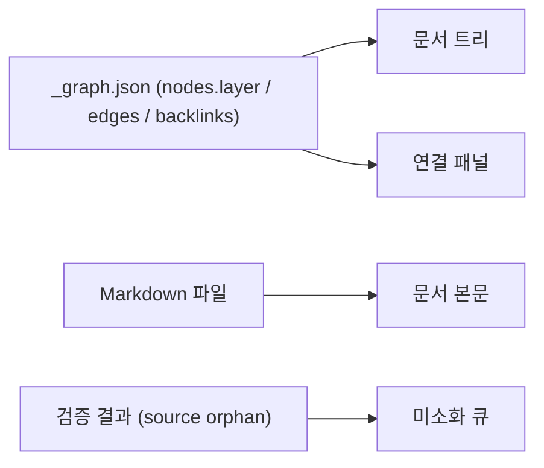

# 지식 열람 표면 — 트리 문서 렌더러와 공개 경계

쌓인 지식을 **디렉토리 트리 + 본문 렌더**로 읽는다. 내부 지식(reference·concept·permanent)은 admin 전용이고, 공개 블로그에는 게시 판정을 통과한 것만 나간다.

> v0.0.3 — [[decision-010-knowledge-graph-four-layers|KDEV-DEC-010]] D7 반영. **force-directed 그래프 시각화를 폐기하고 트리 문서 렌더러로 전환**한다. [[decision-007-blog-graph-visualization|KDEV-DEC-007]]의 시각화 방식 결정을 대체하며, "지식 연결을 볼 수 있어야 한다"는 목적은 유지한다. §7의 미해소 OPEN 2건을 해소한다.

> v0.0.4 — [[decision-018-resources-layout-and-sot-naming|KDEV-DEC-018]] 반영. 트리 경로를 `resources/{source,concept,synthesis}/` 로 바꿨다. **렌더 규칙은 무변경** — 트리는 디렉토리를 그대로 비추므로 폴더가 바뀌면 따라간다.

## 1. Context

### Meta

- Decision reference: [[decision-007-blog-graph-visualization|KDEV-DEC-007]](대체됨), [[decision-010-knowledge-graph-four-layers|KDEV-DEC-010]] D7
- Baseline reference: [[baseline-001-repo-knowledge-graph|KDEV-BL-001]], [[baseline-003-inbox-approval-pipeline|KDEV-BL-003]]
- Domain note: 입력 = [[spec-002-graph-schema|KDEV-SPEC-002]]의 `_graph.json`(`nodes[].layer` 포함). 권한 = admin(내부 지식) / 공개(게시분).
- Open questions: §7

### Business Requirement

force-directed 그래프는 **탐색 도구로 작동하지 않았다.** 실측(2026-07-27)에서 확인된 것:

- 노드 406개 중 248개(61%)가 제품 개발문서다. 지식 연결이 시각적으로 파묻힌다.
- 엣지 427개 중 **lineage가 1개**다. 방향성을 보여주는 화살표가 사실상 없다.
- `reference` 157개 대부분이 orphan이라 화면 가장자리에 흩뿌려진다.

즉 "지식이 어떻게 이어지는지 한눈에 본다"는 원래 목적이 데이터 상태와 무관하게 달성되지 않는다. 필요한 건 **읽기**다 — 무엇이 쌓여 있는지 훑고, 하나를 골라 본문을 읽고, 거기서 연결된 것으로 건너가는 것.

동시에 **공개 경계**가 필요하다. `reference`·`concept`·`permanent`는 사고 과정이자 내부 지식이라 블로그에 그대로 노출할 대상이 아니다. 공개는 게시 판정을 통과한 것만이다.

### Scope

In scope: 내부 열람 표면(트리 + 본문 렌더 + 연결), `layer` 필터, 미소화 큐 노출, 공개/내부 경계.
Out of scope:
- `_graph.json` 산출([[spec-002-graph-schema|KDEV-SPEC-002]])
- 검증 규칙([[spec-004-graph-validation|KDEV-SPEC-004]])
- 게시 판정 게이트 자체 — 승인 파이프라인 spec 소관
- 문서 쓰기 조작(생성·이동·이름변경·삭제) — 발행은 Apply Executor만 한다
- 컴포넌트 파일·라우트 경로(work)

## 2. UX Contract

### Placement

내부 열람은 admin 영역의 신규 화면이다. 좌측 트리 + 우측 본문의 2단이며, 좁은 폭에서는 트리↔본문 전환형이다.

```text
+──────────────────────────────────────────────────+
│ admin 헤더 / 사이드바                             │
+──────────────┬───────────────────────────────────+
│ 문서 트리    │ 문서 본문                          │
│              │                                    │
│ resources/   │  # STT (Speech-to-Text)            │
│  ├ source/   │  ...본문 렌더...                   │
│  ├ concept/  │                                    │
│  └ synthesis/│  ── 연결 ────────────────────      │
│              │  상류(up:) · 인용 · 백링크         │
│ products/    │                                    │
│ archive/     │                                    │
+──────────────┴───────────────────────────────────+
│ [전체] [source] [concept] [synthesis] [execution] │
+──────────────────────────────────────────────────+
```

### U-1. 문서 트리

- **상태**: 정상(디렉토리 계층) · 로딩 · 빈(문서 0) · 필터 적용됨
- **문구**: 디렉토리명, 문서 제목, 층 배지. 미소화 큐 개수(`source` 층 헤더에 표시)
- **CTA**: 디렉토리 접기/펴기, 문서 선택, `layer` 필터 토글
- **기대 결과**: 디렉토리 구조 그대로 트리가 그려진다. 문서를 고르면 우측에 본문이 렌더된다. 필터를 걸면 해당 층 문서만 남는다. `archived` 문서는 기본 숨김이며 토글로 볼 수 있다.

### U-2. 문서 본문

- **상태**: 선택 없음 · 정상 · 로딩 · 문서 없음(경로 무효)
- **문구**: 제목, frontmatter 요약(층·`aliases`·출처 URL·갱신 시각), Markdown 본문
- **CTA**: 본문 내 `[[stem]]` 클릭 → 해당 문서로 이동
- **기대 결과**: Markdown이 렌더되고 wikilink가 트리 내 이동 링크로 동작한다. **읽기 전용이다** — 이 화면에서 문서를 고치지 않는다.

### U-3. 연결 패널

- **상태**: 연결 있음 · 연결 없음(고립)
- **문구**: `상류(up:)` · `인용(본문 [[]])` · `백링크(이 문서를 가리키는 것)` 세 묶음. 각 항목에 대상 층 배지
- **CTA**: 항목 클릭 → 이동
- **기대 결과**: 그래프 캔버스 대신 **목록**으로 연결을 보여준다. 방향이 세 묶음으로 이미 구분돼 있어 화살표 없이 관계가 읽힌다. 연결이 없으면 "아직 연결되지 않음"과 함께 그 층에서 그게 무슨 뜻인지 안내한다(`reference`면 "아직 개념으로 정리되지 않은 자료").

### U-4. 미소화 큐

- **상태**: 항목 있음 · 비어 있음
- **문구**: "개념으로 정리되지 않은 자료 N건"
- **CTA**: 항목 선택 → 본문으로 이동
- **기대 결과**: [[spec-004-graph-validation|KDEV-SPEC-004]]의 `source` 층 orphan 집계를 그대로 보여준다. 이 목록이 "다음에 뭘 정제할까"의 작업 목록이 된다.

### U-5. 공개 프론트

- **상태**: 게시분 있음 · 없음
- **문구**: 기존 공개 페이지의 문구를 따른다
- **CTA**: 기존과 동일
- **기대 결과**: **`reference`·`concept`·`permanent`는 공개 프론트에 노출되지 않는다.** 게시 판정을 통과한 것만 나간다.

## 3. User Scenario

### S-1. owner — 쌓인 지식 훑기

1. admin에서 열람 화면에 들어간다.
2. 트리에 `resources/{source,concept,synthesis}/`·`products/`가 디렉토리 구조대로 보인다.
3. `layer` 필터를 `concept`로 건다 → 개념 노트만 남는다.
4. 하나를 고르면 우측에 본문이 렌더되고, 하단 연결 패널에 상류(출처 reference)·백링크(이 개념을 쓰는 permanent)가 목록으로 뜬다.

### S-2. owner — 개념에서 제품으로 건너가기

1. `resources/concept/stt.md`를 연다.
2. 연결 패널의 백링크에서 `execution` 배지가 붙은 항목을 본다 — 이 개념을 근거로 삼은 제품 문서다.
3. 클릭해 이동한다. "이 개념을 어디에 적용했는지"가 한 번에 확인된다.

### S-3. owner — 다음에 정제할 자료 찾기

1. 미소화 큐를 연다 — 개념으로 올라가지 않은 `reference` 목록이다.
2. 하나를 골라 본문을 읽는다.
3. 승인 파이프라인에 태우거나 직접 concept를 쓴다(이 화면은 읽기 전용이므로 여기서 쓰지 않는다).

### S-4. 방문자 — 공개 블로그

1. 공개 사이트에서 게시된 글·콘텐츠를 본다.
2. `reference`·`concept`·`permanent`는 **보이지 않는다.**

## 4. Interface Contract

### API Contract

| Method | Path | 요약 | 권한 |
|---|---|---|---|
| GET | 문서 트리 조회 | 층·경로·제목·archived 여부 목록 | admin |
| GET | 문서 본문 조회 | 지정 경로의 Markdown 본문 + frontmatter 요약 | admin |
| GET | 연결 조회 | 상류(`up:`) · 인용 · 백링크 | admin |
| GET | 미소화 큐 조회 | `source` 층 orphan 목록 | admin |

경로·응답 schema 세부는 work에 둔다.

### Data Contract

입력은 [[spec-002-graph-schema|KDEV-SPEC-002]]의 `_graph.json`이다. v0.0.3에서 `nodes[]`에 **`layer`**가 포함되므로, 이 화면은 층 매핑을 자체 구현하지 않고 그 값을 그대로 소비한다.

| 표시 요소 | 출처 |
|---|---|
| 트리 계층 | 문서 경로 |
| 층 배지 | `nodes[].layer` |
| 본문 | Markdown 파일 |
| 상류 | `edges[type=lineage, dir=up]` |
| 인용 | `edges[type=assoc]` |
| 백링크 | `backlinks` |
| 미소화 큐 | [[spec-004-graph-validation|KDEV-SPEC-004]] `source` orphan 집계 |

### Case Matrix

| 에러 코드 | 백엔드 출력 | 프론트 출력 | 표시 위치 |
|---|---|---|---|
| `DOC_NOT_FOUND` | 경로에 문서 없음 | 문서를 찾을 수 없습니다. | 문서 본문 |
| `PATH_NOT_ALLOWED` | 열람 허용 범위 밖 경로 | 열람할 수 없는 경로입니다. | 문서 본문 |
| `UNAUTHORIZED` | 세션 없음/만료 | 로그인이 필요합니다. | 화면 전체 |

### Flow



### State / Lifecycle

해당 없음 (읽기 전용 표면).

## 5. Implementation Rules

- **force-directed 그래프 캔버스를 두지 않는다.** 전역 `/graph`와 노트별 로컬 그래프 모두 폐기하고, 연결은 U-3 목록으로 대체한다. 관계 방향은 화살표가 아니라 `상류 / 인용 / 백링크` 세 묶음으로 표현한다.
- 트리는 **디렉토리 구조 그대로** 그린다. 층은 디렉토리에서 도출되므로([[spec-001-directory-structure|KDEV-SPEC-001]]) 별도 그룹핑을 만들지 않는다.
- `layer` 필터는 `nodes[].layer`를 그대로 쓴다. 제품 문서(`execution`)는 노드에 **포함되지만** 기본 필터에서 접어둘 수 있다 — 수적으로 지식 연결을 압도하기 때문이다.
- **읽기 전용이다.** 이 표면에서 문서 생성·수정·이동·삭제를 하지 않는다. 발행은 Apply Executor만 수행한다([[decision-012-draft-storage-and-publish-boundary|KDEV-DEC-012]]).
- 내부 지식(`source`/`concept`/`synthesis`) 열람은 **admin 인증**을 요구한다. 공개 프론트에는 게시 판정 통과분만 노출한다.
- `archived` 문서는 기본 숨김, 토글로 노출한다.
- 라이브러리·컴포넌트 파일·라우트 경로는 work에 둔다.

## 6. Verification

### Acceptance Criteria

- [ ] 트리가 디렉토리 구조대로 렌더되고 문서 선택 시 본문이 표시된다.
- [ ] 본문의 `[[stem]]`이 해당 문서로 이동하는 링크로 동작한다.
- [ ] 연결 패널에 상류·인용·백링크가 세 묶음으로 구분돼 표시된다.
- [ ] `layer` 필터로 `concept`만 보기가 동작한다.
- [ ] `execution` 문서를 접어도 지식층 탐색이 정상 동작한다.
- [ ] 미소화 큐에 `source` 층 orphan 목록이 표시된다.
- [ ] `archived` 문서가 기본 숨김이고 토글로 보인다.
- [ ] 열람 화면에서 문서를 수정할 수 있는 경로가 없다.
- [ ] 비인증 접근이 차단된다.
- [ ] 공개 프론트에 `reference`·`concept`·`permanent`가 노출되지 않는다.
- [ ] force-directed 그래프 캔버스가 존재하지 않는다.

## 7. Open Questions

- ~~(구현 OQ, work) force graph 라이브러리 선택(react-force-graph / d3-force / cytoscape 등).~~ **무효(v0.0.3)** — force-graph 자체를 폐기했다.
- ~~(구현 OQ, work) 노드 수 많을 때 전역 그래프 성능/클러스터링.~~ **무효(v0.0.3)** — 트리는 계층 렌더라 노드 수 문제가 다르다.
- ~~(설계 OQ, T-021 박제 — 미해소) 블로그 `/graph`가 products 개발문서 type을 포함할지.~~ **해소([[decision-010-knowledge-graph-four-layers|KDEV-DEC-010]] D6, v0.0.3)** — **그래프에는 포함하고, 표시는 `layer` 필터로 나눈다.** `concept → execution` 연결이 "이 개념을 어느 제품에 적용할지" 찾는 경로라 제외할 수 없다. 다만 공개 노출 문제는 별개로 해소된다 — **열람 표면 자체가 admin 전용**이 되므로 제품 개발문서가 공개 지식맵에 노출되는 상황이 사라진다.
- ~~(설계 OQ, T-021 박제 — 미해소) lineage 엣지 0건 — 빌더 결함인지 데이터 미사용인지.~~ **해소([[decision-010-knowledge-graph-four-layers|KDEV-DEC-010]] D4, v0.0.3)** — **생성기 부재였다**(`render.py` frontmatter에 `up` 필드 없음). 파이프라인의 `up:` 생성 의무로 해소되며, 이 spec에서는 화살표 대신 연결 목록을 쓰므로 lineage가 적어도 표면이 무너지지 않는다.
- **(OPEN, v0.0.3)** 게시 판정 게이트의 구체 계약 — 무엇이 어떤 조건으로 공개로 나가는지. 승인 파이프라인 spec에서 정한다. `persona/posts/` 배선이 선행 조건이다([[decision-010-knowledge-graph-four-layers|KDEV-DEC-010]] 보류).
- **(OPEN, v0.0.3)** 트리·본문 데이터를 `_graph.json`+파일에서 직접 읽을지, DB 인덱스를 둘지. 현재 규모(406노드)에서는 파일 직독으로 충분해 보이나, 문서가 늘면 재검토한다. 구현 소관.
