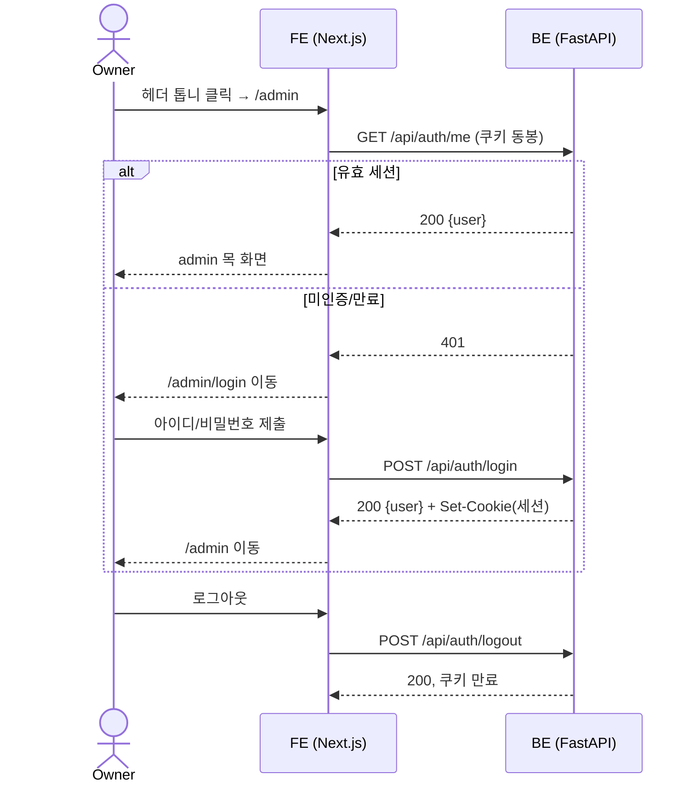
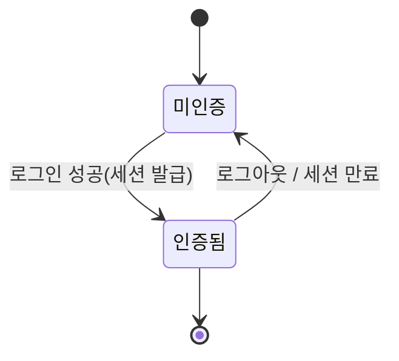

# 관리자 인증 — 로그인/세션/admin 진입

소유자(kknaks) 한 명만 관리 영역에 들어갈 수 있음을 보장하는 계약. 헤더 톱니 → 로그인 → 세션 유지 → admin 화면(이번엔 목) → 로그아웃까지의 외부 흐름을 정의한다.

## 1. Context

### Meta

- Decision reference: [[decision-009-app-db-foundation-and-admin-auth|KDEV-DEC-009]]
- Baseline reference: [[baseline-002-app-db-and-admin|KDEV-BL-002]]
- Domain note: 인증 주체 = 단일 관리자(환경 시드). 관찰 가능한 상태 = `미인증` / `인증됨`. 세션 = httpOnly 쿠키에 담긴 만료 있는 토큰. 노출 리소스 없음(관리 내부 영역).
- Open questions: §7

### Business Requirement

방문자에게는 관리 기능이 보이거나 접근되면 안 된다. 소유자는 어느 페이지에서든 헤더 한 번으로 관리 영역에 진입해 로그인하고, 이후 세션이 유지되는 동안 재로그인 없이 관리 화면을 쓸 수 있어야 한다.

### Scope

In scope:

- 헤더 우상단 톱니(설정) 진입점.
- 로그인 화면과 로그인 흐름(자격 검증 → 세션 발급).
- 세션 유지(쿠키) 및 만료.
- 로그아웃.
- admin 화면의 **인증 게이트**(이번 버전의 화면 본문은 목).

Out of scope:

- admin의 실제 관리 기능(콘텐츠 편집 등) — 후속 spec.
- 회원가입 · 다중 유저 · 역할(role) 세분화 · 비밀번호 재설정 — [[decision-009-app-db-foundation-and-admin-auth|KDEV-DEC-009]] 범위 밖.
- 지식그래프/콘텐츠의 DB 이관.

## 2. UX Contract

### Placement

```text
+──────────────────────────────────────────────────+
│ 헤더 [ kknaks.dev  nav... ]        [lang] [⚙]     │  ⚙ = 우상단 톱니
+──────────────────────────────────────────────────+
│ /admin/login : 로그인 카드(중앙)                  │
│ /admin       : 관리 화면(인증 시) / 로그인으로 이동 │
+──────────────────────────────────────────────────+
```

### U-1. 헤더 톱니 진입점

- **상태**: 모든 공개 페이지의 헤더 우상단(lang 스위처 옆)에 항상 노출. `/print/*`에서는 헤더 자체가 없으므로 미노출.
- **문구**: 아이콘 버튼(설정/톱니). 접근성 라벨 "admin".
- **CTA**: 클릭 → `/admin`으로 이동.
- **기대 결과**: 인증됨이면 admin 화면, 미인증이면 로그인 화면(`/admin/login`)으로 이동한다.

### U-2. 로그인 화면 (`/admin/login`)

- **상태**: 정상(입력 대기) · 제출 중(버튼 비활성/로딩) · 에러(자격 불일치) · 이미 인증됨(→ `/admin`으로 이동).
- **문구**: 제목 "관리자 로그인", 필드 라벨 "아이디"/"비밀번호", 제출 "로그인", 에러 메시지 "아이디 또는 비밀번호가 올바르지 않습니다".
- **CTA**: "로그인" 버튼 — 아이디·비밀번호가 모두 입력됐을 때 활성.
- **기대 결과**: 성공 시 세션이 발급되고 `/admin`으로 이동. 실패 시 화면에 에러 문구, 입력값 유지.

### U-3. admin 화면 (`/admin`) — 이번 버전은 목

- **상태**: 인증됨(관리 화면 본문 = 목 플레이스홀더) · 미인증(즉시 `/admin/login`으로 이동, 본문 미표시).
- **문구**: 목 화면에 "관리자 대시보드 (준비 중)" + 로그인한 계정 표시.
- **CTA**: "로그아웃" 버튼.
- **기대 결과**: 로그아웃 시 세션 제거 후 `/admin/login`(또는 홈)으로 이동. 상세 관리 기능은 후속 spec에서 채운다.

## 3. User Scenario

### S-1. 소유자 — 로그인 성공

1. 공개 페이지 헤더의 톱니 클릭 → `/admin` 진입.
2. 미인증 상태라 `/admin/login`으로 이동.
3. 아이디·비밀번호 입력 후 "로그인".
4. 자격이 시드된 관리자와 일치 → 세션 쿠키 발급, `/admin`으로 이동.
5. admin 목 화면과 로그인 계정이 표시된다.

### S-2. 소유자 — 자격 불일치

1. `/admin/login`에서 잘못된 아이디/비밀번호로 "로그인".
2. 세션이 발급되지 않고, "아이디 또는 비밀번호가 올바르지 않습니다" 에러가 표시된다(어느 필드가 틀렸는지는 구분하지 않는다).
3. 입력값은 유지되어 재시도할 수 있다.

### S-3. 방문자 — 미인증 접근

1. 세션 없이 URL로 `/admin` 직접 접근.
2. 관리 본문이 렌더되지 않고 `/admin/login`으로 이동한다.
3. 관리 API를 세션 없이 직접 호출하면 `401`을 받는다.

### S-4. 소유자 — 세션 만료

1. 세션 발급 후 만료 시간(§5)이 지난 뒤 `/admin` 접근 또는 관리 API 호출.
2. 만료된 세션은 미인증으로 취급 → 로그인 화면으로 이동 / API는 `401`.

### S-5. 소유자 — 로그아웃

1. admin 화면에서 "로그아웃".
2. 세션 쿠키가 제거되고 이후 `/admin` 접근은 미인증으로 취급된다.

## 4. Interface Contract

### API Contract

| Method | Path | 요약 | 권한 |
|---|---|---|---|
| POST | `/api/auth/login` | 자격 검증 후 세션 쿠키 발급 | 공개 |
| POST | `/api/auth/logout` | 세션 쿠키 제거 | 공개(멱등) |
| GET | `/api/auth/me` | 현재 세션의 계정 반환 | 세션 필요 |

### Request / Response

정상 응답만 명시한다(에러는 Case Matrix가 단일 SoT).

- `POST /api/auth/login`
  - Request: `{ "username": string, "password": string }`
  - `200`: `{ "user": { "username": string, "role": string } }` + `Set-Cookie`(세션 쿠키, §Data Contract).
- `POST /api/auth/logout`
  - `200`: `{ "ok": true }` + 세션 쿠키 만료 처리.
- `GET /api/auth/me`
  - `200`: `{ "user": { "username": string, "role": string } }` (유효 세션일 때).

### Validation

| 필드 | 규칙 |
|---|---|
| `username` | 비어 있지 않은 문자열 |
| `password` | 비어 있지 않은 문자열 |

FE는 두 필드가 채워졌을 때만 제출을 활성화하고, BE는 최종 신뢰 경계로 다시 검증한다.

### Case Matrix

| 에러 코드 | 백엔드 출력 | 프론트 출력 | 표시 위치 |
|---|---|---|---|
| 자격 불일치 | `401` `{detail: "invalid credentials"}` | "아이디 또는 비밀번호가 올바르지 않습니다" | 로그인 카드 내 에러 영역 |
| 입력 누락 | `422`(스키마 위반) | 필드 하이라이트 / 제출 비활성 | 로그인 폼 |
| 미인증 API 접근 | `401` `{detail: "not authenticated"}` | `/admin/login`으로 이동 | 라우팅 |
| 세션 만료 | `401`(만료 토큰) | `/admin/login`으로 이동 | 라우팅 |

### Flow



### State / Lifecycle



### Data Contract

- 세션은 **httpOnly 쿠키**로 전달되는 만료 있는 서명 토큰이다. FE 스크립트는 토큰 내용을 읽지 않는다.
- 쿠키 속성 계약: `HttpOnly`, `SameSite=Lax`, 운영은 `Secure` + `Domain=.kknaks.cloud`(프론트·백 서브도메인 공유), 로컬 dev는 host-only·비-Secure.
- 인증 주체는 단일 관리자 계정(환경 시드). 외부에 노출되는 필드는 `username`, `role`뿐. 자격증명(해시)·내부 컬럼·토큰 서명 방식은 코드/migration이 SoT다.

## 5. Implementation Rules

외부에서 관찰 가능한 규칙만 둔다.

- **비밀번호는 평문으로 저장하지 않는다**(해시 저장). 로그인 응답·API 어디에도 비밀번호/해시를 반환하지 않는다.
- 자격 불일치 시 아이디 존재 여부를 구분해 노출하지 않는다(둘 다 동일한 `401`).
- 세션 토큰은 만료를 가진다(기본 유효기간은 환경 설정값). 만료·위조 토큰은 미인증으로 취급.
- 관리 영역(`/admin/*`)과 세션 필요한 API는 유효 세션이 없으면 접근을 차단한다(페이지=로그인 이동, API=`401`).
- 쿠키는 `HttpOnly`로 발급하고, cross-origin 호출 시 FE는 자격증명을 동봉(credentials)한다. 백엔드 CORS는 자격증명 허용 + 명시적 origin(와일드카드 금지).

라우트·페이지·컴포넌트 파일, DB 컬럼/인덱스, migration 순서, 시드 구현은 work에 둔다.

## 6. Verification

### Acceptance Criteria

- [ ] 모든 공개 페이지 헤더 우상단에 톱니 진입점이 보이고, 클릭 시 `/admin`으로 간다.
- [ ] 올바른 `.env` 시드 자격으로 로그인하면 세션이 발급되고 `/admin` 목 화면이 보인다.
- [ ] 잘못된 자격은 `401`과 통합 에러 문구를 주고, 아이디/비밀번호 오류를 구분하지 않는다.
- [ ] 세션 없이 `/admin` 접근 시 로그인 화면으로 이동하고, 세션 없는 관리 API 호출은 `401`이다.
- [ ] 로그아웃 후 `/admin` 접근은 다시 미인증으로 취급된다.
- [ ] 세션 쿠키가 `HttpOnly`이며 비밀번호/해시가 응답에 노출되지 않는다.

## 7. Open Questions

- (설계 OQ) 세션 즉시 무효화(로그아웃/탈취 대응)가 필요해지면 stateless JWT → 서버 세션(Redis)로 승격할지 — [[decision-009-app-db-foundation-and-admin-auth|KDEV-DEC-009]] OQ-1.
- (설계 OQ) CSRF 방어 수준 — httpOnly 쿠키 + `SameSite=Lax` 기준선에서 별도 CSRF 토큰이 필요한 관리 액션이 생기는지(쓰기 기능 spec에서 재검토).
- (설계 OQ) 로그인 실패 속도 제한(brute-force 대응) 도입 시점.
