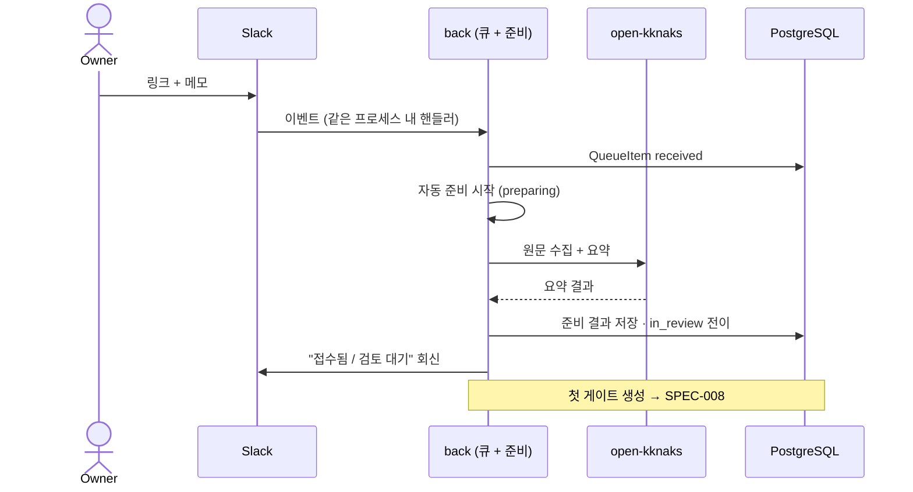
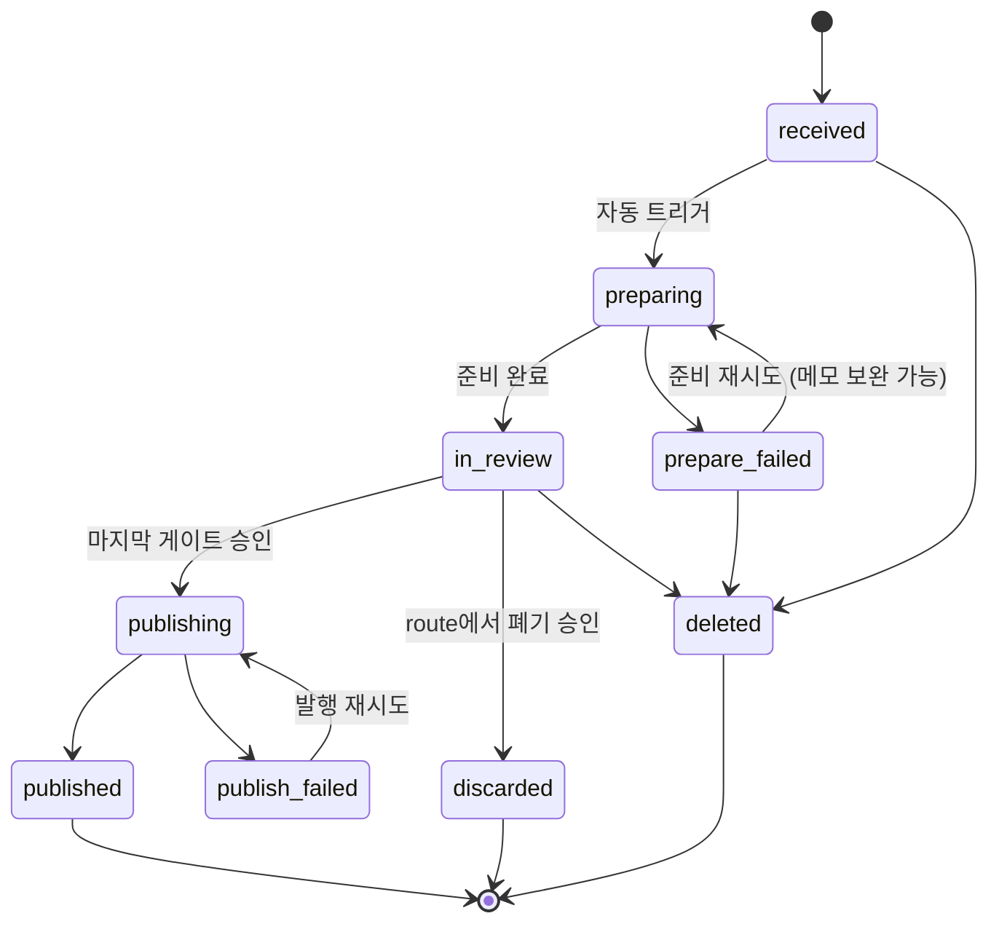

# 승인 큐 — 지식 입력 접수와 항목 상태기계

Slack이나 관리자 화면으로 들어온 지식 입력을 **파일이 아니라 DB 큐**에 접수하고, 자동 준비(수집·요약)를 거쳐 게이트 체인으로 넘기기까지의 계약.

> 큐 항목이 게이트를 거쳐 어떤 문서가 되는지는 [[spec-008-gate-chain|KDEV-SPEC-008]], 발행 실행은 [[spec-010-apply-executor|KDEV-SPEC-010]]이 소유한다. 이 spec은 **접수부터 첫 게이트 생성까지**와 항목 전체 lifecycle을 소유한다.

## 1. Context

### Meta

- Decision reference: [[decision-011-approval-gate-chain|KDEV-DEC-011]] D1/D2, [[decision-012-draft-storage-and-publish-boundary|KDEV-DEC-012]] D1, [[decision-013-slack-bridge-into-backend|KDEV-DEC-013]]
- Baseline reference: [[baseline-003-inbox-approval-pipeline|KDEV-BL-003]]
- Domain note: `QueueItem`(항목), `source_kind`(입력 종류), 항목 status. 저장 = PostgreSQL.
- Open questions: §7

### Business Requirement

지금은 Slack에 링크를 던지면 AI가 만든 결과가 **곧바로 `origin/main`에 커밋**된다. 사람이 개입할 지점이 없고, 검토는 Slack 회신 한 줄이 전부다.

입력을 잃지 않으면서도 **승인 전에는 레포에 아무것도 쓰지 않는** 대기 장소가 필요하다. 그 장소는 파일일 수 없다 — `POST /admin/reload`의 `git reset --hard origin/main`이 미커밋 변경을 지우기 때문이다.

### Scope

In scope: 입력 접수(intake), 항목 상태기계, 자동 준비 스테이지와 실패 회생, `inbox/` 디렉토리와의 경계, 중복 처리, 삭제.
Out of scope:
- 게이트 생성·승인·피드백 → [[spec-008-gate-chain|KDEV-SPEC-008]], [[spec-009-gate-feedback|KDEV-SPEC-009]]
- 발행 실행 → [[spec-010-apply-executor|KDEV-SPEC-010]]
- Slack 이벤트 수신·인가·멱등 계약 → `OKK-SPEC-011`(무변경, 실행 위치만 [[decision-013-slack-bridge-into-backend|KDEV-DEC-013]]로 이동)
- 테이블 컬럼·인덱스 (코드/migration)

## 2. UX Contract

### Placement

admin 사이드바의 큐 화면. 좌측 항목 목록 + 우측 상세(선택 항목의 준비 상태와 게이트 스택).

```text
+──────────────────────────────────────────────────+
│ admin 헤더 / 사이드바                             │
+──────────────┬───────────────────────────────────+
│ 큐 목록      │ 선택 항목                          │
│ · 준비 중    │  원문 URL · 메모 · 접수 시각       │
│ · 검토 대기  │  준비 상태 (수집 / 요약)           │
│ · 발행 실패  │  ── 게이트 스택 (SPEC-008) ──      │
│ · 보류/폐기  │                                    │
+──────────────┴───────────────────────────────────+
```

### U-1. 큐 목록

- **상태**: 비어 있음 · 준비 중 · 검토 대기 · 발행 실패 · 준비 실패
- **문구**: 입력 종류 배지(유튜브/블로그/수동…), 제목 또는 URL, 접수 시각, 현재 상태, 진행 중인 스테이지 이름
- **CTA**: `항목 추가`, 항목 선택, `삭제`
- **기대 결과**: 상태별로 묶여 보인다. 발행 실패와 준비 실패가 눈에 띄어야 한다 — 조용히 묻히면 승인한 게 사라진 줄 모른다. `published`·`discarded`·`deleted`는 기본 목록에서 숨긴다.

### U-2. 항목 상세

- **상태**: 준비 중 · 준비 실패 · 검토 대기 · 발행 중 · 발행 실패 · 발행됨 · 폐기됨
- **문구**: 원문 URL, 메모, 접수 채널·시각, 자동 준비 진행(수집 → 요약), 실패 시 사유
- **CTA**: `메모 수정`, `준비 재시도`, `발행 재시도`(발행 실패일 때), `삭제`
- **기대 결과**: 준비가 끝나면 아래에 게이트 스택이 이어 붙는다([[spec-008-gate-chain|KDEV-SPEC-008]]). 준비가 실패했으면 사유와 재시도 경로가 보인다.

### U-3. 항목 추가 모달

- **상태**: 닫힘 · 열림 · 제출 중 · 제출 실패 · 중복 감지
- **문구**: URL 입력, **메모(항상 표시)**, 입력 종류(자동 판별, 수정 가능)
- **CTA**: `저장`, `취소`
- **기대 결과**: 저장하면 항목이 `received`로 접수되고 자동 준비가 시작된다. 메모는 **수집 성공/실패와 무관하게 항상 요약 입력에 함께 넘어간다** — 수집이 막히면 원문 대체로도 쓰인다.

## 3. User Scenario

### S-1. owner — Slack으로 링크를 던진다

1. Slack 스레드에 봇을 멘션하고 링크를 보낸다.
2. 시스템이 이벤트를 받아 항목을 `received`로 접수한다. **이 시점에 레포에는 아무 파일도 생기지 않는다.**
3. 자동 준비가 시작된다(`preparing`) — 원문 수집 후 요약.
4. 준비가 끝나면 `in_review`가 되고 첫 게이트(route)가 생성된다([[spec-008-gate-chain|KDEV-SPEC-008]]).
5. Slack 스레드에는 "접수됨 / 검토 대기"가 회신된다. **승인은 Slack이 아니라 admin 화면에서 한다.**

### S-2. owner — 관리자 화면에서 직접 넣는다

1. 큐 화면에서 `항목 추가`를 누른다.
2. URL과 메모를 입력하고 저장한다.
3. 이후는 S-1의 3단계부터 동일하다.

### S-3. System — 자동 준비가 실패한다

1. 원문 수집이 막히거나(봇 차단·자막 없음) 요약이 실패한다.
2. 항목은 `prepare_failed`가 되고 실패 사유가 상세에 표시된다.
3. owner는 **메모를 추가·수정한 뒤 `준비 재시도`**를 누를 수 있다.
4. 메모가 있으면 원문 대신 그 메모를 요약 입력으로 삼아 준비를 완료한다. 메모도 없고 원문도 못 받으면 다시 `prepare_failed`다.
5. 재시도는 기존 실행 기록을 덮어쓰지 않고 새 실행으로 남긴다.

### S-4. owner — 같은 URL이 또 들어온다

1. 이미 큐에 있거나 이미 발행된 URL이 다시 들어온다.
2. 아직 발행 전이면 **새 항목을 만들지 않고 기존 항목에 합류**시킨다(메모가 있으면 덧붙인다).
3. 이미 발행됐으면 **중복 후보로 표시**하고 owner가 새 항목으로 진행할지 정한다. 같은 자료의 재정리가 필요한 경우가 있기 때문이다.

### S-5. owner — 항목을 지운다

1. 큐에서 `삭제`를 누른다.
2. 행을 지우지 않고 `deleted`로 표시한다(soft delete). 기본 목록에서 숨긴다.
3. 삭제한 항목은 게이트가 진행되지 않는다.

## 4. Interface Contract

### API Contract

| Method | Path | 요약 | 권한 |
|---|---|---|---|
| POST | 항목 접수 | URL·메모·입력 종류로 항목 생성 | admin |
| GET | 항목 목록 | 상태별 조회 | admin |
| GET | 항목 상세 | 원문 정보 + 준비 상태 + 실행 이력 | admin |
| PATCH | 메모 수정 | `note` 갱신 | admin |
| POST | 준비 재시도 | `prepare_failed` 항목 재큐 (optional 메모 동반) | admin |
| POST | 발행 재시도 | `publish_failed` 항목 재발행 | admin |
| DELETE | 항목 삭제 | soft delete | admin |

Slack 경로는 이 API를 거치지 않고 내부에서 직접 접수한다(같은 프로세스 — [[decision-013-slack-bridge-into-backend|KDEV-DEC-013]]).

### Validation

| 필드 | 규칙 |
|---|---|
| `source_url` | `http`/`https` 절대 URL. 수동 텍스트 입력 항목이면 `null` 허용 |
| `note`(메모) | 선택. 있으면 항상 요약 입력 컨텍스트로 동반된다. 상한은 구현 기본값 |
| `source_kind` | `youtube` · `blog` · `commit` · `schedule` · `manual`. URL에서 자동 판별하고 수정 가능 |
| 삭제 | 진행 중(`publishing`)인 항목은 삭제할 수 없다 |

### Case Matrix

| 에러 코드 | 백엔드 출력 | 프론트 출력 | 표시 위치 |
|---|---|---|---|
| `INVALID_URL` | URL 형식 오류 | 올바른 URL이 아닙니다. | 항목 추가 모달 |
| `DUPLICATE_PENDING` | 발행 전 동일 URL 존재 | 이미 큐에 있는 URL입니다. 기존 항목에 연결했습니다. | 큐 목록 |
| `DUPLICATE_PUBLISHED` | 이미 발행된 URL | 이미 발행된 자료입니다. 새로 진행할까요? | 항목 추가 모달 |
| `PREPARE_RETRY_NOT_ALLOWED` | 재시도 불가 상태 | 지금은 준비를 재시도할 수 없습니다. | 항목 상세 |
| `PUBLISH_RETRY_NOT_ALLOWED` | 재시도 불가 상태 | 지금은 발행을 재시도할 수 없습니다. | 항목 상세 |
| `DELETE_WHILE_PUBLISHING` | 발행 중 삭제 시도 | 발행이 끝난 뒤 삭제해 주세요. | 항목 상세 |

### Flow



### State / Lifecycle



- `in_review` 동안의 게이트 진행 상태는 항목이 아니라 **게이트가 소유**한다([[spec-008-gate-chain|KDEV-SPEC-008]]). 항목 status는 게이트 단계마다 바뀌지 않는다.
- `publish_failed`는 **게이트 승인 상태를 유지**한다. 재시도는 AI를 다시 부르지 않고 저장된 계획으로 다시 발행한다([[decision-012-draft-storage-and-publish-boundary|KDEV-DEC-012]] D5).
- `discarded`는 route 게이트에서 "폐기"가 승인된 경우다. 행은 보존한다.

### Data Contract

| Resource | Field | 설명 |
|---|---|---|
| QueueItem | `id` | 항목 식별자 |
| QueueItem | `source_kind` | `youtube`·`blog`·`commit`·`schedule`·`manual` — 파이프라인 정의를 고르는 키 |
| QueueItem | `source_url` | 원본 URL. 텍스트 입력이면 `null` |
| QueueItem | `note` | 메모. 항상 요약 입력 컨텍스트로 동반, 수집 실패 시 원문 대체 |
| QueueItem | `channel` | `slack` · `manual` — 접수 경로 |
| QueueItem | `submitted_at` / `submitted_by` | 접수 시각·주체 |
| QueueItem | `status` | 위 상태기계 |
| QueueItem | `prepared_payload` | 자동 준비 산출물(수집 원문·요약). 게이트 입력이 된다 |
| QueueItem | `published_at` / `commit_ref` | 발행 완료 시각과 커밋 참조 |
| QueueItem | `deleted_at` | soft delete 시각 |

`prepared_payload`는 **박제**다. 재시도로 새 준비를 하면 덮어쓰지 않고 새 버전을 남긴다(게이트 revision과 같은 원칙 — [[spec-009-gate-feedback|KDEV-SPEC-009]]).

## 5. Implementation Rules

- **승인 전에는 레포에 파일을 쓰지 않는다.** 큐 항목과 준비 산출물은 전부 DB에 있다. 근거: `POST /admin/reload`의 `git reset --hard origin/main`이 미커밋 변경을 삭제한다.
- **`inbox/` 디렉토리는 큐가 아니다.** 큐는 "아직 승인 안 된 것", `inbox/`는 route 게이트에서 *"지금은 정제 못 하겠지만 버리긴 아깝다"*로 **승인된** idea가 사는 목적지다([[decision-011-approval-gate-chain|KDEV-DEC-011]] D1). 두 개념을 섞지 않는다.
- 자동 준비 스테이지(수집·요약)는 **게이트가 아니다.** 승인 대상이 아니며 실패 시 재시도한다.
- 준비 실패는 항목을 죽이지 않는다. 메모를 보완해 재시도할 수 있고, 메모가 있으면 원문 없이도 준비가 성립한다.
- 재시도는 기존 실행 기록을 **덮어쓰지 않는다.** 새 실행 행을 만들고 이전 실패를 감사 이력으로 보존한다.
- 중복 판정은 정규화된 URL 기준이다. 발행 전 중복은 자동 합류, 발행 후 중복은 owner 판단.
- 삭제는 soft delete다. hard delete는 범위 밖이다.
- Slack 접수와 화면 접수는 **같은 큐**에 들어간다. 이후 흐름이 갈리지 않는다.
- 큐 표면 전체가 **admin 전용**이다.

## 6. Verification

### Acceptance Criteria

- [ ] Slack으로 링크를 던지면 항목이 `received`로 접수되고 **레포에 파일이 생기지 않는다.**
- [ ] 접수 직후 자동 준비가 시작되고 완료 시 `in_review`가 된다.
- [ ] 준비 실패 시 사유가 표시되고 재시도할 수 있다.
- [ ] 메모를 추가한 뒤 재시도하면 원문 수집 없이도 준비가 완료된다.
- [ ] 재시도가 기존 실패 기록을 덮어쓰지 않는다.
- [ ] 발행 전 같은 URL이 다시 들어오면 기존 항목에 합류한다.
- [ ] 이미 발행된 URL은 중복 후보로 표시되고 owner가 진행 여부를 정한다.
- [ ] `publish_failed` 항목이 목록에서 눈에 띄고 재시도할 수 있다.
- [ ] 발행 재시도가 AI를 다시 호출하지 않는다.
- [ ] 삭제한 항목은 행이 남고 목록에서 숨겨지며 게이트가 진행되지 않는다.
- [ ] 큐 표면에 비인증 접근이 차단된다.

## 7. Open Questions

- **(OPEN)** `source_kind` 자동 판별 실패 시 기본값 — `manual`로 떨어뜨릴지, owner에게 선택을 강제할지.
- **(OPEN)** 준비 재시도 횟수 상한과 자동 재시도 여부. 현재는 수동 재시도만 상정한다.
- **(OPEN)** 커밋(잔디)·스케줄 입력은 URL이 없다. 이들이 큐에 들어오는 형태(무엇을 `prepared_payload`로 삼을지)는 해당 파이프라인 정의를 추가할 때 정한다([[decision-011-approval-gate-chain|KDEV-DEC-011]] 보류).
- **(OPEN)** 큐가 오래 쌓였을 때의 정리 정책(자동 만료·일괄 폐기). 쌓이는 속도를 보고 판단한다.
