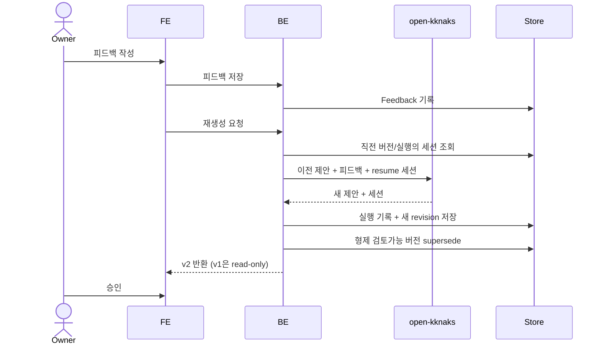
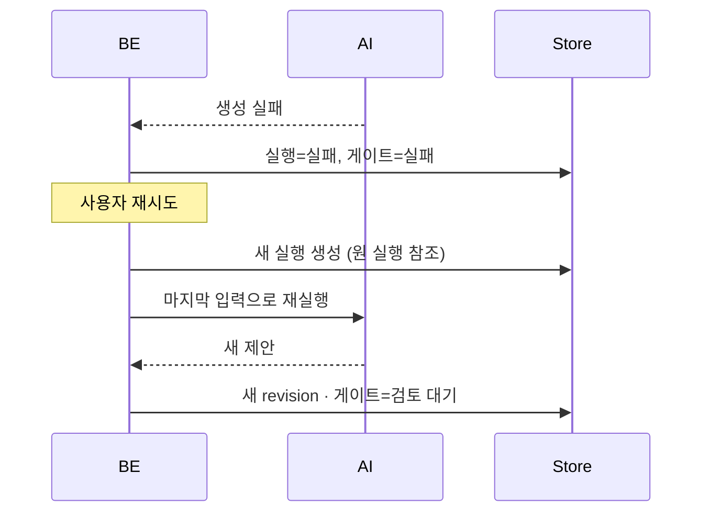
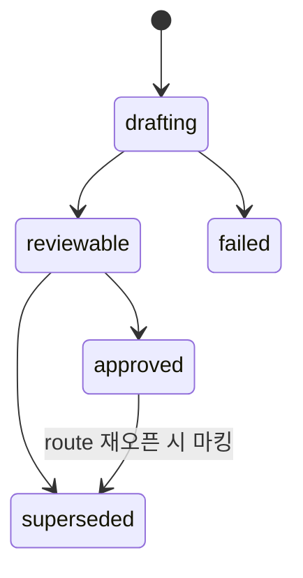

# 게이트 피드백과 재생성 — 버전·resume·supersede

AI 제안이 마음에 안 들 때 **내용을 직접 고치는 대신 방향을 피드백**하고 새 버전을 받는다. 이전 버전은 지우지 않고 read-only로 보존한다.

> 이 규칙은 모든 게이트 스테이지에 **공통**으로 적용된다([[spec-008-gate-chain|KDEV-SPEC-008]]). 큐 항목의 자동 준비 산출물에도 같은 버전 원칙을 적용한다([[spec-007-approval-queue|KDEV-SPEC-007]]).

## 1. Context

### Meta

- Decision reference: [[decision-011-approval-gate-chain|KDEV-DEC-011]] D4
- Baseline reference: [[baseline-003-inbox-approval-pipeline|KDEV-BL-003]]
- Domain note: `Gate`(컨테이너), `Revision`(실제 승인 대상 버전), `Feedback`, `AITask`.
- Open questions: §7

### Business Requirement

지금 Slack 캡처의 후속 대화는 **같은 파일을 덮어쓴다.** 고치면 이전 내용이 사라지고 커밋만 하나 더 쌓인다. 어떤 지적이 무엇을 바꿨는지 추적할 수 없다.

AI의 첫 제안이 틀려도 사용자가 모든 내용을 직접 고치는 부담 없이 **방향만 말하고 새 제안을 받을** 수 있어야 하고, 이전 제안은 비교와 감사를 위해 남아야 한다.

동시에 재생성이 **처음부터 다시 하는 게 아니어야** 한다. 원문과 지침을 매번 재전송하면 비용과 편차가 커진다.

### Scope

In scope: 게이트/버전 분리, 피드백 입력, 재생성(v2), 이전 버전 보존, AI 세션 resume, 형제 버전 정리, 승인 잠금, 실패·재시도.
Out of scope:
- 체인 구조·스테이지가 결정하는 내용 → [[spec-008-gate-chain|KDEV-SPEC-008]]
- 발행 → [[spec-010-apply-executor|KDEV-SPEC-010]]
- AI 프롬프트 내용 (work)
- 필드별 직접 편집기 — 이번 범위 밖

## 2. UX Contract

### Placement

게이트 카드에는 **`피드백`·`승인` 두 버튼만** 둔다. 인라인 텍스트에어리어를 카드에 상주시키지 않는다 — 승인이 기본 동작이고 피드백은 예외 경로다.

```text
+──────────────────────────────────────────────────+
│ concept 게이트              badge: v2 | v1        │
│ ── AI 제안 내용 ─────────────────────────────    │
│ [피드백]  [승인]                                 │
+──────────────────────────────────────────────────+
        │ 피드백 클릭
        ▼
+──────────────────────────────────────────────────+
│ 피드백 모달                                       │
│ 대상: concept 게이트 · 현재 버전 v1               │
│ [ 무엇이 잘못됐나요 / 원하는 방향 ]               │
│ [취소]  [재생성 → v2]                            │
+──────────────────────────────────────────────────+
```

### U-1. 게이트 카드

- **상태**: 검토 대기 · 재생성 중 · 승인됨 · 실패
- **문구**: 버전 badge(`v2 | v1`), 생성 시각, AI 판단 근거, 상태
- **CTA**: `피드백`, `승인`. 실패 상태면 `재시도`. v1 badge를 눌러 이전 버전(read-only) 조회
- **기대 결과**: 승인하면 게이트가 잠기고 다음 스테이지가 열린다. 이전 버전은 버튼이 비활성인 read-only로 남는다.

### U-2. 피드백 모달

- **상태**: 닫힘 · 열림 · 작성 중 · 제출 중 · 제출 실패
- **문구**: 대상 게이트·현재 버전 라벨, "무엇이 잘못됐나요", "원하는 방향"
- **CTA**: `재생성`, `취소`
- **기대 결과**: 텍스트 입력 후 `재생성` → 피드백이 저장되고 같은 게이트의 새 버전(v2) 생성이 시작되며 모달이 닫힌다. v1은 read-only로 보존된다.

### U-3. 버전 badge

- **상태**: 버전 1개 · 여러 버전 · 승인 버전 존재
- **문구**: `v1`, `v2`, 승인됨, 피드백 반영
- **CTA**: 버전 선택해 열람
- **기대 결과**: 과거 제안과 새 제안을 비교할 수 있다. **이전 버전을 다시 승인할 수는 없다** — 승인 대상은 항상 현재 active 버전이다.

## 3. User Scenario

### S-1. owner — 피드백으로 새 버전을 받는다

1. concept 게이트 v1을 본다. 개념 입도가 너무 잘게 쪼개져 있다고 판단한다.
2. `피드백`을 눌러 모달을 연다. 대상과 현재 버전(v1)이 표시된다.
3. "STT와 스트리밍 ASR을 하나로 합쳐 달라"고 적고 `재생성`을 누른다.
4. v1이 read-only로 보존되고 모달이 닫히며 v2 생성이 시작된다.
5. AI는 **직전 세션을 이어받아** 원문·지침 재전송 없이 피드백만 반영해 v2를 만든다.
6. owner가 v2를 승인한다.

### S-2. owner — 승인 후 다시 고치고 싶다

1. 이미 승인한 게이트에 피드백하려 한다.
2. 시스템은 승인된 게이트는 변경할 수 없다고 알린다.
3. 목적지 판단이 틀린 경우에만 `이 목적지가 아님`으로 route를 재오픈할 수 있다([[spec-008-gate-chain|KDEV-SPEC-008]] U-6).

### S-3. System — 재생성이 여러 번 트리거된다

1. 사용자가 피드백을 빠르게 두 번 제출하거나 네트워크 재시도로 중복 요청이 들어온다.
2. 새 버전이 검토 가능 상태가 되기 **직전**, 같은 게이트의 다른 검토 가능 버전을 전부 밀어냄(superseded) 처리한다.
3. 결과적으로 **게이트당 검토 대상은 항상 하나**다. 미완성(생성 중) 버전은 건드리지 않는다.

### S-4. System — AI 실행이 실패한다

1. 생성 또는 재생성이 실패한다.
2. 실행 기록에 실패 사유를 남기고 게이트를 `실패`로 전이한다.
3. `재시도`는 기존 실패 기록을 수정하지 않고 **새 실행**을 만들며, 원래 실행을 참조로 남긴다.
4. 성공하면 새 버전이 만들어지고 게이트가 `검토 대기`로 돌아온다. 실패 이력은 보존된다.

### S-5. System — 이어받을 세션이 없다

1. 재생성 시점에 직전 버전의 세션 정보가 없다(최초 실행이 세션을 반환하지 못했거나 만료).
2. 실행 기록에서 세션을 찾아본다.
3. **앞 게이트의 세션**을 찾아본다(S-6).
4. 그래도 없으면 **stateless로 재생성**하되, 원문·이전 버전 내용·피드백을 모두 컨텍스트에 넣는다. 결과 품질이 떨어질 수 있으나 실패시키지 않는다.

### S-6. System — 스테이지가 앞 스테이지의 세션을 물고 시작한다

[[decision-024-stage-session-inheritance|KDEV-DEC-024]]

1. `source_note` 게이트가 처음 열린다. 자기 게이트에는 아직 버전도 실행도 없다.
2. 파이프라인 정의를 **역순으로** 훑어 앞 게이트를 찾는다 — `route` 다.
3. 그 게이트가 `cancelled` 가 아니면 세션을 물고 시작한다. 승인된 목적지를 판단한 그 대화가 그대로 이어진다.
4. 뒤 스테이지도 같다. `concept` 는 `source_note` 를, `derived` 는 `concept` 를 문다 — **체인 하나가 한 대화**가 된다.
5. 이어받았으므로 원문(`source_excerpt`)은 다시 보내지 않는다(§5). 요약은 항상 보낸다.

### S-7. System — 재오픈된 뒤 다시 열리는 게이트

1. 목적지 재검토로 route 가 재오픈되고 뒤 게이트들이 `cancelled` 된다([[spec-008-gate-chain|KDEV-SPEC-008]] U-6).
2. 새 목적지가 승인되어 `source_note` 게이트가 다시 열린다.
3. **취소된 옛 게이트의 세션은 잇지 않는다.** 틀린 목적지 위에서 쓴 대화이기 때문이다.
4. 대신 **살아 있는 route 세션**을 문다 — 원래 판단, 「이 목적지가 아님」 사유, 수정된 판단이 그 안에 순서대로 들어 있다.

### S-8. System — 형식이 틀려 실패한 뒤 재시도한다

1. 실행은 성공했는데 출력 형식이 어긋나 파싱·검증에서 실패한다(`INVALID_NOTE_OUTPUT` 등).
2. 그 실행의 **세션을 실패 기록에 저장한다.** 실행이 끝난 뒤에 난 실패라 세션이 손에 있다.
3. 재시도가 그 세션을 물고, **직전 실패 사유**를 입력에 함께 넣는다.
4. 에이전트는 자료를 처음부터 다시 읽지 않고 **방금 낸 출력을 고친다.**
5. 실행 자체가 실패한 경우(timeout · 작업 소실 · 빈 결과)에는 저장된 세션이 없어 자연히 새 세션으로 시작한다. **사유 목록으로 분기하지 않는다** — 「세션이 저장돼 있는가」가 곧 그 판정이다.

### S-9. System — 이어받을 세션이 실행기에서 사라졌다

[[decision-024-stage-session-inheritance|KDEV-DEC-024]] D4

1. 세션 참조는 DB 에 남아 있는데 실행기 쪽 세션이 사라졌다. **배포가 이것을 만든다** — 세션은 실행기 컨테이너 안에 살기 때문이다.
2. 제출은 성공하고 **실행이** 실패한다(`No conversation found with session ID: …`).
3. 수확이 그것을 알아채고 **그 참조를 항목 전체에서 지운다.** 한 게이트에서 사라진 세션은 그 항목의 다른 게이트에도 없다 — 하나만 지우면 다음 스테이지가 같은 죽은 세션을 또 문다.
4. 실패 기록(`SESSION_LOST`)을 남기고 **한 번 다시 제출한다.** 지운 뒤라 이번엔 stateless 로 나간다.
5. 같은 사유로 또 실패할 수 없다 — 물 세션이 없기 때문이다. **되돌이표가 구조로 막힌다.**
6. 그 밖의 실행 실패(timeout·작업 소실)는 이 경로를 타지 않는다. 평소대로 게이트가 `failed` 가 되고 사람이 재시도한다.

## 4. Interface Contract

### API Contract

| Method | Path | 요약 | 권한 |
|---|---|---|---|
| POST | 게이트 피드백 | 피드백 저장 | admin |
| POST | 게이트 재생성 | 피드백 기반 새 버전 생성 | admin |
| POST | 게이트 재시도 | 실패한 생성/재생성 재실행 | admin |
| GET | 게이트 버전 목록 | 버전 이력 조회 | admin |
| GET | 버전 상세 | 특정 버전 내용(read-only) | admin |

승인 API는 [[spec-008-gate-chain|KDEV-SPEC-008]]이 소유한다.

### Validation

| 필드 | 규칙 |
|---|---|
| `feedback` | 필수. 최소 길이 이상 — 한 단어 피드백으로는 방향이 전달되지 않는다. 상한은 구현 기본값 |
| 대상 게이트 | 현재 항목에 속한 게이트만 |
| 재생성 | `검토 대기` 또는 `피드백 대기` 상태에서만 |
| 재시도 | 게이트가 `실패`이고 마지막 실행이 실패인 경우만 |
| 이전 버전 | 조회만 가능. 승인·피드백 대상이 될 수 없다 |

### Case Matrix

| 에러 코드 | 백엔드 출력 | 프론트 출력 | 표시 위치 |
|---|---|---|---|
| `FEEDBACK_TOO_SHORT` | 피드백 길이 부족 | 원하는 수정 방향을 조금 더 구체적으로 적어 주세요. | 피드백 모달 |
| `GATE_ALREADY_APPROVED` | 승인된 게이트 수정 시도 | 승인된 단계는 변경할 수 없습니다. | 게이트 카드 |
| `REGENERATION_FAILED` | AI 재생성 실패 | 새 제안을 만들지 못했습니다. 다시 시도해 주세요. | 피드백 모달 |
| `STALE_REVISION` | 오래된 버전 대상 조작 | 최신 상태를 다시 확인해 주세요. | 게이트 카드 |
| `RETRY_NOT_ALLOWED` | 재시도 불가 상태 | 지금은 재시도할 수 없습니다. | 게이트 카드 |
| `SESSION_LOST` | 이어받을 세션이 실행기에 없다 | 이전 대화를 이어받지 못해 새로 만드는 중입니다. | 게이트 카드 |

### Flow



실패 후 재시도:



### State / Lifecycle

Revision 상태:



- 게이트 상태는 [[spec-008-gate-chain|KDEV-SPEC-008]]이 소유한다. **게이트 상태와 revision 상태는 다른 것**이다 — 게이트는 사용자가 보는 단계의 상태, revision은 AI 제안 버전의 상태다.
- AI 실행 상태(`queued`/`running`/`succeeded`/`failed`)는 또 별개다. 셋을 섞지 않는다.

### 실행은 비동기다 — 제출하고 폴링한다

**AI 호출을 사용자 요청 안에서 기다리지 않는다.** 생성은 30~60초가 걸리고, 그동안 요청을
붙잡고 있으면 앞단 프록시가 먼저 끊는다. 그러면 요청이 **취소되며 트랜잭션이 롤백돼
아무것도 남지 않는다** — 사용자는 여러 번 눌러도 진행이 안 되는 것만 본다.

```text
제출   실행기에 submit → task_id 저장(`external_task_ref`) → AITask=running
       Revision=drafting · Gate=generating → **즉시 커밋하고 응답**
대기   드라이버(요청 밖)가 실행 완료를 기다린다
수확   끝나면 결과를 파싱·검증하고
       Revision=reviewable · Gate=review_pending 으로 전이한다
```

**대기는 폴링이 아니다.** 실행기는 실행 중 결과 스트림에 이벤트를 흘리고 끝나면 상태를
바꾸며, 클라이언트가 그 스트림을 블로킹 read 로 기다리다 깨어난다 — **워커가 우리를 깨워
준다.** 주기적으로 물어볼 이유가 없다.

기다리는 주체가 **요청이 아니라는 것**이 요점이다. 요청 안에서 기다리면 프록시가 끊고
트랜잭션이 롤백된다. 요청 밖(백그라운드)에서 기다리면 그 일이 일어나지 않는다.

- **작업은 실행기의 큐에 남는다.** back 컨테이너가 재시작해도 유실되지 않는다 —
  `external_task_ref` 로 다시 찾는다. 부팅 시 진행 중이던 항목을 다시 따라붙는다.
- **수확은 멱등이어야 한다.** 대기 중인 드라이버와 화면 조회가 겹쳐도 revision 이
  두 번 채워지면 안 된다.
- **조회 시에도 수확한다.** 드라이버가 죽었거나 재시작 사이에 끝난 실행을 화면 조회
  한 번으로 따라잡는 안전망이다. 없으면 드라이버가 유일한 경로가 되어 취약해진다.
- 실행이 실패하면 `AITask=failed` · `Gate=failed` 로 전이하고 화면에 `재시도` 를 연다.
  실패 기록은 지우지 않는다.
- 승인·피드백 같은 **사람의 조작은 동기**다. 이미 만들어진 것을 저장하는 일이라
  즉시 끝난다 — 느린 것은 언제나 *다음* 제안을 만드는 쪽이다.
- **AI 가 아닌 느린 일도 요청 밖으로 낸다.** 원문 수집(HTTP, 상한 15초)이 그렇다.
  접수 응답이 수집을 기다릴 이유가 없다.

### Data Contract

| Resource | Field | 설명 |
|---|---|---|
| Revision | `gate_id` | 소속 게이트 |
| Revision | `version` | 게이트 안에서 증가하는 v1, v2, … |
| Revision | `status` | `drafting`·`reviewable`·`approved`·`superseded`·`failed` |
| Revision | `payload` | AI가 만든 실제 승인 대상 내용 |
| Revision | `parent_revision_id` | 재생성 기준이 된 이전 버전 |
| Revision | `feedback_id` | 이 버전을 유발한 피드백 |
| Revision | `ai_task_id` | 이 버전을 만든 실행 |
| Revision | `session_ref` | 실행이 반환한 세션 참조. 다음 재생성의 resume 원천 |
| Feedback | `target_revision_id` | 피드백 대상 버전 |
| Feedback | `body` | 사용자가 남긴 방향 |
| Feedback | `status` | `submitted`·`consumed` |
| AITask | `kind` | 어느 스테이지의 생성/재생성인가 |
| AITask | `status` | `queued`·`running`·`succeeded`·`failed` |
| AITask | `retry_of_task_id` | 재시도 대상 |
| AITask | `session_ref` | 실행 결과 세션 참조 |
| AITask | `error_code` / `error_message` | 실패 사유 |

## 5. Implementation Rules

- **재생성은 기존 버전을 수정하지 않는다.** 새 버전을 만들고 직전 버전은 read-only로 보존하며, 새 버전은 이전 버전을 `parent`로 참조한다.
- **형제 정리(sweep)**: 새 버전이 `reviewable`로 전이하기 **직전**, 같은 게이트의 다른 모든 `reviewable` 버전을 `superseded`로 정리한다. 승인 확정 시점에도 같은 정리를 안전망으로 수행한다. `drafting` 버전은 건드리지 않는다.
  - 이 규칙이 없으면 재생성이 여러 번 트리거될 때 검토 가능 버전이 병렬로 쌓이고, 하나를 승인해도 나머지가 dangling으로 남는다.
- **승인된 버전은 불변**이며, 한 게이트에 승인 버전은 하나만 존재한다.
- **세션 resume 순서**: ① 직전 버전의 `session_ref` → ② 이 게이트의 최신 실행의 `session_ref` → ③ **앞 게이트의 세션**(파이프라인 정의 역순, 가장 가까운 것부터) → ④ 전부 없으면 stateless(원문 + 이전 payload + 피드백을 컨텍스트에 인라인). 재생성 결과가 새 세션을 반환하면 새 실행과 새 버전에 저장한다.
- **`cancelled` 게이트의 세션은 잇지 않는다.** 재오픈으로 무효화된 게이트의 대화는 틀린 전제 위에서 쓴 것이다. 후보는 **파이프라인 정의의 게이트 스테이지**를 훑어 찾는다 — 실행 기록의 `kind` 로 찾으면 그 게이트가 살아 있는지 알 수 없다([[decision-024-stage-session-inheritance|KDEV-DEC-024]] D2).
- **실패한 실행의 세션도 저장한다.** 파싱·검증 실패는 실행이 성공한 뒤에 나므로 세션이 손에 있고, 재시도가 가장 물고 싶은 것이 바로 그 세션이다. 재시도 입력에는 **직전 실패 사유**를 함께 넣되 사람 피드백과 섞지 않는다 — 출처가 다르다.
- **이어받으면 원문을 다시 보내지 않는다.** 세션이 있으면 `source_excerpt`(상한 40,000자)를 payload 에서 뺀다. **요약은 항상 보낸다** — 짧고, 뒤 스테이지의 판단 축이며, 세션이 압축됐을 때의 마지막 방어선이다. 뺐다는 사실을 payload 에 남겨(`resumed_session`) 에이전트가 「원문은 위에 있다」를 알게 한다.
- **웜을 전제로만 도는 경로를 만들지 않는다.** 세션이 없거나 만료되면 stateless 로 만들고 실패시키지 않는다(S-5). 세션 저장소가 사라지는 날 파이프라인이 통째로 멈추면 안 된다.
- **폴백은 두 자리에서 돈다.** ① 참조가 **없을 때** — 조회가 `None` 을 돌려주고 그대로 stateless. ② 참조는 있는데 **실행기 쪽에 세션이 없을 때** — 실행이 실패하면 그 참조를 **항목 전체에서 지우고 한 번 다시 제출한다**(S-9). ②가 없으면 D4 는 문장으로만 참이다.
- **AI 실행 상태를 게이트/버전 상태와 섞지 않는다.** 실패한 실행 기록은 불변으로 보존하고, 재시도는 새 실행 행을 만들며 원 실행을 참조한다.
- 같은 피드백으로 중복 재생성 요청이 오면 진행 중인 작업 또는 그 결과를 반환한다.
- 피드백 입력은 **모달로만** 받는다. 게이트 카드에는 두 버튼만 둔다.
- 큐 항목의 자동 준비 산출물도 **같은 버전 원칙**을 따른다 — 재준비 시 덮어쓰지 않고 새 버전을 남긴다. 다만 게이트 전용 개념(승인 잠금, 재오픈)은 적용하지 않는다.

## 6. Verification

### Acceptance Criteria

- [ ] 게이트 카드에 `피드백`·`승인` 두 버튼만 있고 인라인 입력창이 없다.
- [ ] `피드백`이 모달을 열고 대상 게이트·현재 버전을 표시한다.
- [ ] 피드백 제출 후 새 버전이 생성되고 이전 버전이 read-only로 보존된다.
- [ ] 새 버전이 이전 버전을 `parent`로 참조한다.
- [ ] 이전 버전을 조회할 수 있고, 승인·피드백 대상이 되지 않는다.
- [ ] 재생성이 직전 세션을 이어받는다(원문 재전송 없음).
- [ ] 세션이 없으면 stateless로 재생성되며 실패하지 않는다.
- [ ] 새로 열린 게이트가 **앞 게이트의 세션**을 물고 시작한다.
- [ ] 재오픈으로 `cancelled` 된 게이트의 세션은 물지 않고, 살아 있는 route 세션을 문다.
- [ ] 형식 실패로 죽은 실행의 세션이 보존되고, 재시도가 그것을 물며 실패 사유를 함께 받는다.
- [ ] 실행 자체가 실패한 경우에는 세션 없이 새로 시작한다.
- [ ] 세션을 이어받은 제출에는 `source_excerpt` 가 실리지 않고 요약은 실린다.
- [ ] 실행기에서 세션이 사라지면 참조를 지우고 **stateless 로 한 번 다시 제출**한다 — 사람 조작 없이 이어진다.
- [ ] 그 재제출은 같은 사유로 실패하지 않는다(물 세션이 없다).
- [ ] 세션과 무관한 실행 실패는 자동 재제출을 타지 않는다.
- [ ] 재생성이 여러 번 트리거돼도 검토 가능 버전이 **하나만** 남는다.
- [ ] `drafting` 버전은 sweep 대상이 아니다.
- [ ] 승인된 게이트에 피드백하면 거부된다.
- [ ] AI 실행 실패 시 사유와 `재시도` CTA가 표시된다.
- [ ] 재시도가 기존 실패 기록을 덮어쓰지 않고 새 실행을 만든다.
- [ ] 실패 이력이 재시도 성공 후에도 조회 가능하다.
- [ ] 자동 준비 재실행이 이전 산출물을 덮어쓰지 않는다.

## 7. Open Questions

- **(OPEN)** 피드백 최소 길이 기준. 너무 길면 귀찮고 너무 짧으면 방향이 안 전달된다. 실사용 관찰 후 조정한다.
- **(OPEN)** 빠른 선택지(자주 쓰는 피드백 프리셋)를 자유 입력과 함께 제공할지. 반복되는 피드백 패턴이 보이면 도입한다.
- **(OPEN)** 버전이 많이 쌓였을 때 보존 정책. 지금은 전부 보존이며 정리 규칙을 두지 않는다.
- **(OPEN)** 재생성 중 사용자가 페이지를 떠났을 때의 알림. 지금은 화면을 다시 열어 확인하는 것을 전제한다.
