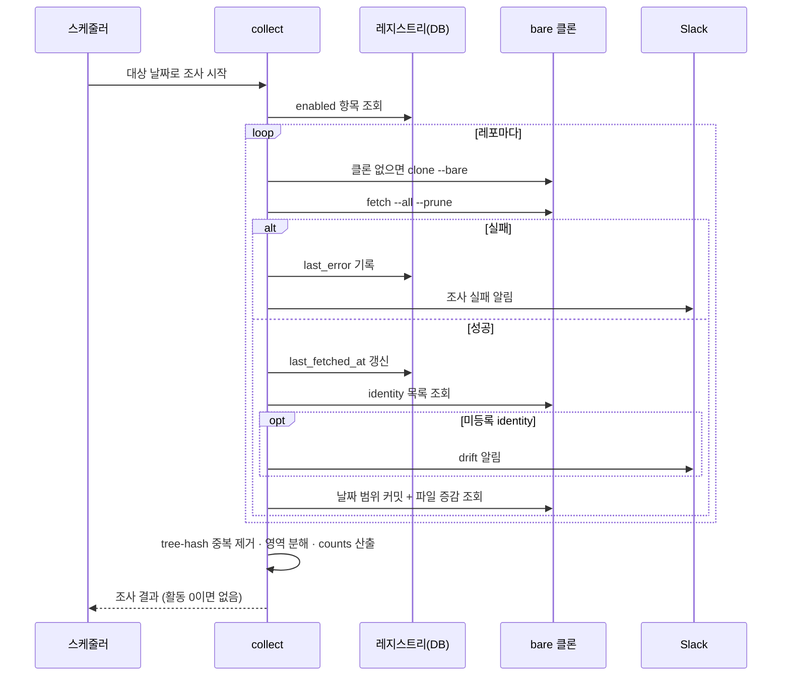
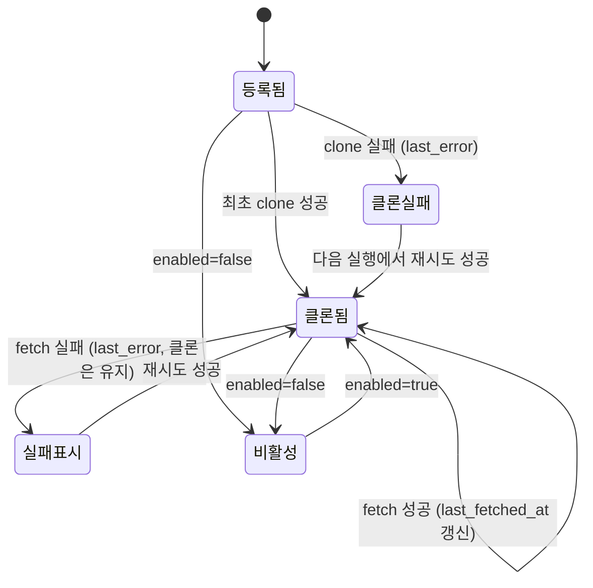

# 커밋 조사 — 레포 레지스트리와 로컬 git 수집

잔디가 **무엇을 추적할지**는 DB 레지스트리가, **커밋을 무엇으로 조사할지**는 서버에 클론한 bare 레포가 정한다. GitHub API 커밋 조회를 대체한다.

> 조사 결과가 어떤 문서가 되는지는 [[spec-012-grass-artifacts|KDEV-SPEC-012]], 승인·발행 절차는 [[spec-013-grass-gate|KDEV-SPEC-013]].

## 1. Context

### Meta

- Decision reference: [[decision-014-commit-source-and-repo-registry|KDEV-DEC-014]]
- Baseline reference: [[baseline-004-commit-pipeline-and-career|KDEV-BL-004]]
- Domain note: 외부에 드러나는 것은 레지스트리 항목(`slug`·`type`·`enabled`·`last_fetched_at`·`last_error`)과 조사 산출물(`commits[]`·`counts`·`areas`)이다. 클론 경로·인덱스·ORM 구조는 코드가 SoT다.
- Open questions: 없음

### Business Requirement

커밋 서술 품질의 병목은 프롬프트가 아니라 **입력**이다. 현행 수집은 커밋당 `{repo, msg}` 둘만 주고 default branch 만 보므로, 하루 25커밋을 두 줄로 뭉갤 수밖에 없다. 상세 조사가 가능한 입력을 만드는 것이 이 spec 의 목적이다.

동시에 추적 대상이 `products/*/showcase.md`(공개 표시용 파일)에 묶여 있어 "보여줄 레포" 와 "긁을 레포" 를 따로 정할 수 없다. 그 둘을 분리한다.

### Scope

In scope:

- 레포 레지스트리 항목의 외부 계약과 lifecycle
- bare 클론 생성·갱신 절차와 실패 표시
- 하루치 커밋 수집 계약 — 대상 브랜치·author 매칭·중복 제거·입력 상한
- `counts` 산출과 기술 영역 분해
- identity drift 알림

Out of scope:

- 조사 결과로 만드는 문서 형식 → SPEC-012
- 승인 게이트·발행 → SPEC-013
- 레지스트리 관리 화면(admin CRUD) — 후속
- `algorithms`·`content_enrich` 잡의 수집 경로 — 이 spec 의 대상이 아니다

## 2. UX Contract

### Placement

레지스트리 관리 화면은 이번 범위 밖이다. 사용자에게 드러나는 표면은 **Slack 알림 2종**뿐이다.

### U-1. 클론·fetch 실패 알림

- **상태**: 레포 하나의 클론 또는 fetch 가 실패했을 때
- **문구**: `:warning: 레포 조사 실패 — {slug}` + 실패 사유 1줄. 여러 건이면 한 메시지에 묶는다
- **CTA**: 없음(알림 전용)
- **기대 결과**: 해당 레포는 그날 조사에서 빠지고 나머지는 진행된다. `last_error` 에 사유가 남는다

### U-2. identity drift 알림

- **상태**: fetch 후 매칭 identity 목록에 **등록되지 않은 항목**이 나타났을 때
- **문구**: `:mag: 새 커밋 identity 발견 — {name} <{email}> ({slug})` + `등록하거나 패턴을 좁혀야 한다`
- **CTA**: 없음(알림 전용)
- **기대 결과**: 그날 조사는 그대로 진행된다. 사람이 identity 를 등록하거나 패턴을 조정할 때까지 알림이 반복된다

## 3. User Scenario

### S-1. System — 하루치 커밋을 조사한다

1. `enabled = true` 인 레지스트리 항목을 모두 읽는다.
2. 항목마다 로컬 bare 클론이 있는지 확인한다. 없으면 `account` 가 지정한 토큰으로 클론한다.
3. `git fetch --all --prune` 한다. 성공하면 `last_fetched_at` 을 갱신하고 `last_error` 를 비운다.
4. fetch 가 실패하면 `last_error` 에 사유를 남기고 **그 레포만 건너뛴다**(U-1). 다른 레포는 계속한다.
5. 대상 날짜(KST 00:00~다음날 00:00) 범위에서 `--all` 로 본인 커밋을 뽑는다.
6. `(repo, tree-hash)` 로 중복을 제거한다.
7. 남은 커밋의 파일 목록과 증감 라인을 읽어 기술 영역으로 분해한다.
8. `counts` 를 계산한다 — 코드가 세고 AI 는 관여하지 않는다.
9. 커밋이 하나도 없고 노트·교안 변경도 없으면 **조사 결과를 만들지 않는다**(활동 0).

### S-2. System — 등록되지 않은 identity 가 나타난다

1. fetch 직후 그 레포의 매칭 identity 목록을 뽑는다.
2. 알려진 목록에 없는 `name <email>` 이 있으면 Slack 으로 알린다(U-2).
3. **조사는 중단하지 않는다.** 그 커밋들은 패턴에 걸렸으므로 이미 결과에 포함돼 있다.
4. 사람이 identity 를 등록하거나 패턴을 좁힐 때까지 다음 실행에서도 같은 알림이 나간다.

### S-3. System — 입력 상한에 걸린다

1. 레포 하나의 diff 총량이 상한을 넘으면 초과분의 **diff 본문을 버리고** 파일명·증감 라인만 남긴다.
2. 커밋 수가 상한을 넘으면 최신 순으로 자른다.
3. **상한 적중 사실을 조사 결과에 기록한다** — 조용히 잘리면 그날 서술이 왜 얕은지 알 수 없다.
4. 게이트 화면이 그 표시를 보여준다(SPEC-013).

### S-4. owner — 레포를 추가·제외한다

1. 새 레포를 추적하려면 레지스트리에 항목을 추가한다(`slug`·`type`·`account`).
2. `type = company` 면 `detail` 이 필수다 — 어느 career 문서로 갈지 정한다.
3. 추적을 멈추려면 `enabled` 를 끈다. **항목을 지우지 않는다** — 과거 조사 이력의 참조가 끊긴다.
4. 다음 실행에서 반영된다. 클론은 남아 있고 fetch 만 멈춘다.

### S-5. System — 전 레포가 실패한다

1. 모든 레포의 fetch 가 실패하면 조사 결과가 비어 있다.
2. 노트·교안 변경도 없으면 활동 0으로 간주해 항목을 만들지 않는다(S-1 9항).
3. 노트·교안 변경이 있으면 커밋 없이 진행한다 — 커밋은 활동의 일부일 뿐이다.

## 4. Interface Contract

### API Contract

이번 범위에 외부 엔드포인트를 두지 않는다. 레지스트리는 마이그레이션과 수동 시드로 채우고, 조사는 스케줄러가 호출한다.

| Method | Path | 요약 | 권한 |
|---|---|---|---|
| — | — | 해당 없음 | — |

### Validation

| 필드 | 규칙 |
|---|---|
| `slug` | `owner/name` 형식. 전역 유일 |
| `type` | `company` \| `studio` |
| `detail` | `type=company` 면 필수이고 **실재하는 career 파일 stem** 이어야 한다. `type=studio` 면 반드시 비어 있다 |
| `account` | `personal` \| `company`. 해당 토큰이 설정돼 있어야 한다 |
| `enabled` | 기본 `true` |
| `path_rules[]` | 비어 있어도 된다 — 전역 기본 규칙이 적용된다 |

### Case Matrix

| 에러 코드 | 백엔드 출력 | 프론트 출력 | 표시 위치 |
|---|---|---|---|
| `CLONE_FAILED` | `last_error` 저장, 해당 레포 skip | `레포 조사 실패 — {slug}` | Slack |
| `FETCH_FAILED` | 〃 | 〃 | Slack |
| `TOKEN_MISSING` | `account` 토큰 미설정 — 클론 시도하지 않음 | `토큰 미설정 — {slug} 건너뜀` | Slack |
| `DETAIL_NOT_FOUND` | `detail` 이 가리키는 career 파일 없음 — 그 레포의 career 귀속만 해제 | `career 대상 없음 — {slug}` | Slack |
| `IDENTITY_UNKNOWN` | 조사는 계속, 알림만 | `새 커밋 identity 발견` | Slack |
| `INPUT_TRUNCATED` | 조사 결과에 상한 적중 표시 | `입력 상한 적용 — 일부 diff 생략` | 게이트 화면 (SPEC-013) |

### Flow



### State / Lifecycle

레지스트리 항목의 관측 가능한 상태는 `enabled` 와 클론 상태 둘이다.



### Data Contract — 레지스트리 항목

| 필드 | 타입 | 설명 |
|---|---|---|
| `slug` | string | `owner/name`. 유일 |
| `type` | enum | `company` \| `studio` |
| `detail` | string \| null | career 파일 stem. `company` 일 때만 |
| `account` | enum | `personal` \| `company` — 클론·fetch 토큰 |
| `enabled` | bool | 삭제 대신 끄기 |
| `path_rules[]` | list | `{glob, area}`. 비면 전역 기본 |
| `last_fetched_at` | timestamp \| null | 마지막 fetch 성공 |
| `last_error` | string \| null | 마지막 실패 사유 |

### Data Contract — 조사 산출물

```text
commits[]   { repo, sha, tree, author, authored_at, message,
              files[]{path, added, deleted}, areas[],
              diff, diff_truncated }                   ← diff 는 상한에 걸리면 잘린다
areas       { <area>: {commits, added, deleted} }     ← path_rules 분해 결과
career_map  { <career stem>: [repo slug, ...] }       ← type=company 귀속
counts      { commit, note, study }                   ← 코드가 센다
truncated   { <repo slug>: {diff_bytes, commits} }    ← 상한 적중 표시
failures[]  { repo slug, code, message }
identities  { <repo slug>: ["name <email>", ...] }    ← drift 판정용
```

### 수집 규칙

| 항목 | 계약 |
|---|---|
| 대상 브랜치 | **전 브랜치**. default branch 만 보면 실측 기준 17.3%(본인 커밋 7.9%)가 누락된다 |
| 머지 커밋 | **세지 않는다.** 남의 작업이 내 것으로 들어오고, `--numstat` 이 합쳐진 diff 를 내놓아 증감이 부풀려진다. 머지가 한 일은 그 안의 커밋들이 이미 말한다 |
| 시간 경계 | KST `{date}T00:00:00+09:00` ~ 다음날 동시각. **author 날짜 기준이다** — 아래 참조 |
| author 매칭 | **identity 패턴 부분매칭**(현행 `kknaks`). 고정 email 목록을 쓰지 않는다 |
| 중복 제거 | `(repo, tree-hash)`. 실측 기준 163건이 여기서 걸린다 |
| diff 상한 | 레포당 32KB · 커밋당 8KB · 레포당 커밋 30건 |
| 상한 초과 시 | diff 본문 제거, 파일명·증감 라인 유지, `truncated` 에 기록 |
| 회사/개인 구분 | **없다.** 조사 깊이는 균일하다 — 공개 통제는 게이트가 한다 |

### 기술 영역 분해

전역 기본 규칙이 있고, 레포별 예외만 `path_rules` 에 적는다.

| glob | area |
|---|---|
| `app/back/**` · `**/backend/**` | `backend` |
| `app/front/**` · `**/frontend/**` | `frontend` |
| `products/**` · `docs/**` · `*.md` | `docs` |
| `*.yml` · `*.yaml` · `Dockerfile*` | `infra` |

한 커밋이 여러 영역에 걸치면 **영역마다 계상한다** — 커밋 수가 아니라 영역별 활동을 보기 위한 값이다. `counts["commit"]` 은 중복 제거된 커밋의 총수이며 영역 합계와 일치하지 않는다.

### 시간 경계 — author 날짜로 센다

`git log --since/--until` 은 **커밋터 날짜**로 거른다. 그런데 우리가 세려는 것은 **일한 날**이고, 리베이스는 커밋터 날짜를 리베이스한 날로 바꾼다. 커밋터 날짜로 자르면 **지난주 작업이 오늘 잔디에 찍힌다.**

| 항목 | 계약 |
|---|---|
| 판정 기준 | **author 날짜**를 KST 로 변환한 날짜가 대상 날짜와 같아야 한다 |
| 조회 창 | `--since`/`--until` 은 대상 날짜 앞뒤로 **여유를 두고** 넓게 잡는다. 좁히면 리베이스된 커밋이 창 밖으로 밀려 나간다 |
| 남는 한계 | 여유 밖으로 밀려난 리베이스는 놓친다. 이것은 **알고 받아들이는 손실**이다 — 창을 무한히 넓히면 조사 비용이 그만큼 는다 |

### diff 본문

`commits[]` 는 파일 목록·증감뿐 아니라 **diff 본문**을 싣는다. 「상세 조사가 가능한 입력을 만든다」(§1 Business Requirement)의 실체가 이것이고, 아래 상한이 존재하는 이유도 본문이 있기 때문이다.

| 항목 | 계약 |
|---|---|
| 상한 초과 시 | **본문만** 자른다. `files[]`(파일명·증감 라인)은 어떤 경우에도 남는다 — 무엇을 건드렸는지는 남고 어떻게 고쳤는지만 사라진다 |
| 잘림 표시 | 커밋 단위로 `diff_truncated`, 레포 단위로 `truncated` |

## 5. Implementation Rules

- **멱등성** — 같은 날짜로 두 번 조사해도 결과가 같다. 조사는 읽기 전용이고 레지스트리의 `last_fetched_at`·`last_error` 만 갱신한다.
- **부분 실패** — 레포 하나의 실패가 조사 전체를 실패시키지 않는다. 실패는 `failures[]` 로 결과에 동반된다.
- **클론 위치** — 레포 작업트리 **밖**이어야 한다. 안에 두면 발행 경로의 작업트리 초기화가 클론을 삭제한다.
- **워커 경계** — 조사와 diff 추출은 back 이 한다. AI 실행기에 클론을 노출하지 않는다.
- **토큰** — `account` 가 지정한 토큰으로만 클론·fetch 한다. 없으면 그 레포를 건너뛰고 알린다.
- **활동 0** — 커밋·노트·교안이 모두 비면 조사 결과를 만들지 않는다. 이후 단계가 호출되지 않는다.

## 6. Verification

### Acceptance Criteria

- [ ] `enabled=false` 인 레포가 조사에서 빠진다
- [ ] `type=company` 항목의 `detail` 이 실재 career stem 이 아니면 등록이 거부된다
- [ ] feature 브랜치에만 있는 본인 커밋이 결과에 포함된다
- [ ] **머지 커밋이 결과에 포함되지 않는다**
- [ ] **리베이스로 커밋터 날짜가 바뀐 커밋이 author 날짜의 날에 잡힌다**
- [ ] 같은 tree 를 갖는 커밋 두 건이 하나로 집계된다
- [ ] 레포 하나의 fetch 실패가 나머지 레포 조사를 막지 않고, Slack 알림과 `last_error` 가 남는다
- [ ] 등록되지 않은 identity 가 나타나면 알림이 나가고 조사는 계속된다
- [ ] diff 상한 초과 시 **본문만 잘리고** 파일명·증감 라인이 남으며 `truncated`·`diff_truncated` 에 기록된다
- [ ] 커밋·노트·교안이 모두 0인 날은 조사 결과가 만들어지지 않는다
- [ ] 같은 날짜로 두 번 실행해도 결과가 동일하다

## 7. Open Questions

없음.
