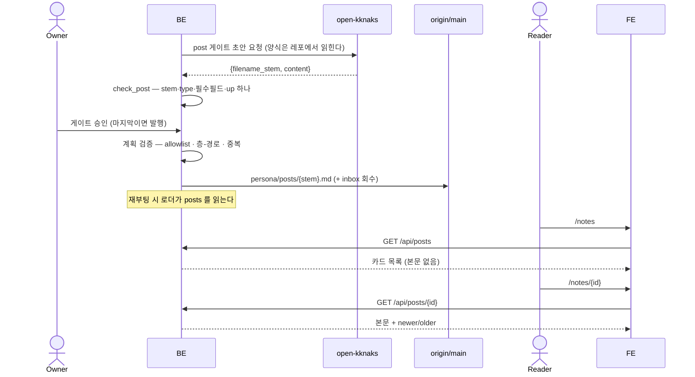

# 공개 글 발행과 노출

`persona/posts/` 의 글 한 편이 **어떤 모양이어야 하고, 어떤 API 로 나가고, 화면에 어떻게 서는지**의 계약. 이미 구현돼 도는 것을 문서로 고정한다.

> 게이트 체인의 진행·승인은 [[spec-008-gate-chain|KDEV-SPEC-008]], 발행 실행과 원자 커밋은 [[spec-010-apply-executor|KDEV-SPEC-010]] 이 소유한다. 이 spec 은 **`post` 산출물 하나의 계약과 그것이 서는 공개 표면**을 소유한다.

## 1. Context

### Meta

- Decision reference: [[decision-021-inbox-is-an-entry|KDEV-DEC-021]] · [[decision-020-para-alignment-area-and-personal|KDEV-DEC-020]] D3
- Baseline reference: [[baseline-007-update-lines-by-case|KDEV-BL-007]] 케이스 5(공부 노트)
- Domain note: 외부에 드러나는 것은 `post_article`·`post_note` 두 타입, `/api/posts`·`/api/posts/{id}` 응답, `/notes`·`/notes/{id}` 화면이다. **본문 양식의 원천은 `templates/persona/post-article.md`·`templates/persona/post-note.md` 두 곳이고 이 spec 은 그것을 복사하지 않는다.**
- Open questions: §7

### Business Requirement

**`resources/` 는 R(개인 지식)이고 공개 표면이 아니다**([[decision-020-para-alignment-area-and-personal|KDEV-DEC-020]] D2). 공개로 나가는 것은 A(`persona/`)이고, R 이 글이 되어 나가는 경로가 `persona/posts/` 다(D3).

그 경계가 실제로는 지켜지지 않고 있었다 — `/api/notes/*` 넷이 인증 없이 `resources/source` 전량을 그래프·검색·상세 전문까지 내고 있었다. 홈과 `/notes` 를 posts 로 옮기면서 그 소비자가 0이 됐고, 네 엔드포인트는 제거됐다(§4 「공개 경계」).

글은 자료 하나를 **1:1** 로 받는다. `up:` 이 정확히 하나라는 제약이 「한 글 = 한 자료」이고, 여러 자료를 묶는 판단은 이 계열이 아니다.

### Scope

In scope:

- `post` 게이트가 낸 초안의 판정 기준과 검사(타입 둘 · `up:` 하나 · stem 규칙)
- 발행 계획에서의 취급 — 경로 allowlist, 층-경로 매핑, 그래프 검증 제외
- 로딩 계약 — 정렬, README 제외, `id == 파일명`, 필수 필드
- `/api/posts`·`/api/posts/{id}` 응답 계약
- `/notes` 목록 · `/notes/{id}` 상세 · 홈 Notes 프리뷰가 소비하는 것
- `resources/` 를 공개 표면에서 뺀 경계

Out of scope:

- 게이트 체인 진행·승인·재생성 → [[spec-008-gate-chain|KDEV-SPEC-008]] · [[spec-009-gate-feedback|KDEV-SPEC-009]]
- 발행 실행·원자 커밋·롤백 → [[spec-010-apply-executor|KDEV-SPEC-010]]
- `inbox/` 접수와 입구 회수 → [[decision-021-inbox-is-an-entry|KDEV-DEC-021]] D1 · [[spec-008-gate-chain|KDEV-SPEC-008]]
- 본문 다섯 절의 형식 — `templates/persona/post-*.md` 가 원천이다
- `resources/source/` 원본 정리 형식 — 지식노트 계열 소관

## 2. UX Contract

### Placement

공개 사이트의 독립 섹션이다. 목록은 `/notes`, 상세는 `/notes/{id}`, 홈에는 `04 / Notes` 프리뷰가 선다.

```text
+──────────────────────────────────────────────────+
│ Notes                     04 / Notes · <subtitle> │
+──────────────────────────────────────────────────+
│ ● 공부   2026.08.12                               │
│ 제목                                              │
│ 요약 한 줄                                        │
│ stack                                             │
+──────────────────────────────────────────────────+
│ ● 스크랩 2026.08.10 …                             │
+──────────────────────────────────────────────────+
```

### U-1. `/notes` 목록

- **상태**: 정상(글 목록) · 빈 상태 · 백엔드 실패
- **문구**: 헤더 `Notes` + `04 / Notes · {subtitle}` + `{totalCount} 글`(en `posts`). 빈 상태는 「아직 정리한 글이 없습니다.」(en `No posts yet.`). 실패는 「백엔드 응답 실패: {메시지}」
- **CTA**: 행 전체가 `/notes/{id}` 링크. 필터·검색 없음
- **기대 결과**: 행마다 타입 배지(`post_note` → **공부**/`note`, `post_article` → **스크랩**/`scrap`) · 날짜 · 제목 · 요약 · stack 이 보인다. **본문은 목록에 없다**

### U-2. `/notes/{id}` 상세

- **상태**: 정상 · 없음(404 페이지)
- **문구**: `← 전체 글`(en `all posts`), 타입 배지, 날짜, 제목, stack
- **CTA**: 뒤로가기 링크, 하단 이웃 글 카드 둘 — `← 다음 글`(newer) / `이전 글 →`(older)
- **기대 결과**: 본문이 **마크다운 그대로** 렌더된다. 화면이 절을 조립하지 않는다(§5)

### U-3. 홈 Notes 프리뷰

- **상태**: 정상 · 빈 상태
- **문구**: `읽고 정리한 것 · {totalCount}편`(en `what I read and wrote up · {totalCount}`)
- **CTA**: 섹션 view-all → `/notes`
- **기대 결과**: 최근 5건 카드 + **글의 `stack` 을 집계한 상위 10개**가 프리뷰 그래프의 입력이 된다. 종전 이 자리의 집계원은 `/api/notes/graph`(=`resources/source`)였다

## 3. User Scenario

### S-1. 독자 — 목록에서 글을 고른다

1. `/notes` 를 연다. 서버가 `/api/posts?limit=50` 을 부른다.
2. 최신순으로 글이 선다. 같은 날짜면 `id` 내림차순이다.
3. 타입 배지로 「자료가 말한 것(스크랩)」과 「내가 이해한 것(공부)」이 갈려 보인다.
4. 글이 하나도 없으면 빈 문구가 나오고 목록 자리는 비어 있다.
5. 백엔드가 실패하면 실패 문구를 그대로 보여 준다 — 빈 목록으로 위장하지 않는다.

### S-2. 독자 — 상세와 이웃 글

1. 행을 눌러 `/notes/{id}` 로 간다. 서버가 `/api/posts/{id}` 를 부른다.
2. 본문이 마크다운으로 렌더된다.
3. 하단에서 `다음 글`·`이전 글` 로 시간축을 따라 이동한다. 최신 글은 `newer` 가 없고 가장 오래된 글은 `older` 가 없다 — 그 자리는 빈 칸이다.
4. 없는 `id` 면 404 페이지다.

### S-3. System — `post` 게이트가 초안을 만든다

1. route 게이트가 `post` 목적지를 켠 파이프라인(`blog`·`study_note`)에서만 이 스테이지가 생성된다.
2. 게이트는 **양식을 프롬프트에 복사하지 않고** 레포의 규칙·템플릿을 읽으라고 지시한다.
3. 출력에서 `filename_stem` 과 `content` 를 꺼내 가벼운 검사를 돈다 — stem 규약, frontmatter 파싱, `type` 이 둘 중 하나인지, `title`·`date` 유무, `id` 를 적었다면 stem 과 같은지, **`up:` 이 정확히 하나인지**.
4. 경로는 시스템이 조립한다 — `persona/posts/{stem}.md`. AI 는 stem 만 낸다.
5. 검사 실패는 게이트 오류가 되고 사람이 피드백·재시도로 처리한다([[spec-009-gate-feedback|KDEV-SPEC-009]]).

### S-4. System — 발행이 파일을 낸다

1. 마지막 게이트 승인이 발행을 연다([[spec-008-gate-chain|KDEV-SPEC-008]]).
2. 승인 산출물에서 `post` 스테이지의 것이 `create` 액션 하나가 된다. `note_type` 은 **내용의 frontmatter `type`** 에서 읽는다.
3. 경로 allowlist(`persona/posts/`)와 층-경로 매핑(`post_article`·`post_note` → `persona/posts/`)을 통과해야 한다.
4. 같은 경로가 이미 있으면 `ALREADY_EXISTS`, stem 이 이미 그래프에 있으면 `STEM_TAKEN` 으로 발행 전체가 거부된다.
5. **가상 그래프 검증(L1~L6)에는 올라가지 않는다** — 그래프 밖 산출물이다(§4 「공개 경계」).
6. 공부 노트에서 온 항목이면 `inbox/{slug}.md` 회수가 **같은 커밋**에 실린다([[decision-021-inbox-is-an-entry|KDEV-DEC-021]] D1).

### S-5. System — 부팅이 글을 읽는다

1. 서버 기동 시 `persona/posts/*.md` 를 재귀 없이 읽는다.
2. `id` 가 없는 파일은 글이 아니다 — `README.md` 가 그렇게 빠진다.
3. 필수 필드(`type`·`id`·`title`·`date`)가 없거나 **`id` 와 파일명이 다르면 파일 하나가 거부되는 것이 아니라 persona 로드 전체가 실패한다.**
4. `persona/posts/` 디렉토리가 아예 없어도 정상이다 — 빈 목록으로 뜬다.

## 4. Interface Contract

### API Contract

| Method | Path | 요약 | 권한 |
|---|---|---|---|
| GET | `/api/posts` | 글 목록(카드) | public |
| GET | `/api/posts/{post_id}` | 글 상세(본문 + 이웃) | public |

### Request / Response

**`GET /api/posts`**

| 파라미터 | 값 | 기본 |
|---|---|---|
| `lang` | `ko` \| `en` | `ko` |
| `limit` | 1~200 | 50 |
| `type` | `post_article` \| `post_note` | 없음(전체) |

```json
{
  "posts": { "subtitle": "읽고 정리한 것", "totalCount": 12 },
  "posts[]": [ { "id": "...", "type": "post_note", "title": "...", "date": "2026.08.12",
                 "summary": "...", "tags": [], "stack": [], "up": ["..."] } ]
}
```

- `totalCount` 는 **`limit` 적용 전, `type` 필터 적용 후**의 수다.
- 카드 필드는 `id`·`type`·`title`·`date`·`summary`·`tags`·`stack`·`up` 여덟이다. **`body` 는 없다.**
- `{ko, en}` 모양의 값은 응답 직전에 `lang` 으로 평탄화된다.

**`GET /api/posts/{post_id}`**

```json
{
  "posts.detail": {
    "id": "...", "type": "post_note", "title": "...", "date": "2026.08.12",
    "summary": "...", "tags": [], "stack": [], "up": ["..."],
    "body": "## 주제\n...",
    "newer": { "id": "...", "title": "..." },
    "older": null
  }
}
```

- 카드 필드 + `body` + 이웃 둘. 이웃은 `{id, title}` 만 담는다.
- 목록이 date desc 라 **index 0 이 최신**이다. `newer` 는 앞 항목, `older` 는 뒤 항목이고 끝이면 `null`.
- 이웃은 **필터 없는 전체 목록** 기준이다.
- 없는 `id` 는 `404`.

### Validation

| 필드 | 규칙 | 검사 지점 |
|---|---|---|
| `filename_stem` | 소문자 영숫자와 하이픈. **`YYYY-MM-DD` 로 시작할 수 없다** — 자료의 날짜는 `up:` 이 가리키는 source 가 갖는다 | 게이트 |
| `filename_stem` | 경로 구분자·`.md` 확장자 금지 | 게이트 |
| `type` | `post_article` 또는 `post_note` | 게이트 |
| `title`·`date` | 필수 | 게이트 · 로더 |
| `id` | 적었다면 stem 과 같아야 한다. 파일로 앉은 뒤에는 **파일명 == `id`** 가 강제된다 | 게이트 · 로더 |
| `up` | **정확히 하나.** 0개도 2개도 거부 | 게이트 |
| 경로 | `persona/posts/` 아래 · `.md` · 상위 이동 금지 | 발행 계획 |

`up:` 의 「하나」는 게이트에서만 본다. 로더가 다시 보지 않는 것은 의도다 — 같은 규칙이 두 곳에 살면 한쪽만 고쳐지는 날 어긋난다.

### Case Matrix

| 에러 코드 | 백엔드 출력 | 프론트 출력 | 표시 위치 |
|---|---|---|---|
| `INVALID_NOTE_STEM` | stem 이 규약에 안 맞음(날짜 접두 포함) | 게이트 실패 사유 | 게이트 카드 |
| `INVALID_NOTE_OUTPUT` | frontmatter 파싱 실패 · `type` 이 둘 중 하나가 아님 · `id` != stem · stem 에 경로/확장자 | 〃 | 게이트 카드 |
| `MISSING_NOTE_FIELD` | `title`·`date` 누락 | 〃 | 게이트 카드 |
| `INVALID_POST_UP` | `up:` 이 하나가 아님 | 〃 | 게이트 카드 |
| `PATH_NOT_ALLOWED` | allowlist 밖 경로 | 발행 거부 | 발행 결과 |
| `LAYER_PATH_MISMATCH` | `post_*` 인데 `persona/posts/` 밖 | 〃 | 발행 결과 |
| `ALREADY_EXISTS` | `create` 인데 파일이 이미 있음 | 〃 | 발행 결과 |
| `STEM_TAKEN` | stem 이 이미 그래프에 있음 | 〃 | 발행 결과 |
| `PersonaError` | 필수 필드 누락 · `id` != 파일명 | (부팅 실패 — 사이트가 옛 데이터를 계속 서빙) | 서버 로그 |
| `404` | 없는 `post_id` | Next.js not-found 페이지 | 상세 화면 |
| — | `/api/posts` 호출 실패 | 「백엔드 응답 실패: …」 | 목록 화면 |

### Flow



### State / Lifecycle

해당 없음. 글은 파일 존재 여부만 갖고 상태 전이가 없다. 승인·발행 상태는 큐 항목이 소유한다([[spec-007-approval-queue|KDEV-SPEC-007]]).

### Data Contract

| 필드 | 필수 | 의미 |
|---|---|---|
| `type` | ○ | `post_article` 또는 `post_note` |
| `id` | ○ | **파일명 stem 과 같아야 한다** |
| `title` | ○ | 제목 |
| `date` | ○ | `YYYY.MM.DD` |
| `up` | ○(게이트) | 이 글이 압축한 `resources/source/` stem **하나** |
| `summary`·`tags`·`stack` | — | 카드에 실린다 |
| `source`·`source_author` | — | `post_article` 양식이 갖는 원문 출처 |
| 본문 | ○ | 다섯 절. 형식은 템플릿이 소유한다 |

**타입 둘을 가르는 기준은 「누가 말한 것인가」다.**

| 타입 | 무엇 | 화면 배지 |
|---|---|---|
| `post_article` | 자료가 말한 요지를 압축(스크랩) | 스크랩 / scrap |
| `post_note` | 내가 이해한 것을 내 언어로(공부) | 공부 / note |

**파일명이 곧 `id` 다.** 링크가 stem 으로 걸리므로 어긋나면 조용히 404 가 된다. 로더는 그 어긋남을 부팅 실패로 만든다.

**정렬은 `date` 내림차순, 동률이면 `id` 내림차순**이다. 이웃 글(newer/older)이 이 정렬 위에 서 있다.

### 공개 경계 — 그래프 밖, R 은 닫혀 있다

| | posts |
|---|---|
| `up:` 을 갖는가 | **갖는다** — 자료 하나를 가리킨다 |
| 지식그래프 노드인가 | **아니다** — 계보 검증 L1~L6 대상이 아니다 |
| 왜 | `persona/` 는 4층 모델 밖의 귀결이다([[decision-020-para-alignment-area-and-personal|KDEV-DEC-020]] D3). `up:` 이 없는 문서를 검증에 얹으면 고아 규칙에 걸려 발행이 막힌다 — 빼는 것이 예외 처리가 아니라 사실의 반영이다 |

`resources/` 는 R 이고 **공개 표면이 아니다.** 그래서 `resources/source` 전량을 내던 `/api/notes/*` 넷(`graph`·`recent`·`search`·상세)은 제거됐고, 지금은 **넷 다 404** 다. 홈과 `/notes` 가 posts 로 옮겨 가며 소비자가 0이 된 뒤의 정리다 — 안 쓰는데 열려 있으면 다음 사람이 그것을 보고 다시 붙인다.

**로더의 `data["notes"]` 는 남아 있다.** 그래프 검증과 백링크가 그것을 읽는다. 없앤 것은 HTTP 표면뿐이다.

## 5. Implementation Rules

- **목록 응답에 본문을 싣지 않는다.** 카드 필드는 여덟이고 `body` 는 상세에서만 나간다. 글 수십 편의 전문을 목록에 실으면 첫 화면이 통째로 무거워진다.
- **상세 화면은 절을 코드로 조립하지 않는다.** 양식의 원천은 `templates/persona/post-*.md` 한 곳이고, 화면이 「주제 · 개념 · 사용 예시 · 리스크 · 비슷한 개념」을 다시 그리면 원천이 둘이 된다 — 템플릿만 고친 날 화면이 조용히 어긋난다. 교안(`/contents`)이 섹션 헤더를 코드로 그리는 것과 다른 선택이고, 근거는 글의 절 구성이 자유롭다는 것이다.
- **경로는 시스템이 조립한다.** 게이트에서 받는 것은 stem 뿐이고 `persona/posts/` 는 코드가 붙인다. AI 가 경로를 지어내면 allowlist 밖으로 쓰는 계획이 만들어진다.
- **양식을 프롬프트에 복사하지 않는다.** 게이트는 규칙·템플릿을 읽으라고 지시만 한다.
- **개념 상세를 글에 쓰지 않는다.** 상세의 원천은 `resources/concept/` 한 곳이고 글은 요지만 쓰고 `[[]]` 로 위임한다.
- **글은 그래프 검증에서 빠진다.** 같은 발행에 섞인 `concept` 는 그대로 검증을 받는다.
- **부팅 검증은 fail-fast 다.** 형식 위반은 파일 하나를 건너뛰지 않고 로드 전체를 세운다 — 조용히 옛 데이터를 서빙하는 것보다 낫다.
- **공개 엔드포인트는 persona/products 계열뿐이다.** `resources/` 를 다시 열지 않는다.

## 6. Verification

### Acceptance Criteria

- [ ] `up:` 이 하나인 초안은 통과하고, 둘이거나 없으면 거부된다 — `app/back/tests/test_pipeline_gates.py::TestPostStage::test_single_up_passes`·`test_multiple_up_is_rejected`·`test_missing_up_is_rejected`
- [ ] `type` 이 둘 중 하나가 아니면 거부된다 — `TestPostStage::test_wrong_type_is_rejected`
- [ ] stem 이 `YYYY-MM-DD` 로 시작하면 거부된다 — `TestPostStage::test_dated_stem_is_rejected`
- [ ] 승인된 `post` 산출물이 `persona/posts/{stem}.md` 의 `create` 액션 하나가 되고 `note_type` 이 내용의 `type` 에서 온다 — `app/back/tests/test_study_intake.py::TestPostIsPublished::test_post_becomes_a_file_action`
- [ ] 발행된 글이 로드 결과에 들어오고 본문이 실린다 — `app/back/tests/test_loader.py::TestPostsAreLoaded::test_posts_land_in_the_payload`
- [ ] `README.md` 는 글로 잡히지 않는다 — `TestPostsAreLoaded::test_readme_is_not_a_post`
- [ ] 최신순으로 정렬된다 — `TestPostsAreLoaded::test_newest_first`
- [ ] `id` 와 파일명이 다르면 로드가 실패한다 — `TestPostsAreLoaded::test_id_must_match_filename`
- [ ] 필수 필드가 빠지면 로드가 실패한다 — `TestPostsAreLoaded::test_missing_required_field_is_refused`
- [ ] `persona/posts/` 가 없어도 부팅한다 — `TestPostsAreLoaded::test_no_posts_directory_is_fine`
- [ ] `/api/notes/*` 넷이 404 다 — `app/back/tests/test_routers.py::TestNotesRemoved::test_gone`

## 7. Open Questions

| ID | Question | Next |
|---|---|---|
| OQ-1 | 경로가 실제로 도는지. 지금 `persona/posts/` 에는 `README.md` 만 있고 발행된 글이 0건이다 | 블로그·공부 노트 파이프라인을 한 바퀴 태워 본다([[decision-020-para-alignment-area-and-personal\|KDEV-DEC-020]] OQ-1) |
| OQ-2 | `/api/posts` 의 `type` 필터를 쓰는 화면이 없다 | 글이 쌓인 뒤 목록에 타입 필터를 붙일지 판단한다 |
| OQ-3 | 손으로 넣은 글은 `type` 값 검사를 받지 않는다 — 로더는 `type` 의 **존재**만 보고 값은 게이트만 본다. 값이 틀리면 API `type` 필터에서 빠지고 화면 배지가 스크랩으로 떨어진다 | 손으로 쓰는 경로가 실제로 생기면 로더 검사를 추가할지 판단한다 |
| OQ-4 | 글이 200편을 넘으면 목록 상한(`limit` 최대 200)에 걸린다 | 페이지네이션 필요 시점에 재검토 |
