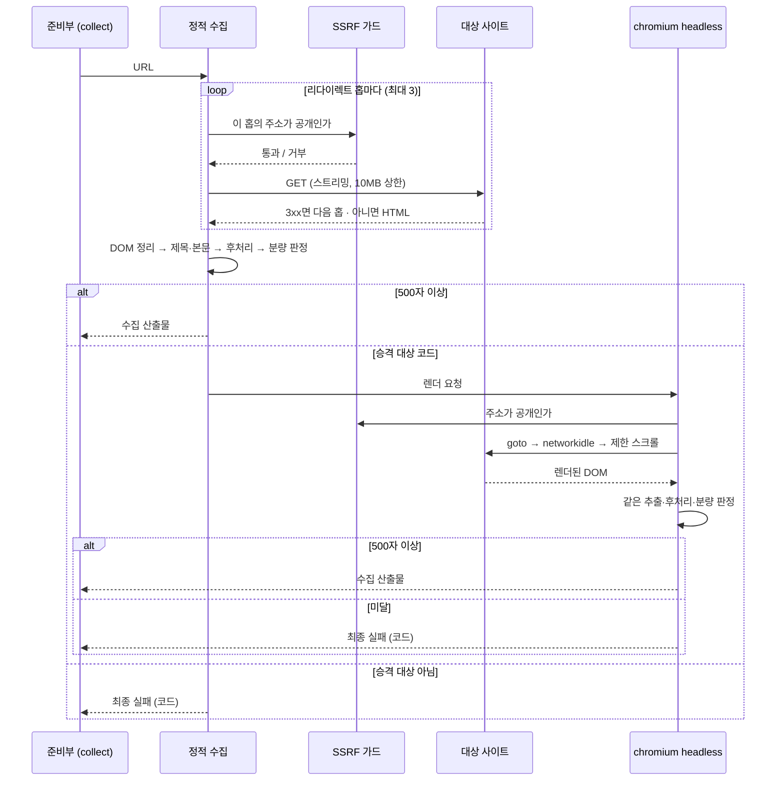
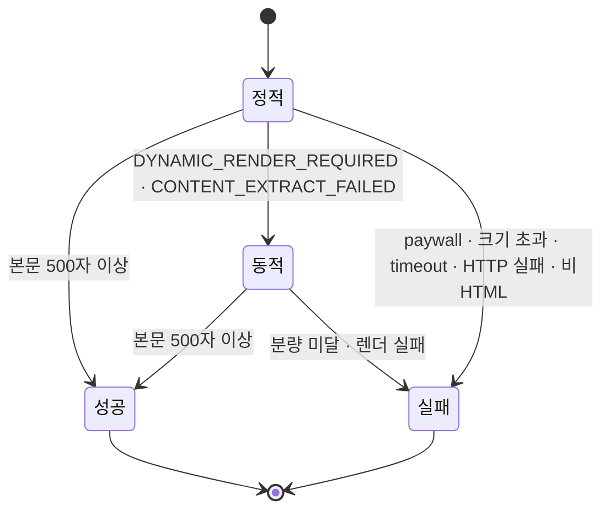

# 웹 본문 수집 — 정적 → 동적 → 최종 실패

블로그·문서 URL 하나가 **글 본문**이 되거나, 되지 못했으면 **왜 못 됐는지 코드로** 남는다. 빈손으로 성공하지 않는 것이 이 계약의 목적이다.

> `blog` 파이프라인에서 `collect`(auto) 스테이지가 하는 일의 계약이다. 스테이지의 자리와 뒤따르는 체인은 [[spec-008-gate-chain|KDEV-SPEC-008]], 수집 실패가 큐 항목 상태로 어떻게 보이는지는 [[spec-007-approval-queue|KDEV-SPEC-007]]가 소유한다.

## 1. Context

### Meta

- Decision reference: **없음.** 수집 계약은 별도 결정 문서 없이 [[baseline-007-update-lines-by-case|KDEV-BL-007]] 미결 OQ-6(「정적 → 동적 → 안 되면 최종 실패」)에서 닫혔다.
- Baseline reference: [[baseline-007-update-lines-by-case|KDEV-BL-007]] 케이스 3(블로그 글)
- Domain note: 외부에 드러나는 것은 **수집 산출물**(`url`·`source_type`·`title`·`content`·`accessed_at`)과 **실패 코드 8종**이다. DOM 파싱 방식·브라우저 구동 방식은 코드가 SoT다.
- Open questions: §7
- 이식 원본: `ax-graph` 의 `AXKG-SPEC-012` Web Adapter. **이미 도는 구현을 옮긴 것**이라 규칙을 새로 정하지 않았고, 바꾼 것은 이 레포의 산출물 모양과 `fetch_source` 인자 계약에 맞춘 부분뿐이다.

### Business Requirement

종전 경로는 `<태그>`를 정규식으로 전부 지워 페이지를 **한 덩어리 텍스트**로 만들었다. 네비게이션·푸터·사이드바가 본문에 섞이는 것도 문제지만, 결정적인 것은 다른 것이다 — **본문을 JS 로 그리는 페이지가 조용히 「본문 100자」로 성공한다.** 그 100자로 요약을 부르고, 그 요약으로 route 를 판단하고, 그 판단으로 글을 쓴다. 실패가 실패로 보이지 않는 것이 가장 나쁜 상태다.

그래서 둘을 가른다. **본문이 아닌 것을 지우고 남는 것이 글이고**, 남은 것이 모자라면 브라우저로 한 번 더 시도하고, 그래도 모자라면 **성공시키지 않는다.**

### Scope

In scope:

- 정적 → 동적 → 최종 실패 3단계와 각 단계의 판정 기준
- 어떤 실패가 브라우저로 올라가고 어떤 실패가 올라가지 않는가
- 실패 코드 8종과 각 코드의 다음 동작
- 본문 추출 계약 — 제거 대상, 제목 선정, 후처리, 분량 판정
- 크기·시간·리다이렉트·스크롤 상한과 SSRF 가드
- 수집 산출물의 모양

Out of scope:

- 수집 실패 후 큐 항목이 어떤 상태가 되는가 → [[spec-007-approval-queue|KDEV-SPEC-007]]
- `collect` 다음의 `summarize`·게이트 체인 → [[spec-008-gate-chain|KDEV-SPEC-008]]
- 유튜브(자막) · 논문 PDF 수집 — 같은 라우팅 함수의 다른 갈래다. §4 「라우팅」에 경계만 적는다
- 공부 노트(`study_note`) — **수집 단계가 아예 없다.** 본문이 이미 손에 있다
- **목록 페이지 취급** — 아래 참조

### 이식하면서 가져오지 않은 것 — 목록 페이지

원본은 링크가 15개 이상이고 본문이 짧으면 **목록 페이지로 분류해 성공**시키고, 링크들을 후보로 `metadata` 에 실어 돌려줬다. 그 결과를 받아 다시 크롤링하는 소비자가 저쪽에 있기 때문이다.

이쪽 파이프라인은 **글 한 편을 정리하는 것**이 목적이라 그 자리가 없다. 목록 URL 은 분량 미달로 그냥 실패한다 — 빈손으로 성공하는 것보다 낫다.

## 2. UX Contract

### Placement

**해당 없음.** 자동 스테이지이고 사람이 조작하는 화면이 없다. 관측 표면은 큐 항목의 상태와 실패 사유 문자열이며, 그 표시는 [[spec-007-approval-queue|KDEV-SPEC-007]]가 소유한다.

## 3. User Scenario

### S-1. System — 평범한 글은 정적에서 끝난다

1. `blog` 로 판정된 URL 을 받아 HTTP GET 한다.
2. `content-type` 에 `text/html` 이 있는지 본다. 없으면 `UNSUPPORTED_SOURCE_TYPE` 로 끝난다.
3. 제목을 먼저 읽는다 — **UI 를 지우기 전에** 읽어야 `<head>` 와 헤더에 있는 제목이 남는다.
4. 스크립트·네비·푸터·폼 등을 DOM 에서 제거하고 남은 텍스트를 뽑는다.
5. 후처리한 본문이 **500자 이상**이면 성공이다. **브라우저를 띄우지 않는다.**

### S-2. System — 본문을 JS 로 그리는 페이지

1. 정적 HTML 에 껍데기(`
`)만 있어 본문이 500자에 못 미친다.
2. 「JavaScript 를 켜라」 안내 문구가 있거나 **링크(`<a href>`)가 하나도 없으면** `DYNAMIC_RENDER_REQUIRED` 다. 그 신호가 없으면 `CONTENT_EXTRACT_FAILED` 다.
3. 두 코드 모두 **브라우저로 올라간다**. chromium headless 로 URL 을 열고, DOM 로드 → networkidle 대기 → 제한된 횟수만 스크롤한 뒤 렌더된 DOM 을 받는다.
4. 렌더 결과에 같은 추출·후처리를 적용한다. **여기서는 승격이 없다** — 500자를 넘으면 성공, 못 넘으면 최종 실패다.

### S-3. System — 올라가도 소용없는 실패

1. 정적에서 로그인·유료 안내가 본문 자리를 차지했다(`PAYWALL_OR_AUTH_REQUIRED`).
2. **브라우저로 올라가지 않는다.** chromium 을 띄워도 로그인은 안 된다 — 결과가 같은 실패에 브라우저 비용을 쓰지 않는다.
3. 크기 초과(`SOURCE_TOO_LARGE`)·timeout(`FETCH_TIMEOUT`)·HTTP 실패(`CONTENT_FETCH_FAILED`)·비HTML(`UNSUPPORTED_SOURCE_TYPE`)도 같다. 렌더해도 크기는 초과이고 느린 서버는 느리다.

### S-4. System — 동적 뒤에도 본문이 없다

1. 렌더 결과도 500자에 못 미친다.
2. `CONTENT_EXTRACT_FAILED` 로 **최종 실패**한다. 브라우저 자체가 뜨지 못했거나 렌더가 timeout 이면 `DYNAMIC_RENDER_FAILED` 다.
3. **빈 본문으로 요약을 부르지 않는다.** 실패는 호출자에게 코드와 함께 올라가고, 큐 항목이 그 상태를 진다([[spec-007-approval-queue|KDEV-SPEC-007]]).

### S-5. System — 리다이렉트가 내부 주소로 간다

1. 공개 도메인이 200 대신 리다이렉트를 돌려준다.
2. **리다이렉트를 직접 따라간다** — 매 홉마다 목적지를 DNS 로 풀어 공개 주소인지 다시 확인한다.
3. 내부·사설 주소로 풀리면 그 홉에서 거부한다. 홉 수가 상한을 넘으면 `CONTENT_FETCH_FAILED` 다.

## 4. Interface Contract

### API Contract

외부 엔드포인트가 없다. 이 계약은 파이프라인 준비부가 `collect` 스테이지에서 호출하는 **내부 수집 함수의 계약**이다.

| Method | Path | 요약 | 권한 |
|---|---|---|---|
| — | — | 해당 없음 | — |

### 라우팅 — 어느 갈래로 가나

URL 하나가 세 갈래로 갈린다. 판정은 host 와 path 만 본다.

| 조건 | 갈래 | 수집 방식 |
|---|---|---|
| `youtube.com` · `www.youtube.com` · `m.youtube.com` · `youtu.be` | `youtube` | 메타 + 자막. 자막이 100자 미만이면 실패 |
| `doi.org` · `arxiv.org` 또는 path 가 `.pdf` | `paper` | 스트리밍 다운로드 + PDF 텍스트 추출. **종전 경로를 그대로 쓴다** |
| 그 외 http(s) | `blog` | **이 spec** — 정적 → 동적 → 최종 실패 |

`paper` 가 종전 경로에 남아 있는 이유는 그쪽이 HTML 파싱이 아니라 바이트 스트림 추출이라 이 계약이 손댈 것이 없기 때문이다.

### Validation

| 항목 | 규칙 |
|---|---|
| URL scheme | `http` 또는 `https` 만. hostname 이 있어야 한다 |
| URL 해석 결과 | DNS 가 돌려준 **모든** 주소가 공개(global)여야 한다. 하나라도 사설·비공개면 거부 |
| 리다이렉트 | `301`·`302`·`303`·`307`·`308` 을 직접 따라간다. `location` 헤더가 없으면 실패 |
| 리다이렉트 홉 | **최대 3회**. 매 홉마다 위 두 검사를 다시 건다 |
| `content-type` | `text/html` 을 포함해야 한다 (정적 경로) |
| 본문 분량 | 후처리 후 **500자 이상** |
| 응답 크기 | **10MB** 이하. 스트리밍 중 누적 크기로 판정한다 |

### Case Matrix

수집 실패 8종. **「다음 동작」이 이 표의 핵심**이다 — 브라우저로 올라가는 코드는 둘뿐이다.

| 에러 코드 | 언제 | 다음 동작 |
|---|---|---|
| `DYNAMIC_RENDER_REQUIRED` | 정적 분량 미달 + JS 안내 문구가 있거나 링크가 하나도 없음 | **동적으로 올라간다** |
| `CONTENT_EXTRACT_FAILED` | 정적 분량 미달(위 신호 없음) / **동적 뒤에도 분량 미달** | 정적이면 **동적으로 올라간다**. 동적이면 **최종 실패** |
| `PAYWALL_OR_AUTH_REQUIRED` | 로그인·유료 안내 문구 + 분량 미달 | 최종 실패. 브라우저를 띄워도 로그인은 안 된다 |
| `SOURCE_TOO_LARGE` | 응답 누적 10MB 초과 | 최종 실패. 렌더해도 초과다 |
| `FETCH_TIMEOUT` | 정적 HTTP timeout | 최종 실패. 느린 서버는 렌더해도 느리다 |
| `CONTENT_FETCH_FAILED` | HTTP 오류 · `location` 없는 리다이렉트 · 홉 상한 초과 | 최종 실패 |
| `UNSUPPORTED_SOURCE_TYPE` | `content-type` 에 `text/html` 이 없음 | 최종 실패 |
| `DYNAMIC_RENDER_FAILED` | 브라우저 구동·네비게이션 실패 또는 timeout | 최종 실패 |

**승격 조건을 좁게 둔다.** 정적이 실패했다고 무조건 브라우저를 띄우지 않는다 — 위 표에서 「최종 실패」인 것들은 렌더해도 결과가 같고, 브라우저를 띄우는 비용만 든다.

`PAYWALL_OR_AUTH_REQUIRED` 판정은 **분량 미달과 함께** 걸린다. 유료 안내 문구가 페이지 어딘가에 있어도 본문이 충분하면 성공이다 — 문구 하나로 멀쩡한 글을 버리지 않는다.

### 실패가 호출자에게 가는 모양

수집 실패 예외는 **기존 수집 실패 예외를 상속한다.** 호출자의 `except` 계약을 바꾸지 않고 **코드만 늘린 것**이다 — 준비부는 수집 실패를 예외가 아니라 정상 분기로 받아 문자열로 기록하고, 사람이 남긴 메모가 있으면 그것으로 요약을 이어간다. 메모도 없으면 그 항목은 준비 실패가 된다([[spec-007-approval-queue|KDEV-SPEC-007]]).

### Flow

### State / Lifecycle

URL 하나가 거치는 단계.

**역방향이 없다.** 동적에서 정적으로 되돌아가지 않고, 동적 실패를 다시 동적으로 재시도하지도 않는다. 재시도는 항목 단위로 사람이 건다.

### Data Contract — 수집 산출물

| 필드 | 값 |
|---|---|
| `url` | **최종 URL**. 리다이렉트를 따라간 뒤의 주소이고, 동적이면 브라우저가 최종적으로 머문 주소다 |
| `source_type` | `blog` 고정 |
| `title` | `og:title` → `<title>` → 첫 `<h1>` 순으로 처음 잡히는 값. 셋 다 없으면 `null` |
| `content` | 본문. **200,000자에서 자른다** |
| `accessed_at` | 수집 시각(UTC, 초 단위) |

제목 순서에 `og:title` 이 앞서는 이유는 `<title>` 에 사이트명이 붙기 때문이다.

### 본문 추출 계약

**본문이 아닌 것을 지우고 남는 것이 글이다.**

| 항목 | 계약 |
|---|---|
| 제거 대상 | `script` · `style` · `noscript` · `svg` · `canvas` · `template` · `iframe` · `header` · `nav` · `footer` · `form` · `dialog` · `button` · `input` · `select` · `textarea` |
| 제거 시점 | **제목을 읽은 뒤.** 순서를 뒤집으면 헤더·`<head>` 의 제목이 함께 사라진다 |
| 후처리 | 연속 공백·탭을 한 칸으로, 연속 빈 줄을 하나로, **직전 줄과 같은 줄을 지운다** |
| 판정 | 후처리 후 길이가 임계값 미만이면 「본문을 못 찾았다」로 본다 |

반복 줄을 지우는 이유는 UI 를 지우고 남은 텍스트에 `더보기` 같은 줄이 수십 번 반복되기 때문이다. 그대로 두면 요약 입력의 절반이 그 줄이다.

### 한계값

| 항목 | 값 | 왜 |
|---|---|---|
| 최소 본문 길이 | 500자 | 이보다 짧으면 본문을 못 찾은 것으로 본다 |
| 최대 본문 길이 | 200,000자 | 넘으면 자른다. 요약 입력의 상한 |
| 응답 크기 상한 | 10,000,000 바이트 | 스트리밍 중 누적으로 판정 |
| 리다이렉트 홉 | 3 | |
| 정적 timeout | 15초 | |
| 네비게이션 timeout | 20초 | 브라우저가 DOM 로드까지 기다리는 시간 |
| networkidle 대기 | 8초 | **미도달은 치명적이지 않다** — 넘겨도 그 시점의 DOM 을 쓴다 |
| 스크롤 | 5회 · 회당 0.6초 대기 | 무한 스크롤 페이지에서 본문이 뒤늦게 붙는다. **끝없이 내리면 잡이 안 끝난다** |
| User-Agent | 수집기 이름을 밝힌다 | 익명 크롤러로 위장하지 않는다 |

동적까지 가는 최악의 경우 한 URL 에 **정적 15초 + 네비 20초 + networkidle 8초 + 스크롤 3초** 가 든다. 상한이 전부 유한하다는 것이 계약이다.

## 5. Implementation Rules

- **SSRF 가드는 매 리다이렉트 홉마다 다시 건다.** HTTP 클라이언트에 리다이렉트 추적을 맡기면 클라이언트가 알아서 따라가고, 그러면 **공개 도메인이 내부 주소로 리다이렉트하는 경로를 검사할 수 없다.** 그래서 추적을 끄고 직접 따라간다.
- **DNS 가 돌려준 모든 주소를 본다.** 하나만 검사하면 공개/사설을 함께 돌려주는 호스트가 통과한다.
- **브라우저는 팝업과 다운로드를 막는다.** 새 창은 열리는 즉시 닫고, 다운로드는 허용하지 않는다. 스크롤 횟수도 제한한다 — 셋 다 「잡이 끝나지 않는 상태」를 막는 장치다.
- **브라우저 모듈은 함수 안에서 불러온다.** 브라우저가 없는 환경(테스트·CI)에서 모듈을 읽는 것만으로 실패하면 안 된다. 운영 이미지에는 chromium 이 설치돼 있다(PDF 생성 잡이 이미 쓰던 의존성이다).
- **상한을 호출자가 넘길 수 있다.** timeout·크기·리다이렉트 상한과 전송 계층은 인자로 받는다. 여기서 하드코딩하면 그 인자를 준 호출자가 조용히 무시당한다.
- **정적과 동적이 같은 추출·후처리를 쓴다.** 다른 것은 HTML 을 어디서 얻었는가와 **분량 미달을 승격 신호로 볼 것인가 최종 실패로 볼 것인가** 하나뿐이다.
- **실패는 코드를 갖는다.** 「수집 실패」 한 마디로 뭉치지 않는다 — 어느 단계에서 왜 실패했는지가 남아야 재시도할지 URL 을 고칠지 판단할 수 있다.
- **성공을 만들어 내지 않는다.** 분량이 모자라면 그 상태로 실패시킨다. 빈 본문으로 요약을 부르면 이후 전부가 근거 없는 산출물이 된다.

## 6. Verification

### Acceptance Criteria

`app/back/tests/test_web_collect.py` 가 계약을 고정한다. 네트워크도 브라우저도 쓰지 않고 fetcher·renderer 를 주입해 검사한다.

- [x] UI(네비·헤더·스크립트·푸터)가 본문에 섞이지 않는다 — `TestExtraction::test_ui_is_not_content`
- [x] `og:title` 이 `<title>` 보다 우선한다 — `TestExtraction::test_og_title_wins_over_the_title_tag`
- [x] 반복되는 줄이 하나로 접힌다 — `TestExtraction::test_repeated_lines_collapse`
- [x] 평범한 글은 정적에서 끝나고 **브라우저가 뜨지 않는다** — `TestEscalation::test_static_is_enough_for_a_plain_article`
- [x] 껍데기만 있는 정적 HTML 은 브라우저로 올라가 본문을 얻는다 — `TestEscalation::test_short_static_escalates_to_the_browser`
- [x] 「JavaScript 를 켜라」 안내가 승격을 일으킨다 — `TestEscalation::test_javascript_notice_escalates`
- [x] **paywall 은 승격하지 않는다** — `TestEscalation::test_paywall_does_not_escalate`
- [x] **크기 초과는 승격하지 않는다** — `TestEscalation::test_size_limit_does_not_escalate`
- [x] 동적 뒤에도 분량 미달이면 최종 실패다 — `TestEscalation::test_still_short_after_rendering_is_the_final_failure`
- [x] `text/html` 이 아닌 응답은 거부된다 — `TestStaticGuards::test_non_html_is_refused`
- [x] 분량 임계값이 문서화된 상수와 같이 움직인다(테스트가 값을 다시 적지 않는다) — `TestStaticGuards::test_the_threshold_is_the_documented_one`
- [x] 글 URL 이 **종전 정규식 경로가 아니라** 이 경로로 라우팅된다 — `TestRouting::test_blog_urls_go_through_the_new_path`

실환경 확인도 했다 — 정적으로 끝나는 페이지 1건 수집, 본문이 짧은 페이지 1건이 동적까지 올라갔다가 최종 실패(설계대로이고, 브라우저가 실제로 떴다는 증거다).

## 7. Open Questions

- **(OPEN)** 동적 경로의 SSRF 검사는 브라우저를 열기 **전 1회**뿐이다. 페이지가 브라우저 안에서 다시 리다이렉트하거나 서브리소스를 부르는 경로에는 가드가 걸리지 않는다. 실제 위험도와 대응(프록시 경유 등)은 정하지 않았다.
- **(OPEN)** paywall·JS 안내 판정이 **고정 문구 목록**이다(영어 몇 개 + 한국어 몇 개). 목록 밖 문구를 쓰는 사이트는 paywall 이 승격 대상으로 잘못 분류되어 브라우저 비용만 쓴다. 문구를 늘릴지, 다른 신호로 바꿀지 미정.
- **(OPEN)** 목록 페이지를 「분량 미달 실패」로 두는 것이 실제 사용에서 충분한지. 실패 코드가 `CONTENT_EXTRACT_FAILED` 라 사람이 보면 「본문을 못 찾았다」로만 읽히고, 목록 URL 을 잘못 넣었다는 사실은 드러나지 않는다.
- **(OPEN)** 수집 실패 항목의 재시도 정책. 지금은 사람이 항목 단위로 다시 건다 — 일시적 실패(timeout·5xx)에 자동 재시도를 둘지는 큐 쪽에서 정할 일이다.
