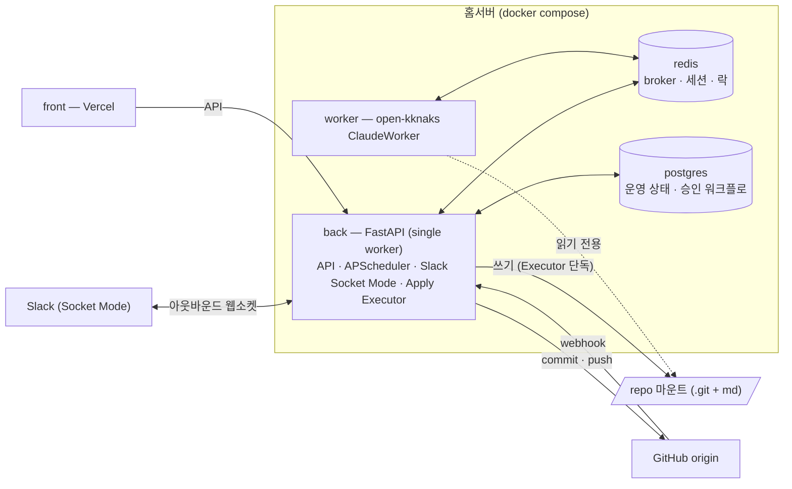
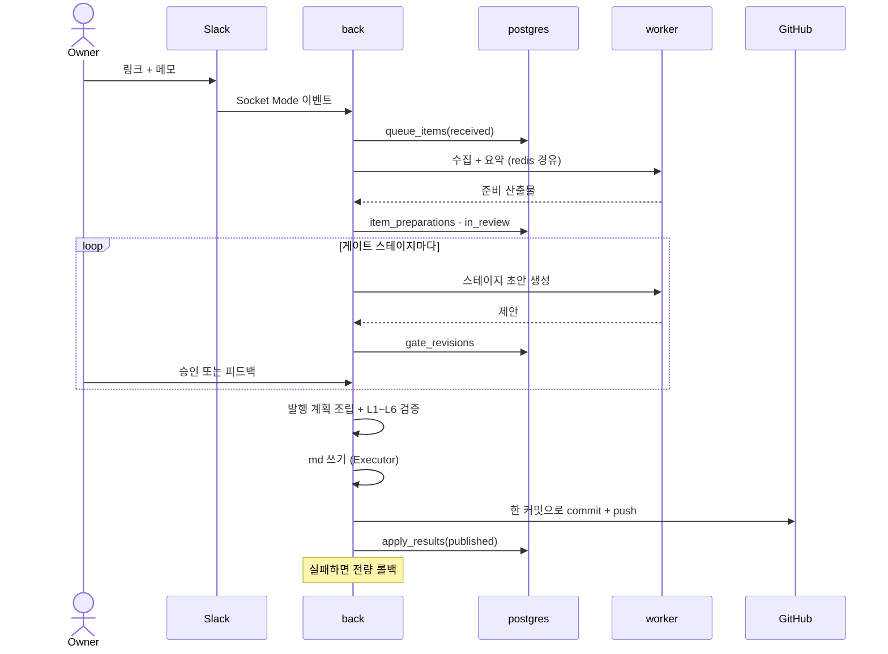
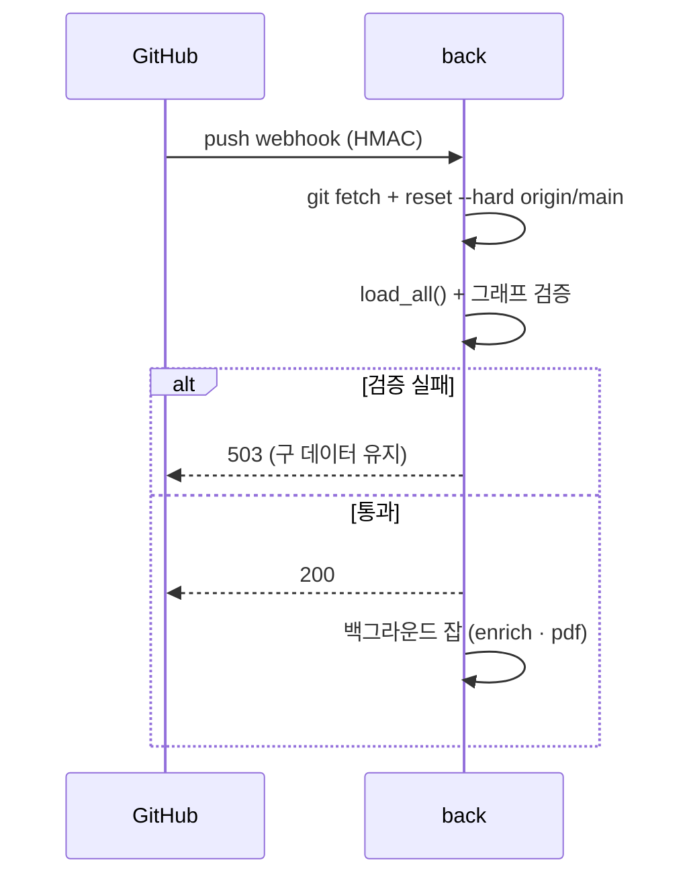

# System Architecture

규칙: `rules/product-doc-pipeline.md`

> 시스템 구성요소, 외부 연동, 주요 요청 흐름을 관리한다.

관련 decision: [[decision-013-slack-bridge-into-backend|KDEV-DEC-013]](프로세스 경계) · [[decision-012-draft-storage-and-publish-boundary|KDEV-DEC-012]](쓰기 소유권) · [[decision-017-product-registry-and-admin-scaffold|KDEV-DEC-017]](계층 규약 첫 적용)

## Overview



## Components

| Component | Responsibility | Notes |
|---|---|---|
| `back` | HTTP API · 스케줄 잡 · **Slack Socket Mode** · 승인 큐 · 게이트 · **Apply Executor** | `--workers 1` 하드락. `_check_single_worker()`가 멀티워커를 raise로 금지한다 — APScheduler·Socket Mode가 in-process 장기 루프이기 때문 |
| `worker` | open-kknaks Claude 실행 | 자체 `Dockerfile.worker`, back을 임포트하지 않는 **독립 프로세스**. repo는 `:ro` 마운트라 파일을 쓸 수 없다 |
| `redis` | open-kknaks broker · Slack 스레드 세션 · 이벤트 멱등 키 · 스레드 락 | 휘발. 영속 워크플로 SoT로 쓰지 않는다 |
| `postgres` | 운영 상태 · 승인 워크플로 · 승인 전 초안 | `../database/README.md` |
| `front` | 공개 사이트 + admin 화면 | Vercel. 공개에는 게시 판정 통과분만 노출 |

`app/scripts/run_*.py`는 컨테이너가 아니라 **수동 dev 러너**다. back 모듈을 `sys.path`로 임포트해 잡을 1회 실행한다.

## 쓰기 소유권 경계

파이프라인의 안전 경계는 **누가 파일과 git을 건드릴 수 있는가**로 정의된다.

| 주체 | 파일 쓰기 | git commit/push | DB 쓰기 |
|---|---|---|---|
| AI (worker 경유) | ✗ | ✗ | ✗ |
| Slack 어댑터 (back 내부) | ✗ | ✗ | 큐 적재만 |
| 게이트 로직 (back) | ✗ | ✗ | ○ |
| **Apply Executor (back)** | **○** | **○** | ○ |
| 스케줄 잡 (back) | ○ *(전환 예정)* | ○ *(전환 예정)* | — |

- **AI는 계획만 낸다.** 파일·DB·git을 직접 건드리지 않는다([[decision-012-draft-storage-and-publish-boundary|KDEV-DEC-012]] D2).
- **쓰기는 back 프로세스 하나에 모인다.** 현재 `app/slack_bridge/run.py`가 별도 컨테이너에서 `atomic_write` + `commit_and_push`를 직접 수행하는데, 이 경로가 [[decision-013-slack-bridge-into-backend|KDEV-DEC-013]]로 제거된다.
- 잔디·algorithm·content_enrich 잡은 아직 직접 커밋한다. 순차적으로 Executor 경유로 전환한다.

## 백엔드 계층 규약

`app/back` 은 **api → service → repository** 3계층으로 짓는다. 공용 순수 함수는 `utils`, 횡단 관심사는 `core` 다.

```text
api/          HTTP 경계.  요청·응답 스키마(pydantic) · 인증 의존성 · 상태코드 · 도메인 예외 → HTTP 매핑
service/      도메인 규칙. 트랜잭션 경계 · 검증 · 오케스트레이션(파일·git·외부 API)
repository/   DB 접근 전담. select/insert/update · ORM 모델을 다루는 유일한 자리
utils/        순수 함수.  도메인·DB·HTTP 어느 것도 모른다
core/         횡단.       db.py(세션·엔진) · models.py(ORM) · security.py · i18n.py
```

### 계층별 금지

| 계층 | 하면 안 되는 것 |
|---|---|
| `api` | `select()` 직접 호출 · ORM 모델 조작 · 도메인 규칙 판단 |
| `service` | `HTTPException`·`Request`/`Response` 사용 · `select()` 직접 호출 |
| `repository` | 도메인 규칙 · HTTP · 외부 I/O(git·LLM·네트워크) |
| `utils` | 도메인·DB·HTTP 의존 |

**예외는 도메인 예외로 올리고 라우터가 HTTP 로 바꾼다.** 선례가 이미 있다 — `service/pipeline/gates.py` 의 `GateError` 를 `api/routers/queue.py:414 _gate_error()` 가 `HTTPException` 으로 매핑한다. `PersonaError`·`SourceFetchError`·`UnknownCareerError` 도 같은 형태다. 이 규약은 그 관행을 전 계층으로 넓힌 것이다.

### 계층 간 데이터 이동 — DTO

**계층을 넘는 데이터는 pydantic 모델로 옮긴다.** dict 를 그대로 넘기지 않는다 — 키 오타가 런타임까지 살아남고, 어느 계층이 무엇을 넣었는지 추적이 안 된다.

| 경계 | 무엇이 오가나 | 정의 위치 |
|---|---|---|
| client ↔ `api` | 요청·응답 모델 | `api/schemas/{domain}.py` |
| `api` ↔ `service` | 도메인 DTO | `service/{domain}/dto.py` |
| `service` ↔ `repository` | 도메인 DTO | 같은 곳 |
| `repository` ↔ DB | **ORM** (`core/models.py`) | **밖으로 나가지 않는다** |

두 규칙이 핵심이다.

1. **ORM 객체는 `repository` 밖으로 나가지 않는다.** repository 가 ORM ↔ DTO 변환을 책임진다. ORM 이 service 로 새면 lazy load·세션 수명·`expire_on_commit` 이 도메인 코드로 번지고, service 가 DB 세션을 알아야 하는 상태로 되돌아간다.
2. **요청·응답 모델과 도메인 DTO 를 같은 클래스로 겸하지 않는다.** 겸하면 HTTP 표면을 바꿀 때 도메인이 따라 바뀌고, 반대로 도메인 필드가 의도치 않게 API 로 새어 나간다.

`api/schemas/` 는 `queue.py` 가 라우터 파일 안에 `BaseModel` 을 두던 방식을 대체한다 — 신규 도메인만 해당하고, 레거시는 아래 적용 경계대로 그대로 둔다.

### 현행 실측 (2026-08-03)

**`repository` 계층이 없다.** DB 접근이 api 와 service 양쪽에 흩어져 있다.

| 위치 | 상태 |
|---|---|
| `api/routers/queue.py` | 690줄. `select()` **8회 직접 호출** + ORM 모델 import + 서비스 호출 혼재 |
| `api/routers/auth.py` | 직접 쿼리 |
| `service/**` | 9개 파일이 `select()` 직접 호출 (`gates`·`driver`·`prepare`·`chain`·`intake`·`executor`·`seed`·`review_alert`·`repo_registry`) |
| `utils/` | `meta_helpers.py` 하나뿐 |

### 적용 경계 — 신규만 지킨다

**레거시 일괄 리팩터를 하지 않는다.** 이유는 WORK-017 이 구 경로 제거를 P5 한 곳에 가둔 것과 같다 — 회귀면을 넓히면 그 자체가 위험이고, `queue.py` 690줄은 승인 파이프라인 전체가 지나는 길목이다.

- **새 도메인은 예외 없이 3계층으로 짓는다.** 첫 적용 대상은 제품 레지스트리([[decision-017-product-registry-and-admin-scaffold|KDEV-DEC-017]])다.
- **레거시를 만질 일이 생기면 그때 그 도메인만 옮긴다.** 만지지 않는 코드는 그대로 둔다.
- 새 코드가 `queue.py` 를 **패턴 참고용으로 복사하지 않는다** — 라우터 구조(`APIRouter(prefix=…, dependencies=[Depends(require_admin)])`)는 따르되 그 안의 직접 쿼리는 따르지 않는다.

## External Integrations

| System | Purpose | Direction | Notes |
|---|---|---|---|
| Slack | 지식 입력 접수 | **아웃바운드 웹소켓**(Socket Mode) | 공개 URL·포트 불필요. 앱 토큰 + 봇 토큰 |
| GitHub | 발행 대상 origin · webhook 트리거 | 양방향 | push는 `extraheader` 인증, webhook은 HMAC 검증 |
| open-kknaks | AI 실행 | Redis broker 경유 | back이 제출, worker가 실행. 세션 resume 지원 |
| YouTube | 메타·자막 수집 | 아웃바운드 | `yt-dlp` + `youtube-transcript-api` |
| Vercel | 프론트 호스팅 | — | 공개 사이트 + admin 화면 |

## Key Flows

### 1. 지식 캡처 → 승인 → 발행



### 2. GitHub webhook → reload



`reset --hard`가 **origin에 없는 로컬 변경을 지운다.** 이것이 승인 전 초안을 DB에 두고, 발행 실패 시 커밋까지 되돌리는 근거다([[decision-012-draft-storage-and-publish-boundary|KDEV-DEC-012]] D5).

### 3. 스케줄 잡

| 잡 | 시각 | 산출 | 현재 |
|---|---|---|---|
| daily-activity (잔디) | 09:05 KST | `persona/daily/{date}.md` | 직접 커밋 |
| neetcode-canonical | 23:00 UTC | `persona/algorithms/A-NNN.md` | 직접 커밋 |
| content_enrich | webhook 백그라운드 | `persona/contents/C-*.md` | 직접 커밋 |
| pdf_generate | webhook 백그라운드 | 이력서·포트폴리오 PDF | 직접 커밋 |

앞의 셋은 승인 파이프라인으로 편입 예정이다. `pdf_generate`는 지식이 아니라 파생 산출물이라 대상이 아니다.

## Open

- 스케줄 잡의 Executor 전환 순서 — 유튜브 체인 검증 후 결정한다([[decision-011-approval-gate-chain|KDEV-DEC-011]] 보류).
- 웹소켓 task가 반복 실패할 때 back을 종료할지 캡처만 비활성화할지([[decision-013-slack-bridge-into-backend|KDEV-DEC-013]] OQ-1).
- back 단일 워커 제약의 지속 여부. APScheduler·Socket Mode가 둘 다 in-process라 유지되며, 벗어나려면 분산 락이 선행돼야 한다.
