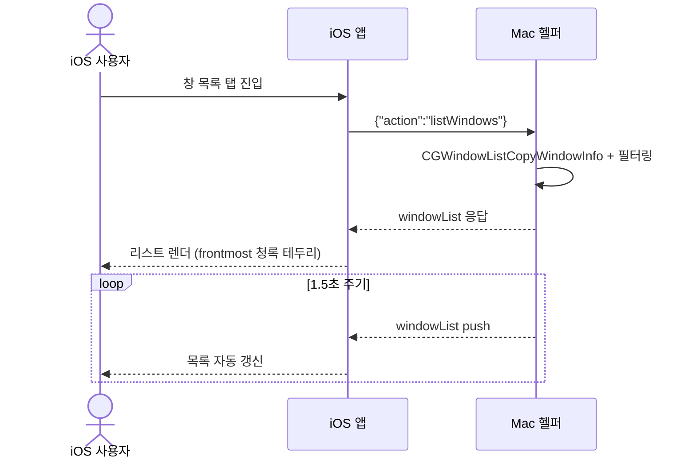
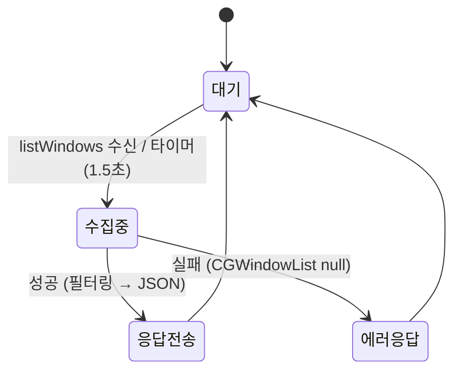

# 창 목록 수집

Mac에서 현재 화면에 표시된 일반 창 목록을 수집해 iOS 앱이 어떤 창이 열려 있는지 표시·전환할 수 있게 하는 기반 데이터를 보장한다.

> 원본: `mac-remote/doc/spec/Spec-01-window-list.md`. 결정 근거는 [[decision-002-cgwindowlist-window-source|MRT-DEC-002]].

## Context

- 관련 decision: [[decision-002-cgwindowlist-window-source|MRT-DEC-002]] (CGWindowList를 창 소스로 채택)
- 비즈니스 요구: iOS 앱이 Mac의 열린 창을 보고 골라 전환하려면, 먼저 신뢰할 수 있는 창 목록 데이터가 필요하다. 모든 후속 기능(창 활성화·아이콘)의 기반.
- 관련 work: [[work-001-cli-prototype|MRT-WORK-001]] (CLI 프로토타입), [[work-005-websocket-server|MRT-WORK-005]] (계약 windowList 메시지)
- 범위
  - In: CGWindowListCopyWindowInfo 호출, 필터링, WindowInfo 모델 정의, windowList 메시지
  - Out: 창 활성화([[spec-002-window-focus|MRT-SPEC-002]]), 화면 캡처/썸네일, 앱 아이콘([[spec-004-app-icon|MRT-SPEC-004]])

## UX Contract

iOS 앱의 "창 목록" 탭이 본 spec이 보장하는 데이터를 사용자에게 보여주는 단일 화면이다.

### Placement

iOS 앱 하단 탭의 "창 목록" 탭. 세로 리스트 + 카드형 아이템.

```text
+──────────────────────────────+
│ 창 목록            ● 연결됨    │
+──────────────────────────────+
│ ┌──────────────────────────┐ │
│ │ Arc                  ◉    │ │  ← frontmost: 청록 테두리
│ │ 디자인 레퍼런스 — 12개 탭 │ │
│ ├──────────────────────────┤ │
│ │ Xcode                     │ │
│ │ MacroHelper — AppDeleg…  │ │  ← 긴 제목 말줄임
│ └──────────────────────────┘ │
+──────────────────────────────+
```

### U-1. 창 목록 리스트

- **상태**: 정상 — 열린 창이 카드로 나열, frontmost 창에 청록 테두리 / 빈 — "열린 창이 없습니다" / 미연결 — 상단 연결 표시등 빨간색, 목록 비활성
- **문구**: 헤더 "창 목록", 빈 상태 "열린 창이 없습니다". 권한 없으면 제목 자리에 앱 이름만 노출
- **CTA**: 카드 탭 → 해당 창 focus([[spec-002-window-focus|MRT-SPEC-002]]), 햅틱 피드백 / Pull-to-refresh → listWindows 재요청
- **기대 결과**: 카드 탭 시 focus 명령 전송, 당겨서 새로고침 시 리스트 갱신. 1.5초 주기 push로 자동 갱신

## User Scenario

actor는 iOS 앱 사용자. 화면 조작은 단순하나, 권한·연결·빈 상태·경계 흐름을 빠짐없이 박는다.

### S-1. iOS 사용자 — 창 목록 조회 (정상)

1. "창 목록" 탭 진입
2. 앱이 Mac 헬퍼에 `{"action":"listWindows"}` 전송
3. 헬퍼가 CGWindowListCopyWindowInfo 호출 → 필터링 → `windowList` 응답
4. 앱이 리스트 렌더링, frontmost 창에 청록 테두리
5. 이후 헬퍼가 1.5초마다 `windowList` push → 목록 자동 갱신 (새 창 열림/닫힘은 다음 push 주기에 반영)

### S-2. iOS 사용자 — 권한·실패·경계

1. (권한 없음) Screen Recording 권한이 없으면 창 제목이 빈 문자열로 옴 → 앱 이름만 표시, 에러 없이 동작
2. (빈 상태) 일반 창이 0개면 빈 배열 응답 → "열린 창이 없습니다" 빈 상태 UI
3. (미연결) Step 2에서 WebSocket 미연결이면 연결 표시등 빨간색 → 재연결 후 재요청
4. (수집 실패) CGWindowList null 반환 시 500ms 후 자동 재시도(최대 3회), 실패 지속 시 빈 목록
5. (경계) 같은 앱의 창 여러 개는 각각 별도 카드(제목으로 구분), 긴 제목은 iOS에서 말줄임, 빠르게 열고 닫는 창은 일시적 불일치 허용(다음 push에 수렴)

## FE Contract

iOS 앱이 지켜야 하는 외부 계약.

- `windows` 배열을 파싱해 카드 리스트로 렌더. 파싱 실패 시 기존 목록을 유지(깜빡임 방지)
- frontmost == true 카드에 청록 테두리. 목록 중 최대 1개만 frontmost
- 제목이 빈 문자열이면 앱 이름만 표시. 긴 제목은 말줄임 처리
- 빈 배열이면 "열린 창이 없습니다" 빈 상태 UI, 미연결이면 연결 표시등 빨간색

## BE Contract

Mac 헬퍼가 제공해야 하는 메시지와 동작.

### 메시지

| 방향 | 이름 | 설명 |
|------|------|------|
| iOS → Mac | `listWindows` | 창 목록 요청 |
| Mac → iOS | `windowList` | 창 목록 응답 (주기적 1.5초 push에도 사용) |

#### 요청 예시

```json
{"action":"listWindows"}
```

#### 응답 예시

```json
{
  "type":"windowList",
  "windows":[
    {"id":123,"app":"Arc","title":"디자인 레퍼런스 — 12개 탭","frontmost":true},
    {"id":124,"app":"Xcode","title":"MacroHelper — AppDelegate.swift","frontmost":false},
    {"id":125,"app":"Terminal","title":"bash","frontmost":false}
  ]
}
```

### 동작 규칙

- 헬퍼는 `listWindows` 수신 또는 1.5초 타이머로 수집 → 필터링 → `windowList` 전송
- 재시도: `NULL_LIST`(CGWindowList null)는 500ms 간격 최대 3회 재시도. `EMPTY_TITLE`(권한 문제)은 재시도하지 않음
- frontmost는 NSWorkspace로 판별

## Validation

수집 결과 필터링 규칙 — 어떤 창이 목록에 포함되는가.

| 검증 항목 | 규칙 | 검증 위치 | 실패 시 동작 |
|-----------|------|-----------|-------------|
| kCGWindowLayer | == 0 (일반 창만) | Back (Mac) | 해당 창 제외 |
| kCGWindowOwnerName | 빈 문자열 아닐 것 | Back (Mac) | 해당 창 제외 |
| 시스템 프로세스 | `excludedProcesses`에 포함되지 않을 것 | Back (Mac) | 해당 창 제외 |
| windows 배열 | JSON 배열일 것 | Front (iOS) | 파싱 실패 시 기존 목록 유지 |

## Case Matrix

에러·경계 케이스의 단일 SoT.

| 에러/케이스 | 발생 조건 | 백엔드(Mac) 처리 | 프론트(iOS) 출력 | 표시 위치 |
|---|---|---|---|---|
| `EMPTY_TITLE` | Screen Recording 권한 없음 | 경고 로그, 빈 제목으로 계속 동작 (재시도 X) | 앱 이름만 표시 + "화면 기록 권한을 허용하면 창 제목이 표시됩니다" | 카드 / 안내 배너 |
| `NULL_LIST` | CGWindowList null 반환 | 500ms 간격 최대 3회 재시도 후 빈 배열 | "창 목록을 가져올 수 없습니다" | 리스트 영역 |
| `NO_WINDOWS` | 일반 창 0개 | 빈 배열 정상 반환 | "열린 창이 없습니다" 빈 상태 UI | 리스트 영역 |
| 미연결 | WebSocket 미연결 | — | 연결 표시등 빨간색, 재연결 후 재요청 | 상단 표시등 |

## Flow



## State Machine



| 현재 상태 | 이벤트 | 다음 상태 | 액션 | 비고 |
|-----------|--------|-----------|------|------|
| 대기 | listWindows 수신 | 수집 중 | CGWindowListCopyWindowInfo 호출 | |
| 수집 중 | 성공 | 응답 전송 | 필터링 → JSON 생성 → 전송 | |
| 수집 중 | 실패 | 에러 응답 | 에러 메시지 전송 | CGWindowList null 반환 |
| 대기 | 타이머(1.5초) | 수집 중 | 주기적 push | 폴링 방식 |

## Data Contract

외부에 드러나는 resource와 enum.

```text
Entity: WindowInfo
├── id: Int           — kCGWindowNumber, 창 고유 ID (세션 내 고유)
├── app: String       — kCGWindowOwnerName, 앱 이름
├── title: String     — kCGWindowName, 창 제목 (빈 문자열 가능)
├── pid: Int          — kCGWindowOwnerPID, 프로세스 PID
└── frontmost: Bool   — 현재 최전면 창 여부 (목록 중 최대 1개 true)
```

| 필드 | 제약 | 비고 |
|------|------|------|
| id | 양의 정수, 시스템이 부여 | 세션 내 고유 |
| app | 빈 문자열 제외 | 빈 OwnerName은 필터링 |
| title | 빈 문자열 허용 | Screen Recording 권한 없으면 항상 빈 문자열 |
| pid | 양의 정수 | 실행 중 프로세스에 한함 |
| frontmost | 목록 중 최대 1개만 true | NSWorkspace로 판별 |

```swift
// 필터링에서 제외할 시스템 프로세스
let excludedProcesses = ["Window Server", "Dock", "SystemUIServer", "Control Center", "Notification Center"]
```

## Work Handoff

이 spec의 계약 표면을 work의 Acceptance Criteria로 가져간다. 구현 완료 체크리스트는 아래 work 문서에 둔다.

| Work | 범위 |
|---|---|
| [[work-001-cli-prototype\|MRT-WORK-001]] | 창 목록 수집 + 필터 + WindowInfo 모델 (CLI) |
| [[work-005-websocket-server\|MRT-WORK-005]] | 계약 windowList 메시지 (WS 서버) |

## Open Questions

- 없음 (구현·릴리즈 완료)
