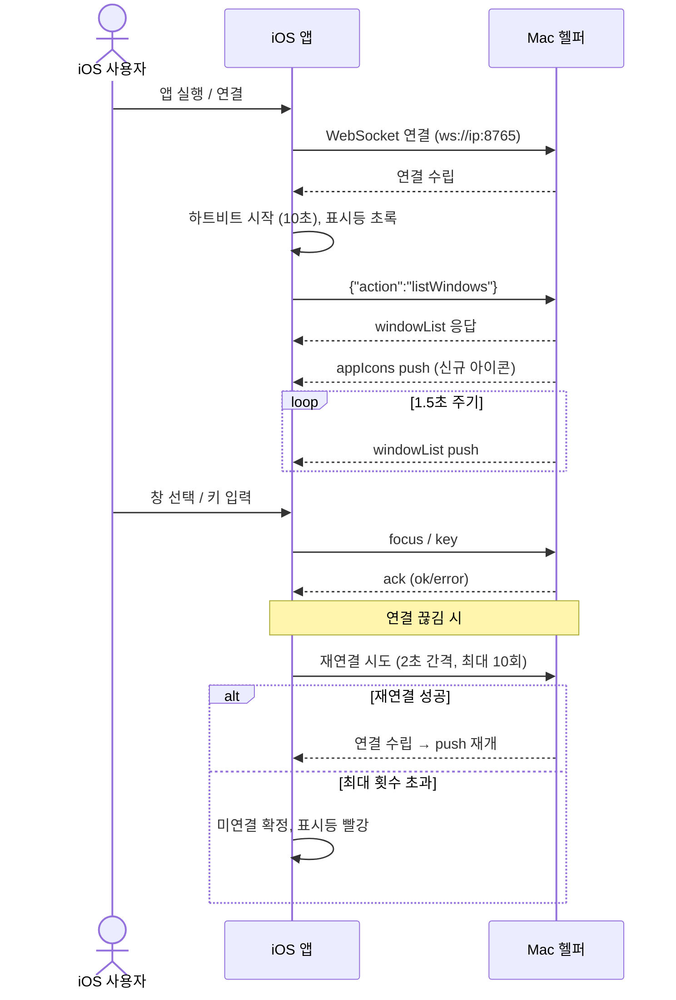
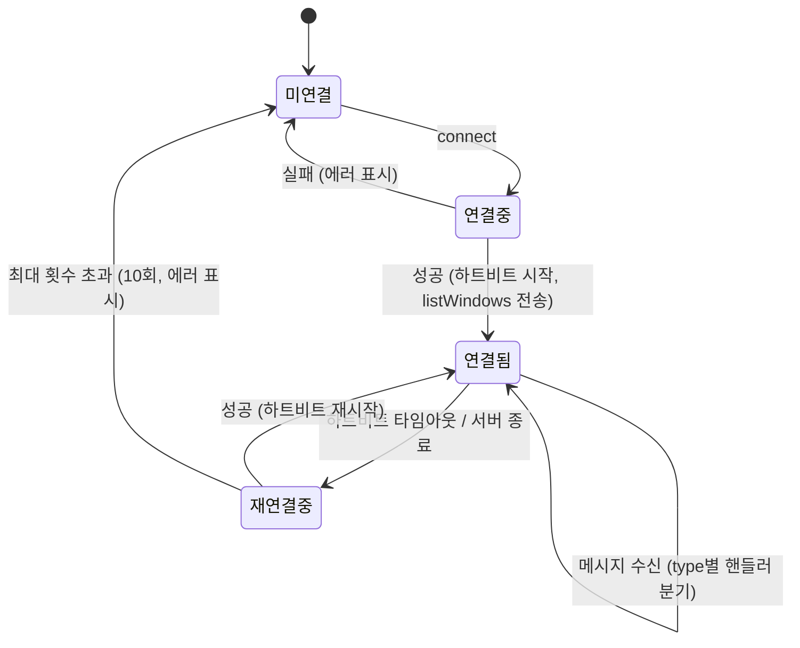

# WebSocket 통신 프로토콜

Mac 헬퍼(서버)와 iOS 앱(클라이언트) 간의 모든 통신이 단일 JSON WebSocket 메시지 규약을 따르고, 연결이 끊겨도 자동 재연결·하트비트로 상태를 유지함을 보장한다. 모든 메시지는 `action`(요청) / `type`(응답) 필드로 분기한다.

> 원본: `mac-remote/doc/spec/Spec-05-websocket-protocol.md`. 결정 근거는 [[decision-001-websocket-protocol|MRT-DEC-001]], [[decision-005-swifter-ws-library|MRT-DEC-005]].

## Context

이 spec은 Spec-01~04의 기능들이 공통으로 올라타는 통신 계층을 정의한다.

- 관련 decision: [[decision-001-websocket-protocol|MRT-DEC-001]] (WebSocket 프로토콜 채택), [[decision-005-swifter-ws-library|MRT-DEC-005]] (Swifter WS 라이브러리)
- 비즈니스 요구: iOS 앱이 Mac을 실시간 원격 제어하려면 양방향·저지연 통신과 끊김에 강한 자동 복구가 필요하다. 모든 기능 메시지(창 목록·포커스·키 입력·아이콘·권한)가 이 단일 규약 위에서 동작한다.
- 의존: [[spec-001-window-list|MRT-SPEC-001]], [[spec-002-window-focus|MRT-SPEC-002]], [[spec-003-key-input|MRT-SPEC-003]], [[spec-004-app-icon|MRT-SPEC-004]]
- 관련 work: [[work-005-websocket-server|MRT-WORK-005]] (WS 서버), [[work-009-ws-client|MRT-WORK-009]] (WS 클라이언트)
- 범위(In/Out)
  - In: 메시지 포맷 정의, 연결/재연결, 하트비트, 주기적 push
  - Out: 각 기능의 비즈니스 로직(Spec-01~04), 페어링(Spec-07)

## UX Contract

이 spec은 통신 프로토콜이라 직접 노출되는 화면 조작은 없으나, 연결 lifecycle이 사용자에게 드러나는 단일 컴포넌트로 **연결 표시등**이 있다.

### Placement

iOS 앱 전체 화면 상단의 연결 표시등(작은 원형 인디케이터). 별도 화면/모달은 `해당 없음` (통신 프로토콜로 직접 노출되는 화면 없음).

```text
+──────────────────────────────────────────────────+
│ <화면 제목>                          ● 연결됨      │  ← 우상단 연결 표시등
+──────────────────────────────────────────────────+
```

### U-1. 연결 표시등

- **상태**: 연결됨 — 초록 / 재연결 중(하트비트 타임아웃·연결 끊김) — 노랑 / 미연결(최대 재시도 초과·서버 연결 불가) — 빨강. State Machine의 연결 상태와 1:1.
- **문구**: 미연결 시 "Mac 헬퍼에 연결할 수 없습니다", "연결할 수 없습니다" (원인별). 같은 Wi-Fi 확인 안내.
- **CTA**: 직접 조작 없음(자동). 미연결 지속 시 설정에서 IP 재입력 / QR 재스캔 유도.
- **기대 결과**: 연결 상태 변화가 표시등 색상에 실시간 반영. (색상은 Case Matrix 표시 위치 컬럼과 일치)

## User Scenario

actor는 iOS 앱과 Mac 헬퍼. 화면 조작이 거의 없으므로 연결 수립·메시지 교환·복구를 시스템 경계 흐름으로 박는다.

### S-1. iOS 앱 · Mac 헬퍼 — 연결 수립과 메시지 교환 (정상)

1. iOS 앱이 `ws://{ip}:{port}`(기본 8765)로 WebSocket 연결 시도
2. 연결 성공 → 앱이 하트비트(10초) 시작, 표시등 초록
3. 앱이 `{"action":"listWindows"}` 전송
4. 헬퍼가 `windowList` 응답 + 신규 앱 아이콘 `appIcons` push
5. 이후 헬퍼가 1.5초마다 `windowList` push 지속
6. 사용자 액션 시 앱이 `focus`/`key` 전송 → 헬퍼가 `ack` 응답 (각 요청에 1:1)

### S-2. iOS 앱 · Mac 헬퍼 — 분기·실패·복구

1. (연결 실패) Step 1에서 IP/포트 오류·다른 Wi-Fi면 연결 불가 → 재연결 시도(2초 간격, 최대 10회), 표시등 빨강, "연결할 수 없습니다"
2. (연결 끊김) Step 5 중 Mac 헬퍼 종료·네트워크 끊김 → 재연결 중(표시등 노랑) → 성공 시 push 자동 재개
3. (하트비트 타임아웃) 10초간 pong 없음 → 기존 소켓 닫고 재연결(노랑 → 실패 지속 시 빨강)
4. (최대 재시도 초과) 재연결 10회 실패 → 미연결 확정, 표시등 빨강, 수동 재실행/재연결 안내

### S-3. iOS 앱 · Mac 헬퍼 — 경계 (엣지 케이스)

1. (동시 요청) 앱이 여러 요청을 동시에 보내면 헬퍼가 순차 처리하고 각각 `ack` 반환 (BE Contract 동작 규칙)
2. (대용량 메시지) 매우 큰 `appIcons` 메시지는 WebSocket 프레임 분할로 자동 전송 (BE Contract 동작 규칙)
3. (Wi-Fi 변경) 연결 끊김 → 재연결 시도 → 새 IP면 실패하여 미연결
4. (Mac 슬립) 연결 끊김 → 깨어나면 재연결
5. (앱 백그라운드) 연결 유지하되, 포그라운드 복귀 시 재연결 확인

## FE Contract

iOS 앱이 지켜야 하는 외부 계약 — 상태, 메시지 파싱, 렌더 책임.

- 수신 메시지를 `type` 필드로 분기해 핸들러 라우팅. 정의되지 않은 `type`은 메시지 무시.
- 유효한 JSON 객체가 아니면 메시지 무시(로그). 위치 의존 파싱 금지 — 필드명으로만 접근.
- 연결 상태를 표시등에 실시간 렌더: 연결됨 초록 / 재연결 중 노랑 / 미연결 빨강.
- 연결 끊김 감지 시 자동 재연결(2초 간격, 최대 10회) 수행. 하트비트(10초) pong 누락 시 재연결로 전환.

## BE Contract

Mac 헬퍼가 제공해야 하는 메시지와 동작. REST가 아닌 WebSocket 양방향 JSON 메시지 규약이다.

### 메시지 목록

| 방향 | 이름 | 설명 | 상세 스펙 |
|------|------|------|-----------|
| iOS → Mac | `listWindows` | 창 목록 요청 | Spec-01 §3 |
| iOS → Mac | `focus` | 창 활성화 요청 | Spec-02 §3 |
| iOS → Mac | `key` | 키 입력 요청 | Spec-03 §3 |
| iOS → Mac | `getPermissions` | 권한 상태 요청 | Spec-06 §3 |
| Mac → iOS | `windowList` | 창 목록 응답/push | Spec-01 §3 |
| Mac → iOS | `appIcons` | 앱 아이콘 push | Spec-04 §3 |
| Mac → iOS | `permissions` | 권한 상태 응답 | Spec-06 §3 |
| Mac → iOS | `ack` | 액션 결과 응답 | Spec-02, 03 §3 |

### Request / Response 상세

#### iOS → Mac 요청 예시

```json
{"action":"listWindows"}
{"action":"focus","windowId":123}
{"action":"key","key":"c","modifiers":["cmd"]}
{"action":"key","key":"4","modifiers":["cmd","shift"]}
{"action":"getPermissions"}
```

#### Mac → iOS 응답 예시

```json
{"type":"windowList","windows":[
  {"id":123,"app":"Arc","title":"디자인 레퍼런스","frontmost":true},
  {"id":124,"app":"Xcode","title":"AppDelegate.swift","frontmost":false}
]}
{"type":"appIcons","icons":{"Arc":"<base64png>","Xcode":"<base64png>"}}
{"type":"permissions","accessibility":true,"screenRecording":false}
{"type":"ack","action":"focus","ok":true}
{"type":"ack","action":"key","ok":false,"error":"unknown key: xyz"}
```

### 동작 규칙

- 정의되지 않은 `action`은 `ack:false` 에러 응답으로 처리. 유효하지 않은 JSON은 메시지 무시(로그).
- 동시 요청은 순차 처리하고 각각 `ack` 반환.
- 대용량 `appIcons` 메시지는 WebSocket 프레임 분할로 자동 전송.
- **주기 push**: 1.5초(`windowListPushInterval`)마다 `windowList` push.
- **하트비트**: 10초(`heartbeatInterval`) 주기. 10초간 pong이 없으면 연결 손실로 판단해 재연결 전환.
- **재연결 정책**: 연결 끊김·서버 연결 불가·하트비트 타임아웃 모두 재연결 시도. 2초(`reconnectDelay`) 고정 간격, 최대 10회(`maxReconnectAttempts`). 초과 시 미연결 확정.

| 에러 유형 | 재시도 | 최대 횟수 | 간격 | 비고 |
|-----------|--------|-----------|------|------|
| CONNECTION_LOST | Y | 10 | 2초 (고정) | |
| SERVER_UNREACHABLE | Y | 10 | 2초 (고정) | |
| HEARTBEAT_TIMEOUT | Y | 10 | 2초 | 재연결로 처리 |

## Validation

입력/메시지 검증 규칙 — 무엇이 valid한가. 위반 시 동작·표시는 Case Matrix에 둔다. (Front 렌더 책임은 FE Contract에도 반영)

| 검증 항목 | 규칙 | 검증 위치 | 실패 시 동작 |
|-----------|------|-----------|-------------|
| JSON 형식 | 유효한 JSON 단일 객체(UTF-8, 배열 루트 불허) | Both | 메시지 무시 |
| `action` 필드 | 정의된 값만 허용 | Back (Mac) | UNKNOWN_ACTION 에러(`ack:false`) |
| `type` 필드 | 정의된 값만 사용(위치 의존 파싱 금지) | Front (iOS) | 메시지 무시 |
| 필수 필드 | action별 필수 필드 존재(focus→windowId, key→key) | Back (Mac) | `ack:false` |

## Case Matrix

에러·경계 케이스의 단일 SoT. (재연결/하트비트 정책 수치는 BE Contract 동작 규칙 참조)

| 에러/케이스 | 발생 조건 | 백엔드(Mac) 처리 | 프론트(iOS) 출력 | 표시 위치 |
|---|---|---|---|---|
| `UNKNOWN_ACTION` | 정의되지 않은 action | `ack:false` 응답 | — | — |
| `INVALID_JSON` | JSON 파싱 실패 | 메시지 무시, 로그 | 메시지 무시, 로그 | — |
| `CONNECTION_LOST` | WebSocket 연결 끊김 | — | 자동 재연결, 표시등 빨강 | 상단 표시등 |
| `SERVER_UNREACHABLE` | 서버에 연결 불가 | — | 재연결(최대 10회), "Mac 헬퍼에 연결할 수 없습니다" | 상단 표시등 / 안내 |
| `HEARTBEAT_TIMEOUT` | 10초간 pong 없음 | — | 재연결, 표시등 노랑 → 빨강 | 상단 표시등 |
| Wi-Fi 변경 | 네트워크 전환으로 연결 끊김 | — | 재연결 시도 → 새 IP면 실패(미연결) | 상단 표시등 |
| Mac 슬립 | Mac 슬립으로 연결 끊김 | 깨어나면 서버 유지 | 재연결, 깨어나면 자동 복구 | 상단 표시등 |
| 앱 백그라운드 | iOS 앱 백그라운드 진입 | — | 연결 유지, 복귀 시 재연결 확인 | 상단 표시등 |

## Flow

연결 수립 ~ 메시지 교환 ~ 종료까지의 end-to-end 흐름.



## State Machine

iOS 클라이언트의 연결 lifecycle.



| 현재 상태 | 이벤트 | 다음 상태 | 액션 | 비고 |
|-----------|--------|-----------|------|------|
| 미연결 | connect | 연결 중 | URLSessionWebSocketTask 생성 | |
| 연결 중 | 성공 | 연결됨 | 하트비트 시작, listWindows 전송 | |
| 연결 중 | 실패 | 미연결 | 에러 표시 | |
| 연결됨 | 메시지 수신 | 연결됨 | type별 핸들러 분기 | |
| 연결됨 | 하트비트 타임아웃 | 재연결 중 | 기존 소켓 닫기 | 10초간 pong 없음 |
| 연결됨 | 서버 종료 | 재연결 중 | 재연결 시도 | |
| 재연결 중 | 성공 | 연결됨 | 하트비트 재시작 | |
| 재연결 중 | 최대 횟수 초과 | 미연결 | 에러 표시 | 10회 |

## Data Contract

외부에 드러나는 메시지 envelope, 필드, 공유 상수.

### 메시지 Entity

```text
Entity: ClientMessage (iOS → Mac)
├── action: String       — "listWindows" | "focus" | "key" | "getPermissions"
├── windowId: Int?       — focus 시 필수
├── key: String?         — key 시 필수
└── modifiers: [String]? — key 시 사용

Entity: ServerMessage (Mac → iOS)
├── type: String         — "windowList" | "appIcons" | "permissions" | "ack"
├── windows: [WindowInfo]?  — windowList 시
├── icons: {String:String}? — appIcons 시
├── accessibility: Bool?    — permissions 시
├── screenRecording: Bool?  — permissions 시
├── action: String?         — ack 시 (어떤 액션에 대한 응답인지)
├── ok: Bool?               — ack 시
└── error: String?          — ack 실패 시
```

### 제약 조건

| 필드 | 제약 | 비고 |
|------|------|------|
| action | 정의된 값만 허용 | 미정의 action은 에러 응답 |
| type | 정의된 값만 사용 | 위치 의존 파싱 금지 |
| JSON | UTF-8, 단일 JSON 객체 | 배열 루트 불허 |

### 공유 상수 / Enum

```swift
// 서버 설정
let defaultPort: UInt16 = 8765
let windowListPushInterval: TimeInterval = 1.5  // 초
let heartbeatInterval: TimeInterval = 10.0       // 초
let reconnectDelay: TimeInterval = 2.0           // 초
let maxReconnectAttempts: Int = 10
```

## Work Handoff

이 spec의 계약 표면을 work의 Acceptance Criteria로 가져간다. 완료 체크리스트는 30-work에 둔다.

| Work | 범위 |
|---|---|
| [[work-005-websocket-server\|MRT-WORK-005]] | WS 서버 (메시지 라우팅, push, 하트비트 응답) |
| [[work-009-ws-client\|MRT-WORK-009]] | WS 클라이언트 (연결/재연결, 하트비트, type 분기) |

## Open Questions

- 없음 (구현·릴리즈 완료)
