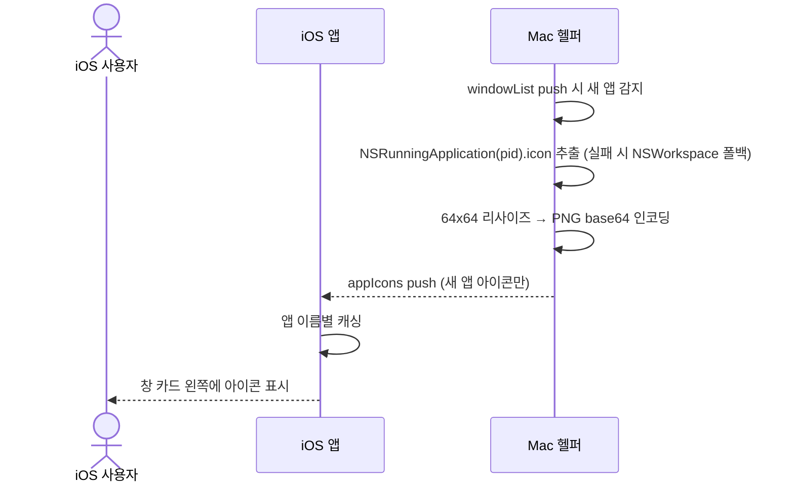
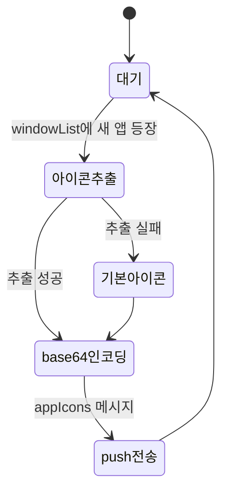

# 앱 아이콘 수집

실행 중인 앱의 아이콘을 추출해 iOS 앱의 창 목록 카드에 표시되도록 보장한다. 화면 캡처가 아니라 설치된 앱의 아이콘 파일을 읽는 것이며, 추가 권한이 필요 없다.

> 원본: `mac-remote/doc/spec/Spec-04-app-icon.md`. 결정 근거는 [[v1_0_1-decision-003-app-icon-only-no-capture|MRT-DEC-003]].

## Context

이 spec이 나온 배경과 연결된 decision.

- 관련 decision: [[v1_0_1-decision-003-app-icon-only-no-capture|MRT-DEC-003]] (화면 캡처 없이 앱 아이콘만 수집)
- 비즈니스 요구: 창 목록 카드에서 어떤 앱의 창인지 한눈에 식별하려면 앱 아이콘이 필요하다. 화면 캡처는 권한 부담이 크므로, 권한 없이 읽을 수 있는 설치 앱 아이콘만 사용해 시각적 식별을 보장한다.
- 관련 work: [[v1_0_1-work-004-app-icon|MRT-WORK-004]] (아이콘 수집 구현), [[v1_0_1-work-005-websocket-server|MRT-WORK-005]] (계약 appIcons push 메시지)
- 범위
  - In: NSWorkspace/NSRunningApplication으로 아이콘 추출, PNG base64 인코딩, 앱별 1회 전송, `appIcons` push 메시지
  - Out: 창 썸네일/스크린샷, ScreenCaptureKit([[v1_0_1-decision-003-app-icon-only-no-capture|MRT-DEC-003]]에서 제외)

## UX Contract

iOS 앱의 "창 목록" 탭 카드에 앱 아이콘이 표시되는 렌더 계약. 아이콘은 [[v1_0_1-spec-001-window-list|MRT-SPEC-001]]의 창 목록 카드 위에 얹히는 요소이며, 독립된 화면이나 조작은 없다.

### Placement

[[v1_0_1-spec-001-window-list|MRT-SPEC-001]]의 "창 목록" 탭 카드 왼쪽. 카드 제목/부제 앞 아이콘 슬롯.

```text
+──────────────────────────────+
│ 창 목록            ● 연결됨    │
+──────────────────────────────+
│ ┌──────────────────────────┐ │
│ │ [icon] Arc           ◉    │ │  ← 카드 왼쪽 앱 아이콘
│ │        디자인 레퍼런스    │ │
│ ├──────────────────────────┤ │
│ │ [icon] Xcode              │ │  ← 아이콘 없으면 시스템 기본 아이콘
│ │        MacroHelper…       │ │
│ └──────────────────────────┘ │
+──────────────────────────────+
```

### U-1. 카드 앱 아이콘 슬롯

- **상태**: 정상 — `appName` 매칭되는 `iconData`를 디코딩해 카드 왼쪽에 아이콘 표시 / 미수신·매칭 실패 — 아이콘 없이 카드 표시 / 디코딩 실패 — 시스템 기본 아이콘 표시
- **문구**: 별도 텍스트 없음 (아이콘 이미지 요소)
- **CTA**: 없음 (자동 표시, 직접 조작 대상 아님)
- **기대 결과**: 새 앱 아이콘 수신 시 앱 이름별로 캐싱 → 해당 앱의 모든 창 카드에 동일 아이콘 표시. 캐시에 있으면 재요청 없이 즉시 렌더

## User Scenario

actor는 iOS 앱 사용자. 아이콘 표시는 자동이며 직접 조작이 없으므로, 정상 수신 흐름과 실패·경계 흐름을 박는다.

### S-1. iOS 사용자 — 창 카드에 앱 아이콘 표시 (정상)

1. "창 목록" 탭에서 창 목록을 본다 ([[v1_0_1-spec-001-window-list|MRT-SPEC-001]])
2. Mac 헬퍼가 `windowList` push 시 새 앱 이름을 감지
3. 헬퍼가 해당 앱의 아이콘을 추출 → PNG base64 인코딩 → `appIcons` push
4. 앱이 수신해 앱 이름별로 캐싱
5. 캐싱된 아이콘이 해당 앱의 창 카드 왼쪽에 표시됨 (같은 앱 창이 여러 개면 모두 동일 아이콘)

### S-2. iOS 사용자 — 실패·경계

1. (아이콘 없는 앱) command line tool 등 번들 아이콘이 없는 앱은 PID/번들 경로로도 아이콘을 못 찾음 → Mac이 시스템 기본 앱 아이콘으로 대체해 전송, 카드에 기본 아이콘 표시 (정상 동작, 에러 없음)
2. (중복 앱) 같은 앱의 창이 3개여도 아이콘은 1번만 전송 → iOS가 캐시해 3개 카드에 동일 아이콘
3. (재실행) 앱을 종료 후 재실행해도 캐시에 이미 있으므로 재전송하지 않음
4. (큰 아이콘) 아이콘이 매우 큰 앱은 Mac이 적절한 크기(64x64 등)로 리사이즈 후 인코딩해 전송
5. (디코딩 실패) iOS에서 `iconData` base64 디코딩에 실패하면 시스템 기본 아이콘 표시
6. (매칭 실패) `appName`이 `windowList`의 `app` 필드와 매칭되지 않으면 아이콘 없이 카드 표시

## FE Contract

iOS 앱이 지켜야 하는 외부 계약.

- `appIcons.icons`를 앱 이름 → base64 PNG 맵으로 파싱해 앱 이름별로 캐싱
- 캐싱된 아이콘을 `windowList`의 `app` 필드로 매칭해 해당 창 카드 왼쪽에 렌더. 같은 앱 창이 여러 개면 모두 동일 아이콘 표시
- 이미 캐시에 있는 앱은 재요청하지 않는다 (중복 수신 방지)
- `iconData` base64 디코딩 실패 시 시스템 기본 아이콘 표시
- `appName`이 `windowList`의 `app`과 매칭되지 않으면 아이콘 없이 카드 표시

## BE Contract

Mac 헬퍼가 제공해야 하는 메시지와 동작.

### 메시지

| 방향 | 이름 | 설명 |
|------|------|------|
| Mac → iOS | `appIcons` | 앱 아이콘 데이터 전송 (push) |

#### 요청 예시

요청 없음. `windowList` 전송 시 새 앱이 감지되면 자동 push.

#### 응답 예시

```json
{
  "type":"appIcons",
  "icons":{
    "Arc":"iVBORw0KGgo...(base64)...",
    "Xcode":"iVBORw0KGgo...(base64)...",
    "Terminal":"iVBORw0KGgo...(base64)..."
  }
}
```

### 동작 규칙

- 헬퍼는 `windowList`에서 새 앱 이름을 감지하면 `NSRunningApplication(pid).icon`으로 아이콘을 추출한다
- PID로 아이콘을 못 찾으면 `NSWorkspace.icon(forFile: bundlePath)`로 폴백한다
- 추출 실패(번들에 아이콘 없음 등) 시 시스템 기본 앱 아이콘으로 대체한다
- 추출한 아이콘은 적절한 크기(64x64 등)로 리사이즈한 뒤 PNG → base64 인코딩한다
- 앱별 1회만 전송한다 — 같은 앱 창이 여러 개여도, 앱을 종료 후 재실행해도 새 앱 아이콘만 전송(중복 전송 없음)
- **재시도: 모든 유형 재시도하지 않는다.** 아이콘은 변하지 않으므로 재시도가 무의미하다

## Validation

입력/필터 검증 규칙.

| 검증 항목 | 규칙 | 검증 위치 | 실패 시 동작 |
|-----------|------|-----------|-------------|
| iconData | 유효한 base64 PNG | Front (iOS) | 시스템 기본 아이콘 표시 |
| appName | `windowList`의 `app` 필드와 매칭 | Front (iOS) | 매칭 안 되면 아이콘 없이 표시 |

## Case Matrix

에러·경계 케이스의 단일 SoT.

| 에러/케이스 | 발생 조건 | 백엔드(Mac) 처리 | 프론트(iOS) 출력 | 표시 위치 |
|---|---|---|---|---|
| `ICON_NOT_FOUND` | 앱 번들에 아이콘 없음 (예: command line tool) | PID·번들 경로 폴백 후에도 실패 시 시스템 기본 아이콘으로 대체해 전송 | 기본 아이콘 표시 | 창 카드 아이콘 슬롯 |
| `ENCODE_FAIL` | PNG 인코딩 실패 | 해당 앱 아이콘 건너뛰기 (재시도 X) | 아이콘 없이 표시 | 창 카드 아이콘 슬롯 |
| 디코딩 실패 | iOS에서 base64 디코딩 실패 | — | 시스템 기본 아이콘 표시 | 창 카드 아이콘 슬롯 |
| 매칭 실패 | `appName`이 `windowList.app`과 불일치 | — | 아이콘 없이 표시 | 창 카드 아이콘 슬롯 |

## Flow

happy path는 사용자 액션이 아니라 `windowList` push가 트리거다.



## State Machine



| 현재 상태 | 이벤트 | 다음 상태 | 액션 | 비고 |
|-----------|--------|-----------|------|------|
| 대기 | windowList에 새 앱 이름 등장 | 아이콘 추출 | NSRunningApplication.icon 또는 NSWorkspace.icon(forFile:) | |
| 아이콘 추출 | 성공 | base64 인코딩 | PNG → base64 String | |
| 아이콘 추출 | 실패 | 기본 아이콘 | 시스템 기본 앱 아이콘 사용 | |
| base64 인코딩 | — | push 전송 | appIcons 메시지 전송 | 새 앱 아이콘만 전송 |

## Data Contract

외부에 드러나는 resource와 제약.

```text
Entity: AppIcon
├── appName: String    — 앱 이름 (키)
└── iconData: String   — PNG base64 인코딩 문자열
```

| 필드 | 제약 | 비고 |
|------|------|------|
| appName | [[v1_0_1-spec-001-window-list\|MRT-SPEC-001]] WindowInfo.app과 동일한 이름 | 매칭 키 |
| iconData | 유효한 base64 PNG (64x64 등으로 리사이즈) | 디코딩 실패 시 기본 아이콘 |

### 공유 상수 / Enum

해당 없음

## Work Handoff

이 spec의 계약 표면을 work의 Acceptance Criteria로 가져간다. 완료 체크리스트는 [[v1_0_1-work-004-app-icon|MRT-WORK-004]] 등 30-work에 둔다.

| Work | 범위 |
|---|---|
| [[v1_0_1-work-004-app-icon\|MRT-WORK-004]] | 아이콘 추출 + 리사이즈 + base64 인코딩 + 앱별 1회 전송 |
| [[v1_0_1-work-005-websocket-server\|MRT-WORK-005]] | 계약 appIcons push 메시지 (WS 서버) |

## Open Questions

- 없음 (구현·릴리즈 완료)
