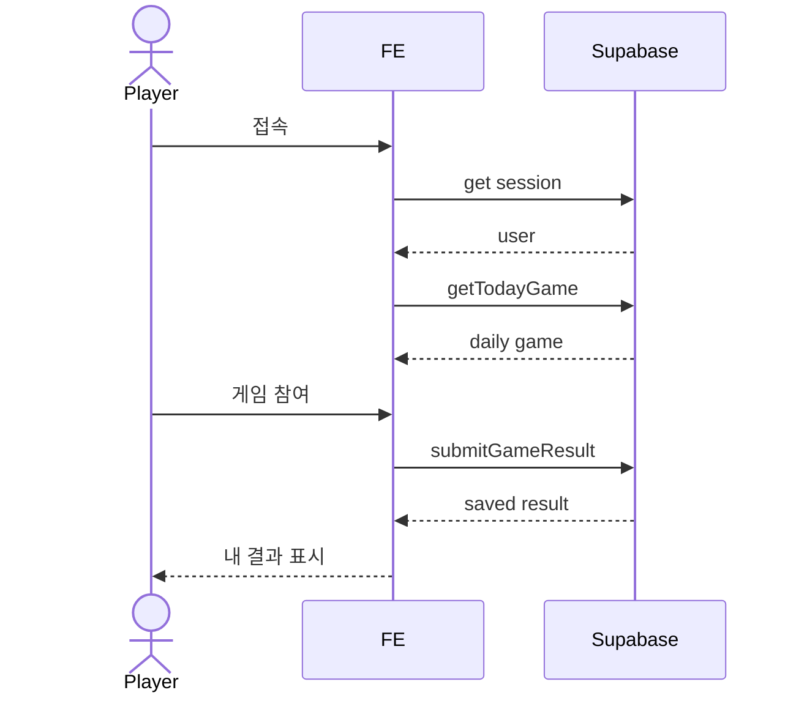
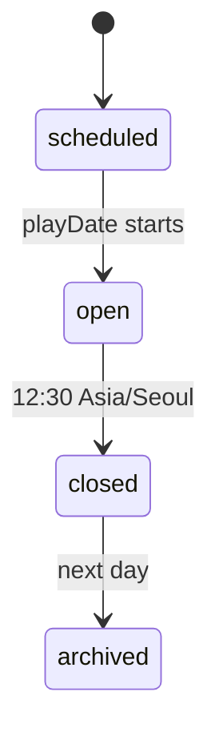

# Daily game platform

모바일 웹에서 로그인한 사용자가 당일 active game에 1회 참여하고, 결과 저장 후 즉시 전체 결과와 꼴찌를 확인할 수 있어야 한다. 12:30은 결과 공개 시간이 아니라 참여 마감 시간이다.

## 1. Context

### Meta

- Decision reference: DEC-001
- Baseline reference: BL-001
- Domain note: daily game registry, game result, loser detection
- Open questions: 없음

### Business Requirement

회사 구성원이 점심 전 커피 내기용 미니게임에 짧게 참여하고, 매일 다른 게임을 운영할 수 있어야 한다.

### Scope

In scope:

- Supabase Auth 기반 로그인.
- DB 기반 daily game registry.
- 당일 active game 조회.
- 로그인 사용자 1일 1회 결과 제출.
- Asia/Seoul 기준 12:30 참여 cutoff.
- 참여 완료자 대상 당일 결과 목록과 꼴찌 탐색.

Out of scope:

- admin UI.
- 결제/정산/커피 주문 연동.
- PC 전용 최적화.
- 여러 active game 동시 운영.

## 2. UX Contract

### Placement

모바일 웹 단일 제품. 첫 화면은 당일 active game 진입을 중심으로 둔다.

```text
+------------------------------+
| Header: 오늘의 커피 게임       |
+------------------------------+
| Login / Profile              |
| Daily Game Card              |
| Participate / Result         |
| Loser Board                  |
+------------------------------+
```

### U-1. 로그인 영역

- **상태**: 비로그인 / 로그인 / 로그인 실패.
- **문구**: `로그인`, `오늘의 게임에 참여하려면 로그인하세요`, 사용자 표시명.
- **CTA**: 로그인 버튼.
- **기대 결과**: 로그인 성공 후 당일 게임 카드와 참여 상태를 볼 수 있다.

### U-2. 오늘의 게임 카드

- **상태**: active game 있음 / 없음 / cutoff 이전 / cutoff 이후.
- **문구**: 게임명, 종료 시각 `12:30`, 참여 가능 여부.
- **CTA**: `게임 참여`, `결과 보기`.
- **기대 결과**: 참여 전이면 게임 화면으로 이동하고, 참여 후 또는 종료 후에는 결과 화면을 본다.

### U-3. 결과/꼴찌 영역

- **상태**: 미참여 / 내 결과 있음 / 참여 완료 후 전체 결과 공개 / 공동 꼴찌 있음.
- **문구**: `내 결과`, `오늘의 꼴찌`, `공동 꼴찌`.
- **CTA**: 없음.
- **기대 결과**: 사용자가 결과를 제출하면 즉시 전체 결과와 `rankValue` 최저 참여자를 꼴찌로 표시한다.

## 3. User Scenario

### S-1. Player - 로그인 후 당일 게임 참여

1. 사용자는 모바일 웹에 접속한다.
2. 비로그인 상태이면 로그인 CTA를 누른다.
3. 로그인 성공 후 당일 active game을 확인한다.
4. cutoff 전이고 아직 제출하지 않았다면 `게임 참여`를 누른다.
5. 게임별 화면에서 결과를 제출한다.
6. 시스템은 결과를 저장하고 내 결과 화면을 보여준다.

### S-2. Player - 하루 1회 제출 제한

1. 사용자가 이미 당일 active game 결과를 제출했다.
2. 사용자가 다시 접속한다.
3. 시스템은 게임 참여 CTA를 비활성화하고 내 결과를 보여준다.
4. 사용자는 재시도할 수 없다.

### S-3. Player - 참여 완료 후 결과 확인

1. 사용자가 게임을 완료하고 결과를 제출한다.
2. 시스템은 사용자를 참여 완료 상태로 표시한다.
3. 전체 결과와 꼴찌를 즉시 보여준다.
4. 동률 최저 `rankValue`가 여러 명이면 공동 꼴찌로 표시한다.
5. 미참여 사용자는 다른 사람 결과와 꼴찌를 볼 수 없다.

### S-4. Operator - 매일 다른 게임 운영

1. 운영자는 DB daily game registry에 날짜별 active game record를 준비한다.
2. 사용자가 해당 날짜에 접속하면 record의 game type에 맞는 게임 UI가 열린다.
3. 같은 플랫폼 결과 저장 계약으로 결과가 기록된다.

## 4. Interface Contract

### API Contract

Next.js frontend는 Supabase client 또는 server action/route handler를 통해 아래 logical operation을 제공한다.

| Method | Path / Operation | 요약 | 권한 |
|---|---|---|---|
| GET | `getTodayGame` | Asia/Seoul 오늘 active game 조회 | authenticated |
| GET | `getMyTodayResult` | 내 당일 결과 조회 | authenticated |
| POST | `submitGameResult` | 당일 결과 제출 | authenticated |
| GET | `getTodayLeaderboard` | 참여 완료자 또는 cutoff 이후 결과와 꼴찌 조회 | authenticated |

### Request / Response

#### `getTodayGame`

Response:

```json
{
  "gameId": "uuid",
  "playDate": "2026-07-14",
  "gameType": "yut_gauge",
  "title": "오늘의 윷놀이",
  "status": "open",
  "cutoffAt": "2026-07-14T12:30:00+09:00",
  "config": {}
}
```

#### `submitGameResult`

Request:

```json
{
  "gameId": "uuid",
  "score": 5,
  "rankValue": 5,
  "resultLabel": "모",
  "metadata": {}
}
```

Response:

```json
{
  "resultId": "uuid",
  "submittedAt": "2026-07-14T12:10:00+09:00"
}
```

### Validation

| 필드 | 규칙 |
|---|---|
| `playDate` | Asia/Seoul 기준 날짜 |
| `gameType` | registered game type 중 하나 |
| `cutoffAt` | 해당 `playDate`의 12:30 Asia/Seoul |
| `userId + gameId` | unique, 1회 제출 |
| `rankValue` | 게임별 contract가 허용한 숫자 |
| `resultLabel` | 게임별 contract가 허용한 label |
| `metadata` | JSON, 게임별 상세 결과 저장 |

### Case Matrix

| 에러 코드 | 백엔드 출력 | 프론트 출력 | 표시 위치 |
|---|---|---|---|
| AUTH_REQUIRED | 인증 없음 | 로그인이 필요합니다 | 로그인 영역 |
| NO_ACTIVE_GAME | active game 없음 | 오늘 등록된 게임이 없습니다 | 게임 카드 |
| ALREADY_SUBMITTED | unique 충돌 | 오늘은 이미 참여했습니다 | 게임 카드 |
| GAME_CLOSED | cutoff 이후 제출 | 오늘 게임이 종료되었습니다 | 게임 카드 |
| INVALID_RESULT | 게임 contract 위반 | 결과를 저장할 수 없습니다 | 결과 제출 화면 |

### Flow



### State / Lifecycle



### Data Contract

| Resource | Field | Description |
|---|---|---|
| DailyGame | `id` | game registry record id |
| DailyGame | `playDate` | Asia/Seoul 날짜 |
| DailyGame | `gameType` | `yut_gauge` 등 game renderer key |
| DailyGame | `title` | 사용자 노출 제목 |
| DailyGame | `cutoffAt` | 종료 시각 |
| DailyGame | `config` | 게임별 설정 JSON |
| GameResult | `gameId` | DailyGame 참조 |
| GameResult | `userId` | Supabase Auth user 참조 |
| GameResult | `score` | 표시/정렬용 점수 |
| GameResult | `rankValue` | 꼴찌 탐색 기준값 |
| GameResult | `resultLabel` | 사용자 노출 결과 |
| GameResult | `metadata` | 게임별 상세 |

## 5. Implementation Rules

- 모든 날짜/종료 판단은 Asia/Seoul 기준이다.
- 제출은 cutoff 전까지만 가능하다.
- 같은 `gameId + userId` 결과는 하나만 존재한다.
- 꼴찌와 전체 결과는 참여 완료자에게 즉시 표시한다.
- 미참여자는 cutoff 전 다른 사람 결과를 볼 수 없다.
- 동률 최저 `rankValue`는 공동 꼴찌로 표시한다.
- 실제 커피 내기 처리는 제품 밖의 사내 룰로 둔다.

## 6. Verification

### Acceptance Criteria

- [ ] 비로그인 사용자는 로그인 CTA를 본다.
- [ ] 로그인 사용자는 당일 active game을 볼 수 있다.
- [ ] 사용자는 cutoff 전 1회만 결과를 제출할 수 있다.
- [ ] 같은 사용자의 중복 제출은 막힌다.
- [ ] 12:30 이후 제출은 막힌다.
- [ ] 참여 완료 후 최저 `rankValue` 사용자가 꼴찌로 표시된다.
- [ ] 미참여 사용자는 cutoff 전 전체 결과를 볼 수 없다.
- [ ] 동률 최저값은 공동 꼴찌로 표시된다.
- [ ] DB daily game registry의 `gameType`에 따라 게임 renderer가 선택된다.

## 7. Open Questions

없음.
