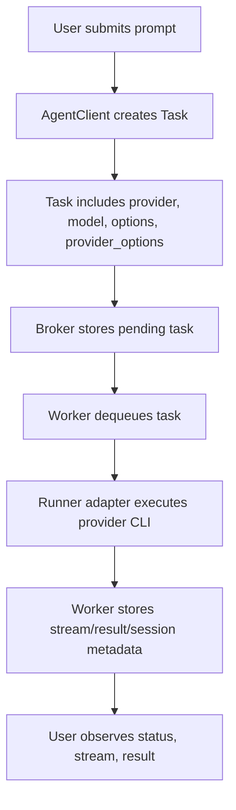
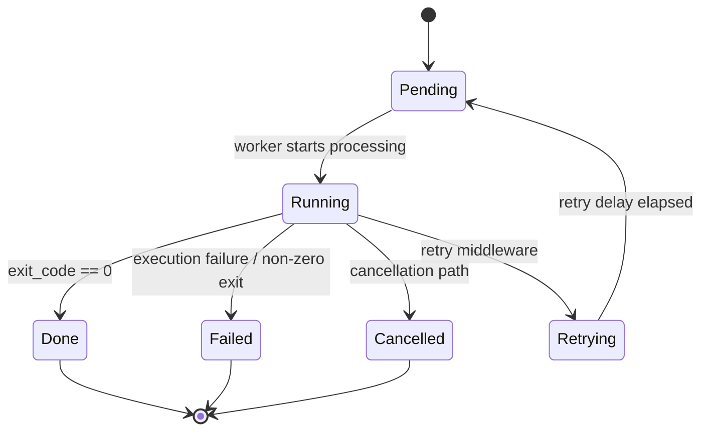

# OKK-SPEC-001 Task 모델과 생명주기

open-kknaks의 단일 작업 단위는 `Task`이며, queue 저장 상태와 worker 실행 결과를 같은 모델에 누적한다.

## Context

legacy 코드 기준 source는 `/Users/kknaks/git/library/claude_code_pty/open_kknaks/open_kknaks/task.py`다.

## User Flow

## State Machine

## UX Contract

CLI와 API는 task id, status, result, error, usage를 노출한다.

UI가 있는 제품은 아니므로 화면 계약은 없다.

## FE Contract

해당 없음.

## BE Contract

### Status

| Status | 의미 | Terminal |
|---|---|---|
| `pending` | queue에 들어갔고 아직 worker가 처리하지 않음 | no |
| `running` | worker가 실행 중 | no |
| `done` | exit code 0으로 완료 | yes |
| `failed` | 실행 실패 또는 non-zero exit | yes |
| `cancelled` | 취소 상태로 표시됨 | yes |
| `retrying` | retry middleware가 재시도 대기 상태로 전환 | no |

### Priority

| Priority | Value | 의미 |
|---|---|---|
| `HIGH` | 1 | 같은 queue 안에서 우선 처리 |
| `NORMAL` | 5 | 기본 우선순위 |
| `LOW` | 9 | 낮은 우선순위 |

### Task 필드

| Field | 계약 |
|---|---|
| `id` | UUID 문자열, 생성 시 자동 발급 |
| `prompt` | provider runner에 전달할 주 instruction |
| `context` | provider runner에 전달할 추가 context |
| `queue` | enqueue/dequeue 대상 queue 이름 |
| `status` | 위 status enum 중 하나 |
| `priority` | 위 priority enum 중 하나 |
| `delay_until` | delayed queue 승격 기준 시각 |
| `provider` | 실행 provider. `claude`, `codex`; 생략 시 `claude` |
| `model` | provider model override |
| `options` | provider 공통 실행 옵션. `cwd`, `timeout_sec`, `stream`, `resume` |
| `provider_options` | provider별 자유 dict 옵션 |
| `timeout` | legacy executor total timeout override. 신규 계약에서는 `options.timeout_sec` 우선 |
| `max_retries`, `retry_count`, `exception_type` | retry 상태 추적 |
| `result`, `error`, `exit_code`, `result_session_id`, `usage` | worker 실행 결과 |
| `batch_id` | batch runner가 생성한 batch 묶음 ID |
| `metadata` | 호출자 임의 메타데이터 |
| `created_at`, `started_at`, `finished_at` | 생성/시작/종료 시각 |

## Data Contract

`TaskResult`는 executor 내부 결과이며 최종 저장 시 `Task`에 반영된다.

| Field | 계약 |
|---|---|
| `result` | provider final result text |
| `stream` | text stream event를 줄 단위로 결합한 값 |
| `exit_code` | provider process exit code |
| `session_id` | provider native session id. Claude session id 또는 Codex thread id |
| `usage` | cost/token/duration 집계 |

`StreamEvent.type`은 `text`, `cost`, `retry`, `tool_use`, `tool_result`, `thinking`, `init`, `progress`만 허용한다.

## Work Handoff

work의 Acceptance Criteria는 아래 계약 표면에서 파생한다.

- task 생성/실행/terminal status 전이
- `provider` default `claude`
- `model`, `options`, `provider_options` 저장과 broker round-trip
- `options.resume`과 `result_session_id` 연동
- provider native session id를 `TaskResult.session_id`로 저장
- legacy Claude task override 필드 제거

## Breaking Change

provider 기반 task 모델이 들어가는 버전은 legacy Claude 전용 task override 필드를 유지하지 않는다.

제거 대상:

| Legacy field | 새 위치 |
|---|---|
| `system_prompt` | `provider_options.system_prompt` |
| `append_system_prompt` | `provider_options.append_system_prompt` |
| `max_turns` | `provider_options.max_turns` |
| `effort` | `provider_options.effort` |
| `json_schema` | `provider_options.json_schema` |
| `allowed_tools` | `provider_options.allowed_tools` |
| `disallowed_tools` | `provider_options.disallowed_tools` |
| `permission_mode` | `provider_options.permission_mode` |
| `session_id` | `options.resume.session_id` |
| `mcp_config` | `provider_options.mcp_config` |
| `add_dirs` | `provider_options.add_dirs` |
| `timeout` | `options.timeout_sec` |

기존 필드를 계속 사용해야 하는 사용자는 provider 구조 이전 버전을 사용한다.

## Open Questions

없음.
