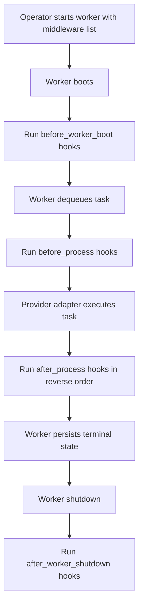
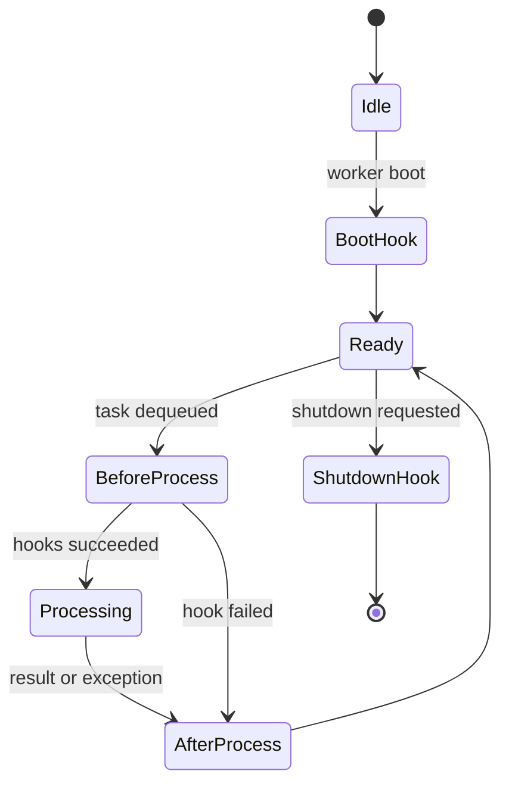

# OKK-SPEC-008 Middleware와 운영 제어

middleware는 worker lifecycle과 task processing 전후에 개입해 logging, retry, timeout default, cost budget, rate limit, callback을 처리한다.

## Context

source는 `/Users/kknaks/git/library/claude_code_pty/open_kknaks/open_kknaks/middleware/`다.

## User Flow

## State Machine

middleware는 worker lifecycle과 task processing 전후에만 개입한다. client submit path의 enqueue hook은 legacy interface에 남아 있어도 provider 구조 버전의 public contract에서 제외한다.

## UX Contract

middleware는 사용자-facing API라기보다 운영 확장점이다. CLI worker는 기본으로 logging과 retries middleware를 장착한다.

## FE Contract

해당 없음.

## BE Contract

### Middleware hooks

| Hook | 현재 호출 여부 | 계약 |
|---|---|---|
| `before_enqueue` | no | legacy interface에 남아 있으나 public submit contract에서 제외 |
| `after_enqueue` | no | legacy interface에 남아 있으나 public submit contract에서 제외 |
| `before_process` | yes | task 실행 전 hook, 예외 시 task failure path 진입 |
| `after_process` | yes | task 실행 후 hook, reverse order로 호출 |
| `before_worker_boot` | yes | worker boot 시 호출 |
| `after_worker_shutdown` | yes | worker shutdown 시 호출 |

### Built-in middleware

| Middleware | 계약 |
|---|---|
| `LoggingMiddleware` | worker/task lifecycle logging |
| `RetriesMiddleware` | exception 기반 exponential backoff retry |
| `TimeoutMiddleware` | task timeout default 설정과 timeout logging |
| `CostMiddleware` | worker/global budget check, cost recording, budget alert |
| `RateLimitMiddleware` | in-memory RPM limit과 reactive slowdown/recovery |
| `CallbackMiddleware` | lifecycle callback 실행 |

### Retry semantics

`RetriesMiddleware`는 worker가 exception을 잡은 경우에만 retry를 수행한다. non-zero exit code는 `TaskResult(exit_code != 0)`로 표현되므로 현재 retry middleware 대상이 아니며 DLQ로 이동한다.

기본 no-retry exception은 `TaskCancelledError`, `ClaudeAuthError`, `BillingError`다.

### Cost semantics

`CostMiddleware`는 worker-local spent와 broker global cost를 사용한다. 실행 전 budget 초과를 막고, 실행 후 usage cost를 누적한다.

### Rate limit semantics

`RateLimitMiddleware`는 in-memory timestamp window로 preemptive RPM을 제한한다. `RateLimitError` exception 발생 시 current RPM을 낮추고, 성공 시 점진적으로 회복한다.

## Data Contract

middleware는 broker를 생성자에 저장하지 않고 hook argument로 받는다.

`after_process`는 result 또는 exception을 받을 수 있으며, 한 middleware가 실패해도 다른 middleware after hook 호출은 계속되어야 한다.

## Work Handoff

work의 Acceptance Criteria는 아래 계약 표면에서 파생한다.

- worker boot 시 `before_worker_boot` hook 실행
- worker shutdown 시 `after_worker_shutdown` hook 실행
- task 실행 전 `before_process` hook 순차 실행
- task 실행 후 `after_process` hook 역순 실행
- enqueue hook은 public `AgentClient.submit` path에서 제외
- retry middleware는 no-retry exception을 재시도하지 않음
- cost middleware는 usage가 있는 result만 cost로 누적
- rate limit middleware는 max RPM 초과 시 wait 가능

## Open Questions

없음.
