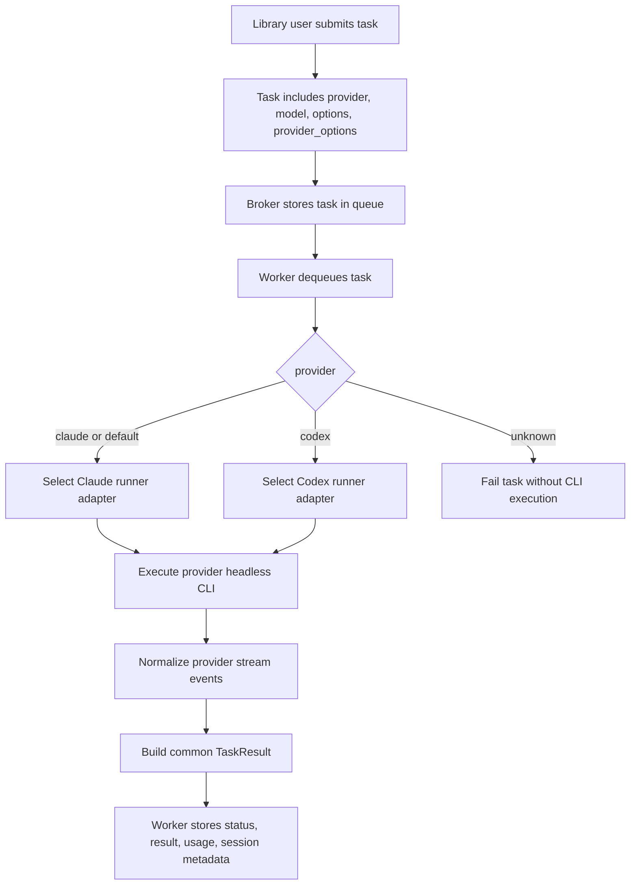
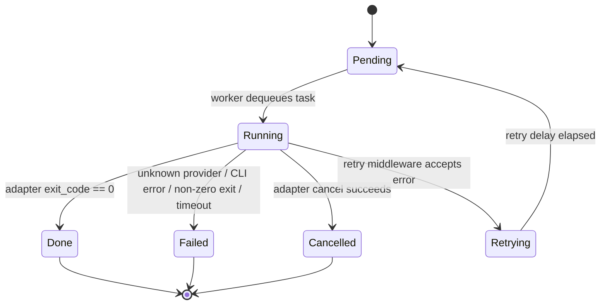

# OKK-SPEC-009 Claude/Codex Runner Adapter 계약

`open-kknaks` worker는 task의 `provider` 값을 기준으로 Claude 또는 Codex headless runner adapter를 선택하고, 두 runner의 실행 결과를 같은 task/result/stream 계약으로 저장한다.

## Context

이 spec은 `OKK-DEC-001 Provider 기반 task 실행 모델 도입`을 runner 계층 계약으로 구체화한다.

현재 legacy 구현은 `/Users/kknaks/git/library/claude_code_pty/open_kknaks/open_kknaks/worker/executor.py`의 `ClaudeCodeExecutor`가 Claude Code CLI만 실행한다. 신규 구조는 이 Claude executor를 `claude` provider adapter로 보존하고, Codex headless 실행은 별도 `codex` provider adapter로 추가한다.

## User Flow

## State Machine

## UX Contract

사용자는 Claude와 Codex를 같은 submit/status/result/stream API로 다룬다.

기본 provider는 `claude`다. 기존 Claude 사용자는 provider를 지정하지 않아도 기존 headless 실행 경험을 유지한다.

지원 provider는 이번 spec 범위에서 `claude`, `codex`만이다. `openai`, local provider, custom provider registry는 범위 밖이다.

## FE Contract

해당 없음.

## BE Contract

### Provider selection

| Field | 계약 |
|---|---|
| `provider` | `claude` 또는 `codex`; 생략 시 `claude` |
| `model` | provider에 전달할 model override |
| `options` | worker/client가 해석하는 공통 실행 옵션 |
| `provider_options` | runner adapter가 해석하는 provider별 자유 dict |

worker는 task 실행 전 provider 값을 검증한다. 알 수 없는 provider는 CLI 실행을 시도하지 않고 task를 `failed`로 저장한다.

지원 provider 목록은 사용자 설정이 아니라 제품 고정 계약이다. 구현 시 `core/constants` 성격의 모듈에 provider 상수를 둔다.

| Constant | Value | 계약 |
|---|---|---|
| `PROVIDER_CLAUDE` | `claude` | legacy/default provider |
| `PROVIDER_CODEX` | `codex` | Codex headless provider |
| `SUPPORTED_PROVIDERS` | `{"claude", "codex"}` | provider validation 기준 |
| `DEFAULT_PROVIDER` | `claude` | provider 생략 시 적용 |

runtime public API로 custom provider registration은 열지 않는다. 테스트에서는 worker/adapter 구성 단계에서 내부 registry override를 허용할 수 있다.

### Adapter interface

runner adapter는 아래 책임을 가진다.

| Method / Responsibility | 계약 |
|---|---|
| provider id | adapter가 처리하는 provider id를 반환한다 |
| health check | worker boot 또는 등록 시 CLI 존재 여부와 version을 확인한다 |
| command build | task/options/provider_options를 provider별 command로 변환한다 |
| execute | provider별 process model로 headless 실행을 수행한다 |
| stream parse | provider native stream을 공통 `StreamEvent`로 변환하고 remaining buffer를 drain한다 |
| result build | final text, exit code, usage, session id를 `TaskResult`로 반환한다 |
| cancel | adapter 내부 제어용 process 종료 기능. public client cancel 계약은 persisted marker다 |

### Process model

| Provider | Process model | Notes |
|---|---|---|
| `claude` | PTY 기반 | 기존 `ClaudeCodeExecutor` 계약 유지 |
| `codex` | stdio 기반 | `codex exec --json` JSONL stream 사용 |

worker는 runner별 process model을 직접 알지 않는다. process 생성, stdout/stderr 처리, provider native event parsing은 adapter 내부 책임이다.

### Option mapping

공통 옵션은 worker와 모든 adapter가 공유하는 의미를 가진다.

| Common option | 의미 | Adapter mapping |
|---|---|---|
| `cwd` | 실행 working directory | Claude work dir, Codex `-C` |
| `timeout_sec` | task total timeout | adapter timeout |
| `stream` | stream publish 여부 | stream parser publish 제어 |
| `resume.mode` | `new`, `session`, `last` | provider별 resume command/flag |
| `resume.session_id` | 이어갈 session/thread id | Claude session id, Codex thread id |

provider별 옵션은 자유 dict다. 1차 구현은 typed schema를 강제하지 않고, adapter가 자신이 지원하는 옵션만 command로 매핑한다.

| Provider | Required defaults | Provider option examples |
|---|---|---|
| `claude` | `output_format=stream-json`, `verbose=true`, `include_partial_messages=true` | `allowed_tools`, `disallowed_tools`, `permission_mode`, `dangerously_skip_permissions`, `add_dirs` |
| `codex` | `json=true`, `sandbox=workspace-write` | `output_schema`, `ephemeral`, `skip_git_repo_check`, `ignore_user_config`, `profile`, `add_dirs`, `images`, `config` |

### Session semantics

`options.resume`은 provider 공통 계약이다.

| Mode | 계약 |
|---|---|
| `new` | 새 세션을 시작한다 |
| `session` | `resume.session_id`로 지정한 세션을 이어간다 |
| `last` | provider가 지원하는 최근 세션 재개 기능을 사용한다 |

adapter는 provider native session id를 `TaskResult.session_id`로 반환한다. worker는 이를 task의 `result_session_id`에 저장한다.

Codex의 `thread_id`는 공통 결과 모델에서는 session id로 취급한다.

### Stream normalization

adapter는 provider native event를 공통 `StreamEvent`로 변환한다.

| Common event | Claude source | Codex source |
|---|---|---|
| `init` | Claude init event | `thread.started`, `turn.started` |
| `text` | assistant text / final result | `agent_message` item |
| `thinking` | thinking event | reasoning item |
| `tool_use` | tool use event | command/tool item started |
| `tool_result` | tool result event | command/tool item completed |
| `progress` | progress/non-final lifecycle | item started/updated/completed |
| `cost` | usage/cost event | `turn.completed.usage` |
| `retry` | retry/rate-limit event | provider error/retry signal if available |

provider native payload는 손실을 줄이기 위해 stream event metadata에 보존한다. metadata가 없는 event type은 raw payload를 adapter-local debug context에 보존할 수 있어야 한다.

### Error semantics

| Case | 계약 |
|---|---|
| unknown provider | task `failed`, command 미실행 |
| CLI not found | task `failed`, retry 대상 아님 |
| auth failure | task `failed`, retry 대상 아님 |
| timeout | adapter process termination 후 task `failed` |
| non-zero exit | task `failed`, exit code 저장 |
| parser failure | raw line/context를 error에 포함할 수 있음 |
| client cancel | persisted marker로 task `cancelled` 저장. running process interrupt 보장 없음 |
| pending cancel consumed by worker | worker는 실행하지 않고 ack |
| worker/internal cancel | adapter가 process 종료를 지원하면 종료 가능 |

## Data Contract

`Task`는 다음 provider 실행 필드를 가져야 한다.

| Field | 계약 |
|---|---|
| `provider` | `claude`, `codex`; default `claude` |
| `model` | provider model override |
| `options` | 공통 실행 option dict |
| `provider_options` | provider별 option dict |

`TaskResult.session_id`는 provider native id를 저장한다. Claude session id와 Codex thread id는 모두 이 필드에 들어간다.

`StreamEvent`는 기존 type enum을 유지하되 provider native payload를 metadata로 보존할 수 있어야 한다. 구현이 기존 고정 필드를 유지한다면 최소한 adapter debug context에 raw payload tail을 남겨 failure diagnosis를 가능하게 한다.

## Work Handoff

work의 Acceptance Criteria는 아래 계약 표면에서 파생한다.

- provider default와 unknown provider 처리
- `core/constants` 기반 provider 상수와 validation
- Claude/Codex adapter 선택과 실행 경계
- 공통 `TaskResult`와 `StreamEvent` 반환
- provider native metadata 또는 debug context 보존
- `options.resume` 기반 session continuation
- client cancel marker를 worker가 실행하지 않는 skip 처리
- Codex 기본 sandbox `workspace-write`
- provider별 자유 dict option 처리

## Open Questions

없음.
