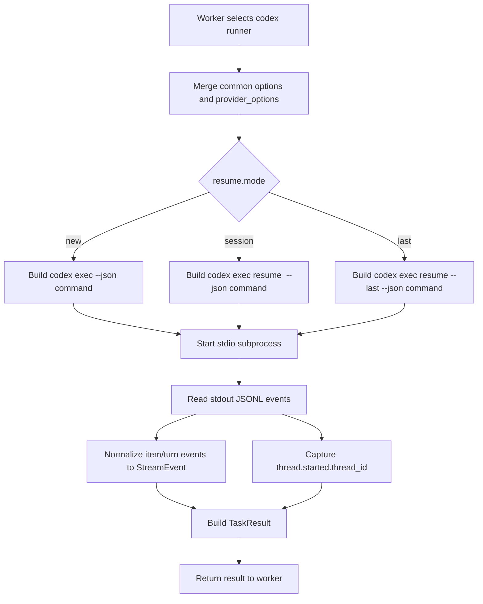
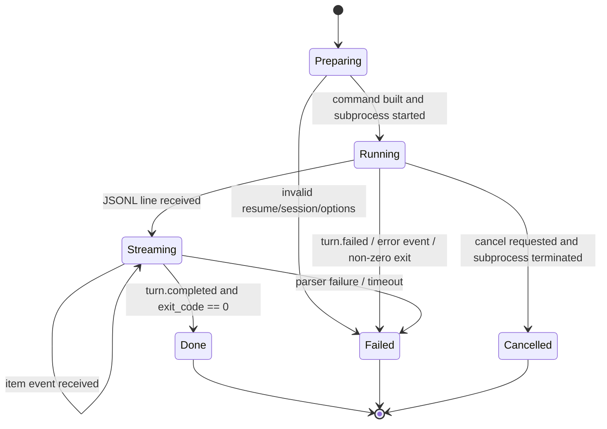

# OKK-SPEC-010 Codex Headless Runner 실행 계약

`codex` provider runner는 `codex exec --json` 기반 headless 실행을 수행하고, Codex JSONL event와 thread id를 `open-kknaks`의 공통 stream/result/session 계약으로 변환한다.

## Context

이 spec은 `OKK-SPEC-009 Claude/Codex Runner Adapter 계약`의 Codex adapter 상세 계약이다.

기준 문서는 `/Users/kknaks/git/library/claude_code_pty/open_kknaks/docs/legacy/CODEX_ANALYSIS.md`다. 해당 문서는 Codex CLI v0.131.0-alpha.22 실측 기준으로 `codex exec`, `--json`, `resume`, JSONL event, stdin/stdout 패턴을 정리한다.

이번 범위는 `codex exec`와 `codex exec resume`이다. `codex exec review`는 다루지 않는다.

## User Flow

## State Machine

## UX Contract

사용자는 Python client에서 `provider="codex"`를 지정해 Claude task와 같은 방식으로 submit/status/stream/result를 사용한다.

기본 실행은 새 Codex thread를 만든다. 이어서 실행하려면 `options.resume.mode="session"`과 `options.resume.session_id`를 지정한다.

Codex runner는 기본 sandbox를 `workspace-write`로 둔다. `danger-full-access` 계열 옵션은 사용자가 `provider_options`에 명시한 경우에만 command에 반영한다.

## FE Contract

해당 없음.

## BE Contract

### Command shape

Codex runner는 PTY가 아니라 stdio subprocess로 실행한다.

| Case | Command shape |
|---|---|
| new session | `codex exec --json [OPTIONS] [PROMPT]` |
| resume session | `codex exec resume <THREAD_ID> --json [OPTIONS] [PROMPT]` |
| resume last | `codex exec resume --last --json [OPTIONS] [PROMPT]` |

`PROMPT`는 기본적으로 command argument로 전달한다. prompt가 비어 있거나 stdin 전달이 필요한 후속 spec이 생기면 `codex exec -`를 검토한다.

### Common option mapping

| Common option | Codex mapping | 계약 |
|---|---|---|
| `model` | `-m`, `--model` | task model override |
| `options.cwd` | `-C`, `--cd` | 실행 working directory |
| `options.timeout_sec` | subprocess timeout | timeout 시 process 종료 |
| `options.stream` | JSONL publish 여부 | false여도 result parsing은 수행 |
| `options.resume.mode=new` | `codex exec` | 새 thread 시작 |
| `options.resume.mode=session` | `codex exec resume <THREAD_ID>` | `session_id` 필수 |
| `options.resume.mode=last` | `codex exec resume --last` | provider native last session 사용 |

### Provider option mapping

`provider_options`는 자유 dict지만, Codex runner가 알 수 없는 key를 조용히 무시하지 않는다. 알 수 없는 key가 있으면 command 실행 전 validation failure로 처리하고 task를 `failed`로 저장한다.

| provider_options key | Codex flag | Default | Notes |
|---|---|---|---|
| `json` | `--json` | `true` | 공통 stream/result parsing을 위해 기본 true |
| `output_last_message` | `-o`, `--output-last-message` | 없음 | 파일 경로 |
| `output_schema` | `--output-schema` | 없음 | JSON schema file |
| `ephemeral` | `--ephemeral` | `false` | true면 resume 불가 |
| `skip_git_repo_check` | `--skip-git-repo-check` | `false` | git repo 밖 실행 허용 |
| `ignore_user_config` | `--ignore-user-config` | `false` | config.toml 무시 |
| `ignore_rules` | `--ignore-rules` | `false` | execpolicy rules 무시 |
| `strict_config` | `--strict-config` | `false` | unknown config field error |
| `color` | `--color` | 없음 | `always`, `never`, `auto` |
| `sandbox` | `-s`, `--sandbox` | `workspace-write` | `read-only`, `workspace-write`, `danger-full-access` |
| `bypass_approvals_and_sandbox` | `--dangerously-bypass-approvals-and-sandbox` | `false` | 명시적 요청 때만 |
| `bypass_hook_trust` | `--dangerously-bypass-hook-trust` | `false` | 명시적 요청 때만 |
| `profile` | `-p`, `--profile` | 없음 | config profile |
| `profile_v2` | `--profile-v2` | 없음 | config overlay |
| `add_dirs` | `--add-dir` 반복 | 없음 | 추가 writable directory |
| `images` | `-i`, `--image` 반복 | 없음 | image file attachments |
| `oss` | `--oss` | `false` | OSS provider mode |
| `local_provider` | `--local-provider` | 없음 | 이번 제품 provider 범위 밖이지만 Codex flag로는 전달 가능 |
| `config` | `-c`, `--config` 반복 | 없음 | dotted key TOML override |
| `enable` | `--enable` 반복 | 없음 | feature enable |
| `disable` | `--disable` 반복 | 없음 | feature disable |

### JSONL parsing

Codex runner는 stdout을 line 단위로 읽고 각 line을 JSON으로 parse한다. `--json` 모드의 stdout은 JSONL event stream으로 취급한다.

stderr와 stdout의 non-JSON line은 공통 stream event로 publish하지 않는다. 기존 Claude stream parser처럼 provider JSON event만 stream으로 변환한다. 실패 시 진단을 위해 stderr tail 또는 non-JSON context를 task error/debug context에 보존한다.

subprocess 종료 직후 stdout buffer에 남은 JSONL도 normal read loop와 동일하게 parse/publish한다. 마지막 newline 없이 종료된 event가 `TaskResult`에만 반영되고 stream 구독자에게 누락되면 안 된다.

| Codex event | 계약 |
|---|---|
| `thread.started` | `thread_id`를 session id로 저장 |
| `turn.started` | execution start/progress event |
| `turn.completed` | usage를 cost/usage event로 변환하고 terminal success 후보로 둔다 |
| `turn.failed` | task failure error context |
| `item.started` | command/tool/progress started event |
| `item.updated` | progress update event |
| `item.completed` | agent message/tool result/command result event |
| `error` | task failure error context |

### Item mapping

| Codex item details.type | Common StreamEvent |
|---|---|
| `agent_message` | `text` |
| `reasoning` | `thinking` |
| `command_execution` | `tool_use`, `tool_result`, `progress` |
| `file_change` | `progress` |
| `mcp_tool_call` | `tool_use`, `tool_result` |
| `collab_tool_call` | `tool_use`, `tool_result` |
| `web_search` | `tool_use`, `tool_result` |
| `todo_list` | `progress` |

unknown event나 unknown item type은 parser failure로 보지 않고 `progress` 또는 provider-native metadata로 보존한다. 공통 field로 표현하기 어려운 raw payload는 metadata 또는 debug context에 남긴다.

### Result semantics

| Result field | Codex source |
|---|---|
| `result` | 마지막 `agent_message` text 또는 final message |
| `stream` | text/progress stream 축약 |
| `exit_code` | subprocess exit code |
| `session_id` | `thread.started.thread_id` |
| `usage` | `turn.completed.usage` |

`--json` 없이 실행하면 `thread_id`를 취득할 수 없으므로 Codex runner는 기본적으로 `json=true`를 강제한다.

### Error semantics

| Case | 계약 |
|---|---|
| `resume.mode=session` without `session_id` | command 실행 전 validation failure |
| `ephemeral=true` with resume mode not `new` | command 실행 전 validation failure |
| unknown `provider_options` key | command 실행 전 validation failure |
| codex binary not found | task failed, retry 대상 아님 |
| auth failure | task failed, retry 대상 아님 |
| `turn.failed` | task failed |
| `error` event | task failed |
| non-zero exit | task failed, exit code 저장 |
| timeout | subprocess 종료 후 task failed |
| cancel | subprocess terminate/kill 후 task cancelled |

## Data Contract

Codex runner는 `Task.provider == "codex"` task만 처리한다.

`TaskResult.session_id`에는 Codex `thread_id`를 저장한다. `Task.result_session_id`도 같은 값을 가진다.

Codex native event payload는 공통 `StreamEvent`의 metadata에 보존할 수 있어야 한다. metadata field 도입이 지연되는 경우 adapter debug context에 raw payload tail을 보존한다.

## Work Handoff

work의 Acceptance Criteria는 아래 계약 표면에서 파생한다.

- `codex exec --json` command build
- `resume.mode`별 command build와 validation
- `provider_options.sandbox=workspace-write` default
- stdout JSONL parsing과 stderr/non-JSON context 보존 정책
- subprocess 종료 시 remaining JSONL drain과 stream publish
- Codex event/item type의 공통 `StreamEvent` mapping
- unknown event/item payload의 metadata 또는 debug context 보존
- `thread_id`를 `TaskResult.session_id`로 저장
- timeout/cancel/non-zero/auth failure 처리
- `codex exec review` 제외

## Open Questions

없음.
