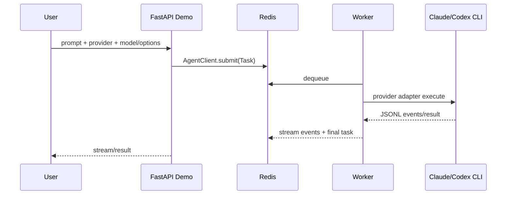

# OKK-WORK-005 Demo와 E2E Provider 실행 경로 갱신

사용자가 직접 Claude/Codex provider 실행을 확인할 수 있도록 `examples/` 데모 앱, scenario scripts, 실행 문서를 새 provider 계약에 맞춘다.

## Work Summary

| Field | Value |
|---|---|
| Type | qa-enablement |
| Owner |  |
| Status | done |
| Progress | 100% |
| Branch/PR |  |
| Blocker | 없음 |
| Next | 사용자가 로컬 인증 환경에서 수동 E2E 실행 |

## Role Assignment

| Role | Assignee | Responsibility | Status |
|---|---|---|---|
| PM |  | 수동 E2E 범위와 성공 기준 확인 | done |
| Design |  | Demo UI provider 선택/옵션 입력 표면 확인 | done |
| FE |  | FastAPI demo template 갱신 | done |
| BE |  | example app/scenario가 `AgentClient` provider 계약 사용 | done |
| QA |  | 자동 검증과 사용자가 실행할 E2E 절차 작성 | done |
| Ops |  | Redis/worker/app 실행 문서와 환경변수 정리 | done |

## Scope

- Covers: OKK-SPEC-003, OKK-SPEC-006, OKK-SPEC-009, OKK-SPEC-010
- Out of scope: 실제 Claude/Codex 계정 생성 대행, MCP 실행형 server 승격

## Target Surface

- `/Users/kknaks/git/library/claude_code_pty/open_kknaks/examples/app/main.py`
- `/Users/kknaks/git/library/claude_code_pty/open_kknaks/examples/app/templates/index.html`
- `/Users/kknaks/git/library/claude_code_pty/open_kknaks/examples/scenarios/`
- `/Users/kknaks/git/library/claude_code_pty/open_kknaks/examples/worker/run.py`
- `/Users/kknaks/git/library/claude_code_pty/open_kknaks/examples/setup.sh`
- `/Users/kknaks/git/library/claude_code_pty/open_kknaks/examples/docker-compose.yml`
- `/Users/kknaks/git/library/claude_code_pty/open_kknaks/examples/docker-compose.local.yml`
- `/Users/kknaks/git/library/claude_code_pty/open_kknaks/README.md`
- `/Users/kknaks/git/library/claude_code_pty/open_kknaks/tests/`

## Implementation Plan

| Step | Task | Owner | Status | Notes |
|---|---|---|---|---|
| 1 | demo app import를 `AgentClient`로 교체 | BE | done | `ClaudeClient` 제거 후 submit provider 전달 |
| 2 | demo UI에 provider/model/cwd/timeout/provider_options 입력 추가 | FE | done | Codex 기본 sandbox는 `workspace-write` |
| 3 | health endpoint와 UI에 Claude/Codex worker status 표시 | BE/FE | done | provider별 CLI availability 확인 |
| 4 | scenario scripts가 환경변수로 provider/model/options/provider_options를 받도록 수정 | BE | done | Claude 기본값 유지 |
| 5 | session scenario를 `options.resume` 계약으로 수정 | BE | done | legacy `session_id` 제거 |
| 6 | README에 Claude/Codex E2E 실행 절차 추가 | Ops/QA | done | 사용자가 직접 실행할 명령 포함 |
| 7 | demo/example smoke test 추가 또는 기존 test 보강 | QA | done | import/schema regression 중심 |
| 8 | ruff/mypy/pytest와 product doc pipeline 실행 | QA | done | 수동 E2E는 사용자 환경에서 수행 |
| 9 | Docker worker용 Codex CLI toolchain 준비 경로 추가 | Ops | done | `.codex-tools` |
| 10 | Docker worker용 Codex auth/config mount 경로 추가 | Ops | done | `.codex-home`, `CODEX_HOME=/codex-home` |
| 11 | base compose와 local compose 모두 Codex PATH/mount 계약 반영 | BE/Ops | done | 배포판/로컬판 동일 runtime surface |
| 12 | `setup.sh`에서 Codex CLI 설치와 auth/config 복사 처리 | Ops | done | Docker/Linux npm install |

## E2E Contract

사용자는 같은 queue/worker 구조에서 provider만 바꿔 다음 흐름을 확인한다.

## Acceptance Criteria

- [x] `examples/app/main.py`가 `AgentClient`를 사용한다.
- [x] `/submit` request가 `provider`, `model`, `options`, `provider_options`를 받을 수 있다.
- [x] demo UI에서 Claude/Codex provider를 선택할 수 있다.
- [x] demo UI에서 `model`, `cwd`, `timeout_sec`, `provider_options`를 지정할 수 있다.
- [x] Codex 선택 시 기본 `sandbox=workspace-write`가 적용된다.
- [x] `/health`와 UI가 Claude/Codex provider status를 모두 보여준다.
- [x] scenario scripts가 환경변수로 provider/model/options/provider_options를 받을 수 있다.
- [x] session scenario가 `options.resume` 계약을 사용한다.
- [x] README에 Claude와 Codex 수동 E2E 절차가 있다.
- [x] `setup.sh`가 Docker worker용 Codex CLI를 `.codex-tools`에 준비한다.
- [x] `setup.sh`가 Docker worker용 Codex auth/config를 `.codex-home`에 준비한다.
- [x] Docker worker PATH에 Codex CLI 경로가 포함된다.
- [x] Docker worker에 `CODEX_HOME=/codex-home`이 설정된다.
- [x] base compose와 local compose에서 Codex provider health check가 가능한 runtime mount 계약을 제공한다.
- [x] 자동 테스트가 demo import/API regression을 검증한다.
- [x] ruff, mypy, pytest가 통과한다.

## Test Plan

| Case | Owner | Status | Notes |
|---|---|---|---|
| Demo app imports | QA | done | `AgentClient` import regression |
| Submit request provider fields | QA | done | FastAPI request model/code review |
| Scenario helper defaults | QA | done | env var parsing |
| Session scenario resume contract | QA | done | no legacy `session_id` kwarg |
| README E2E command review | QA/Ops | done | user-run manual path |
| Docker Codex CLI availability | QA/Ops | done | setup/compose contract |
| Full automated checks | QA | done | ruff/mypy/pytest |

## Done Criteria

- [x] 담당 role별 완료 상태가 갱신됐다.
- [x] 연결된 spec의 provider 계약을 demo/E2E surface에 반영했다.
- [x] 사용자가 직접 실행할 E2E 절차가 문서화됐다.
- [x] 필요한 자동 테스트/검증이 끝났다.
- [x] product `log.md`와 `30-work/README.md`가 갱신됐다.

## Open Issues

- 없음. 실제 Claude/Codex 계정 생성은 범위 밖이며, 인증 파일 준비는 사용자의 로컬 인증 상태를 `.env`, `.claude-tools`, `.codex-home`으로 전달하는 방식으로 처리한다.
