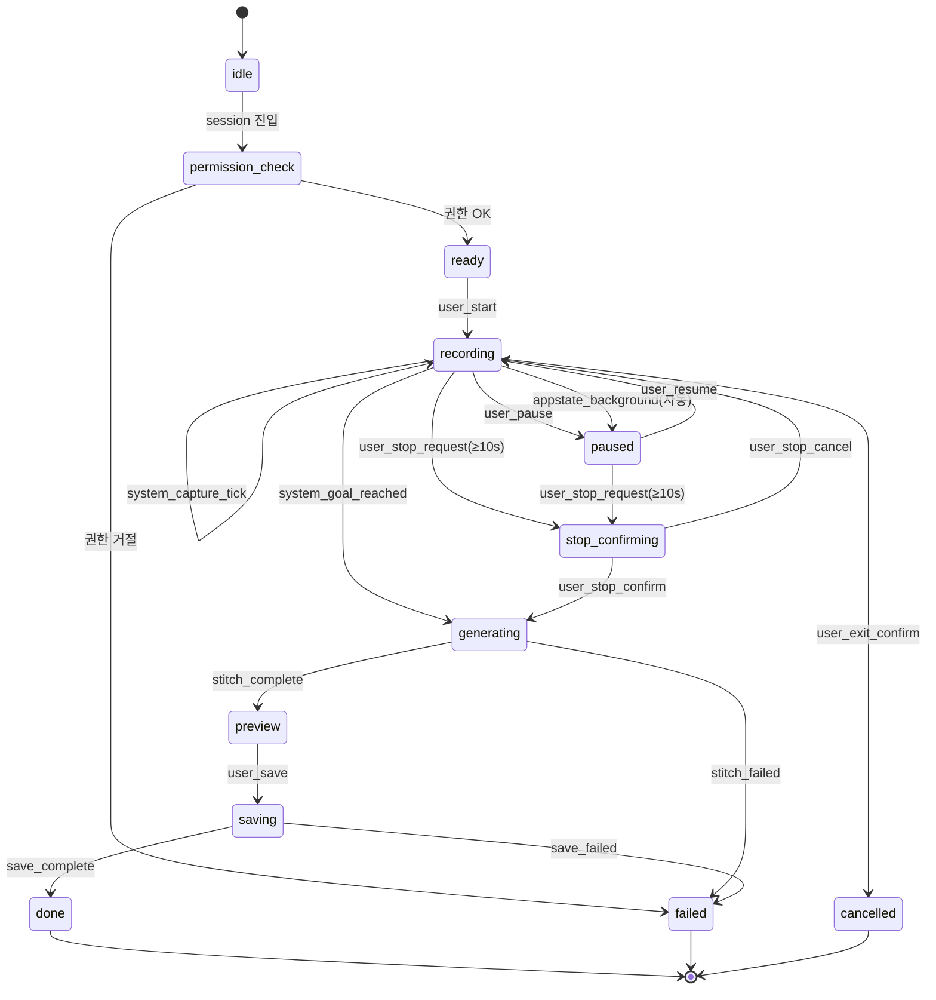

# 녹화 세션 상태머신

focus → generating → preview → saving → done 전체 녹화 흐름의 상태·이벤트·실패 모드 계약. 프레임 샘플링 패러다임([[decision-004-recording-paradigm|STL-DEC-004]]) + sqrt 스케줄([[decision-005-capture-schedule-function|STL-DEC-005]]) + 백그라운드 정지([[decision-006-background-recording-policy|STL-DEC-006]]) + 정지 모달([[decision-007-stop-confirmation-ux|STL-DEC-007]]) + 캐시 TTL([[decision-008-cache-lifecycle|STL-DEC-008]])을 반영한다.

> 원본: `medi_docs/current/spec/spec-01-recording-state-machine.md`. 결정 근거는 위 decisions. 원본의 D-SPEC 선택지(§8) 같은 의사결정 과정은 10-decision 으로 분리하고, 본 문서는 확정된 계약만 둔다.

## Context

- 관련 decision: 프레임 샘플링([[decision-004-recording-paradigm|STL-DEC-004]]), sqrt 스케줄([[decision-005-capture-schedule-function|STL-DEC-005]]), 백그라운드 keep-awake+자동정지([[decision-006-background-recording-policy|STL-DEC-006]]), 정지 인디케이터+모달([[decision-007-stop-confirmation-ux|STL-DEC-007]]), 캐시 생명주기([[decision-008-cache-lifecycle|STL-DEC-008]])
- 짝 spec: 캡처 파이프라인 native 계약 [[spec-002-capture-pipeline|STL-SPEC-002]] (상태 전이가 호출하는 native 함수의 시그니처/이벤트)
- 범위
  - In: 녹화 화면 상태 정의·전이·이벤트 enum·실패 모드·캐시 생명주기·백그라운드 처리
  - Out: native 캡처 모듈 구현([[spec-002-capture-pipeline|STL-SPEC-002]]), 세션 API([[spec-010-session-domain|STL-SPEC-010]])

## State Machine

상태는 화면 라우팅 + 로컬 플래그(`isRecording`/`hasStarted`/모달 플래그)로 모델링된다.

| 상태 | 화면 | 의미 |
|---|---|---|
| `idle` | (session-setup 직후) | focus 진입 전 |
| `permission_check` | focus | 카메라 권한 확인 중 |
| `ready` | focus | 권한 OK, 캡처 대기 (`isRecording=false, hasStarted=false`) |
| `recording` | focus | 캡처 진행 (`isRecording=true`). frame processor가 sqrt schedule로 JPEG 캡처 |
| `paused` | focus | 캡처 일시정지 (`isRecording=false, hasStarted=true`) |
| `stop_confirming` | focus (모달) | 정지 확인 모달. 캡처 일시정지(모달 동안 Z초 고정) |
| `generating` | generating | preview.mp4 stitch (오버레이 없음) |
| `preview` | result | 오버레이 옵션 선택 (RN 오버레이 시뮬, video timeline sync) |
| `saving` | saving | 최종 burn-in stitch + 갤러리 저장 |
| `done` | saving/stats | 저장 + 세션 PUT 완료 |
| `failed` | (alert) | 복구 불가 오류. alert 후 뒤로 |
| `cancelled` | (이전 화면) | 사용자 명시 취소 또는 백그라운드 강제 중단 |

### 정상 전이

| from | event | to | side effects |
|---|---|---|---|
| `idle` | session 진입 | `permission_check` | 카메라 권한 요청 |
| `permission_check` | 권한 granted | `ready` | — |
| `ready` | `user_start` | `recording` | captures/ 생성, frame processor 시작, keep-awake 활성 |
| `recording` | `system_capture_tick` | `recording` | frame_NNNNNN.jpg write |
| `recording` | `user_pause` | `paused` | pauseCapture |
| `paused` | `user_resume` | `recording` | resumeCapture |
| `recording`/`paused` | `user_stop_request` (elapsed≥10s) | `stop_confirming` | 캡처 일시정지, 모달 표시 |
| `stop_confirming` | `user_stop_confirm` | `generating` | stopCapture → /generating |
| `stop_confirming` | `user_stop_cancel` | `recording`/`paused` | resumeCapture, 직전 상태 복원 |
| `recording` | `system_goal_reached` (elapsed≥goalSec) | `generating` | 모달 없이 자동 stopCapture |
| `generating` | `system_stitch_complete` | `preview` | → /result |
| `preview` | `user_save` | `saving` | → /saving (선택 overlayStyle) |
| `saving` | `system_save_complete` | `done` | 갤러리 저장 + 세션 PUT + 캐시 cleanup |

### 에러/취소/백그라운드 전이

| from | event | to | side effects |
|---|---|---|---|
| `permission_check` | 권한 denied | (권한 요청 UI) | 같은 화면 내 권한 요청 분기 |
| `recording`/`paused` | `user_stop_request` (elapsed<10s) | (유지) | "최소 10초" alert, 상태 유지 |
| `recording` | `system_appstate_background`/`inactive` | `paused` | 자동 pauseCapture + alert |
| `generating` | `system_stitch_failed` | `failed` | alert → 뒤로 |
| `saving` | `system_save_failed` | `failed` | 갤러리 권한/오류 alert → 뒤로 |
| `any` | `user_exit_confirm` | `cancelled` | 나가기 확인 → stopCapture → 뒤로 |

## Flow



## 캐시 Lifecycle ([[decision-008-cache-lifecycle|STL-DEC-008]] 연동)

| 전이 | captures/ | preview.mp4 / 최종 mp4 |
|---|---|---|
| ready → recording | `documentDirectory/sessions/{sessionId}/captures/` 생성 | — |
| generating | 읽기 전용 (stitch 입력) | preview.mp4 생성 (오버레이 없음) |
| saving → done | cleanup TTL 타이머 시작 (`cleanupTtlSec` = 300초) | preview.mp4 즉시 삭제, 최종 mp4는 갤러리 저장 후 임시본 삭제 |
| TTL 만료 | captures/ 전체 삭제 | — |
| user_exit_confirm | 즉시 삭제 | 즉시 삭제 |

## 백그라운드 처리 ([[decision-006-background-recording-policy|STL-DEC-006]] 연동)

| 현재 상태 | 백그라운드 진입 | 비고 |
|---|---|---|
| `recording` | 자동 `paused` + alert. AppState `background`/`inactive` 둘 다 trigger | 복귀 후 resume 버튼으로 재개 |
| `recording` (화면) | `activateKeepAwakeAsync('focus-recording')`로 자동 잠금 방지 | 녹화 중에만, cleanup 시 deactivate |

## Case Matrix (실패 모드)

| FailureReason | 발생 | 처리 | 재시도 |
|---|---|---|---|
| `permission_camera_denied` | 카메라 권한 거절 | 같은 화면 내 권한 요청 UI | 설정 변경 후 |
| `min_duration_violation` | stop 시 elapsed<10초 | "최소 10초" alert, recording 유지 | — (계속) |
| `stitch_failed` | generating stitch 실패 | alert → 뒤로 | 캐시 TTL 내 재진입 |
| `save_permission_denied` | MediaLibrary 권한 거절 | alert → 뒤로 | 권한 허용 후 |
| `save_gallery_failed` | 갤러리 저장 오류 | alert → 뒤로 | ✅ |
| `session_api_failed` | 세션 PUT 실패 | console.warn 무시 (로컬 저장은 완료) | — |

## Data Contract

```text
RecordingState (enum, 화면+플래그로 표현)
  idle | permission_check | ready | recording | paused
  | stop_confirming | generating | preview | saving | done | failed | cancelled

OverlayStyle (result에서 선택) — [[spec-002-capture-pipeline|STL-SPEC-002]]와 공유
  'none' | 'timer-up' | 'timer-down' | 'progress' | 'streak'

minRecordingSec = 10   (정지 가능 하한)
cleanupTtlSec   = 300   (captures/ TTL, 5분)
```

## 구현 현황 (코드 grounding)

ground truth: `study_timelapse/frontend/mobile/`. 전 계약 요소 코드 정합 — gap 없음.

| 계약 | 코드 근거 |
|---|---|
| 상태/전이 | `app/focus.tsx` — start `:195`, pause `:432`, resume `:442`, stop request+10s guard `:219`, confirm→stopCapture `:238-251`, cancel `:286`, goal auto-stop `:140`, appstate 자동정지 `:147-166` |
| 최소 10초 | `app/focus.tsx:219-222` + `src/constants/captureTuning.ts:7` (`minRecordingSec: 10`) |
| 캐시 TTL | `app/saving.tsx` — preview 즉시삭제 `:188`, captures setTimeout `:191-199` + `captureTuning.ts:6` (`cleanupTtlSec: 300`) |
| keep-awake | `app/focus.tsx:168-176` |
| stitch/저장 실패 | `app/generating.tsx:113-119`, `app/saving.tsx:122-129` |
| 세션 PUT 실패 무시 | `app/saving.tsx:176-184` (console.warn) |

## Open Questions

- 없음 (구현·배포 완료). `failed`/`cancelled` 은 전용 상태 변수 없이 alert/navigation 으로 처리 — 동작상 동일.
