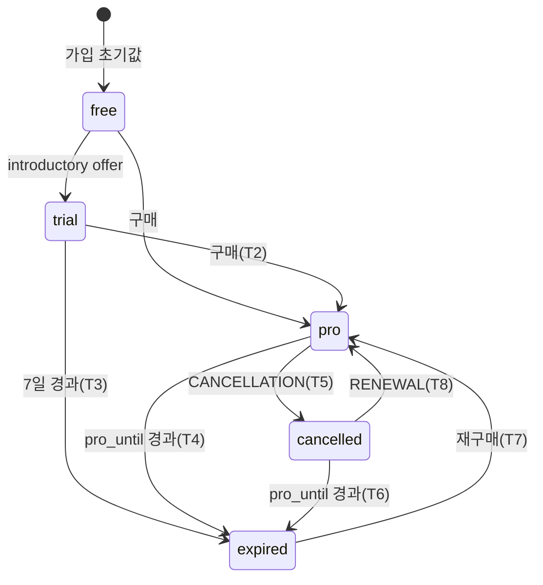

# 구독 5상태 머신

`free / trial / pro / expired / cancelled` 5상태 머신의 전이 규칙·타이머·불변조건([[decision-010-subscription-state-model|STL-DEC-010]]). 월 구독 단일([[decision-011-monthly-only-no-yearly|STL-DEC-011]]). 모든 상태 전이는 서버 SSOT 에서 발생하고 클라이언트는 `GET /api/users/me`로 조회한다.

> 원본: `medi_docs/current/spec/spec-03-subscription-state-machine.md`. 원본의 Phase 1/2 단계 비교·옵션 표는 10-decision 으로 분리. 본 문서는 확정 전이/불변조건 계약만 둔다. (원본 `sources`의 adr-14 는 Phase 실행전략 = 프로세스 결정이라 spec lineage 에서 제외.)

## Context

- 관련 decision: 5상태 모델 + timezone([[decision-010-subscription-state-model|STL-DEC-010]]), 월 only $1.99([[decision-011-monthly-only-no-yearly|STL-DEC-011]])
- 짝 spec: API 계약 [[spec-004-subscription-api|STL-SPEC-004]], 데이터 모델 [[spec-005-subscription-data-model|STL-SPEC-005]], RevenueCat 연동 [[spec-006-revenuecat-integration|STL-SPEC-006]]
- 범위: 상태 정의·전이·타이머·불변조건·edge case (서버 도메인 규칙)

## State Machine

### 상태 정의

| 상태 | 의미 | Free 한도(1/일) | 워터마크 | Pro 기능 |
|---|---|:---:|:---:|:---:|
| `free` | 구독 없음 (Phase 2 신규 가입 초기값) | ✓ | ✓ | ✗ |
| `trial` | 7일 체험 (RevenueCat introductory offer) | ✗ | ✗ | ✓ |
| `pro` | 유효 구독 | ✗ | ✗ | ✓ |
| `expired` | trial/pro 만료 후 | ✓ | ✓ | ✗ |
| `cancelled` | 갱신 취소 (만료 전 Pro 유지) | pro_until 전 ✗/후 ✓ | — | pro_until 전 ✓/후 ✗ |

> Pro 판정: `subscription_status IN ('trial','pro')` OR (`cancelled` AND `pro_until > now()`)

### 전이 규칙

| # | from | to | 트리거 | 조건 | Phase |
|---|---|---|---|---|---|
| T2 | `trial` | `pro` | mock_purchase / 구매 | 유효 구매 | 1 |
| T3 | `trial` | `expired` | trial_expired | `trial_start_date + 7일` 경과 | 1 |
| T4 | `pro` | `expired` | subscription_expired | `pro_until` 경과 | 1 |
| T5 | `pro` | `cancelled` | CANCELLATION | 자발적 취소 (pro_until 까지 Pro 유지) | 2 |
| T6 | `cancelled` | `expired` | subscription_expired | `pro_until` 경과 | 2 |
| T7 | `expired` | `pro` | 재구매 | 유효 구매 | 1 |
| T8 | `cancelled` | `pro` | RENEWAL | 재구독 | 2 |

> Phase 2 신규 가입은 `free` 로 시작([[spec-009-auth-onboarding|STL-SPEC-009]]). 가입 시 trial 자동 시작 없음. trial 진입은 RevenueCat introductory offer 로만 ([[spec-006-revenuecat-integration|STL-SPEC-006]]).

## 타이머·스케줄

| 이벤트 | 조건 | 방식 |
|---|---|---|
| trial 만료 | `trial_start_date + 7일 ≤ now()` | lazy check (`GET /users/me`·로그인 시 `apply_lazy_expiry`) |
| pro 만료 | `pro_until ≤ now()` | lazy check |
| 만료 사전 배너 | trial 종료 24h/1h 전 | `banner_alert` 필드 (서버 계산) |
| 일일 한도 리셋 | 사용자 로컬 자정 | `daily_focus.date` = 사용자 timezone 로컬 날짜 |

## 불변조건 (Invariants)

| # | 조건 |
|---|---|
| I1 | `trial`/`pro` → `is_pro = true` |
| I2 | `free`/`expired` → `is_pro = false` (`cancelled`+`pro_until>now`는 예외 true) |
| I3 | `trial` → `trial_start_date IS NOT NULL` |
| I4 | `pro`/`cancelled` → `pro_until IS NOT NULL` |
| I5 | `subscription_events` 는 INSERT 만 ([[spec-005-subscription-data-model|STL-SPEC-005]]) |
| I6 | 동일 사용자 동시 구매는 멱등 |

## Validation (상태별 허용)

| 상태 | 구매 허용 | 세션 시작 | Pro 기능 |
|---|:---:|:---:|:---:|
| `free` | ✓ | 한도 내(1/일) | ✗ |
| `trial` | ✓ | 무제한 | ✓ |
| `pro` | ✓ (멱등) | 무제한 | ✓ |
| `expired` | ✓ (재구매) | 한도 내 | ✗ |
| `cancelled` | ✓ | pro_until 전 무제한/후 한도 | pro_until 전 ✓ |

세션 시작 한도 초과 시 `POST /api/sessions` → `403 DAILY_QUOTA_EXCEEDED` ([[spec-010-session-domain|STL-SPEC-010]]).

## 구현 현황 (코드 grounding)

ground truth: `study_timelapse/backend/`. 전 계약 요소 코드 정합 — gap 없음.

| 계약 | 코드 근거 |
|---|---|
| 5상태 CHECK | `app/models/user.py:18-22`, 마이그 `alembic/versions/003_*.py:40-44` |
| 가입=free | `app/services/auth_service.py:147-149` (`free`/None/False) |
| 멱등 구매(T2/T7) | `app/services/subscription.py:108-178` (pro_until=now+30d, idempotent) |
| lazy expiry(T3/T4) | `app/services/subscription.py:69-105` |
| is_pro 불변조건 | `app/services/subscription.py` (trial/pro→true, cancelled 조건부 `:206-209`) |
| timezone/로컬날짜 | `app/models/user.py:40-42`, `app/api/v1/sessions.py:55-58` |
| 일일 한도 | `app/services/subscription.py:32-39` (quota), `app/api/v1/sessions.py:52-69` (403) |

## Open Questions

- 없음 (Phase 1 5상태 + lazy expiry 구현·배포). Phase 2 전이(T5/T6/T8)는 RevenueCat webhook 경로 — [[spec-006-revenuecat-integration|STL-SPEC-006]] 참조 (단, INITIAL_PURCHASE trial 분기 미구현 — 해당 spec OQ).
