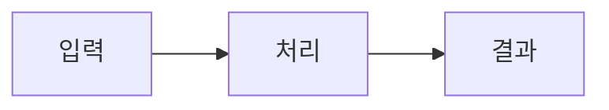

# 스크랩 글 양식 (`post_article`)

`persona/posts/{slug}.md` 중 **스크랩** 계열의 형식을 정의한다. **이 파일이 양식 원천이다.**

남의 자료(블로그·문서·영상)를 읽고 **핵심만 가독성 있게** 남긴 공개 글이다. 원본 정리 전문은 `resources/source/` 가 갖고, 이 글은 그것을 **1:1 로** 받아 압축한다.

> 공부하며 내가 세운 것은 `post_note` 다(`templates/persona/post-note.md`). 갈리는 기준은
> **누가 말한 것인가** — 자료가 말한 것이면 article, 내가 이해한 것이면 note 다.

## 목표

**독자가 원본을 안 열고도 요지를 얻어야 한다.** 요약이 아니라 **정리**다 — 자료가 흩어 놓은 것을 순서대로 세우고, 그림 하나로 구조를 보이고, 쓸 자리와 조심할 자리를 남긴다.

`resources/source/` 와 겹치는 것을 두려워하지 않는다. 그쪽은 **전문 기록**(비공개)이고 여기는 **읽히는 글**(공개)이다 — 목적이 다르므로 같은 내용이 다른 밀도로 있는 것이 정상이다.

## Frontmatter

```yaml
---
type: post_article
id: <파일명 stem 과 동일>
title: <60자 이내. 원본 제목보다 구체적으로>
summary: <핵심 한 줄. 80자 이내>
date: <YYYY.MM.DD 작성일>
up:
  - <이 글이 압축한 `resources/source/` stem. **1:1**>
source: <원문 URL>
source_author: <저자·채널>
tags:
  - <검색용 키워드 2~5개>
---
```

`up:` 은 **하나**다. 여러 자료를 묶는 글이면 그것은 이 계열이 아니다.

## 본문 — 다섯 절, 순서대로

### 주제

무엇에 대한 글인지 1~2문단. **왜 이걸 스크랩했는지**까지 적는다 — 자료를 고른 이유가 곧 이 글의 각도다.

### 개념

구조를 **mermaid 하나**로 보인다. 글로 세 문단 쓸 것을 그림 하나가 대신하는 자리다.

````markdown

````

그림 아래에 **그림이 말하지 않는 것**을 덧붙인다 — 순서·조건·예외.

### 사용 예시

**코드나 실제 상황**으로 보인다. 자료에 예시가 있으면 그것을 쓰고, 없으면 만들지 않는다 — 지어낸 예시는 자료가 보증하지 않는다.

### 리스크

**언제 안 통하는가.** 자료가 밝힌 한계, 전제, 비용. 자료가 홍보성이면 그 사실도 여기 적는다.

이 절이 비면 대개 **덜 읽은 것**이다.

### 비슷한 개념

혼동되는 것과 **무엇이 다른지** 한 줄씩. 우리 개념 노트가 있으면 `[[concept]]` 로 잇는다.

```markdown
- [[idempotency]] — 여러 번 해도 같다는 점은 같고, 이쪽은 …
```

## 하지 않는 것

- **원문 전문 복사** — 그건 `resources/source/` 의 일이다
- **여러 자료 묶기** — `up:` 이 하나라는 규칙이 그것을 막는다
- **개념 상세 재서술** — `resources/concept/` 가 SoT 다. 요지만 쓰고 `[[]]` 로 위임한다
