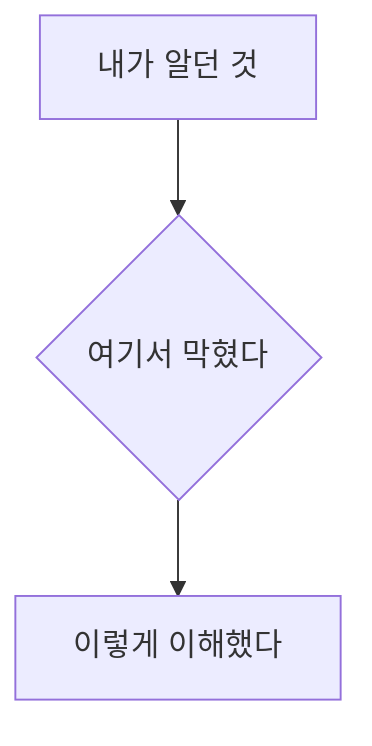

# 공부 글 양식 (`post_note`)

`persona/posts/{slug}.md` 중 **공부** 계열의 형식을 정의한다. **이 파일이 양식 원천이다.**

자료를 읽고 **내가 이해한 것을 내 언어로** 세운 공개 글이다. 원본 정리 전문은 `resources/source/` 가 갖고, 이 글은 그것을 **1:1 로** 받아 다시 쓴다.

> 자료의 요지를 그대로 압축한 것은 `post_article` 이다(`templates/persona/post-article.md`).
> 갈리는 기준은 **누가 말한 것인가** — 자료가 말한 것이면 article, 내가 이해한 것이면 note 다.

## 목표

**읽는 사람이 나와 같은 이해에 도달해야 한다.** 자료를 옮기는 것이 아니라 **내가 넘어진 자리와 넘은 방법**을 남기는 글이다.

그래서 `post_article` 과 밀도가 다르다. 저쪽은 자료의 순서를 따르고, 이쪽은 **내가 이해한 순서**를 따른다.

## Frontmatter

```yaml
---
type: post_note
id: <파일명 stem 과 동일>
title: <60자 이내. "X는 Y다" 처럼 이해한 것을 한 문장으로>
summary: <핵심 한 줄. 80자 이내>
date: <YYYY.MM.DD 작성일>
up:
  - <이 글이 자란 `resources/source/` stem. **1:1**>
tags:
  - <검색용 키워드 2~5개>
---
```

`up:` 은 **하나**다. 여러 자료를 엮은 판단은 이 계열이 아니다.

## 본문 — 다섯 절, 순서대로

### 주제

무엇을 이해하려 했는지, **왜 막혔는지** 1~2문단. 「몰랐던 상태」를 적어 두는 것이 이 글의 값이다 — 다 알고 나면 무엇이 어려웠는지 잊는다.

### 개념

이해한 구조를 **mermaid 하나**로 보인다. **내가 그린 그림**이지 자료의 그림이 아니다.

````markdown

````

그림 아래에 **그림이 말하지 않는 것**을 덧붙인다.

### 사용 예시

**직접 해 본 것**을 쓴다. 돌려 본 코드, 실제로 확인한 값. 자료의 예시를 그대로 옮기면 그건 article 이다.

### 리스크

**내가 틀릴 수 있는 자리.** 확인 못 한 것, 다른 조건에서 안 될 것 같은 것, 추측인 부분.

**추측을 사실처럼 쓰지 않는다** — 확인 안 된 것은 확인 안 됐다고 적는다. 이 절이 비면 대개 덜 판단한 것이다.

### 비슷한 개념

혼동했던 것과 **무엇이 달랐는지** 한 줄씩. 우리 개념 노트가 있으면 `[[concept]]` 로 잇는다.

```markdown
- [[optimistic-lock]] — 충돌을 막지 않고 검출한다는 점이 …
```

## 하지 않는 것

- **자료 요지 옮기기** — 그건 `post_article` 이다
- **개념 상세 재서술** — `resources/concept/` 가 SoT 다. 요지만 쓰고 `[[]]` 로 위임한다
- **모르는 것을 아는 척** — 「리스크」가 그 자리다
