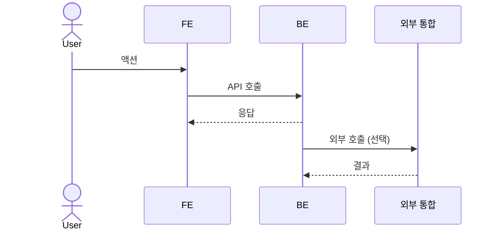
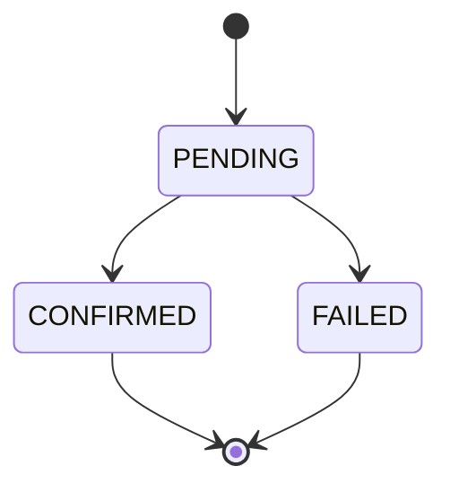

# Title

<1-2줄 요약: 이 기능/정책 묶음이 사용자, QA, client, 외부 통합에 무엇을 보장하는지 적는다.>

> 기능/정책 묶음 단위의 **외부 계약** 문서다. client / QA / 외부 통합이 이 문서만 읽고 따를 수 있어야 한다.
> SPEC에는 table schema 전문, ORM field, repository/service 구조, PR 계획, 구현 순서, 라우트·컴포넌트 파일 경로 같은 내부 구현을 두지 않는다.
> SPEC은 특정 `WORK-001` 같은 work ID를 본문에 직접 박지 않는다. 추적은 work frontmatter `links.specs`와 `30-work/README.md`의 Spec Coverage에서 단방향으로 관리한다. 일반 표현인 “관련 work”는 허용한다.

## 1. Context

### Meta

- Decision reference: (frontmatter `links.decisions`와 일치)
- Baseline reference: (frontmatter `links.baselines`와 일치)
- Domain note: <외부에 드러나는 resource/status/enum. 내부 schema 상세는 제외>
- Open questions: <없음 또는 질문 ID/링크>

### Business Requirement

<왜 필요한가 — 사용자 / 운영 / 비즈니스 관점에서 이 SPEC이 보장하는 것>

### Scope

In scope:

- <범위 1>

Out of scope:

- <제외 범위 1 — 어느 spec/work/phase로 미루는지, ID 없이 표현 가능>

## 2. UX Contract

화면을 구성하는 컴포넌트/영역을 먼저 나열한 뒤, 각각을 `### U-N. <컴포넌트/영역>`으로 박고 상태·문구·CTA·기대결과를 명시한다. UI가 없는 spec(webhook/백그라운드 처리 등)이면 `해당 없음`으로 둔다.

### Placement

<모달 / 사이드바 / 페이지 등 화면 위치. UI 없는 spec은 `해당 없음`.>

```text
+──────────────────────────────────────────────────+
│ <상단 헤더>                                       │
+──────────────┬───────────────────────────────────+
│ <사이드바>   │ <탭 / 브레드크럼>                  │
│              │ <spec 화면 본문>                   │
+──────────────┴───────────────────────────────────+
```

### U-1. <컴포넌트/영역 이름>

- **상태**: 각 상태(정상 / 로딩 / 빈 / 에러 / 권한없음 등)에서 무엇이 보이는가
- **문구**: 노출 텍스트(헤더·라벨·플레이스홀더·안내·에러 메시지) — 화면에서 확인 가능한 비즈니스 용어로
- **CTA**: 액션 이름 · 사용 컴포넌트 · 위치 · 활성/비활성 조건
- **기대 결과**: 액션 후 무엇이 일어나는가(페이지 이동 / 모달 / 토스트 / 데이터 갱신)

### U-2. <컴포넌트/영역 이름>

- **상태**:
- **문구**:
- **CTA**:
- **기대 결과**:

## 3. User Scenario

이 spec이 보장하는 흐름을 actor별 시나리오로 나눠 박는다. 각 시나리오는 `### S-N. <actor> — <제목>` + 번호 매긴 단계로 서술하고, 단계 안에 조건·예외·경계·다른 spec 참조를 함께 적는다. QA가 단계 1:1로 TC를 추출할 수 있어야 한다.

정상 흐름뿐 아니라 비정상·경계·권한·빈 상태·조건부 노출도 빠짐없이 나열한다. 화면 조작이 없는 백엔드/파이프라인 spec도 외부 actor 발신·시스템 경계 수신 등 관찰 가능한 흐름이 있으면 시나리오로 둔다. 순수 내부 처리만 있으면 `해당 없음`.

### S-1. <actor> — <시나리오 제목>

1. <단계>
2. <단계> (조건/예외/참조 inline)
3. <단계>

### S-2. <actor> — <시나리오 제목>

1. <단계>
2. <단계>

## 4. Interface Contract

### API Contract

| Method | Path | 요약 | 권한 |
|---|---|---|---|
| POST | `/<prefix>/...` |  | admin / staff |

### Request / Response

<엔드포인트별 정상 응답 schema · status code. 에러는 여기 두지 않고 Case Matrix를 단일 SoT로 둔다. 긴 JSON schema는 `00-baseline/<BL-ID>/`로 분리하고 link.>

### Validation

입력 검증 규칙 — **어떤 입력이 valid한가**만 적는다. FE(즉시 피드백) / BE(최종 신뢰 경계)가 같은 규칙을 각자 구현한다. 위반 시 에러코드·표시·위치는 Case Matrix에 둔다.

| 필드 | 규칙 |
|---|---|
|  |  |

### Case Matrix

모든 에러/경계 케이스의 단일 SoT(validation 위반 · 권한 · 충돌 · 빈상태 · 로딩 등). API 상세는 정상 응답만, 에러는 전부 여기 둔다.

| 에러 코드 | 백엔드 출력 | 프론트 출력 | 표시 위치 |
|---|---|---|---|
|  |  |  |  |

### Flow

End-to-end 흐름을 sequence diagram으로 적는다.



### State / Lifecycle

외부에 드러나는 enum · 상태 transition이 있으면 Mermaid state diagram으로 적는다. 상태 전이가 없으면 `해당 없음`으로 둔다.



내부 구현 invariant(FOR UPDATE / partial unique 등)는 관련 work 또는 코드/migration에 둔다. 여러 work가 반복 참조하면 optional architecture로 승격한다.

### Data Contract

외부에 드러나는 resource, field, enum, lifecycle만 적는다. DB column/index/FK 전문은 코드/migration이 SoT다.

## 5. Implementation Rules

외부에서 관찰 가능한 구현 규칙만 적는다.

- 멱등성 / 동시성 / timeout / retry 계약:
- 권한 검증 / 예외 처리:
- 외부 통합 호출 규칙:

라우트, 페이지, 컴포넌트 파일, service/repository 구조, migration 적용 순서는 work에 둔다.

## 6. Verification

### Acceptance Criteria

- [ ] <사용자/QA/client 관점의 완료 기준>
- [ ] <...>

## 7. Open Questions

- <없음 또는 질문>
