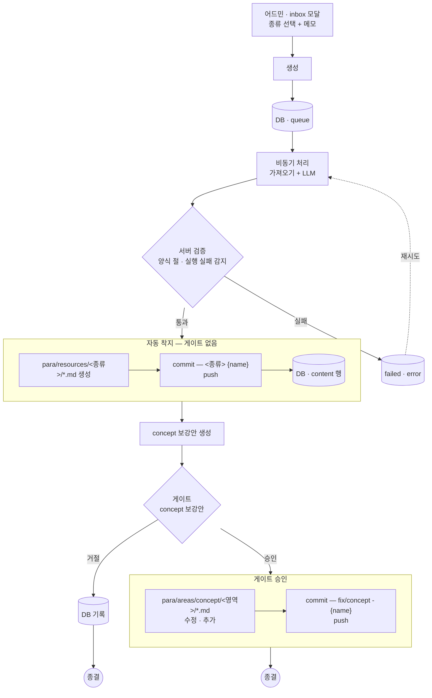
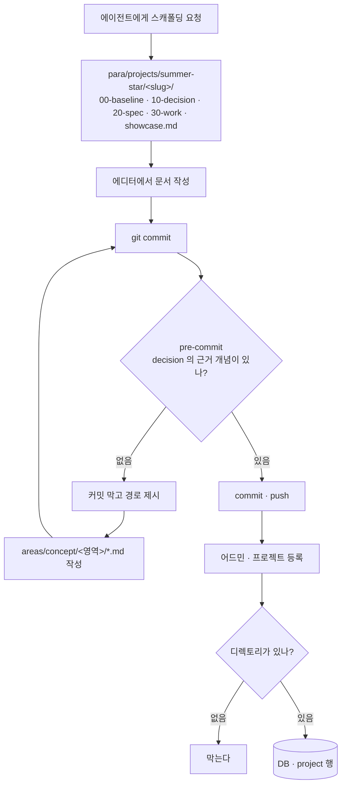
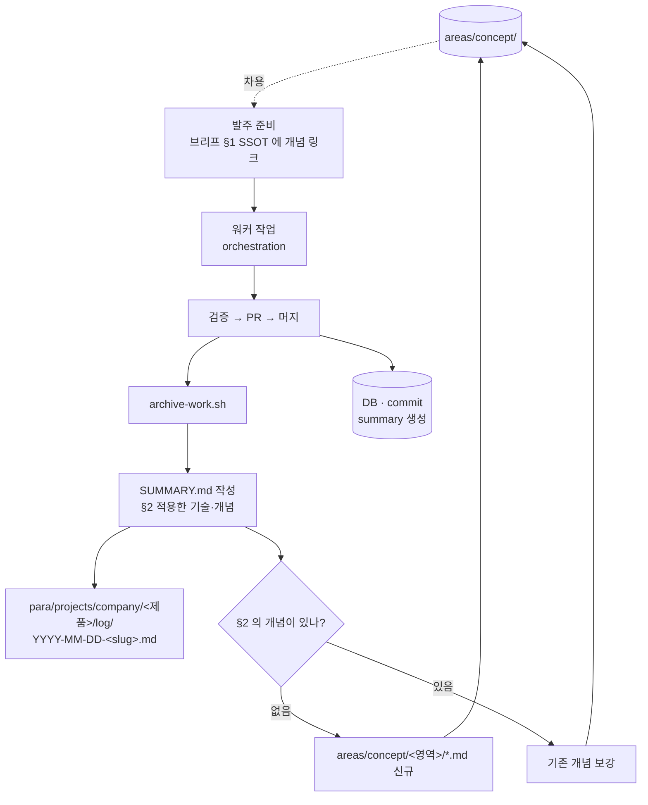
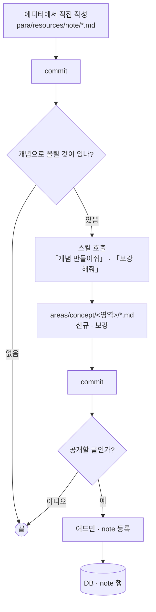
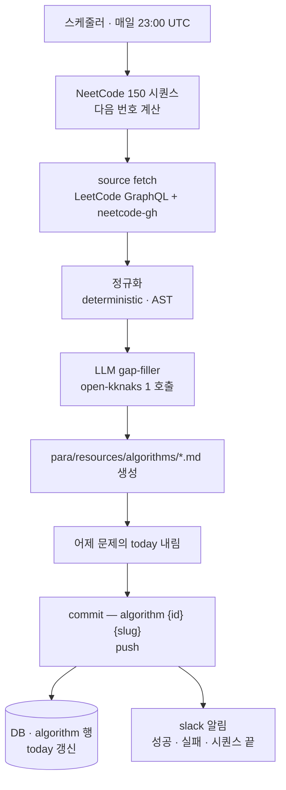
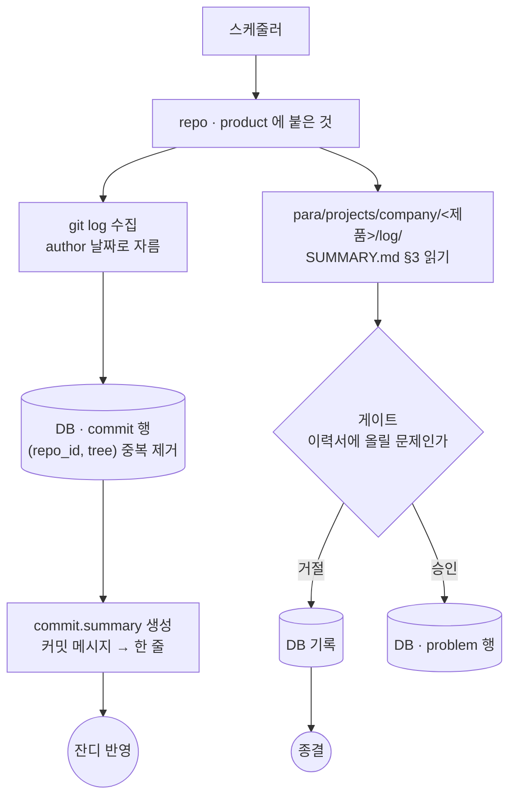
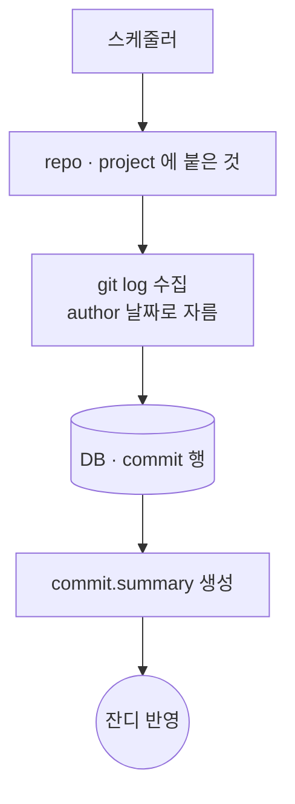

# Case Flow

무엇이 들어왔을 때 `para/` 의 md 와 DB 의 행이 각각 어디까지 바뀌는지를 케이스로 적는다.

## 세 방향

케이스마다 **누가 만들고 개념을 어떻게 잇는지가 다르다.** 이 축이 케이스를 가른다.

| | 만드는 쪽 | 개념을 잇는 방식 | 케이스 |
|---|---|---|---|
| 밖에서 들어온 것 | 자동화 | **게이트** — 시스템이 물어본다 | 1 |
| 결정을 쓴다 | 사람 | **pre-commit** — 없으면 막는다 | 2 |
| 글을 쓴다 | 사람 | **스킬** — 내가 시킨다 | 4 |
| 매일 도는 것 | 자동화 | **없다** — 개념으로 안 올린다 | 5 · 6 |

**자동화가 만든 것은 사람이 승인하고, 사람이 만든 것은 기계가 검증한다.**
다만 **글은 강제하지 않는다** — 결정은 근거 개념이 없으면 붕 뜨지만 글은 개념이
없어도 성립한다. 그냥 기록일 수도 있다.

게이트를 타는 케이스는 승인할 때마다 md 를 쓰고 커밋·푸시한다 — 승인을 모아 뒀다가
한 번에 내보내지 않는다. 미커밋 변경이 쌓이면 사람이 옵시디언에서 같은 자리를 만질 때
엉킨다.

**`areas/concept/` 은 쌓이기만 하는 곳이 아니라 쓰이는 곳이다.**

```text
areas/concept/  ──차용──▶  워커 브리프 · 결정  ──▶  작업  ──▶  회고  ──축적──▶  areas/concept/
```

유튜브를 보든 프로젝트를 하든 회사 일을 하든 배운 것은 개념으로 올라가고, 다음 작업을
시작할 때 그 개념을 꺼내 쓴다. **고리가 닫혀야 쌓는 의미가 있다** — 쌓기만 하면 읽지
않는 노트가 되고, 꺼내 쓰기만 하면 늘지 않는다.

| | 어디서 | 케이스 |
|---|---|---|
| **쓴다** | `10-decision/` 의 근거 | 2 |
| | 워커 브리프 §1 SSOT | 3 |
| **쌓는다** | 게이트 2 | 1 |
| | decision 을 쓰다 없으면 | 2 |
| | `SUMMARY.md §2` | 3 |

케이스 2 는 쓰는 곳이자 쌓는 곳이다. 결정을 쓰면서 기존 개념을 차용하고 없으면 그 자리에서 만든다.

**개념은 공개 표면에 뜨지 않는다.** `note` 테이블이 가리키는 것은 `resources/note/` 고,
`areas/concept/` 은 DB 에 없다. 내가 쓰려고 쌓는 것이지 보여주려고 쌓는 것이 아니다.

**개인 프로젝트는 당분간 단일 에이전트로 한다.** 오케스트레이션은 회사 일에서 먼저
검증하고, 되면 그때 옮긴다. 그래서 지금 개념을 쓰는 곳이 둘이고, 개인 프로젝트에도
워커를 붙이면 셋이 된다.

## 케이스 1 — 자료 캡처



> **2026-08-25 개정 — 문서 게이트를 뺐다.** 원래 게이트 둘(문서·개념)이었는데 승인
> 피로가 커서 문서는 자동 착지로 바꿨다. 대신 방어선을 승인에서 **서버 검증**으로
> 옮겼다 — 채번(C-NNN)은 서버가 강제하고, 양식 절 구성이 안 맞거나 LLM 실행 실패
> 흔적이 있으면 착지하지 않고 `failed` 로 남긴다. 잘못 착지한 것은 `content.visible`
> 로 표면에서 내리고 원장은 에디터에서 고친다.

### 종류

**흐름은 전부 같고 가져오는 방법만 다르다.**

| 종류 | 무엇을 가져오나 | 도착지 | DB | v1 |
|---|---|---|---|---|
| `youtube` | 자막 + 메타 | `resources/youtube/` | `content` 행 | ○ |
| `docs` | 본문 크롤링 | `resources/docs/` | — | ○ |
| `article` | 본문 크롤링 | `resources/article/` | — | ○ |
| `blog` | 본문 크롤링 | `resources/blog/` | — | ○ |
| `book` | **가져올 것이 없다** — 메모가 유일한 입력 | `resources/book/` | — | **버튼만** |
| `session` | **가져올 것이 없다** — 현장 노트가 입력 | `resources/session/` | — | **버튼만** |

`book`·`session` 은 v1 에서 로직을 만들지 않는다. **모달에 버튼만 두고 구멍으로 둔다** —
자리를 비워 두면 나중에 종류를 추가할 때 모달 구조부터 다시 봐야 한다.

`youtube` 만 DB 행(`content`)이 생긴다. 나머지는 공개 표면이 없어서 md 만 남는다 —
공개하고 싶어지면 그때 `note` 에 등록한다.

### 건드리는 곳

| 단계 | md | DB | git |
|---|---|---|---|
| 모달 생성 | — | `queue` 행 | — |
| 비동기 처리 + 검증 | — | 실패 시 `failed` 기록 | — |
| 자동 착지 (검증 통과) | `resources/<종류>/*.md` 생성 | `content` 행 (youtube 만) | `<종류> {name}` |
| 게이트(concept) 승인 | `areas/concept/<영역>/*.md` 수정·추가 | — | `fix/concept - {name}` |
| 게이트(concept) 거절 | — | 기록 → 종결 | — |

**md 두 곳, DB 두 곳, 커밋 두 번 — 승인은 concept 한 번.**

### 정한 것

- **리소스 분류를 AI 에 맡기지 않는다.** 종류는 모달에서 사람이 고른다. 게이트 1 은
  생성된 문서 결과만 보여준다
- **종류가 달라도 흐름은 하나다.** 가져오는 방법만 갈리므로 케이스를 나누지 않는다
- **비동기 + 폴링.** 자막·LLM 이 수십 초라 버튼을 물고 기다리지 않는다
- **문서 md 는 검증 통과 시점에, concept md 는 승인 시점에 생긴다.**
  커밋·푸시는 착지마다 따로 나간다 (2026-08-25 개정 — 원래 둘 다 승인 시점이었다)
- **푸시가 성공해야 DB 를 확정한다.** 파일이 원장이므로 파일이 먼저 착지한다.
  실패하면 게이트가 「승인됨」인 채로 남고 다시 누르면 재시도한다 — 별도 재시도 잡을
  두지 않는다

### 아직 안 정한 것

- 같은 자료를 두 번 넣었을 때 막을지
- `id` 채번과 파일명 규칙
- 크롤링이 실패했을 때 — 게이트에 실패로 띄울지, 메모만으로 진행할지

---

## 케이스 2 — 개인 프로젝트

**게이트가 없다.** 내가 에디터에서 직접 쓰는 것이라 승인할 사람이 따로 없고,
대신 pre-commit 이 검증한다.



### 건드리는 곳

| 단계 | md | DB | git |
|---|---|---|---|
| 스캐폴딩 | `projects/summer-star/<slug>/` 7단계 생성 | — | 커밋 |
| 문서 작성 | `00-baseline` → `10-decision` → `20-spec` → `30-work` | — | 커밋 (pre-commit 검증) |
| 개념 보강 | `areas/concept/<영역>/*.md` | — | 같은 커밋 |
| 어드민 등록 | — | `project` 행 | — |

### 정한 것

- **md 가 먼저, DB 가 나중.** 디렉토리가 없으면 어드민에서 등록이 막힌다.
  **프로젝트의 시작은 스캐폴딩이지 등록이 아니다**
- **스캐폴딩은 로컬 에이전트가 한다.** 새 프로젝트를 할 때 말로 시킨다
- **`detail_path` 는 `showcase.md` 를 가리킨다.** 프로젝트 카드를 누르면 그 상세가 뜬다.
  옛 `showcase.md` 는 공개 카드 메타까지 갖고 있었는데, 그 메타는 이제 DB 행이다 —
  양식은 나중에 고친다
- **`10-decision/` 은 근거 개념을 가리켜야 한다.** 없으면 그 자리에서 만든다.
  「나중에」로 넘기면 그 개념은 만들어지지 않는다

### 아직 안 정한 것

- pre-commit 이 무엇을 검사하나 — 참조 형식(`up:` · `[[wikilink]]`), 없을 때 막을지 경고만 할지
- 어드민 등록이 무엇까지 확인하나 — 디렉토리만 · `showcase.md` 까지 · 단계 몇 개까지
- 문서 템플릿이 어디 사나 — 지금 루트 셋 어디에도 자리가 없다

---

## 케이스 3 — 회사 작업

`orchestration/` 으로 워커를 발주하고, 끝나면 회고가 `para/` 에 남는다.
**개념을 꺼내 쓰는 것으로 시작해서 개념을 쌓는 것으로 끝난다.**



### 건드리는 곳

| 단계 | md | DB | git |
|---|---|---|---|
| 발주 준비 | `orchestration/work/<slug>/*-brief.md` | — | 커밋 |
| 워커 작업 | (회사 레포 · 이 레포 아님) | — | — |
| 진행 기록 | `orchestration/work/<slug>/_RESUME.md` | — | 커밋 |
| 종결 | `para/projects/company/<제품>/log/YYYY-MM-DD-<slug>.md` | — | 커밋 |
| 개념 축적 | `areas/concept/<영역>/*.md` | — | 같은 커밋 |
| 잔디 | — | `commit` 행 + `summary` | — |

### 정한 것

- **개념은 브리프 §1 SSOT 에서 차용한다.** 워커는 브리프 한 장만 받으므로, 개념을 안
  넣으면 워커가 매번 처음부터 판단하고 같은 결정이 작업마다 달라진다
- **`SUMMARY.md` 를 `orchestration/` 에 두지 않는다.** 회고는 제품 문서라
  `para/projects/company/<제품>/log/` 에 직접 쓴다. 사본을 만들지 않는다
- **`orchestration/work/` 는 발주 기록만 갖는다** — 브리프와 `_RESUME.md`.
  작업 중에 필요한 것이지 남길 것이 아니다
- **`log/` 하위에 날짜별로 쌓는다.** 회사 프로젝트는 `sot: external` 이라 스펙 단계가
  없어서, README 옆에 기록이 계속 쌓이면 목록이 흐려진다
- **§6 산출물(PR 링크·브랜치·sha)을 그대로 남긴다.** private 레포 링크는 인증 없이
  404 라 노출 위험이 아니고, 오히려 경력의 증거다. 나가면 안 되는 것은 prod 접속
  경로·조직도·고객 데이터인데 SUMMARY 에는 애초에 들어가지 않는다

### 아직 안 정한 것

- 브리프에 개념을 **누가 고르나** — 코디네이터가 직접 · 검색으로 후보 제시
- `archive-work.sh` 가 `para/` 에 쓸 때 제품 디렉토리가 없으면 — 막을지 만들지
- 잔디 `commit.summary` 를 무엇으로 만드나 — 커밋 메시지만 · `SUMMARY §2` 도 함께

---

## 케이스 4 — 내가 쓴 글

`resources/note/` 에 직접 쓴다. **내가 썼으니 어떤 개념을 쓰는지 내가 안다** —
그래서 게이트도 검사도 필요 없고, 에이전트에게 시키면 된다.



### 건드리는 곳

| 단계 | md | DB | git |
|---|---|---|---|
| 글 작성 | `resources/note/*.md` | — | 커밋 |
| 개념 생성·보강 | `areas/concept/<영역>/*.md` | — | 커밋 |
| 공개 등록 | — | `note` 행 | — |

### 정한 것

- **개념 생성은 클로드 스킬로 한다.** 내가 쓴 글이라 어떤 개념을 쓰는지 명확해서
  「개념 만들어줘」·「보강해줘」로 시키면 된다. 시스템이 추론할 이유가 없다
- **강제하지 않는다.** 케이스 2 의 `decision` 과 다르다 — 결정은 근거가 없으면 붕
  뜨지만 글은 개념 없이도 성립한다
- **공개는 선택이다.** 글을 쓴다고 사이트에 뜨지 않는다. 어드민에서 `note` 에
  등록해야 뜬다

### 아직 안 정한 것

- 스킬이 무엇을 보고 개념 후보를 고르나 — 글 전문 · 내가 지정한 부분
- 놓친 글을 나중에 훑는 장치가 필요한가 — 강제하지 않으니 개념이 안 올라간 글이 쌓인다

---

## 케이스 5 — 알고리즘

**지금 구조를 그대로 간다.** 스케줄러가 매일 문제 하나를 만들고 바로 커밋·푸시한다.
승인도 검증도 없다.



### 건드리는 곳

| 단계 | md | DB | git |
|---|---|---|---|
| 문제 생성 | `resources/algorithms/*.md` 생성 | `algorithm` 행 | `algorithm {id} {slug}` |
| today 이동 | 어제 문제의 `today` 내림 | `today` 갱신 | 같은 커밋 |

### 정한 것

- **게이트가 없다.** 출처가 NeetCode 150 이라 내용이 정해져 있고, LLM 은 빈칸만
  메운다. 사람이 볼 것이 없다
- **개념으로 올리지 않는다.** 다른 케이스는 전부 `areas/concept/` 로 귀결하는데 이것만
  아니다 — 매일 한 문제씩 자동으로 도는 것이라 개념을 만들면 잡음이 쌓인다.
  풀면서 알게 된 것이 있으면 케이스 4 로 따로 쓴다
- **`today` 는 한 번에 하나다.** 새 문제를 박으면서 어제 것을 같은 커밋에서 내린다.
  DB 에서는 partial unique index 가 강제한다

### 아직 안 정한 것

- 시퀀스가 끝나면(150 문제 소진) 무엇을 하나 — 지금은 slack 알림만 간다

---

## 케이스 6 — 잔디잡 · 회사

매일 도는 스케줄 잡. **하는 일은 「내가 한 일」의 최신화**다.
개인 프로젝트는 읽을 것이 달라서 잡을 나눈다 — 케이스 7.

같은 잡 안에서 두 갈래가 갈린다 — **잔디는 자동으로 나가고 `problem` 은 게이트를 거친다.**



### 건드리는 곳

| 단계 | md | DB | git |
|---|---|---|---|
| 커밋 수집 | — | `commit` 행 | — |
| 요약 생성 | — | `commit.summary` | — |
| 문제 추출 | `SUMMARY.md §3` 읽기 (수정 안 함) | — | — |
| 게이트 승인 | — | `problem` 행 | — |

**md 를 안 쓴다.** 잔디잡은 읽기만 하고 쓰는 곳은 DB 뿐이다.

### 정한 것

- **개념은 건드리지 않는다.** 이미 케이스 3 에서 사람이 `SUMMARY §2` 를 쓰면서 올린다.
  잡이 또 하면 중복이고, 자동으로 만들면 잡음이 쌓인다 (케이스 5 와 같은 이유)
- **잔디는 자동이어도 된다.** `commit.summary` 는 커밋 메시지를 한 줄로 줄인 것이고,
  틀려도 잔디 칸 문구일 뿐이다
- **`problem` 은 게이트를 거친다.** 이력서의 알맹이라 자동으로 쓰면 「무엇을 완성했다」
  수준의 일반론이 쌓인다 — CLAUDE.md 5 번이 그대로 재현된다
- **`SUMMARY §3` 와 `problem` 은 독자가 다르다.** §3 은 「막혔던 것 — 다음에 같은 걸 안
  밟으려고」라 회고용이고, `problem` 은 이력서용이다. 그대로 옮기면 톤이 안 맞으므로
  게이트에서 다듬는다
- **어디까지 읽었는지는 git 이 안다.** `SUMMARY.md` 가 커밋된 시각과 잡이 마지막으로
  돈 시각을 비교해 **그 이후 커밋된 것만** 읽는다.

  md 에 `processed` 같은 표시를 박지 않는다 — 박으면 그것도 커밋해야 하고 문서가
  파이프라인 상태를 갖게 된다. 옛 구조가 `status: pending` 으로 겪은 문제다

### 아직 안 정한 것

- 얼마나 자주 도나 — 매일 · 시간마다
- 잡이 마지막으로 돈 시각을 어디에 두나 — 잡 상태 표 · `repo.last_fetched_at` 재사용

---

## 케이스 7 — 잔디잡 · 개인 프로젝트

**커밋 테이블만 쌓는다.** `commit` 표는 회사 잡과 공유한다 — `repo` 가 `product` 든
`project` 든 붙어 있으므로 같은 표에 들어간다.



### 건드리는 곳

| 단계 | md | DB | git |
|---|---|---|---|
| 커밋 수집 | — | `commit` 행 | — |
| 요약 생성 | — | `commit.summary` | — |

### 회사 잡과 다른 것

| | 회사 (케이스 6) | 개인 (케이스 7) |
|---|---|---|
| 읽는 것 | 커밋 + `SUMMARY.md` | 커밋만 |
| `problem` | 게이트 → DB | **없다** |
| `commit.summary` 의 목적 | 읽기 좋게 + **사내 정보 추상화** | 읽기 좋게 |

- **`problem` 을 만들지 않는다.** `problem` 은 `career` 에 달리는데 개인 프로젝트는
  소속이 없다. 그리고 개인 것은 푼 문제를 `showcase.md` 에 쓰면 된다 — 전부 여기
  있으므로 DB 로 뺄 이유가 없다. 회사 것은 스펙이 회사 레포에 있어서 여기 남는 것이
  경험뿐이라 DB 가 필요했다
- **`SUMMARY.md` 가 없다.** 개인 프로젝트에는 `archive-work.sh` 같은 종결 절차가 없어서
  회고 문서가 안 생긴다. 그래서 읽을 것이 커밋 메시지뿐이다

### 아직 안 정한 것

- **개인 프로젝트에 회고가 필요한가.** 지금은 커밋 메시지만 보고 요약을 만드는데,
  그러면 「무엇을 완성했다」 수준에 머물 수 있다(CLAUDE.md 5번). `log.md` 를 되살릴지,
  `30-work/` 를 회고로 볼지, 커밋 메시지로 충분하다고 볼지
