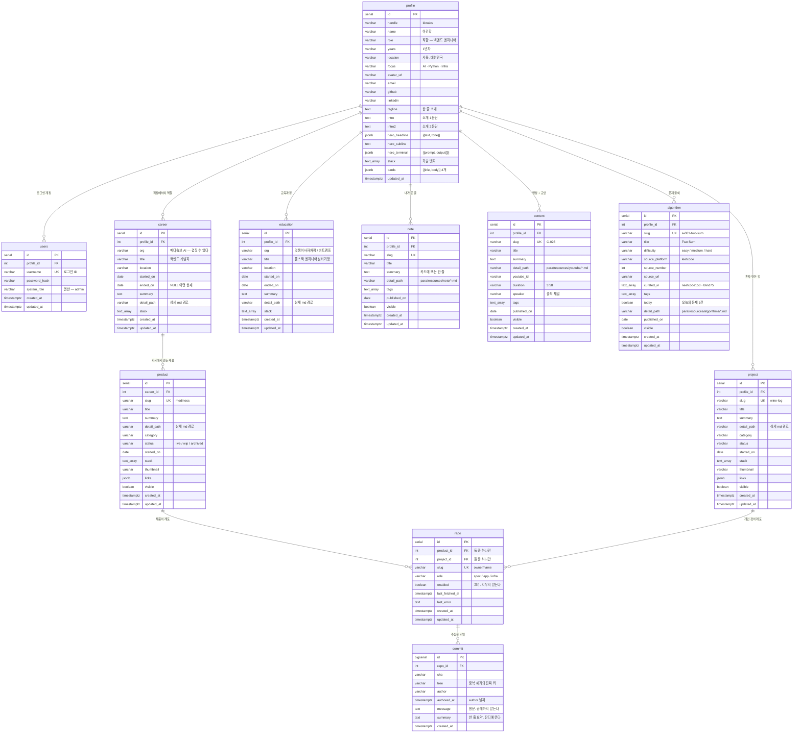

# ERD

블로그 표면이 쓰는 스키마. **이 문서가 스키마 정본이다.**
왜 이렇게 나눴는지는 [[database]] 가 갖는다 — 여기는 모양만 있고 근거는 저쪽에 있다.

- 한국어 하나만 담는다. i18n 축은 없다.
- 표면에 보이는 것만 DB 다. 문서는 `para/**` 에 md 로 있고 여기 오지 않는다.

## 관계



**루트는 `profile` 이다.** 경력도 학습도 만든 것도 전부 사람에게서 파생된다.
로그인 계정(`users`)도 그 사람의 속성이지 반대가 아니다.

`education` 에는 `repo` 가 붙지 않는다 — 교육과정에서 만든 결과물은 `project` 로 가지
과정 자체에 커밋이 귀속되지 않는다.

`/about` 의 잔디는 테이블이 없다. `commit` 을 날짜로 묶은 것이다.

## 상세 본문은 DB 에 없다

**정보는 DB, 상세 내용은 md 다.** 목록·카드에 뜨는 메타(제목·한 줄 요약·기술·상태·
썸네일)만 컬럼으로 두고, 문단짜리 상세 서술은 `para/**` 의 md 가 원장이다.
DB 는 `detail_path` 로 가리키기만 한다.

```text
career.detail_path      para/areas/personal/company/medisolve-ai.md
product.detail_path     para/projects/company/mediness/README.md
project.detail_path     para/projects/summer-star/wine-log/README.md
note.detail_path        para/resources/note/2024-05-28-day03.md
content.detail_path     para/resources/youtube/c-025-mcp-stateless.md
algorithm.detail_path   para/resources/algorithms/a-001-two-sum.md
```

**사본을 만들지 않는다.** 본문을 컬럼에 복사해 두면 md 를 고쳤을 때 조용히 낡는다 —
이번 리뉴얼이 없애려는 것이 정확히 그것이다.

상세를 고칠 때는 md 를 고친다. 어드민이 고치는 것은 카드 메타까지다 — 긴 글은
웹 폼이 아니라 에디터에서 쓴다.

**대가가 하나 있다.** 서버가 상세를 렌더하려면 이 레포의 md 에 닿아야 한다.
배포에 레포가 따라가거나 별도 경로로 읽어야 한다.

---

## DDL

### `profile` — 나

**루트다.** 다른 표를 이 사람이 소유한다. `/about` 과 home 히어로가 읽는다.

```sql
CREATE TABLE profile (
    id              serial       PRIMARY KEY,

    -- 신원. /about 상단.
    handle          varchar(64)  NOT NULL,                  -- kknaks
    name            varchar(64)  NOT NULL,                  -- 이건학
    role            varchar(64)  NOT NULL,                  -- 백엔드 엔지니어 — 직함
    years           varchar(32),                            -- 1년차
    location        varchar(64),                            -- 서울, 대한민국
    focus           varchar(128),                           -- AI · Python · Infra
    avatar_url      varchar(255),

    -- 연락. /about + footer.
    email           varchar(255) NOT NULL,
    github          varchar(255),
    linkedin        varchar(255),

    -- 문구. 문단이라 text.
    tagline         text,                                   -- 한 줄 소개
    intro           text,                                   -- 소개 1문단
    intro2          text,                                   -- 소개 2문단 — 지금 하는 일

    -- 히어로. home 전용 연출.
    hero_headline   jsonb,                                  -- [{text, tone}]
    hero_subline    text,
    hero_terminal   jsonb,                                  -- [{prompt, output[]}]

    stack           text[],                                 -- 기술 뱃지
    cards           jsonb,                                  -- [{title, body}] — /about 카드 4개

    created_at      timestamptz  NOT NULL DEFAULT now(),
    updated_at      timestamptz  NOT NULL DEFAULT now()
);
```

### `users` — 로그인 계정

표면에 절대 나가지 않는다. **인증 수단일 뿐 소유자가 아니다.**

```sql
CREATE TABLE users (
    id              serial       PRIMARY KEY,
    profile_id      int          NOT NULL REFERENCES profile(id) ON DELETE CASCADE,
    username        varchar(64)  NOT NULL UNIQUE,           -- 로그인 ID
    password_hash   varchar(255) NOT NULL,
    system_role     varchar(32)  NOT NULL DEFAULT 'admin',  -- 권한. 직함과 다르다

    created_at      timestamptz  NOT NULL DEFAULT now(),
    updated_at      timestamptz  NOT NULL DEFAULT now()
);
```

### `career` — 직장

한 행 = 역할 하나. 같은 회사에서 직무가 바뀌면 행이 하나 더 생긴다.

```sql
CREATE TABLE career (
    id           serial       PRIMARY KEY,
    profile_id   int          NOT NULL REFERENCES profile(id) ON DELETE CASCADE,

    org          varchar(64)  NOT NULL,                     -- 메디솔브 AI. 겹칠 수 있다
    title        varchar(64)  NOT NULL,                     -- 백엔드 개발자 / AI 리서처
    location     varchar(64),                               -- 서울

    started_on   date         NOT NULL,                     -- 2026-02-01. 월 단위라 1일로
    ended_on     date,                                      -- NULL 이면 현재 역할

    summary      text,                                      -- 카드에 뜨는 한 줄
    detail_path  varchar(255),                              -- 상세 md. NULL 이면 상세 없음
    stack        text[],

    created_at   timestamptz  NOT NULL DEFAULT now(),
    updated_at   timestamptz  NOT NULL DEFAULT now()
);

CREATE INDEX ix_career_started ON career (started_on DESC);
```

`is_current` · `period` · `display_order` 는 컬럼이 아니다 — 각각 `ended_on IS NULL`,
두 날짜의 렌더, `started_on DESC` 다.

### `education` — 교육과정

`career` 와 모양이 같지만 커밋이 붙지 않는다.

```sql
CREATE TABLE education (
    id           serial       PRIMARY KEY,
    profile_id   int          NOT NULL REFERENCES profile(id) ON DELETE CASCADE,

    org          varchar(64)  NOT NULL,                     -- 멋쟁이사자처럼 / 비트캠프
    title        varchar(64)  NOT NULL,                     -- 풀스택 엔지니어 심화과정
    location     varchar(64),

    started_on   date         NOT NULL,
    ended_on     date,

    summary      text,
    detail_path  varchar(255),                              -- 상세 md. NULL 이면 상세 없음
    stack        text[],

    created_at   timestamptz  NOT NULL DEFAULT now(),
    updated_at   timestamptz  NOT NULL DEFAULT now()
);

CREATE INDEX ix_education_started ON education (started_on DESC);
```

`/career` 타임라인은 `career` 와 `education` 을 합쳐 `started_on DESC` 로 나열한다.

### `product` — 회사에서 만들어 파는 것

```sql
CREATE TABLE product (
    id           serial       PRIMARY KEY,
    career_id    int          NOT NULL REFERENCES career(id) ON DELETE CASCADE,

    slug         varchar(64)  NOT NULL UNIQUE,              -- mediness
    title        varchar(64)  NOT NULL,
    summary      text,                                      -- 카드에 뜨는 한 줄
    detail_path  varchar(255),                              -- 상세 md. NULL 이면 상세 없음

    category     varchar(32),
    status       varchar(16),                               -- live / wip / archived
    started_on   date,

    stack        text[],
    thumbnail    varchar(255),
    links        jsonb,                                     -- {site, docs}
    visible      boolean      NOT NULL DEFAULT true,

    created_at   timestamptz  NOT NULL DEFAULT now(),
    updated_at   timestamptz  NOT NULL DEFAULT now()
);
```

### `project` — 혼자 만든 것

`career_id` 가 없다. 혼자 하는 것이라 소속이 없어서지 비어 있는 게 아니다.
`product` 는 `career` 를 거쳐 `profile` 에 닿고, `project` 는 바로 닿는다.

```sql
CREATE TABLE project (
    id           serial       PRIMARY KEY,
    profile_id   int          NOT NULL REFERENCES profile(id) ON DELETE CASCADE,

    slug         varchar(64)  NOT NULL UNIQUE,              -- wine-log
    title        varchar(64)  NOT NULL,
    summary      text,                                      -- 카드에 뜨는 한 줄
    detail_path  varchar(255),                              -- 상세 md. NULL 이면 상세 없음

    category     varchar(32),                               -- mobile / web / cli
    status       varchar(16),
    started_on   date,

    stack        text[],
    thumbnail    varchar(255),
    links        jsonb,                                     -- {repo, site, store}
    visible      boolean      NOT NULL DEFAULT true,

    created_at   timestamptz  NOT NULL DEFAULT now(),
    updated_at   timestamptz  NOT NULL DEFAULT now()
);
```

### `note` — 내가 쓴 글

`/notes`. 원장은 `para/resources/note/` 다. **모든 글이 자동으로 뜨지 않는다** —
공개할 것만 여기 등록한다.

```sql
CREATE TABLE note (
    id           serial       PRIMARY KEY,
    profile_id   int          NOT NULL REFERENCES profile(id) ON DELETE CASCADE,

    slug         varchar(64)  NOT NULL UNIQUE,
    title        varchar(128) NOT NULL,
    summary      text,                                      -- 카드에 뜨는 한 줄
    detail_path  varchar(255) NOT NULL,                     -- para/resources/note/*.md

    tags         text[],
    published_on date,
    visible      boolean      NOT NULL DEFAULT true,

    created_at   timestamptz  NOT NULL DEFAULT now(),
    updated_at   timestamptz  NOT NULL DEFAULT now()
);

CREATE INDEX ix_note_published ON note (published_on DESC);
```

### `content` — 영상 + 교안

`/contents`. 원장은 `para/resources/youtube/` 다. `note` 와 표면 모양이 같고
**영상 세 필드만 다르다** — 화면이 같은 규약을 두 번 배우지 않게 한다.

```sql
CREATE TABLE content (
    id           serial       PRIMARY KEY,
    profile_id   int          NOT NULL REFERENCES profile(id) ON DELETE CASCADE,

    slug         varchar(64)  NOT NULL UNIQUE,              -- C-025
    title        varchar(128) NOT NULL,
    summary      text,
    detail_path  varchar(255) NOT NULL,                     -- para/resources/youtube/*.md

    youtube_id   varchar(16)  NOT NULL,
    duration     varchar(16),                               -- 3:58
    speaker      varchar(64),                               -- 출처 채널

    tags         text[],
    published_on date,
    visible      boolean      NOT NULL DEFAULT true,

    created_at   timestamptz  NOT NULL DEFAULT now(),
    updated_at   timestamptz  NOT NULL DEFAULT now()
);

CREATE INDEX ix_content_published ON content (published_on DESC);
```

옛 frontmatter 의 `concept[]`(요지 6문장)은 컬럼이 아니다 — 본문에 속하므로
`detail_path` 가 가리키는 md 안에 있다.

이전/다음 글도 컬럼이 아니다. `published_on` 정렬의 이웃이다.

### `algorithm` — 문제 풀이

`/algorithms`. 원장은 `para/resources/algorithms/` 다. 지금 94건.

```sql
CREATE TABLE algorithm (
    id               serial       PRIMARY KEY,
    profile_id       int          NOT NULL REFERENCES profile(id) ON DELETE CASCADE,

    slug             varchar(64)  NOT NULL UNIQUE,          -- a-001-two-sum
    title            varchar(128) NOT NULL,                 -- Two Sum
    difficulty       varchar(8)   NOT NULL,                 -- easy / medium / hard

    -- 출처. jsonb 로 접지 않는다 — 플랫폼·번호로 거르고 싶어진다.
    source_platform  varchar(32)  NOT NULL,                 -- leetcode
    source_number    int,
    source_url       varchar(255),
    curated_in       text[],                                -- neetcode150 · blind75

    tags             text[],                                -- array · hash
    today            boolean      NOT NULL DEFAULT false,   -- 목록 상단 고정
    detail_path      varchar(255) NOT NULL,                 -- para/resources/algorithms/*.md
    published_on     date,
    visible          boolean      NOT NULL DEFAULT true,

    created_at       timestamptz  NOT NULL DEFAULT now(),
    updated_at       timestamptz  NOT NULL DEFAULT now()
);

-- 「오늘의 문제」는 하나뿐이다. 앱이 아니라 DB 가 강제한다.
CREATE UNIQUE INDEX uq_algorithm_today ON algorithm (today) WHERE today;

CREATE INDEX ix_algorithm_published ON algorithm (published_on DESC);
```

**4 단계(Clarifying → Approach → Trace → Solution)는 컬럼이 아니다.** md 본문의
`## Data` fenced yaml 이 갖고, 서버가 그것을 읽어 렌더한다. 다른 표의 `body` 와 같은
자리이므로 같은 규칙을 따른다 — **정보는 DB, 상세는 md.**

### `repo` — 커밋을 긁을 레포

부모가 둘이지만 FK 를 살린다.

```sql
CREATE TABLE repo (
    id               serial       PRIMARY KEY,
    product_id       int          REFERENCES product(id) ON DELETE CASCADE,
    project_id       int          REFERENCES project(id) ON DELETE CASCADE,

    slug             varchar(160) NOT NULL UNIQUE,          -- owner/name
    role             varchar(32),                           -- spec / app / infra

    enabled          boolean      NOT NULL DEFAULT true,    -- 끄기. 지우지 않는다

    -- 수집 상태. 레포마다 따로 막힌다.
    last_fetched_at  timestamptz,
    last_error       text,                                  -- 성공하면 비운다

    created_at       timestamptz  NOT NULL DEFAULT now(),
    updated_at       timestamptz  NOT NULL DEFAULT now(),

    -- 둘 중 정확히 하나에만 속한다.
    CHECK ((product_id IS NULL) <> (project_id IS NULL))
);
```

### `commit` — 수집한 커밋

```sql
CREATE TABLE commit (
    id           bigserial    PRIMARY KEY,
    repo_id      int          NOT NULL REFERENCES repo(id) ON DELETE CASCADE,

    sha          varchar(40)  NOT NULL,
    tree         varchar(40)  NOT NULL,                     -- 중복 제거의 진짜 키
    author       varchar(128),
    authored_at  timestamptz  NOT NULL,                     -- author 날짜
    message      text,                                      -- 원문. 공개하지 않는다
    summary      text,                                      -- 한 줄 요약. 잔디에 뜬다

    created_at   timestamptz  NOT NULL DEFAULT now(),

    UNIQUE (repo_id, tree)
);

CREATE INDEX ix_commit_authored ON commit (authored_at DESC);
```

리베이스가 같은 작업을 새 sha 로 되풀이하므로 중복 제거 키가 `sha` 가 아니라
`(repo_id, tree)` 다. `authored_at` 이 커밋터 날짜가 아닌 것도 같은 이유다.
