# ERD

블로그 표면이 쓰는 스키마. **이 문서가 스키마 정본이다.**
왜 이렇게 나눴는지는 [[database]] 가 갖는다 — 여기는 모양만 있고 근거는 저쪽에 있다.

- 한국어 하나만 담는다. i18n 축은 없다.
- 표면에 보이는 것만 DB 다. 문서는 `para/**` 에 md 로 있고 여기 오지 않는다.
- 예외가 셋 있다 — `queue`·`gate`·`git_token`. 표면이 아니라 수집 파이프라인의
  것이다. 동작 정본은 `case_flow.md` 케이스 1·6·7, 화면·플로우는 `inbox.md`.

## 관계

```mermaid
erDiagram
    profile ||--o{ users     : "로그인 계정"
    profile ||--o{ career    : "직장에서의 역할"
    company ||--o{ career    : "그 회사에서의 역할"
    career  ||--o{ product   : "그 역할에서 만든 제품"
    career  ||--o{ problem   : "해결한 문제"
    product ||--o{ problem   : "어느 제품에서"
    profile ||--o{ education : "교육과정"
    profile ||--o{ project   : "혼자 만든 것"
    profile ||--o{ note      : "내가 쓴 글"
    profile ||--o{ content   : "영상 + 교안"
    profile ||--o{ algorithm : "문제 풀이"
    product ||--o{ repo      : "제품의 레포"
    project ||--o{ repo      : "개인 것의 레포"
    repo    ||--o{ commit    : "수집한 커밋"
    git_token ||--o{ repo    : "수집 토큰"
    company ||--o{ git_token : "회사 토큰의 소속"
    queue   ||--o{ gate      : "승인 지점"

    users {
        serial id PK
        int profile_id FK
        varchar username UK "로그인 ID"
        varchar password_hash
        varchar system_role "권한 — admin"
        timestamptz created_at
        timestamptz updated_at
    }

    profile {
        serial id PK
        varchar handle "kknaks"
        varchar name "이건학"
        varchar role "직함 — 백엔드 엔지니어"
        varchar years "1년차"
        varchar location "서울, 대한민국"
        varchar focus "AI · Python · Infra"
        varchar avatar_url
        varchar email
        varchar github
        varchar linkedin
        text_array stack "기술 뱃지"
        timestamptz updated_at
    }

    company {
        serial id PK
        varchar slug UK "medisolve-ai"
        varchar name "메디솔브 AI"
        text description "회사 소개"
        varchar location "서울"
        varchar site
        varchar logo_url
        varchar github_org "레포 owner 드롭다운 후보"
        timestamptz created_at
        timestamptz updated_at
    }

    career {
        serial id PK
        int profile_id FK
        int company_id FK
        varchar title "백엔드 개발자 / AI 리서처"
        date started_on
        date ended_on "NULL 이면 현재"
        text summary "카드에 뜨는 한 줄"
        text description "맡은 역할"
        text_array stack
        timestamptz created_at
        timestamptz updated_at
    }

    problem {
        serial id PK
        int career_id FK
        int product_id FK "어느 제품에서. NULL 가능"
        varchar title "무엇을 풀었나"
        text body "어떻게 풀었나"
        int display_order
        timestamptz created_at
        timestamptz updated_at
    }

    education {
        serial id PK
        int profile_id FK
        varchar org "멋쟁이사자처럼 / 비트캠프"
        varchar title "풀스택 엔지니어 심화과정"
        varchar location
        date started_on
        date ended_on
        text summary
        varchar detail_path "상세 md 경로"
        text_array stack
        timestamptz created_at
        timestamptz updated_at
    }

    product {
        serial id PK
        int career_id FK "어느 역할에서 만들었나"
        varchar slug UK "mediness"
        varchar title
        text summary
        varchar detail_path "상세 md 경로"
        varchar category
        varchar status "live / wip / archived"
        date started_on
        text_array stack
        varchar thumbnail
        jsonb links
        boolean visible
        timestamptz created_at
        timestamptz updated_at
    }

    project {
        serial id PK
        int profile_id FK
        varchar slug UK "wine-log"
        varchar title
        text summary
        varchar detail_path "상세 md 경로"
        varchar category
        varchar status
        date started_on
        text_array stack
        varchar thumbnail
        jsonb links
        boolean visible
        timestamptz created_at
        timestamptz updated_at
    }

    note {
        serial id PK
        int profile_id FK
        varchar slug UK
        varchar title
        text summary "카드에 뜨는 한 줄"
        varchar detail_path "para/resources/note/*.md"
        text_array tags
        date published_on
        boolean visible
        timestamptz created_at
        timestamptz updated_at
    }

    content {
        serial id PK
        int profile_id FK
        varchar slug UK "C-025"
        varchar title
        text summary
        varchar detail_path "para/resources/youtube/*.md"
        varchar youtube_id
        varchar duration "3:58"
        varchar speaker "출처 채널"
        text_array tags
        date published_on
        boolean visible
        timestamptz created_at
        timestamptz updated_at
    }

    site_config {
        varchar key PK "home.hero_headline · about.intro · footer.tagline"
        jsonb value "문자열이든 구조든 한 컬럼"
        text note "어디에 쓰이는지"
        timestamptz updated_at
    }

    algorithm {
        serial id PK
        int profile_id FK
        varchar slug UK "a-001-two-sum"
        varchar title "Two Sum"
        varchar difficulty "easy / medium / hard"
        text summary "카드에 뜨는 한 줄"
        varchar source_platform "leetcode"
        int source_number
        varchar source_url
        text_array curated_in "neetcode150 · blind75"
        text_array tags
        boolean today "오늘의 문제 1건"
        varchar detail_path "para/resources/algorithms/*.md"
        date published_on
        boolean visible
        timestamptz created_at
        timestamptz updated_at
    }

    repo {
        serial id PK
        int product_id FK "둘 중 하나만"
        int project_id FK "둘 중 하나만"
        varchar slug UK "owner/name"
        varchar role "spec / app / infra"
        int git_token_id FK "수집 토큰. NULL 무토큰"
        boolean enabled "끄기. 지우지 않는다"
        timestamptz last_fetched_at
        text last_error
        timestamptz created_at
        timestamptz updated_at
    }

    commit {
        bigserial id PK
        int repo_id FK
        varchar sha
        varchar tree "중복 제거의 진짜 키"
        varchar author
        timestamptz authored_at "author 날짜"
        text message "원문. 공개하지 않는다"
        text summary "한 줄 요약. AI 가 덮는다"
        timestamptz summarized_at "NULL 이면 미요약"
        timestamptz created_at
    }

    daily {
        date date PK "KST 날짜"
        text summary "하루 요약 불릿. 잔디 hover"
        text error "요약 실패 사유. 성공하면 비운다"
        timestamptz created_at
        timestamptz updated_at
    }

    queue {
        serial id PK
        varchar kind "youtube / docs / article / blog"
        varchar source_url "book·session 은 NULL"
        text note "모달 메모"
        varchar status "queued / processing / review / failed / done"
        text error "실패 사유. 성공하면 비운다"
        varchar ai_session_id "codex 세션. 개념 생성이 이어받는다"
        timestamptz created_at
        timestamptz updated_at
    }

    gate {
        serial id PK
        int queue_id FK
        varchar stage "document / concept"
        jsonb payload "초안. md 는 승인 시점에 생긴다"
        varchar status "open / approved / rejected"
        varchar commit_ref "푸시 성공의 증거"
        jsonb result "content_id · 파일 경로"
        timestamptz decided_at
        timestamptz created_at
        timestamptz updated_at
    }
```



**루트는 `profile` 이다.** 경력도 학습도 만든 것도 전부 사람에게서 파생된다.
로그인 계정(`users`)도 그 사람의 속성이지 반대가 아니다.

`education` 에는 `repo` 가 붙지 않는다 — 교육과정에서 만든 결과물은 `project` 로 가지
과정 자체에 커밋이 귀속되지 않는다.

`/about` 의 잔디 **격자**는 테이블이 없다 — `commit` 을 KST 날짜로 묶은 파생이다.
hover 문구만 `daily` 가 갖는다(AI 하루 요약). 옛 구조의 `persona/daily/` md 가
DB 행으로 돌아온 자리다 — 파생물이 md 로 앉아 원천이 둘이 되던 문제(CLAUDE.md 2번)의 착지.

`queue`·`gate` 는 `profile` 에 매달리지 않는다 — 사람의 것이 아니라 파이프라인의
기록이라서다. 옛 구조의 md frontmatter(`status: pending`)가 하던 일이 여기로 왔다.

## 상세 본문은 DB 에 없다

**정보는 DB, 상세 내용은 md 다.** 목록·카드에 뜨는 메타(제목·한 줄 요약·기술·상태·
썸네일)만 컬럼으로 두고, 문단짜리 상세 서술은 `para/**` 의 md 가 원장이다.
DB 는 `detail_path` 로 가리키기만 한다.

```text
product.detail_path     para/projects/company/mediness/README.md
project.detail_path     para/projects/summer-star/wine-log/README.md
note.detail_path        para/resources/note/2024-05-28-Day03.md
content.detail_path     para/resources/youtube/C-025-mcp-s-new-spec-from-stateful-sessions-to-stateless.md
algorithm.detail_path   para/resources/algorithms/A-001-two-sum.md
```

**이미지도 같은 규약이다(2026-08-25).** 원장 md 옆 `assets/` 가 원장이고
(`para/projects/summer-star/<slug>/assets/cover.png`), DB `thumbnail` 은 그 para
상대경로만 갖는다. 서빙은 `GET /api/assets/{path}` — para 하위의 이미지 확장자만
내려주고, md 본문의 상대참조(`assets/…`)도 여기로 풀린다.

**사본을 만들지 않는다.** 본문을 컬럼에 복사해 두면 md 를 고쳤을 때 조용히 낡는다 —
이번 리뉴얼이 없애려는 것이 정확히 그것이다.

상세를 고칠 때는 md 를 고친다. 어드민이 고치는 것은 카드 메타까지다 — 긴 글은
웹 폼이 아니라 에디터에서 쓴다.

**대가가 하나 있다.** 서버가 상세를 렌더하려면 이 레포의 md 에 닿아야 한다.
배포에 레포가 따라가거나 별도 경로로 읽어야 한다.

---

## DDL

### `profile` — 나

**루트다.** 다른 표를 이 사람이 소유한다. **신원과 연락만 갖는다** — 1인 사이트라
「사람 속성 vs 페이지 속성」 구분이 무의미해서, 표면에 뜨는 문구는 전부
`site_config` 로 갔다. 여기는 내 개인 정보다.

```sql
CREATE TABLE profile (
    id              serial       PRIMARY KEY,

    -- 신원. /about 상단.
    handle          varchar(64)  NOT NULL,                  -- kknaks
    name            varchar(64)  NOT NULL,                  -- 이건학
    role            varchar(64)  NOT NULL,                  -- 백엔드 엔지니어 — 직함
    years           varchar(32),                            -- 1년차
    location        varchar(64),                            -- 서울, 대한민국
    focus           varchar(128),                           -- AI · Python · Infra
    avatar_url      varchar(255),

    -- 연락. /about + footer.
    email           varchar(255) NOT NULL,
    github          varchar(255),
    linkedin        varchar(255),

    stack           text[],                                 -- 기술 뱃지 — 내 스택이라 개인 정보

    created_at      timestamptz  NOT NULL DEFAULT now(),
    updated_at      timestamptz  NOT NULL DEFAULT now()
);
```

### `users` — 로그인 계정

표면에 절대 나가지 않는다. **인증 수단일 뿐 소유자가 아니다.**

```sql
CREATE TABLE users (
    id              serial       PRIMARY KEY,
    profile_id      int          NOT NULL REFERENCES profile(id) ON DELETE CASCADE,
    username        varchar(64)  NOT NULL UNIQUE,           -- 로그인 ID
    password_hash   varchar(255) NOT NULL,
    system_role     varchar(32)  NOT NULL DEFAULT 'admin',  -- 권한. 직함과 다르다

    created_at      timestamptz  NOT NULL DEFAULT now(),
    updated_at      timestamptz  NOT NULL DEFAULT now()
);
```

### `company` — 어디에 있었나

`career` 에서 뗀다. **회사 소개와 제품은 회사 속성이지 역할 속성이 아니다** — 같은
회사에서 직무가 바뀌면 `career` 행이 둘인데 회사 소개가 두 번 저장된다.

```sql
CREATE TABLE company (
    id           serial       PRIMARY KEY,

    slug         varchar(64)  NOT NULL UNIQUE,              -- medisolve-ai
    name         varchar(64)  NOT NULL,                     -- 메디솔브 AI
    description  text,                                      -- 피부과 전용 CRM·MSO 를 만드는 AI 회사
    location     varchar(64),                               -- 서울
    site         varchar(255),
    logo_url     varchar(255),
    github_org   varchar(64),                               -- GitHub 조직 owner — 레포 등록
                                                            -- 드롭다운 후보. NULL 이면 없음

    created_at   timestamptz  NOT NULL DEFAULT now(),
    updated_at   timestamptz  NOT NULL DEFAULT now()
);
```

재직 기간은 컬럼이 아니다 — 그 회사 `career` 행들의 최소·최대다.

### `career` — 직장에서의 역할

한 행 = 역할 하나. 같은 회사에서 직무가 바뀌면 행이 하나 더 생긴다.

```sql
CREATE TABLE career (
    id           serial       PRIMARY KEY,
    profile_id   int          NOT NULL REFERENCES profile(id) ON DELETE CASCADE,
    company_id   int          NOT NULL REFERENCES company(id) ON DELETE CASCADE,

    title        varchar(64)  NOT NULL,                     -- 백엔드 개발자 / AI 리서처

    started_on   date         NOT NULL,                     -- 2026-02-01. 월 단위라 1일로
    ended_on     date,                                      -- NULL 이면 현재 역할

    summary      text,                                      -- 카드에 뜨는 한 줄
    description  text,                                      -- 맡은 역할. 펼쳤을 때 뜬다
    stack        text[],

    created_at   timestamptz  NOT NULL DEFAULT now(),
    updated_at   timestamptz  NOT NULL DEFAULT now()
);

CREATE INDEX ix_career_started ON career (started_on DESC);
```

**`detail_path` 를 두지 않는다.** 다른 표와 달리 여기는 md 원장이 없다 —
펼친 화면의 대부분을 `company.description` 과 `product` 카드와 `problem` 이 채우므로
역할 서술이 두세 문단으로 짧다. 짧은 글은 컬럼이 낫다. **md 원장은 긴 글의 것이다.**

`is_current` · `period` · `display_order` 는 컬럼이 아니다 — 각각 `ended_on IS NULL`,
두 날짜의 렌더, `started_on DESC` 다.

### `problem` — 해결한 문제

이력서의 알맹이다. 한 행 = 푼 문제 하나.

```sql
CREATE TABLE problem (
    id            serial       PRIMARY KEY,
    career_id     int          NOT NULL REFERENCES career(id) ON DELETE CASCADE,
    product_id    int          REFERENCES product(id) ON DELETE SET NULL,

    title         varchar(128) NOT NULL,                    -- 무엇을 풀었나
    body          text,                                     -- 어떻게 풀었나
    display_order int          NOT NULL DEFAULT 0,

    created_at    timestamptz  NOT NULL DEFAULT now(),
    updated_at    timestamptz  NOT NULL DEFAULT now()
);
```

**컬럼이나 jsonb 로 접지 않는 이유는 원료가 따로 있기 때문이다.**
`para/projects/company/<제품>/log/` 에 쌓이는 `SUMMARY.md §3`(막혔던 것)이 여기로
올라온다. 행이면 하나씩 옮길 수 있고 어느 제품에서 나온 것인지도 잇는다.

`product_id` 는 NULL 을 허용한다 — 제품에 매이지 않는 문제(조직·프로세스)도 있다.

### `education` — 교육과정

`career` 와 모양이 같지만 커밋이 붙지 않는다.

```sql
CREATE TABLE education (
    id           serial       PRIMARY KEY,
    profile_id   int          NOT NULL REFERENCES profile(id) ON DELETE CASCADE,

    org          varchar(64)  NOT NULL,                     -- 멋쟁이사자처럼 / 비트캠프
    title        varchar(64)  NOT NULL,                     -- 풀스택 엔지니어 심화과정
    location     varchar(64),

    started_on   date         NOT NULL,
    ended_on     date,

    summary      text,
    detail_path  varchar(255),                              -- 상세 md. NULL 이면 상세 없음
    stack        text[],

    created_at   timestamptz  NOT NULL DEFAULT now(),
    updated_at   timestamptz  NOT NULL DEFAULT now()
);

CREATE INDEX ix_education_started ON education (started_on DESC);
```

`/career` 타임라인은 `career` 와 `education` 을 합쳐 `started_on DESC` 로 나열한다.

### `product` — 회사에서 만든 것

**`company` 가 아니라 `career` 에 속한다.** 이 표는 회사의 제품 카탈로그가 아니라
**내가 그 역할에서 만든 것**의 기록이다 — 같은 회사에서 백엔드 개발자로 링키·차티를,
AI 개발자로 mediness 를 만들었다면 제품마다 어느 역할이었는지가 사실이고, 그것을
컬럼으로 박는다. 재직 기간으로 파생하는 안은 버렸다 — 월 단위 저장이라 역할 전환
달에 시작한 제품은 양쪽에 걸려 판정이 안 된다. 회사는 `career.company_id` 를 거쳐
닿는다.

```sql
CREATE TABLE product (
    id           serial       PRIMARY KEY,
    career_id    int          NOT NULL REFERENCES career(id) ON DELETE CASCADE,

    slug         varchar(64)  NOT NULL UNIQUE,              -- mediness
    title        varchar(64)  NOT NULL,
    summary      text,                                      -- 카드에 뜨는 한 줄
    detail_path  varchar(255),                              -- 상세 md. NULL 이면 상세 없음

    category     varchar(32),
    status       varchar(16),                               -- live / wip / archived
    started_on   date,

    stack        text[],
    thumbnail    varchar(255),
    links        jsonb,                                     -- {site, docs}
    visible      boolean      NOT NULL DEFAULT true,

    created_at   timestamptz  NOT NULL DEFAULT now(),
    updated_at   timestamptz  NOT NULL DEFAULT now()
);
```

### `project` — 혼자 만든 것

`career_id` 가 없다. 혼자 하는 것이라 소속이 없어서지 비어 있는 게 아니다.
`product` 는 `career` 를 거쳐 `profile` 에 닿고, `project` 는 바로 닿는다.

```sql
CREATE TABLE project (
    id           serial       PRIMARY KEY,
    profile_id   int          NOT NULL REFERENCES profile(id) ON DELETE CASCADE,

    slug         varchar(64)  NOT NULL UNIQUE,              -- wine-log
    title        varchar(64)  NOT NULL,
    summary      text,                                      -- 카드에 뜨는 한 줄
    detail_path  varchar(255),                              -- 상세 md. NULL 이면 상세 없음

    category     varchar(32),                               -- mobile / web / cli
    status       varchar(16),
    started_on   date,

    stack        text[],
    thumbnail    varchar(255),
    links        jsonb,                                     -- {repo, site, store}
    visible      boolean      NOT NULL DEFAULT true,

    created_at   timestamptz  NOT NULL DEFAULT now(),
    updated_at   timestamptz  NOT NULL DEFAULT now()
);
```

### `note` — 내가 쓴 글

`/notes`. 원장은 `para/resources/note/` 다. **모든 글이 자동으로 뜨지 않는다** —
공개할 것만 여기 등록한다.

```sql
CREATE TABLE note (
    id           serial       PRIMARY KEY,
    profile_id   int          NOT NULL REFERENCES profile(id) ON DELETE CASCADE,

    slug         varchar(64)  NOT NULL UNIQUE,
    title        varchar(128) NOT NULL,
    summary      text,                                      -- 카드에 뜨는 한 줄
    detail_path  varchar(255) NOT NULL,                     -- para/resources/note/*.md

    tags         text[],
    published_on date,
    visible      boolean      NOT NULL DEFAULT true,

    created_at   timestamptz  NOT NULL DEFAULT now(),
    updated_at   timestamptz  NOT NULL DEFAULT now()
);

CREATE INDEX ix_note_published ON note (published_on DESC);
```

### `content` — 영상 + 교안

`/contents`. 원장은 `para/resources/youtube/` 다. `note` 와 표면 모양이 같고
**영상 세 필드만 다르다** — 화면이 같은 규약을 두 번 배우지 않게 한다.

```sql
CREATE TABLE content (
    id           serial       PRIMARY KEY,
    profile_id   int          NOT NULL REFERENCES profile(id) ON DELETE CASCADE,

    slug         varchar(64)  NOT NULL UNIQUE,              -- C-025
    title        varchar(128) NOT NULL,
    summary      text,
    detail_path  varchar(255) NOT NULL,                     -- para/resources/youtube/*.md

    youtube_id   varchar(16)  NOT NULL,
    duration     varchar(16),                               -- 3:58
    speaker      varchar(64),                               -- 출처 채널

    tags         text[],
    published_on date,
    visible      boolean      NOT NULL DEFAULT true,

    created_at   timestamptz  NOT NULL DEFAULT now(),
    updated_at   timestamptz  NOT NULL DEFAULT now()
);

CREATE INDEX ix_content_published ON content (published_on DESC);
```

옛 frontmatter 의 `concept[]`(요지 6문장)은 컬럼이 아니다 — 본문에 속하므로
`detail_path` 가 가리키는 md 안에 있다.

이전/다음 글도 컬럼이 아니다. `published_on` 정렬의 이웃이다.

### `site_config` — 사이트에 뜨는 문구 전부

히어로·소개·카드·페이지 머리말·footer. **1인 사이트라 문구는 전부 여기다** —
`profile` 은 신원·연락만 갖는다. key 는 `<표면>.<자리>` 로 짓는다.

```sql
CREATE TABLE site_config (
    key         varchar(64)  PRIMARY KEY,             -- home.hero_headline · about.intro
    value       jsonb        NOT NULL,                -- 문자열이든 구조든 한 컬럼
    note        text,                                 -- 어디에 쓰이는지. 어드민 목록에 뜬다

    updated_at  timestamptz  NOT NULL DEFAULT now()
);
```

`value` 가 `text` 가 아니라 `jsonb` 인 이유 — `home.hero_headline`(`[{text, tone}]`) ·
`home.hero_terminal`(`[{prompt, output[]}]`) · `about.cards`(`[{title, body}]`) 처럼
구조를 갖는 문구가 있다. 문자열은 JSON string 으로 담고, 어드민 폼은 값 모양을 보고
타입별로 그린다.

시드가 넣는 키:

| key | 모양 | 어디 |
|---|---|---|
| `home.hero_headline` | `[{text, tone}]` | home 히어로 |
| `home.hero_subline` | string | home 히어로 |
| `home.hero_terminal` | `[{prompt, output[]}]` | home 터미널 연출 |
| `about.tagline` | string | /about 한 줄 소개 |
| `about.intro` | string | /about 1문단 |
| `about.intro2` | string | /about 2문단 |
| `about.cards` | `[{title, body}]` | /about 카드 4개 |
| `footer.tagline` | string | footer 한 줄 |

컬럼으로 펴지 않는 이유는 **페이지가 늘면 컬럼이 는다**는 것이다. 페이지를 하나 붙일
때마다 마이그레이션이 따라온다. 조인도 검색도 하지 않는 값이라 정규화의 이득이 없다.

옛 구조에서는 이 값들이 라우터에 하드코딩돼 있거나 `persona/_meta.yaml` 에 있었다.
둘 다 고치려면 배포가 필요했다.

**여기 두지 않는 것**

| 값 | 왜 |
|---|---|
| `version` | 빌드 정보다. 배포가 정한다 |
| `uptime` | 런타임 값이다. 서버가 센다 |
| `career.totalRoles` · `contents.totalCount` | 행 수를 센 것이다. 저장하면 낡는다 |

`career.subtitle` 처럼 「5개 역할」이 들어가는 문구는 **틀만 담고 수는 채워 넣는다** —
`{n}개 역할` 로 저장하고 렌더할 때 센다.

### `algorithm` — 문제 풀이

`/algorithms`. 원장은 `para/resources/algorithms/` 다. 지금 94건.

```sql
CREATE TABLE algorithm (
    id               serial       PRIMARY KEY,
    profile_id       int          NOT NULL REFERENCES profile(id) ON DELETE CASCADE,

    slug             varchar(64)  NOT NULL UNIQUE,          -- a-001-two-sum (파일명 stem 소문자, §미결 5)
    title            varchar(128) NOT NULL,                 -- Two Sum
    difficulty       varchar(8)   NOT NULL,                 -- easy / medium / hard
    summary          text,                                  -- 카드에 뜨는 한 줄

    -- 출처. jsonb 로 접지 않는다 — 플랫폼·번호로 거르고 싶어진다.
    source_platform  varchar(32)  NOT NULL,                 -- leetcode
    source_number    int,
    source_url       varchar(255),
    curated_in       text[],                                -- neetcode150 · blind75

    tags             text[],                                -- array · hash
    today            boolean      NOT NULL DEFAULT false,   -- 목록 상단 고정
    detail_path      varchar(255) NOT NULL,                 -- para/resources/algorithms/*.md
    published_on     date,
    visible          boolean      NOT NULL DEFAULT true,

    created_at       timestamptz  NOT NULL DEFAULT now(),
    updated_at       timestamptz  NOT NULL DEFAULT now()
);

-- 「오늘의 문제」는 하나뿐이다. 앱이 아니라 DB 가 강제한다.
CREATE UNIQUE INDEX uq_algorithm_today ON algorithm (today) WHERE today;

CREATE INDEX ix_algorithm_published ON algorithm (published_on DESC);
```

**단계(Problem → Clarifying → Approach → Logic → Trace → Solution)는 컬럼이 아니다.**
`Logic` 은 슬롯 퀴즈다. md 본문의
`## Data` fenced yaml 이 갖고, 서버가 그것을 읽어 렌더한다. 다른 표의 `body` 와 같은
자리이므로 같은 규칙을 따른다 — **정보는 DB, 상세는 md.**

### `repo` — 커밋을 긁을 레포

부모가 둘이지만 FK 를 살린다.

```sql
CREATE TABLE repo (
    id               serial       PRIMARY KEY,
    product_id       int          REFERENCES product(id) ON DELETE CASCADE,
    project_id       int          REFERENCES project(id) ON DELETE CASCADE,

    slug             varchar(160) NOT NULL UNIQUE,          -- owner/name
    role             varchar(32),                           -- spec / app / infra
    git_token_id     int          REFERENCES git_token(id)  -- 수집 토큰. NULL 무토큰(공개)
                                  ON DELETE SET NULL,

    enabled          boolean      NOT NULL DEFAULT true,    -- 끄기. 지우지 않는다

    -- 수집 상태. 레포마다 따로 막힌다.
    last_fetched_at  timestamptz,
    last_error       text,                                  -- 성공하면 비운다

    created_at       timestamptz  NOT NULL DEFAULT now(),
    updated_at       timestamptz  NOT NULL DEFAULT now(),

    -- 둘 중 정확히 하나에만 속한다.
    CHECK ((product_id IS NULL) <> (project_id IS NULL))
);
```

### `git_token` — 커밋 수집용 GitHub 토큰

표면에 안 뜬다(`queue`·`gate` 와 같은 예외 — 파이프라인의 것). **토큰은 암호문으로만
저장한다** — 복호 키는 `.env` 의 `GIT_TOKEN_KEY` 하나다. 해시가 아니라 암호화인 이유는
수집기가 GitHub 호출에 원문을 써야 해서다. 개인 n개·회사 n개 전부 행이고, 이직하면
회사 토큰 행의 값만 교체한다(PUT) — `repo` 연결은 안 바뀐다.

`users` 에 붙이지 않는다 — `users` 는 로그인 계정(1행)이고 토큰은 n개라 자리가 다르다.

```sql
CREATE TABLE git_token (
    id            serial       PRIMARY KEY,
    company_id    int          REFERENCES company(id)      -- kind=company 토큰의 소속.
                               ON DELETE SET NULL,         -- personal 은 NULL

    kind          varchar(16)  NOT NULL,                   -- 구분 — personal / company
    account       varchar(64)  NOT NULL,                   -- 깃 계정 id — kknaks / kknaksss
    email         varchar(255) NOT NULL,                   -- 착지 커밋의 git 신원(user.email)
    token_cipher  text         NOT NULL,                   -- Fernet 암호문. 원문·응답 노출 없음
    enabled       boolean      NOT NULL DEFAULT true,      -- 끄면 무토큰 취급(공개 범위만 수집)

    created_at    timestamptz  NOT NULL DEFAULT now(),
    updated_at    timestamptz  NOT NULL DEFAULT now()
);
```

### `commit` — 수집한 커밋

```sql
CREATE TABLE commit (
    id           bigserial    PRIMARY KEY,
    repo_id      int          NOT NULL REFERENCES repo(id) ON DELETE CASCADE,

    sha          varchar(40)  NOT NULL,
    tree         varchar(40)  NOT NULL,                     -- 중복 제거의 진짜 키
    author       varchar(128),
    authored_at  timestamptz  NOT NULL,                     -- author 날짜
    message      text,                                      -- 원문. 공개하지 않는다
    summary      text,                                      -- 한 줄 요약 — 수집 때 메시지 첫 줄,
                                                            -- AI 요약이 덮는다(사내 정보 추상화)
    summarized_at timestamptz,                              -- AI 요약 시각. NULL = 미요약

    created_at   timestamptz  NOT NULL DEFAULT now(),

    UNIQUE (repo_id, tree)
);

CREATE INDEX ix_commit_authored ON commit (authored_at DESC);
```

리베이스가 같은 작업을 새 sha 로 되풀이하므로 중복 제거 키가 `sha` 가 아니라
`(repo_id, tree)` 다. `authored_at` 이 커밋터 날짜가 아닌 것도 같은 이유다.

### `daily` — 하루 요약

한 행 = 하루(KST). 수집 뒤 날짜당 codex 1호출이 커밋별 `summary` 와 이 행을 같이
만든다(최근 7일 창 자동 · 과거는 `scripts/backfill_daily.py` 로 하나씩). `/about`
잔디 hover 가 이 `summary` 불릿을 쓴다 — 미요약 날은 빈 채로 두고 커밋 첫 줄로
메우지 않는다(사내 정보 원문 노출 방지).

```sql
CREATE TABLE daily (
    date        date         PRIMARY KEY,                  -- KST 날짜
    summary     text,                                      -- 레포별 불릿, 줄바꿈 구분
    error       text,                                      -- 실패 사유. 성공하면 비운다

    created_at  timestamptz  NOT NULL DEFAULT now(),
    updated_at  timestamptz  NOT NULL DEFAULT now()
);
```

### `queue` — 인박스 파이프라인 한 건

표면에 안 뜬다. 모달에서 넣은 것(종류·URL·메모)과 처리 상태가 전부다 —
파이프라인 상태는 문서가 아니라 DB 가 갖는다(리뉴얼 결정). 행은 `done` 이 돼도
안 지우므로 넣은 URL 의 기록이 여기 영구히 남는다.

```sql
CREATE TABLE queue (
    id           serial       PRIMARY KEY,

    kind         varchar(16)  NOT NULL,               -- youtube / docs / article / blog
    source_url   varchar(512),                        -- book·session 은 NULL
    note         text,                                -- 모달 메모

    status       varchar(16)  NOT NULL DEFAULT 'queued',
                 -- queued → processing → review → done. 실패는 failed(재시도 가능)
    error        text,                                -- 실패 사유. 성공하면 비운다

    ai_session_id varchar(64),                        -- codex 세션. 문서 생성이 남기고
                                                      -- 개념 생성이 resume 으로 이어받는다

    created_at   timestamptz  NOT NULL DEFAULT now(),
    updated_at   timestamptz  NOT NULL DEFAULT now()
);
```

중복은 안 막는다 — 같은 링크를 또 넣으면 또 돈다(§미결 4 는 미결로 유지).
거절 종결도 `done` 이다 — 어떻게 끝났는지는 `gate` 가 갖는다.

### `gate` — 승인 지점

한 행 = 게이트 하나. 케이스 1 은 건마다 둘이다 — `document`(문서 초안) 승인 후
`concept`(개념 보강안).

```sql
CREATE TABLE gate (
    id           serial       PRIMARY KEY,
    queue_id     int          NOT NULL REFERENCES queue(id) ON DELETE CASCADE,

    stage        varchar(16)  NOT NULL,               -- document / concept
    payload      jsonb        NOT NULL,               -- 초안. 승인 때 다듬은 것으로 덮인다
    status       varchar(16)  NOT NULL DEFAULT 'open',-- open / approved / rejected
    commit_ref   varchar(40),                         -- 푸시 성공의 증거
    result       jsonb,                               -- content_id · 파일 경로
    decided_at   timestamptz,

    created_at   timestamptz  NOT NULL DEFAULT now(),
    updated_at   timestamptz  NOT NULL DEFAULT now(),

    UNIQUE (queue_id, stage)
);
```

- **초안이 jsonb 에 사는 이유** — md 는 승인 시점에 생긴다. 승인 전 초안은 원장이
  될 수 없으니 DB 에만 있다. payload 의 모양(stage 별)은 DDL 이 아니라 코드
  (`schemas/`)가 정한다
- **`commit_ref` 가 확정의 증거** — 푸시가 성공해야 DB 를 확정한다(케이스 1).
  `approved` + `commit_ref NULL` = 푸시 실패로 걸린 상태, 화면에서 다시 누르면
  재시도한다. 상태 값을 하나 더 두지 않는다

---

## 미결

`case_flow.md` 를 채우면서 정해진다. **지금 추측으로 메우지 않는다.**

| # | 미결 | 걸리는 곳 |
|---|---|---|
| 1 | `product` 가 어느 표면에 뜨나 | `/career` 상세 안 · 별도 페이지 · 안 띄움. 지금 표면이 없다 |
| 2 | ~~잔디가 커밋만 세나~~ | **정해짐(2026-08-25)** — 커밋만 센다. `counts` 는 `{commit: n}` 하나. note·study 를 다시 세게 되면 그때 원천부터 정한다 |
| 3 | ~~`visible` 을 응답에 담나~~ | **정해짐(2026-08-25)** — 담지 않는다. 공개 API 가 `visible=true` 만 걸러 내려준다(`/api/career` 의 product 가 첫 구현) |
| 4 | 같은 자료를 두 번 넣으면 | `content.youtube_id` 등에 UNIQUE 를 걸어 막을지 |
| 5 | ~~`id` 채번과 파일명 규칙~~ | **정해짐(2026-08-25, slug 한정)** — `algorithm.slug` 는 detail_path 파일명 stem 소문자(`a-001-two-sum`)로 파생한다. 시드도 같은 파생이라 재실행이 값을 안 되돌린다. id 채번 자체는 DB 시퀀스 그대로 |
| 6 | `detail_path` 가 끊기면 | 파일을 옮기거나 지웠을 때 DB 가 모른다 |
| 7 | ~~`queue` 표가 없다~~ | **정해짐(2026-08-25)** — `queue`·`gate` 두 표로 선다(위 DDL). 초안은 `gate.payload`(jsonb), md 는 승인 시점에 착지, 푸시 성공이 DB 확정 조건. 화면·플로우는 `inbox.md` |
