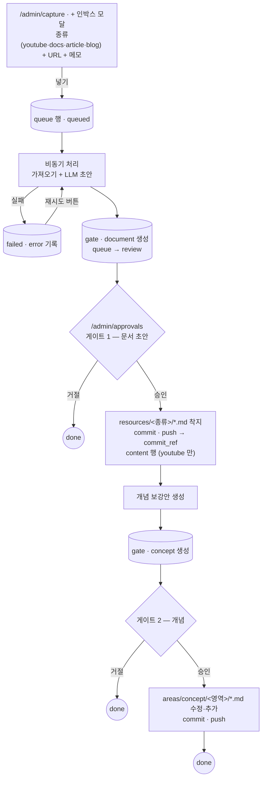
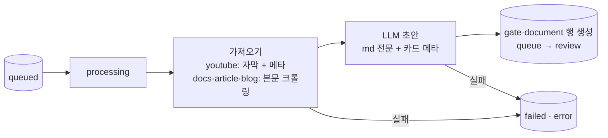
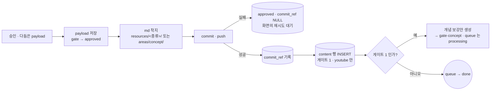

# Inbox

인박스 전체 플로우. 동작 정본은 `case_flow.md` 케이스 1 — 여기는 구현 뼈대만.
표는 둘이다: `queue`(파이프라인 한 건) · `gate`(승인 지점, jsonb 초안).

> **2026-08-25 개정** — 문서 게이트(게이트 1)를 뺐다. 문서는 서버 검증(양식 절 ·
> 실행 실패 감지 · 채번 강제) 통과 시 **자동 착지**하고, 승인 게이트는 **concept
> 하나**다. 아래 Step 3~5 의 「게이트 1」 서술은 이 개정 전 기준이다 — 코드가 정본을
> 따라잡으면 함께 손본다. 승인 대기 화면은 인박스 페이지의 행 펼침으로 흡수됐다.



- 상태는 다섯: `queued → processing → review → done` + `failed`(재시도 가능)
- 거절도 `done` — 어떻게 끝났는지는 gate 행이 갖는다
- 승인은 다듬어서 낸다 — 페이로드를 고쳐 보내면 그게 착지한다
- `approved` 인데 `commit_ref` 가 NULL 이면 푸시 실패 — 다시 누르면 재시도
- book·session 은 모달에 비활성 버튼만 (v1 구멍)

## Step 1 — 인박스 모달

`/admin/capture` 상단 「+ 인박스」 버튼이 연다. 넣는 곳과 보는 곳은 한 페이지다.

```text
┌────────────────────────────────────────────────────────┐
│  인박스                                             ✕  │
│  밖에서 본 것을 넣는다                                 │
├────────────────────────────────────────────────────────┤
│                                                        │
│  종류                                                  │
│  ┌──────────┬──────┬─────────┬──────┬──────┬─────────┐ │
│  │● youtube │ docs │ article │ blog │ book │ session │ │
│  └──────────┴──────┴─────────┴──────┴──────┴─────────┘ │
│                 ↑ book·session 비활성 · soon (구멍)    │
│                                                        │
│  URL                                                   │
│  ┌──────────────────────────────────────────────────┐  │
│  │ https://youtu.be/…                               │  │
│  └──────────────────────────────────────────────────┘  │
│    ↑ placeholder 는 고른 종류를 따라 바뀜              │
│                                                        │
│  메모 · 선택                                           │
│  ┌──────────────────────────────────────────────────┐  │
│  │ 왜 잡아뒀는지 한 줄                              │  │
│  │                                                  │  │
│  └──────────────────────────────────────────────────┘  │
│                                                        │
├────────────────────────────────────────────────────────┤
│                                  [ 취소 ]   [ 넣기 ]   │
└────────────────────────────────────────────────────────┘
```

종류를 고를 때마다 URL 칸의 문구가 바뀐다:

| 종류 | URL 문구 |
|---|---|
| youtube | 유튜브 링크를 넣는다 |
| docs | 공식 문서 링크를 넣는다 |
| article | 기사 링크를 넣는다 |
| blog | 블로그 글 링크를 넣는다 |

### 동작

1. 링크를 넣는다 — 종류 고르고 URL 붙여넣기. 메모는 선택
2. 넣기 → `queue` 행 생성(`queued`) → 모달 닫힘
3. 목록에서 폴링 — `processing → review` 로 흘러간다. 실패면 `failed` + 재시도 버튼

### 정책

- **종류는 사람이 고른다** — 분류를 AI 에 안 맡긴다(케이스 1 결정). youtube 가 기본 선택
- **필수는 URL 하나.** 검증은 「비었나」 정도만 — fallback 안 쌓는다
- **중복은 안 막는다** — 같은 링크를 또 넣으면 또 돈다(erd §미결 4 는 미결로 유지)
- **book·session 은 버튼만** — 비활성으로 자리만 잡는다(v1 구멍)

## Step 2 — 인박스 수집 화면

모달이 닫히면 여기다. 넣는 곳과 보는 곳이 같은 페이지(`/admin/capture`)다.

```text
┌ 인박스 ────────────────────────────── [+ 인박스] ┐
│                                                  │
│  ● queued      youtube  https://youtu.be/abc     │
│                메모: MCP 새 스펙 정리            │
│  ────────────────────────────────────────────    │
│  ● processing  blog     https://…                │
│  ────────────────────────────────────────────    │
│  ● review      youtube  https://…    [승인 →]    │
│  ────────────────────────────────────────────    │
│  ● failed      article  https://…    [재시도]    │
│                error: 본문을 못 가져옴           │
│  ────────────────────────────────────────────    │
│  ● done        youtube  https://…                │
│                                                  │
└──────────────────────────────────────────────────┘
```

### 동작

1. 방금 넣은 행이 맨 위에 `queued` 로 뜬다 — 최신순
2. `queued·processing` 이 있는 동안만 폴링한다. 없으면 가만히 있는다
3. `review` 의 [승인 →] 은 `/admin/approvals` 의 그 건으로 간다
4. `failed` 의 [재시도] 는 처리를 처음부터 다시 돌린다 — `error` 는 성공하면 비운다

### 정책

- **행이 갖는 건 넣은 것 그대로** — 종류·URL·메모·상태·error. 제목 같은 파생물은
  초안(gate.payload)의 것이지 목록의 것이 아니다
- **삭제 없음(v1)** — 잘못 넣었으면 게이트에서 거절하면 된다. 지우는 버튼은 필요해지면

## Step 3 — 비동기 처리 (백엔드)

넣기 이후 사람 눈에 안 보이는 구간. 화면은 상태만 폴링한다.



### 동작

1. 넣기 API 가 `queue` 행을 만들고 백그라운드 태스크로 처리를 건다 —
   크롤링·상태 관리는 FastAPI 안에서 돌고, **AI 실행만** redis 를 거쳐
   워커로 나간다(Step 6·7)
2. 가져오기 — 종류별로 방법만 다르고 흐름은 하나(케이스 1)
3. LLM 이 초안을 만든다 — `resources/<종류>/` 양식(`templates/`)에 맞는 md 전문
   + (youtube 면) `content` 행에 들어갈 카드 메타
4. `gate(document)` 행에 payload 로 저장하고 `queue → review`.
   **여기까지 md·git 은 안 건드린다**

### 정책

- **md 는 승인 시점에 생긴다** — 초안은 DB(jsonb)에만 산다
- **실패는 `failed` + `error` 한 줄이 전부** — 어느 단계였는지 나누지 않는다.
  재시도는 사람이 누르고, 부분 재개 없이 처음부터 다시 돈다
- **LLM 호출은 open-kknaks 경유** — SDK 를 직접 붙이지 않는다(기존 ADR-04)

## Step 4 — 승인 대기 화면

`/admin/approvals`. 열린 게이트를 하나씩 처리한다.

```text
┌ 승인 대기 ───────────────────────────────────────┐
│                                                  │
│  ● 게이트1 · 문서   youtube  MCP 새 스펙 정리    │
│  ● 게이트1 · 문서   docs     Redpanda LLM 설정   │
│  ● 게이트2 · 개념   blog     QMD 검색 파이프라인 │
│  ● 승인됨 · 푸시 실패  youtube  …    [재시도]    │
│                                                  │
└──────────────────────────────────────────────────┘
```

게이트 1 상세 — 문서 초안:

```text
┌ 게이트 1 · 문서 ── youtube · https://youtu.be/abc ┐
│  메모: MCP 새 스펙 정리                           │
├───────────────────────────────────────────────────┤
│  파일명  C-027-mcp-new-spec                       │
│                                                   │
│  카드 메타 (youtube 만)                           │
│  제목 [                    ]  요약 [           ]  │
│  태그 [ #mcp #protocol ]  날짜 [ 2026-08-25 ]     │
│                                                   │
│  본문 (md · 수정 가능)                            │
│  ┌─────────────────────────────────────────────┐  │
│  │ # MCP 새 스펙 정리                          │  │
│  │ > 출처: https://youtu.be/abc · …            │  │
│  │ ## 요지                                     │  │
│  │ …                                           │  │
│  └─────────────────────────────────────────────┘  │
├───────────────────────────────────────────────────┤
│              [ 거절 ]   [ 승인 — 커밋 · 푸시 ]    │
└───────────────────────────────────────────────────┘
```

게이트 2 상세 — 개념 보강안:

```text
┌ 게이트 2 · 개념 ── youtube · MCP 새 스펙 정리 ────┐
│                                                   │
│  [✓] 신규  <영역>/mcp-stateless-session           │
│      ┌────────────────────────────────────────┐   │
│      │ …개념 본문 전문 (수정 가능)…           │   │
│      └────────────────────────────────────────┘   │
│                                                   │
│  [✓] 보강  <영역>/json-rpc — diff                 │
│      ┌────────────────────────────────────────┐   │
│      │ - 사라지는 줄                          │   │
│      │ + 들어오는 줄                          │   │
│      └────────────────────────────────────────┘   │
│                                                   │
│  [ ] 신규  <영역>/…   ← 체크 해제 = 이건 안 올림  │
│                                                   │
├───────────────────────────────────────────────────┤
│              [ 거절 ]   [ 승인 — 커밋 · 푸시 ]    │
└───────────────────────────────────────────────────┘
```

### 동작

1. 목록은 열린 것만 — `open` + 「승인됨인데 `commit_ref` 없음」(푸시 실패분)
2. 초안은 다듬어서 승인한다 — 화면에서 고친 내용이 payload 로 저장되고 그대로 착지한다
3. 게이트 1 승인 → md 착지 → commit·push → `commit_ref` 기록 → (youtube 면) `content` 행
   → 개념 보강안 생성 시작(queue 는 `processing` 으로)
4. 게이트 2 승인 → 체크된 항목만 `areas/concept/` 착지 → commit·push → `done`
5. 거절 → `rejected` 기록, queue 는 `done`. 이유는 안 적는다 — 기본 구조만
6. 푸시 실패 → 「승인됨」 그대로 남고 [재시도] — 별도 재시도 잡 없음(케이스 1 결정)

### 정책

- **게이트마다 커밋·푸시가 따로 나간다** — 승인을 모아 뒀다가 한 번에 내보내지 않는다
  (case_flow 서두: 미커밋이 쌓이면 옵시디언과 엉킨다)
- **재생성·피드백 루프 없음(v1)** — 초안이 아니면 거절이고, 다듬을 만하면 고쳐서 승인한다
- **게이트 2 는 항목별로 뺀다** — 개념 후보 전부가 아니라 체크된 것만 올라간다.
  거절은 전체를 버릴 때만

## Step 5 — 승인 착지 (백엔드)

승인 버튼 뒤에서 도는 구간. **파일이 원장이므로 파일이 먼저 착지한다** (케이스 1:
푸시가 성공해야 DB 를 확정한다).



### 동작

1. 승인 요청의 payload(다듬은 것)를 gate 행에 저장하고 `approved` 로 바꾼다
2. md 를 쓴다 — 게이트 1 은 `resources/<종류>/<stem>.md`, 게이트 2 는 체크된
   개념별 `areas/concept/<영역>/` 신규·보강
3. commit·push — 메시지는 케이스 1 정본대로: 게이트 1 `<종류> {name}`,
   게이트 2 `fix/concept - {name}`
4. 푸시가 성공하면 `commit_ref` 를 적고 DB 를 확정한다 — 게이트 1 · youtube 는
   `content` 행 INSERT, `result` 에 content_id·파일 경로
5. 게이트 1 이면 개념 보강안 생성으로 이어지고, 게이트 2 면 `done`

### 정책

- **파일이 먼저, DB 가 나중** — 푸시 실패면 DB 는 아무것도 확정하지 않는다.
  `approved` + `commit_ref NULL` 로 남고 재시도는 3번부터 다시 돈다
- **게이트마다 커밋 하나** — 승인 하나 = 커밋·푸시 한 번. 모아서 안 내보낸다
- **백엔드가 이 레포에 쓴다** — 서버가 para 원장 레포에 커밋·푸시할 수 있어야 한다.
  erd 「대가가 하나 있다」(md 읽기)와 같은 자리의 쓰기 버전이다. 배포 때 git 신원·
  권한을 챙긴다

## Step 6 — AI 실행 (open-kknaks · codex)

LLM 은 open-kknaks 로 codex CLI 를 부른다. 백엔드는 `AgentClient` 로 제출만 하고
실행은 워커가 한다.

```text
back (FastAPI) ──submit──▶ redis ──dequeue──▶ worker ──▶ codex exec
```

같은 세션을 이어서 두 번 부른다:

| | 언제 | 호출 | 결과 |
|---|---|---|---|
| 1 문서 생성 | 비동기 처리(Step 3) | `submit(provider=codex, cwd=원장 레포, sandbox=read-only, output_schema=문서)` — 프롬프트: 크롤링 본문 + `templates/resources/<kind>.md` 절 구성 그대로 | payload → `gate·document`, session_id → `queue.ai_session_id` |
| 2 개념 생성 | 게이트 1 승인 후(Step 5) | `submit(resume={mode: session, session_id}, output_schema=개념)` — 프롬프트: **승인 확정본** + `para/areas/concept/` 탐색, 판정은 `area.md` 3.3 | payload → `gate·concept` |

### 정책

- **템플릿은 백엔드가 `kind` 로 고른다** — AI 가 고르지 않는다. cwd 가 원장 레포라
  codex 가 템플릿·개념을 직접 읽는다
- **sandbox 는 read-only** — AI 는 파일을 못 쓴다. md 는 승인 시점에 백엔드가 쓴다
- **output_schema 로 출력 모양을 강제한다** — 파싱 없이 gate.payload 에 꽂힌다
- **resume 프롬프트에 확정본을 준다** — 게이트 1 에서 사람이 다듬은 것을 세션은
  모른다. 이어받되 기준은 승인본이다
- **open-kknaks 는 안 고친다** — 설정은 우리 부팅부(compose·env)에서 한다

## Step 7 — 인프라 (compose: back · db · redis · worker)

**codex 는 이미지에 굽지 않는다.** 워커는 compose 서비스지만, codex 실행 파일은
런타임 마운트로 온다 — 로컬(맥)은 호스트의 리눅스용 CLI 번들, prod 는 시크릿·번들
마운트. (2026-08-25 개정 — 처음엔 워커를 호스트 프로세스로 뒀다가, mediness
action-runtime-review 의 검증된 패턴으로 컨테이너화)

```text
┌─ docker compose ──────────────────────────────────┐
│                                                   │
│  back (FastAPI) ── db (postgres)                  │
│     │ submit                                      │
│     ▼                                             │
│   redis ◀──dequeue── worker (open-kknaks)         │
│                        │ codex 실행               │
│                        ▼                          │
│              /claude-tools (ro 마운트)            │
│              리눅스 node + @openai/codex 번들     │
│                                                   │
│  /ledger ◀── bind mount — 원장 레포               │
│    back: rw(착지·push) · worker: ro(codex cwd)    │
└───────────────────────────────────────────────────┘
```

### 정책

- **codex 는 런타임 마운트** — `Dockerfile.worker` 는 open-kknaks 만 설치한다.
  실행 파일은 리눅스용 CLI 번들(`~/.cache/axkg-live/.claude-tools` — linux 노드
  런타임 포함이라 맥에서도 리눅스 컨테이너가 실행 가능)을 `:ro` 로 얹고 PATH
  최우선으로 잡는다
- **codex 인증은 auth.json 파일 하나만 ro** — 세션(`CODEX_HOME`)은 명명 볼륨이
  갖는다(문서→개념 resume 이 워커 재시작을 넘겨 살아남는 조건). 호스트 세션
  디렉터리를 통째로 안 내주는 이유는 컨테이너가 사용자 작업 세션을 건드리기
  때문. prod 는 시크릿 마운트로 같은 경로에
- **원장 레포는 이미지에 굽지 않는다** — 승인마다 커밋이 쌓이는 살아있는 레포다.
  bind mount 로 back(rw)·worker(ro, codex cwd=/ledger)가 공유한다
- **착지 직전 pull** — 사람도 옵시디언에서 같은 레포를 미니까 푸시 전에 최신을
  받는다. 그 이상의 동기화 장치는 안 둔다
- **비밀은 전부 .env** — git 푸시 자격 · DB·redis 접속 · GIT_TOKEN_KEY. 커밋 금지.
  `.env` 의 경로류(AI_CWD 등)는 **컨테이너 기준**이다
- `scripts/run-worker.sh` 는 호스트 직접 실행 폴백으로만 남는다
- dev 는 맥, prod 는 홈서버(profile-api 자리) — compose 하나로 같은 모양
