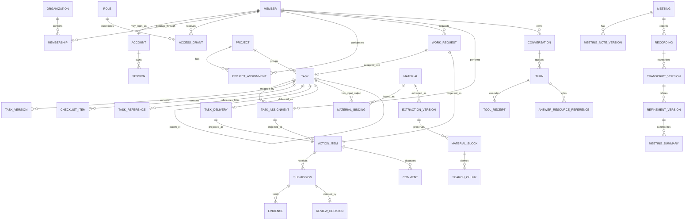

# SCAX Logical ERD

SCAX 현재 구현과 SPEC 001–010을 연결하는 논리 entity map이다. 이름은 개념을 식별하기 위한 것이며 SQL table·column·index·FK·migration·ORM mapping을 고정하지 않는다.

## 1. 전체 관계

## 2. Organization·identity·access

- Member는 사람이자 조직 directory identity다. Account와 Session은 선택적 로그인 identity다.
- Membership, employment, appointment, grade와 job 관계는 서로 독립된 기간 사실이다.
- Role은 versioned capability template이고 AccessGrant는 Member·scope·기간에 발급된 사실이다.
- scope는 organization 또는 Project를 가리킬 수 있다.
- ProjectAssignment에서 파생된 AccessGrant는 source assignment를 기억해 종료 시 해당 grant만 회수한다.

## 3. Project·Task·work

- Project와 Organization 사이에는 ownership 관계가 없다.
- ProjectAssignment는 Project 1개와 Member 1개를 lead/member 역할로 잇는다.
- Task.project는 optional이고 Task.parent는 optional self relation이다.
- parent depth는 한 단계로 제한하고 child의 Project는 parent와 같다.
- TaskAssignment는 pending/active/ended lifecycle을 가진다.
- WorkRequest 수락은 Task 0..1개를 만들고 direct assignment는 기존 Task에 pending assignment를 둔다.
- TaskVersion, ChecklistItem version/activity, TaskReference와 TaskDelivery는 Task 본체와 별도 identity를 가진다.

## 4. Judgment

- source resource는 ActionItem adapter를 통해 canonical 판단 projection을 제공한다.
- ActionItem 1개는 같은 질문의 Submission 1..N을 가진다.
- Submission은 payload와 evidence manifest가 immutable하다.
- ReviewDecision은 성공한 특정 Submission에 최대 1개이며 evidence hash를 freeze한다.
- Comment는 ActionItem discussion에 속하지만 decision이나 상태 전이가 아니다.
- TaskDelivery 수정·재제출은 같은 ActionItem의 다음 Submission이다.

## 5. Materials

- MaterialBinding은 Material을 Task input/output 등 역할로 연결한다.
- TaskReference는 Material이 아니고 별도 Task-to-Task relation이다.
- Material의 ExtractionVersion은 current/superseded 상태를 가진다.
- MaterialBlock은 원문 구조와 locator를 보존하고 SearchChunk는 검색용 파생물이다.
- purge는 bytes·blocks·chunks를 삭제하고 Evidence에 복제된 excerpt를 redaction하되 citation identity는 유지한다.

## 6. Meetings

- MeetingNoteVersion은 note 변경마다 추가된다.
- Recording은 realtime session과 저장 파일 metadata·hash를 가진다.
- realtime TranscriptVersion과 final file TranscriptVersion은 별도 source/version이다.
- RefinementVersion은 raw transcript를 덮어쓰지 않는다.
- 사람 speaker mapping은 자동 speaker label과 별도 revision이다.
- MeetingSummary는 사용한 transcript/refinement version과 evidence ranges를 가리킨다.
- follow-up candidate는 명시적 승격 후 self Task 또는 WorkRequest를 가리킨다.

## 7. Conversations·graph

- Conversation은 Member 소유이며 여러 Turn을 FIFO로 queue한다.
- Turn attempt와 durable job은 취소·재시도·fence를 기록한다.
- ToolReceipt는 실제 application port 실행을 설명한다.
- AnswerResourceReference는 canonical resource ID·version·locator·order를 기록한다.
- RelationshipGraph node는 기존 domain canonical ID를 재사용하고 edge는 source-owned 관계를 projection한다. 별도 graph database entity를 요구하지 않는다.

## 8. Cross-model invariants

1. ProjectAssignment, TaskAssignment와 Membership은 서로 대체할 수 없다.
2. 참조·graph edge·Project grouping은 authorization을 새로 만들지 않는다.
3. mutable source와 immutable version/submission/decision/evidence를 구분한다.
4. provider identifier는 domain canonical identity를 대체하지 않는다.
5. workflow run은 DailyReport generation의 제한된 lineage이며 work/decision entity의 필수 parent가 아니다.
