# 업무 구조와 행위별 사례

> **최신 합의:** 요청 발송 시 Task를 생성한다. 수락하면 같은 Task를 유지하고, 거절하면 cancelled로 전환한다. 거절 후 재요청은 새 Task이며 기존 로그는 보존한다. 디자인 결과의 검토는 별도 검토 Task 없이 완료 보고·승인·보완·재보고로 처리한다. 담당자 화면에는 중심 업무와 직속 하위 작업 두 단계만 표시한다. 미완료 하위 Task가 있으면 상위 업무를 완료할 수 없다. 취소된 하위 Task는 로그를 보존하고 상위 완료 검사에서 제외한다. 생성·수정·조회 범위와 요청 예외는 아래의 합의한 기본값을 따른다. 로그를 보존하는 구체적인 삭제 방식은 미정이다.

이 문서는 [정의_v2.md](정의_v2.md)를 논의하기 위한 사례집이다. 현재 구현 명세가 아니며, 아래에 나오는 검토안은 사용자와 합의한 정책이 아니다.

- **합의**: 사용자 요구와 정의_v2.md에 정리된 의미와 관계.
- **미정**: 추가로 합의해야 하는 처리 규칙. 흐름도에서도 미정이라고 표시한다.
- **검토안**: 미정 사항을 비교하기 위한 구체적인 예시. 채택된 설계가 아니다.

흐름도의 화살표는 사건의 순서다. 관계도에서는 화살표에 관계를 따로 표기한다. 수락 대기·보완 등의 표현은 업무상 의미이며 DB 상태값을 확정하지 않는다. `open → in_progress`와 그 변경 시각을 시작으로 보는 것은 합의된 내용이다.

## 1. 사례의 범위

세 행위는 각각 독립 업무 또는 기존 업무와 관계있는 상황에서 검토한다. 모든 조합을 별도 정책으로 만들기보다 아래 사례를 조합하여 살핀다. 아직 정의하지 않은 예외까지 정책이 확정되었다는 뜻은 아니다.

| 구분 | 사례 | 절 |
|---|---|---|
| 본인 업무 생성 | 단독 수행, 직접 하위 작업, 직접 작업과 요청 혼합 | 2.1~2.3 |
| 업무 요청 | 독립 요청, 하위 요청, 수락, 협의, 거절, 무응답 | 3.1~3.5 |
| 업무 분배 | 독립 배정, 하위 배정, 권한 없음, 담당 변경 | 4.1~4.4 |
| 담당자 간 관계 | 재분해, 재요청, 원래 요청자에게 완료 보고 | 5.1~5.3 |
| 깊이와 화면 | 같은 담당자의 중첩, 상태 요약과 상세 확인 | 5.4~5.5 |
| 결과 확인 | 승인, 보완 반복, 같은 Task의 완료 보고 회차 | 6.1~6.3 |
| 완료 기준 | 하위 작업 완료 여부, 체크리스트 충족 여부 | 6.4~6.5 |
| 변경과 예외 | 막힘, 철회·취소, 내용 변경, 기한 초과, 재개 | 7.1~7.5 |
| 복수 관계 | 여러 수신자, 공동 상위 업무, 순환 관계 | 7.6~7.8 |
| 외부 유입 | 메일·회의·AI, 스케줄과 자동 수락 | 8.1~8.2 |
| 요청과 Task 관계 | 발송 시 생성, 거절 취소, 새 Task로 재요청 | 9 |
| 전체 사례 | 보고서 → 디자인 → 검토 → 완료 확인 | 10 |

## 2. 본인 업무 생성

### 2.1 하위 작업 없이 내가 수행

**예시:** 내가 회의록을 작성한다.

**합의:** 내가 수행할 일을 등록하는 것이 본인 업무 생성이다. 하위 작업 없이도 업무가 존재할 수 있다. 시작과 생성은 구분한다.

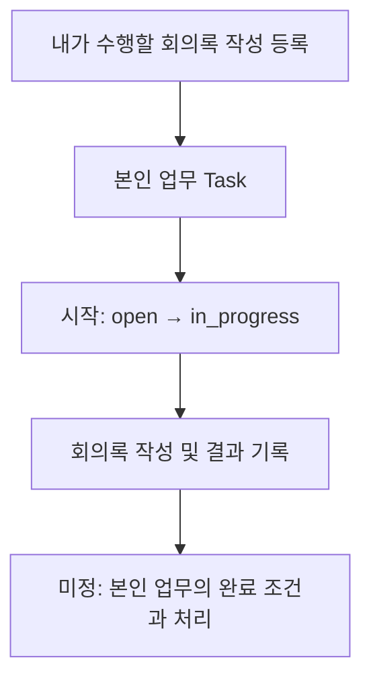

**미정:** 생성 시 담당 확정 처리, 본인 업무의 별도 확인 절차 유무, 결과 입력의 필수 범위.

### 2.2 내가 수행할 하위 작업으로 분해

**예시:** 보고서 작성 아래 자료 조사와 내용 작성을 둔다.

**합의:** 하위 작업도 Task이며, 체크리스트와 구분한다.

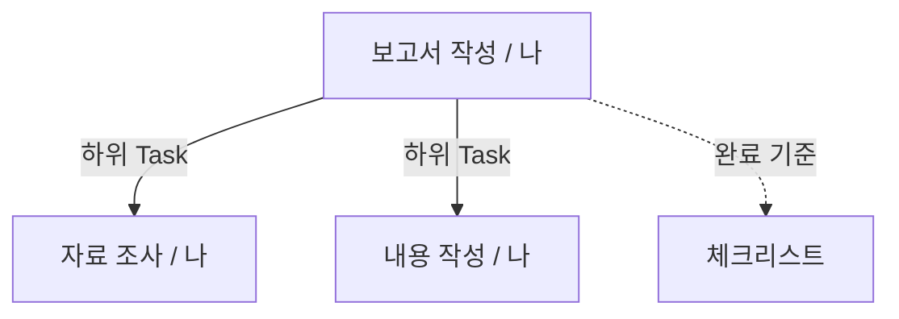

**합의:** 하위 Task가 미완료면 상위 업무를 완료할 수 없다.

**미정:** 하위 작업 간 선후행 제약. 목록 순서만으로 수행 순서가 합의된 것은 아니다.

### 2.3 직접 수행과 다른 사람에게 요청을 함께 구성

**예시:** 보고서 내용은 내가 쓰고 디자인은 디자이너에게 요청한다.

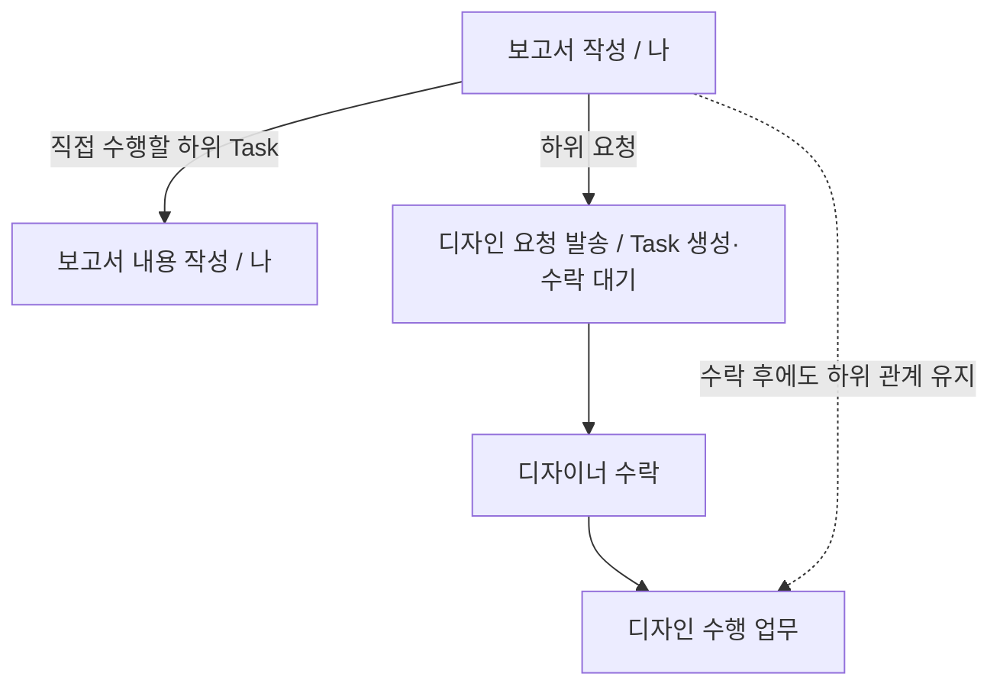

**합의:** 담당자가 달라도 디자인은 보고서의 하위 일이다. 요청 발송 시 디자인 Task를 만들고, 수락 후에도 같은 Task를 사용한다. 요청 기록과 Task의 관계는 9절에서 설명한다.

## 3. 업무 요청

### 3.1 상위 업무 없이 독립적으로 요청하는 경우

**검토 사례:** 내가 특정 보고서에 속하지 않는 로고 제작을 요청한다. 독립 요청의 허용 범위는 확인이 필요하다.

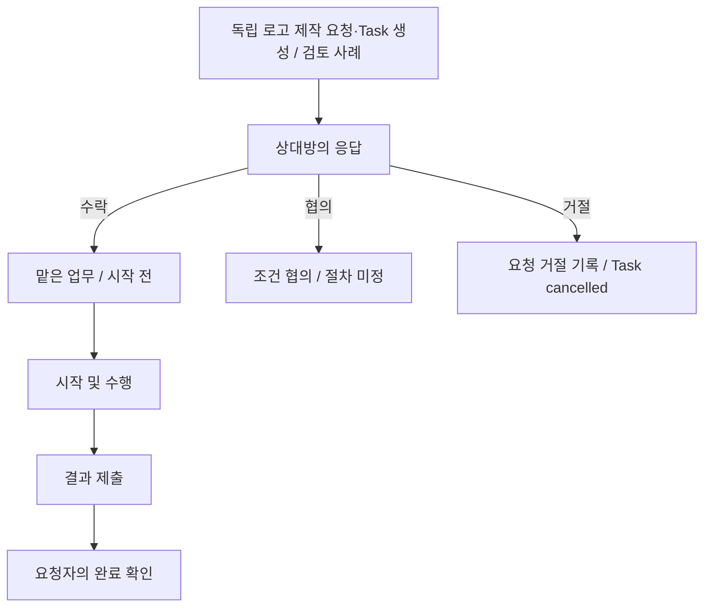

**합의:** 요청은 수락·협의 및 결과 확인을 포함하는 행위다. 수락과 시작은 다르다.

### 3.2 상위 업무의 하위 요청을 수락

**예시:** 보고서에서 보낸 디자인 요청을 디자이너가 수락한다.

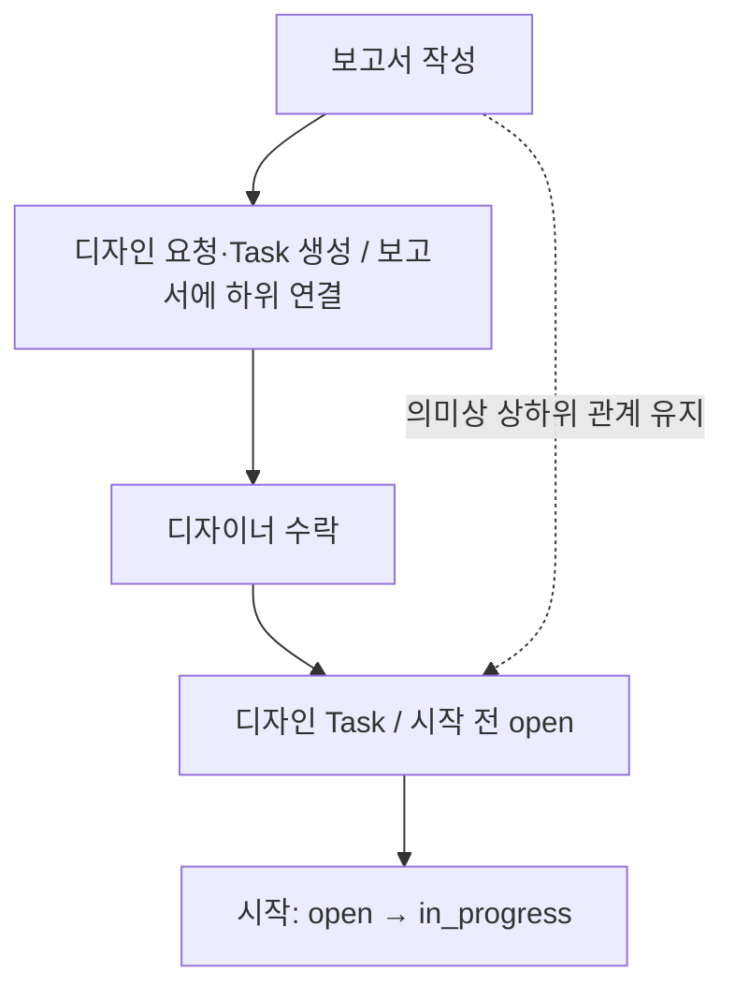

**합의:** 수락 전 요청과 수락 후 수행 업무 모두 보고서와의 관계를 잃으면 안 된다. D는 발송 시 생성하고 수락 후에도 같은 행을 사용한다.

### 3.3 조건을 협의한 뒤 수락하거나 거절

**예시:** 디자이너가 기한 연장이나 작업 범위 축소를 요청한다.

```mermaid
flowchart TD
    A["디자인 요청 수신"] --> B["기한 또는 범위 협의"]
    B --> C["수락 전 요청자가 수정 / 동의 기록 방식은 구체화"]
    C --> D{ "협의 결과" }
    D -->|수락| E["합의한 내용으로 수행"]
    D -->|거절| F["요청 거절 기록 / Task cancelled"]
    D -->|계속 협의| B
```

**합의:** 수락 전 요청 내용을 요청자가 수정한다. 수락 후 범위·기한·완료 기준 변경은 상대방 동의를 받는다. 구체적인 동의 기록 방식은 구현 시 정한다.

### 3.4 요청을 거절하고 새 Task로 재요청

**예시:** 디자이너가 디자인 요청을 거절한 뒤 내가 다른 사람에게 다시 요청한다.

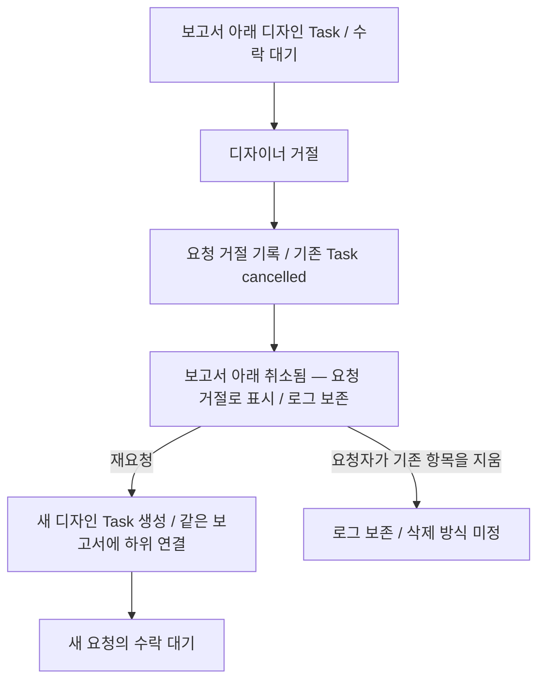

**합의:** 거절된 Task를 재사용하지 않는다. 거절·취소 이력과 상위 관계를 유지하고, 재요청은 새 Task로 만든다. 요청자는 기존 취소 항목을 지울 수 있도록 한다.

**미정:** 거절 사유의 필수 여부, 재요청 이력의 상세 연결, 로그를 보존하는 삭제 방식. 취소된 항목은 상위 완료 검사에서 제외한다.

### 3.5 응답하지 않거나 기한을 넘김

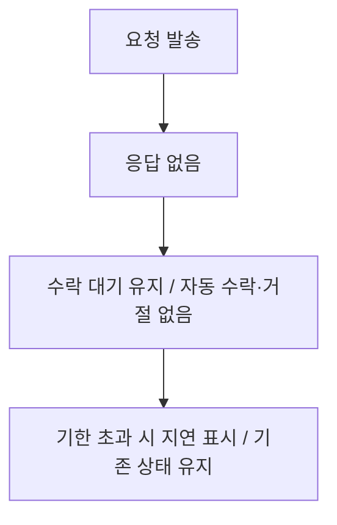

**합의:** 무응답이나 기한 경과만으로 요청을 수락·거절·취소·완료하지 않는다.

## 4. 업무 분배(배정)

### 4.1 배정 권한자가 독립 업무의 담당자를 지정

**예시:** 팀장이 부서원에게 월간 운영 점검을 배정한다.

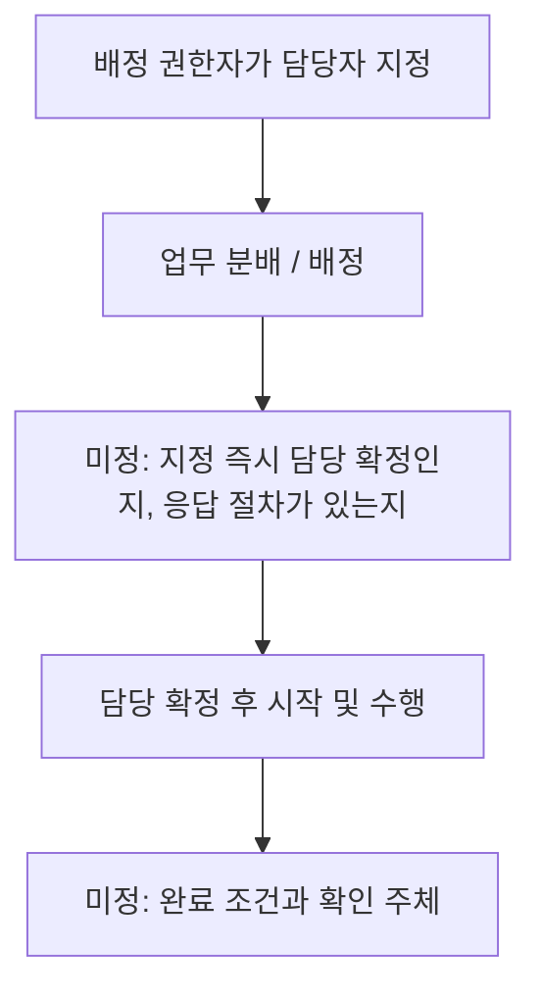

**합의:** 배정은 권한을 바탕으로 담당자를 지정하는 행위다. 요청과 같은 절차로 간주하지 않는다.

**미정:** Task 생성 시점, 수락·거절 유무, 배정자가 완료 확인도 맡는지.

### 4.2 상위 업무의 일부를 배정

**검토 사례:** 팀장이 보고서 작업 중 데이터 집계를 부서원에게 배정한다.

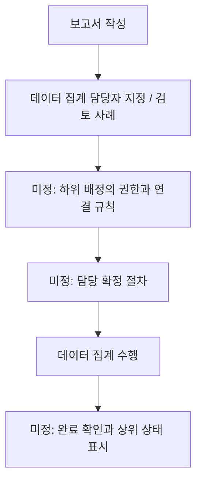

**미정:** 상위 업무 담당자와 배정 권한자가 다를 때의 권한, 하위 배정 허용 범위. 하위 관계를 표현하기 편하다는 이유로 일반 요청을 배정으로 바꾸지 않는다.

### 4.3 배정 권한이 없는 사람이 담당자를 지정하려 함

```mermaid
flowchart TD
    A["타인에게 업무를 배정하려 함"] --> B{ "배정 권한이 있는가" }
    B -->|있음| C["배정 규칙 적용"]
    B -->|없음| D["권한에 의한 배정으로 처리할 수 없음"]
    D --> E["미정: 안내 방식과 요청으로 전환하는 사용자 동작"]
```

**합의:** 권한에 의한 배정과 요청은 구분한다. 권한이 없다는 이유로 사용자 의사 확인 없이 요청을 발송하는 규칙은 정하지 않았다.

### 4.4 기존 업무의 담당자를 교체

```mermaid
flowchart TD
    A["A가 업무 수행 중"] --> B["배정 권한자가 B에게 담당 변경 제안"]
    B --> C["B 수락 대기 / A의 담당과 책임 유지"]
    C --> D{ "B의 응답" }
    D -->|수락| E["같은 Task의 담당을 B로 교체 / A 담당 종료"]
    D -->|거절| F["A 유지 / 업무 취소 안 함"]
    E --> G["담당 변경 이력 기록"]
    F --> H["거절 이력 기록"]
```

**합의:** 새 담당자가 수락하기 전에는 기존 담당을 해제하지 않는다. 수락하면 같은 Task의 담당을 교체하고, 거절하면 기존 담당이 계속 수행한다. 담당 변경 거절은 업무 자체의 취소가 아니다.

일반 요청의 최초 거절 시 Task 취소·새 Task 재요청 규칙과 구분한다. 신규 배정과 담당 없는 업무의 첫 지정 규칙은 별도다.

**미정:** 변경 제안의 철회·응답 기한, 대기 중 기존 담당이 완료하거나 다른 담당 변경이 발생한 경우, 새 담당의 수락 전 자료 접근 범위.

## 5. 업무 관계와 담당자별 관리

### 5.1 요청받은 업무를 직접 하위 작업으로 분해

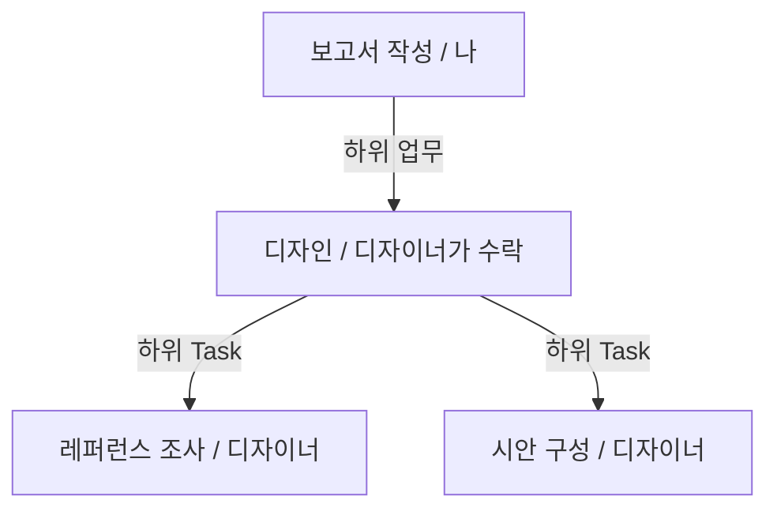

**합의:** 디자인은 디자이너의 중심 업무가 될 수 있다. 보고서의 하위라는 이유만으로 디자인의 세부 작업을 표현할 수 없게 해서는 안 된다.

### 5.2 수신자가 다시 다른 사람에게 일부 작업을 요청

**예시:** 디자이너가 일러스트 작업을 다른 담당자에게 요청한다.

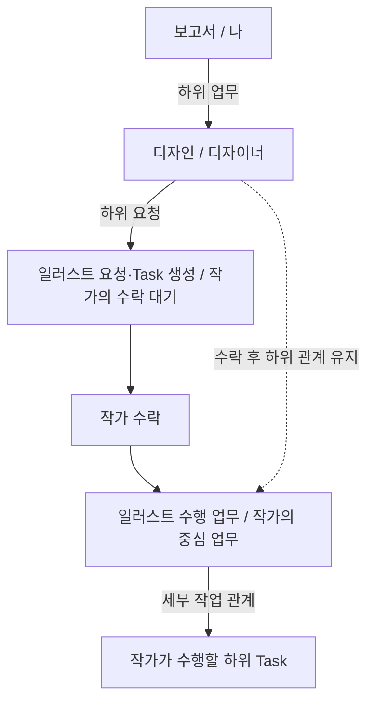

**합의:** 수신자가 받은 업무를 다시 분해·요청하는 관계를 표현한다.

**합의:** 다른 사람이 수락한 업무는 새 중심 업무가 되어 직속 하위 작업과 요청을 가질 수 있다. 요청자는 요청한 업무와 그 하위 작업·연결 자료를 조회할 수 있다.

**미정:** 재요청 발생을 원래 요청자에게 알리는 방식. 전체 담당 교체는 4.4의 규칙을 따른다.

### 5.3 원래 요청자에게 완료 보고

```mermaid
flowchart TD
    D["디자인 수행 / 디자이너"] --> Q["디자인 완료 보고 / 요청자인 나에게"]
    Q --> A{ "내가 결과 검토" }
    A -->|승인 및 하위 완료 조건 충족| DONE["디자인 완료"]
    A -->|보완| FIX["디자이너 수정"]
    FIX --> Q
```

**합의:** 디자인 결과의 검토는 완료 보고에 대한 확인으로 처리한다. 나에게 별도 검토 Task를 보내거나, 내 검토 결과를 디자이너가 다시 승인하는 절차를 만들지 않는다.

작업 중 별도로 의견을 구하는 중간 검토의 필요 여부와 방식은 미정이다.

### 5.4 직접 작업의 생성 범위

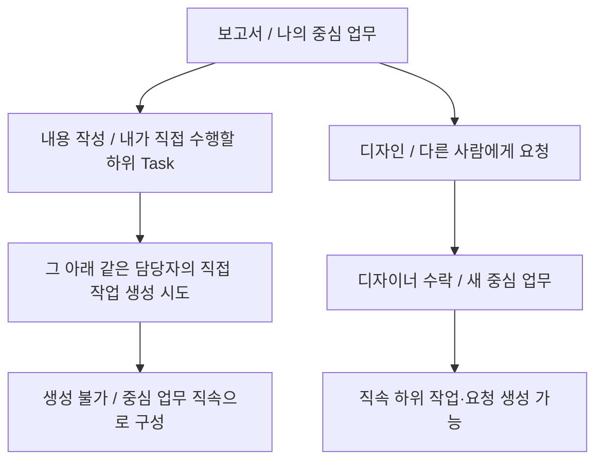

**합의:** 직접 작업은 중심 업무 바로 아래까지만 둔다. 다른 사람이 요청을 수락하면 해당 업무를 그 사람의 중심 업무로 다시 분해할 수 있다. 화면 두 단계와 생성 규칙은 각각 구분한다. 담당 변경 후 기존 구조를 어떻게 처리할지는 별도로 검토한다.

### 5.5 요청자의 요약 화면과 수행자의 중심 업무 화면

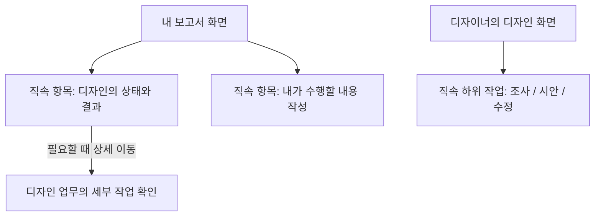

**합의:** 보고서 화면에 디자인의 모든 세부 작업을 기본으로 펼치지 않는다. 각 담당자의 화면에는 중심 업무와 직속 하위 작업까지만 두 단계로 표시한다. 하위 작업의 개수를 하나로 제한한다는 뜻은 아니다. 디자인의 완료 보고·검토 이력은 디자인 업무의 이력이며 별도 하위 Task가 아니다.

요청자는 요청한 업무와 그 하위 작업·연결 자료를 조회할 수 있다. 수행자의 다른 업무나 해당 업무에 연결하지 않은 자료까지 공개하지 않는다. 화면에서는 중심 업무와 직속 하위 작업까지만 표시하고, 더 깊은 작업은 해당 업무로 들어가 확인한다.

상태 요약 표시와 집계의 상세 방식은 구현 시 구체화한다. 위 조회 범위가 현재 구현되었다는 뜻은 아니다.

## 6. 결과 제출과 완료 확인

### 6.1 요청한 업무의 결과를 승인

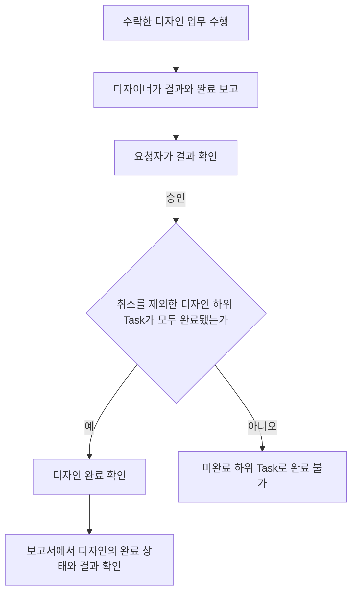

**합의된 방향:** 요청한 업무는 요청자의 완료 확인을 받는다.

**미정:** 제출·승인의 필수 입력, 정확한 상태값, 확인 권한의 위임과 대리 처리.

### 6.2 완료 보고에 보완을 요청하고 다시 제출

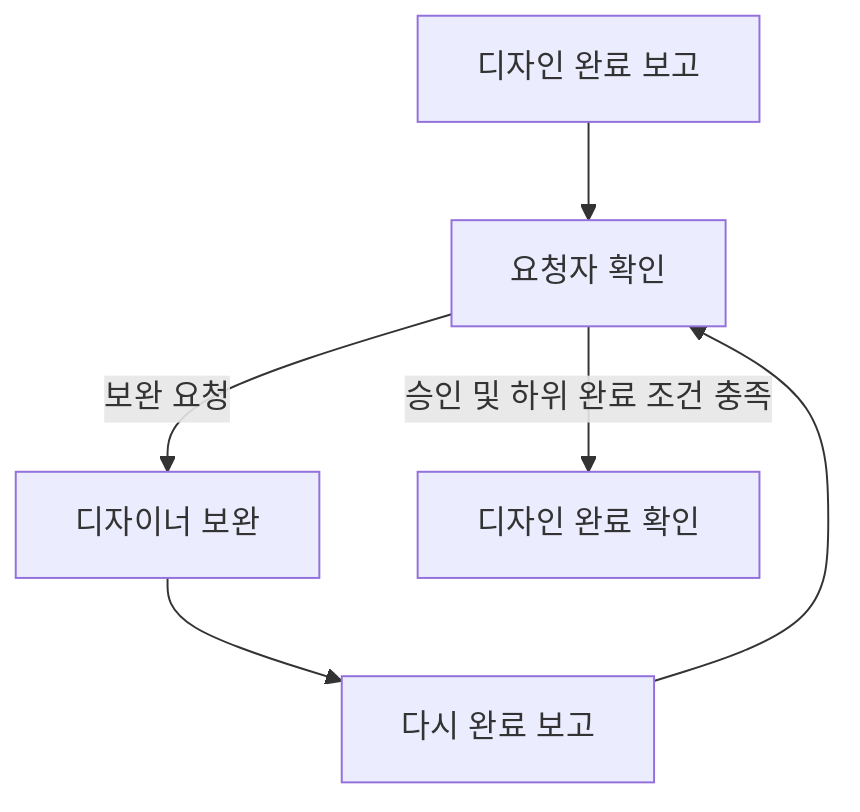

**미정:** 보완 시 상태, 제출 회차와 결과 버전 관리, 보완 작업을 별도 Task로 만드는 기준. 보완마다 자동으로 하위 Task를 만드는 정책은 정하지 않았다.

### 6.3 같은 디자인 Task에서 완료 보고·보완을 반복

**예시:** 첫 완료 보고에는 보완을 요청하고, 수정 후 다시 보고한 결과는 승인한다.

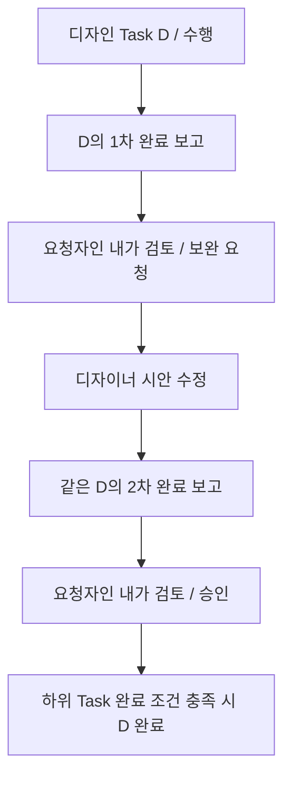

**합의:** 1차·2차 검토는 별도 요청이나 Task가 아니라 같은 디자인 업무의 완료 보고에 대한 확인이다. 승인되면 디자인이 완료되며, 검토를 수행한 나의 결과를 디자이너가 다시 확인하지 않는다.

**구분:** 요청 수락 전의 거절은 기존 Task 취소 후 새 Task로 재요청한다. 수행 후 완료 보고에 대한 보완은 같은 Task에서 수정·재보고한다.

**미정:** 보고 회차와 결과 버전의 상세 저장 방식, 시안 수정을 별도 하위 Task로 만드는 기준, 완료 보고와 별개인 중간 의견 요청의 방식.

### 6.4 취소를 제외한 미완료 하위 Task가 있으면 상위 완료 불가

```mermaid
flowchart TD
    A["보고서 완료 시도"] --> X["취소된 하위 Task 제외 / 로그 보존"]
    X --> B{ "나머지 하위 업무 상황" }
    B -->|미완료 없음| C["보고서 자체의 완료 기준과 절차 확인"]
    B -->|수락 대기 또는 수행 중| D["보고서 완료 불가"]
    B -->|완료 보고 후 승인 대기| D
```

**합의:** 취소된 하위 Task는 이력을 남기고 상위 완료 검사에서 제외한다. 나머지 하위 Task에 미완료가 있으면 상위 업무를 완료할 수 없다. 디자인의 완료 보고만으로는 완료가 아니며 요청자의 승인이 필요하다. 화면을 두 단계로 표시해도 이 완료 조건은 유지된다.

예를 들어 디자인 A가 거절로 취소되고 새로 요청한 디자인 B가 완료되면, A는 보고서 완료를 막지 않는다. B와 그 밖의 취소되지 않은 하위 Task가 모두 완료됐는지 확인한다. 취소된 Task의 상태를 완료로 바꾸는 것은 아니다.

하위 Task나 체크리스트가 끝나도 업무를 자동 완료하지 않는다. 사용자가 직접 완료 처리하며, 요청받은 업무는 담당자의 완료 보고 후 요청자가 승인해야 완료된다. 취소를 제외한 미완료 하위 Task가 있으면 최종 완료는 막는다.

**미정:** 완료 보고 제출부터 막을지 최종 완료 시 검사할지. 최종 완료를 막는 규칙 자체는 확정이다.

### 6.5 체크리스트와 하위 Task의 완료가 다를 때

```mermaid
flowchart TD
    A["결과와 완료 기준 확인"] --> B{ "확인 상황" }
    B -->|하위 Task 완료, 기준 미충족| C["미정: 보완과 완료 차단 규칙"]
    B -->|기준 충족, 하위 Task 미완료| D["하위 Task 미완료로 상위 완료 불가"]
    B -->|체크리스트 없음| E["미정: 완료 기준 입력 의무"]
    B -->|모두 충족| F["해당 행위의 완료 절차 적용 / 세부 미정"]
```

**합의:** 체크리스트는 완료 기준이며 하위 Task는 이를 충족하기 위해 수행할 일이다.

**미정:** 모든 체크를 완료의 필수 조건으로 강제할지, 누가 체크할 수 있는지. 개념의 정의와 시스템의 완료 차단 규칙은 별개다.

## 7. 변경·중단 및 복수 관계

합의한 기본값과 남은 검토 사항을 구분한다. 철회·취소·수정·지연·재개는 아래 기본값을 따르며, 복수 관계 등의 미정 사항은 따로 표시한다.

### 7.1 수행 중 막힘과 재개

```mermaid
flowchart TD
    A["수행 중"] --> B["진행을 막는 사유 발생"]
    B --> C["미정: 막힘 기록과 요청자에게 표시"]
    C --> D["사유 해소"]
    D --> E["미정: 재개 절차와 상태"]
```

**미정:** 사유 입력 의무, 막힘 중 결과 제출 가능 여부, 상위 업무의 상태에 미치는 영향.

### 7.2 요청 철회 또는 업무 취소

```mermaid
flowchart TD
    A["요청자 철회·취소 의사"] --> B{ "수락 여부" }
    B -->|수락 전| C["요청자 철회 / Task cancelled"]
    B -->|수락 후| D["담당자에게 취소 제안"]
    D --> E["응답 전 기존 상태 유지"]
    E -->|동의| F["Task cancelled"]
    E -->|동의하지 않음| G["기존 업무 유지"]
    C --> H["로그 보존 / 상위 완료 검사에서 제외"]
    F --> H
```

**합의:** 수락 후에는 담당자의 동의로 취소한다. 배정 업무의 취소 권한, 상위 취소 시 하위 전체에 미치는 영향은 별도로 정한다.

### 7.3 범위·기한·완료 기준 수정

```mermaid
flowchart TD
    A["내용 변경 필요"] --> B{ "업무 종류와 단계" }
    B -->|본인 업무| C["담당자가 수정"]
    B -->|요청 업무 수락 전| D["요청자가 수정"]
    B -->|요청 업무 수락 후| E["상대방 동의를 받아 변경"]
    B -->|배정 업무| F["배정 정책에서 권한 별도 결정"]
```

진행 상태와 수행 결과는 담당자가 기록하고 요청자는 조회·완료 확인한다. 수락 후 조건을 변경하는 동의의 상세 기록 방식은 구현 시 구체화한다.

### 7.4 수행 또는 완료 확인 기한 초과

```mermaid
flowchart TD
    A["수행·확인 기한 경과"] --> B["지연 표시"]
    B --> C["기존 상태 유지 / 자동 취소·완료 없음"]
```

기한이 지나도 요청자 확인을 생략하거나 자동 승인하지 않는다. 사용자가 완료 처리 또는 완료 확인을 한다.

### 7.5 완료 후 재개

```mermaid
flowchart TD
    A["완료한 업무 재개 시도"] --> B{ "완료된 상위가 있는가" }
    B -->|있음| C["하위 재개 차단 / 상위부터 재개"]
    B -->|없음| D{ "업무 종류" }
    D -->|본인 업무| E["담당자가 직접 재개"]
    D -->|요청 업무| F["요청자가 재개 / 담당자에게 알림"]
    D -->|배정 업무| H["배정 정책에서 재개 권한 결정"]
    E --> G["기존 완료 이력 보존"]
    F --> G
```

각 상위 업무도 해당 업무 종류의 재개 권한을 따른다. 완료 이력을 지우고 새 업무처럼 만드는 것이 아니라 기존 업무를 재개한다.

### 7.6 여러 사람에게 같은 일을 요청하거나 배정

```mermaid
flowchart TD
    A["복수 대상에게 일을 맡기려 함"] --> B{ "의도 구분 / 검토안" }
    B -->|각자 다른 결과| C["개별 업무로 나눌지 미정"]
    B -->|공동으로 하나의 결과| D["공동 담당 허용 여부 미정"]
    B -->|한 사람만 맡으면 됨| E["후보 요청과 담당 확정 방식 미정"]
```

**미정:** Task당 담당자 수, 먼저 수락한 사람의 책임, 나머지 요청의 종료. 요청과 배정 각각에서 따로 결정한다.

### 7.7 하나의 결과가 여러 상위 업무에 쓰임

```mermaid
flowchart TD
    A["보고서 A"] -.->|관계 미정| D["공통 디자인 결과"]
    B["보고서 B"] -.->|관계 미정| D
    D --> E["미정: 하위 관계 또는 참고 관계"]
    E --> F["미정: 요청자와 최종 확인 주체"]
```

**미정:** 여러 부모 허용 여부, 대표 상위 업무를 둘지, 결과 재사용과 수행 책임을 어떻게 구분할지. 참고 연결을 하위 관계의 대체물로 확정하지 않는다.

### 7.8 기존 업무를 옮기거나 순환 관계를 만들려 함

```mermaid
flowchart TD
    A["상위 업무 연결 변경 시도"] --> B{ "검토할 상황" }
    B -->|다른 상위로 이동| C["미정: 이동 권한과 요청 관계 유지"]
    B -->|자신을 상위로 연결| D["미정: 관계 검증 정책"]
    B -->|자신의 하위 업무 아래로 이동| D
```

**미정:** 이동 허용 여부와 순환 방지 규칙. 5.3의 완료 보고는 요청자에게 결과를 확인받는 절차이며, 상하위 Task의 순환 관계를 만들지 않는다.

## 8. 유입 경로와 자동화

### 8.1 메일·메신저·회의·AI 채팅에서 업무가 유입

```mermaid
flowchart TD
    A["메일 / 메신저 / 회의 / AI 채팅"] --> B["어떤 행위인지 구분"]
    B -->|내가 수행할 일 등록| C["본인 업무 생성 규칙"]
    B -->|상대방에게 수행 요청| D["업무 요청 규칙"]
    B -->|권한에 따라 담당 지정| E["업무 배정 규칙"]
```

**합의:** 유입 경로와 세 행위의 구분은 별개다.

**미정:** 추출된 후보를 누가 등록 확정하는지, 자동 생성의 권한 주체와 중복 처리. 특정 연동의 구현 여부는 이 문서에서 정하지 않는다.

### 8.2 스케줄·이벤트에 따라 자동 생성·수락

```mermaid
flowchart TD
    A["스케줄 또는 이벤트 발생"] --> B["트리거 설정 적용"]
    B --> C["미정: 생성 행위와 담당 확정 방식"]
    C --> D{ "수락이 적용되는 흐름의 설정" }
    D -->|자동 수락| E["수락 처리 / 시작과 구분"]
    D -->|자동 수락 안 함| F["설정한 응답 절차 / 세부 미정"]
    E --> G["시작: open → in_progress"]
```

**합의:** 자동 수락 여부는 추후 각 트리거 설정에서 정한다. 자동 수락은 실제 시작을 뜻하지 않는다.

**미정:** 설정 권한, 적용 가능한 행위, 반복 실행에 따른 중복 생성 방지. 모든 자동 생성을 시스템의 업무 요청이라고 단정하지 않는다.

## 9. 하위 요청과 Task의 관계

R·Q·D는 설명용 가상 ID다. 발송 시 Task 생성과 거절·재요청 규칙은 합의했으며, 실제 테이블의 상세 FK와 이력 연결은 미정이다. 요청 관계와 담당 기록은 구분한다.

### 9.1 발송 시 디자인 Task 생성

```mermaid
flowchart TD
    R["Task R: 보고서"] -->|발송 시 하위 연결| D["Task D: 디자인 / open"]
    Q["요청 Q: 수락 대기"] -->|대상 업무| D
    Q --> A{ "응답" }
    A -->|수락| S["같은 D의 담당 확정 / 시작 전 유지"]
    A -->|거절| X["Q 거절 기록 / D cancelled"]
```

| 시점 | 행의 예 | 의미와 연결 |
|---|---|---|
| 보고서 등록 | Task R | 내가 수행 |
| 디자인 요청 발송 | R, 요청 Q, Task D | D → R 하위 연결, Q → D 요청 연결 |
| 수락 | 같은 R·Q·D | 담당 확정, D는 시작 전 유지 |
| 거절 | Q 거절, D cancelled | R과의 연결 및 기존 로그 보존 |
| 완료 보고·확인 | D의 보고와 Q의 요청자 관계 | 별도 검토 Task 없이 요청자가 승인·보완 |

**미정:** 담당 기록 생성 시점과 상태, 제출·확인 기록의 상세 저장 위치.

### 9.2 거절 후 새 Task로 재요청

```mermaid
flowchart TD
    R["Task R: 보고서"] -->|기존 하위 업무| D1["Task D1: 디자인 / cancelled"]
    Q1["기존 요청 Q1 / 거절"] --> D1
    R -->|재요청 시 새 하위 업무| D2["새 Task D2: 디자인 / 수락 대기"]
    Q2["새 요청 Q2"] --> D2
    D1 -.->|이전 로그와 새 요청의 연결 방식 미정| D2
```

기존 Task를 다시 열어 재사용하지 않는다. 요청자는 보기 싫은 기존 취소 항목을 지울 수 있으며, 로그를 보존하는 구체적인 삭제 방식은 미정이다. 수락 시 Task를 처음 생성하는 이전 검토안은 채택하지 않았다.

### 9.3 응답과 재시도의 충돌

```mermaid
flowchart TD
    A["요청 발송과 응답 처리"] --> B{ "검토할 충돌" }
    B -->|발송 재시도| C["미정: 같은 요청 식별과 중복 방지"]
    B -->|수락 중복 실행| D["미정: 담당 확정의 중복 처리 방지"]
    B -->|철회와 수락 동시 발생| E["미정: 최종 결정 순서"]
    B -->|상위 취소 후 수락| F["미정: 수락 가능 여부와 관계 보존"]
```

통신 재시도로 같은 발송 명령이 반복되는 것과, 거절 후 새 업무로 재요청하는 것은 구분해서 처리한다.

## 10. 보고서·디자인 전체 사례

### 10.1 발송부터 완료 확인까지

디자인 결과는 별도 검토 Task 없이 완료 보고로 확인한다. 보완 시 같은 디자인 Task에서 수정·재보고한다. 미완료 하위 Task가 있으면 보고서는 완료할 수 없다. 취소된 하위 Task는 로그를 보존하고 완료 검사에서 제외한다. 그 밖의 완료 기준은 미정이다.

```mermaid
flowchart TD
    R["내 보고서 작성"] --> W["내가 내용 작성"]
    R --> Q["디자인 요청·Task 생성 / 보고서에 하위 연결"]
    Q --> A{ "디자이너 응답" }
    A -->|협의| N["범위와 기한 협의 / 절차 미정"]
    N --> A
    A -->|거절| X["요청 거절 기록 / 디자인 Task cancelled"]
    X --> LOG["상위 연결·로그 보존"]
    LOG -->|재요청| NEW["새 디자인 요청·Task / 같은 보고서에 연결"]
    NEW --> A
    A -->|수락| D["해당 디자인 Task 담당 확정 / 시작 전"]
    D --> S["시작: open → in_progress"]
    S --> P["직속 하위 작업: 레퍼런스 조사 / 시안 구성"]
    P --> SUB["디자인 완료 보고"]
    SUB --> REV{ "요청자인 내가 결과 검토" }
    REV -->|보완| FIX["같은 디자인 Task에서 수정"]
    FIX --> SUB
    REV -->|승인| DCHECK{"취소를 제외한 디자인 하위 Task 완료 여부"}
    DCHECK -->|모두 완료| DONE["디자인 완료"]
    DCHECK -->|미완료 있음| DWAIT["디자인 완료 불가"]
    DONE --> VIEW["보고서에서 디자인 상태·결과 확인"]
    W --> RCHECK{"취소를 제외한 보고서 하위 Task 완료 여부"}
    VIEW --> RCHECK
    RCHECK -->|미완료 있음| RWAIT["보고서 완료 불가"]
    RCHECK -->|모두 완료| END["보고서 자체의 완료 기준·절차 확인"]
```

이 그림은 전체 관계와 사건을 설명한다. 한 담당자 화면에 모든 깊이를 펼쳐 보여준다는 뜻은 아니다.

### 10.2 단계별 행과 연결의 확인표

실제 DB 조회 결과가 아니라 합의한 업무 관계의 예시다. 담당·보고·확인 기록의 상세 저장 방식은 아직 미정이다.

| 단계 | 업무와 기록의 예 | 의미 |
|---|---|---|
| 1. 보고서 등록 | Task R | 내가 수행할 중심 업무 |
| 2. 디자인 발송 | 요청 Q + Task D, Q → D, D → R | 발송 시 Task 생성, 수락 대기 |
| 3-A. 수락 | 같은 Q·D, 담당 확정 | 시작 전 open 유지, 상위 연결 유지 |
| 3-B. 거절 | Q 거절 기록, D cancelled | 상위 관계와 로그 유지 |
| 3-C. 재요청 | 새 요청 Q2 + 새 Task D2, D2 → R | 거절된 D 재사용 안 함, 이후는 D2에서 진행 |
| 4. 디자인 시작 | 수락한 D의 open → in_progress | 변경 시각이 시작 시각 |
| 5. 직접 작업 추가 | 조사 Task L, 시안 Task S, 각각 D 아래 | 디자이너의 직속 하위 작업 |
| 6. 1차 완료 보고 | D의 결과 제출 기록 | 별도 검토 요청·Task 없이 내가 확인 |
| 7. 보완 | D의 확인 결과로 보완 의견 기록 | 디자이너가 같은 업무를 수정 |
| 8. 2차 완료 보고 | 같은 D의 다음 제출 회차 | 새 요청이나 Task를 만들지 않음 |
| 9. 승인 | D의 완료 확인 기록 | D의 하위 Task가 완료되어야 D 완료 가능, 내 검토에 대한 역승인 없음 |
| 10. 보고서 표시·완료 | D → R 관계로 상태·결과 확인 | 미완료 하위 Task가 있으면 R 완료 불가 |

재요청 이후에는 표의 D를 새로 수락한 D2로 읽는다. 완료 보고 회차의 저장 테이블이나 상태 전이를 이 표만으로 확정하지 않는다.

## 11. 다음 합의에서 결정할 항목

| 순서 | 결정할 사항 | 관련 사례 |
|---|---|---|
| 1 | 요청·담당·상위 관계 및 재요청 이력의 상세 저장 방식 | 3.2, 9, 10 |
| 2 | 로그를 보존하면서 기존 취소 항목을 지우는 방식 | 3.4, 9.2 |
| 3 | 조건 변경 동의의 상세 기록과 거절 사유 입력 | 3.3~3.5, 7.2~7.3 |
| 4 | 배정의 담당 확정, 수락·거절, 완료 확인 | 4 |
| 5 | 담당 변경 후 기존 하위 구조의 처리 | 5.1~5.4 |
| 6 | 완료 보고 회차·보완 기록과 중간 의견 요청의 방식 | 6.1~6.3 |
| 7 | 체크리스트 강제 여부와 완료 검사 시점 | 6.4~6.5 |
| 8 | 막힘·복수 담당·공통 결과·관계 변경과 배정의 예외 권한 | 7 |
| 9 | 유입 경로와 자동화 설정 | 8 |

합의된 내용만 정의_v2.md에 반영한다. 이 사례집의 미정 분기나 검토안을 구현 정책으로 사용하지 않는다.
