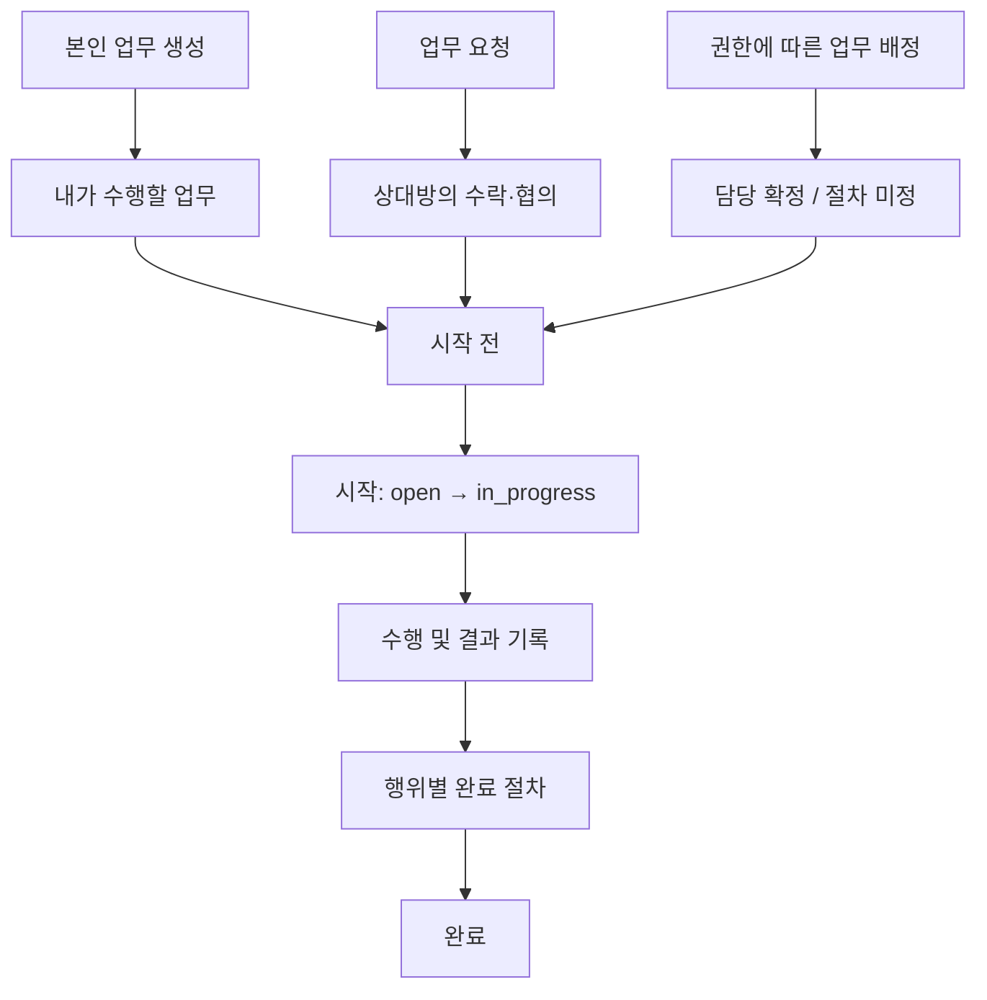
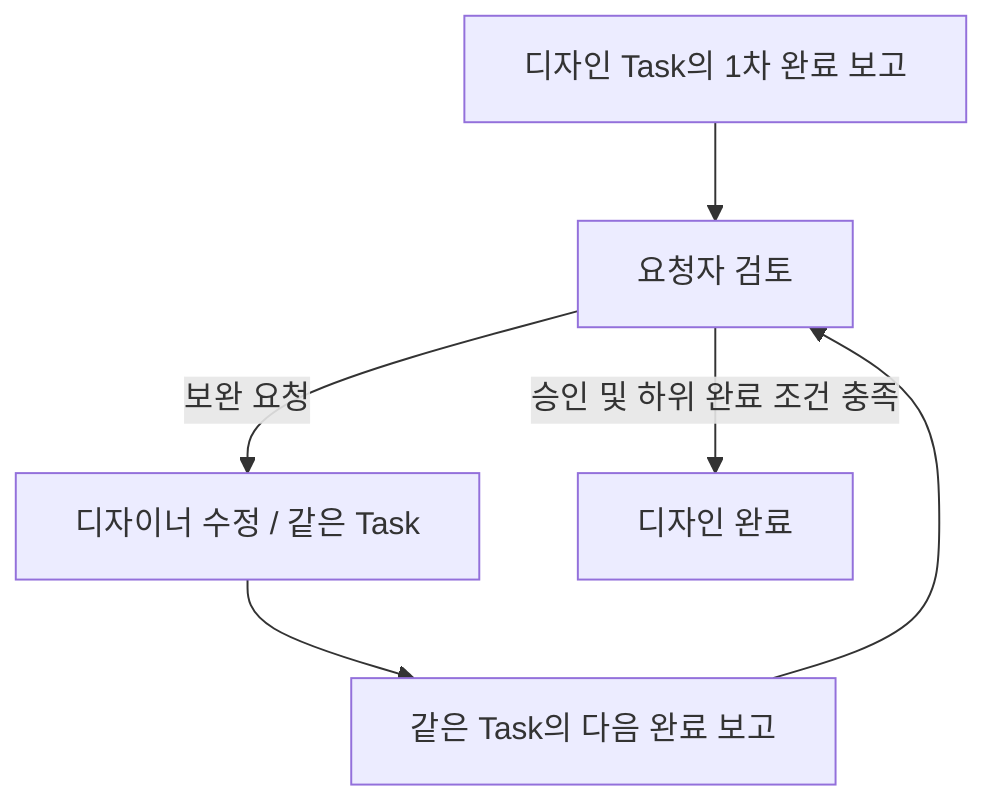

# 업무의 생명주기 v2

이 문서는 [정의_v2.md](정의_v2.md)와 사용자 합의를 바탕으로 업무의 생성부터 완료 확인까지 정리한다. 기존 [lifecycle.md](lifecycle.md)의 단계 구성을 참고하되, 기존 문서의 정책과 DB 처리 방식을 확정 명세로 계승하지 않는다. 세부 사례는 [example.md](example.md)를 참고한다.

본문의 **합의된 방향**과 **미정 사항**을 구분한다. 미정 사항은 구현 규칙이 아니며, 이 문서가 현재 코드에서 모두 지원된다는 뜻도 아니다.

## 1. 공통 흐름과 행위의 구분

### 1.1 공통 생명주기

업무는 수행할 일을 등록하고 담당을 정한 뒤, 시작·수행·결과 확인·완료로 이어진다. 업무를 맡게 되는 과정과 완료 확인 절차는 행위별로 구분한다.



위 그림은 수행으로 이어지는 공통 경로다. 요청의 거절·협의 분기는 3절에서 다룬다. 요청은 발송 시 Task를 생성한다. 수락은 생성과 별도의 사건이다.

### 1.2 요청과 배정의 차이

요청과 배정은 일을 맡기고 수행 결과를 확인한다는 큰 흐름을 공유할 수 있다. 구분하는 기준은 결과 보고의 유무만이 아니라 **상대방이 어떤 근거로 일을 맡는가**다.

| 구분 | 본인 업무 생성 | 업무 요청 | 업무 분배(배정) |
|---|---|---|---|
| 의미 | 내가 수행할 일을 등록 | 상대방에게 수행을 요청 | 배정 권한으로 담당자를 지정 |
| 담당 확정 | 본인이 수행할 일로 등록 | 상대방의 수락·협의를 거침 | 지정 즉시인지 응답 절차가 필요한지 미정 |
| 수락·거절 | 별도 절차의 세부 규칙 미정 | 수락·협의·거절을 구분 | 절차의 유무와 효과 미정 |
| 완료 확인 | 조건과 절차 미정 | 요청자의 완료 확인을 받는 방향 | 확인 주체와 절차 미정 |

배정 업무에도 결과 보고와 완료 확인을 둘 수 있다. 다만 이를 필수로 할지, 배정자가 확인할지는 아직 정하지 않았다. 요청과 배정의 절차가 같아지는 부분은 공통 기능으로 처리할 수 있으며, 행위가 다르다는 이유로 전체 코드나 테이블을 따로 만들 필요는 없다.

### 1.3 요청 관계·업무·담당 기록

기존 테이블의 역할을 구분하고 공통 Task와 담당 기록을 활용하는 방향을 유지한다.

| 테이블 | 기록하는 사실 | 생명주기에서의 역할 |
|---|---|---|
| `work_requests` | 누가 누구에게 무엇을 요청했는가 | 요청 관계와 요청 과정 |
| `tasks` | 어떤 일을 수행하며 상태와 결과가 무엇인가 | 수행 업무 본체 |
| `task_assignments` | 어떤 Task를 누가 맡는가 | 담당 관계와 변경 이력 |

**`task_assignments`는 권한에 의한 업무 배분만을 위한 테이블이 아니다.** 본인 업무와 요청받은 업무의 담당 기록에도 사용한다. 요청 하나에 요청 기록과 담당 기록이 함께 존재하는 것은 서로 다른 사실을 기록하기 때문이다.

요청의 응답 상태, 담당 관계, Task의 수행 상태, 결과에 대한 확인은 구분한다. 수락 사실을 어느 행과 이벤트에 기록할지, 요청 상태와 담당 상태를 어떻게 함께 변경할지는 상세 설계에서 합의한다. 위 역할 구분만으로 특정 컬럼과 상태 전이를 확정하지 않는다.

## 2. 생성과 상위 업무 연결

### 2.1 본인 업무 생성

내가 수행할 일을 Task로 등록한다. 하위 작업 없이 하나의 Task로 관리할 수도 있고, 필요한 일을 하위 Task로 나눌 수도 있다. 생성과 실제 시작은 구분한다.

**미정:** 등록 시 담당 기록의 구체적인 처리, 필수 입력값과 완료 조건. 기존 문서의 글자 수·컬럼·필수값 규칙을 업무 정의로 가져오지 않는다.

### 2.2 업무 요청 발송

요청자는 상대방에게 수행할 일과 기대 결과를 전달한다. 기존 업무를 위한 하위 요청이면 발송 단계부터 그 상위 업무와의 관계를 유지한다.

```text
보고서 작성 — 내가 수행
├─ 디자인 요청 — 디자이너의 응답을 기다림
└─ 보고서 내용 작성 — 내가 수행
```

응답을 기다리는 디자인 요청도 보고서 작성을 위한 일이다. 아직 수락하지 않았다는 이유로 보고서와 무관한 요청이 되지는 않는다.

**합의:** 요청 발송 시 Task를 `open`으로 생성한다. 하위 요청이면 상위 업무에 연결하고 수락 대기로 표시한다.

**미정:** 수락 전 담당 기록의 존재 여부와 상태, 요청·Task·상위 업무를 연결하는 구체적인 저장 방식.

### 2.3 권한에 따른 업무 배정

배정 권한을 가진 사람이 권한 범위 안에서 담당자를 지정한다. 배정의 담당 확정 절차는 요청과 별도로 정한다.

**미정:** 신규 업무 생성과 기존 업무의 담당 지정 각각의 처리, 수락·거절 절차, 하위 업무 배정의 권한 범위. 배정 권한을 확인하는 것과 완료 확인자를 정하는 것은 별개의 문제다.

### 2.4 발송·수락·거절·재요청의 관계

| 단계 | 유지할 업무 의미 | 아직 정하지 않은 저장 처리 |
|---|---|---|
| 디자인 요청 발송 | Task 생성, 보고서에 하위 연결, 수락 대기 | 요청·담당 기록의 상세 연결 |
| 디자인 요청 수락 | 같은 Task와 상위 연결 유지, 담당 확정, 시작 전 open 유지 | 수락·담당 기록의 상세 처리 |
| 디자인 요청 거절 | 요청의 거절 기록과 함께 Task를 cancelled로 전환, 상위 연결 유지 | 거절 사유의 필수 여부 |
| 거절 후 재요청 | 새 Task를 생성하고 같은 상위 업무에 연결, 기존 취소 이력 보존 | 이전 요청과 새 요청을 연결하는 저장 방식 |
| 디자인 수행·완료 확인 | 보고서에서 디자인의 상태와 결과를 확인 | 상태 조회와 결과 연결 방식 |

발송 시 Task를 만들어도 수락을 생략하지 않는다. 거절된 Task는 재사용하지 않고, 재요청은 새 Task로 진행한다. 기존 요청과 Task에는 거절·취소 로그를 남긴다.

요청자는 보기 싫은 기존 취소 항목을 지울 수 있도록 한다. 로그 보존과 함께 충족할 요구이며, 목록에서 숨기는 방식인지 보관 또는 삭제 표시를 사용하는지 등 구체적인 삭제 방식은 미정이다.

## 3. 수락·협의·거절과 담당 확정

### 3.1 업무 요청의 응답

수락은 요청받은 업무의 수행 책임을 받아들이는 행위다. 협의는 기한·범위 등의 조건을 조정하는 과정이며, 거절은 요청을 맡지 않겠다는 응답이다.

```mermaid
flowchart TD
    Q["업무 요청 발송"] --> R{ "상대방의 응답" }
    R -->|수락| A["맡은 업무 / 시작 전 open"]
    R -->|협의| N["기한·범위 등 협의"]
    N --> R
    R -->|거절| X["요청 거절 기록 / Task cancelled"]
    X --> Y["기존 Task와 상위 연결·로그 유지"]
    Y -->|재요청 시| Z["새 Task 생성 / 수락 대기"]
    A --> S["시작: open → in_progress"]
```

**합의:** 거절하면 연결된 Task를 즉시 `cancelled`로 전환한다. 상위 업무에서는 ‘취소됨 — 요청 거절’로 표시한다. 재요청은 새 Task로 만들고 이전 로그는 남긴다.

수락 전 요청 내용은 요청자가 수정한다. 수락 후 범위·기한·완료 기준 변경에는 상대방의 동의가 필요하다. 무응답이면 수락 대기를 유지하며 자동 수락·거절하지 않는다.

**미정:** 동의를 기록하는 상세 방식, 거절 사유의 필수 여부, 취소 항목을 지우는 구체적인 방식.

### 3.2 배정의 담당 확정

배정에서는 권한을 바탕으로 담당자를 지정한다. 지정만으로 책임이 확정되는지, 담당자의 수락이 필요한지, 거절을 허용하는지는 별도로 합의한다.

요청의 응답 기능과 공통 처리를 사용할 수 있지만, 같은 저장 구조를 사용한다는 이유로 배정에도 같은 수락·거절 정책을 적용하지 않는다.

### 3.3 담당자 변경

**새 담당자가 수락할 때 담당을 교체한다.** 수락 대기 중에는 기존 담당과 수행 책임을 유지한다. 새 담당자가 거절하면 기존 담당이 계속 맡으며, 그 거절만으로 업무를 취소하지 않는다.

```mermaid
flowchart TD
    A["기존 담당 A가 업무 수행"] --> B["권한자가 B에게 담당 변경 제안"]
    B --> C["B의 수락 대기 / A의 담당·책임 유지"]
    C --> D{ "B의 응답" }
    D -->|수락| E["같은 Task의 담당을 A에서 B로 교체"]
    D -->|거절| F["A가 계속 담당 / Task 취소 안 함"]
```

담당 변경은 같은 Task의 담당 관계를 바꾸는 행위다. 기존 진행 상태와 결과를 거절 때문에 폐기하지 않는다. 담당 변경의 제안·수락·거절과 실제 교체 이력을 남긴다.

일반 업무 요청을 처음 거절했을 때 Task를 취소하고 새 Task로 재요청하는 규칙과 구분한다. 이 절은 기존 담당이 있는 업무의 교체 규칙이며, 신규 배정이나 담당 없는 업무의 첫 지정 규칙까지 확정하는 것은 아니다.

**미정:** 응답 기한·변경 제안 철회, 수락 대기 중 기존 담당이 업무를 완료하거나 다른 변경이 발생한 경우의 처리, 인수 전 새 담당의 자료 접근 범위.

## 4. 시작과 진행

### 4.1 시작의 의미

수락과 실제 시작은 다르다. **`open → in_progress` 상태 변경 시각이 시작 시각이다.** 요청을 수락하거나 자동 수락됐다는 사실만으로 수행을 시작한 것으로 보지 않는다.

생성·발송·수락·시작은 각각 다른 사건이다. 날짜로 입력한 시작일과 실제 상태 변경 시각도 구분한다.

**미정:** 시작 기록의 저장 방식, 최초 시작과 재개 이력을 조회하는 방식. 기존 문서의 ‘별도 시작 시각 컬럼을 추가하지 않는다’는 저장 방식을 확정 정책으로 계승하지 않는다.

### 4.2 담당자별 중심 업무와 직속 하위 작업

각 담당자 화면에는 자신이 맡은 중심 업무와 직속 하위 작업까지 두 단계만 표시한다. 하위 작업의 개수를 하나로 제한하는 뜻은 아니다. 이 화면 범위만으로 생성 깊이 제한을 정하지 않는다. 수신자는 받은 업무를 다시 분해하거나 다른 사람에게 일부 작업을 요청할 수 있어야 한다.

```text
보고서 작성 — 나
├─ 디자인 작업 — 디자이너
│  ├─ 레퍼런스 조사 — 디자이너
│  ├─ 시안 구성 — 디자이너
│  └─ 시안 수정 — 디자이너
└─ 보고서 내용 작성 — 나
```

하위 작업도 Task다. 디자인은 보고서의 하위 업무이면서 디자이너의 중심 업무다. 디자인 결과에 대한 검토는 디자인의 완료 보고 절차에서 처리하며, 별도 하위 검토 Task를 만들지 않는다.

직접 수행할 작업은 중심 업무 바로 아래에 둔다. 같은 담당자가 그 직접 작업 아래에 다시 직접 작업을 중첩하지 않는다. 다른 사람이 요청을 수락한 업무는 그 사람의 새 중심 업무가 되어 직속 하위 작업과 요청을 가질 수 있다. 이는 화면의 두 단계 표시와 별도로 합의한 생성 규칙이다.

### 4.3 진행 상태와 결과의 확인

요청자는 기본적으로 요청한 하위 업무의 상태와 결과를 본다. 보고서 화면에 디자이너의 세부 작업을 전부 펼치지 않으며, 필요하면 디자인 업무로 들어가 세부 작업을 확인한다.

요청자는 요청한 업무와 그 하위 작업·연결 자료를 조회할 수 있다. 수행자의 다른 업무나 해당 업무에 연결하지 않은 자료까지 공개하지 않는다. 화면에서는 중심 업무와 직속 하위 작업까지만 표시하고, 더 깊은 작업은 해당 업무로 들어가 확인한다.

본인 업무의 내용은 담당자가 수정한다. 요청 업무의 범위·기한·완료 기준은 수락 전에는 요청자가 수정하고, 수락 후에는 상대방의 동의를 받아 변경한다. 진행 상태와 수행 결과는 담당자가 기록하고 요청자는 조회·완료 확인한다.

배정 업무의 수정 권한은 배정 정책에서 별도로 정한다. 상태 표시·진행 집계와 동의 기록의 상세 방식은 구현 시 구체화한다.

### 4.4 체크리스트와 하위 Task

체크리스트는 완료 기준이고, 하위 Task는 이를 충족하기 위해 수행할 일이다.

```text
보고서 작성

체크리스트 — 완료 기준
□ 필요한 내용이 포함되어 있다
□ 디자인이 최종 내용에 맞게 반영되어 있다

하위 Task — 수행할 일
├─ 보고서 내용 작성
└─ 디자인 작업
```

**합의:** 미완료 하위 Task가 있으면 상위 업무를 완료할 수 없다.

취소된 하위 Task는 로그를 보존하고 상위 완료 검사에서 제외한다.

**미정:** 모든 체크를 완료의 필수 조건으로 강제할지, 체크 권한. 체크리스트 자체의 완료 차단 규칙은 별도로 정한다.

## 5. 결과 제출·확인·완료

### 5.1 요청받은 업무의 완료

요청받은 업무는 수행 결과를 보고하고 요청자의 완료 확인을 받는 방향이다. 결과 제출과 완료 확인은 구분한다.

```mermaid
flowchart TD
    A["디자인 수행"] --> B["디자이너의 결과 제출·완료 보고"]
    B --> C{ "요청자 확인" }
    C -->|승인 및 하위 완료 조건 충족| D["디자인 완료 확인"]
    C -->|보완| E["디자이너 보완"]
    E --> B
    D --> F["보고서에서 디자인의 상태와 결과 확인"]
```

**미정:** 필수 결과 자료, 제출·확인 단계의 정확한 상태값, 보완 시 상태와 회차 관리, 확인 기한·대리 확인·권한 위임.

### 5.2 본인 업무와 배정 업무의 완료

본인 업무와 배정 업무의 완료 조건과 확인 절차는 각각 정한다. 배정 업무에도 결과 보고와 완료 확인을 둘 수 있으며, 배정이라는 이유로 결과가 없어도 된다는 뜻은 아니다.

**미정:** 본인 업무의 직접 완료 조건, 배정 업무의 완료 확인 필요 여부와 확인자. ‘요청은 승인 필요, 배정은 승인 불필요’를 확정 정책으로 기록하지 않는다.

### 5.3 같은 업무의 완료 보고·보완 회차

디자이너가 작업을 마치고 완료 보고하면 디자인 요청자인 내가 결과를 검토한다. 이를 위한 별도 검토 요청·Task는 만들지 않는다. 내가 검토한 결과를 디자이너가 다시 승인하는 절차도 없다.



요청 수락 전 거절에 따른 재요청은 새 Task로 처리한다. 수락 후 완료 보고에 대한 보완은 같은 Task에서 수정·재보고한다.

**미정:** 제출 회차와 결과 버전의 상세 기록, 보완 작업을 별도 하위 Task로 만들 기준, 작업 도중 별도로 의견을 구하는 중간 검토의 방식.

### 5.4 상위 업무의 완료

**하위 Task가 미완료면 상위 업무를 완료할 수 없다.** 디자인이 수락 대기·수행 중이거나 완료 보고 후 승인을 기다린다면 보고서를 완료할 수 없다. 요청한 하위 업무는 요청자가 승인해야 완료된 것으로 본다.

```mermaid
flowchart TD
    A["상위 업무 완료 시도"] --> X["취소된 하위 Task 제외 / 로그 보존"]
    X --> B{ "나머지에 미완료 하위 Task가 있는가" }
    B -->|있음| C["상위 완료 불가"]
    B -->|없음| D["상위 자체의 완료 기준과 확인 절차 적용"]
```

이 규칙은 담당자의 화면에 보이는 깊이와 별개다. 하위 업무가 각각 자신의 하위 업무 완료 조건을 충족해야 한다.

**합의:** 취소된 하위 Task는 이력을 남기고 상위 완료 검사에서 제외한다. 거절로 취소된 디자인 A는 보고서 완료를 막지 않는다. 새로 요청한 디자인 B를 포함한 나머지 하위 Task의 완료 여부를 확인한다.

하위 Task나 체크리스트가 끝나도 업무를 자동 완료하지 않는다. 사용자가 직접 완료 처리하며, 요청받은 업무는 담당자의 완료 보고 후 요청자가 승인해야 완료된다. 취소를 제외한 미완료 하위 Task가 있으면 최종 완료는 막는다.

**미정:** 상위의 완료 보고 제출부터 차단할지 최종 완료 때 검사할지. 상위의 최종 완료를 막는 규칙은 확정이며, 그 전에 결과를 제출할 수 있는지는 별도로 정한다.

## 6. 막힘·철회·취소·재개

### 6.1 요청 예외의 기본값

| 사건 | 기본 처리 |
|---|---|
| 수락 전 요청 철회 | 요청자가 철회하면 Task를 cancelled로 전환하고 로그 보존 |
| 수락 후 취소 제안 | 요청자가 취소를 제안하고 담당자가 동의하면 취소. 응답 전에는 기존 상태 유지 |
| 무응답 | 수락 대기 유지. 자동 수락·거절 없음 |
| 수행·확인 기한 초과 | 지연 표시만 하고 기존 상태 유지. 자동 취소·완료 없음 |
| 본인 업무 완료 후 재개 | 담당자가 직접 재개. 이전 완료 이력 보존 |
| 요청 업무 완료 후 재개 | 요청자가 재개하고 담당자에게 알림. 이전 완료 이력 보존 |

```mermaid
flowchart TD
    A["요청 철회 또는 취소"] --> B{ "수락 여부" }
    B -->|수락 전| C["요청자 철회 / Task 취소·로그 보존"]
    B -->|수락 후| D["요청자가 취소 제안"]
    D --> E["담당자 응답 대기 / 기존 상태 유지"]
    E -->|동의| F["Task 취소 / 로그 보존"]
    E -->|동의하지 않음| G["기존 업무 유지"]
```

기한 초과 자체는 승인이나 취소를 뜻하지 않는다. 취소된 Task는 상위 완료 검사에서 제외한다. 요청의 최초 거절, 요청자 철회, 수락 후 합의 취소는 각각의 사건으로 기록한다.

### 6.2 완료 후 재개와 상위 관계

완료한 하위 Task를 재개하려는데 상위도 완료되어 있다면, 상위를 먼저 재개하도록 제한한다. 상위 역시 완료된 업무의 하위라면 같은 규칙을 적용한다. 각 업무는 본인 업무·요청 업무의 재개 권한을 따른다.

```mermaid
flowchart TD
    A["완료한 업무 재개 시도"] --> B{ "완료된 상위 업무가 있는가" }
    B -->|있음| C["하위 재개 차단 / 상위를 먼저 재개"]
    B -->|없음| D{ "업무 종류" }
    D -->|본인 업무| E["담당자가 직접 재개"]
    D -->|요청 업무| F["요청자가 재개 / 담당자에게 알림"]
    E --> G["이전 완료 이력 보존"]
    F --> G
```

배정 업무의 수정·취소·재개 권한은 배정 정책에서 별도로 정한다. 막힘의 사유 입력·전이와 막힘에서의 재개, 상위 취소 시 하위에 미치는 영향은 아직 미정이다. 응답과 철회·취소가 동시에 발생하는 경우는 합의한 상태와 권한이 어긋나지 않도록 구현에서 검증한다.

## 7. 유입 경로와 자동 수락

메일·메신저·회의·AI 채팅·스케줄은 업무 내용이나 생성 명령이 들어오는 경로다. 본인 업무 생성·요청·배정 중 어떤 행위인지와 별도로 구분한다.

**메일·스케줄 등의 자동 수락 여부는 추후 각 트리거 설정에서 정한다.** 자동 수락은 실제 시작이나 결과의 완료 승인을 뜻하지 않는다.

**미정:** 자동 생성의 행위 구분, 설정 권한, 적용한 규칙의 기록 방식과 중복 생성 방지. 모든 자동 생성을 시스템의 업무 요청으로 간주하지 않는다.

## 8. 보고서·디자인 사례의 단계별 연결

| 단계 | 업무상 사건 | 유지할 관계·역할 | 미정 사항 |
|---|---|---|---|
| 1 | 내가 보고서 작성을 등록 | 내가 수행할 중심 업무 | 생성 입력과 담당 기록 처리 |
| 2 | 디자인 요청 발송 | 디자인 Task 생성, 보고서의 하위 연결, 수락 대기 | 요청·담당 기록의 상세 연결 |
| 3-A | 디자이너 수락 | 같은 Task와 상위 연결 유지, 담당 확정, 시작 전 유지 | 수락 기록의 상세 처리 |
| 3-B | 디자이너 거절 | 요청 거절 기록, Task cancelled, 상위 연결 유지 | 로그를 보존하는 삭제 방식 |
| 3-C | 거절 후 재요청 | 새 Task를 같은 상위에 연결하고 이전 로그 보존 | 요청 간 이력 연결 방식 |
| 4 | 디자이너 시작 | open → in_progress 변경 시각이 시작 | 기록의 상세 저장 방식 |
| 5 | 조사·시안 작업 생성 | 디자인을 위한 직속 하위 Task | 생성 규칙의 구현 검증 |
| 6 | 디자이너 디자인 완료 보고 | 별도 검토 Task 없이 요청자인 내가 결과 확인 | 제출의 세부 상태·기록 |
| 7 | 내가 보완 요청, 디자이너 수정·재보고 | 같은 디자인 Task의 다음 보고 회차 | 보완의 상태와 회차 기록 |
| 8 | 내가 승인 | 디자인 완료, 내 검토 결과의 역승인 없음 | 확인 권한의 위임 |
| 9 | 보고서에서 디자인 상태·결과 확인 | 미완료 하위 Task가 있으면 보고서 완료 불가 | 취소 항목을 제외한 그 밖의 완료 기준 |

Task는 발송 시 생성하는 것으로 결정했다. 실제 행과 FK는 이 표의 각 단계를 따라 구체화한다. example.md에도 같은 발송·거절·재요청 및 완료 보고 흐름을 반영한다.
