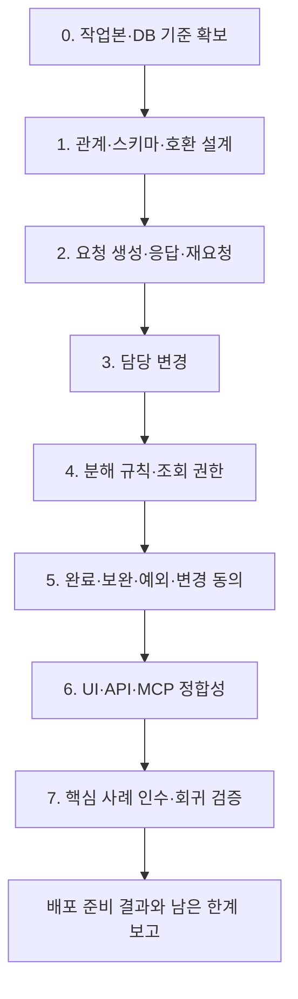

# 업무 구조·생명주기 v2 구현 작업계획서

작성일: 2026-09-17

## 1. 목표와 기준 문서

보고서 아래 디자인을 요청하고, 디자이너가 수락하여 세부 작업을 수행한 뒤 완료 보고·보완·승인을 거쳐 끝내는 흐름을 구현한다. 다른 사람에게 요청해도 상하위 관계가 유지되어야 하며, 각 담당자의 화면에는 중심 업무와 직속 하위 작업만 표시한다.

기준은 [정의_v2.md](정의_v2.md), [생명주기_v2.md](생명주기_v2.md), [example.md](example.md)의 최신 합의다. 기존 `definition.md`, `lifecycle.md`는 참고 기록이며 구현 명세로 사용하지 않는다.

이 문서는 구현 계획이다. 코드·DB 변경이나 배포 완료를 의미하지 않는다. 아래 저장 구조와 구현 순서는 합의를 실현하기 위한 기술적 제안이며, 업무 정책과 구분한다.

## 2. 구현할 확정 정책

| 구분 | 구현 기준 |
|---|---|
| 요청 생성 | 발송 시 요청과 Task 생성. 하위 요청이면 상위 Task와 연결 |
| 수락 | 같은 Task의 담당 확정. 시작 전 open 유지 |
| 거절 | 요청 거절 기록, Task cancelled, 상위 연결·로그 보존 |
| 재요청 | 새 요청·새 Task 생성. 거절된 Task 재사용 안 함 |
| 시작 | open → in_progress 변경 시각이 시작 시각 |
| 담당 변경 | 기존 담당 유지 → 새 담당 수락 시 교체. 거절하면 기존 담당 유지, Task 취소 안 함 |
| 작업 구성 | 직접 작업은 중심 업무 직속으로 생성. 다른 사람이 수락한 요청 업무는 새 중심 업무로 분해 가능 |
| 화면 | 중심 업무와 직속 하위 작업 두 단계. 하위 개수 제한이 아님 |
| 결과 확인 | 별도 검토 Task 없이 완료 보고를 요청자가 검토. 보완은 같은 Task에서 수정·재보고 |
| 최종 완료 | 사용자가 직접 완료하거나 요청자가 승인. 자동 완료 없음 |
| 상위 완료 조건 | 취소되지 않은 미완료 하위 Task가 있으면 완료 불가. 취소된 Task는 로그를 보존하고 검사에서 제외 |
| 철회·취소 | 수락 전 요청자 철회로 취소. 수락 후 요청자가 제안하고 담당자 동의 시 취소, 응답 전 기존 상태 유지 |
| 무응답·지연 | 무응답은 대기 유지. 기한 초과는 지연 표시만 하고 자동 수락·거절·취소·완료하지 않음 |
| 재개 | 본인 업무는 담당자, 요청 업무는 요청자가 재개. 요청 업무의 담당자에게 알림, 완료 이력 보존 |
| 재개 순서 | 완료된 상위가 있으면 상위를 먼저 재개한 뒤 하위를 재개 |
| 내용 변경 | 본인 업무는 담당자가 수정. 요청의 범위·기한·완료 기준은 수락 전 요청자 수정, 수락 후 상대방 동의로 변경 |
| 진행·결과 | 담당자가 기록하고 요청자는 조회·완료 확인 |
| 자료 접근 | 요청자는 요청 업무와 그 하위 작업·연결 자료 조회 가능. 수행자의 다른 업무·미연결 자료는 공개하지 않음 |

요청 관계는 `work_requests`, 수행 업무는 `tasks`, 담당 관계는 `task_assignments`의 역할을 활용한다. 요청과 권한 배정을 구분하되 공통 데이터와 기능은 공유한다.

## 3. 현재 작업본과의 차이

이번 대화에서 확인한 작업본을 기준으로 한 출발점이다. HEAD가 같아도 미커밋 변경이 계속되고 있으므로 착수 시 다시 확인한다. 실제 PostgreSQL 스키마는 확인하지 못했으며, ORM과 실행 DB가 같다고 전제하지 않는다.

| 현재 확인한 구현 | 필요한 변경 | 주요 위치 |
|---|---|---|
| 일반 요청 발송 즉시 Task와 active 담당 생성 | 발송 시 Task는 유지하되 응답 대기와 수락·협의·거절 복원 | `modules/work/requests.py`, `creation_commands.py`, `platform/work_tasks.py` |
| 일반 요청에 상위 연결 없음, 타인 생성의 parent 입력 거부 | 일반 요청의 상위 입력·검증·저장·조회 지원 | `creation_commands.py`, 요청 입력 모델, HTTP/MCP |
| 담당자 구분 없이 하위 깊이 한 단계 제한 | 중심 업무와 수신자 재분해 규칙으로 교체 | `modules/work/application.py:parent_for` |
| 부모가 있는 Task의 children을 비워 반환 | 어느 중심 업무에서도 직속 하위 조회 | `application.py:_hierarchy_view`, `_related_view` |
| 화면도 부모가 있는 업무의 하위 영역 숨김 | 생성 권한과 조회 깊이를 분리하여 표시 | `frontend/src/features/work/WorkModals.tsx` |
| 재배정 시 기존 담당 즉시 종료, 새 담당 거절 시 Task 취소 | 수락 시에만 담당 교체, 거절 시 기존 담당 유지 | `assignments.py`, `platform/work_tasks.py` |
| 요청자의 읽기 권한이 하위 세부 작업 전체로 이어지지 않음 | 요청 관계에 따른 하위·연결 자료 읽기 권한 구현 | `application.py`, 자료·검색 권한 경로 |
| 완료 보고·승인·보완 기능 존재 | 기존 기능 재사용, 재귀 관계·재개·권한에 맞춰 보완 | `application.py`, `lifecycle.py`, `action_center.py` |
| 취소 제외 미완료 자식 차단과 수동 완료 기능 존재 | 새 요청·다단계 관계에서도 일관되게 검증 | `open_children_of`, 완료·승인 경로 |

이전 선택 계약 테스트 47개 통과는 현 구현의 회귀 기준이다. 새 정책의 인수 기준을 통과한 결과로 사용하지 않는다.

## 4. 구현 단계

### 4.1 단계 0 — 작업본과 실행 DB 기준 확보

- `git status`, HEAD, 관련 수정·미추적 파일을 확인한다. 진행 중인 다른 작업을 덮어쓰지 않는다.
- 생성·응답·담당 변경·완료의 HTTP/MCP/AI·회의 경로를 연결해 호출 목록을 만든다.
- 실행 DB 연결이 가능하면 읽기 전용으로 컬럼·FK·인덱스를 확인하고 ORM과 비교한다. 연결 불가 시 결과에 명시한다.
- 테스트용 격리 DB를 준비하고 관련 계약 테스트를 Makefile로 실행하여 변경 전 결과를 기록한다.

**완료 기준:** 수정 대상, 기존 변경과의 경계, 실제 DB 확인 여부, 변경 전 실패 목록이 기록되어 있다.

### 4.2 단계 1 — 관계와 저장 구조 구체화

기존 세 테이블을 유지하는 것을 출발점으로 다음을 설계한다.

| 대상 | 구현할 사항 |
|---|---|
| 요청과 Task | 발송 트랜잭션에서 요청·Task·상위 연결을 함께 생성. 수락 시 추가 Task 생성 경로 제거 또는 기존 요청 전용으로 분리 |
| 대기 담당 | 요청 수신자와 활성 담당을 구분. 대기 중 시작·결과 수정 권한을 주지 않는 구조 결정 |
| 중심 업무 | 단순히 parent가 없다는 조건으로 판정하지 않음. 요청 수락으로 중심 업무가 된 경위를 기준으로 생성 규칙 검증 |
| 재요청 | 새 요청·Task에서 이전 요청 이력을 추적하는 연결을 설계 |
| 담당 변경 | 기존 active와 새 pending을 함께 표현. 활성 담당 최대 한 명 제약 유지 |
| 변경·취소 제안 | 제안 내용·제안자·상대방 응답·결정 시각을 기록. 동의 전 원래 조건과 상태 유지 |
| 완료·재개 | 기존 제출 회차·검토 결정·활동 이력 활용. 재개로 이전 완료 기록을 덮어쓰지 않음 |
| 취소 항목 정리 | 로그를 보존하면서 요청자 목록에서 항목을 제거할 기술적 방식 마련. 물리 삭제로 연결·이력 손실을 만들지 않음 |

`active_assignment_for()`처럼 active와 pending 중 한 행을 반환하는 기존 조회는 현재 담당 조회와 대기 제안 조회로 역할을 분리한다. 같은 Task에 기존 active와 새 pending이 존재할 수 있는 새 규칙에 맞춰 목록·권한·알림도 수정한다.

새 테이블·컬럼·인덱스가 필요한 항목만 추가하고, 실제 스키마 변경 절차와 기존 데이터 호환 처리를 함께 작성한다. `schema_sync.py`가 필요한 인덱스 변경까지 수행하는지 별도로 확인한다.

**완료 기준:** 발송·수락·거절·재요청·담당 교체의 행과 FK, 상태 변경, 트랜잭션 경계가 설명되고 격리 DB에 적용된다.

### 4.3 단계 2 — 요청 생성·응답·재요청 구현

- 발송 시 `open` Task와 요청 대기를 생성하고 상위 Task 연결을 유지한다.
- 수락은 기존 Task를 활성 담당에게 연결한다. 수락만으로 시작시키지 않는다.
- 협의와 조건 변경 경로를 새 생성 방식에 연결한다.
- 거절은 요청 거절 기록과 Task 취소를 함께 반영한다.
- 재요청은 새 ID를 사용한다. 통신 재시도로 같은 발송이 반복되는 경우와 구분한다.
- 요청 상태·담당 상태·수행 상태가 섞이지 않도록 응답과 수신함을 수정한다.
- HTTP·MCP·AI 생성·회의 후속 업무 등 일반 요청을 만드는 모든 경로에 같은 규칙을 적용한다. 유입 경로만으로 자동 수락하지 않는다.

**완료 기준:** 보고서 아래 발송한 디자인이 같은 Task로 수락·시작되고, 거절·재요청 시 기존 취소 이력과 새 Task를 구분할 수 있다.

### 4.4 단계 3 — 담당 변경의 책임 공백 제거

- 담당 변경 제안 시 기존 담당은 active로 유지하고 새 담당의 응답을 기다린다.
- 수락 시 기존 담당 종료와 새 담당 활성화를 하나의 트랜잭션으로 처리한다.
- 거절 시 대기 제안만 종료하고 Task와 기존 담당은 유지한다.
- 기존 담당의 수행 권한·내 업무 목록이 응답 대기 중 사라지지 않도록 한다.
- 중복 수락·거절, 동시에 들어온 담당 변경은 버전·잠금·DB 제약으로 검증한다.
- 담당 없는 업무에 처음 담당을 붙이는 경로와 기존 담당 교체를 분리한다.

**완료 기준:** A 수행 중 B로 변경을 제안해도 A가 계속 수행 가능하며, B의 응답 전후로 활성 담당이 둘이 되거나 거절로 Task가 취소되지 않는다.

### 4.5 단계 4 — 작업 분해와 접근 권한

- 전체 한 단계 제한을 제거하고 합의한 중심 업무별 직접 작업 생성 규칙으로 교체한다.
- 다른 사람이 수락한 하위 요청에서도 직접 작업·하위 요청 생성이 가능하도록 한다.
- 저장 깊이와 관계없이 상세 API는 해당 Task의 직속 하위만 반환한다.
- 순환 관계·자기 자신 연결을 막고 상위 관계 변경과 담당 변경의 영향도 검사한다.
- 요청자가 요청 업무의 하위 작업과 연결 자료를 조회할 수 있도록 한다.
- Task 상세만 아니라 파일 다운로드·자료 본문·검색·미리보기 경로에서도 같은 권한을 적용한다.
- 조회 권한과 수정·시작·완료·배정 권한을 분리한다.

**완료 기준:** 보고서 → 디자인 → 일러스트처럼 담당자가 바뀌는 관계를 저장·관리할 수 있고, 각 화면에는 중심 업무와 직속 하위만 나온다. 미연결 자료와 무관한 업무는 조회할 수 없다.

### 4.6 단계 5 — 완료·보완·예외와 조건 변경

- 기존 완료 보고·승인·보완 기능을 사용하고 별도 검토 Task는 생성하지 않는다.
- 보완·재보고는 같은 Task의 제출 회차로 남긴다.
- 최종 완료·승인에서 취소를 제외한 미완료 하위 Task를 검사한다. 하위 완료로 상위를 자동 완료하지 않는다.
- 수락 전 철회는 Task 취소, 수락 후 취소는 담당자 동의 후 반영한다.
- 무응답·지연은 상태 자동 전이 없이 표시한다.
- 본인 업무·요청 업무의 재개 권한과 담당자 알림을 구현하고 완료된 상위가 있으면 하위 재개를 차단한다.
- 범위·기한·완료 기준의 수정 권한과 수락 후 동의 절차를 구현한다.
- 진행·결과 작성자는 담당자, 요청자는 조회·완료 확인자로 유지한다.

**완료 기준:** 하나의 디자인 Task에서 보고 → 보완 → 재보고 → 승인 가능하며, 보고서 완료 차단과 취소 제외가 적용된다. 요청자는 별도 검토 Task를 수락하거나 자신의 검토 결과를 역승인받지 않는다.

### 4.7 단계 6 — 화면·API·도구 정합성

- 본인 생성·업무 요청·권한 배정을 사용 목적과 권한에 맞게 구분한다.
- 하위 영역에서 직접 작업 추가와 다른 사람에게 요청을 제공한다.
- 수락 대기, 담당 변경 대기, 거절로 취소, 완료 확인 대기를 구분해 표시한다.
- 중심 업무와 직속 하위만 표시하고, 상세 이동으로 다음 중심 업무를 연다.
- 완료 보고·보완·승인 회차와 취소·재요청·담당 변경 이력을 표시한다.
- 취소된 항목을 요청자 목록에서 정리해도 기존 로그가 남도록 한다.
- API/MCP 입력·출력과 프론트 타입·라벨·권한별 버튼을 함께 갱신한다.
- 시그니처 변경 시 operation inventory의 실제 스키마와 차이 난 항목만 패치한다.

**완료 기준:** UI와 MCP에서 같은 행위를 수행했을 때 같은 관계·상태·권한 결과를 얻는다.

### 4.8 단계 7 — 핵심 사례 인수 검증과 문서 정리

5절의 전체 흐름을 UI와 API 양쪽에서 확인한다. 실제 행·연결·활동 이력을 증거로 기록하고, 합의한 정책과 실제 구현의 차이가 남으면 완료로 표시하지 않는다. 기존 오류 문서는 새 문서로 대체되었음을 안내하여 구현 기준이 섞이지 않도록 한다.

## 5. 핵심 인수 시나리오

| 번호 | 시나리오 | 기대 결과 |
|---|---|---|
| A1 | 내가 보고서와 내용 작성 하위 Task 생성 | 올바른 담당·상위 관계, 생성과 시작 구분 |
| A2 | 보고서에서 디자인 요청 발송 | Task 즉시 생성, 보고서 아래 수락 대기, 수신자는 아직 활성 담당 아님 |
| A3 | 디자이너 수락 후 시작 | 같은 Task ID 유지, 수락과 시작 시각 구분 |
| A4 | 디자이너가 조사·시안 및 다른 사람에게 일러스트 요청 생성 | 담당자별 중심 업무 분해 가능, 일반 직접 작업의 무제한 중첩 차단 |
| A5 | 요청자가 디자인 상세와 연결 자료 조회 | 하위 작업·연결 자료 허용, 무관한 자료 거부 |
| A6 | 디자인 완료 보고 후 보완·재보고 | 같은 디자인 Task와 제출 회차 사용, 별도 검토 Task 없음 |
| A7 | 디자인에 미완료 하위가 있는데 최종 완료 시도 | 완료 차단, 자동 완료 없음 |
| A8 | 디자인 승인 전 보고서 완료 시도 | 보고서 완료 차단 |
| A9 | 취소 제외 모든 하위 완료 후 사용자가 보고서 완료 | 직접 완료 처리 성공, 자동 완료는 발생하지 않음 |
| B1 | 디자인 요청 거절 후 다른 사람에게 재요청 | 기존 Task cancelled·로그 유지, 새 요청·Task 생성 |
| B2 | 취소된 디자인 A와 완료된 디자인 B 존재 | A는 보고서 완료를 막지 않음 |
| B3 | A에서 B로 담당 변경 제안 후 거절 | A 책임 유지, Task 취소 안 됨 |
| B4 | 담당 변경 제안 후 수락 | 같은 Task에서 담당 교체, 활성 담당 최대 한 명 |
| B5 | 요청자가 수락 전에 철회 | Task 취소·로그 유지 |
| B6 | 수락 후 취소 제안, 담당자 응답 전과 동의 후 확인 | 동의 전 기존 상태, 동의 후 취소 |
| B7 | 요청 무응답 또는 수행·확인 기한 초과 | 대기·진행 상태 유지, 지연 표시만 변경 |
| B8 | 완료된 상위 아래 하위 재개 시도 | 상위 재개 전 차단, 권한자가 상위 재개 후 하위 재개 |
| B9 | 수락 후 요청 조건 변경 | 상대방 동의 전 기존 조건, 동의 후 변경 |
| B10 | 취소 항목을 요청자 목록에서 정리 | 목록 정리 후에도 거절·취소·재요청 로그 유지 |
| C1 | 발송·수락·승인 명령 재시도 | Task·담당·제출·결정 중복 생성 없음 |
| C2 | 수락과 철회, 담당 교체와 거절, 상위 완료와 하위 재개의 동시 실행 | 모순된 상태·책임 공백·잘못된 상위 완료 없음 |

## 6. 테스트와 검증 명령

백엔드는 반드시 Makefile 타겟을 사용한다. pytest를 직접 실행하지 않는다.

| 검증 단계 | 실행 방법 | 목적 |
|---|---|---|
| 도메인·구조 변경 | `make test-unit` | 상태·권한·중심 업무 판정과 아키텍처 검증 |
| API·MCP·요청·배정·완료 변경 | `make test-contract` | 외부 계약과 핵심 시나리오 검증 |
| 화면 변경 | `make frontend-test` | 표시·동작·권한별 UI 회귀 검증 |
| DB·동시성 | `POSTGRES_TEST_URL=… make test-postgres` | 실제 PostgreSQL의 FK·유일성·잠금·경합 검증 |
| 전체 통합 | `make verify` | 백엔드·규모·릴리즈·프론트 테스트와 빌드 |
| 사용자 경로 | 관련 `make e2e-*` 타겟 및 새 통합 시나리오 | 보고서→디자인→완료 확인을 실제 화면에서 검증 |

초기에는 `PYTEST_ADDOPTS`로 관련 계약을 선택하더라도 실행은 `make test-contract`를 통해 한다. 의미 있는 회귀 테스트를 추가하고, 단순 문구 변경만 검증하는 테스트를 늘리지 않는다.

HTTP/MCP 변경 시 `tests/architecture/test_operation_inventory.py`와 `docs/unified-operations-inventory.json`의 차이를 실제 스키마와 비교한다. inventory 전체를 재작성하지 않는다.

실제 PostgreSQL 테스트를 실행하지 못했다면 SQLite 계약 테스트로 대신 검증했다고 표현하지 않는다. 브라우저 확인 전에는 실제 화면 경로가 검증되었다고 표현하지 않는다.

## 7. 기존 데이터와 배포 준비

- 현재 발송 즉시 active가 된 요청과 과거 수락을 거쳐 생성된 업무를 구분한다. 기존 active를 일괄 pending으로 되돌리거나 수락 사실을 만들어내지 않는다.
- 요청 하나에서 Task를 중복 생성하지 않도록 기존 링크와 유일 제약을 유지한다.
- 기존에 상위 연결이 없는 요청은 제목이나 참고 링크만으로 부모를 추정해 채우지 않는다.
- 기존 거절로 취소된 재배정 업무를 임의로 복원하지 않는다. 확인 가능한 이력과 복구 대상 목록을 먼저 만든다.
- 새 구조에 맞지 않는 레코드를 점검하는 읽기 전용 검사와 필요한 변환 스크립트를 준비한다.
- 스키마 추가·데이터 변환·앱 전환 순서, 실패 시 되돌릴 절차를 문서화하고 격리 DB에서 검증한다.
- 운영·공유 DB 초기화를 마이그레이션 대안으로 사용하지 않는다. 코드 롤백만으로 데이터까지 복구된다고 가정하지 않는다.

**배포 준비 완료 기준:** 스키마와 인덱스 확인, 변환 대상·결과 검증, 기존 요청 처리 호환, 실제 DB 경합 테스트, 핵심 UI 인수 시나리오가 확인되어 있다.

## 8. 남은 사항의 처리 원칙

합의된 핵심 흐름부터 구현하며 아래 항목 때문에 전체 작업을 멈추지 않는다. 업무 정책과 기술적 선택을 구분한다.

| 구분 | 처리 |
|---|---|
| FK·인덱스·대기 담당·제출 회차 저장 | 구현자가 기술 설계를 구체화하고 코드·테스트로 검증 |
| 취소 항목 삭제 방식 | 로그 보존과 요청자 목록 정리를 충족하는 구체안을 마련. 전역 삭제나 상대방 자료 삭제로 확대하지 않음 |
| 신규 배정·담당 없는 업무의 첫 지정 및 배정의 수정·취소·재개 | 요청 정책으로 덮어쓰지 않음. 현재 동작을 회귀 검증하며, 바꿀 정책은 별도 합의 대상으로 명시 |
| 체크리스트 전체 체크 강제·결과 필수 입력 | 이번 합의만으로 새 강제 조건을 추가하지 않음. 기존 검증과 목표 정책의 차이를 명시 |
| 상위 완료 보고 제출 시점 | 최종 완료의 하위 검사부터 보장. 제출 단계에도 새 차단을 추가하려면 별도 정책으로 구분 |
| 중간 의견 요청 | 완료 보고를 위한 별도 검토 Task를 만들지 않음. 독립적인 중간 의견 기능은 별도 범위 |
| 막힘·공동 담당·복수 부모·상위 취소 전파 | 기존 동작과 영향 범위를 확인하고 이번 계획에서 미확정 정책을 임의 확대하지 않음 |
| 메일·스케줄 자동 수락 | 추후 트리거 설정 범위. 일반 요청에 일괄 자동 수락을 적용하지 않음 |

## 9. 실행 순서와 완료 보고

각 단계 완료 시 변경 파일·행동 변화·검증 결과를 기록한다. 최종 보고에는 핵심 인수 시나리오의 통과 여부, 실행한 테스트, 실제 DB 확인 여부, 기존 데이터 처리 결과, 별도 범위로 남긴 정책을 포함한다. 계획서 작성이나 테스트 일부 통과만으로 구현 완료를 선언하지 않는다.
