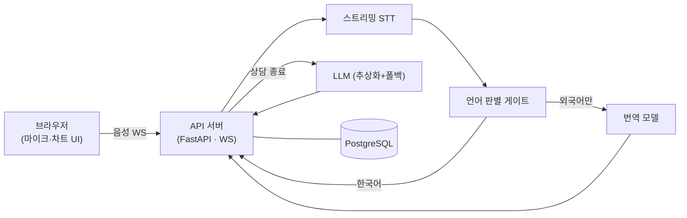

# 개요

Charty 는 의료 상담 음성을 그 자리에서 텍스트로 바꾸고, AI 가 곧바로 구조화된 진료 차트로 만들어 주는 웹 서비스다. 상담하면서 차트를 쓰면 대화에 집중할 수 없고, 끝난 뒤 기억으로 되짚어 쓰면 빠지거나 틀리는 항목이 생긴다. 이 둘 사이의 손실을 없애는 것이 출발점이었다.

브라우저에서 상담을 시작하면 음성이 실시간으로 전사되고, 도메인 용어 보정을 거쳐 화면에 쌓인다. 상담이 끝나면 전사문 전체가 LLM 에 들어가 요약·고객 프로필·시술 상세·가격 안내로 나뉜 차트가 된다. 결과물이 "텍스트 덩어리"가 아니라 그 업종의 차트 양식이라는 점이 범용 받아쓰기 도구와 갈리는 지점이었다. 여기에 외국인 환자를 위한 통역 모드와 구독·크레딧 과금까지 얹혀 상용 서비스 형태를 갖췄다.

# 주요기능

## 상담을 진행한다

| 구분 | 내용 |
|---|---|
| **기능** | 브라우저에서 바로 녹음을 켜고 상담을 진행·추적한다 |
| **목적** | 상담하면서 차트를 못 쓰고, 끝나면 기억이 새는 문제를 없앤다 |
| **효과** | 상담자는 대화에만 집중하고 기록은 시스템이 따라온다 |

- **상담 개시·설정** — 설치 없이 마이크 권한만으로 시작. 상담 유형·차트 스타일·템플릿(첫방문/재방문)·목표 시간을 미리 정하고 시작 후엔 잠근다
- **진행률·경고** — 전사문 키워드로 상담 8단계(인사→문진→고민→추천→설명→주의→가격→마무리) 진행률을 보여주고, 목표 시간을 넘기면 배너로 알린다
- **좁은 화면 대응** — 단일 컬럼 팝업 모드로 자동 전환, 상담 데이터·설정은 그대로 유지

## 말하는 대로 받아 적고 통역한다

| 구분 | 내용 |
|---|---|
| **기능** | 발화를 실시간 자막으로 쌓고, 외국인 상담은 통역해 준다 |
| **목적** | 통역을 끼고 진행한 상담도 결과물은 한국어 차트 한 장으로 |
| **효과** | 외국인 환자 상담의 품질이 사람에 따라 흔들리지 않는다 |

- **실시간 전사** — 발화 단위로 자막이 쌓이고, 인식 중인 문장은 반투명으로 미리 보인다. 일시정지는 "입력 중단"으로 정의해, 정지 직전 처리 중이던 발화도 재개 후 유실 없이 표시
- **통역 모드** — 환자 언어를 고르면 외국어 발화만 한국어로 번역해 자막에 띄운다. 원문 보기 토글, 한국어·외국어를 색으로 구분한 카드 UI
- **차트 입력은 한국어로 통일** — 번역된 한국어만 차트로 들어가고 외국어 원문은 차트에 남지 않는다

## AI 가 차트를 만든다

| 구분 | 내용 |
|---|---|
| **기능** | 상담이 끝나면 전사문을 구조화된 진료 차트로 자동 생성한다 |
| **목적** | 받아쓰기 덩어리가 아니라 그 업종의 차트 양식으로 |
| **효과** | 상담 내용을 옮겨 적는 사람 손이 사라진다 |

- **자동 생성·편집** — 상담 종료 시 체크리스트·차트·원본 텍스트 3탭으로 생성, 직접 편집·복사·새 상담 초기화
- **시술 추천** — 상담 중 전사문이 일정 길이 쌓일 때마다 추가 시술 추천 배너를 디바운스 호출
- **가격·시술 감지** — 전사문에서 시술명을 유사도 매칭으로 감지(조사 붙은 형태도 정규화), 사전 데이터 우선으로 상세를 띄우고 환율 연동 가격·시술 카트를 제공

## 계정과 과금을 관리한다

| 구분 | 내용 |
|---|---|
| **기능** | 지점 단위 멀티 테넌시와 구독·크레딧 과금을 운영한다 |
| **목적** | 상용 서비스로 여러 지점·역할·결제를 안전하게 굴린다 |
| **효과** | AI 원가가 실제로 드는 지점에서만 과금해 낭비가 없다 |

- **권한·테넌시** — 지점 단위 멀티 테넌시, JWT HttpOnly 쿠키 인증. 관리자/매니저/스태프 3단 역할로 화면·계정 관리 범위가 갈린다
- **구독·결제** — 카드 없이 시작하는 무료 체험 → 유료 전환·정기 결제, 플랜 변경·해지·재개, 청구·동의 이력
- **크레딧 과금** — 차트 생성·통역 분당처럼 AI 원가가 드는 동작에서만 차감. 잔액이 부족해도 전 화면을 막지 않고 원가 드는 동작만 차단(부분 게이팅). 모든 증감을 append-only 원장에 남겨 내역·정산의 단일 근거로

# 핵심 설계

**전사와 번역을 한 모델에 맡기지 않고 세 단계로 쪼갰다.** 음성을 넣으면 번역까지 돌려주는 번들 모델은 발화별 언어가 식별되지 않고, 원문·번역 짝이 어긋나며, 한국어까지 강제로 번역됐다. 전사 → 언어 판별 게이트 → 번역으로 나누자 한국어 발화는 게이트에서 걸러져 번역 호출 자체를 안 하니 비용이 크게 떨어졌고 자막 짝도 안정됐다.

**짧은 발화의 언어 자동 감지는 믿지 않는다.** 특히 라틴 문자 계열은 문자만으로 구분이 안 됐다. 상담 시작 시 환자 언어를 고르게 하고 자동 감지는 보조로 내렸다. 지원하지 않는 언어면 틀린 라벨을 붙이는 대신 라벨을 감췄다 — 틀린 정보보다 정보 없음이 낫다.

**LLM 호출은 프로바이더 추상화 뒤에 두고 폴백을 필수로 뒀다.** Claude 로 시작해 Azure OpenAI 로 옮기면서, 환경변수로 전환하고 이전 경로를 롤백 안전망으로 남겼다. 1차 모델이 5xx·타임아웃이면 경량 모델로 재시도하고, 폴백이 돌았다는 사실을 알림으로 흘려 연쇄 장애를 조기에 본다. 콘텐츠 필터 오탐처럼 폴백으로 안 풀리는 예외는 기능별로 다르게 흡수했다 — 추천은 배너 생략, 차트는 무과금 처리, 통역은 해당 발화만 건너뛰고 세션 유지.

**시술 용어는 사전 우선, LLM 은 fallback.** 시술명을 LLM 번역에 맡기면 같은 시술이 상담마다 다른 이름으로 나온다. 시술 용어 사전을 캐싱(TTL 24시간 + 명시적 무효화)해 두고 사전에 맞으면 번역 프롬프트에 고정값으로 주입, 없을 때만 LLM 에 맡긴다. 전사 단계에서도 같은 사전을 힌트로 넣어 비슷한 발음의 시술명이 뒤바뀌는 것을 줄였다.

# 아키텍처

실시간 음성 스트림과 LLM 호출이 동시에 도는 I/O 중심 서비스라 전 구간을 async 로 세웠다. 전사·번역은 게이트를 사이에 둔 3단계 파이프라인이고, LLM 은 프로바이더 추상화 + 폴백 체인 뒤에 있다.

- **API 서버** — REST + WebSocket 을 한 프로세스에서, async 세션·계층 분리(라우터/서비스/리포지토리)
- **전사·번역 파이프라인** — STT → 언어 게이트 → 번역, 한국어는 게이트에서 걸러짐
- **LLM 레이어** — 프로바이더 추상화 + 폴백 체인, 콘텐츠 필터 예외를 기능별로 흡수
- **용어 사전** — 백엔드 캐싱, 전사·번역 양쪽에 힌트/고정값으로 주입

# 기술스택

| 영역 | 스택 |
|---|---|
| 백엔드 | FastAPI · Python · SQLAlchemy 2.0(async) · PostgreSQL · Alembic |
| 프론트 | React · TypeScript · Vite · Zustand · TanStack Query · Tailwind |
| AI · 실시간 | 스트리밍 STT · Azure OpenAI · Anthropic Claude API · WebSocket |
